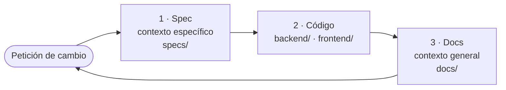

# AGENTS.md — my-story-maker

Generador de novelas históricas por agentes: convierte un brief de editor en un
manuscrito verificado.

## Alcance de esta rama (importante)

Esta rama es `v2`, un arranque desde cero. Contiene `docs/`, las specs y los
planes en `specs/`, el `backend/` implementado según los suyos y el `frontend/`
con su primera versión: encargar una obra, verla avanzar, ver lo hecho y leerla.

- Considera como fuente de verdad únicamente lo que existe en esta rama. Ignora
  `main` y cualquier historial, convención o código anterior: no aplica aquí.
- Si algo no está en `docs/` ni en esta rama, no existe todavía. No lo asumas:
  pregúntalo o propónlo explícitamente.

## Estructura del repositorio

Monorepo con dos paquetes en la raíz, los dos implementados; la frontera entre
ambos es la misma desde el principio.

| Carpeta | Qué contendrá | Pila |
| --- | --- | --- |
| `backend/` | El servidor: guarda y sirve artefactos, camina el guion encargando tareas a los agentes y expone por HTTP lo que el editor necesita ver. En `backend/formal/tla/`, el flujo de producción como máquina de estados, con el modelo que recorre TLC y el mapeo de cada acción a su función; en `backend/src/novela/lean/`, el proyecto de Lean con los invariantes de la cronología que la puerta de publicación demuestra | Python + FastAPI; TLA+; Lean 4 |
| `frontend/` | La interfaz web: encargar una obra conversando con el Entrevistador, ver cómo avanza, ver las tareas ya hechas, leer el manuscrito —con su portada, la ficha de personajes y lugares, las críticas de cada capítulo, el cambio de nombre de un hecho y la descarga en PDF— y ver las versiones para publicarlas, con un menú que salta entre las pantallas de cada obra. Se pone en pie con `npm run dev`, que arranca también el backend, y `npm run validar-visual` mira la lectura con un navegador | Vite + React + TypeScript |
| `docs/` | Documentación de referencia —el contexto general—: ontología, diagramas y arquitectura | Markdown |
| `specs/` | Las specs vivas —el contexto específico—: `SPEC1.md` para el backend y `SPEC2.md` para el frontend, con qué tiene que hacer cada uno y por qué | Markdown |
| `.env` | Fuera de git. Las claves de Langfuse de la instalación —`LANGFUSE_PUBLIC_KEY`, `LANGFUSE_SECRET_KEY` y `LANGFUSE_HOST`—, que el `backend/` lee solo al arrancar sin exportarlas. Sin ellas no se manda nada a Langfuse y la novela se escribe igual; ningún subagente de tarea las recibe | Texto |
| `.claude/` | El andamiaje de desarrollo con Claude Code: las skills, los comandos `/ciclo` y `/verificar`, el subagente `verificador` y, en `mcp.json`, el servidor de navegador que se carga a propósito con `--mcp-config`. Su guía de uso es `CLAUDE.md`, en la raíz | Markdown + JSON |

Decisiones ya tomadas sobre el reparto:

- **Frontera única.** `frontend/` nunca lee ficheros del sistema; todo lo que
  muestra lo pide al `backend/`. Así el almacén de artefactos tiene un solo
  lector y un solo escritor.
- **El contrato de esa frontera es OpenAPI.** Vive en `backend/openapi.yaml`,
  se genera desde los modelos del borde HTTP y de él deriva `frontend/` su
  cliente. No se redacta a mano: una descripción escrita aparte acabaría
  diciendo algo distinto de lo que hace el servidor.
- **El andamiaje de desarrollo no entra en la novela.** `CLAUDE.md` y `.claude/`
  son para quien desarrolla el sistema. Los doce roles también son Claude Code,
  pero el ejecutor los lanza fuera del repositorio y ninguno los lee.
- **Dos paquetes, dos gestores.** `backend/` se instala con su propio
  `pyproject.toml` y `frontend/` con su propio `package.json`. No hay
  herramienta de monorepo por encima: la raíz solo agrupa.
- **Pila fijada.** El servidor es **Python + FastAPI**, la interfaz es **Vite +
  React** y la persistencia es **SQLite con extensión vectorial compatible**.
  La base de datos vive detrás de la frontera: solo el `backend/` la abre.

Lo que queda por decidir sobre el reparto está en `architecture.md` §8, junto al
resto de decisiones abiertas.

## Documentación de referencia

Léela antes de proponer diseño o escribir código. Estos documentos son
consistentes entre sí y deben seguir siéndolo.

| Documento | Qué contiene |
| --- | --- |
| `docs/definitions.md` | La ontología del dominio en prosa: qué es una `Obra`, una `Escena`, un `Personaje`, un anacronismo. Define las dos capas del dominio —**Obra** (cómo está hecho el texto) y **Mundo** (de qué habla el texto)—, el contrato de escena, las seis familias de relaciones, los vocabularios controlados de forma y de mundo, y las dimensiones de calidad con su alcance. Es el documento del *qué*. |
| `docs/domain-knowledge.md` | Los mismos conceptos en seis diagramas Mermaid: árbol de la obra, árbol del mundo, relaciones, contrato de escena, árbol de calidad y vocabularios. No añade definiciones nuevas; sirve para ver de un vistazo lo que `definitions.md` describe. Si cambia una definición, cambia también el diagrama. |
| `docs/architecture.md` | Cómo está construido el sistema: las tres capas y su regla de acoplamiento, el censo de doce agentes con sus tareas y permisos, las entidades de producción (`Plan`, `Borrador`, `Crítica`, `Revisión`, `Decisión`, `EventoEstado`, `Resumen de capítulo`, `Traza`, `Entrevista`), las tres memorias y el presupuesto de contexto, la entrevista que completa el brief, la orquestación por guion y el ciclo de vida del capítulo, el bucle de control de calidad, la tabla de gobierno por entidad y las decisiones abiertas. Es el documento del *cómo*. |
| `docs/validators.md` | Con qué se comprueba cada cosa: el vocabulario controlado `metodo_de_verificacion` y sus cinco valores, el contrato de verificación, y el reparto dimensión por dimensión —por alcance local, de escena y capítulo, y global— con su método, el agente que la comprueba, lo que recibe y la severidad con que sale la `Crítica`. Incluye lo que no admite predicado y la verificación del propio sistema de agentes. Es el documento del *con qué se comprueba*. |

El reparto del repositorio —el *dónde*— no tiene documento propio: vive en la
sección «Estructura del repositorio» de este mismo fichero.

## Invariantes que no se rompen sin cambiar el documento

Estas reglas salen de `architecture.md` y gobiernan cualquier propuesta:

- **Tres capas disjuntas.** Obra referencia Mundo por `id` y nunca lo duplica.
  Producción observa a las otras dos; ninguna de las dos la observa a ella.
- **Un rol, una tarea.** Si aparece trabajo que ningún tipo de tarea cubre, se
  declara un rol nuevo; no se ensancha uno existente.
- **Ningún agente valida su propia salida.** Quien redacta no critica; quien
  critica no redacta.
- **El mundo solo cambia por `EventoEstado`**, y solo el Contable de estado los
  emite, al cerrar un capítulo. Nada de escritura directa del redactor.
- **El estado no se almacena, se deriva** plegando el log de eventos hasta el
  capítulo N.
- **Solo el Documentalista escribe `Fuente`.** Un dato histórico sin `Fuente`
  es, por definición, una alucinación.
- **Toda `Crítica` lleva evidencia citable**; sin ella se descarta.
- **Sin harness a medida.** El estado vive en artefactos declarativos legibles
  por los agentes, no en objetos tipados en memoria.
- **100 000 tokens de contexto a la vez.** El techo es de concurrencia: en
  cualquier instante, la suma del contexto que ocupan los agentes que están
  corriendo simultáneamente no puede pasar de 100 000 tokens. **Cuenta solo la
  entrada**: lo que se le manda a cada agente abierto. Lo que el agente escribe
  de vuelta se paga en coste, no ocupa techo. No es un presupuesto por agente ni
  un gasto acumulado: el agente que termina libera su parte, así que una cadena
  secuencial larga no lo agota por larga que sea. Lo que lo agota es abrir
  demasiados frentes en paralelo.

## El ciclo de edición

Todo cambio recorre el mismo círculo, siempre en el mismo orden. Ninguna fase
empieza hasta que la anterior ha cerrado, y un ciclo no está cerrado hasta que
vuelve al principio.

### Fase 1 — Edición de la spec

Abre el ciclo. La spec es el **contexto específico**: qué se cambia en este
cambio concreto y por qué. Hay **una sola spec viva**, `specs/SPEC1.md`, que
describe cómo tiene que ser el backend ahora. Cada cambio la enmienda y le sube
el número de versión de la cabecera, y en el mismo movimiento suben
`backend/pyproject.toml` y `novela/__init__.py`, que van siempre al mismo
número. El registro de por qué el sistema es como es lo lleva el historial de
git; `specs/` no crece con un documento por cambio.

1. **Interrogatorio.** Antes de escribir una línea, el agente invoca la skill
   `grill-me` y pregunta el porqué del cambio: qué problema real resuelve, qué
   alternativa se descarta y qué regla existente choca con él. Este es el
   **único punto del ciclo en el que se interrumpe al humano**; de aquí en
   adelante se ejecuta.
2. **Redacción.** El agente enmienda la spec: el problema, la decisión tomada
   con su justificación, lo que queda fuera y qué documentos de `docs/` habrá
   que poner al día en la fase 3. Lo que el cambio retira sale del documento en
   la misma enmienda. Centrada en decisiones: lo que se puede resolver
   razonablemente al implementar no va en la spec.
3. **Aprobación.** Sin spec aprobada no hay fase 2.

Si la razón dada no sostiene el cambio, el agente lo dice en lugar de escribir
la spec.

### Fase 2 — Edición del código

No arranca sin spec aprobada. El agente implementa **lo que la spec dice y nada
más**: `backend/`, `frontend/` o ambos en el mismo cambio si la frontera entre
ellos lo exige.

Antes de escribir código, el agente abre la skill de la parte de la pila que va
a tocar: `fastapi` para `backend/`, `frontend-react` para `frontend/` y
`backend-sqlite` para todo lo que sea base de datos, más `sqlite-vec` cuando
haya embeddings o búsqueda por parecido. Son obligatorias, no dependen de que
la spec las nombre.

Si al programar aparece algo que la spec no cubre —una decisión de fondo, no un
detalle de implementación— **se vuelve a la fase 1** y se amplía la spec. No se
improvisa sobre la marcha ni se deja anotado para después.

La fase cierra cuando el código hace lo que la spec dice **y se ha
comprobado contra `docs/validators.md`** según la regla de abajo.

### Fase 3 — Edición de los docs

No arranca hasta que el código cierra. Aquí lo decidido en la spec se destila en
el **contexto general** de `docs/`, que describe el sistema tal como es ahora:

| Si el cambio tocó… | Se actualiza |
| --- | --- |
| La ontología, una entidad o un vocabulario | `definitions.md` y el diagrama correspondiente de `domain-knowledge.md`, en el mismo cambio |
| Las capas, los agentes, las entidades de producción o el flujo | `architecture.md` |
| Una decisión abierta que queda cerrada | `architecture.md` §8, retirándola de la lista |
| El reparto del repositorio | La sección «Estructura del repositorio» de este fichero |

Los docs **describen el estado actual, no la historia**: lo que se retira
desaparece del documento, no se narra como pasado. Al terminar, la spec y los
docs cuentan lo mismo que hace el código y el ciclo se cierra.

### La ventana de divergencia

La spec aprobada es la fuente de verdad mientras el ciclo está abierto. Los
documentos de `docs/` pueden ir por detrás del código **desde que la spec se
aprueba hasta que la fase 3 cierra, y solo en esa ventana**.

Esa ventana no se acumula: **no se enmienda la spec otra vez con la enmienda
anterior sin destilar**. Y cerrarla es trabajo del agente: la fase 3 no es un
recordatorio que el humano tenga que ejecutar.

## Cómo trabajar aquí

- **Nada se da por bueno sin verificarlo contra `docs/validators.md`.**
  Todo lo que el agente entrega —la spec, el código y los docs— se comprueba
  antes de cerrarlo: para cada cosa producida se busca en `validators.md` con
  qué método le toca comprobarse y se aplica ese método, con su predicado, su
  proyección mínima y su evidencia citable. Si lo entregado no tiene método
  asignado, se le asigna uno con la skill `disenar-verificacion` y se registra
  en `validators.md` en la fase 3; declararlo `inverificable` es una respuesta
  válida, inventarse una comprobación no lo es. Una comprobación sin evidencia
  citable no cuenta como verificación.
- **Español** en documentación, commits y nombres de entidad.
- **Nombres:** entidades en `PascalCase` singular (`Escena`, `EventoEstado`);
  relaciones en `snake_case` con verbo orientado (`ocurre_en`, `paga_setup`).
- **Regla de corte de la ontología:** si un atributo no lo lee ningún agente ni
  lo comprueba ningún validador, no se modela.
- **Nada de texto libre donde hay vocabulario controlado.** Los valores cerrados
  son lo que hace computables los predicados de calidad.
- **Todo cambio pasa por el ciclo de edición**: spec, código y docs, en ese
  orden y sin saltarse ninguna fase. Qué documento se actualiza al final lo
  decide la tabla de la fase 3.
- **Las decisiones abiertas de `architecture.md` §8 están abiertas de verdad.**
  No las cierres por tu cuenta dentro de un cambio de código: propón el cierre,
  espera la decisión y regístrala.
