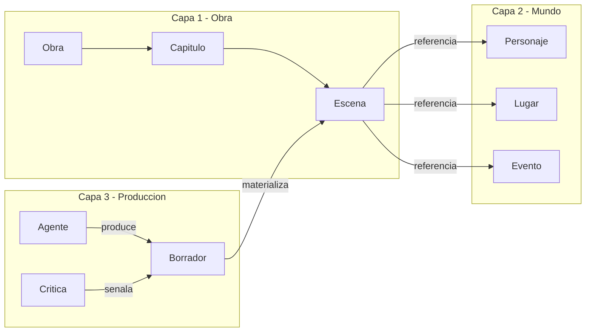
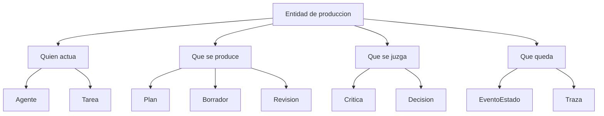
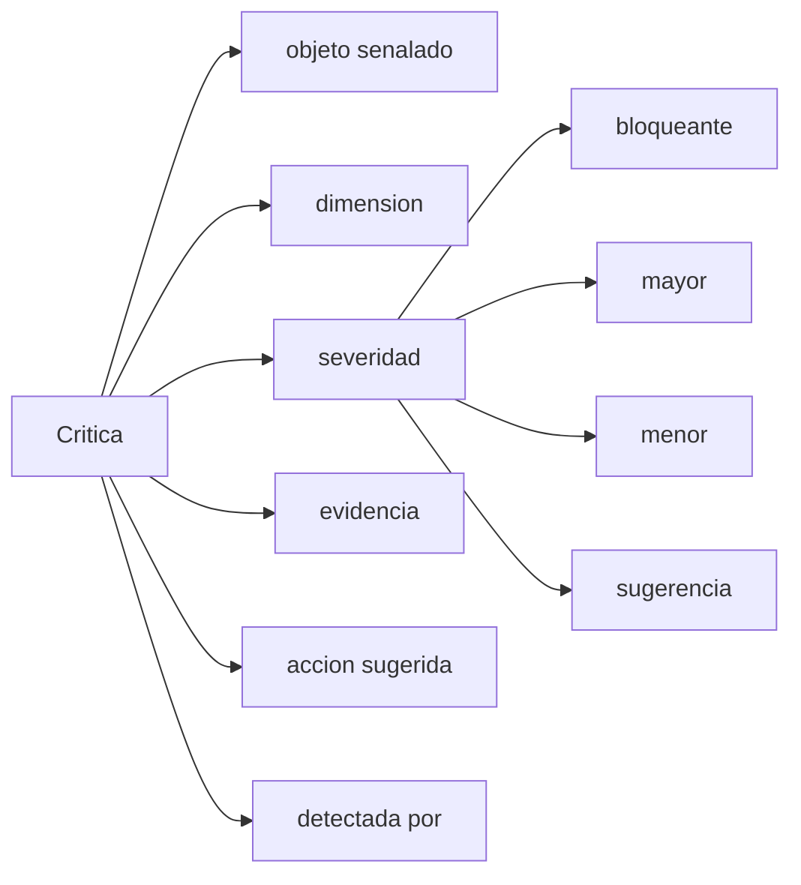
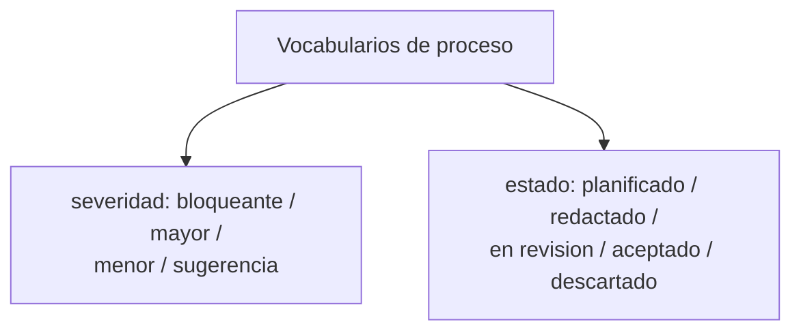
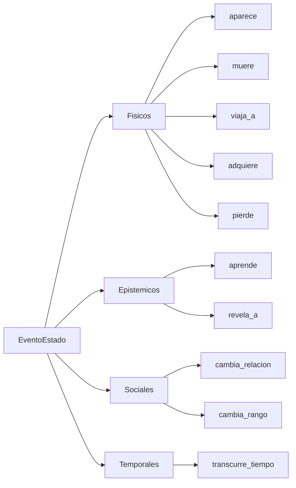
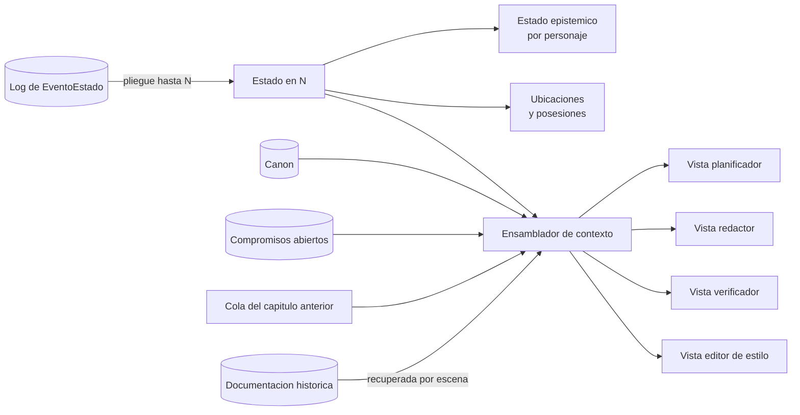
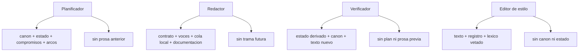

# Arquitectura del sistema de generación de novela histórica

2026-09-21 · [NOMBRE_ANONIMIZADO]

## Qué contiene este documento

Todo lo relativo a **cómo está construido el sistema**: la separación en capas y su regla de acoplamiento, las entidades de producción, la gestión de contexto por rol, el ciclo de vida de un capítulo, el bucle de control de calidad, el gobierno por entidad y las notas de implementación.

El vocabulario del dominio —qué es una escena, un personaje, un anacronismo— vive en `definitions.md`, y sus diagramas en `domain-knowledge.md`. Este documento referencia esas entidades, no las define.

El reparto del repositorio —qué va en `backend/`, qué va en `frontend/` y dónde está la frontera entre ambos— está en la sección «Estructura del repositorio» de `AGENTS.md`, en la raíz. Este documento describe el sistema, no dónde se guardan sus ficheros.

## 1. Arquitectura en tres capas

El dominio se parte en tres capas disjuntas, y la mayoría de los fallos de diseño vienen de mezclarlas.

| Capa | Qué contiene | Pregunta que responde | Quién la escribe |
| --- | --- | --- | --- |
| 1. Obra | Unidades textuales: obra, parte, capítulo, escena, beat, párrafo | ¿Cómo está hecho el texto? | Planificador y redactor |
| 2. Mundo | Referentes: personajes, lugares, eventos, objetos, instituciones, cronología | ¿De qué habla el texto? | Constructor de mundo y documentalista |
| 3. Producción | Agentes, tareas, planes, borradores, críticas, decisiones | ¿Cómo se ha llegado hasta aquí? | El harness |

**Regla de acoplamiento.** La capa 1 *referencia* entidades de la capa 2 por id, nunca las duplica; la capa 3 referencia a ambas y ninguna de las dos la referencia a ella.

**Qué pasa si se mezclan.** Si un `Personaje` guarda su descripción física junto al párrafo donde aparece, no se puede comprobar continuidad entre capítulos. Si el estado del mundo se guarda como prosa dentro del capítulo, no se puede derivar ni diferenciar. Si las críticas viven en el chat y no como entidades, no se puede medir si el bucle de revisión converge.

La dirección importa: la capa 1 referencia la 2 por id y nunca la duplica; la capa 3 observa a las otras dos y ninguna la observa a ella.

## 2. Capa de producción

Esta capa convierte el sistema multiagente en algo inspeccionable. Es la que permite responder por qué el capítulo 12 quedó así y si el bucle de revisión está convergiendo.

**Agente.** Rol de generación o evaluación. Atributos: nombre, función, entidades que puede leer, entidades que puede escribir, política de contexto, modelo y parámetros. La separación lectura/escritura es lo que evita que el redactor se autoevalúe.

**Tarea.** Unidad de trabajo encargada a un agente. Atributos: tipo, objeto sobre el que actúa, entradas, criterio de aceptación, intento número.

### Censo de agentes

Diez roles. **Cada rol tiene exactamente un tipo de tarea y cada tipo de tarea tiene exactamente un rol**: si aparece trabajo que ningún tipo cubre, se declara un rol nuevo, no se ensancha uno existente. Todo lo que el sistema hace lo hace un agente; no hay lógica de negocio fuera de esta tabla.

| Agente | Tipo de tarea | Qué escribe | Alcance | Cuándo actúa |
| --- | --- | --- | --- | --- |
| Constructor de mundo | `poblar_mundo` | `Personaje`, `Lugar`, `Objeto`, `Facción` | Obra | Arranque y ampliación bajo demanda |
| Documentalista | `documentar` | `Fuente`, `Concepto`, `Práctica`, `Registro lingüístico` | Escena | Antes de planificar y antes de redactar |
| Arquitecto de arcos | `auditar` | `Crítica` de alcance global | Obra | Cada N capítulos y al cierre |
| Planificador | `planificar` | `Plan`, `Capítulo`, contratos de `Escena`, `Compromiso` | Capítulo | Al abrir capítulo |
| Redactor | `redactar` | `Borrador`, `Párrafo` | Escena o capítulo | Tras plan aceptado |
| Contable de estado | `plegar` | `EventoEstado`, estado en N | Cierre de capítulo | Al pasar de `Aceptado` a `Cerrado` |
| Verificador de continuidad | `verificar` | `Crítica` de alcance escena y capítulo | Capítulo | Sobre cada borrador nuevo |
| Editor de estilo | `editar_estilo` | `Crítica` local, `Borrador` de superficie | Párrafo | Sobre cada borrador nuevo |
| Juez de rúbrica | `juzgar` | `Crítica` ruidosa, marcada aparte | Escena y capítulo | Solo en dimensiones no formulables como predicado |
| Revisor | `revisar` | `Revisión`, `Borrador` | Escena o capítulo | Con críticas `mayor` pendientes |

Dos roles estaban antes implícitos y ahora son explícitos: el **Constructor de mundo**, que escribía la capa 2 sin tener tarea ni vista, y el **Revisor**, que modificaba capítulos y escenas sin estar declarado. Dos son nuevos: el **Contable de estado**, que absorbe el pliegue del log que antes hacía una función pura, y el **Juez de rúbrica**, que antes aparecía como "juez LLM" sin ser un rol.

Reglas de integridad del censo:

- Ningún agente valida su propia salida: el Redactor no emite `Crítica`, y ni Verificador ni Editor de estilo ni Juez escriben `Borrador`.
- Solo el Contable de estado emite `EventoEstado`. Es el único punto por el que el mundo cambia.
- Solo el Documentalista escribe `Fuente`. Un dato sin `Fuente` escrita por él es una alucinación por definición.
- El Revisor aplica críticas ajenas; no puede crear las suyas.

**Plan.** Descomposición previa a la escritura: esqueleto de capítulo, lista de escenas con sus contratos, asignación de compromisos. Es la salida del planificador y la entrada del redactor.

**Borrador.** Versión de un texto. Atributos: texto, unidad a la que corresponde, número de versión, tarea que lo produjo, estado (candidato, aceptado, descartado).

**Crítica.** Defecto detectado. Modelada como entidad de primera clase, nunca como texto libre:

| Campo | Contenido |
| --- | --- |
| `objeto` | Id de la unidad señalada (párrafo, escena, capítulo, arco) |
| `dimension` | Dimensión de calidad vulnerada |
| `severidad` | Bloqueante, mayor, menor, sugerencia |
| `evidencia` | Fragmento o predicado que falla |
| `accion_sugerida` | Qué cambiar |
| `detectada_por` | Agente que la emitió y contrato de verificación aplicado |

Sin esta estructura no se puede medir si el bucle de revisión converge o gira en vacío.

**Revisión.** Aplicación de una o varias críticas sobre un borrador, produciendo otro. Atributos: críticas atendidas, críticas rechazadas con motivo, diferencia respecto al borrador anterior.

**Decisión.** Elección de diseño registrada y sus alternativas descartadas: nombre de un personaje, licencia histórica asumida, giro elegido. Evita que el sistema reabra lo ya cerrado.

**EventoEstado.** Hecho atómico emitido por un capítulo al cerrarse, que modifica el mundo. Es la pieza central de la gestión de contexto: el estado del mundo en el capítulo N no se almacena, se deriva plegando estos eventos.

**Traza.** Registro por tarea de contexto enviado, salida obtenida, coste y latencia. Necesario para el trabajo académico: es lo que permite medir el sistema, no solo la novela.

### Vocabularios de proceso

Valores cerrados de la capa de producción. Los vocabularios de forma textual y de mundo están en `definitions.md`.

**Severidad de crítica:** `bloqueante`, `mayor`, `menor`, `sugerencia`.

**Estado de producción:** `planificado`, `redactado`, `en_revision`, `aceptado`, `descartado`.

**Tipo de EventoEstado:** `aparece`, `muere`, `viaja_a`, `adquiere`, `pierde`, `aprende` (cambio epistémico), `revela_a`, `cambia_relacion`, `cambia_estado_civil_o_rango`, `transcurre_tiempo`.

Cerrar estos vocabularios es lo que hace computables los predicados de calidad. Un atributo en texto libre es un atributo que ningún validador puede comprobar.

## 3. Gestión de contexto

La pregunta operativa no es qué sabe el sistema, sino **qué proyección de la ontología recibe cada agente en cada paso**. El contexto es una vista sobre el grafo, y cada rol necesita una distinta.

### Los cinco materiales y su política de residencia

| Material | Qué es | Política |
| --- | --- | --- |
| Canon | Hechos inmutables del mundo y decisiones ya cerradas | Siempre presente, comprimido, nunca reescrito por el redactor |
| Estado en N | Dónde está cada quien, qué sabe, qué posee, qué debe | Derivado, no almacenado: pliegue de los `EventoEstado` hasta N |
| Compromisos abiertos | Pistas plantadas sin pagar, subtramas vivas, promesas al lector | Siempre presente; cola ordenada por vencimiento |
| Continuidad local | Cola literal de los últimos párrafos del capítulo anterior | Siempre presente en crudo: el estilo se contagia por adyacencia |
| Documentación | Fuentes, detalle material, léxico de época | Recuperado por escena, filtrado por fecha y lugar |

### Estado como pliegue, no como campo mutable

Cada capítulo, al cerrarse, emite `EventoEstado` tipados. El estado en el capítulo N se computa reduciendo el log de eventos hasta N. Esto da tres cosas que un campo mutable no da: reproducibilidad, diferencia legible entre versiones, y la posibilidad de regenerar el capítulo 12 sin corromper el 13.

**El pliegue es incremental y lo hace el Contable de estado.** No relee el log entero: recibe el estado en N-1 ya materializado y los `EventoEstado` del capítulo N, y emite el estado en N. Esto es lo que hace el pliegue viable sin código: la tarea no crece con la longitud de la obra, siempre es "un estado más un puñado de eventos". Si se regenera el capítulo 12, se descartan los estados materializados de 12 en adelante y se repliega hacia delante capítulo a capítulo.

Corolario práctico: el estado epistémico de cada personaje es una proyección del mismo log filtrando eventos `aprende` y `revela_a`. No hace falta modelarlo aparte.

### Proyecciones por rol

Cada agente recibe una vista distinta, y algunas exclusiones son tan importantes como las inclusiones.

| Agente | Ve | No ve | Por qué |
| --- | --- | --- | --- |
| Constructor de mundo | Obra, premisa, elenco declarado, fuentes ya recogidas | Plan, prosa, estado en N | Puebla tipos, no reacciona a la trama |
| Documentalista | Marco de la escena, fuentes | Trama futura | Evita sesgar el dato hacia lo conveniente |
| Arquitecto de arcos | Resúmenes de todos los capítulos, compromisos, curva de tensión | Prosa completa | Opera a escala de obra |
| Planificador | Canon, estado en N, compromisos abiertos, arcos | Prosa anterior | Planifica estructura, no imita estilo |
| Redactor | Contrato de escena, voces del elenco presente, continuidad local, documentación recuperada | Trama futura, críticas previas de otras escenas | Escribe desde dentro de la escena |
| Contable de estado | Estado en N-1, texto aceptado del capítulo N, vocabulario de eventos | Plan, críticas, canon completo | Transcribe hechos ocurridos, no los interpreta |
| Verificador de continuidad | Estado derivado, canon, texto producido | Prosa anterior, intención del plan | Compara hechos, no impresiones |
| Editor de estilo | Texto producido, registro, léxico vetado | Canon, estado | Juzga superficie |
| Juez de rúbrica | Texto producido, rúbrica de la dimensión juzgada | Canon, estado, críticas de otros | Su ruido no debe contagiar al resto |
| Revisor | Borrador, críticas a atender, contrato de la unidad | Críticas de otras unidades, trama futura | Corrige lo señalado, no reescribe la obra |

El verificador que ve la prosa anterior se ancla en ella y deja pasar los fallos que esa prosa ya contenía.

### Presupuesto

El contexto se dimensiona por rol, no globalmente. Reglas de compresión: el canon se mantiene como fichas cortas y estables; los capítulos anteriores entran como resumen estructurado (eventos + cambios de estado), nunca como prosa completa, salvo la cola de continuidad local; la documentación entra solo la recuperada para esa escena y se descarta al cerrarla.

## 4. Ciclo de vida de un capítulo

El paso de `Aceptado` a `Cerrado` es el que actualiza el mundo: hasta que un capítulo no se cierra, sus eventos no existen para el resto del sistema. Eso es lo que permite regenerar un capítulo sin corromper los siguientes.

## 5. Bucle de control de calidad

**Estrategia de validación.** Toda dimensión de calidad debe seguir expresándose como predicado sobre entidades de la ontología: "continuidad" no es un juicio, es `∀ escena: estado_implicado ⊆ estado_derivado`. Lo que cambia aquí es quién evalúa el predicado. No hay validadores deterministas: el predicado se entrega a un agente como **contrato de verificación**, es decir, un enunciado comprobable más los datos exactos que se necesitan para comprobarlo y nada más.

Un contrato de verificación tiene tres partes: el predicado en una frase, la proyección mínima sobre la que se evalúa, y la forma exacta de la `Crítica` que debe emitir si falla. El agente no opina sobre el texto; responde si el predicado se cumple y, si no, señala la entidad concreta. Esa es la diferencia entre el Verificador y el Juez de rúbrica: el primero evalúa predicados, el segundo puntúa lo que no admite predicado.

**Tres reglas que sustituyen a lo que antes garantizaba el código:**

1. **Una dimensión por tarea.** Un agente al que se le piden siete comprobaciones a la vez encuentra las dos primeras. El Verificador se invoca una vez por dimensión, con la proyección de esa dimensión.
2. **Evidencia obligatoria.** Una `Crítica` sin `evidencia` citable —el fragmento o la entidad que falla— se descarta sin llegar al Revisor. Es lo que impide que el bucle se llene de impresiones.
3. **Doble pasada en desacuerdo.** Si dos agentes discrepan sobre el mismo predicado, se repite la comprobación con la proyección reducida al mínimo. Si persiste, la `Crítica` baja a `sugerencia` y se registra como caso ambiguo.

**Enrutado por severidad.** `bloqueante` fuerza regeneración de la escena; `mayor` entra en revisión dirigida; `menor` y `sugerencia` se acumulan para una pasada de pulido.

**Métrica del sistema.** Registrar cuántas iteraciones necesita cada capítulo, qué dimensiones reinciden y cuántas críticas se descartan por falta de evidencia es lo que hace evaluable el sistema, no solo la novela. Con validación agéntica esta métrica importa más, no menos: es la única prueba de que el bucle converge.

## 6. Tabla de gobierno por entidad

Esta tabla es lo que conecta la ontología con el harness: quién crea cada entidad, quién puede modificarla, cuándo entra en contexto y qué la vigila. Sin ella la ontología es decorativa.

| Entidad | La crea | La modifica | Entra en contexto | Vigilada por |
| --- | --- | --- | --- | --- |
| `Obra` | Usuario | Usuario | Siempre, comprimida | — |
| `Personaje` | Constructor de mundo | Solo por `EventoEstado` del Contable | Si está en el elenco de la escena | Continuidad, voz |
| `Lugar` | Constructor de mundo | Constructor, por ampliación | Si es marco de la escena | Coherencia temporal |
| `Evento` | Planificador o documentalista | Inmutable si es `canon` | Si precede causalmente a la escena | Anacronismo, causalidad |
| `Objeto` | Constructor de mundo | Solo por `EventoEstado` del Contable | Si aparece o lo posee el elenco | Continuidad, anacronismo material |
| `Concepto` y `Práctica` | Documentalista | Documentalista | Filtrado por fecha y lugar | Anacronismo conceptual y social |
| `Fuente` | Documentalista | Inmutable | Junto al dato que respalda | Cobertura documental |
| `Capítulo` | Planificador | Revisor | Resumen siempre; texto solo el anterior | Ritmo, arcos |
| `Escena` | Planificador | Revisor | Contrato completo al redactar | Contrato, POV, epistémica |
| `Párrafo` | Redactor | Editor de estilo | Cola de continuidad local | Fatiga léxica, voz, léxico |
| `EventoEstado` | Contable de estado, al cerrar capítulo | Inmutable | Nunca directo: se pliega en estado | Consistencia del log |
| `Compromiso` | Planificador y redactor | Se cierra al pagarse | Siempre, cola abierta | Economía narrativa |
| `Crítica` | Verificador, Editor de estilo, Arquitecto de arcos, Juez | Se resuelve en revisión | Solo al agente que revisa | Convergencia del bucle |
| `Decisión` | Cualquier agente | Inmutable | Canon comprimido | Coherencia de diseño |

Dos reglas que la tabla implica y conviene explicitar: ninguna entidad del mundo se modifica por escritura directa del redactor, solo mediante eventos emitidos al cerrar un capítulo; y ningún agente valida su propia salida.

## 7. Notas de implementación

**Principio.** No hay harness a medida. El sistema es un conjunto de agentes, un formato de artefacto y un protocolo de paso de testigo entre ellos. Lo que antes era una función es ahora un rol con contrato.

**Representación: artefactos, no objetos.** El estado vive en ficheros declarativos legibles por los agentes, no en modelos tipados en memoria. Un árbol posible: `mundo/` con una ficha por entidad, `obra/` con plan y borradores por capítulo, `log/` con un fichero de `EventoEstado` por capítulo cerrado, `estado/` con el estado materializado en N, `criticas/` abiertas y resueltas. El esquema de cada artefacto se declara en prosa estructurada dentro de la propia ontología; el vocabulario controlado hace de validación de tipos.

**Quién impone la forma.** Sin Pydantic, lo que garantiza que un artefacto esté bien formado es que el agente que lo escribe tenga el esquema en su contexto y que el siguiente agente lo rechace si falta un campo. El rechazo es una `Crítica` de severidad `bloqueante` con objeto el artefacto, no el texto. Conviene medir cuántos artefactos malformados aparecen por capítulo: es el indicador temprano de que un rol necesita más ejemplos o menos alcance.

**Orquestación.** El ciclo de vida del capítulo es la máquina de estados de la sección 4, y la transición la decide el agente que acaba de actuar declarando su salida y el siguiente estado. Si un rol necesita decidir a quién llamar, ese enrutado es también un contrato explícito, no lógica repartida.

**Granularidad de la escena.** Generar por escena da mejor control de calidad; generar por capítulo da mejor continuidad de voz. La opción mixta es planificar por escena y redactar el capítulo entero con los contratos de todas sus escenas en contexto.

### Qué se pierde sin cálculo determinista

Tres dimensiones dejan de ser fiables al pasar a agentes, y conviene decirlo en el trabajo académico antes de que lo diga el tribunal.

| Dimensión | Por qué falla | Cómo se compensa dentro del sistema |
| --- | --- | --- |
| Coherencia temporal | Aritmética de calendario y distancias: sumar días, comparar duraciones, detectar un viaje imposible. Es exactamente lo que peor hace un modelo de lenguaje, y falla en silencio | El Contable emite en cada `EventoEstado` la fecha y el lugar resultantes ya calculados y explícitos. El Verificador compara dos valores escritos en lugar de calcularlos |
| Fatiga léxica | Exige contar frecuencias de lemas sobre todo el corpus previo. Un agente no puede contar 300 páginas y estimarlo a ojo no es una medida | El Editor de estilo mantiene un registro acumulado de imágenes y muletillas ya usadas, actualizado al cerrar cada capítulo, y comprueba contra esa lista en vez de contra el texto |
| Léxico vetado | Cotejo exhaustivo contra una lista larga. Un agente revisa bien veinte términos, no mil | Lista corta y priorizada por capítulo, derivada del `Registro lingüístico` de las escenas en juego, no la lista global |

En los tres casos el patrón es el mismo: **convertir un cálculo en un dato escrito por el agente que tiene el contexto para producirlo**. Funciona, pero desplaza el riesgo de "el código puede tener un bug" a "el dato escrito puede ser falso y nadie lo recalcula". La métrica de reincidencia por dimensión es la que detecta eso.

## 8. Decisiones abiertas

- [ ] ¿El estado epistémico del lector se modela explícitamente o se deriva de lo aparecido en texto?
- [ ] ¿Los `Compromiso` los declara el planificador o se extraen del texto tras redactar?
- [ ] ¿Qué umbral de severidad dispara regeneración completa frente a revisión dirigida?
- [ ] ¿La lista de léxico vetado se construye a mano, se deriva de corpus de época, o ambas?
- [ ] ¿Se versiona la biblia junto a la novela o evoluciona monotónicamente?
- [ ] ¿El Contable de estado es un rol con su propio modelo y temperatura baja, o el mismo modelo que el resto con otro contrato?
- [ ] ¿Quién arbitra cuando Verificador y Juez discrepan de forma sistemática en una dimensión?
- [ ] ¿El enrutado del ciclo de vida lo decide cada agente al terminar, o hace falta un rol coordinador que rompería la simetría del censo?
- [ ] ¿Se acepta alguna herramienta externa de cálculo (fechas, recuento léxico) sin que eso cuente como harness, o la restricción de cero código es absoluta?
- [ ] ¿Dónde vive el almacén de artefactos (`mundo/`, `obra/`, `log/`, `estado/`, `criticas/` de §7) dentro del reparto de `AGENTS.md`, y quién lo escribe?
- [ ] ¿Los prompts de los diez agentes son parte del `backend/` o una carpeta hermana?
