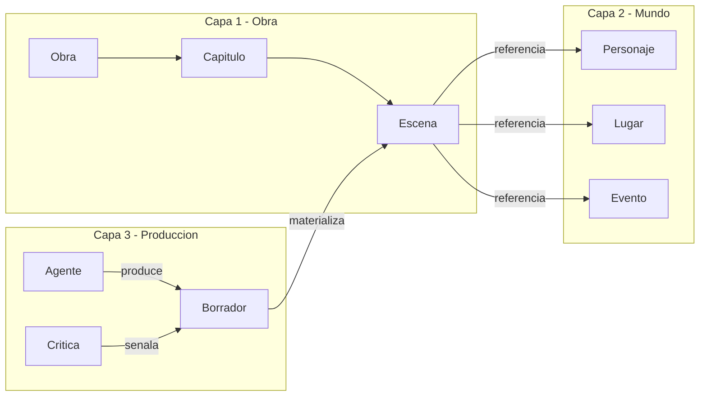
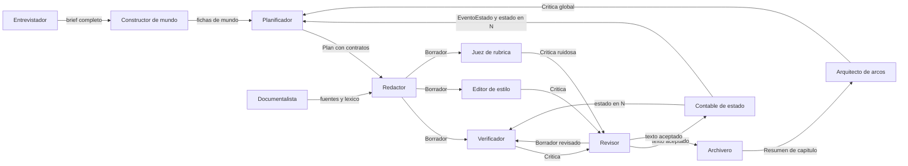
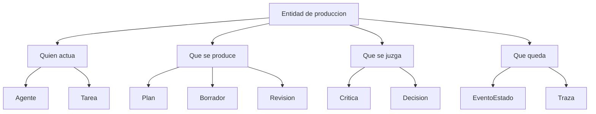
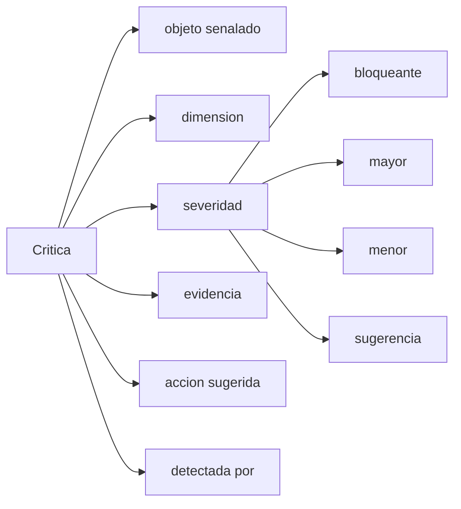
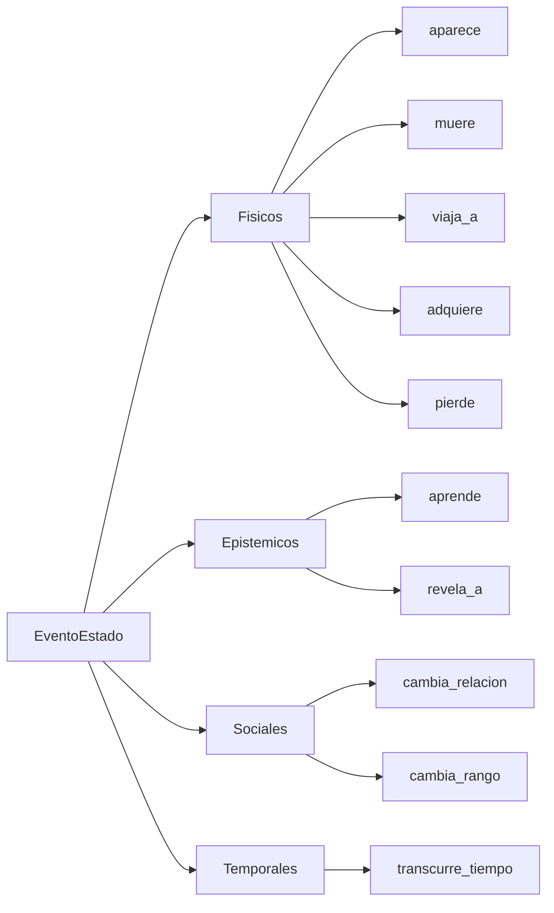
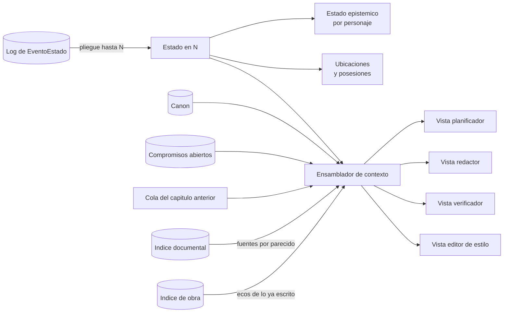
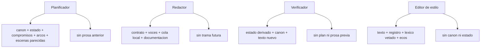
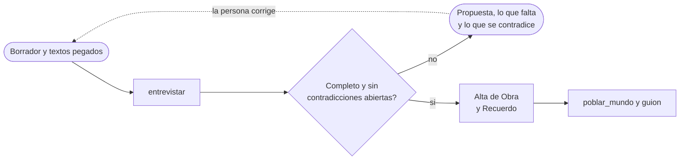
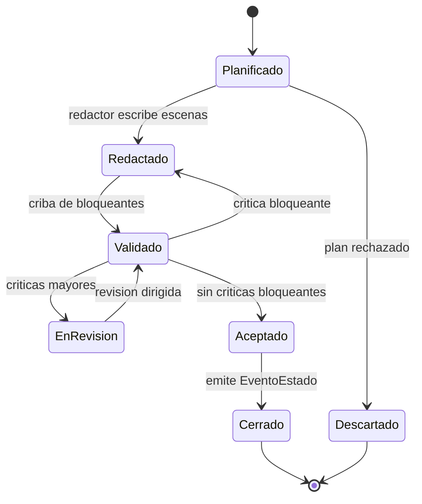

# Arquitectura del sistema de generación de novela histórica

2026-09-21 · [NOMBRE_ANONIMIZADO]

## Qué contiene este documento

Todo lo relativo a **cómo está construido el sistema**: la separación en capas y su regla de acoplamiento, las entidades de producción, la gestión de contexto con sus tres memorias y su recuperación por parecido, la orquestación por guion y el ciclo de vida de un capítulo, el bucle de control de calidad, el gobierno por entidad, la organización del código dentro de cada paquete y las notas de implementación.

El vocabulario del dominio —qué es una escena, un personaje, un anacronismo— vive en `definitions.md`, y sus diagramas en `domain-knowledge.md`. Este documento referencia esas entidades, no las define.

El reparto del repositorio —qué va en `backend/`, qué va en `frontend/` y dónde está la frontera entre ambos— está en la sección «Estructura del repositorio» de `AGENTS.md`, en la raíz. Aquí se describe el escalón siguiente: cómo se organiza el código **dentro** de cada uno de esos dos paquetes, en §7.

## 1. Arquitectura en tres capas

El dominio se parte en tres capas disjuntas, y la mayoría de los fallos de diseño vienen de mezclarlas.

| Capa | Qué contiene | Pregunta que responde | Quién la escribe |
| --- | --- | --- | --- |
| 1. Obra | Unidades textuales: obra, parte, capítulo, escena, beat, párrafo, y las menciones que dicen qué hechos del mundo nombra cada capítulo | ¿Cómo está hecho el texto? | Planificador y redactor; las menciones, el archivero |
| 2. Mundo | Referentes: personajes, lugares, eventos, objetos, instituciones, cronología | ¿De qué habla el texto? | Constructor de mundo y documentalista |
| 3. Producción | Agentes, tareas, planes, borradores, críticas, decisiones | ¿Cómo se ha llegado hasta aquí? | El harness |

**Regla de acoplamiento.** La capa 1 *referencia* entidades de la capa 2 por id, nunca las duplica; la capa 3 referencia a ambas y ninguna de las dos la referencia a ella.

**Qué pasa si se mezclan.** Si un `Personaje` guarda su descripción física junto al párrafo donde aparece, no se puede comprobar continuidad entre capítulos. Si el estado del mundo se guarda como prosa dentro del capítulo, no se puede derivar ni diferenciar. Si las críticas viven en el chat y no como entidades, no se puede medir si el bucle de revisión converge.



La dirección importa: la capa 1 referencia la 2 por id y nunca la duplica; la capa 3 observa a las otras dos y ninguna la observa a ella.

## 2. Capa de producción

Esta capa convierte el sistema multiagente en algo inspeccionable. Es la que permite responder por qué el capítulo 12 quedó así y si el bucle de revisión está convergiendo.

**Agente.** Rol de generación o evaluación. Atributos: nombre, función, entidades que puede leer, entidades que puede escribir, política de contexto, modelo y parámetros. La separación lectura/escritura es lo que evita que el redactor se autoevalúe.

**Tarea.** Unidad de trabajo encargada a un agente. Atributos: tipo, objeto sobre el que actúa, entradas, criterio de aceptación, intento número.

### Censo de agentes

Doce roles. **Cada rol tiene exactamente un tipo de tarea y cada tipo de tarea tiene exactamente un rol**: si aparece trabajo que ningún tipo cubre, se declara un rol nuevo, no se ensancha uno existente. Todo lo que el sistema hace lo hace un agente; no hay lógica de negocio fuera de esta tabla.

| Agente | Tipo de tarea | Alcance | Cuándo actúa |
| --- | --- | --- | --- |
| Constructor de mundo | `poblar_mundo` | Obra | Arranque y ampliación bajo demanda |
| Documentalista | `documentar` | Escena | Antes de planificar y antes de redactar |
| Arquitecto de arcos | `auditar` | Obra | Cada N capítulos y al cierre |
| Planificador | `planificar` | Capítulo | Al abrir capítulo |
| Redactor | `redactar` | Escena | Tras plan aceptado, una escena por encargo |
| Contable de estado | `plegar` | Cierre de capítulo | Al pasar de `Aceptado` a `Cerrado` |
| Verificador de continuidad | `verificar` | Escena y capítulo | En cada criba, una tarea por dimensión |
| Editor de estilo | `editar_estilo` | Párrafo y capítulo | Al coser el capítulo y en la criba de pulido |
| Juez de rúbrica | `juzgar` | Escena y capítulo | En la criba de pulido, solo en lo no formulable como predicado |
| Revisor | `revisar` | Escena o capítulo | Con críticas `mayor` pendientes |
| Archivero | `destilar` | Capítulo | Al cerrar capítulo, después del Contable |
| Entrevistador | `entrevistar` | Brief | Antes de que la obra exista, una pasada cada vez que quien la encarga manda su borrador |

Dos roles estaban antes implícitos y ahora son explícitos: el **Constructor de mundo**, que escribía la capa 2 sin tener tarea ni vista, y el **Revisor**, que modificaba capítulos y escenas sin estar declarado. Dos son nuevos: el **Contable de estado**, que absorbe el pliegue del log que antes hacía una función pura, y el **Juez de rúbrica**, que antes aparecía como "juez LLM" sin ser un rol.

Reglas de integridad del censo:

- Ningún agente valida su propia salida: el Redactor no emite `Crítica`, y ni el Verificador ni el Juez escriben `Borrador`. El Editor de estilo es el único que hace las dos cosas, y por eso el guion las separa en dos pasos distintos: cose el capítulo en el paso 7 escribiendo un `Borrador` de superficie, y en el paso 8 comprueba predicados de superficie sobre el texto ya cosido. Sin esa costura, lo que el paso 7 produjera serían críticas que ningún paso posterior aplica.
- Solo el Contable de estado emite `EventoEstado`. Es el único punto por el que el mundo cambia.
- Solo el Documentalista escribe `Fuente`. Un dato sin `Fuente` escrita por él es una alucinación por definición. Es además el único rol que trae material de fuera del sistema: ningún otro busca ni lee nada que no esté ya en el almacén.
- Ningún rol escribe `Recuerdo`. Llega con el encargo y es inmutable, que es lo que deja intacta la regla anterior: si el respaldo de una persona pudiera escribirse desde dentro, «dato sin `Fuente`» dejaría de ser sinónimo de alucinación.
- El Revisor aplica críticas ajenas; no puede crear las suyas.
- El Archivero no escribe hechos del mundo ni prosa: resume el capítulo cerrado, anota qué hechos de la biblia nombra y retira lo que caduca. No decide nada sobre el texto. Anotar una `Mención` no toca la ficha del hecho, así que el mundo sigue cambiando solo por `EventoEstado`.
- El Entrevistador no escribe ninguna entidad: devuelve una propuesta de brief. De un texto pegado solo vale lo que trae cita literal, y un recuerdo es esa misma cita, así que tampoco él escribe `Recuerdo`: el recuerdo es texto de la persona, no del agente.

**Fuera del censo: el juez de la novela.** Junto a los doce hay un evaluador externo que no es un rol: no tiene carpeta en `tareas/`, no escribe nada en el almacén, no está en el guion ni en la API y no toma parte en la producción. Quien desarrolla lo lanza a mano, con `novela.juez_de_la_novela.juzgar_version`, sobre una versión terminada, y puntúa la novela entera con tres criterios —`personalizacion_integrada`, `funciona_como_novela` y `fidelidad_a_la_epoca`—, nota de 1 a 5 y justificación con citas literales por criterio. Cada nota va como score a la traza de esa versión en Langfuse, con la versión de la rúbrica que la dio. La rúbrica vive solo en Langfuse, nunca en el repositorio: el sistema evaluado no puede leer con qué vara se le mide, y sin ella el juicio no se lanza. Corre con otro modelo que los roles, Sonnet, para no juzgar lo que su mismo modelo escribió, y su nota no regenera, no revisa ni bloquea nada. El Juez de rúbrica del censo sigue siendo otra cosa: puntúa la coherencia de voz dentro de la producción.

### Entrada y salida de cada agente

Qué artefacto consume cada rol y qué artefacto deja escrito. La salida de un agente es la entrada del siguiente y **el testigo se pasa siempre por artefacto escrito, nunca por llamada directa**: ningún rol invoca a otro ni le pasa objetos en memoria, lee lo que el anterior dejó en el almacén. Esta tabla fija el testigo; la de §3 fija la ventana desde la que cada rol lo mira.

| Agente | Entrada | Salida |
| --- | --- | --- |
| Constructor de mundo | `Obra` con su premisa y su marco, el elenco si el editor lo declaró —si no, decide él quién existe—, `Fuente` ya recogidas, y —si la obra va dedicada— el destinatario con sus `Recuerdo` | Fichas de `Personaje`, `Lugar`, `Objeto` y `Facción`. Las que salen de la vida del destinatario llevan licencia `personal` y su nombre real |
| Documentalista | Marco de la escena —fecha, lugar, ámbito—, afirmaciones históricas pendientes de respaldo y lo que devuelven la búsqueda externa y el índice documental para ese marco | `Fuente`, `Concepto`, `Práctica` y `Registro lingüístico`, filtrados por esa fecha y ese lugar |
| Arquitecto de arcos | Resúmenes de los capítulos cerrados, arcos declarados, cola de `Compromiso`, `funcion_estructural` de las escenas en orden | `Crítica` de alcance global |
| Planificador | Canon, estado en N-1, compromisos abiertos, arcos, la época y la fecha en que cerró el capítulo anterior, y —si la obra va dedicada— el destinatario con sus `Recuerdo` | `Plan`: esqueleto de `Capítulo`, contrato de cada `Escena`, `Compromiso` asignados y el papel del destinatario en la obra |
| Redactor | Contrato de una escena del `Plan` aceptado, voces del elenco presente en ella, cola de continuidad local, documentación recuperada para esa escena | `Borrador` candidato de esa escena, con sus `Párrafo` |
| Contable de estado | Estado en N-1 ya materializado, texto aceptado del capítulo N, vocabulario de tipos de evento y el marco temporal del capítulo: la época, la última fecha que cerró y el lugar y el instante del plan para cada escena | `EventoEstado` del capítulo N, con fecha —ISO parcial— y lugar resultantes ya calculados y los personajes presentes, y estado en N |
| Verificador de continuidad | Un contrato de verificación por dimensión —predicado y proyección mínima, `validators.md` §4— y el texto producido | `Crítica` de alcance escena y capítulo con evidencia citable, o la constancia de que el predicado se cumple |
| Editor de estilo | Texto producido, `Registro lingüístico` de las escenas en juego, lista vetada corta del capítulo, ecos recuperados del registro acumulado de imágenes y muletillas | `Crítica` local y `Borrador` de superficie. El registro acumulado no es un artefacto que él escriba: es la colección de prosa aceptada, que se alimenta sola al aceptar cada unidad y de la que él recupera por parecido |
| Juez de rúbrica | Texto producido y rúbrica de la única dimensión que puntúa | `Crítica` ruidosa, marcada aparte, que por sí sola no dispara regeneración |
| Revisor | `Borrador` vigente, críticas a atender ya filtradas por severidad, contrato de la unidad | `Revisión` —críticas atendidas y rechazadas con motivo— y el `Borrador` siguiente |
| Archivero | Texto aceptado del capítulo N, cola de `Compromiso`, ecos del registro acumulado de estilo, índice de la biblia —`id`, tipo, nombre y licencia de cada hecho, no el canon— | `Resumen de capítulo`, con qué compromisos quedan pagados y cuáles siguen abiertos, y una `Mención` por hecho de la biblia que el capítulo nombra, en la misma unidad. La memoria de capítulo la retira el almacén al cerrar, marcándola como caducada; lo que sigue abierto sobrevive |
| Entrevistador | Borrador de brief que la persona lleva escrito, textos pegados —una carta, una anécdota— y contradicciones que ya da por asumidas | Una propuesta, no un artefacto: hechos extraídos, cada uno con su campo y una cita literal, y contradicciones con su evidencia. Cuando el brief queda completo y sin contradicciones abiertas, la pasada da de alta la `Obra` con sus `Recuerdo` |

La `Traza` no es salida de ningún rol: se registra en toda tarea, la ejecute quien la ejecute, y por eso no aparece en la tabla.



**Plan.** Descomposición previa a la escritura: esqueleto de capítulo, lista de escenas con sus contratos, asignación de compromisos. Es la salida del planificador y la entrada del redactor.

**Borrador.** Versión de un texto. Atributos: texto, unidad a la que corresponde, número de versión, tarea que lo produjo, estado (candidato, aceptado, descartado).

**Crítica.** Defecto detectado. Modelada como entidad de primera clase, nunca como texto libre:

| Campo | Contenido |
| --- | --- |
| `objeto` | Id de la unidad señalada (párrafo, escena, capítulo, arco) |
| `dimension` | Dimensión de calidad vulnerada |
| `severidad` | Bloqueante, mayor, menor, sugerencia |
| `evidencia` | Fragmento o predicado que falla |
| `accion_sugerida` | Qué cambiar |
| `detectada_por` | Agente que la emitió y contrato de verificación aplicado |

Sin esta estructura no se puede medir si el bucle de revisión converge o gira en vacío.

**Revisión.** Aplicación de una o varias críticas sobre un borrador, produciendo otro. Atributos: críticas atendidas, críticas rechazadas con motivo, diferencia respecto al borrador anterior.

**Decisión.** Elección de diseño registrada y sus alternativas descartadas: nombre de un personaje, licencia histórica asumida, giro elegido. Evita que el sistema reabra lo ya cerrado.

**EventoEstado.** Hecho atómico emitido por un capítulo al cerrarse, que modifica el mundo. Es la pieza central de la gestión de contexto: el estado del mundo en el capítulo N no se almacena, se deriva plegando estos eventos.

**Resumen de capítulo.** Lo que queda de un capítulo cerrado cuando su prosa deja de leerse: qué pasó, qué cambió y qué quedó pendiente, en unas pocas líneas. Lo escribe el Archivero y es la única forma en que los capítulos antiguos siguen presentes en el sistema. No es un `EventoEstado`: el evento registra un hecho y el resumen registra un tramo de historia.

**Traza.** Registro por tarea de contexto enviado, salida obtenida, coste y latencia. Necesario para el trabajo académico: es lo que permite medir el sistema, no solo la novela.

**Entrevista.** El espacio anterior a la obra en el que se completa el brief. Se identifica por su `id_entrevista`, igual que una obra por su `id_obra`, y guarda, pasada por pasada, lo que entró, lo que salió, cuántos hechos y contradicciones se descartaron y la traza de la pasada. No se borra ni se modifica. Anota una sola vez la obra que lanzó, y esa obra anota de qué entrevista sale.

**Versión.** Una redacción entera de la obra, con su propio mundo. Atributos: número, versión de la que sale, capítulos que cambiaron respecto de ella, cuándo nació y cuándo terminó. La obra nace con la versión 1; cada «rehaz desde el capítulo N» abre la siguiente, que comparte con la anterior los capítulos 1 a N-1 y reescribe de N al final, y cada cambio del lector —un hecho de la biblia con un nombre nuevo— abre la siguiente reescribiendo solo los capítulos que mencionan ese hecho (§4). Las versiones van en fila: la nueva sale siempre de la última y solo cuando la última ha terminado, y una versión termina cuando consta su auditoría de cierre. No la escribe ningún rol, sino el backend al recibir la orden, y nunca se borra. **Publicar** una versión terminada es otra orden, que solo se cumple si la versión pasa la puerta de publicación (§4): cada publicación se añade a un registro que no se borra, y la publicada es la de la última publicación. Terminar no publica.





### Vocabularios de proceso

Valores cerrados de la capa de producción. Los vocabularios de forma textual y de mundo están en `definitions.md`.

**Severidad de crítica:** `bloqueante`, `mayor`, `menor`, `sugerencia`.

**Estado de producción:** `planificado`, `redactado`, `en_revision`, `aceptado`, `descartado`.

**Estado de crítica:** `abierta`, `atendida`, `rechazada`, `descartada`. Es el que hace filtrable el registro de defectos y el que permite contar lo que mide la convergencia del bucle: una crítica se descarta sin evidencia, se atiende o se rechaza con motivo en la `Revisión`, y la que no llega a ninguna de esas tres se queda abierta y cierra el capítulo marcado.

**Al agotarse:** `detener_obra`, `critica_abierta`, `seguir`. Es lo que declara cada paso del guion para cuando su tarea agota los intentos (§4): detener la obra, dejar una `Crítica` «no comprobado» y seguir, o seguir sin más.

**Gancho:** `validar_capitulo`, `policy`. Los hooks que lleva el subagente de un paso del guion (§4): el primero mira la forma de lo que entrega y que los nombres de la biblia vengan escritos tal cual, y el segundo, que no traiga nada vetado.

**Nivel de veto:** `global`, `palabra_del_comprador`, `tema_del_comprador`. De qué lista sale cada cosa que busca `policy` (§4): la global de la instalación, o los vetos del brief, que son palabra o tema según tengan una palabra o varias.

**Decisión de policy:** `devuelto_al_agente`, `intento_fallido`. Lo que hizo `policy` con una coincidencia: devolverla al agente durante la sesión para que corrija, o dar el intento por fallido en el veredicto final.

**Validador de la puerta:** `esquema`, `nombres`, `longitud`, `elementos_personalizados`, `cronologia`. Qué comprobación da cada fallo de la puerta de publicación (§4).

**Invariante de la cronología:** `orden_temporal`, `edad_coherente`, `un_solo_lugar`, `no_reaparece`. Qué demuestra Lean, suceso a suceso, sobre la cronología de una versión antes de publicarla (§4).

**Comprobación formal:** `demostrada`, `fallida`, `sin_comprobacion`. Cómo quedó la cronología en Lean al pasar la puerta: la demostró, no pudo demostrarla, o Lean no está en la máquina y no se comprobó (§4).

**Situación de la obra:** `en_produccion`, `detenida`, `terminada`, `publicada`. Dónde está una obra entera, tal como la enseña el taller. La decide el backend en este orden: `detenida` si la obra está detenida; si no, `en_produccion` si su versión en curso no ha terminado; si no, `publicada` si la versión en curso es la publicada; y si no, `terminada`. Una obra publicada a la que se le pide rehacer vuelve a `en_produccion` (§4). Viaja cerrada para que la interfaz la pinte y no la deduzca.

**Tipo de contradicción:** `edad_contra_tono`, cuando el tono pedido no corresponde a la edad del destinatario, y `texto_contra_campo`, cuando un texto pegado en la entrevista dice otra cosa que un campo que la persona escribió. Lo detecta el Entrevistador y no lo resuelve: lo devuelve como pregunta, y la persona puede darlo por asumido.

**Criterio del juez de la novela:** `personalizacion_integrada`, `funciona_como_novela`, `fidelidad_a_la_epoca`. Lo que puntúa el evaluador externo sobre una versión terminada. Sin destinatario, el primero no se puntúa. No son dimensiones de calidad del dominio: miden el sistema desde fuera.

**Resultado esperado:** `pasa`, `falla`, `puede_fallar`, `se_puntua`, `no_se_puntua`. Lo que un brief de prueba espera de cada comprobación al correrlo: los tres primeros para los validadores de la puerta y los hooks, los dos últimos para los criterios del juez de la novela.

**Propósito del brief de prueba:** `normal`, `mucha_personalizacion`, `sin_destinatario`, `inyeccion`, `incoherencia_temporal`. Para qué está cada brief con que se prueba el sistema entero.

**Tipo de EventoEstado:** `aparece`, `muere`, `viaja_a`, `adquiere`, `pierde`, `aprende` (cambio epistémico), `revela_a`, `cambia_relacion`, `cambia_estado_civil_o_rango`, `transcurre_tiempo`.

```mermaid
flowchart TD
  PROC[Vocabularios de proceso] --> SEV[severidad: bloqueante / mayor /<br/>menor / sugerencia]
  PROC --> EST[estado de produccion: planificado / redactado /<br/>en revision / aceptado / descartado]
  PROC --> CRI[estado de critica: abierta / atendida /<br/>rechazada / descartada]
  PROC --> AGO[al agotarse: detener obra /<br/>critica abierta / seguir]
  PROC --> CON[tipo de contradiccion: edad contra tono /<br/>texto contra campo]
  PROC --> GAN[gancho: validar capitulo /<br/>policy]
  PROC --> NIV[nivel de veto: global /<br/>palabra del comprador / tema del comprador]
  PROC --> DPO[decision de policy: devuelto al agente /<br/>intento fallido]
  PROC --> PUE[validador de la puerta: esquema /<br/>nombres / longitud / elementos personalizados /<br/>cronologia]
  PROC --> INV[invariante de la cronologia: orden temporal /<br/>edad coherente / un solo lugar / no reaparece]
  PROC --> CFO[comprobacion formal: demostrada /<br/>fallida / sin comprobacion]
  PROC --> SIT[situacion de la obra: en produccion /<br/>detenida / terminada / publicada]
  PROC --> JDN[criterio del juez de la novela: personalizacion integrada /<br/>funciona como novela / fidelidad a la epoca]
  PROC --> RES[resultado esperado: pasa / falla / puede fallar /<br/>se puntua / no se puntua]
  PROC --> PBP[proposito del brief de prueba: normal /<br/>mucha personalizacion / sin destinatario /<br/>inyeccion / incoherencia temporal]
```





Cerrar estos vocabularios es lo que hace computables los predicados de calidad. Un atributo en texto libre es un atributo que ningún validador puede comprobar.

## 3. Gestión de contexto

La pregunta operativa no es qué sabe el sistema, sino **qué proyección de la ontología recibe cada agente en cada paso**. El contexto es una vista sobre el grafo, y cada rol necesita una distinta.

### Ningún agente recuerda: toda tarea arranca en frío

No hay historial de conversación en ninguna parte. Cada tarea abre una ventana construida desde cero a partir de los artefactos escritos y la cierra al escribir el suyo. Entre dos tareas no viaja nada más que un artefacto en el almacén: es la regla del paso de testigo de §2 vista desde el lado del contexto.

Tampoco arranca con el contexto del sitio desde el que se la lanza. El repositorio lleva instrucciones, skills, comandos y un servidor de navegador para quien lo desarrolla, y nada de eso es de ningún rol: cada tarea corre en un directorio vacío fuera del repositorio que se borra al terminar, de modo que en su ventana no entra más que lo que el propio subagente trae de serie, su instrucción y su proyección.
La entrevista sigue la misma regla. Desde fuera parece una conversación, pero cada pasada recibe solo lo que la persona manda en ese momento: lo que quiera conservar de la anterior lo vuelve a mandar. Una conversación guardada entraría entera en cada turno y crecería sin tope.

Esto no es austeridad, es lo que hace el techo **verificable antes de gastar**: una ventana que se arma de cero se puede medir antes de mandarla. Un agente que acumulase memoria propia sería un agente cuyo coste nadie puede acotar.

### Las tres memorias

Lo que se suele llamar memoria a corto y a largo plazo son aquí tres plazos, y lo que los separa no es su contenido sino **cuándo se tira lo que hay dentro**.

| Memoria | Qué contiene | Cuándo se tira |
| --- | --- | --- |
| De tarea | La ventana de un agente para un encargo concreto | Al terminar el encargo. Solo sobrevive el artefacto escrito |
| De capítulo | Borradores descartados, documentación recuperada por escena, críticas ya resueltas | Al cerrar el capítulo, y lo hace el Archivero |
| De obra | Canon y fichas, log de `EventoEstado`, estado materializado, `Resumen de capítulo`, `Mención`, cola de `Compromiso`, registro acumulado de estilo, `Decisión` | Nunca |

**Olvidar es un paso del guion, no un descuido.** La memoria de capítulo no caduca sola: la retira el Archivero al destilar (§4). Sin ese paso, el gasto constante deja de serlo a los pocos capítulos.

### Los seis materiales y su política de residencia

| Material | Qué es | Memoria | Política |
| --- | --- | --- | --- |
| Canon | Hechos inmutables del mundo y decisiones ya cerradas | Obra | Siempre presente, comprimido, nunca reescrito por el redactor |
| Estado en N | Dónde está cada quien, qué sabe, qué posee, qué debe | Obra | Derivado, no almacenado: pliegue de los `EventoEstado` hasta N |
| Compromisos abiertos | Pistas plantadas sin pagar, subtramas vivas, promesas al lector | Obra | Siempre presente; cola ordenada por vencimiento |
| Continuidad local | Cola literal de los últimos párrafos del capítulo anterior | Obra | Siempre presente en crudo: el estilo se contagia por adyacencia |
| Documentación | Fuentes, detalle material, léxico de época | Capítulo | Recuperada por escena, filtrada por fecha y lugar, descartada al cerrar |
| Ecos de la obra | Fragmentos de lo ya escrito que se parecen a lo que se va a escribir | Obra | Recuperados por parecido con `k` y tope de tokens declarados; nunca la prosa entera |

### La regla que sostiene las tres

> **Nada cuyo tamaño crezca con la longitud de la obra entra en la ventana de ningún agente.**

Es la condición para que el capítulo 40 cueste lo mismo que el capítulo 4. De ella salen tres consecuencias que el resto del documento da por supuestas:

- **El log de `EventoEstado` no se lee nunca entero.** El pliegue es incremental: estado en N-1 más los eventos de N.
- **La prosa cerrada no se relee jamás.** La única excepción es la cola de continuidad local, corta y de tamaño fijo.
- **Solo dos materiales crecen con la obra**, y por eso los dos llevan tope declarado y un único lector: los `Resumen de capítulo`, que lee el Arquitecto de arcos, y el registro acumulado de estilo, que consulta el Editor de estilo. El primero entra entero, lleva tope declarado y avisa al alcanzarlo; compactarlo queda fuera de esta versión. El segundo ya no entra entero: se consulta por parecido y de él llegan solo los ecos recuperados, así que su tope vigila el tamaño del índice, no el de la ventana. Nada más en el sistema tiene permitido crecer sin límite.

### Recuperación por parecido

Buena parte de lo que un agente necesita no se localiza por identificador, sino
por semejanza: qué fuente sirve para una escena de imprenta sevillana, o si la
imagen que acaba de escribirse ya se escribió treinta capítulos atrás. Para esas
preguntas hay tres colecciones indexadas, y ninguna más.

| Colección | Qué contiene | Cuándo se escribe | Quién la consulta |
| --- | --- | --- | --- |
| Documental | Fragmentos de las `Fuente` recogidas, con su fecha, su lugar y su ámbito al lado | Al recoger la `Fuente` | Documentalista |
| Obra · prosa | Fragmentos del texto ya aceptado | Al aceptar la unidad, nunca antes | Editor de estilo, y la API de consulta del editor |
| Obra · estructura | Contratos de escena ya cumplidos y `Resumen de capítulo` | Al cerrar el capítulo | Planificador |

Lo indexado no es una entidad nueva: un fragmento es un trozo de un artefacto
que ya existe —una `Fuente`, un `Párrafo`, un `Resumen de capítulo`— y vive en
el índice, no en la ontología. Nada que consultar por parecido se guarda dos
veces.

**Por qué un índice no rompe la regla del tamaño.** La regla prohíbe que entre
en una ventana algo que crezca con la obra, y habla de la ventana, no del
almacén. Una consulta por parecido devuelve siempre los `k` fragmentos más
próximos, con `k` y un tope de tokens declarados por rol: el índice del capítulo
40 es diez veces el del capítulo 4 y lo que llega a la ventana mide lo mismo. Es
justamente lo que permite consultar todo lo escrito sin releer nada.

**Lo recuperado paga en el tope de su rol.** No se suma aparte al presupuesto:
sale del tope de ventana del agente que consulta, como cualquier otro material.
Si no cabe, baja `k`, no sube el tope.

**Recuperar no es decidir, así que no es tarea de nadie.** La consulta la sirve
`almacen/` y la coloca en la ventana el ensamblador de contexto de `nucleo/`. No
se declara un rol «recuperador»: el censo de §2 no cambia, porque no hay trabajo
de dominio que ningún tipo de tarea cubra.

**Lo que nunca se consulta por parecido.** Una búsqueda por semejanza devuelve
lo que se parece, nunca lo que falta, y su fallo es silencioso: el agente que no
recupera la contradicción concluye que no la hay. De ahí que estos queden fuera,
y no por falta de ganas:

| Queda fuera | Por qué |
| --- | --- |
| Verificador de continuidad | Comparar hechos exige el estado completo, no una muestra parecida. Recuperar aquí fabrica falsos negativos con formato de verificación |
| Contable de estado | El pliegue es exacto y ya es incremental |
| Arquitecto de arcos | Audita ausencias —un arco que no avanza, un compromiso sin pagar— y la ausencia es exactamente lo que un índice no devuelve |
| Redactor | No ve prosa anterior por diseño: la cola de continuidad local le da el contagio de estilo en la dosis que se quiere y ni un párrafo más |
| Canon, fichas de mundo y estado en N | Se traen por `id` desde el contrato de la escena. Cambiar algo seguro por algo probable no gana nada |

### De dónde sale la documentación

El Documentalista busca fuera del sistema con el marco de la escena —fecha,
lugar, ámbito— y de cada resultado que acepta el almacén guarda **el texto
íntegro tal como se leyó**, no solo el enlace. Una `Fuente` cuya cita no se pueda
volver a comprobar dentro de un año no respalda nada, y el invariante es que un
dato histórico sin `Fuente` es una alucinación. Lo guardado se trocea y se
indexa en la colección documental; la página entera no vuelve a entrar en
ninguna ventana, solo los fragmentos que se recuperan.

Esto es lo que hace que la recogida quepa en el tope de 8 000 del rol: el
agente ve resultados cortos, decide cuáles valen, y el volumen se queda en el
almacén.

### Estado como pliegue, no como campo mutable

Cada capítulo, al cerrarse, emite `EventoEstado` tipados. El estado en el capítulo N se computa reduciendo el log de eventos hasta N. Esto da tres cosas que un campo mutable no da: reproducibilidad, diferencia legible entre versiones, y la posibilidad de regenerar el capítulo 12 sin corromper el 13.

**El pliegue es incremental y lo hace el Contable de estado.** No relee el log entero: recibe el estado en N-1 ya materializado y los `EventoEstado` del capítulo N, y emite el estado en N. Esto es lo que hace el pliegue viable sin código: la tarea no crece con la longitud de la obra, siempre es "un estado más un puñado de eventos". Si se rehace desde el capítulo 12, los estados materializados de 12 en adelante se quedan en la versión anterior y la nueva repliega hacia delante capítulo a capítulo.

Corolario práctico: el estado epistémico de cada personaje es una proyección del mismo log filtrando eventos `aprende` y `revela_a`. No hace falta modelarlo aparte.

Por la misma razón hay otras dos cosas que tampoco se guardan. **La cronología** se compone al pedirla con los `EventoEstado` —fecha, lugar y presentes—, los `Evento` del mundo y la fecha de nacimiento de cada `Personaje`, en orden de fecha escrita y sin calcular nada. Y **en qué capítulos se usa cada hecho** se deriva de las `Mención` que el Archivero anota al cerrar. Las dos las sirve la API en rutas de lectura.

**Cada versión tiene su propio mundo.** Toda fila del almacén lleva la versión en que se escribió y, si otra la sustituyó, la versión que la relevó. Rehacer desde N pone esa marca de relevo, junto con la de caducado, a todo lo que cuelga de un capítulo N o posterior: lo que lleva ese capítulo —eventos, menciones, resúmenes, borradores, críticas, fuentes— y lo que no lo lleva pero lo escribió una tarea de ese capítulo según su `Traza`, como un `Evento` que añadió el Planificador. El estado materializado se releva igual en vez de borrarse, porque quien lo pliega es el Contable y no se recalcula solo. Una versión ve lo escrito en ella o antes que ni ella ni una anterior hayan relevado, así que la versión vieja sigue siendo coherente consigo misma y la producción, que siempre es de la última, sigue leyendo solo lo vivo. Lo escrito antes del capítulo 1 —la biblia de partida, los `Recuerdo` y la `Obra`— es común a todas las versiones, salvo la ficha a la que un lector cambió el nombre: esa se releva con la versión que nace del cambio, y la nueva solo la ven esa versión y las siguientes.



### Proyecciones por rol

Cada agente recibe una vista distinta, y algunas exclusiones son tan importantes como las inclusiones.

| Agente | Ve | No ve | Por qué |
| --- | --- | --- | --- |
| Constructor de mundo | Obra, premisa, elenco declarado si lo hay, fuentes ya recogidas, destinatario y sus recuerdos | Plan, prosa, estado en N | Puebla tipos, no reacciona a la trama |
| Documentalista | Marco de la escena, fuentes | Trama futura | Evita sesgar el dato hacia lo conveniente |
| Arquitecto de arcos | Resúmenes de todos los capítulos, compromisos, curva de tensión | Prosa completa | Opera a escala de obra |
| Planificador | Canon, estado en N, compromisos abiertos, arcos, marco temporal del capítulo, contratos y resúmenes de escenas parecidas ya escritas, destinatario y sus recuerdos | Prosa anterior | Planifica estructura, no imita estilo: lo recuperado le llega como contrato y resumen, nunca como prosa. Ninguna escena empieza antes de la fecha de cierre del capítulo anterior |
| Redactor | Contrato de escena, voces del elenco presente, continuidad local, documentación recuperada | Trama futura, críticas previas de otras escenas | Escribe desde dentro de la escena |
| Contable de estado | Estado en N-1, texto aceptado del capítulo N, vocabulario de eventos, marco temporal del capítulo | El plan salvo el marco de sus escenas, críticas, canon completo | Transcribe hechos ocurridos, no los interpreta; el año lo toma del marco cuando el texto no lo da |
| Verificador de continuidad | Estado derivado, canon, texto producido | Prosa anterior, intención del plan | Compara hechos, no impresiones |
| Editor de estilo | Texto producido, registro, léxico vetado, ecos de imágenes parecidas ya usadas | Canon, estado | Juzga superficie |
| Juez de rúbrica | Texto producido, rúbrica de la dimensión juzgada | Canon, estado, críticas de otros | Su ruido no debe contagiar al resto |
| Revisor | Borrador, críticas a atender, contrato de la unidad | Críticas de otras unidades, trama futura | Corrige lo señalado, no reescribe la obra |
| Entrevistador | Borrador de brief, textos pegados, contradicciones asumidas | Pasadas anteriores, ninguna obra, nada del almacén | Completa un brief: la obra todavía no existe, y el texto pegado entra como dato delimitado, cada uno en su propia marca, igual que una `Fuente` |



El verificador que ve la prosa anterior se ancla en ella y deja pasar los fallos que esa prosa ya contenía.

### Presupuesto

**El techo son 100 000 tokens de entrada simultáneos.** No es el gasto de una obra ni el de un capítulo, que suman mucho más paso tras paso: es lo que puede haber abierto **a la vez**. Y mide solo lo que entra: lo que los agentes devuelven se paga en coste y no ocupa techo, así que en el reparto de una tanda no se reserva nada para las respuestas, salvo la que un hook hace releer al pedir una corrección, que ya es entrada (ver más abajo). El agente que termina libera su parte, así que una cadena secuencial larga no agota el techo por larga que sea. Lo que lo agota es abrir demasiados frentes en paralelo. De ahí salen tres reglas.

**Primera: cada rol tiene un tope de ventana.** No es una estimación, es un límite. Si la proyección mínima de una tarea no cabe en el tope de su rol, la tarea se parte en unidades menores —de capítulo a escena, de escena a párrafo— en lugar de recortar la proyección a ojo. Recortar la proyección es fabricar falsos negativos: el agente deja de ver justamente lo que tenía que comparar.

Los topes de la tabla son, por lo mismo, topes de proyección: miden lo que se
manda, no la tarea entera.

| Rol | Tope de ventana |
| --- | --- |
| Arquitecto de arcos | 25 000 |
| Planificador · Revisor | 20 000 |
| Constructor de mundo | 15 000 |
| Contable de estado · Archivero · Redactor | 12 000 |
| Documentalista · Verificador · Editor de estilo · Entrevistador | 8 000 |
| Juez de rúbrica | 6 000 |

El reparto es la asignación de diseño, no una medida: calibrarlo contra las `Traza` reales es trabajo de implementación, y la `Traza` existe en parte para eso.

El Entrevistador no entra en ninguna tanda: se ejecuta como mucho una pasada a la vez en la instalación, y abierta ocupa sus 8 000 más el coste fijo del subagente, que caben en el 20 % de margen de la regla siguiente. Por eso una entrevista no le quita nada a la tanda de una obra en curso. Si la pasada no cabe en su tope, se rechaza diciendo cuánto sobra: no se recorta ningún texto pegado.

El juez de la novela (§2) tampoco entra en ninguna tanda, y no tiene fila en la tabla porque no es un rol. Su tope es de 60 000 tokens y solo se lanza cuando ninguna obra de la instalación tiene una tarea abierta: abierto ocupa sus 60 000 más el coste fijo, que caben en los 80 000 repartibles y dejan entero el margen de una pasada de entrevista. Una novela larga no cabe entera, así que recibe los `Resumen de capítulo` de todos los capítulos y el texto de capítulos enteros por prioridad —el primero, el último, los que usan un hecho `personal` y los demás en orden— mientras quepan; los que no caben se nombran en la ventana. Un capítulo entra entero o no entra: cortarlo fabricaría el defecto de ritmo que se quiere medir.

**Segunda: la anchura de una tanda se calcula, no se elige.** Se reserva el 20 % del techo como margen para lo que no se puede prever y quedan 80 000 útiles. En una tanda caben `80 000 ÷ (tope del rol más caro de la tanda + coste fijo del subagente)` agentes simultáneos.

Ese coste fijo no es una precaución: **un subagente no arranca vacío**. Antes de que entre nada del sistema arrastra su propia instrucción y las definiciones de las herramientas que tenga concedidas, y eso son tokens de entrada como cualquier otro. Medido con el subagente aislado del repositorio, con la instrucción del rol en lugar de la de serie y con las herramientas del rol más equipado, son 3 191 por tarea abierta, que se declaran redondeados a 3 500, un solo valor para todos los roles. Con verificadores a 8 000 de proyección, seis a la vez. Si hay veinte comprobaciones que hacer, son cuatro tandas: se abren seis, se espera a que cierren y se abren las siguientes, y la última lleva dos. Las tandas son de la instalación, no de la obra: si hay dos obras caminando, sus tandas se turnan y no se suman. Sin ese término el techo se respeta sobre el papel y se rompe en la máquina.

Un paso cuyo subagente lleva hooks (§4) paga además su **reserva de la vuelta**. Cuando un hook no deja terminar, corregir no arranca en frío: la segunda llamada al modelo vuelve a leer el encargo, la respuesta anterior y el motivo, y eso es entrada. Cada paso declara esa reserva en el guion —4 000 tokens para `redactar` y `revisar`, 8 000 para la costura, que va sola— y la anchura de tanda la suma al tope del rol: caben cuatro Redactores a la vez y dos Revisores. El hook solo pide la vuelta si cabe en la reserva, así que el techo sigue siendo una garantía. La entrada que se mide de una tarea corregida es la de su última llamada, que es la mayor.

El aislamiento es parte de la cuenta, no un detalle aparte. Un subagente lanzado desde el repositorio descubre por su cuenta el `CLAUDE.md` del desarrollo, con `AGENTS.md` dentro, y el coste fijo se multiplica varias veces sin que nada lo avise: es material que ninguna proyección declara y que ocupa techo igual. Por eso cada tarea corre en un directorio vacío, propio y fuera del repositorio, y sin servidores MCP.

**Tercera: paralelo donde no se pisan, secuencial donde hay testigo.** Dos tareas corren a la vez solo si ninguna necesita el artefacto de la otra: documentar varias escenas, comprobar varias dimensiones sobre un mismo borrador. Planificar, redactar, revisar y cerrar van en fila porque cada una consume lo que dejó la anterior; dentro de redactar y de revisar, las escenas de un mismo capítulo no se leen entre sí y van en tanda. Nunca en abanico libre: un abanico cuya anchura no se conoce de antemano es un techo que no se puede prometer.

Un efecto de los topes que conviene notar, porque decide el diseño sin que haya que ordenarlo: **al verificador no le cabe un capítulo entero**. Su contrato de verificación ronda los 1 500 tokens, su proyección mínima otros 1 500 y un capítulo de cuatro escenas unos 5 200. No entra. Así que verifica por escena. Las dimensiones que sí son de alcance de capítulo caben porque son justamente las que no leen prosa, sino datos que otro agente ya dejó escritos —el modo declarado de cada párrafo, las fechas resultantes de cada `EventoEstado`—. El presupuesto y el reparto de `validators.md` llegan a la misma conclusión por caminos distintos.

Reglas de compresión, que son las que hacen que los topes se cumplan: el canon se mantiene como fichas cortas y estables; los capítulos anteriores entran como `Resumen de capítulo`, nunca como prosa, salvo la cola de continuidad local; la documentación entra solo la recuperada para esa escena y se descarta al cerrarla; y todo lo que llega por parecido entra con su `k` y su tope de tokens declarados, que se descuentan del tope del rol que consulta.

## 4. Orquestación: el guion del capítulo

### Un guion escrito, y quién lo camina

El orden de los pasos está escrito de antemano y no lo decide nadie sobre la marcha. Hay un **guion declarativo** —qué paso viene, a qué rol le toca, qué proyección recibe, cuánto puede gastar y si va solo o en tanda— y una pieza que lo camina sin criterio propio: no conoce el dominio, lee cuál es el paso siguiente y lo ejecuta.

Por eso no hay coordinador y la simetría del censo se mantiene: **ningún agente manda sobre otro y ningún agente enruta**. La alternativa —que cada agente declarase al terminar a quién le toca— deja el gasto sin acotar, porque nadie puede saber de antemano cuántos frentes habrá abiertos, y el techo de §3 dejaría de ser una garantía.

Las únicas bifurcaciones del guion son el enrutado por severidad y el tope de vueltas, ambos declarados en §5.

| Paso | Tarea | Rol | Concurrencia |
| --- | --- | --- | --- |
| 1 | `planificar` | Planificador | Solo |
| 2 | `documentar` | Documentalista | Uno por escena, en tanda |
| 3 | `redactar` | Redactor | Uno por escena, en tanda |
| 4 | `verificar` — criba de bloqueantes | Verificador de continuidad | Uno por dimensión y escena, en tandas |
| 5 | `revisar` | Revisor | Solo, por escena; vuelve al 4 |
| 6 | `verificar` — criba de mayores | Verificador de continuidad | Uno por dimensión y escena, en tandas |
| 7 | `editar_estilo` — costura del capítulo | Editor de estilo | Solo, sobre el capítulo entero |
| 8 | `juzgar` y `editar_estilo` — criba de pulido | Juez de rúbrica, Editor de estilo | En tanda |
| 9 | `plegar` | Contable de estado | Solo |
| 10 | `destilar` | Archivero | Solo |

Tres tareas quedan fuera del guion del capítulo porque no tienen su cadencia: `poblar_mundo`, que ocurre al arrancar la obra y cuando hace falta ampliar el elenco; `auditar`, que entra cada N capítulos y al cierre de la obra; y `entrevistar`, que ocurre antes de que la obra exista. Las tres van solas.

### Antes del guion: la entrevista

Un brief incompleto es un caso normal. Se puede mandar entero a `POST /obras`, que lo rechaza nombrando el campo que falta, o completarlo en una entrevista. En cada pasada la persona manda su borrador, los textos que quiera pegar y las contradicciones que ya da por asumidas. El Entrevistador extrae hechos con cita literal y señala contradicciones. Después, cinco reglas mecánicas deciden qué queda:

- **Lo que falta lo dice el borde, no el agente.** El brief resultante se valida contra el mismo modelo que `POST /obras`, y lo que falta vuelve con su ruta completa, como `destinatario.edad`.
- **Lo que la persona escribió manda.** Ninguna pasada cambia un campo presente. En las listas, lo de la persona se queda delante y la pasada solo añade detrás.
- **Sin cita literal no hay hecho.** Se descarta el hecho cuya cita no aparece tal cual en un texto pegado, y un recuerdo se guarda con su cita, no con una paráfrasis.
- **Sin evidencia no hay contradicción.** Si una contradicción trae evidencia, la persona la tiene que resolver o darla por asumida.
- **Completo y sin contradicciones abiertas, se lanza solo.** La misma pasada da de alta la `Obra` y sus `Recuerdo`, en la misma transacción que su huella, y la producción arranca. A partir de ahí la entrevista está cerrada.



### Se redacta por escena y se cose por capítulo

El redactor recibe un encargo por escena, no por capítulo, y el capítulo se cose después en el paso 7. Tres razones, en orden de peso:

- **Al verificador no le cabe un capítulo entero** (§3). Las comprobaciones se hacen por escena de todas formas, así que redactar por capítulo y verificar por escena paga el precio de las dos opciones sin cobrar la ventaja de ninguna.
- **Equivocarse sale cuatro veces más caro.** Si un defecto bloqueante en la tercera escena obliga a rehacer el capítulo, cada error multiplica el gasto por el número de escenas. Por escena, regenerar es barato, y eso es lo que mantiene acotada la factura total, que no es el techo pero sí es el coste.
- **El defecto que esto provoca tiene arreglo y el contrario no.** Escribir por trozos hace que la voz derive entre escenas y que las transiciones queden secas; para eso está la costura, y hay un rol que ya sabe hacerla. Un capítulo caro de regenerar no tiene arreglo posible.

No rompe la regla de un rol una tarea: el Editor de estilo sigue teniendo un solo tipo de tarea y la ejerce sobre párrafo y sobre capítulo cerrado, como el Redactor y el Revisor ya la ejercen sobre escena o capítulo.

### Ciclo de vida de un capítulo



El `Capitulo` que recorre este ciclo lo abre el backend en cuanto el Planificador termina, si el Planificador no escribió el suyo, porque de él dependen el ciclo y la marca `cerrado`: el punto de guardado no puede depender de que un modelo se acuerde de escribirlo. En qué punto del ciclo está un `Capitulo`, una `Escena`, un `Plan` o un `Borrador` lo lleva el caminante y no el rol que los escribe, y a qué capítulo pertenece lo que devuelve una tarea de capítulo, de escena o de párrafo lo pone su encargo. El `estado` de una `Crítica` o de un `Compromiso` sí es del rol, porque dice algo del texto, y en una tarea de la obra entera, como `auditar`, cada artefacto dice a qué capítulo apunta.

El paso de `Aceptado` a `Cerrado` es el que actualiza el mundo: hasta que un capítulo no se cierra, sus eventos no existen para el resto del sistema. Eso es lo que permite regenerar un capítulo sin corromper los siguientes. Y es el mismo paso el que retira la memoria de capítulo: cerrar es a la vez publicar los hechos y olvidar el andamio.

### El capítulo cerrado es el punto de guardado

Una obra puede cortarse en cualquier momento: el editor la detiene, una tarea agota sus intentos o el proceso se cae. En los tres casos se vuelve al mismo sitio, que es **el último capítulo cerrado**. No hay puntos de guardado dentro del capítulo. El capítulo ya es la frontera en la que el mundo cambia, y hacer que también sea la frontera de la durabilidad no añade ninguna noción nueva. Guardar paso a paso obligaría a reconstruir en qué vuelta del bucle estaba cada escena, y el recorrido dejaría de ser reproducible.

**Cerrar es una sola transacción.** Lo que devuelven `plegar` y `destilar` no se escribe al terminar cada una: espera a que terminen las dos y entra de una vez, junto con el estado en N, la marca `cerrado` y la retirada de la memoria de capítulo. Si el corte llega antes del commit, del cierre no existe nada; si llega después, existe entero. Esperar no rompe el paso de testigo, porque el Archivero no lee lo que escribe el Contable.

**Reanudar es volver al punto de guardado, y siempre por el mismo camino.** Arrancar una obra, reanudarla por orden del editor y relanzarla tras una caída empiezan igual:

1. Las `Traza` que quedaron abiertas se cierran como interrumpidas. Una tarea cortada no ha fallado, así que no cuenta como intento.
2. Todo lo que cuelga de capítulos sin cierre vivo se caduca, sin borrar: los posteriores al último cerrado y, en una versión que reescribe capítulos sueltos, los que reescribe y no han cerrado. Eso incluye los borradores ya aceptados, las `Fuente` recogidas y lo que, sin llevar capítulo, escribió una tarea de esos capítulos, como un `Evento` que añadió el Planificador. A un inmutable se le admite la marca de caducado, pero solo esa, solo una vez y sin poder quitarla: marcar no es modificar. Sus fragmentos salen del índice y su estado materializado se descarta.
3. Si a algún capítulo cerrado le falta algo en el índice, se completa, porque el índice es derivado.
4. El capítulo siguiente empieza en el paso 1.

Lo único que se pierde es el trabajo del capítulo que estaba abierto. Salvar parte de ese trabajo, por ejemplo las fuentes, dejaría una segunda forma de que algo de antes del corte entre en lo de después.

**La auditoría tiene su propio punto de guardado.** Las críticas de `auditar` se escriben junto con la constancia de hasta qué capítulo está auditada la obra. Si el último capítulo cerrado tenía auditoría pendiente y no consta, se audita antes de abrir el siguiente. Una obra ha terminado cuando consta su auditoría de cierre. Si la auditoría de cadencia cae en el último capítulo, es la de cierre y corre una sola vez.

**Tras una caída no hace falta ninguna orden.** Al arrancar, el backend relanza toda obra que no esté detenida ni terminada. Así, que la máquina se reinicie no añade ninguna intervención humana.

**Un solo caminante por obra, y nunca una obra parada sin decir por qué.** Arrancar la producción —al dar de alta, al reanudar, al rehacer o al relanzar— lee qué hilo tiene la obra y registra el nuevo en una sola operación, bajo cerrojo: el nuevo espera a que el anterior acabe, y dos órdenes que llegan a la vez, como un doble clic en «reanudar», no dejan dos caminantes descartándose el trabajo. Y si al caminante le salta un fallo que no es de ninguna tarea —una ventana que no cabe ni partiendo, una proyección que no cuadra con su contrato—, la obra queda detenida con ese motivo, igual que cuando una tarea agota sus intentos. Una obra nunca se queda sin hilo, sin detener y sin terminar.

**Lo que se descarta al volver es lo de todo capítulo no cerrado.** Hoy los capítulos cerrados de la versión en curso son siempre del 1 al último cerrado, porque rehacer reescribe de N al final, y descartar «lo posterior al último cerrado» es lo mismo. Una versión que reescriba capítulos sueltos —la regeneración por cambio del lector, que SPEC1 especifica y la lectura interactiva implementa— tiene que descartar lo de cada capítulo no cerrado, no solo lo del final.

### Rehacer desde un capítulo y publicar

Con la obra terminada, el editor puede ordenar **«rehaz desde el capítulo N»**. En una sola transacción nace la versión siguiente, que anota como cambiados los capítulos de N al último; lo que colgaba de ellos recibe la marca de relevo; sus fragmentos salen del índice; y la constancia de auditoría baja a N-1 para que la versión nueva se audite al cerrar. Después la producción arranca por el camino de siempre: vuelve al último capítulo cerrado, que es el N-1, y sigue desde N. Se rehace hasta el final y no un capítulo suelto porque lo que viene detrás se escribió sobre el mundo del capítulo rehecho. Rehacer no se admite mientras la obra produce ni sobre una versión sin terminar.

**Publicar** una versión terminada es una orden aparte y pasa por un solo sitio del código, que es donde está la **puerta de publicación**: cinco comprobaciones deterministas sobre lo que ve esa versión, sin agentes y sin gastar.

| Validador | Qué comprueba |
| --- | --- |
| `esquema` | Que toda salida de un rol que la versión conserva traiga todos los campos que el esquema de su tarea declara para su tipo |
| `nombres` | Que los nombres de la biblia —el del destinatario y los de personajes, lugares, objetos y facciones, con sus tratamientos— se escriban tal cual, y que el del destinatario aparezca en algún capítulo |
| `longitud` | Que cada capítulo tenga entre 1 000 y 4 000 palabras de texto aceptado. El rango está en el guion y es el mismo para todas las obras |
| `elementos_personalizados` | Que todo hecho de la biblia con licencia `personal`, lo que sale de la vida del destinatario, se use en algún capítulo según sus menciones |
| `cronologia` | Que Lean demuestre los cuatro invariantes de la cronología de la versión, y que toda fecha escrita sea ISO parcial |

**La cronología, en Lean.** La cronología de la versión —cada `EventoEstado` y cada `Evento` del mundo con su fecha, su lugar y sus presentes, y quién muere en cada uno— se vuelca a un módulo de Lean 4 que importa los invariantes del proyecto versionado en `backend/src/novela/lean/`. Las fechas pasan a intervalos de días, así que con una fecha parcial solo falla lo que falla para cualquier día del intervalo. Hay un teorema por invariante y por suceso, y Lean los demuestra con `decide` al ejecutar `lake build` en un directorio temporal que se borra al terminar. Cada teorema que no se demuestra es un fallo `cronologia` del capítulo de su suceso. Si Lean no está en la máquina, la cronología no se comprueba, la versión se publica igual y tanto la puerta como la respuesta de publicar dicen `sin_comprobacion`: que falte la herramienta no tumba una versión. Con Lean presente, lo que no se demuestra no se publica.

Si alguno falla, la versión no se publica y la orden responde con la lista de fallos, cada uno con su validador y su capítulo. Los fallos de la cronología vuelven además como `Crítica` bloqueante de su capítulo, una por suceso e invariante, escrita por el backend; volver a pedir la publicación no las repite. La puerta no regenera nada: rehacer sigue siendo una orden del editor. Su resultado no se guarda: se deriva cada vez que se pide, y se puede pedir antes de publicar. Sin pedir versión, la API sirve la versión de referencia: la publicada si la hay y, si no, la última; y el manuscrito dice cuál sirve y si está publicada. Rehacer y publicar son decisiones editoriales, no mantenimiento: nada obliga a darlas.

### El cambio del lector

El otro tipo de versión nueva no sale de un capítulo sino de un dato. Quien lee
elige un hecho de la biblia —un personaje, un lugar, un objeto, una facción o un
evento— y le da un nombre nuevo: «el perro se llama Nala». Con la última versión
terminada y sin producción en marcha, en una sola transacción nace la versión
siguiente, que anota como cambiados **solo los capítulos que mencionan el hecho**
según sus menciones, contiguos o no; lo que cuelga de cada uno recibe la marca de
relevo, sus fragmentos salen del índice y la constancia de auditoría baja al
anterior al primero. En esa misma transacción la ficha vieja se releva y nace la
nueva, con el nombre cambiado y una referencia a la vieja; la escribe el backend,
no un rol, porque no es un cambio del mundo a lo largo de la historia sino una
corrección de lo que el mundo era desde el principio, pedida por una persona como
se pide el brief. La versión anterior sigue viendo el nombre viejo. El cambio
queda en un registro de solo añadir. Si ningún capítulo menciona el hecho, no
nace versión.

La producción arranca por el camino de siempre: salta los capítulos que siguen
cerrados, reescribe los relevados en orden y termina con su auditoría de cierre.
Los que reescribe reciben el nombre nuevo por los materiales que ya leen —el
canon, las voces del elenco, el índice de la biblia—, sin nada añadido a su
ventana. No hace falta reescribir hasta el final, como al rehacer, porque el
mundo se refiere a cada hecho por su `id` y no por su nombre: un capítulo que no
lo menciona sigue siendo cierto. El precio es que el capítulo reescrito se vuelve
a planificar y podría contar algo distinto de lo que los compartidos dan por
hecho, cosa que ve la auditoría de cierre, y que la lista es tan completa como
las menciones. Se publica, como cualquier otra, solo si pasa la puerta.

La lectura se descarga además en PDF: el servidor lo fabrica al vuelo desde la
versión que se pida, con portada, índice y capítulos, y no lo guarda.

### Cuántas veces se intenta cada paso

Cada paso del guion, y cada tarea de fuera del guion, declara junto a su rol y su concurrencia dos cosas más: `reintentos`, que es cuántas veces se intenta su tarea, y `al_agotarse`, que es qué pasa si ninguno de los intentos sale bien. Un paso que no las declara no carga, porque lo que pasa al agotarse no se improvisa sobre la marcha.

Un intento falla cuando el ejecutor devuelve un error o no contesta a tiempo, o cuando lo que el subagente entrega al final no pasa uno de los hooks de su paso. Un artefacto malformado no es un intento fallido: es la `Crítica` bloqueante de siempre. La excepción es `planificar`: si lo que devuelve no trae ninguna `Escena` o el almacén lo rechaza, el intento falla y no se escribe nada de él, porque sin escenas los nueve pasos siguientes no tienen sobre qué trabajar y la obra avanzaría en vacío hasta la auditoría de cierre. Cada encargo empieza a contar desde 1 y, como el capítulo a medias se rehace, el contador vuelve a empezar con él.

| Al agotarse | Pasos | Qué pasa |
| --- | --- | --- |
| `detener_obra` | `planificar`, `redactar`, `revisar`, la costura del paso 7, `plegar`, `destilar` y `poblar_mundo`: los que producen el testigo del paso siguiente | La obra queda detenida con la tarea, el intento y el motivo, y sin nada a medio escribir |
| `critica_abierta` | Las cribas de los pasos 4, 6 y 8, y `auditar`: las comprobaciones | El backend escribe una `Crítica` «no comprobado», `bloqueante` y abierta, con la `Traza` del último intento como evidencia. No se enruta: el capítulo se cierra marcado y el Arquitecto de arcos la ve |
| `seguir` | `documentar` | La producción sigue y la constancia del intento queda en la `Traza`, igual que una búsqueda sin resultados |

El tope de partida es dos intentos en todos los pasos. Detener siempre dejaría parada una obra que podría terminar, porque una comprobación que falla no produce testigo para nadie.

### Los hooks de los subagentes de prosa y de datos

Los tres pasos que escriben prosa —3 `redactar`, 5 `revisar` y 7, la costura— declaran en el guion dos **hooks** para su subagente. Los dos que escriben datos al cerrar el capítulo —9 `plegar`, el Contable, y 10 `destilar`, el Archivero— declaran solo `validar_capitulo`: no escriben prosa, así que `policy` no tiene nada que mirar, pero un evento sin fecha o un resumen sin sus compromisos se devuelven al agente en la sesión, en vez de descubrirse en la puerta con la obra terminada. Son hooks `Stop` de Claude Code: un pequeño programa del propio backend, `novela.ganchos`, que el CLI lanza cuando el agente va a dar su trabajo por terminado. Si lo entregado no pasa, el agente no puede terminar: recibe el motivo y tiene que corregir y volver a entregar.

| Hook | Qué mira | Qué no mira |
| --- | --- | --- |
| `validar_capitulo` | Que la salida sea el objeto JSON con su lista de artefactos, que cada uno traiga tipo y cuerpo, que el rol solo escriba los tipos que su contrato le deja, que venga el artefacto principal del esquema de la tarea y que todos los de ese tipo traigan sus campos obligatorios —los que aparecen en todos los ejemplos que el esquema da de su tipo—, que ningún `Borrador` venga sin texto, y que en el texto de cada `Borrador` y cada `Párrafo` no haya un nombre de la biblia mal escrito: una palabra con mayúscula que solo difiere de un nombre en acentos, en una letra cambiada o en una letra de más o de menos en los nombres largos | Ni longitud, ni calidad. Una variante que también sale en minúscula en el texto, o una letra de más en un nombre corto, pasa: se prefiere no verla antes que detener la obra por una palabra corriente. Es una lista de comprobaciones a la que se suman otras sin tocar el enganche |
| `policy` | Que el texto de cada `Borrador` y cada `Párrafo` no contenga nada de tres listas: la global de insultos y términos ofensivos, que el sistema trae de serie, y las palabras y los temas que el comprador vetó en el brief. Compara palabra a palabra después de normalizar las dos partes: da igual la mayúscula, el acento o la diéresis, el plural, la vocal de género o una letra alargada, y una palabra no casa dentro de otra | El sentido: un tema dicho con otras palabras no casa, porque se busca como frase. Tampoco lo escrito con separadores, cifras o símbolos por medio. Y dos palabras que solo difieren en género o número se confunden |

Los hooks viajan en la orden del ejecutor, con `--settings`, y no rompen el aislamiento: el subagente sigue arrancando en su directorio vacío y sin nada del repositorio. Lo que el hook necesita saber —las listas de lo vetado, cada término con su nivel, los nombres de la biblia y la reserva de la vuelta— va en el entorno del proceso, no en disco, y ni las listas ni los nombres entran en ninguna ventana: al agente solo le llega lo que encontró en su propio texto, tal como lo escribió. El hook no escribe en el almacén; dice su veredicto por su salida.

**De dónde salen las listas.** La global vive en su propia tabla y la siembra una migración: funciona sin que nadie haga nada y es corta a propósito, porque en una novela de época una palabra con sentido histórico o inocente bloquearía prosa legítima. Ampliarla es añadir otra migración; ninguna ruta de la API la edita. Las del comprador no se copian: se leen de los vetos del brief, guardados en la `Obra`.

**El registro de `policy`.** Cada coincidencia queda escrita en un registro de solo añadir: la obra, la `Traza` del intento, qué se hizo con ella —devolverla al agente en la sesión o dar el intento por fallido—, de qué lista sale, el término de la lista y lo que casó tal como estaba escrito. Lo escribe el almacén al cerrar la `Traza`, en la misma transacción, con lo que el ejecutor dejó en su veredicto; la coincidencia de la sesión la reconstruye el ejecutor aplicando la misma comprobación al mensaje del agente que el hook bloqueó. No se caduca ni se releva, como la `Traza`, y se sirve por la API. Cuando los intentos se agotan y la obra se detiene, su ficha dice por qué.

**Una vuelta por intento.** Un hook bloquea solo la primera vez: si ya bloqueó uno en ese turno, el siguiente deja terminar. Tampoco bloquea si la vuelta no cabe en la reserva del paso (§3). Al terminar, el ejecutor aplica las mismas comprobaciones a lo que el agente entregó al final, y ese es el veredicto que cuenta: si no pasa, el intento ha fallado y se aplican los reintentos del paso y su `al_agotarse`, que en los cinco es `detener_obra`. Lo que cada hook dijo durante la sesión y el veredicto final quedan en la `Traza` del intento, también cuando falla, y se sirven con ella.

**Cómo se lee lo entregado.** El hook y el ejecutor leen la respuesta con la misma función, así que no pueden discrepar sobre si algo es JSON. Busca el objeto donde esté: la respuesta entera, el primer bloque entre vallas de código aunque lleve texto delante o detrás, y de la primera llave a la última. El texto alrededor no va a ninguna parte. El `tipo` de cada artefacto se lee sin tildes, porque ningún tipo del almacén las lleva y `Crítica` solo puede querer decir `Critica`; el cuerpo queda como vino. Un JSON roto no se repara: es un intento fallido, y el fallo dice dónde se rompió y cómo acaba la respuesta, para distinguir una respuesta cortada de una mal escrita.

### El flujo, especificado como máquina de estados

Todo lo anterior —el caminante, el punto de guardado, los reintentos con su política, las caídas y el relanzamiento, detener y reanudar, las versiones y la puerta— está además escrito como una máquina de estados en TLA+, en `backend/formal/tla/`, junto con la regeneración por cambio del lector que SPEC1 especifica. Un comprobador de modelos, TLC, recorre **todos** los órdenes posibles de un modelo pequeño —tres capítulos, dos versiones, dos intentos por paso, una caída, un reanudar y un fallo no previsto— y comprueba en cada estado que ninguna versión se publica sin pasar la puerta, que una versión terminada sigue viendo lo mismo, que no hay dos producciones a la vez y que lo vivo de un capítulo es de una sola producción; y, en cada recorrido, que toda versión en producción acaba terminada o la obra detenida.

El modelo no ve el texto: distingue capítulos, tareas, intentos, versiones y hilos, no escenas ni el bucle de calidad. Cada acción nombra la función del código que la implementa, y esa correspondencia se sostiene por revisión, no se demuestra. Lo que el modelo encontró por el camino —dos caminantes a la vez, una obra parada sin motivo, un capítulo duplicado tras un cambio del lector— se guarda con su traza junto al modelo y está recogido arriba.

### La producción, vista desde Langfuse

Si la instalación tiene claves de Langfuse, todo lo que la `Traza` ya mide se manda además a Langfuse, para ver una novela entera de un vistazo y saber qué versión de cada prompt produjo cada resultado. Sin claves no se manda nada y la producción es la misma. Las claves —`LANGFUSE_PUBLIC_KEY`, `LANGFUSE_SECRET_KEY` y, si no es la nube por defecto, `LANGFUSE_HOST`— salen del entorno o del `.env` de la raíz del repositorio, que el backend lee solo y no copia a su entorno.

| En Langfuse | Qué es aquí |
| --- | --- |
| Sesión | La novela. Nace con la entrevista y la obra la hereda; una obra dada de alta sin entrevista es su propia sesión |
| Traza | Una por la entrevista y una por cada versión de la obra: la primera escritura y cada rehacer o cambio del lector. Su identificador se deriva de la obra y la versión, así que tras una caída se sigue en la misma |
| Span `capitulo N` | Cada capítulo que la versión produce, del paso 1 al cierre; al cerrar lleva la suma de tokens, coste y latencia de sus `Traza` |
| Generación `<rol> · <tarea>` | Cada intento, abierto con su `Traza` y cerrado con ella: modelo, tokens de entrada y salida, coste, latencia y la versión del prompt de su tarea. Un intento fallido sale como error |
| Observación `herramienta · <nombre>` | Cada llamada a herramienta del subagente, con lo que pidió y lo que recibió, leída del flujo del CLI; sin su propia duración, porque el flujo no la fecha |
| Evento `version terminada` | Los totales de la versión y los de la novela entera, entrevista incluida, sumados de SQLite |
| Scores | Uno por validador de la puerta cada vez que se pasa, y uno por hook en la generación de cada intento que los lleva |
| Prompts | El `prompt.md` de cada carpeta de `tareas/`, registrado al arrancar con el nombre de su tarea: una versión nueva solo si el texto cambió |

Langfuse es un espejo de salida: nada de la producción lee de allí, y un fallo suyo se anota y se traga, sin parar ni frenar la novela. Lo único que espera a la red es la versión de un prompt, una vez por prompt y proceso. `observabilidad.py` recibe lo ya leído y no abre el almacén; ningún subagente de tarea recibe una variable `LANGFUSE_` en su entorno, y los evaluadores que juzgan la obra viven solo en Langfuse, nunca en el repositorio, para que el sistema evaluado no pueda leer cómo se le juzga.

## 5. Bucle de control de calidad

**Estrategia de validación.** Toda dimensión de calidad debe seguir expresándose como predicado sobre entidades de la ontología: "continuidad" no es un juicio, es `∀ escena: estado_implicado ⊆ estado_derivado`. Lo que cambia aquí es quién evalúa el predicado. No hay validadores deterministas de la calidad —lo que se comprueba sin agentes, los hooks y la puerta de publicación (§4), mira la forma de lo entregado y el dato ya escrito, no la calidad del texto—: el predicado se entrega a un agente como **contrato de verificación**, es decir, un enunciado comprobable más los datos exactos que se necesitan para comprobarlo y nada más.

Un contrato de verificación tiene tres partes: el predicado en una frase, la proyección mínima sobre la que se evalúa, y la forma exacta de la `Crítica` que debe emitir si falla. El agente no opina sobre el texto; responde si el predicado se cumple y, si no, señala la entidad concreta. Esa es la diferencia entre el Verificador y el Juez de rúbrica: el primero evalúa predicados, el segundo puntúa lo que no admite predicado.

**Tres reglas que sustituyen a lo que antes garantizaba el código:**

1. **Una dimensión por tarea.** Un agente al que se le piden siete comprobaciones a la vez encuentra las dos primeras. El Verificador se invoca una vez por dimensión, con la proyección de esa dimensión.
2. **Evidencia obligatoria.** Una `Crítica` sin `evidencia` citable —el fragmento o la entidad que falla— se descarta sin llegar al Revisor. Es lo que impide que el bucle se llene de impresiones.
3. **Doble pasada en desacuerdo.** Si dos agentes discrepan sobre el mismo predicado, se repite la comprobación con la proyección reducida al mínimo. Si persiste, la `Crítica` baja a `sugerencia` y se registra como caso ambiguo.

**Enrutado por severidad.** `bloqueante` fuerza regeneración de la escena; `mayor` entra en revisión dirigida; `menor` y `sugerencia` se acumulan para una pasada de pulido.

**Tres cribas, no una.** «Una dimensión por tarea» no significa que toda dimensión se compruebe en toda vuelta. Un borrador que va a morir no merece que se le mida el ritmo, y comprobarlo todo siempre multiplica el número de tareas por vuelta sin mejorar el texto. Las dimensiones entran por orden de lo que pueden parar:

| Criba | Qué entra | Cuándo corre |
| --- | --- | --- |
| De bloqueantes | Las dimensiones cuya `Crítica` sale `bloqueante` | En cada borrador nuevo |
| De mayores | Las que salen `mayor` | Sobre el borrador que ha pasado la primera |
| De pulido | Las que salen `menor` o `sugerencia` | Una sola vez, sobre el capítulo ya cosido |

Qué dimensión cae en cuál lo fija la severidad de partida de `validators.md` §4; lo que fija esta tabla es en qué vuelta entra cada una.

**Tope de vueltas.** El bucle converge o se declara no convergido; no gira indefinidamente. Dos revisiones dirigidas por borrador y dos regeneraciones por escena. Agotado el tope, la escena se acepta con sus críticas abiertas anotadas y el capítulo se cierra marcado, visible para el Arquitecto de arcos en su siguiente auditoría. Un bucle sin tope no es un bucle de calidad: es una forma de no terminar.

**Métrica del sistema.** Registrar cuántas iteraciones necesita cada capítulo, qué dimensiones reinciden y cuántas críticas se descartan por falta de evidencia es lo que hace evaluable el sistema, no solo la novela. Con validación agéntica esta métrica importa más, no menos: es la única prueba de que el bucle converge.

## 6. Tabla de gobierno por entidad

Esta tabla es lo que conecta la ontología con el harness: quién crea cada entidad, quién puede modificarla, cuándo entra en contexto y qué la vigila. Sin ella la ontología es decorativa.

| Entidad | La crea | La modifica | Entra en contexto | Vigilada por |
| --- | --- | --- | --- | --- |
| `Obra` | Usuario, con el brief o con la pasada de entrevista que lo completa | Usuario | Siempre, comprimida | — |
| `Personaje` | Constructor de mundo; el backend, con una ficha nueva en la versión que nace de un cambio del lector | Solo por `EventoEstado` del Contable | Si está en el elenco de la escena | Continuidad, voz |
| `Lugar` | Constructor de mundo | Constructor, por ampliación | Si es marco de la escena | Coherencia temporal |
| `Evento` | Planificador o documentalista | Inmutable si es `canon` | Si precede causalmente a la escena | Anacronismo, causalidad |
| `Objeto` | Constructor de mundo | Solo por `EventoEstado` del Contable | Si aparece o lo posee el elenco | Continuidad, anacronismo material |
| `Concepto` y `Práctica` | Documentalista | Documentalista | Filtrado por fecha y lugar | Anacronismo conceptual y social |
| `Fuente` | Documentalista | Inmutable | Junto al dato que respalda | Cobertura documental |
| `Recuerdo` | Nadie: llega con el encargo, escrito por la persona o como cita literal de lo que pegó en la entrevista | Inmutable | Solo al Constructor de mundo y al Planificador | Personalización |
| `Capítulo` | Planificador | Revisor | Resumen siempre; texto solo el anterior | Ritmo, arcos |
| `Escena` | Planificador | Revisor | Contrato completo al redactar | Contrato, POV, epistémica |
| `Párrafo` | Redactor | Editor de estilo | Cola de continuidad local | Fatiga léxica, voz, léxico |
| `Mención` | Archivero, al cerrar capítulo | Inmutable | Nunca: se consulta para derivar en qué capítulos se usa cada hecho | Nadie todavía (`validators.md` §10) |
| `EventoEstado` | Contable de estado, al cerrar capítulo | Inmutable | Nunca directo: se pliega en estado | Consistencia del log |
| `Resumen de capítulo` | Archivero, al cerrar capítulo | Inmutable | En la vista del Arquitecto de arcos, nunca la prosa que resume | Fidelidad al capítulo resumido |
| `Compromiso` | Planificador y redactor | Se cierra al pagarse | Siempre, cola abierta | Economía narrativa |
| `Crítica` | Verificador, Editor de estilo, Arquitecto de arcos, Juez; y el backend, cuando rechaza un artefacto malformado o cuando una comprobación agota sus intentos | Se resuelve en revisión | Solo al agente que revisa | Convergencia del bucle |
| `Decisión` | Cualquier agente de la obra; el Entrevistador no escribe nada | Inmutable | Canon comprimido | Coherencia de diseño |
| Registro de `policy` | El almacén, al cerrar la `Traza` de un intento con hooks | Nadie: solo se añade | Nunca: se sirve al editor por la API | Es él mismo la constancia de lo que la política encontró (`validators.md` §7) |
| `Versión` | El backend, con el alta, con cada orden de rehacer del editor y con cada cambio del lector | Solo la marca de terminada, una vez; publicarla es añadir al registro de publicaciones, y solo si pasa la puerta | Nunca: decide qué filas ve cada lectura | Conservación de la versión anterior (`validators.md` §8) |
| Registro de cambios del lector | El backend, con la versión que nace de un cambio | Nadie: solo se añade | Nunca: se sirve con cada versión por la API | Es la constancia de qué nombre cambió y en qué versión |

Cualquier ficha de la biblia —no solo el `Personaje`— puede recibir una ficha
nueva por un cambio del lector: la vieja se releva con la versión que nace, como
cualquier fila, y la versión anterior la sigue viendo.

Dos reglas que la tabla implica y conviene explicitar: ninguna entidad del mundo se modifica por escritura directa del redactor, solo mediante eventos emitidos al cerrar un capítulo; y ningún agente valida su propia salida.

## 7. Notas de implementación

**Principio.** No hay harness a medida. El sistema es un conjunto de agentes, un formato de artefacto y un protocolo de paso de testigo entre ellos. Lo que antes era una función es ahora un rol con contrato.

**Representación: artefactos, no objetos.** El estado vive en documentos declarativos legibles por los agentes, no en modelos tipados en memoria. Los artefactos se agrupan lógicamente en mundo —una ficha por entidad—, obra —plan y borradores por capítulo—, log de `EventoEstado` por capítulo cerrado, estado materializado en N y críticas abiertas y resueltas. Son grupos, no carpetas: **todo vive en SQLite y en ningún otro sitio**, incluidos los cuerpos de texto y los embeddings, porque un segundo lugar donde persistir sería un segundo escritor. El esquema de cada artefacto se declara en prosa estructurada dentro de la propia ontología; el vocabulario controlado hace de validación de tipos y se impone además como `CHECK` en el esquema.

**Quién impone la forma.** Sin Pydantic, lo que garantiza que un artefacto esté bien formado es que el agente que lo escribe tenga el esquema en su contexto y que el siguiente agente lo rechace si falta un campo. El rechazo es una `Crítica` de severidad `bloqueante` con objeto el artefacto, no el texto. Conviene medir cuántos artefactos malformados aparecen por capítulo: es el indicador temprano de que un rol necesita más ejemplos o menos alcance.


### Organización del código

El reparto entre `backend/` y `frontend/` lo fija `AGENTS.md`. Lo que sigue es el
escalón siguiente: cómo se organiza el código dentro de cada uno de los dos
paquetes.

**Backend: cortes verticales por tipo de tarea.** El backend se organiza por
casos de uso, no por capas técnicas: no hay una carpeta de controladores, otra
de servicios y otra de repositorios. La unidad de corte es el **tipo de tarea**
del censo de §2, de modo que cada agente es una carpeta y la regla «un rol, una
tarea» queda visible en el árbol de ficheros: declarar un rol nuevo es añadir
una carpeta, y ensanchar uno existente es un cambio dentro de la suya. Con
capas horizontales, en cambio, cada agente queda repartido entre cuatro
carpetas y esa regla deja de verse.

```
backend/
  pyproject.toml
  .importlinter        los contratos de importacion que sostienen el corte
  src/novela/
    ajustes.py         lo que hoy es configuracion: topes de ventana por rol,
                       k de recuperacion, topes de vueltas, cadencia de auditar
    vocabularios.py    los valores cerrados, en un solo sitio
    ejecutor.py        lanza el subagente de Claude Code de cada tarea, en un
                       directorio vacio fuera del repositorio y sin MCP, con
                       los hooks de su paso en la orden
    ganchos.py         los dos hooks Stop de los subagentes de prosa: el
                       programa que revisa lo entregado, sin tocar el almacen,
                       con la comparacion normalizada de lo vetado
    validadores.py     los validadores programaticos: funciones puras que usan
                       el hook de forma y la puerta de publicacion
    observabilidad.py  lo que se manda a Langfuse si hay claves: sesion por
                       novela, traza por version, span por capitulo, generacion
                       por intento, scores y prompts versionados. Recibe lo ya
                       leido y no abre el almacen
    demostrador.py     el volcado de la cronologia a Lean y la orden
                       `lake build` que la demuestra en la puerta, en un
                       directorio temporal
    lean/              el proyecto de Lean con los invariantes de la
                       cronologia: entrada versionada, que no se escribe
    juez_de_la_novela.py  el evaluador externo que puntua una version
                       terminada: arma su ventana, lo lanza por el ejecutor y
                       cuelga sus notas en Langfuse. Su rubrica llega por
                       parametro; no esta en el repositorio
    lanzador_de_briefs.py  corre los briefs de prueba de uno en uno
                       —producir, pasar la puerta, publicar y juzgar— y deja
                       la tabla de lo esperado frente a lo observado. Gasta:
                       no corre nada sin `--si-gasto`
    tareas/            una carpeta por tipo de tarea del censo (§2), con su
                       contrato, su prompt, su esquema y, si le toca criba, sus
                       contratos de verificacion por dimension
    nucleo/            el guion declarativo del capitulo, con los reintentos y
                       la politica al agotarse de cada paso, y la pieza que lo
                       camina y vuelve al punto de guardado (§4), el
                       ensamblador de proyecciones (§3), el
                       enrutado por severidad y los topes de vueltas (§5), el
                       presupuesto de contexto (§3), los permisos por rol (§6),
                       la ventana y el filtro de la pasada de entrevista (§4)
                       y el orden de rehacer y el unico camino de publicar,
                       con su puerta (§4)
    almacen/           unica puerta de lectura y escritura, incluido el indice
                       de recuperacion por parecido
    api/               un procedimiento por caso de uso del editor, y el PDF
                       del manuscrito, que se fabrica en memoria al pedirlo
  formal/tla/          el flujo de produccion como maquina de estados en TLA+,
                       con el modelo pequeno que recorre TLC, el mapeo de cada
                       accion a su funcion y los contraejemplos guardados
  briefs-de-prueba/    los briefs con que se prueba el sistema entero, cada uno
                       con para que esta y que se espera de cada comprobacion:
                       entrada del desarrollador, fuera de tareas/
  tests/               las pruebas y los casos sembrados, fuera de tareas/
```

Cuatro reglas sostienen el corte:

- **Las tareas no se importan entre sí.** Se comunican por artefactos, a través
  de `almacen/`. Lo único compartido es `nucleo/` y `almacen/`; entre dos
  tareas se duplica antes que acoplarse.
- **`nucleo/` no decide nada del dominio.** Ensambla proyecciones, cuenta
  contexto, camina el guion y enruta críticas. No pliega el log, no resume ni
  juzga texto: eso es trabajo del Contable de estado, del Archivero y de los
  verificadores. Caminar el guion no es decidir: el guion está escrito fuera y
  `nucleo/` solo lee cuál es el paso siguiente. Si `nucleo/` engorda, está
  reapareciendo el harness a medida que el principio de esta sección prohíbe.
- **`almacen/` es la única frontera con la persistencia.** Se declara como
  interfaz estrecha porque la forma física del almacén sigue abierta (§8) y
  porque la frontera única de `AGENTS.md` exige un solo lector y un solo
  escritor.
- **`api/` es procedimental.** Cada endpoint es un procedimiento de principio a
  fin. No hay capa de servicios intermedia que reutilizar.

El riesgo aceptado es la duplicación: doce carpetas parecidas que pueden
divergir en cómo escriben sus artefactos. Lo que lo contiene no es una capa
común, sino que `almacen/` sea la única puerta de escritura y que la forma del
artefacto la imponga el rechazo del agente siguiente.

**Frontend: agrupación por funcionalidad.** Una carpeta por funcionalidad
—encargar una obra, ver su avance, ver las tareas hechas, leer el
manuscrito, ver las versiones— con sus componentes y sus llamadas dentro, y `compartido/` para el cliente de API y lo transversal.
Las funcionalidades no se importan entre sí y solo `compartido/api/` habla con
el servidor; lo vigilan las reglas de ESLint y una prueba de estructura. El
cliente de API no se escribe: se genera del contrato OpenAPI que el `backend/`
publica en `backend/openapi.yaml`, de modo que mover la frontera rompe la
compilación de la interfaz en vez de romperla en ejecución. No hay capas de dominio en el cliente: la interfaz lanza
ejecuciones y muestra artefactos.

```
frontend/
  package.json
  scripts/       genera el cliente desde el contrato; arranca backend y Vite;
                 el validador visual de la lectura, con Playwright
  src/
    features/    taller, encargo, avance, tareas, manuscrito, versiones
    compartido/  cliente de API generado del contrato, y componentes comunes:
                 la barra, el lateral de la obra y la etiqueta de cada situación
  pruebas/       contra un servidor simulado: ninguna gasta
```

**Sin estado global en el cliente.** Casi todo lo que la interfaz muestra es
estado del servidor: artefactos que produce el backend. Se consulta y se cachea
contra la API, y el estado propio de cada pantalla se queda en ella. Un almacén
global sería una copia desactualizada de lo que ya tiene el backend. La única
excepción es el borrador del encargo: la entrevista es sin estado, así que lo
que la persona lleva escrito y pegado se guarda en el navegador hasta que la
obra se lanza.

**El avance llega por el flujo que empuja el servidor.** La pantalla se pinta
primero con la foto de `GET /obras/{id}/progreso/ahora` y solo después se
engancha a `GET /obras/{id}/progreso`; si el flujo se corta, el cliente se
reengancha solo y lo dice. Todo eso vive en un solo fichero de
`compartido/api/`, de modo que pasar a sondeo no toca ninguna pantalla.

**La interfaz abre en el taller.** En `/`, un tablero al estilo de un gestor de
proyectos con todas las obras que sirve `GET /obras`, una columna por situación
de la obra —en producción, detenida, terminada y publicada— y cada obra como una
tarjeta en la columna que dice el servidor: la interfaz no combina campos para
deducirla. La tarjeta lleva a su avance, las tarjetas no se arrastran y el
tablero se vuelve a pedir cada pocos segundos mientras la pestaña está visible.
Una barra fija arriba en todas las pantallas lleva al taller y al encargo de una
obra nueva, en `/encargo`.

**Las pantallas de una obra comparten lateral.** Avance, Tareas, Lectura y
Versiones llevan a la izquierda el mismo lateral, con el título de la obra y su
situación arriba, que salta de una pantalla a otra con un clic; cada una
conserva su dirección, y en estrecho el lateral pasa a ser una tira bajo la
barra. La de tareas lista lo que sirve `GET /obras/{id}/trazas`
agrupado por capítulo, con la duración y el veredicto final de los hooks tal
como vienen en cada `Traza`.

**La lectura es interactiva.** Abre con una portada —título, para quién y la
dedicatoria—; trae la ficha de personajes y lugares de la versión que se lee,
cada uno con un enlace a los capítulos en que aparece, y desde ella se pide el
cambio de un nombre; el índice marca los capítulos que esa versión cambió; cada
capítulo enseña sus críticas al pulsar; se puede elegir qué versión leer y
descargarla en PDF. La pantalla de Versiones dice de dónde sale cada una,
comprueba la puerta y publica; los fallos de la puerta se pintan tal como los
nombra el servidor, sin enumerar los validadores en el cliente.

**El validador visual mira la lectura con un navegador.** `npm run
validar-visual` levanta un backend sembrado con el ejecutor fingido y la
interfaz, abre la lectura en Chromium sin cabeza a dos anchos y coteja portada,
índice y ficha con lo que sirve la API. Cada fallo sale como una línea JSON que
dice si vuelve a `frontend` o a `backend`, y la orden falla. Usa el mismo
Playwright que el servidor MCP de navegador del desarrollo.

### Qué se pierde sin cálculo determinista

Tres dimensiones dejan de ser fiables al pasar a agentes, y conviene decirlo en el trabajo académico antes de que lo diga el tribunal.

| Dimensión | Por qué falla | Cómo se compensa dentro del sistema |
| --- | --- | --- |
| Coherencia temporal | Aritmética de calendario y distancias: sumar días, comparar duraciones, detectar un viaje imposible. Es exactamente lo que peor hace un modelo de lenguaje, y falla en silencio | El Contable emite en cada `EventoEstado` la fecha y el lugar resultantes ya calculados y explícitos. El Verificador compara dos valores escritos en lugar de calcularlos. Antes de publicar, Lean demuestra sobre esos mismos datos que la cronología no se contradice (§4): no calcula nada para los agentes, solo decide si la versión sale |
| Fatiga léxica | Exige contar frecuencias de lemas sobre todo el corpus previo. Un agente no puede contar 300 páginas y estimarlo a ojo no es una medida | El Editor de estilo mantiene un registro acumulado de imágenes y muletillas ya usadas, actualizado al cerrar cada capítulo, y comprueba contra esa lista en vez de contra el texto |
| Léxico vetado | Cotejo exhaustivo contra una lista larga. Un agente revisa bien veinte términos, no mil | Lista corta y priorizada por capítulo, derivada del `Registro lingüístico` de las escenas en juego, no la lista global |

En los tres casos el patrón es el mismo: **convertir un cálculo en un dato escrito por el agente que tiene el contexto para producirlo**. Funciona, pero desplaza el riesgo de "el código puede tener un bug" a "el dato escrito puede ser falso y nadie lo recalcula". La métrica de reincidencia por dimensión es la que detecta eso.

## 8. Decisiones abiertas

- [ ] ¿El estado epistémico del lector se modela explícitamente o se deriva de lo aparecido en texto?
- [ ] ¿Los `Compromiso` los declara el planificador o se extraen del texto tras redactar?
- [ ] ¿La lista de léxico vetado se construye a mano, se deriva de corpus de época, o ambas?
- [ ] ¿El Contable de estado es un rol con su propio modelo y temperatura baja, o el mismo modelo que el resto con otro contrato?
- [ ] ¿Quién arbitra cuando Verificador y Juez discrepan de forma sistemática en una dimensión?
- [ ] ¿Se acepta alguna herramienta externa de cálculo (fechas, recuento léxico) sin que eso cuente como harness, o la restricción de cero código es absoluta? **No en v1**, y por eso coherencia temporal, fatiga léxica y léxico vetado se comprueban contra el dato ya escrito y lo que las vigila es la reincidencia por dimensión.
- [ ] ¿Con qué criterio se admite o se descarta una fuente encontrada fuera del sistema, y quién arbitra cuando dos fuentes admitidas se contradicen?
