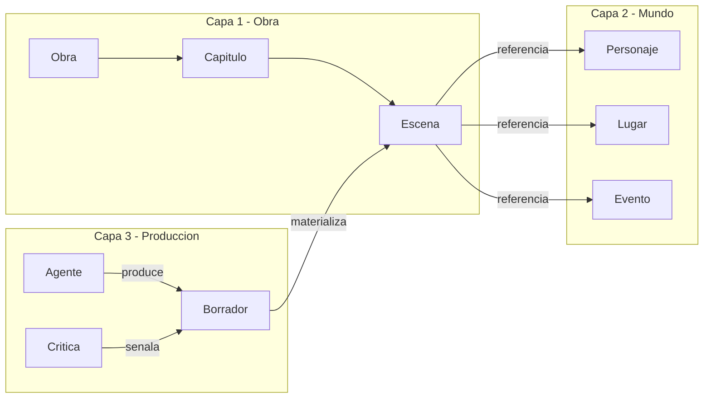
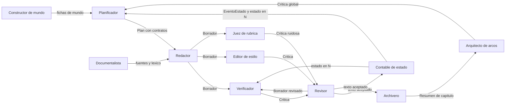
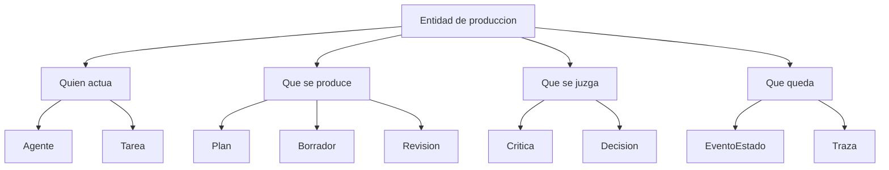
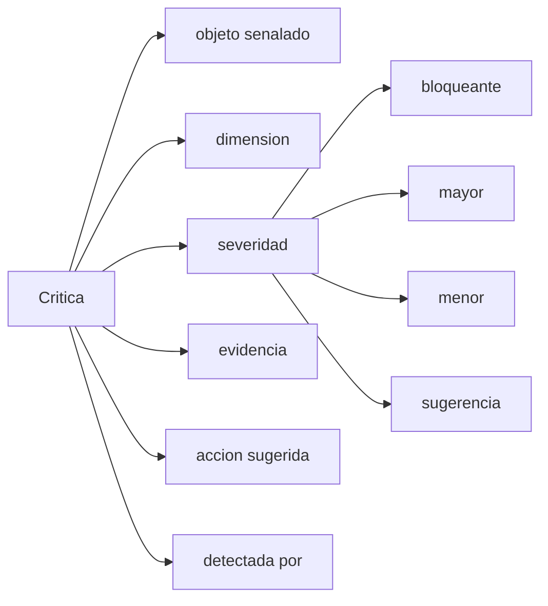
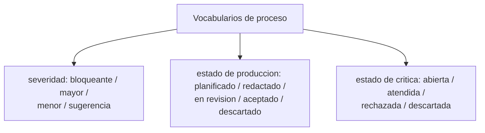
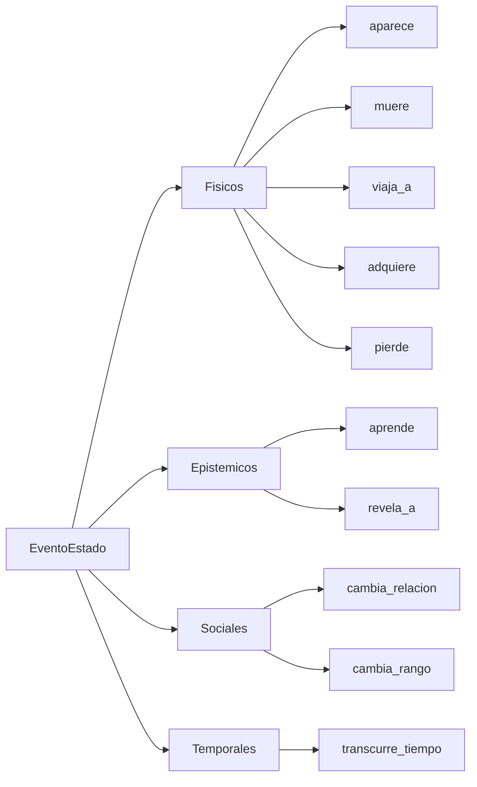
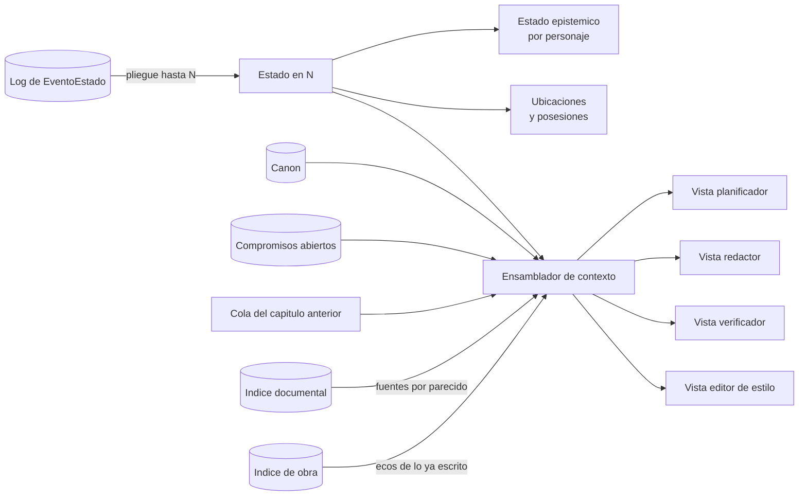
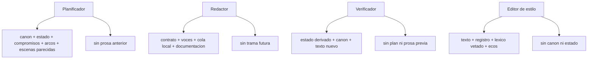
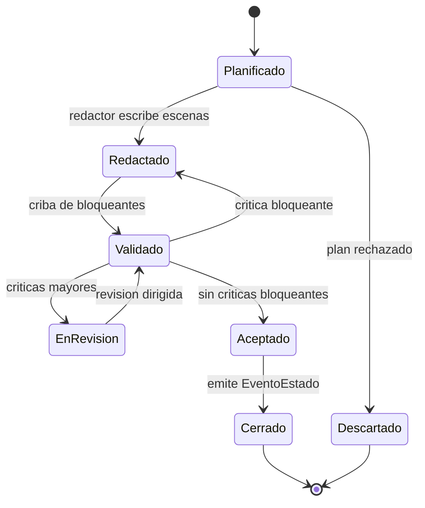

# Arquitectura del sistema de generación de novela histórica

2026-09-21 · [NOMBRE_ANONIMIZADO]

## Qué contiene este documento

Todo lo relativo a **cómo está construido el sistema**: la separación en capas y su regla de acoplamiento, las entidades de producción, la gestión de contexto con sus tres memorias y su recuperación por parecido, la orquestación por guion y el ciclo de vida de un capítulo, el bucle de control de calidad, el gobierno por entidad, la organización del código dentro de cada paquete y las notas de implementación.

El vocabulario del dominio —qué es una escena, un personaje, un anacronismo— vive en `definitions.md`, y sus diagramas en `domain-knowledge.md`. Este documento referencia esas entidades, no las define.

El reparto del repositorio —qué va en `backend/`, qué va en `frontend/` y dónde está la frontera entre ambos— está en la sección «Estructura del repositorio» de `AGENTS.md`, en la raíz. Aquí se describe el escalón siguiente: cómo se organiza el código **dentro** de cada uno de esos dos paquetes, en §7.

## 1. Arquitectura en tres capas

El dominio se parte en tres capas disjuntas, y la mayoría de los fallos de diseño vienen de mezclarlas.

| Capa | Qué contiene | Pregunta que responde | Quién la escribe |
| --- | --- | --- | --- |
| 1. Obra | Unidades textuales: obra, parte, capítulo, escena, beat, párrafo | ¿Cómo está hecho el texto? | Planificador y redactor |
| 2. Mundo | Referentes: personajes, lugares, eventos, objetos, instituciones, cronología | ¿De qué habla el texto? | Constructor de mundo y documentalista |
| 3. Producción | Agentes, tareas, planes, borradores, críticas, decisiones | ¿Cómo se ha llegado hasta aquí? | El harness |

**Regla de acoplamiento.** La capa 1 *referencia* entidades de la capa 2 por id, nunca las duplica; la capa 3 referencia a ambas y ninguna de las dos la referencia a ella.

**Qué pasa si se mezclan.** Si un `Personaje` guarda su descripción física junto al párrafo donde aparece, no se puede comprobar continuidad entre capítulos. Si el estado del mundo se guarda como prosa dentro del capítulo, no se puede derivar ni diferenciar. Si las críticas viven en el chat y no como entidades, no se puede medir si el bucle de revisión converge.



La dirección importa: la capa 1 referencia la 2 por id y nunca la duplica; la capa 3 observa a las otras dos y ninguna la observa a ella.

## 2. Capa de producción

Esta capa convierte el sistema multiagente en algo inspeccionable. Es la que permite responder por qué el capítulo 12 quedó así y si el bucle de revisión está convergiendo.

**Agente.** Rol de generación o evaluación. Atributos: nombre, función, entidades que puede leer, entidades que puede escribir, política de contexto, modelo y parámetros. La separación lectura/escritura es lo que evita que el redactor se autoevalúe.

**Tarea.** Unidad de trabajo encargada a un agente. Atributos: tipo, objeto sobre el que actúa, entradas, criterio de aceptación, intento número.

### Censo de agentes

Once roles. **Cada rol tiene exactamente un tipo de tarea y cada tipo de tarea tiene exactamente un rol**: si aparece trabajo que ningún tipo cubre, se declara un rol nuevo, no se ensancha uno existente. Todo lo que el sistema hace lo hace un agente; no hay lógica de negocio fuera de esta tabla.

| Agente | Tipo de tarea | Alcance | Cuándo actúa |
| --- | --- | --- | --- |
| Constructor de mundo | `poblar_mundo` | Obra | Arranque y ampliación bajo demanda |
| Documentalista | `documentar` | Escena | Antes de planificar y antes de redactar |
| Arquitecto de arcos | `auditar` | Obra | Cada N capítulos y al cierre |
| Planificador | `planificar` | Capítulo | Al abrir capítulo |
| Redactor | `redactar` | Escena | Tras plan aceptado, una escena por encargo |
| Contable de estado | `plegar` | Cierre de capítulo | Al pasar de `Aceptado` a `Cerrado` |
| Verificador de continuidad | `verificar` | Escena y capítulo | En cada criba, una tarea por dimensión |
| Editor de estilo | `editar_estilo` | Párrafo y capítulo | Al coser el capítulo y en la criba de pulido |
| Juez de rúbrica | `juzgar` | Escena y capítulo | En la criba de pulido, solo en lo no formulable como predicado |
| Revisor | `revisar` | Escena o capítulo | Con críticas `mayor` pendientes |
| Archivero | `destilar` | Capítulo | Al cerrar capítulo, después del Contable |

Dos roles estaban antes implícitos y ahora son explícitos: el **Constructor de mundo**, que escribía la capa 2 sin tener tarea ni vista, y el **Revisor**, que modificaba capítulos y escenas sin estar declarado. Dos son nuevos: el **Contable de estado**, que absorbe el pliegue del log que antes hacía una función pura, y el **Juez de rúbrica**, que antes aparecía como "juez LLM" sin ser un rol.

Reglas de integridad del censo:

- Ningún agente valida su propia salida: el Redactor no emite `Crítica`, y ni el Verificador ni el Juez escriben `Borrador`. El Editor de estilo es el único que hace las dos cosas, y por eso el guion las separa en dos pasos distintos: cose el capítulo en el paso 7 escribiendo un `Borrador` de superficie, y en el paso 8 comprueba predicados de superficie sobre el texto ya cosido. Sin esa costura, lo que el paso 7 produjera serían críticas que ningún paso posterior aplica.
- Solo el Contable de estado emite `EventoEstado`. Es el único punto por el que el mundo cambia.
- Solo el Documentalista escribe `Fuente`. Un dato sin `Fuente` escrita por él es una alucinación por definición. Es además el único rol que trae material de fuera del sistema: ningún otro busca ni lee nada que no esté ya en el almacén.
- El Revisor aplica críticas ajenas; no puede crear las suyas.
- El Archivero no escribe hechos del mundo ni prosa: resume el capítulo cerrado y retira lo que caduca. No decide nada sobre el texto.

### Entrada y salida de cada agente

Qué artefacto consume cada rol y qué artefacto deja escrito. La salida de un agente es la entrada del siguiente y **el testigo se pasa siempre por artefacto escrito, nunca por llamada directa**: ningún rol invoca a otro ni le pasa objetos en memoria, lee lo que el anterior dejó en el almacén. Esta tabla fija el testigo; la de §3 fija la ventana desde la que cada rol lo mira.

| Agente | Entrada | Salida |
| --- | --- | --- |
| Constructor de mundo | `Obra` con su premisa y su marco, elenco declarado por el editor, `Fuente` ya recogidas | Fichas de `Personaje`, `Lugar`, `Objeto` y `Facción` |
| Documentalista | Marco de la escena —fecha, lugar, ámbito—, afirmaciones históricas pendientes de respaldo y lo que devuelven la búsqueda externa y el índice documental para ese marco | `Fuente`, `Concepto`, `Práctica` y `Registro lingüístico`, filtrados por esa fecha y ese lugar |
| Arquitecto de arcos | Resúmenes de los capítulos cerrados, arcos declarados, cola de `Compromiso`, `funcion_estructural` de las escenas en orden | `Crítica` de alcance global |
| Planificador | Canon, estado en N-1, compromisos abiertos, arcos | `Plan`: esqueleto de `Capítulo`, contrato de cada `Escena` y `Compromiso` asignados |
| Redactor | Contrato de una escena del `Plan` aceptado, voces del elenco presente en ella, cola de continuidad local, documentación recuperada para esa escena | `Borrador` candidato de esa escena, con sus `Párrafo` |
| Contable de estado | Estado en N-1 ya materializado, texto aceptado del capítulo N, vocabulario de tipos de evento | `EventoEstado` del capítulo N, con fecha y lugar resultantes ya calculados, y estado en N |
| Verificador de continuidad | Un contrato de verificación por dimensión —predicado y proyección mínima, `validators.md` §4— y el texto producido | `Crítica` de alcance escena y capítulo con evidencia citable, o la constancia de que el predicado se cumple |
| Editor de estilo | Texto producido, `Registro lingüístico` de las escenas en juego, lista vetada corta del capítulo, ecos recuperados del registro acumulado de imágenes y muletillas | `Crítica` local y `Borrador` de superficie. El registro acumulado no es un artefacto que él escriba: es la colección de prosa aceptada, que se alimenta sola al aceptar cada unidad y de la que él recupera por parecido |
| Juez de rúbrica | Texto producido y rúbrica de la única dimensión que puntúa | `Crítica` ruidosa, marcada aparte, que por sí sola no dispara regeneración |
| Revisor | `Borrador` vigente, críticas a atender ya filtradas por severidad, contrato de la unidad | `Revisión` —críticas atendidas y rechazadas con motivo— y el `Borrador` siguiente |
| Archivero | Texto aceptado del capítulo N, cola de `Compromiso`, ecos del registro acumulado de estilo | `Resumen de capítulo`, con qué compromisos quedan pagados y cuáles siguen abiertos. La memoria de capítulo la retira el almacén al cerrar, marcándola como caducada; lo que sigue abierto sobrevive |

La `Traza` no es salida de ningún rol: se registra en toda tarea, la ejecute quien la ejecute, y por eso no aparece en la tabla.



**Plan.** Descomposición previa a la escritura: esqueleto de capítulo, lista de escenas con sus contratos, asignación de compromisos. Es la salida del planificador y la entrada del redactor.

**Borrador.** Versión de un texto. Atributos: texto, unidad a la que corresponde, número de versión, tarea que lo produjo, estado (candidato, aceptado, descartado).

**Crítica.** Defecto detectado. Modelada como entidad de primera clase, nunca como texto libre:

| Campo | Contenido |
| --- | --- |
| `objeto` | Id de la unidad señalada (párrafo, escena, capítulo, arco) |
| `dimension` | Dimensión de calidad vulnerada |
| `severidad` | Bloqueante, mayor, menor, sugerencia |
| `evidencia` | Fragmento o predicado que falla |
| `accion_sugerida` | Qué cambiar |
| `detectada_por` | Agente que la emitió y contrato de verificación aplicado |

Sin esta estructura no se puede medir si el bucle de revisión converge o gira en vacío.

**Revisión.** Aplicación de una o varias críticas sobre un borrador, produciendo otro. Atributos: críticas atendidas, críticas rechazadas con motivo, diferencia respecto al borrador anterior.

**Decisión.** Elección de diseño registrada y sus alternativas descartadas: nombre de un personaje, licencia histórica asumida, giro elegido. Evita que el sistema reabra lo ya cerrado.

**EventoEstado.** Hecho atómico emitido por un capítulo al cerrarse, que modifica el mundo. Es la pieza central de la gestión de contexto: el estado del mundo en el capítulo N no se almacena, se deriva plegando estos eventos.

**Resumen de capítulo.** Lo que queda de un capítulo cerrado cuando su prosa deja de leerse: qué pasó, qué cambió y qué quedó pendiente, en unas pocas líneas. Lo escribe el Archivero y es la única forma en que los capítulos antiguos siguen presentes en el sistema. No es un `EventoEstado`: el evento registra un hecho y el resumen registra un tramo de historia.

**Traza.** Registro por tarea de contexto enviado, salida obtenida, coste y latencia. Necesario para el trabajo académico: es lo que permite medir el sistema, no solo la novela.





### Vocabularios de proceso

Valores cerrados de la capa de producción. Los vocabularios de forma textual y de mundo están en `definitions.md`.

**Severidad de crítica:** `bloqueante`, `mayor`, `menor`, `sugerencia`.

**Estado de producción:** `planificado`, `redactado`, `en_revision`, `aceptado`, `descartado`.

**Estado de crítica:** `abierta`, `atendida`, `rechazada`, `descartada`. Es el que hace filtrable el registro de defectos y el que permite contar lo que mide la convergencia del bucle: una crítica se descarta sin evidencia, se atiende o se rechaza con motivo en la `Revisión`, y la que no llega a ninguna de esas tres se queda abierta y cierra el capítulo marcado.

**Tipo de EventoEstado:** `aparece`, `muere`, `viaja_a`, `adquiere`, `pierde`, `aprende` (cambio epistémico), `revela_a`, `cambia_relacion`, `cambia_estado_civil_o_rango`, `transcurre_tiempo`.





Cerrar estos vocabularios es lo que hace computables los predicados de calidad. Un atributo en texto libre es un atributo que ningún validador puede comprobar.

## 3. Gestión de contexto

La pregunta operativa no es qué sabe el sistema, sino **qué proyección de la ontología recibe cada agente en cada paso**. El contexto es una vista sobre el grafo, y cada rol necesita una distinta.

### Ningún agente recuerda: toda tarea arranca en frío

No hay historial de conversación en ninguna parte. Cada tarea abre una ventana construida desde cero a partir de los artefactos escritos y la cierra al escribir el suyo. Entre dos tareas no viaja nada más que un artefacto en el almacén: es la regla del paso de testigo de §2 vista desde el lado del contexto.

Esto no es austeridad, es lo que hace el techo **verificable antes de gastar**: una ventana que se arma de cero se puede medir antes de mandarla. Un agente que acumulase memoria propia sería un agente cuyo coste nadie puede acotar.

### Las tres memorias

Lo que se suele llamar memoria a corto y a largo plazo son aquí tres plazos, y lo que los separa no es su contenido sino **cuándo se tira lo que hay dentro**.

| Memoria | Qué contiene | Cuándo se tira |
| --- | --- | --- |
| De tarea | La ventana de un agente para un encargo concreto | Al terminar el encargo. Solo sobrevive el artefacto escrito |
| De capítulo | Borradores descartados, documentación recuperada por escena, críticas ya resueltas | Al cerrar el capítulo, y lo hace el Archivero |
| De obra | Canon y fichas, log de `EventoEstado`, estado materializado, `Resumen de capítulo`, cola de `Compromiso`, registro acumulado de estilo, `Decisión` | Nunca |

**Olvidar es un paso del guion, no un descuido.** La memoria de capítulo no caduca sola: la retira el Archivero al destilar (§4). Sin ese paso, el gasto constante deja de serlo a los pocos capítulos.

### Los seis materiales y su política de residencia

| Material | Qué es | Memoria | Política |
| --- | --- | --- | --- |
| Canon | Hechos inmutables del mundo y decisiones ya cerradas | Obra | Siempre presente, comprimido, nunca reescrito por el redactor |
| Estado en N | Dónde está cada quien, qué sabe, qué posee, qué debe | Obra | Derivado, no almacenado: pliegue de los `EventoEstado` hasta N |
| Compromisos abiertos | Pistas plantadas sin pagar, subtramas vivas, promesas al lector | Obra | Siempre presente; cola ordenada por vencimiento |
| Continuidad local | Cola literal de los últimos párrafos del capítulo anterior | Obra | Siempre presente en crudo: el estilo se contagia por adyacencia |
| Documentación | Fuentes, detalle material, léxico de época | Capítulo | Recuperada por escena, filtrada por fecha y lugar, descartada al cerrar |
| Ecos de la obra | Fragmentos de lo ya escrito que se parecen a lo que se va a escribir | Obra | Recuperados por parecido con `k` y tope de tokens declarados; nunca la prosa entera |

### La regla que sostiene las tres

> **Nada cuyo tamaño crezca con la longitud de la obra entra en la ventana de ningún agente.**

Es la condición para que el capítulo 40 cueste lo mismo que el capítulo 4. De ella salen tres consecuencias que el resto del documento da por supuestas:

- **El log de `EventoEstado` no se lee nunca entero.** El pliegue es incremental: estado en N-1 más los eventos de N.
- **La prosa cerrada no se relee jamás.** La única excepción es la cola de continuidad local, corta y de tamaño fijo.
- **Solo dos materiales crecen con la obra**, y por eso los dos llevan tope declarado y un único lector: los `Resumen de capítulo`, que lee el Arquitecto de arcos, y el registro acumulado de estilo, que consulta el Editor de estilo. El primero entra entero, lleva tope declarado y avisa al alcanzarlo; compactarlo queda fuera de esta versión. El segundo ya no entra entero: se consulta por parecido y de él llegan solo los ecos recuperados, así que su tope vigila el tamaño del índice, no el de la ventana. Nada más en el sistema tiene permitido crecer sin límite.

### Recuperación por parecido

Buena parte de lo que un agente necesita no se localiza por identificador, sino
por semejanza: qué fuente sirve para una escena de imprenta sevillana, o si la
imagen que acaba de escribirse ya se escribió treinta capítulos atrás. Para esas
preguntas hay tres colecciones indexadas, y ninguna más.

| Colección | Qué contiene | Cuándo se escribe | Quién la consulta |
| --- | --- | --- | --- |
| Documental | Fragmentos de las `Fuente` recogidas, con su fecha, su lugar y su ámbito al lado | Al recoger la `Fuente` | Documentalista |
| Obra · prosa | Fragmentos del texto ya aceptado | Al aceptar la unidad, nunca antes | Editor de estilo, y la API de consulta del editor |
| Obra · estructura | Contratos de escena ya cumplidos y `Resumen de capítulo` | Al cerrar el capítulo | Planificador |

Lo indexado no es una entidad nueva: un fragmento es un trozo de un artefacto
que ya existe —una `Fuente`, un `Párrafo`, un `Resumen de capítulo`— y vive en
el índice, no en la ontología. Nada que consultar por parecido se guarda dos
veces.

**Por qué un índice no rompe la regla del tamaño.** La regla prohíbe que entre
en una ventana algo que crezca con la obra, y habla de la ventana, no del
almacén. Una consulta por parecido devuelve siempre los `k` fragmentos más
próximos, con `k` y un tope de tokens declarados por rol: el índice del capítulo
40 es diez veces el del capítulo 4 y lo que llega a la ventana mide lo mismo. Es
justamente lo que permite consultar todo lo escrito sin releer nada.

**Lo recuperado paga en el tope de su rol.** No se suma aparte al presupuesto:
sale del tope de ventana del agente que consulta, como cualquier otro material.
Si no cabe, baja `k`, no sube el tope.

**Recuperar no es decidir, así que no es tarea de nadie.** La consulta la sirve
`almacen/` y la coloca en la ventana el ensamblador de contexto de `nucleo/`. No
se declara un rol «recuperador»: el censo de §2 no cambia, porque no hay trabajo
de dominio que ningún tipo de tarea cubra.

**Lo que nunca se consulta por parecido.** Una búsqueda por semejanza devuelve
lo que se parece, nunca lo que falta, y su fallo es silencioso: el agente que no
recupera la contradicción concluye que no la hay. De ahí que estos queden fuera,
y no por falta de ganas:

| Queda fuera | Por qué |
| --- | --- |
| Verificador de continuidad | Comparar hechos exige el estado completo, no una muestra parecida. Recuperar aquí fabrica falsos negativos con formato de verificación |
| Contable de estado | El pliegue es exacto y ya es incremental |
| Arquitecto de arcos | Audita ausencias —un arco que no avanza, un compromiso sin pagar— y la ausencia es exactamente lo que un índice no devuelve |
| Redactor | No ve prosa anterior por diseño: la cola de continuidad local le da el contagio de estilo en la dosis que se quiere y ni un párrafo más |
| Canon, fichas de mundo y estado en N | Se traen por `id` desde el contrato de la escena. Cambiar algo seguro por algo probable no gana nada |

### De dónde sale la documentación

El Documentalista busca fuera del sistema con el marco de la escena —fecha,
lugar, ámbito— y de cada resultado que acepta el almacén guarda **el texto
íntegro tal como se leyó**, no solo el enlace. Una `Fuente` cuya cita no se pueda
volver a comprobar dentro de un año no respalda nada, y el invariante es que un
dato histórico sin `Fuente` es una alucinación. Lo guardado se trocea y se
indexa en la colección documental; la página entera no vuelve a entrar en
ninguna ventana, solo los fragmentos que se recuperan.

Esto es lo que hace que la recogida quepa en el tope de 8 000 del rol: el
agente ve resultados cortos, decide cuáles valen, y el volumen se queda en el
almacén.

### Estado como pliegue, no como campo mutable

Cada capítulo, al cerrarse, emite `EventoEstado` tipados. El estado en el capítulo N se computa reduciendo el log de eventos hasta N. Esto da tres cosas que un campo mutable no da: reproducibilidad, diferencia legible entre versiones, y la posibilidad de regenerar el capítulo 12 sin corromper el 13.

**El pliegue es incremental y lo hace el Contable de estado.** No relee el log entero: recibe el estado en N-1 ya materializado y los `EventoEstado` del capítulo N, y emite el estado en N. Esto es lo que hace el pliegue viable sin código: la tarea no crece con la longitud de la obra, siempre es "un estado más un puñado de eventos". Si se regenera el capítulo 12, se descartan los estados materializados de 12 en adelante y se repliega hacia delante capítulo a capítulo.

Corolario práctico: el estado epistémico de cada personaje es una proyección del mismo log filtrando eventos `aprende` y `revela_a`. No hace falta modelarlo aparte.



### Proyecciones por rol

Cada agente recibe una vista distinta, y algunas exclusiones son tan importantes como las inclusiones.

| Agente | Ve | No ve | Por qué |
| --- | --- | --- | --- |
| Constructor de mundo | Obra, premisa, elenco declarado, fuentes ya recogidas | Plan, prosa, estado en N | Puebla tipos, no reacciona a la trama |
| Documentalista | Marco de la escena, fuentes | Trama futura | Evita sesgar el dato hacia lo conveniente |
| Arquitecto de arcos | Resúmenes de todos los capítulos, compromisos, curva de tensión | Prosa completa | Opera a escala de obra |
| Planificador | Canon, estado en N, compromisos abiertos, arcos, contratos y resúmenes de escenas parecidas ya escritas | Prosa anterior | Planifica estructura, no imita estilo: lo recuperado le llega como contrato y resumen, nunca como prosa |
| Redactor | Contrato de escena, voces del elenco presente, continuidad local, documentación recuperada | Trama futura, críticas previas de otras escenas | Escribe desde dentro de la escena |
| Contable de estado | Estado en N-1, texto aceptado del capítulo N, vocabulario de eventos | Plan, críticas, canon completo | Transcribe hechos ocurridos, no los interpreta |
| Verificador de continuidad | Estado derivado, canon, texto producido | Prosa anterior, intención del plan | Compara hechos, no impresiones |
| Editor de estilo | Texto producido, registro, léxico vetado, ecos de imágenes parecidas ya usadas | Canon, estado | Juzga superficie |
| Juez de rúbrica | Texto producido, rúbrica de la dimensión juzgada | Canon, estado, críticas de otros | Su ruido no debe contagiar al resto |
| Revisor | Borrador, críticas a atender, contrato de la unidad | Críticas de otras unidades, trama futura | Corrige lo señalado, no reescribe la obra |



El verificador que ve la prosa anterior se ancla en ella y deja pasar los fallos que esa prosa ya contenía.

### Presupuesto

**El techo son 100 000 tokens de entrada simultáneos.** No es el gasto de una obra ni el de un capítulo, que suman mucho más paso tras paso: es lo que puede haber abierto **a la vez**. Y mide solo lo que entra: lo que los agentes devuelven se paga en coste y no ocupa techo, así que en el reparto de una tanda no se reserva nada para las respuestas. El agente que termina libera su parte, así que una cadena secuencial larga no agota el techo por larga que sea. Lo que lo agota es abrir demasiados frentes en paralelo. De ahí salen tres reglas.

**Primera: cada rol tiene un tope de ventana.** No es una estimación, es un límite. Si la proyección mínima de una tarea no cabe en el tope de su rol, la tarea se parte en unidades menores —de capítulo a escena, de escena a párrafo— en lugar de recortar la proyección a ojo. Recortar la proyección es fabricar falsos negativos: el agente deja de ver justamente lo que tenía que comparar.

Los topes de la tabla son, por lo mismo, topes de proyección: miden lo que se
manda, no la tarea entera.

| Rol | Tope de ventana |
| --- | --- |
| Arquitecto de arcos | 25 000 |
| Planificador · Revisor | 20 000 |
| Constructor de mundo | 15 000 |
| Contable de estado · Archivero · Redactor | 12 000 |
| Documentalista · Verificador · Editor de estilo | 8 000 |
| Juez de rúbrica | 6 000 |

El reparto es la asignación de diseño, no una medida: calibrarlo contra las `Traza` reales es trabajo de implementación, y la `Traza` existe en parte para eso.

**Segunda: la anchura de una tanda se calcula, no se elige.** Se reserva el 20 % del techo como margen para lo que no se puede prever y quedan 80 000 útiles. En una tanda caben `80 000 ÷ (tope del rol más caro de la tanda + coste fijo del subagente)` agentes simultáneos.

Ese coste fijo no es una precaución: **un subagente no arranca vacío**. Antes de que entre nada del sistema arrastra su propia instrucción y las definiciones de las herramientas que tenga concedidas, y eso son tokens de entrada como cualquier otro. Medido con todas las herramientas retiradas y con la instrucción del rol en lugar de la de serie, son unos 10 000 por tarea abierta. Con verificadores a 8 000 de proyección, cuatro a la vez. Si hay veinte comprobaciones que hacer, son cinco tandas: se abren cuatro, se espera a que cierren y se abren las siguientes. Sin ese término el techo se respeta sobre el papel y se rompe en la máquina.

**Tercera: paralelo donde no se pisan, secuencial donde hay testigo.** Dos tareas corren a la vez solo si ninguna necesita el artefacto de la otra: documentar varias escenas, comprobar varias dimensiones sobre un mismo borrador. Planificar, redactar, revisar y cerrar van en fila porque cada una consume lo que dejó la anterior. Nunca en abanico libre: un abanico cuya anchura no se conoce de antemano es un techo que no se puede prometer.

Un efecto de los topes que conviene notar, porque decide el diseño sin que haya que ordenarlo: **al verificador no le cabe un capítulo entero**. Su contrato de verificación ronda los 1 500 tokens, su proyección mínima otros 1 500 y un capítulo de cuatro escenas unos 5 200. No entra. Así que verifica por escena. Las dimensiones que sí son de alcance de capítulo caben porque son justamente las que no leen prosa, sino datos que otro agente ya dejó escritos —el modo declarado de cada párrafo, las fechas resultantes de cada `EventoEstado`—. El presupuesto y el reparto de `validators.md` llegan a la misma conclusión por caminos distintos.

Reglas de compresión, que son las que hacen que los topes se cumplan: el canon se mantiene como fichas cortas y estables; los capítulos anteriores entran como `Resumen de capítulo`, nunca como prosa, salvo la cola de continuidad local; la documentación entra solo la recuperada para esa escena y se descarta al cerrarla; y todo lo que llega por parecido entra con su `k` y su tope de tokens declarados, que se descuentan del tope del rol que consulta.

## 4. Orquestación: el guion del capítulo

### Un guion escrito, y quién lo camina

El orden de los pasos está escrito de antemano y no lo decide nadie sobre la marcha. Hay un **guion declarativo** —qué paso viene, a qué rol le toca, qué proyección recibe, cuánto puede gastar y si va solo o en tanda— y una pieza que lo camina sin criterio propio: no conoce el dominio, lee cuál es el paso siguiente y lo ejecuta.

Por eso no hay coordinador y la simetría del censo se mantiene: **ningún agente manda sobre otro y ningún agente enruta**. La alternativa —que cada agente declarase al terminar a quién le toca— deja el gasto sin acotar, porque nadie puede saber de antemano cuántos frentes habrá abiertos, y el techo de §3 dejaría de ser una garantía.

Las únicas bifurcaciones del guion son el enrutado por severidad y el tope de vueltas, ambos declarados en §5.

| Paso | Tarea | Rol | Concurrencia |
| --- | --- | --- | --- |
| 1 | `planificar` | Planificador | Solo |
| 2 | `documentar` | Documentalista | Uno por escena, en tanda |
| 3 | `redactar` | Redactor | Uno por escena, en tanda |
| 4 | `verificar` — criba de bloqueantes | Verificador de continuidad | Uno por dimensión y escena, en tandas |
| 5 | `revisar` | Revisor | Solo, por escena; vuelve al 4 |
| 6 | `verificar` — criba de mayores | Verificador de continuidad | Uno por dimensión y escena, en tandas |
| 7 | `editar_estilo` — costura del capítulo | Editor de estilo | Solo, sobre el capítulo entero |
| 8 | `juzgar` y `editar_estilo` — criba de pulido | Juez de rúbrica, Editor de estilo | En tanda |
| 9 | `plegar` | Contable de estado | Solo |
| 10 | `destilar` | Archivero | Solo |

Dos tareas quedan fuera del guion del capítulo porque no tienen su cadencia: `poblar_mundo`, que ocurre al arrancar la obra y cuando hace falta ampliar el elenco, y `auditar`, que entra cada N capítulos y al cierre de la obra. Las dos van solas.

### Se redacta por escena y se cose por capítulo

El redactor recibe un encargo por escena, no por capítulo, y el capítulo se cose después en el paso 7. Tres razones, en orden de peso:

- **Al verificador no le cabe un capítulo entero** (§3). Las comprobaciones se hacen por escena de todas formas, así que redactar por capítulo y verificar por escena paga el precio de las dos opciones sin cobrar la ventaja de ninguna.
- **Equivocarse sale cuatro veces más caro.** Si un defecto bloqueante en la tercera escena obliga a rehacer el capítulo, cada error multiplica el gasto por el número de escenas. Por escena, regenerar es barato, y eso es lo que mantiene acotada la factura total, que no es el techo pero sí es el coste.
- **El defecto que esto provoca tiene arreglo y el contrario no.** Escribir por trozos hace que la voz derive entre escenas y que las transiciones queden secas; para eso está la costura, y hay un rol que ya sabe hacerla. Un capítulo caro de regenerar no tiene arreglo posible.

No rompe la regla de un rol una tarea: el Editor de estilo sigue teniendo un solo tipo de tarea y la ejerce sobre párrafo y sobre capítulo cerrado, como el Redactor y el Revisor ya la ejercen sobre escena o capítulo.

### Ciclo de vida de un capítulo



El paso de `Aceptado` a `Cerrado` es el que actualiza el mundo: hasta que un capítulo no se cierra, sus eventos no existen para el resto del sistema. Eso es lo que permite regenerar un capítulo sin corromper los siguientes. Y es el mismo paso el que retira la memoria de capítulo: cerrar es a la vez publicar los hechos y olvidar el andamio.

## 5. Bucle de control de calidad

**Estrategia de validación.** Toda dimensión de calidad debe seguir expresándose como predicado sobre entidades de la ontología: "continuidad" no es un juicio, es `∀ escena: estado_implicado ⊆ estado_derivado`. Lo que cambia aquí es quién evalúa el predicado. No hay validadores deterministas: el predicado se entrega a un agente como **contrato de verificación**, es decir, un enunciado comprobable más los datos exactos que se necesitan para comprobarlo y nada más.

Un contrato de verificación tiene tres partes: el predicado en una frase, la proyección mínima sobre la que se evalúa, y la forma exacta de la `Crítica` que debe emitir si falla. El agente no opina sobre el texto; responde si el predicado se cumple y, si no, señala la entidad concreta. Esa es la diferencia entre el Verificador y el Juez de rúbrica: el primero evalúa predicados, el segundo puntúa lo que no admite predicado.

**Tres reglas que sustituyen a lo que antes garantizaba el código:**

1. **Una dimensión por tarea.** Un agente al que se le piden siete comprobaciones a la vez encuentra las dos primeras. El Verificador se invoca una vez por dimensión, con la proyección de esa dimensión.
2. **Evidencia obligatoria.** Una `Crítica` sin `evidencia` citable —el fragmento o la entidad que falla— se descarta sin llegar al Revisor. Es lo que impide que el bucle se llene de impresiones.
3. **Doble pasada en desacuerdo.** Si dos agentes discrepan sobre el mismo predicado, se repite la comprobación con la proyección reducida al mínimo. Si persiste, la `Crítica` baja a `sugerencia` y se registra como caso ambiguo.

**Enrutado por severidad.** `bloqueante` fuerza regeneración de la escena; `mayor` entra en revisión dirigida; `menor` y `sugerencia` se acumulan para una pasada de pulido.

**Tres cribas, no una.** «Una dimensión por tarea» no significa que toda dimensión se compruebe en toda vuelta. Un borrador que va a morir no merece que se le mida el ritmo, y comprobarlo todo siempre multiplica el número de tareas por vuelta sin mejorar el texto. Las dimensiones entran por orden de lo que pueden parar:

| Criba | Qué entra | Cuándo corre |
| --- | --- | --- |
| De bloqueantes | Las dimensiones cuya `Crítica` sale `bloqueante` | En cada borrador nuevo |
| De mayores | Las que salen `mayor` | Sobre el borrador que ha pasado la primera |
| De pulido | Las que salen `menor` o `sugerencia` | Una sola vez, sobre el capítulo ya cosido |

Qué dimensión cae en cuál lo fija la severidad de partida de `validators.md` §4; lo que fija esta tabla es en qué vuelta entra cada una.

**Tope de vueltas.** El bucle converge o se declara no convergido; no gira indefinidamente. Dos revisiones dirigidas por borrador y dos regeneraciones por escena. Agotado el tope, la escena se acepta con sus críticas abiertas anotadas y el capítulo se cierra marcado, visible para el Arquitecto de arcos en su siguiente auditoría. Un bucle sin tope no es un bucle de calidad: es una forma de no terminar.

**Métrica del sistema.** Registrar cuántas iteraciones necesita cada capítulo, qué dimensiones reinciden y cuántas críticas se descartan por falta de evidencia es lo que hace evaluable el sistema, no solo la novela. Con validación agéntica esta métrica importa más, no menos: es la única prueba de que el bucle converge.

## 6. Tabla de gobierno por entidad

Esta tabla es lo que conecta la ontología con el harness: quién crea cada entidad, quién puede modificarla, cuándo entra en contexto y qué la vigila. Sin ella la ontología es decorativa.

| Entidad | La crea | La modifica | Entra en contexto | Vigilada por |
| --- | --- | --- | --- | --- |
| `Obra` | Usuario | Usuario | Siempre, comprimida | — |
| `Personaje` | Constructor de mundo | Solo por `EventoEstado` del Contable | Si está en el elenco de la escena | Continuidad, voz |
| `Lugar` | Constructor de mundo | Constructor, por ampliación | Si es marco de la escena | Coherencia temporal |
| `Evento` | Planificador o documentalista | Inmutable si es `canon` | Si precede causalmente a la escena | Anacronismo, causalidad |
| `Objeto` | Constructor de mundo | Solo por `EventoEstado` del Contable | Si aparece o lo posee el elenco | Continuidad, anacronismo material |
| `Concepto` y `Práctica` | Documentalista | Documentalista | Filtrado por fecha y lugar | Anacronismo conceptual y social |
| `Fuente` | Documentalista | Inmutable | Junto al dato que respalda | Cobertura documental |
| `Capítulo` | Planificador | Revisor | Resumen siempre; texto solo el anterior | Ritmo, arcos |
| `Escena` | Planificador | Revisor | Contrato completo al redactar | Contrato, POV, epistémica |
| `Párrafo` | Redactor | Editor de estilo | Cola de continuidad local | Fatiga léxica, voz, léxico |
| `EventoEstado` | Contable de estado, al cerrar capítulo | Inmutable | Nunca directo: se pliega en estado | Consistencia del log |
| `Resumen de capítulo` | Archivero, al cerrar capítulo | Inmutable | En la vista del Arquitecto de arcos, nunca la prosa que resume | Fidelidad al capítulo resumido |
| `Compromiso` | Planificador y redactor | Se cierra al pagarse | Siempre, cola abierta | Economía narrativa |
| `Crítica` | Verificador, Editor de estilo, Arquitecto de arcos, Juez | Se resuelve en revisión | Solo al agente que revisa | Convergencia del bucle |
| `Decisión` | Cualquier agente | Inmutable | Canon comprimido | Coherencia de diseño |

Dos reglas que la tabla implica y conviene explicitar: ninguna entidad del mundo se modifica por escritura directa del redactor, solo mediante eventos emitidos al cerrar un capítulo; y ningún agente valida su propia salida.

## 7. Notas de implementación

**Principio.** No hay harness a medida. El sistema es un conjunto de agentes, un formato de artefacto y un protocolo de paso de testigo entre ellos. Lo que antes era una función es ahora un rol con contrato.

**Representación: artefactos, no objetos.** El estado vive en documentos declarativos legibles por los agentes, no en modelos tipados en memoria. Los artefactos se agrupan lógicamente en mundo —una ficha por entidad—, obra —plan y borradores por capítulo—, log de `EventoEstado` por capítulo cerrado, estado materializado en N y críticas abiertas y resueltas. Son grupos, no carpetas: **todo vive en SQLite y en ningún otro sitio**, incluidos los cuerpos de texto y los embeddings, porque un segundo lugar donde persistir sería un segundo escritor. El esquema de cada artefacto se declara en prosa estructurada dentro de la propia ontología; el vocabulario controlado hace de validación de tipos y se impone además como `CHECK` en el esquema.

**Quién impone la forma.** Sin Pydantic, lo que garantiza que un artefacto esté bien formado es que el agente que lo escribe tenga el esquema en su contexto y que el siguiente agente lo rechace si falta un campo. El rechazo es una `Crítica` de severidad `bloqueante` con objeto el artefacto, no el texto. Conviene medir cuántos artefactos malformados aparecen por capítulo: es el indicador temprano de que un rol necesita más ejemplos o menos alcance.


### Organización del código

El reparto entre `backend/` y `frontend/` lo fija `AGENTS.md`. Lo que sigue es el
escalón siguiente: cómo se organiza el código dentro de cada uno de los dos
paquetes.

**Backend: cortes verticales por tipo de tarea.** El backend se organiza por
casos de uso, no por capas técnicas: no hay una carpeta de controladores, otra
de servicios y otra de repositorios. La unidad de corte es el **tipo de tarea**
del censo de §2, de modo que cada agente es una carpeta y la regla «un rol, una
tarea» queda visible en el árbol de ficheros: declarar un rol nuevo es añadir
una carpeta, y ensanchar uno existente es un cambio dentro de la suya. Con
capas horizontales, en cambio, cada agente queda repartido entre cuatro
carpetas y esa regla deja de verse.

```
backend/
  pyproject.toml
  .importlinter        los contratos de importacion que sostienen el corte
  src/novela/
    ajustes.py         lo que hoy es configuracion: topes de ventana por rol,
                       k de recuperacion, topes de vueltas, cadencia de auditar
    vocabularios.py    los valores cerrados, en un solo sitio
    ejecutor.py        lanza el subagente de Claude Code de cada tarea
    tareas/            una carpeta por tipo de tarea del censo (§2), con su
                       contrato, su prompt, su esquema y, si le toca criba, sus
                       contratos de verificacion por dimension
    nucleo/            el guion declarativo del capitulo y la pieza que lo
                       camina (§4), el ensamblador de proyecciones (§3), el
                       enrutado por severidad y los topes de vueltas (§5), el
                       presupuesto de contexto (§3) y los permisos por rol (§6)
    almacen/           unica puerta de lectura y escritura, incluido el indice
                       de recuperacion por parecido
    api/               un procedimiento por caso de uso del editor
  tests/               las pruebas y los casos sembrados, fuera de tareas/
```

Cuatro reglas sostienen el corte:

- **Las tareas no se importan entre sí.** Se comunican por artefactos, a través
  de `almacen/`. Lo único compartido es `nucleo/` y `almacen/`; entre dos
  tareas se duplica antes que acoplarse.
- **`nucleo/` no decide nada del dominio.** Ensambla proyecciones, cuenta
  contexto, camina el guion y enruta críticas. No pliega el log, no resume ni
  juzga texto: eso es trabajo del Contable de estado, del Archivero y de los
  verificadores. Caminar el guion no es decidir: el guion está escrito fuera y
  `nucleo/` solo lee cuál es el paso siguiente. Si `nucleo/` engorda, está
  reapareciendo el harness a medida que el principio de esta sección prohíbe.
- **`almacen/` es la única frontera con la persistencia.** Se declara como
  interfaz estrecha porque la forma física del almacén sigue abierta (§8) y
  porque la frontera única de `AGENTS.md` exige un solo lector y un solo
  escritor.
- **`api/` es procedimental.** Cada endpoint es un procedimiento de principio a
  fin. No hay capa de servicios intermedia que reutilizar.

El riesgo aceptado es la duplicación: once carpetas parecidas que pueden
divergir en cómo escriben sus artefactos. Lo que lo contiene no es una capa
común, sino que `almacen/` sea la única puerta de escritura y que la forma del
artefacto la imponga el rechazo del agente siguiente.

**Frontend: agrupación por funcionalidad.** Una carpeta por funcionalidad
—lanzar una obra, leer el manuscrito, inspeccionar críticas, revisar trazas—
con sus componentes y sus llamadas dentro, y `compartido/` para el cliente de
API y lo transversal. No hay capas de dominio en el cliente: la interfaz lanza
ejecuciones y muestra artefactos.

```
frontend/
  package.json
  src/
    features/    lanzar, manuscrito, criticas, trazas
    compartido/  cliente de API y componentes comunes
```

**Sin estado global en el cliente.** Casi todo lo que la interfaz muestra es
estado del servidor: artefactos que produce el backend. Se consulta y se cachea
contra la API, y el estado propio de cada pantalla se queda en ella. Un almacén
global sería una copia desactualizada de lo que ya tiene el backend. Cómo llega
el avance de una ejecución en curso es detalle de implementación, no de
organización.

### Qué se pierde sin cálculo determinista

Tres dimensiones dejan de ser fiables al pasar a agentes, y conviene decirlo en el trabajo académico antes de que lo diga el tribunal.

| Dimensión | Por qué falla | Cómo se compensa dentro del sistema |
| --- | --- | --- |
| Coherencia temporal | Aritmética de calendario y distancias: sumar días, comparar duraciones, detectar un viaje imposible. Es exactamente lo que peor hace un modelo de lenguaje, y falla en silencio | El Contable emite en cada `EventoEstado` la fecha y el lugar resultantes ya calculados y explícitos. El Verificador compara dos valores escritos en lugar de calcularlos |
| Fatiga léxica | Exige contar frecuencias de lemas sobre todo el corpus previo. Un agente no puede contar 300 páginas y estimarlo a ojo no es una medida | El Editor de estilo mantiene un registro acumulado de imágenes y muletillas ya usadas, actualizado al cerrar cada capítulo, y comprueba contra esa lista en vez de contra el texto |
| Léxico vetado | Cotejo exhaustivo contra una lista larga. Un agente revisa bien veinte términos, no mil | Lista corta y priorizada por capítulo, derivada del `Registro lingüístico` de las escenas en juego, no la lista global |

En los tres casos el patrón es el mismo: **convertir un cálculo en un dato escrito por el agente que tiene el contexto para producirlo**. Funciona, pero desplaza el riesgo de "el código puede tener un bug" a "el dato escrito puede ser falso y nadie lo recalcula". La métrica de reincidencia por dimensión es la que detecta eso.

## 8. Decisiones abiertas

- [ ] ¿El estado epistémico del lector se modela explícitamente o se deriva de lo aparecido en texto?
- [ ] ¿Los `Compromiso` los declara el planificador o se extraen del texto tras redactar?
- [ ] ¿La lista de léxico vetado se construye a mano, se deriva de corpus de época, o ambas?
- [ ] ¿Se versiona la biblia junto a la novela o evoluciona monotónicamente?
- [ ] ¿El Contable de estado es un rol con su propio modelo y temperatura baja, o el mismo modelo que el resto con otro contrato?
- [ ] ¿Quién arbitra cuando Verificador y Juez discrepan de forma sistemática en una dimensión?
- [ ] ¿Se acepta alguna herramienta externa de cálculo (fechas, recuento léxico) sin que eso cuente como harness, o la restricción de cero código es absoluta? **No en v1**, y por eso coherencia temporal, fatiga léxica y léxico vetado se comprueban contra el dato ya escrito y lo que las vigila es la reincidencia por dimensión.
- [ ] ¿Con qué criterio se admite o se descarta una fuente encontrada fuera del sistema, y quién arbitra cuando dos fuentes admitidas se contradicen?
