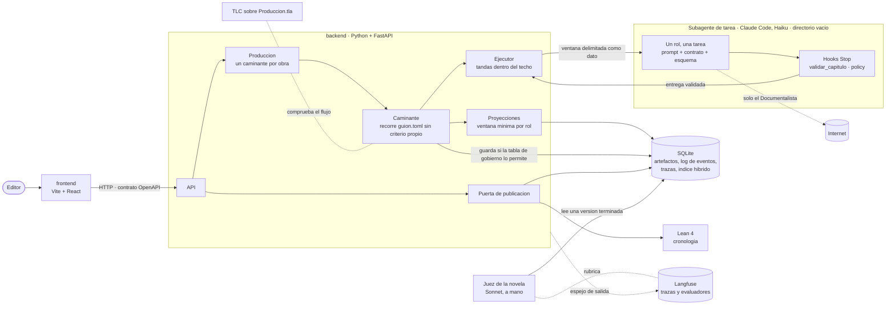
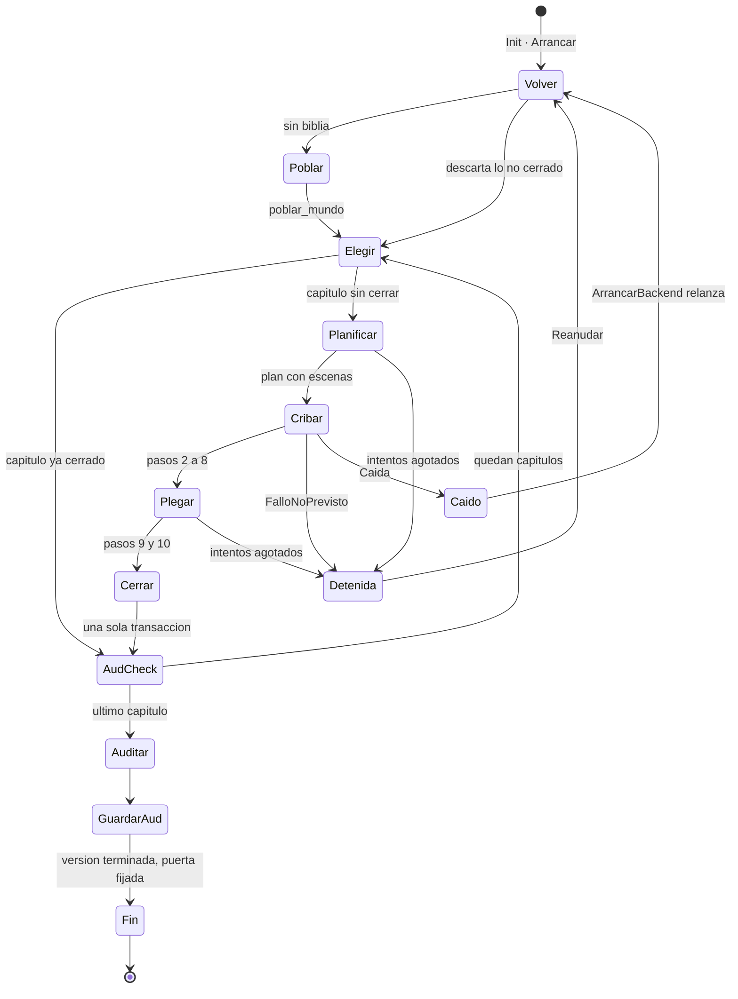
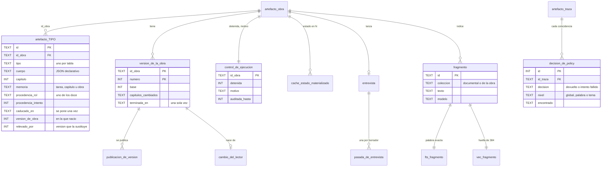
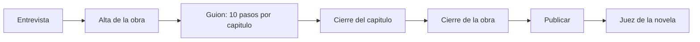

# Diagramas

Los cuatro diagramas que dicen cómo está montado el sistema por dentro: el
*harness*, la máquina de estados que recorre TLC, el esquema de SQLite y dónde
corre cada validador. Los diagramas del dominio —la obra, el mundo, las
relaciones— están en [`domain-knowledge.md`](domain-knowledge.md), y los de las
capas, la entrevista y el ciclo de vida del capítulo, en
[`architecture.md`](architecture.md); aquí no se repiten.

## 1. Arquitectura del harness

Quién habla con quién cuando se produce una obra. Lo importante está en los
bordes: la interfaz solo habla con la API; solo el backend abre SQLite; cada
subagente arranca en un directorio vacío, sin el repositorio, y lo único que
cruza es su ventana de entrada y su respuesta; Langfuse solo recibe.

## 2. La máquina de estados que recorre TLC

`backend/formal/tla/Produccion.tla` modela el flujo de una obra, no su
contenido. Arriba, lo que hace el caminante; abajo, lo que le puede pasar desde
fuera. Cada nombre en cursiva de la tabla de `mapeo.md` es una de estas
flechas, con la función del código que la implementa.

Las acciones del editor que no dibuja el diagrama —`Rehacer(n)`,
`CambioLector(h)` y `Publicar(v)`— abren una versión nueva o publican una
terminada; las propiedades que TLC comprueba sobre todo esto están en
[`validators.md`](validators.md) §7 y los tres contraejemplos que encontró, en
[`registro-de-iteraciones.md`](registro-de-iteraciones.md).

## 3. El esquema de SQLite

Sacado de una base vacía con las migraciones del código (`almacen/migraciones.py`),
no de memoria. Hay **28 tablas de artefacto**, una por tipo, todas con el mismo
envoltorio; el cuerpo es un JSON que el backend no interpreta. Alrededor, las
tablas que no son artefactos: versiones, publicaciones, control de la obra,
entrevista, registro de lo vetado e índice de parecido.

Los 28 tipos, por capa:

| Capa | Tablas `artefacto_…` |
| --- | --- |
| Obra (8) | `obra`, `parte`, `capitulo`, `escena`, `beat`, `parrafo`, `compromiso`, `mencion` |
| Mundo (10) | `personaje`, `lugar`, `evento`, `objeto`, `faccion`, `practica`, `concepto`, `registro_linguistico`, `fuente`, `recuerdo` |
| Producción (10) | `agente`, `tarea`, `plan`, `borrador`, `critica`, `revision`, `decision`, `evento_estado`, `resumen_capitulo`, `traza` |

El reparto sale de `novela/vocabularios.py` y es el mismo que el de
[`definitions.md`](definitions.md).

Algunas tablas añaden columnas para poder filtrar sin abrir el cuerpo:
`escena`, `estado` u `orden` donde hace falta, `severidad` y `dimension` en
`critica`, `hecho` en `mencion`, y tokens, coste y latencia en `traza`.

Lo que no se ve en el diagrama y sostiene las reglas: toda tabla es `STRICT`;
ninguna fila se borra (un disparador lo impide); lo inmutable —`EventoEstado`,
`Fuente`, `Recuerdo`, un `Borrador` aceptado— no se modifica, y lo único que se
le puede poner es la marca de caducado, una vez y para siempre; y la versión en
que nació una fila no cambia. Los valores cerrados —estado, memoria, rol— los
comprueba la propia base con `CHECK`.

## 4. Los validadores y dónde se ejecutan

Qué comprueba cada cosa y en qué momento de la vida de una obra corre. El
método de cada una —`prueba`, `analisis`, `inspeccion`, `demostracion` o
`inverificable`— y su evidencia están en [`validators.md`](validators.md); el
reparto dimensión por dimensión, en su §4 y §8.

| Momento | Validador | Qué para | Quién lo ejecuta |
| --- | --- | --- | --- |
| Cada pasada de la entrevista | Tres reglas mecánicas | Que el agente cambie un campo que la persona escribió, un hecho sin cita literal, un artefacto guardado por el Entrevistador | Backend, al recibir la pasada |
| Antes de mandar cualquier tarea | Proyección completa y sin sobras | Una ventana a la que le falta un material de su contrato, o que trae de más | Caminante, al ensamblar la ventana |
| Antes de mandar cualquier tarea | Cuenta previa contra el techo | Una tanda que pasaría de 100 000 tokens de entrada | Ejecutor, al formar la tanda |
| Dentro de la sesión del subagente, pasos 3, 5, 7, 9 y 10 | Hook `validar_capitulo` | JSON mal formado, tipos que el rol no escribe, campos obligatorios ausentes, nombres de la biblia mal escritos | Claude Code, al ir a terminar el agente |
| Dentro de la sesión, pasos 3, 5 y 7 | Hook `policy` | Lo vetado: lista global y vetos del brief | Claude Code, al ir a terminar el agente |
| Al recibir la entrega | Las mismas dos comprobaciones otra vez | Lo que el agente entregó al final, que es lo que cuenta | Ejecutor |
| Al recibir el paso 1 | Testigo del Planificador | Un plan sin escenas del capítulo | Caminante |
| Al guardar | Tabla de gobierno | Que un rol escriba una entidad que no le toca | Caminante, antes de escribir |
| Al guardar | `CHECK` y disparadores de SQLite | Un valor fuera de vocabulario, borrar o modificar lo inmutable | La base de datos |
| Pasos 4 y 6 | `verificar`, 10 dimensiones | Continuidad, anacronismos y demás, con críticas bloqueantes (paso 4) y mayores (paso 6) | Verificador de continuidad |
| Paso 8 | `editar_estilo` (3 dimensiones) y `juzgar` (coherencia de voz, inverificable) | Superficie del texto cosido y voz | Editor de estilo, Juez de rúbrica |
| Cada N capítulos y al cierre | `auditar`, 7 dimensiones de la obra | Arcos, compromisos sin pagar, deriva | Arquitecto de arcos |
| Al publicar | Puerta: `esquema`, `nombres`, `longitud`, `elementos_personalizados` | Una versión con salidas incompletas, nombres cambiados, capítulos fuera de rango o un recuerdo sin usar | Funciones puras del backend |
| Al publicar | Puerta: `cronologia` | Orden temporal, edad, un solo lugar, un muerto que reaparece | Lean 4, con `lake build` |
| Sobre una versión terminada, a mano | Juez de la novela | Nada: puntúa tres criterios y no bloquea | Sonnet, con la rúbrica de Langfuse |
| En cada cambio de código | ruff, mypy, contratos de importación, pytest | Código que rompe una regla del diseño | `/verificar`, sin gastar |
| En la batería, si hay Java | TLC sobre `Produccion.tla` | Una combinación de órdenes y caídas que rompe el flujo | `tests/test_flujo_formal.py` |
