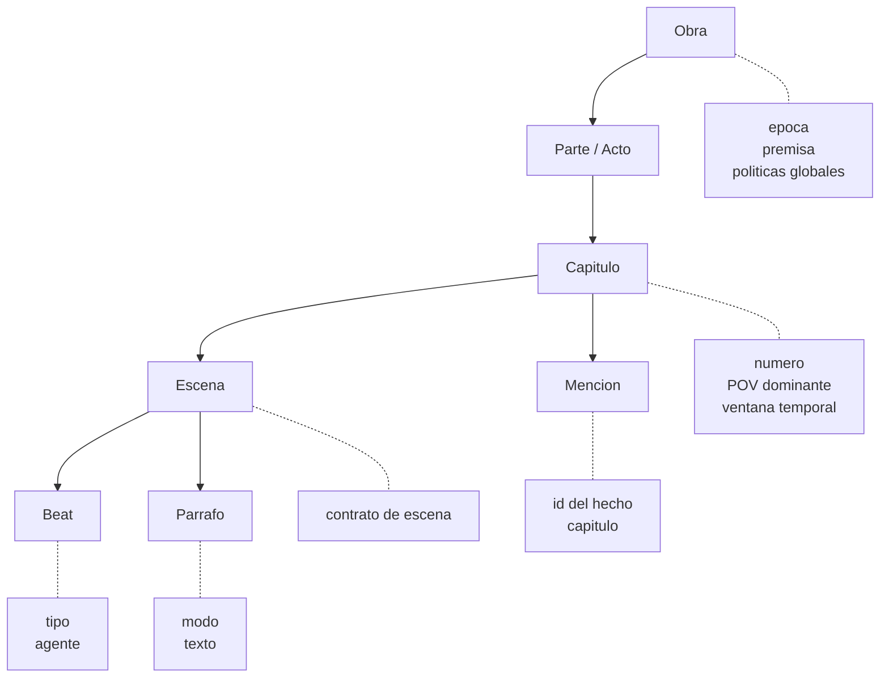
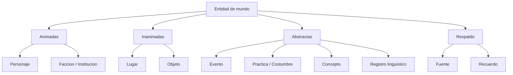
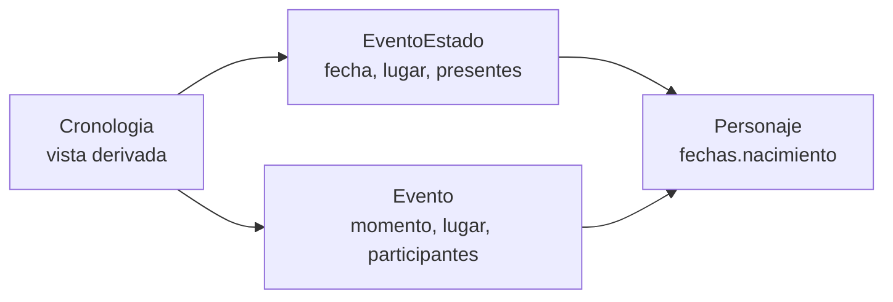
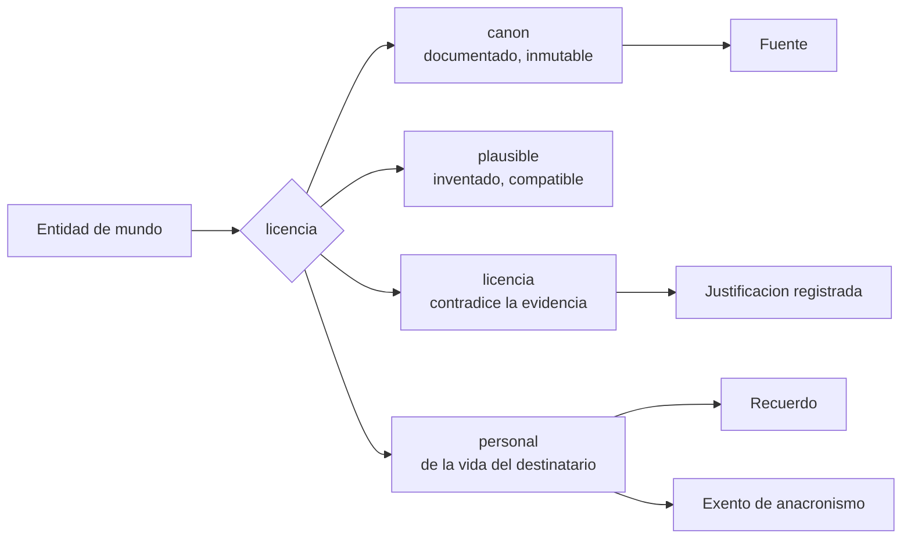
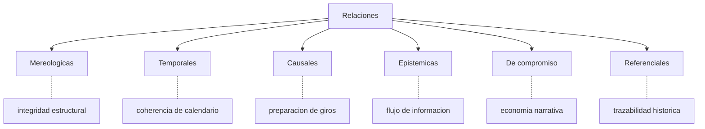
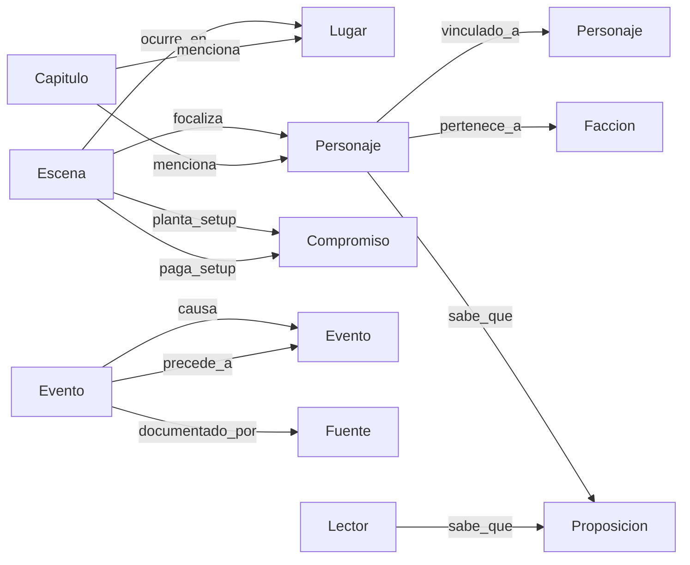
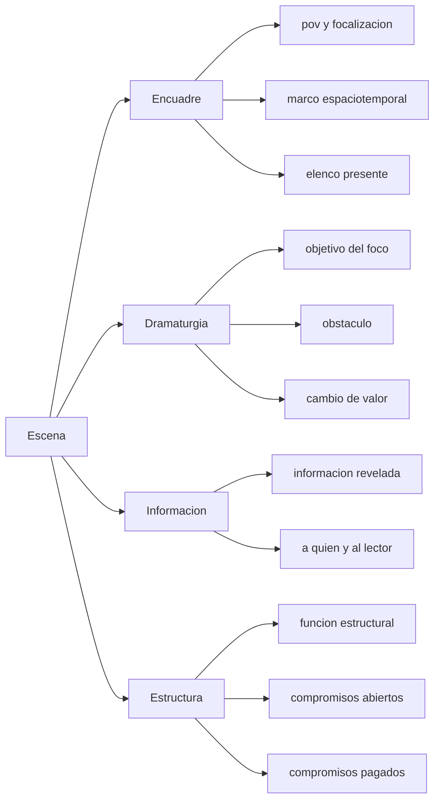
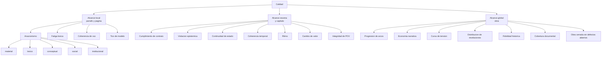
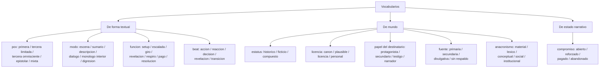

# Ontología de novela histórica — Diagramas Mermaid

2026-09-21 · [NOMBRE_ANONIMIZADO]

## Cómo leer estos diagramas

Seis diagramas Mermaid que acompañan al documento de definiciones. Cada uno responde a una pregunta distinta; no hay un único árbol porque la ontología no es un árbol, es un grafo con varias jerarquías superpuestas.

| Diagrama | Responde a |
| --- | --- |
| 1. Árbol de la obra | ¿Cómo se descompone el texto? |
| 2. Árbol del mundo | ¿Qué tipos de referente existen? |
| 3. Relaciones | ¿Qué conecta con qué y de qué forma? |
| 4. Contrato de escena | ¿Qué hace falta para generar una escena? |
| 5. Árbol de calidad | ¿Qué se mide y dónde? |
| 6. Vocabularios | ¿Qué valores cerrados existen? |

Los diagramas de la capa de producción —mapa de capas, entidades de producción, flujo de contexto y ciclo de vida del capítulo— están en `architecture.md`.

**Convenciones:** los nodos en `PascalCase` son entidades, en minúscula son atributos o valores. Las flechas sin etiqueta indican composición o especialización; las etiquetadas, relaciones con nombre propio.

## 1. Árbol de la capa Obra

Jerarquía mereológica estricta: cada nivel pertenece a uno y solo un padre. `Parte` es opcional. La `Escena` es la unidad operativa: es el nivel más bajo en el que se puede declarar un contrato completo antes de generar. La `Mención` cuelga del capítulo cerrado y apunta por `id` a un hecho de la biblia: no forma parte del texto, dice qué nombra.

## 2. Árbol de la capa Mundo

El respaldo tiene dos formas: la `Fuente` respalda una época y el `Recuerdo`
respalda a una persona, la del destinatario al que va dedicada la obra.

Los hechos de la biblia —los que registran en qué capítulos se usan— son
`Personaje`, `Facción`, `Lugar`, `Objeto` y `Evento`. La cronología no es un
nodo de este árbol: es una vista que se compone de los eventos y de las fechas
de nacimiento de las fichas.

Toda entidad de esta capa lleva además el campo transversal de licencia:

Ese campo es lo que permite al validador distinguir un error de una decisión artística.

## 3. Relaciones transversales

Las seis familias, con su validador asociado:

Cómo se instancian entre entidades concretas:

El `Lector` aparece como sujeto epistémico de pleno derecho. Es lo que permite comprobar si una revelación llega preparada o cae en el vacío, y es la relación que casi ningún sistema de generación modela.

## 4. Contrato de escena

Si falta un campo, la escena no es generable. Si el texto producido no lo satisface, la escena se rechaza. Es el punto donde la ontología deja de ser descriptiva y se vuelve ejecutable.

## 5. Árbol de calidad

Cada hoja es una dimensión observable solo en su alcance, y formulada como predicado sobre entidades de la ontología, no como impresión sobre el texto.

## 6. Vocabularios controlados

Estos valores cerrados son los que hacen computables los predicados de calidad. Los vocabularios de proceso están en `architecture.md`.
