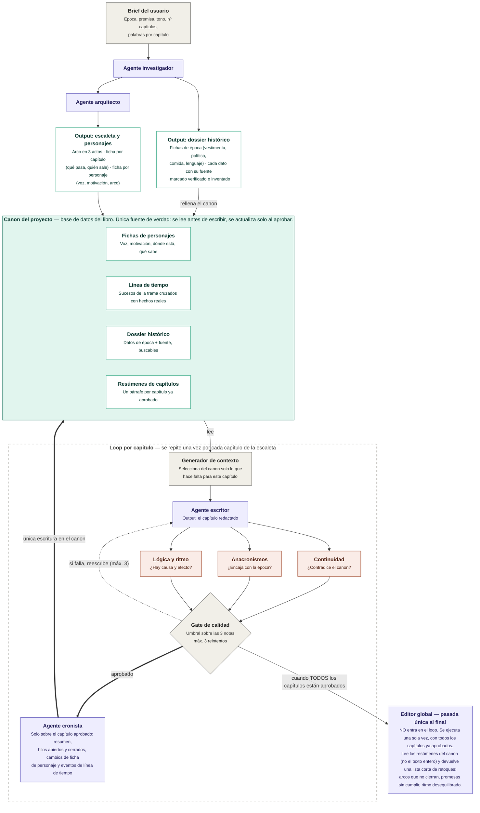

# Spec — Sistema multiagente de novelas históricas

## §1 Visión y alcance

Sistema que escribe una novela histórica capítulo a capítulo a partir de un brief corto. Un agente investiga la época, otro diseña la estructura, un escritor redacta cada capítulo y tres revisores lo puntúan antes de que entre en el canon. Al terminar, un editor global propone retoques sobre el conjunto.

**Principio rector.** Lo determinista vive en código del harness: selección de contexto, cálculo del gate, control de reintentos, escritura en el canon y máquina de estados. Lo generativo vive en agentes: investigar, estructurar, redactar, revisar y editar. Ningún agente escribe en el canon; propone, y el harness decide.

**Qué produce.** Un canon consultable, un fichero por capítulo aprobado y una lista final de retoques. No maqueta el libro ni aplica esos retoques por sí mismo.

**Fuera de alcance en 0.1.0.** Interfaz gráfica, exportación a EPUB, ilustraciones, varios proyectos a la vez, traducción y reescritura automática a partir del editor global.

**Criterio de éxito.** Una novela completa sin contradicciones de canon detectables ni anacronismos groseros, con intervención humana solo en los dos puntos que fija §4.

## §2 Glosario

| Término | Significado en este sistema |
|---|---|
| Brief | Entrada del usuario: época, premisa, tono, nº de capítulos y palabras por capítulo. Lo único que se escribe a mano al arrancar. |
| Canon | Base de datos del libro. Única fuente de verdad. Se lee antes de escribir y se actualiza solo al aprobar. |
| Dossier | Conjunto de datos históricos del canon, cada uno con su fuente y su estado de verificación. |
| Dato histórico | Unidad mínima del dossier: una afirmación sobre la época, con categoría, fuente y estado. |
| Escaleta | Plan de la novela: arco en tres actos y una ficha por capítulo. |
| Ficha de capítulo | Qué pasa en un capítulo y quién sale. Es el encargo que recibe el escritor. |
| Capítulo redactado | Texto que produce el escritor en un intento concreto. Puede no llegar a aprobarse. |
| Resumen | Un párrafo por capítulo aprobado, con hilos abiertos y cerrados. Es lo que lee el editor global. |
| Generador de contexto | Código que selecciona del canon lo que hace falta para un capítulo y arma el paquete de contexto. |
| Paquete de contexto | Salida del generador: el subconjunto del canon que ve el escritor. |
| Revisor | Agente que puntúa un capítulo en una dimensión y devuelve incidencias. Hay tres. |
| Nota | Puntuación de 1 a 5 que da un revisor en su dimensión. |
| Gate | Código que decide, con las tres notas, si el capítulo se aprueba o se reescribe. |
| Intento | Cada pasada del escritor sobre el mismo capítulo. Máximo tres. |
| Editor global | Agente de pasada única al final, fuera del loop. Lee resúmenes, no texto. |
| Harness | Todo el código determinista que orquesta el proceso. No genera prosa. |

## §3 Modelo de datos del canon

**Decisión de almacenamiento.** El canon es una base SQLite (`canon.db`) y, al lado, un fichero Markdown por intento de capítulo en `capitulos/`; SQLite porque el dossier y la línea de tiempo se consultan con filtros y búsqueda de texto, y el texto largo no gana nada viviendo dentro de la base.

Los tipos son lógicos, no de un motor concreto, porque el stack sigue sin decidir (§11, DA-01). `lista` se serializa como JSON en una columna de texto. Todas las entidades llevan `id` de texto salvo donde el número de capítulo ya es clave.

El brief no tiene tabla propia: se guarda como fila única en `proyecto` con sus cinco campos (época, premisa, tono, nº de capítulos y palabras por capítulo) más el estado de §4.

**Personaje**

| Campo | Tipo | Obl. | Notas |
|---|---|---|---|
| id | texto | sí | Slug estable, se usa en referencias cruzadas |
| nombre | texto | sí | |
| rol | enum | sí | `protagonista` \| `secundario` \| `figurante` |
| voz | texto | sí | Cómo habla: registro, muletillas, qué nunca diría |
| motivacion | texto | sí | Qué quiere y por qué |
| arco | texto | sí | De dónde parte y adónde llega |
| ubicacion | texto | sí | Dónde está ahora mismo en la trama |
| sabe | lista | no | Qué conoce y qué ignora. Clave para la revisión de continuidad |
| actualizado_en | entero | sí | Nº del último capítulo aprobado que tocó la ficha |

**Evento de timeline**

| Campo | Tipo | Obl. | Notas |
|---|---|---|---|
| id | texto | sí | |
| tipo | enum | sí | `trama` \| `historico` |
| fecha | texto | sí | ISO parcial: `1587`, `1587-04`, `1587-04-12` |
| descripcion | texto | sí | Una frase |
| capitulo | entero | no | Solo en eventos de trama |
| personajes | lista | no | Ids de personaje implicados |
| dato_id | texto | no | Dato histórico que respalda un evento `historico` |

**Dato histórico**

| Campo | Tipo | Obl. | Notas |
|---|---|---|---|
| id | texto | sí | |
| categoria | enum | sí | `vestimenta` \| `politica` \| `comida` \| `lenguaje` \| `otro` |
| dato | texto | sí | Afirmación concreta y verificable |
| fuente | texto | sí | URL si viene de búsqueda; `modelo` si es conocimiento del agente |
| estado | enum | sí | `verificado` \| `sin_verificar` \| `inventado` |
| etiquetas | lista | sí | Términos de búsqueda para el generador de contexto |

**Ficha de capítulo**

| Campo | Tipo | Obl. | Notas |
|---|---|---|---|
| numero | entero | sí | Clave |
| titulo | texto | sí | |
| acto | entero | sí | 1, 2 o 3 |
| sinopsis | texto | sí | Qué pasa, en tres o cuatro frases |
| personajes | lista | sí | Ids de quien sale |
| objetivo | texto | sí | Qué tiene que haber cambiado al acabar el capítulo |
| palabras_objetivo | entero | sí | Heredado del brief salvo que la escaleta lo ajuste |
| estado | enum | sí | `pendiente` \| `en_curso` \| `aprobado` \| `bloqueado` |

**Capítulo redactado**

| Campo | Tipo | Obl. | Notas |
|---|---|---|---|
| capitulo | entero | sí | Referencia a la ficha |
| intento | entero | sí | 1, 2 o 3 |
| ruta | texto | sí | Ruta al `.md`, p. ej. `capitulos/012-i2.md` |
| palabras | entero | sí | |
| revisiones | lista | no | Las tres notas con sus incidencias. Nulo antes de revisar |
| faltantes | lista | no | Datos de época que el escritor echó en falta al redactar (§5) |
| estado | enum | sí | `propuesto` \| `aprobado` \| `descartado` |
| creado | fecha | sí | |

**Resumen de capítulo**

| Campo | Tipo | Obl. | Notas |
|---|---|---|---|
| capitulo | entero | sí | Clave. Solo existe si el capítulo está aprobado |
| resumen | texto | sí | Un párrafo |
| hilos_abiertos | lista | sí | Promesas que el capítulo deja pendientes |
| hilos_cerrados | lista | sí | Promesas que salda |
| personajes_presentes | lista | sí | Ids |

**Ejemplo (personaje).** Único ejemplo del documento; fija el estilo para el resto.

```json
{
  "id": "ines-de-arteaga",
  "nombre": "Inés de Arteaga",
  "rol": "protagonista",
  "voz": "Frases cortas y secas. Usa términos de navegación con naturalidad. Nunca jura en voz alta.",
  "motivacion": "Recuperar el nombre de su padre, condenado por contrabando.",
  "arco": "De obedecer las reglas del gremio a romperlas a sabiendas.",
  "ubicacion": "Sevilla, barrio de Triana",
  "sabe": ["Que el contador falsificó el registro", "Ignora que su hermano lo sabía"],
  "actualizado_en": 7
}
```

## §4 Arquitectura y flujo

El sistema tiene tres tramos: preparación (una vez), loop de capítulo (una vez por capítulo) y cierre (una vez). El canon está en medio de todos y es el único punto de contacto entre ellos: los agentes nunca se pasan datos entre sí por fuera del canon o del paquete de contexto. Dentro del loop, la única escritura en el canon ocurre después del gate, cuando el cronista convierte el capítulo aprobado en resumen y en cambios de ficha.

El diagrama nació en [`sistema-novelas-historicas-v2.drawio`](../diagrama/sistema-novelas-historicas-v2.drawio) y su versión Mermaid vive en [`sistema-novelas-historicas-v2.mermaid`](../diagrama/sistema-novelas-historicas-v2.mermaid), idéntica al bloque de abajo. El `.drawio` es ahora el que va por detrás: le falta el cronista y hay que regenerarlo a mano. Los colores separan agentes, revisores, datos y harness.



**Máquina de estados del proyecto.** Un solo campo en `proyecto`, avanza en un sentido salvo `bloqueado`.

- `borrador` — existe el brief, no hay nada más. Transición al arrancar el investigador.
- `investigado` — el dossier está en el canon. Habilita al arquitecto.
- `estructurado` — escaleta y fichas de personaje en el canon. Habilita el loop.
- `escribiendo` — hay al menos un capítulo aprobado y quedan pendientes.
- `bloqueado` — un capítulo agotó los tres intentos. Requiere mano humana (§7).
- `escrito` — todas las fichas de capítulo en `aprobado`. Habilita el editor global.
- `editado` — existe la lista de retoques. Estado final del sistema.

**Qué corre en paralelo.** Solo los tres revisores, sobre el mismo capítulo, en tres llamadas simultáneas e independientes. Todo lo demás es secuencial: el arquitecto necesita el dossier cerrado, y cada capítulo necesita el canon actualizado por el anterior. No se escriben dos capítulos a la vez, aunque parezca tentador: el capítulo N+1 depende de lo que el N haya dejado en las fichas de personaje.

**Dónde entra el humano.** Dos puntos fijos:

1. **Capítulo bloqueado.** Al fallar el tercer intento el sistema para y espera. Tú editas el texto a mano, relajas el umbral o retocas la ficha de capítulo, y lo desbloqueas (§7).
2. **Retoques finales.** El editor global entrega una lista y tú decides qué aplicar. Aplicarlos es manual y fuera del sistema en 0.1.0.

Queda por decidir un tercer punto: parar al acabar la preparación para que revises dossier y escaleta antes de arrancar el loop. Es la parada más barata del sistema y un fallo ahí contamina el libro entero, pero obliga a partir la ejecución en dos arranques. Sin cerrar, en §11 (DA-03). Mientras no se decida, la preparación no para y la escaleta se corrige editando el canon a mano.

## §5 Agentes

Ocho agentes. Ninguno escribe en el canon: todos devuelven una propuesta estructurada que valida y persiste el harness. Actualizar el canon tras aprobar es trabajo de un agente propio, el cronista, y no del escritor, porque así corre una sola vez sobre el texto que se queda en lugar de tres veces sobre borradores que se descartan. El modelo sugerido es una primera apuesta de la familia Claude, revisable sin tocar el diseño (§11, DA-02).

| Agente | Entrada | Salida | Modelo sugerido |
|---|---|---|---|
| Investigador | Brief | Lista de datos históricos | Opus 5 + herramienta de búsqueda |
| Arquitecto | Brief + dossier | Escaleta y fichas de personaje | Opus 5 |
| Escritor | Paquete de contexto (§6) | Capítulo en Markdown + lista de faltantes | Opus 5 |
| Revisor de continuidad | Capítulo + extracto de canon | Nota 1-5 + incidencias | Sonnet 5 |
| Revisor de anacronismos | Capítulo + dossier relevante | Nota 1-5 + incidencias | Sonnet 5 |
| Revisor de lógica y ritmo | Capítulo + ficha de capítulo | Nota 1-5 + incidencias | Sonnet 5 |
| Cronista | Capítulo aprobado + fichas de quien sale | Resumen, hilos, cambios de personaje y eventos | Sonnet 5 |
| Editor global | Resúmenes + escaleta + personajes | Lista de retoques | Opus 5 |

**Investigador.** Le pido fichas de época sobre vestimenta, política, comida y lenguaje para el lugar y las fechas del brief. Trabaja de memoria por defecto y busca en la web solo los datos que él mismo marca como dudosos. Cada dato sale con su categoría y su estado: `verificado` si hay fuente que lo respalde, `sin_verificar` si solo lo recuerda, `inventado` si lo rellena él para tapar un hueco. Modos de fallo: inventar fuentes con aspecto creíble, marcar `verificado` lo que solo recuerda, y desbordarse en cantidad de datos genéricos que luego nadie usa.

**Arquitecto.** Le pido el arco en tres actos, una ficha por capítulo y una ficha por personaje, coherentes con el dossier ya cerrado. Reparte los hilos para que cada capítulo cierre algo y abra algo. Modos de fallo: escaletas planas donde el acto central no tiene giro, personajes con motivación decorativa que no mueve la trama, y capítulos que prometen más de lo que caben en las palabras objetivo.

**Escritor.** Le paso el paquete de contexto y le pido el capítulo entero, en prosa, respetando la voz de cada personaje y sin introducir hechos que no estén en el canon. Si necesita un detalle de época que no le he dado, resuelve la escena sin él y lo anota en `faltantes`, lista que viaja con el capítulo y que el harness guarda: no hay canal de vuelta síncrono ni el escritor espera respuesta de nadie. Modos de fallo: resumir en lugar de dramatizar cuando se acerca al límite de palabras, homogeneizar las voces hacia un registro neutro, y colar objetos o ideas fuera de época por inercia narrativa.

**Revisor de continuidad.** Le pido que compare el capítulo contra el extracto de canon y señale contradicciones: alguien en dos sitios, alguien que sabe lo que no debería, cronología imposible. Devuelve nota e incidencias con cita textual. Modos de fallo: confundir elipsis con hueco de continuidad, y penalizar información nueva que es legítima por no estar todavía en el canon.

**Revisor de anacronismos.** Le pido que verifique objetos, costumbres, instituciones y léxico contra el dossier de la época. Distingue error de licencia por el estado del dato: contradecir un `verificado` es incidencia grave, un `sin_verificar` es aviso, y chocar con un `inventado` no cuenta mientras el capítulo siga siendo coherente con él. Modos de fallo: falsos positivos con vocabulario moderno pero de uso válido, y no ver el anacronismo conceptual, que es el caro.

**Revisor de lógica y ritmo.** Le pido causa y efecto, que el objetivo de la ficha de capítulo se cumpla y que la escena no se atasque. Devuelve nota e incidencias localizadas por párrafo. Modos de fallo: premiar densidad de acontecimientos y castigar escenas de respiro que la novela necesita.

**Cronista.** Corre una sola vez por capítulo, después del gate y solo sobre el intento aprobado. Le paso el texto, la ficha de capítulo y las fichas de quien sale, y le pido cuatro cosas: el resumen de un párrafo, los hilos que abre y los que cierra, los cambios de `ubicacion` y `sabe` de cada personaje presente, y los eventos de trama nuevos para la línea de tiempo. Devuelve una propuesta que el harness valida antes de escribirla en el canon. Modos de fallo: resúmenes que cuentan lo que pasa pero no lo que cambia, dar por sabido a un personaje algo que ocurrió sin él delante, y callarse hilos abiertos, que es el fallo caro porque el editor global solo ve lo que el cronista escribió.

**Editor global.** Le paso los resúmenes de todos los capítulos, la escaleta y las fichas de personaje, nunca el texto completo. Le pido una lista corta y accionable: arcos que no cierran, promesas abiertas sin saldar, actos desequilibrados. Modos de fallo: generalidades no accionables del tipo «reforzar el tema», y proponer reescrituras masivas cuando el encargo es una lista de retoques.
