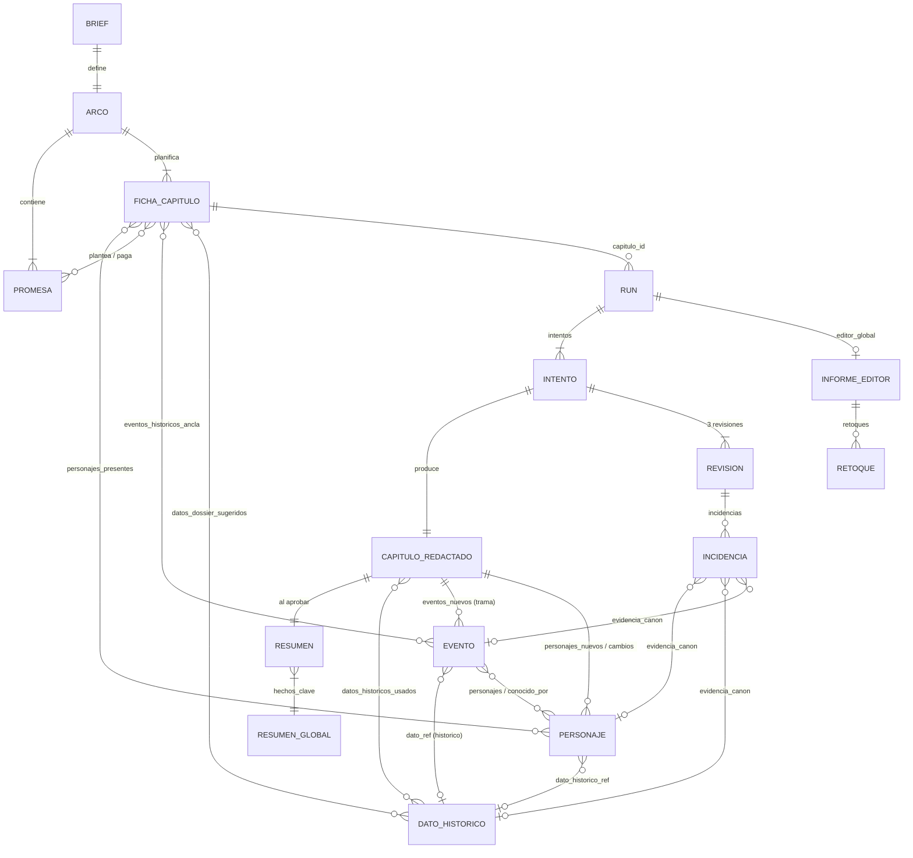
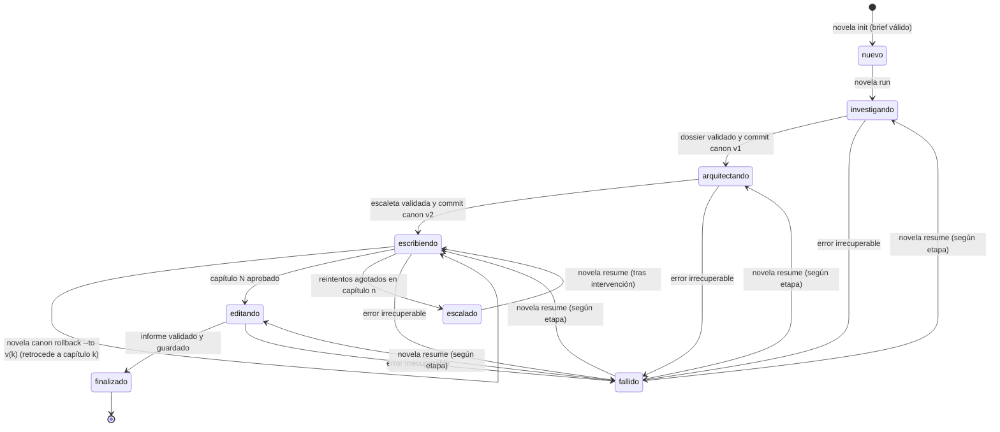

# Especificación del sistema multiagente de novelas históricas

> Estado del documento: borrador en construcción. Cada sección lleva su propia marca de estado bajo el título hasta que se cierre.

## Tabla de contenidos

- [§1 Visión y alcance](#1-visión-y-alcance)
- [§2 Glosario](#2-glosario)
- [§3 Modelo de datos del canon](#3-modelo-de-datos-del-canon)
- [§4 Arquitectura del harness](#4-arquitectura-del-harness)
- [§5 Catálogo de agentes](#5-catálogo-de-agentes)
- [§6 Generador de contexto](#6-generador-de-contexto)
- [§7 Loop de capítulo y gate de calidad](#7-loop-de-capítulo-y-gate-de-calidad)
- [§8 Editor global](#8-editor-global)
- [§9 Contratos de I/O y validación](#9-contratos-de-io-y-validación)
- [§10 Persistencia y versionado del canon](#10-persistencia-y-versionado-del-canon)
- [§11 Errores, reintentos y reanudación](#11-errores-reintentos-y-reanudación)
- [§12 Observabilidad y costes](#12-observabilidad-y-costes)
- [§13 Configuración](#13-configuración)
- [§14 Estructura del repo](#14-estructura-del-repo)
- [§15 Plan de evaluación y tests](#15-plan-de-evaluación-y-tests)
- [§16 Roadmap por fases](#16-roadmap-por-fases)
- [§17 Riesgos y decisiones abiertas](#17-riesgos-y-decisiones-abiertas)
- [§18 Decisiones de arquitectura (ADRs)](#18-decisiones-de-arquitectura-adrs)
  - [§18.1 ADR-0001 — Formato del canon](#181-adr-0001--formato-del-canon)
  - [§18.2 ADR-0002 — Framework de orquestación](#182-adr-0002--framework-de-orquestación)
  - [§18.3 ADR-0003 — Revisores en paralelo vs. secuencial](#183-adr-0003--revisores-en-paralelo-vs-secuencial)
  - [§18.4 ADR-0004 — Criterio del gate](#184-adr-0004--criterio-del-gate)
  - [§18.5 ADR-0005 — Política de selección de contexto](#185-adr-0005--política-de-selección-de-contexto)
- [§19 Trazabilidad diagrama → spec](#19-trazabilidad-diagrama--spec)
- [§20 Historial de cambios del spec](#20-historial-de-cambios-del-spec)

---

## §1 Visión y alcance

> Estado: completa

### §1.1 Problema que se resuelve

Escribir una novela histórica larga con un LLM en una sola pasada falla por tres motivos que se refuerzan entre sí:

| Problema | Síntoma en el texto | Causa raíz |
|---|---|---|
| Pérdida de continuidad | Un personaje muerto en el capítulo 4 habla en el 9; una carta que se quemó reaparece. | El modelo no tiene memoria fiable del libro; el contexto no cabe o se degrada. |
| Anacronismos | Patatas en la Castilla de 1450, relojes de bolsillo en Roma. | El modelo mezcla épocas y no distingue lo que sabe de lo que rellena. |
| Deriva narrativa | Arcos que no cierran, promesas al lector sin pago, ritmo plano. | Nadie sostiene la estructura global mientras se genera lo local. |

El sistema descrito aquí ataca los tres problemas separando responsabilidades: una fase de preparación fija los hechos y la estructura antes de escribir; un **canon** persistente actúa como única fuente de verdad; cada capítulo pasa por tres revisores independientes y un gate determinista antes de entrar en el canon; y un editor global comprueba la estructura al final. El diagrama `docs/diagrama/sistema-novelas-historicas-v2.drawio` es la fuente de verdad del flujo; este documento lo hace implementable.

### §1.2 Qué especifica este documento

Este spec cubre dos cosas distintas que conviven en el mismo proceso:

1. **El harness**: el código determinista que orquesta el flujo, genera el contexto, aplica el gate, persiste el canon, gestiona errores, reanuda ejecuciones y registra costes. Todo lo que puede decidirse con una regla se decide en el harness (§4, §6, §7, §9, §10, §11, §12, §13).
2. **La solución agéntica**: los siete agentes LLM (investigador, arquitecto, escritor, tres revisores, editor global), con sus prompts, contratos de salida, modelos sugeridos y modos de fallo (§5, §8).

La regla de separación es estricta y se repite en todo el documento: **lo determinista va en código, lo generativo va en agentes**. Un agente nunca decide si un capítulo se aprueba; un trozo de código nunca redacta prosa.

### §1.3 Usuario y entorno de ejecución

| Aspecto | Valor |
|---|---|
| Usuario | Una sola persona, autor del proyecto. No hay multiusuario ni permisos. |
| Entorno | Máquina local (Windows 11 en el desarrollo actual; el diseño no depende del SO). |
| Interfaz | Línea de comandos. Una interfaz web o de escritorio queda fuera de esta versión (§1.5). |
| Lenguaje de implementación | Python 3.12 o superior. Motivo: ecosistema LLM maduro, `asyncio` para el paralelismo de revisores, y es la elección del autor. |
| Proveedores LLM | Abstracción multiproveedor desde la fase 1 (§4.6, §13). El harness no depende de ningún proveedor concreto; cada agente puede apuntar a un modelo distinto. |
| Conectividad | Se asume acceso a internet para las APIs de los proveedores. La búsqueda web del investigador es una herramienta opcional (§5.1). |
| Intervención humana | Ninguna dentro del flujo normal. El proceso solo se detiene y escala al usuario cuando un capítulo agota los reintentos o ante un fallo irrecuperable (§7.7, §11). El usuario puede parar el proceso, editar el canon a mano y reanudar (§10.6, §11.5). |

### §1.4 Criterios de éxito

Éxito funcional: dado un brief válido, el sistema produce sin intervención humana un libro completo con todos los capítulos aprobados por el gate, el canon actualizado y el informe del editor global, o bien se detiene con una escalada clara y reanudable.

Métricas de éxito medibles (los valores objetivo son iniciales y se recalibran con el set de evaluación de §15.6):

| Métrica | Definición | Objetivo inicial | Dónde se mide |
|---|---|---|---|
| Tasa de aprobación a la primera | Capítulos aprobados en el intento 1 / capítulos totales | ≥ 60 % | §12.4 |
| Reintentos medios por capítulo | Suma de intentos adicionales / capítulos | ≤ 0,8 | §12.4 |
| Capítulos escalados | Capítulos que agotan `max_reintentos` | ≤ 1 por libro de 20 capítulos | §12.4 |
| Contradicciones detectables por código | Fallos de las comprobaciones deterministas de §7.3 en capítulos aprobados | 0 | §15.3 |
| Coste por capítulo | Coste total de un run de capítulo, incluidos reintentos | Dentro del límite de §13 (por defecto 3 USD) | §12.4 |
| Reanudación | Tras matar el proceso en cualquier punto, relanzar continúa sin repetir trabajo aprobado ni duplicar gasto | 100 % de los casos de §15.4 | §11.5 |

Lo que **no** es criterio de éxito de esta versión: la calidad literaria absoluta del texto. Se mide indirectamente a través de los revisores y del editor global, pero no hay juez humano en el bucle.

### §1.5 Fuera de alcance

| Fuera | Motivo |
|---|---|
| Interfaz web o gráfica | El usuario trabaja en local por CLI. Se retoma en una versión posterior si hace falta. |
| Multiusuario, permisos, autenticación | Un solo usuario en su máquina. |
| Generación de imágenes, portadas, maquetación editorial | No aparece en el diagrama. |
| Traducción del libro terminado | El idioma se fija en el brief y todo se genera en él. |
| Edición humana interactiva capítulo a capítulo | Decidido por el usuario en la Fase 0: sin aprobación humana en el flujo. |
| Reescritura automática tras el editor global | El editor global devuelve una lista de retoques; ejecutarlos automáticamente queda como opción definida en §8 pero no implementada en la fase 1 (§16). |
| Fine-tuning o entrenamiento de modelos | Solo se usan modelos vía API. |
| Publicación o exportación a EPUB/PDF | Se entrega Markdown; la conversión es trivial con herramientas externas. |

### §1.6 Supuestos explícitos

Cada supuesto está marcado y recogido también en §17. Si alguno resulta falso, hay que revisar las secciones indicadas.

| Id | Supuesto | Secciones afectadas si falla |
|---|---|---|
| S-01 | Un capítulo tiene entre 1.500 y 6.000 palabras, con 3.000 como valor por defecto. El usuario no ha fijado tamaño objetivo; estos valores son configurables (§13). | §5.3, §6 |
| S-02 | Un libro tiene entre 8 y 40 capítulos. Por encima de 40 el presupuesto de contexto de §6 necesita recalibrarse. | §6, §12 |
| S-03 | El canon completo de un libro cabe en pocos megabytes de texto. Esto justifica ficheros planos y snapshots por copia completa (§3.2, §10). | §3, §10 |
| S-04 | Los modelos usados admiten salida estructurada en JSON y ventanas de contexto de al menos 128k tokens para el escritor. | §5, §6, §9 |
| S-05 | El coste de tokens de los proveedores es conocido y se puede tabular en la configuración (§13) para calcular costes sin llamar a APIs de facturación. | §12 |
| S-06 | Un capítulo se genera de una pieza en una sola llamada al escritor, dividido internamente en escenas. No se generan escenas en llamadas separadas. | §5.3, §7 |
| S-07 | El usuario acepta que los datos marcados como inventados aparezcan en la novela sin marca en la prosa, siempre que queden registrados en los metadatos del capítulo. Decidido en Fase 0 con valores por defecto. | §3.6, §5.3, §5.5 |
| S-08 | La búsqueda web del investigador es opcional y está desactivada por defecto en la fase 1. | §5.1, §16 |

### §1.7 Principios de diseño

Estos principios se citan por número en el resto del documento.

| Id | Principio | Consecuencia práctica |
|---|---|---|
| P-01 | Determinista en código, generativo en agentes. | Gate, selección de contexto, persistencia, reintentos y métricas no llaman a ningún LLM. |
| P-02 | El canon es la única fuente de verdad. | Ningún agente recibe información del libro que no venga del canon a través del generador de contexto (§6). |
| P-03 | El canon solo se escribe al aprobar. | Todo lo que produce un run va a staging; solo el gate aprobado dispara un commit atómico (§10.4). |
| P-04 | Toda salida de LLM es JSON validado contra schema. | Sin excepción, ni para la prosa del escritor (§9). |
| P-05 | Todo run es idempotente y reanudable. | La clave es `run_id` + `capitulo_id`; relanzar nunca repite trabajo aprobado (§11). |
| P-06 | Todo se mide. | Cada llamada LLM deja una fila de log con tokens, coste, latencia y resultado (§12). |
| P-07 | Los reintentos son incrementales. | El escritor recibe su texto anterior y las incidencias, nunca una orden de empezar de cero (§7.6). |
| P-08 | Nada se decide en silencio. | Cada decisión técnica lleva justificación; cada supuesto está en §17; cada cambio del spec, en §20. |

## §2 Glosario

> Estado: completa

Un término tiene una sola definición y un solo nombre en el código. Convención de nombres en código: identificadores en español, sin tildes ni eñes, `snake_case` para funciones, variables, campos JSON y ficheros; `PascalCase` para clases y tipos. Los prefijos de identificador (`per_`, `evt_`, ...) se definen en §3.1.2.

### §2.1 Términos del dominio narrativo

| Término | Definición | Nombre en código |
|---|---|---|
| Brief | Entrada del usuario que arranca un proyecto: época, premisa, tono, idioma y número de capítulos. Es inmutable una vez creado el proyecto. | `Brief` / `brief.json` |
| Proyecto | Un libro en producción: brief, canon, runs, estado y configuración. Vive en un directorio propio. | `Proyecto` / `proyecto_id` |
| Canon | Base de datos del libro. Única fuente de verdad: personajes, línea de tiempo, dossier histórico, escaleta, resúmenes y capítulos aprobados. Se lee antes de escribir y se escribe solo al aprobar (P-02, P-03). | `Canon` |
| Dossier histórico | Colección de datos históricos de la época del libro, cada uno con fuente y estado. Parte del canon; buscable (§3.14). | `Dossier` / `canon/dossier/` |
| Dato histórico | Unidad del dossier: un hecho concreto de época (vestimenta, política, comida, lenguaje, ...), con fuente y estado ∈ {verificado, inventado}. | `DatoHistorico` |
| Ficha | Registro estructurado de una entidad del canon. Hay fichas de personaje, de capítulo y de dato histórico. "Ficha" a solas no se usa en código; siempre se especializa. | `Personaje`, `FichaCapitulo`, `DatoHistorico` |
| Personaje | Ficha de un actor de la novela: voz, motivación, arco, dónde está y qué sabe. | `Personaje` |
| Línea de tiempo | Lista ordenada de eventos de la trama cruzados con hechos históricos reales. | `Timeline` / `canon/timeline.json` |
| Evento | Elemento de la línea de tiempo. Tipo `trama` (ocurre en la novela) o `historico` (ocurrió en la realidad y ancla la trama). | `Evento` |
| Escaleta | Plan del libro producido por el arquitecto: arco en tres actos, promesas narrativas y una ficha por capítulo. | `Escaleta` / `canon/escaleta/` |
| Arco | Estructura global del libro en tres actos, con la función de cada acto y los puntos de giro. | `Arco` / `canon/escaleta/arco.json` |
| Acto | Cada una de las tres partes del arco. Un capítulo pertenece exactamente a un acto. | `acto` ∈ {1, 2, 3} |
| Ficha de capítulo | Plan de un capítulo dentro de la escaleta: qué pasa, quién sale, dónde, cuándo y qué beats lo componen. Existe antes de escribir el capítulo. | `FichaCapitulo` |
| Capítulo | Unidad de generación y aprobación del libro. Tiene una ficha (plan), cero o más borradores (intentos) y, al aprobarse, un texto y un resumen en el canon. | `Capitulo` / `capitulo_id` |
| Capítulo redactado | Salida del escritor para un intento: la prosa dividida en escenas más sus metadatos. Solo entra al canon si el gate aprueba. | `CapituloRedactado` |
| Escena | Subdivisión del capítulo redactado con unidad de lugar, tiempo y personajes. Es la unidad de localización de las incidencias. | `Escena` |
| Beat | Unidad mínima de la ficha de capítulo: un suceso o giro que el capítulo debe contener. Un beat se realiza en una o varias escenas. | `Beat` |
| Promesa | Compromiso narrativo con el lector (setup) que debe pagarse más adelante (payoff). Se registra en el arco y se sigue capítulo a capítulo. | `Promesa` |
| Resumen de capítulo | Un párrafo por capítulo aprobado, más los hechos clave y el estado final de personajes. Fuente principal del contexto para capítulos posteriores y del editor global. | `Resumen` / `canon/resumenes/` |
| Resumen global | Composición determinista de los hechos clave de todos los capítulos aprobados, usada como memoria comprimida del libro (§6.3). | `ResumenGlobal` |
| Retoque | Elemento de la lista que devuelve el editor global: un problema estructural con capítulos afectados y acción sugerida. | `Retoque` |

### §2.2 Términos del harness y del flujo

| Término | Definición | Nombre en código |
|---|---|---|
| Harness | El código determinista que orquesta agentes, canon, gate y persistencia (P-01). | paquete `harness/` |
| Agente | Componente que hace una llamada LLM con un prompt fijo y devuelve JSON validado. Dos clases: generador (produce contenido) y revisor (evalúa contenido). | `Agente`, `AgenteGenerador`, `AgenteRevisor` |
| Revisor | Agente que evalúa un capítulo redactado y devuelve una nota y una lista de incidencias. Hay tres: continuidad, anacronismos, lógica y ritmo. | `RevisorContinuidad`, `RevisorAnacronismos`, `RevisorLogicaRitmo` |
| Generador de contexto | Módulo del harness que lee el canon y construye el paquete de contexto de un capítulo bajo un presupuesto de tokens (§6). No es un agente. | `GeneradorContexto` |
| Paquete de contexto | Salida del generador de contexto: los fragmentos del canon seleccionados para un capítulo, ya serializados, con su recuento de tokens. | `PaqueteContexto` |
| Run | Una ejecución de una etapa del flujo sobre un proyecto: investigación, arquitectura, un capítulo o el editor global. Identificado por `run_id`. Un run de capítulo contiene de 1 a `max_reintentos` intentos. | `Run` / `run_id` |
| Intento | Una iteración del loop de capítulo dentro de un run: una llamada al escritor, tres revisiones y una evaluación del gate. Numerado desde 1. | `Intento` / `intento` |
| Reintento | Todo intento con número mayor que 1. El límite `max_reintentos` cuenta reintentos, no intentos: con `max_reintentos = 3` hay como máximo 4 intentos (1 inicial + 3 reintentos). | `max_reintentos` |
| Nota | Puntuación entera de 1 a 10 que un revisor asigna al capítulo en su dimensión. Es la única escala usada en el spec (§7.4). | `nota` |
| Incidencia | Problema concreto detectado por un revisor: severidad, localización en el texto, descripción, evidencia en el canon y sugerencia. | `Incidencia` |
| Severidad | Gravedad de una incidencia ∈ {bloqueante, mayor, menor, sugerencia}. `bloqueante` impide la aprobación por sí sola (§7.5). | `severidad` |
| Revisión | Salida completa de un revisor sobre un intento: nota, incidencias y resumen. | `Revision` |
| Gate | Función determinista del harness que, a partir de las tres revisiones, decide aprobar, reintentar o escalar (§7.5). | `GateCalidad` / `evaluar_gate()` |
| Veredicto del gate | Resultado del gate ∈ {aprobado, reintentar, escalado}. | `VeredictoGate` |
| Escalada | Parada del flujo con entrega de artefactos al usuario, porque un capítulo agotó los reintentos o hubo un fallo irrecuperable (§7.7, §11). | `Escalada` |
| Staging | Área de trabajo donde un run escribe sus salidas antes de que el gate las apruebe. Nunca se lee como canon. | `staging/` |
| Commit del canon | Aplicación atómica de las salidas en staging al canon tras la aprobación del gate (§10.4). No confundir con un commit de git. | `commit_canon()` |
| Snapshot | Copia íntegra del canon tomada justo después de cada commit del canon, que permite volver al estado tras el capítulo N (§10.3). | `Snapshot` / `snapshots/` |
| Estado del proyecto | Fichero que registra en qué etapa está el proyecto, qué capítulos están aprobados y qué run está en curso. Es lo que lee la reanudación (§11.5). | `EstadoProyecto` / `estado.json` |
| Proveedor | Implementación concreta de la interfaz de llamada a un LLM (Anthropic, OpenAI, local, mock). El harness solo conoce la interfaz. | `ProveedorLLM` |
| Llamada LLM | Una petición a un proveedor y su respuesta, con tokens, coste y latencia registrados (§12.1). | `LlamadaLLM` |
| Comprobación determinista | Verificación en código sobre el capítulo redactado que se ejecuta antes de los revisores (personaje muerto que aparece, dato no registrado, etc.) (§7.3). | `ComprobacionDeterminista` |
| Presupuesto de tokens | Máximo de tokens de entrada que el generador de contexto puede gastar en un paquete; se reparte por bloques con prioridades de recorte (§6.4). | `presupuesto_tokens` |

### §2.3 Términos de versionado

| Término | Definición | Dónde |
|---|---|---|
| Versión del spec | SemVer de este documento, en la cabecera YAML. Independiente del versionado del canon. | Cabecera, §20 |
| Versión del canon | Número entero que se incrementa con cada commit del canon; identifica un snapshot. | §10.2 |
| ADR | Registro de una decisión de arquitectura, con contexto, opciones, decisión, consecuencias y estado. | §18 |

## §3 Modelo de datos del canon

> Estado: completa

Esta sección define todas las entidades que viven en el canon y las que lo rodean (runs, revisiones, retoques). Es la referencia de nombres de campos para el resto del documento: §5 (salidas de agentes), §6 (selección de contexto), §7 (gate), §9 (schemas de validación) y §10 (persistencia) usan exactamente estos nombres.

### §3.1 Convenciones

#### §3.1.1 Cómo se leen los esquemas

Cada entidad se describe con una tabla de campos y un ejemplo relleno. Las columnas de la tabla son:

| Columna | Significado |
|---|---|
| Campo | Nombre exacto del campo JSON (`snake_case`, sin tildes). Los campos anidados se escriben con punto: `voz.registro`. |
| Tipo | `string`, `int`, `bool`, `float`, `enum`, `lista<T>`, `objeto`, o el nombre de un tipo común de §3.1.3. `T|null` admite nulo. |
| Oblig. | `sí` = obligatorio y no vacío (§9.4); `no` = opcional; `calc` = lo calcula el harness, nunca lo escribe un agente. |
| Restricciones | Valores permitidos, longitudes, rangos. "≤ N palabras" se valida en código con un conteo por espacios. |

Los JSON Schema formales (draft 2020-12) se derivan uno a uno de estas tablas y viven en `schemas/` (§9.1, §14). Ante discrepancia entre esta sección y un fichero de schema, manda esta sección y el schema es un bug.

#### §3.1.2 Identificadores

| Entidad | Prefijo y forma | Ejemplo | Quién lo asigna |
|---|---|---|---|
| Proyecto | slug ASCII en minúsculas, 3–40 caracteres | `comuneros-1521` | Usuario en el brief; si falta, el harness lo deriva del título |
| Personaje | `per_` + slug del nombre | `per_ines_de_ayala` | Harness, a partir del `nombre` que devuelve el agente |
| Evento | `evt_` + 4 dígitos secuenciales por proyecto | `evt_0017` | Harness al hacer commit |
| Dato histórico | `dat_` + 4 dígitos secuenciales por proyecto | `dat_0042` | Harness al hacer commit |
| Capítulo (ficha, redactado, resumen) | `cap_` + 3 dígitos = número de capítulo | `cap_007` | Harness, del número de capítulo |
| Promesa | `prm_` + 3 dígitos secuenciales | `prm_004` | Harness al hacer commit de la escaleta |
| Run | `run_` + ULID (26 caracteres, ordenable por tiempo) | `run_01J8ZK3M4N5P6Q7R8S9T0V1W2X` | Harness al crear el run |
| Revisión | `rev_` + `{run_id}_{intento}_{revisor}` | `rev_01J8ZK3M..._2_continuidad` | Harness, determinista (§11.3) |
| Incidencia | `inc_` + `{revision_id}_{nn}` | `inc_rev_01J8..._2_continuidad_03` | Harness al validar la revisión |
| Retoque | `ret_` + 3 dígitos | `ret_002` | Harness al validar el informe del editor |
| Llamada LLM | `llm_` + ULID | `llm_01J8ZK4...` | Harness antes de llamar al proveedor |

Regla: **ningún agente inventa identificadores**. Los agentes devuelven nombres y referencias a ids ya existentes; el harness asigna los ids nuevos al hacer commit. Motivo: evita colisiones, ids inconsistentes entre intentos y dependencia del formato que elija el modelo. La excepción es `capitulo_id`, que el agente recibe en el prompt y devuelve tal cual para que el harness verifique que responde al capítulo pedido.

Los slugs se generan con: minúsculas, transliteración de tildes y eñes a ASCII, espacios y signos a `_`, colapso de `_` repetidos, máximo 40 caracteres. Si dos personajes generan el mismo slug, el segundo recibe sufijo `_2`.

#### §3.1.3 Tipos comunes

**`FechaHistorica`**. Fecha dentro del mundo de la novela. No se usa ISO 8601 porque hay novelas antes de Cristo, fechas imprecisas ("primavera de 1521") y calendarios no gregorianos. Se guarda la fecha en calendario proléptico gregoriano con precisión declarada.

| Campo | Tipo | Oblig. | Restricciones |
|---|---|---|---|
| anio | int | sí | Negativo = a.C. (`-44` = 44 a.C.). No existe el año 0. |
| mes | int\|null | no | 1–12. Nulo si la precisión es `anio` o menor. |
| dia | int\|null | no | 1–31, válido para el mes. Nulo si la precisión es `mes` o menor. |
| precision | enum | sí | `dia`, `mes`, `estacion`, `anio`, `decada`, `siglo`, `aproximada` |
| texto | string | sí | Forma legible que usarán los prompts, p. ej. `"finales de abril de 1521"`. ≤ 12 palabras. |

Clave de ordenación calculada por el harness: `(anio, mes or 0, dia or 0)`. Dos fechas con la misma clave se consideran simultáneas para la línea de tiempo y se desempatan por `(capitulo_id, orden)`.

```json
{ "anio": 1521, "mes": 4, "dia": 23, "precision": "dia", "texto": "23 de abril de 1521" }
```

**`Fuente`**. Procedencia de un dato histórico.

| Campo | Tipo | Oblig. | Restricciones |
|---|---|---|---|
| tipo | enum | sí | `libro`, `articulo_academico`, `web`, `fuente_primaria`, `memoria_modelo`, `invencion` |
| referencia | string | sí | Cita legible: autor, título, año, capítulo o página si se conoce. ≥ 10 caracteres salvo `invencion`, donde vale `"inventado para la novela"`. |
| url | string\|null | no | Solo si `tipo` ∈ {`web`, `articulo_academico`} y la URL se ha visitado de verdad (§5.1). |
| fiabilidad | enum | sí | `alta`, `media`, `baja`. El harness fuerza `media` como máximo cuando `tipo = memoria_modelo` (DAT-3). |

**`Localizacion`**. Posición de un fragmento dentro de un capítulo redactado. Es la forma en que los revisores señalan dónde está un problema.

| Campo | Tipo | Oblig. | Restricciones |
|---|---|---|---|
| escena | int | sí | `orden` de una escena existente en el capítulo. |
| parrafo | int\|null | no | Índice del párrafo dentro de la escena, empezando en 1, según la numeración que el harness inserta al presentar el texto a los revisores (§7.2). |
| cita | string | sí | Fragmento literal del texto, 5–200 caracteres. El harness comprueba que aparece en la escena (REV-4). |

**`Origen`**. Procedencia de cualquier registro del canon. Lo rellena siempre el harness.

| Campo | Tipo | Oblig. | Restricciones |
|---|---|---|---|
| run_id | string | sí | Run que creó o modificó por última vez el registro. |
| agente | enum | sí | `investigador`, `arquitecto`, `escritor`, `harness`, `usuario` |
| creado_en | string | sí | Marca temporal ISO 8601 en UTC (tiempo real, no tiempo de la novela). |
| actualizado_en | string | sí | Ídem. |

### §3.2 Formato de almacenamiento

**Decisión: ficheros JSON como fuente de verdad, Markdown como vista derivada de la prosa, y un índice SQLite derivado y regenerable para buscar en el dossier.** Ver ADR-0001 (§18.1).

| Opción | A favor | En contra |
|---|---|---|
| Ficheros JSON (elegida) | Diffs legibles; edición manual con cualquier editor; snapshots por copia de directorio; validación directa contra JSON Schema; sin migraciones de esquema; cero dependencias. | No hay transacciones entre ficheros (se resuelve con staging + renombrado atómico, §10.4). Búsqueda por contenido requiere índice aparte. |
| SQLite como fuente de verdad | Transacciones, consultas, FTS integrado. | Diffs binarios; edición manual incómoda; snapshots requieren copiar la base o usar `VACUUM INTO`; la evolución del esquema necesita migraciones. Para un canon de pocos MB (S-03) no aporta lo suficiente. |
| YAML | Más legible que JSON para humanos. | Ambigüedades de parseo (booleanos, fechas, cadenas multilínea), validadores menos maduros, riesgo de que el modelo genere YAML inválido. |
| Markdown con front-matter | Muy legible. | Mezcla prosa y datos, la validación es débil y el parseo frágil. Se usa solo como render de la prosa aprobada. |

Consecuencias:

- Toda entidad estructurada se guarda en JSON con indentación de 2 espacios, claves ordenadas alfabéticamente y salto de línea final `\n`. Motivo: diffs deterministas entre snapshots (§10.5).
- El capítulo aprobado se guarda como `capitulos/cap_NNN.json` (entidad `CapituloRedactado` completa, incluida la prosa por escena). El fichero `capitulos/cap_NNN.md` es un render para lectura humana que el harness regenera en cada commit y que nunca se lee como entrada. Motivo: una sola fuente de verdad validable; la vista Markdown es gratis.
- El índice SQLite (`indice/dossier.sqlite`) se puede borrar en cualquier momento; el harness lo reconstruye a partir de `canon/dossier/` cuando falta o cuando el hash del directorio no coincide con el almacenado (§3.14).

Disposición de ficheros de un proyecto (detalle completo del repo en §14; detalle de staging y snapshots en §10):

```
proyectos/<proyecto_id>/
├── brief.json                     # Brief (§3.3), inmutable
├── config.yaml                    # overrides de configuración del proyecto (§13)
├── estado.json                    # EstadoProyecto (§11.5)
├── canon/
│   ├── version.json               # {version, ultimo_capitulo_aprobado, actualizado_en}
│   ├── personajes/per_<slug>.json # Personaje (§3.4), uno por fichero
│   ├── timeline.json              # lista<Evento> ordenada (§3.5)
│   ├── dossier/dat_NNNN.json      # DatoHistorico (§3.6), uno por fichero
│   ├── escaleta/arco.json         # Arco + promesas (§3.7)
│   ├── escaleta/cap_NNN.json      # FichaCapitulo (§3.7), una por capítulo
│   ├── resumenes/cap_NNN.json     # Resumen (§3.8), solo capítulos aprobados
│   ├── resumenes/global.json      # ResumenGlobal (§3.8), derivado
│   ├── capitulos/cap_NNN.json     # CapituloRedactado aprobado (§3.9)
│   ├── capitulos/cap_NNN.md       # render derivado, solo lectura humana
│   └── editor_global/informe.json # InformeEditorGlobal (§3.12)
├── indice/dossier.sqlite          # índice derivado, regenerable (§3.14)
├── staging/<run_id>/              # salidas de runs no aprobados (§10.4)
├── snapshots/v<NNN>_cap_NNN/      # copia íntegra de canon/ tras cada commit (§10.3)
├── runs/<run_id>/                 # Run (§3.10), intentos y revisiones
└── logs/llamadas.jsonl            # LlamadaLLM, una por línea (§12.1)
```

Un fichero por personaje y por dato, pero un solo fichero para la línea de tiempo: la línea de tiempo se lee siempre completa y ordenada, mientras que personajes y datos se leen de forma selectiva y se editan a mano con más frecuencia.

### §3.3 Brief

Entrada del usuario. Se valida al crear el proyecto y no se modifica después: cambiar el brief equivale a crear otro proyecto. Motivo: el dossier y la escaleta dependen de él; un brief mutable invalidaría el canon en silencio.

| Campo | Tipo | Oblig. | Restricciones |
|---|---|---|---|
| proyecto_id | string | sí | Slug (§3.1.2). Único en el directorio `proyectos/`. |
| titulo_provisional | string | sí | ≤ 15 palabras. El arquitecto puede proponer otro en el arco. |
| idioma | string | sí | Código BCP-47 (`es`, `es-ES`, `en`, `ca`). Toda la prosa, los resúmenes y las incidencias se generan en este idioma. |
| epoca.descripcion | string | sí | ≤ 60 palabras. Texto libre del usuario: "Castilla durante la revuelta comunera". |
| epoca.fecha_inicio | FechaHistorica | sí | Inicio del arco temporal de la trama. |
| epoca.fecha_fin | FechaHistorica | sí | Fin del arco temporal. Clave de orden ≥ la de inicio. |
| epoca.lugares | lista<string> | sí | 1–10 lugares principales. |
| premisa | string | sí | 20–200 palabras. |
| tono | string | sí | ≤ 40 palabras. Ej.: "sobrio, cercano a la crónica, sin romanticismo". |
| num_capitulos | int | sí | 3–60. Por encima de 40 se avisa (S-02). |
| longitud_objetivo_palabras | int | no | 1.000–8.000. Por defecto el valor de configuración `capitulo.longitud_objetivo_palabras` (3.000, S-01). |
| restricciones | lista<string> | no | Prohibiciones o exigencias de contenido, ≤ 10 entradas. Se inyectan en el system prompt del escritor. |
| personajes_sugeridos | lista<objeto> | no | `{nombre, descripcion}` que el arquitecto debe incorporar. ≤ 8. |
| creado_en | string | calc | ISO 8601 UTC. |

Ejemplo:

```json
{
  "proyecto_id": "comuneros-1521",
  "titulo_provisional": "El invierno de las Comunidades",
  "idioma": "es",
  "epoca": {
    "descripcion": "Castilla durante la revuelta de las Comunidades, entre el levantamiento de Toledo y la derrota de Villalar",
    "fecha_inicio": { "anio": 1520, "mes": 4, "dia": null, "precision": "mes", "texto": "abril de 1520" },
    "fecha_fin": { "anio": 1521, "mes": 4, "dia": 24, "precision": "dia", "texto": "24 de abril de 1521" },
    "lugares": ["Toledo", "Tordesillas", "Valladolid", "Villalar"]
  },
  "premisa": "Una tejedora toledana viuda, con un hijo alistado en las milicias comuneras, se ve obligada a servir de correo entre la Junta de Tordesillas y los regidores de Toledo mientras descubre que uno de los capitanes vende información al bando real.",
  "tono": "sobrio, cercano a la crónica, con humor seco, sin idealizar a ningún bando",
  "num_capitulos": 18,
  "longitud_objetivo_palabras": 3000,
  "restricciones": ["sin violencia sexual explícita", "los personajes históricos reales no dicen nada que contradiga lo documentado"],
  "personajes_sugeridos": [],
  "creado_en": "2026-09-15T10:00:00Z"
}
```

Invariantes:

| Id | Invariante |
|---|---|
| BRF-1 | `epoca.fecha_fin` ≥ `epoca.fecha_inicio` en clave de orden. |
| BRF-2 | El fichero `brief.json` no cambia tras la creación del proyecto: el harness guarda su hash en `estado.json` y aborta si difiere (§11.5). |
| BRF-3 | `num_capitulos` coincide con el número de fichas de capítulo de la escaleta (ESC-1). |

### §3.4 Personaje

Ficha de un actor de la novela. La crea el arquitecto; la actualizan los commits de capítulo a través de `metadatos.cambios_personajes` del capítulo redactado (§3.9). Un personaje nunca se borra; si desaparece de la trama, su `estado_actual.condicion` lo refleja.

| Campo | Tipo | Oblig. | Restricciones |
|---|---|---|---|
| id | string | calc | `per_<slug>` (§3.1.2). |
| nombre | string | sí | Nombre completo con el que se le designa en la prosa. ≤ 8 palabras. |
| alias | lista<string> | no | Otros nombres, apodos, títulos. |
| es_historico | bool | sí | `true` si corresponde a una persona real documentada. |
| dato_historico_ref | string\|null | no | Obligatorio si `es_historico`; id de un `DatoHistorico` de categoría `personaje_historico` (PER-5). |
| rol | enum | sí | `protagonista`, `antagonista`, `secundario`, `terciario` |
| edad_inicial | int\|null | no | Edad al inicio de la novela. |
| descripcion | string | sí | Aspecto, oficio, posición social. ≤ 120 palabras. |
| voz.registro | enum | sí | `culto`, `popular`, `cortesano`, `eclesiastico`, `militar`, `mixto` |
| voz.rasgos | lista<string> | sí | 2–6 rasgos de habla: ritmo, léxico, tics. Cada uno ≤ 15 palabras. |
| voz.evitar | lista<string> | no | Lo que este personaje nunca diría o haría al hablar. ≤ 5. |
| motivacion | string | sí | Qué quiere y por qué. ≤ 60 palabras. |
| arco.planteamiento | string | sí | Dónde empieza. ≤ 40 palabras. |
| arco.nudo | string | sí | Qué le cambia. ≤ 40 palabras. |
| arco.desenlace | string | sí | Dónde acaba. ≤ 40 palabras. |
| arco.estado | enum | calc | `no_iniciado`, `en_curso`, `cerrado`. Lo actualiza el harness cuando un capítulo aprobado marca el arco en `cambios_personajes` (§3.9). |
| estado_actual.ubicacion | string | sí | Lugar donde está al final del último capítulo aprobado en que apareció. Al crearse, ubicación inicial. |
| estado_actual.fecha | FechaHistorica\|null | calc | Fecha de la novela en el último capítulo aprobado en que apareció. |
| estado_actual.condicion | enum | sí | `vivo`, `muerto`, `desaparecido`, `desconocido` |
| estado_actual.ultimo_capitulo | int\|null | calc | Número del último capítulo aprobado en que apareció. |
| conocimiento | lista<objeto> | sí | Qué sabe el personaje. Puede ser vacía al crearse. Cada elemento: `{hecho: string ≤ 30 palabras, capitulo_origen: int|null, evento_ref: string|null}`. `capitulo_origen` nulo = lo sabe desde antes de la novela. |
| relaciones | lista<objeto> | no | `{personaje_id, tipo: string ≤ 5 palabras, estado: string ≤ 15 palabras}`. Ej.: `{"personaje_id": "per_martin_de_ayala", "tipo": "hijo", "estado": "distanciados desde que se alistó"}`. |
| capitulos_aparece | lista<int> | calc | Números de capítulos aprobados en que aparece. |
| version | int | calc | Empieza en 1; +1 en cada commit que modifica la ficha. |
| origen | Origen | calc | |

Ejemplo:

```json
{
  "id": "per_ines_de_ayala",
  "nombre": "Inés de Ayala",
  "alias": ["la Tejedora", "la viuda de Ayala"],
  "es_historico": false,
  "dato_historico_ref": null,
  "rol": "protagonista",
  "edad_inicial": 38,
  "descripcion": "Tejedora de paños en el barrio toledano de San Cipriano, viuda de un cardador, manos manchadas de tinte, lee con dificultad pero cuenta con rapidez. Respetada en el gremio, desconfiada con la nobleza.",
  "voz": {
    "registro": "popular",
    "rasgos": ["frases cortas y concretas", "compara todo con el oficio del telar", "no jura por Dios sino por los santos del barrio", "ironía seca cuando tiene miedo"],
    "evitar": ["latinismos", "discursos políticos abstractos"]
  },
  "motivacion": "Recuperar a su hijo vivo antes de que la revuelta lo devore; la causa comunera le importa solo en la medida en que le devuelva a Martín.",
  "arco": {
    "planteamiento": "Neutral y pragmática, solo quiere que la guerra pase de largo por su taller.",
    "nudo": "Descubre la traición del capitán y entiende que callar también es tomar partido.",
    "desenlace": "Elige delatar al traidor sabiendo que eso puede costarle al hijo; se queda sin bando pero con la conciencia entera.",
    "estado": "no_iniciado"
  },
  "estado_actual": {
    "ubicacion": "Toledo, taller de San Cipriano",
    "fecha": null,
    "condicion": "vivo",
    "ultimo_capitulo": null
  },
  "conocimiento": [
    { "hecho": "Su hijo Martín se ha alistado en la milicia comunera de Toledo", "capitulo_origen": null, "evento_ref": null }
  ],
  "relaciones": [
    { "personaje_id": "per_martin_de_ayala", "tipo": "hijo", "estado": "distanciados desde el alistamiento" }
  ],
  "capitulos_aparece": [],
  "version": 1,
  "origen": { "run_id": "run_01J8ZK3M4N5P6Q7R8S9T0V1W2X", "agente": "arquitecto", "creado_en": "2026-09-15T10:12:00Z", "actualizado_en": "2026-09-15T10:12:00Z" }
}
```

Invariantes:

| Id | Invariante | Quién la comprueba |
|---|---|---|
| PER-1 | `id` es único y coincide con el slug de `nombre` (o con sufijo `_2`, `_3`). | Validación al commit |
| PER-2 | Todo `relaciones[].personaje_id` existe en `canon/personajes/`. | Validación al commit |
| PER-3 | Si `estado_actual.condicion = muerto`, el personaje no puede figurar en `personajes` de una escena con `modo = presente` de un capítulo posterior a `estado_actual.ultimo_capitulo`. | Comprobación determinista §7.3 |
| PER-4 | Todo `conocimiento[].capitulo_origen` no nulo es ≤ `canon/version.json.ultimo_capitulo_aprobado`. | Validación al commit |
| PER-5 | `es_historico = true` ⇒ `dato_historico_ref` apunta a un `DatoHistorico` existente con `categoria = personaje_historico` y `estado = verificado`. | Validación al commit |
| PER-6 | `version` aumenta exactamente en 1 en cada commit que modifica el fichero y no cambia en los demás. | Commit del canon §10.4 |
| PER-7 | `nombre` y todos los `alias` son únicos entre personajes (sin distinguir mayúsculas ni tildes). | Validación al commit |

### §3.5 Evento de la línea de tiempo

La línea de tiempo (`canon/timeline.json`) es una lista de eventos ordenada por clave de fecha (§3.1.3). Los eventos históricos los crea el arquitecto a partir del dossier para anclar la trama; los eventos de trama los crean los commits de capítulo a partir de `metadatos.eventos_nuevos` (§3.9).

| Campo | Tipo | Oblig. | Restricciones |
|---|---|---|---|
| id | string | calc | `evt_NNNN`. |
| tipo | enum | sí | `trama` (ocurre en la novela), `historico` (ocurrió en la realidad). |
| titulo | string | sí | ≤ 12 palabras. |
| descripcion | string | sí | ≤ 60 palabras. |
| fecha | FechaHistorica | sí | |
| lugar | string | sí | ≤ 8 palabras. |
| personajes | lista<string> | sí | Ids de personajes implicados. Vacía admitida solo para `historico`. |
| capitulo_id | string\|null | sí | Obligatorio si `tipo = trama`: capítulo en que ocurre o se narra. Nulo si `historico`. |
| dato_ref | string\|null | sí | Obligatorio si `tipo = historico`: `DatoHistorico` que lo documenta. Nulo si `trama`. |
| causas | lista<string> | no | Ids de eventos anteriores que lo provocan. |
| conocido_por | lista<string> | sí | Ids de personajes que saben que ocurrió al cierre del capítulo. Para `historico` con conocimiento público, se usa el valor especial `["*"]`. |
| es_antecedente | bool | no | `true` si ocurre antes de `brief.epoca.fecha_inicio` (backstory). Por defecto `false`. |
| origen | Origen | calc | |

Ejemplo:

```json
{
  "id": "evt_0017",
  "tipo": "trama",
  "titulo": "Inés entrega el primer pliego en Tordesillas",
  "descripcion": "Inés llega a Tordesillas con el pliego de los regidores toledanos y lo entrega a un secretario de la Junta sin conocer su contenido.",
  "fecha": { "anio": 1520, "mes": 10, "dia": null, "precision": "mes", "texto": "octubre de 1520" },
  "lugar": "Tordesillas",
  "personajes": ["per_ines_de_ayala"],
  "capitulo_id": "cap_004",
  "dato_ref": null,
  "causas": ["evt_0012"],
  "conocido_por": ["per_ines_de_ayala", "per_pedro_laso"],
  "es_antecedente": false,
  "origen": { "run_id": "run_01J8ZM...", "agente": "escritor", "creado_en": "2026-09-16T08:40:00Z", "actualizado_en": "2026-09-16T08:40:00Z" }
}
```

Invariantes:

| Id | Invariante | Quién la comprueba |
|---|---|---|
| EVT-1 | `tipo = trama` ⇒ `capitulo_id` no nulo y `dato_ref` nulo. `tipo = historico` ⇒ `dato_ref` no nulo y `capitulo_id` nulo. | Validación al commit |
| EVT-2 | `tipo = historico` ⇒ el `DatoHistorico` referenciado tiene `estado = verificado`. Un hecho "real" no puede apoyarse en un dato inventado. | Validación al commit |
| EVT-3 | Toda causa en `causas` tiene clave de fecha ≤ la del evento. | Validación al commit |
| EVT-4 | `timeline.json` está ordenado por clave de fecha; empates por `(capitulo_id, posición en eventos_nuevos)`. El harness reordena al escribir. | Commit del canon |
| EVT-5 | `tipo = trama` y `es_antecedente = false` ⇒ `fecha` está dentro de `[brief.epoca.fecha_inicio, brief.epoca.fecha_fin]`. | Comprobación determinista §7.3 |
| EVT-6 | Todo id en `personajes` y `conocido_por` (salvo `"*"`) existe en `canon/personajes/`. | Validación al commit |
| EVT-7 | Un evento de trama de un capítulo N no puede tener fecha anterior a la del último evento de trama del capítulo N-1, salvo que la escena que lo narra tenga `modo = flashback`. | Comprobación determinista §7.3 |

### §3.6 Dato histórico

Unidad del dossier. Lo crea el investigador; los commits de capítulo pueden añadir datos con `estado = inventado` a partir de `metadatos.datos_nuevos_inventados` del capítulo redactado (§3.9), de modo que todo lo que la novela afirma sobre la época queda registrado.

| Campo | Tipo | Oblig. | Restricciones |
|---|---|---|---|
| id | string | calc | `dat_NNNN`. |
| categoria | enum | sí | `vestimenta`, `politica`, `comida`, `lenguaje`, `geografia`, `tecnologia`, `religion`, `economia`, `vida_cotidiana`, `leyes_costumbres`, `militar`, `personaje_historico`, `evento_historico`, `otro` |
| titulo | string | sí | ≤ 12 palabras. Único dentro del dossier (DAT-4). |
| contenido | string | sí | El dato en sí, 10–150 palabras. |
| vigencia.desde | FechaHistorica\|null | no | Desde cuándo es cierto. Nulo = sin límite conocido. |
| vigencia.hasta | FechaHistorica\|null | no | Hasta cuándo. Nulo = sigue vigente al final de la época. |
| lugar | string\|null | no | Ámbito geográfico si no es general. |
| fuente | Fuente | sí | Ver §3.1.3. |
| estado | enum | sí | `verificado`, `inventado` |
| etiquetas | lista<string> | sí | 1–8 palabras clave en minúsculas para la búsqueda (§3.14). |
| relevancia | enum | sí | `alta` (aparece en casi todos los capítulos: moneda, tratamientos, calendario), `media`, `baja`. La usa el generador de contexto para priorizar (§6.4). |
| uso | lista<objeto> | calc | `{capitulo_id, escena}` de cada uso registrado en capítulos aprobados. |
| origen | Origen | calc | |

Ejemplo:

```json
{
  "id": "dat_0042",
  "categoria": "economia",
  "titulo": "Moneda corriente en Castilla hacia 1520",
  "contenido": "Las cuentas se llevaban en maravedíes. Circulaban el real de plata (34 maravedíes) y el ducado de oro (375 maravedíes). Un jornal de peón en Toledo rondaba los 30-40 maravedíes diarios. El término 'peseta' no existe.",
  "vigencia": {
    "desde": { "anio": 1497, "mes": null, "dia": null, "precision": "anio", "texto": "1497" },
    "hasta": null
  },
  "lugar": "Corona de Castilla",
  "fuente": {
    "tipo": "libro",
    "referencia": "Ladero Quesada, M. Á., La Hacienda Real de Castilla en el siglo XV (1973), cap. sobre la reforma monetaria de 1497",
    "url": null,
    "fiabilidad": "alta"
  },
  "estado": "verificado",
  "etiquetas": ["moneda", "maravedi", "real", "ducado", "precios", "jornal"],
  "relevancia": "alta",
  "uso": [],
  "origen": { "run_id": "run_01J8ZJ...", "agente": "investigador", "creado_en": "2026-09-15T10:05:00Z", "actualizado_en": "2026-09-15T10:05:00Z" }
}
```

Invariantes:

| Id | Invariante | Quién la comprueba |
|---|---|---|
| DAT-1 | `estado = inventado` ⇔ `fuente.tipo = invencion`. Las dos cosas se escriben siempre juntas. | Validación al commit |
| DAT-2 | `estado = verificado` ⇒ `fuente.referencia` tiene ≥ 10 caracteres y `fuente.tipo ≠ invencion`. | Validación al commit |
| DAT-3 | `fuente.tipo = memoria_modelo` ⇒ `fuente.fiabilidad ≤ media`. Si el agente devuelve `alta`, el harness la rebaja a `media` y lo anota en el log. Motivo: una cita de memoria del modelo no se ha verificado contra nada. | Validación al commit |
| DAT-4 | `titulo` único dentro del dossier (sin distinguir mayúsculas ni tildes). Dos datos sobre lo mismo se fusionan a mano o el segundo se rechaza. | Validación al commit |
| DAT-5 | `vigencia.hasta` ≥ `vigencia.desde` cuando ambos existen. | Validación al commit |
| DAT-6 | `fuente.url` no nula ⇒ el investigador la visitó con la herramienta de búsqueda web (§5.1). Con la herramienta desactivada, `url` es siempre nula. | Validación al commit según configuración |
| DAT-7 | Un dato no se borra ni cambia de `estado` por acción de un agente. Solo el usuario, editando a mano (§10.6), puede pasar `inventado` → `verificado` añadiendo fuente. | Commit del canon |

### §3.7 Escaleta: arco, promesas y fichas de capítulo

La escaleta la produce el arquitecto en una sola pasada (§5.2) y consta de un `Arco` (con sus promesas) y una `FichaCapitulo` por capítulo. Es el plan; el capítulo redactado (§3.9) es la ejecución.

#### §3.7.1 Arco

| Campo | Tipo | Oblig. | Restricciones |
|---|---|---|---|
| titulo | string | sí | Título propuesto para el libro. ≤ 15 palabras. |
| premisa_refinada | string | sí | Reformulación de la premisa del brief tras la investigación. 30–200 palabras. |
| tema | string | sí | De qué trata de verdad la novela. ≤ 40 palabras. |
| actos | lista<objeto> | sí | Exactamente 3. Cada uno: `{numero: 1|2|3, funcion: string ≤ 40 palabras, capitulo_inicio: int, capitulo_fin: int, punto_giro: string ≤ 40 palabras}`. |
| promesas | lista<Promesa> | sí | 3–20 promesas (§3.7.2). |
| origen | Origen | calc | |

#### §3.7.2 Promesa

| Campo | Tipo | Oblig. | Restricciones |
|---|---|---|---|
| id | string | calc | `prm_NNN`. |
| descripcion | string | sí | Qué se le promete al lector. ≤ 30 palabras. Ej.: "se sabrá quién vende información al bando real". |
| capitulo_planteamiento | int | sí | Capítulo donde se plantea. |
| capitulo_pago_previsto | int | sí | Capítulo donde se paga según el plan. ≥ `capitulo_planteamiento`. |
| estado | enum | calc | `prevista` (aún no se ha escrito el planteamiento), `planteada`, `cumplida`, `cancelada`. La actualiza el harness a partir de `metadatos.promesas` de los capítulos aprobados. |
| capitulo_cumplida | int\|null | calc | Capítulo aprobado donde se pagó realmente. |

#### §3.7.3 Ficha de capítulo

| Campo | Tipo | Oblig. | Restricciones |
|---|---|---|---|
| id | string | calc | `cap_NNN`. |
| numero | int | sí | 1..`brief.num_capitulos`. |
| acto | int | sí | 1, 2 o 3. Coherente con `arco.actos` (ESC-2). |
| titulo_provisional | string | sí | ≤ 10 palabras. |
| sinopsis | string | sí | Qué pasa. 40–150 palabras. |
| funcion | string | sí | Por qué existe este capítulo en el arco. ≤ 40 palabras. |
| pov | string\|null | no | Id del personaje cuyo punto de vista domina. Nulo = narrador omnisciente. |
| personajes_presentes | lista<string> | sí | 1–12 ids de personajes que aparecen. |
| escenario.lugar | string | sí | ≤ 8 palabras. |
| escenario.fecha | FechaHistorica | sí | Fecha de la novela en que ocurre el grueso del capítulo. |
| beats | lista<Beat> | sí | 2–10. Cada `Beat`: `{orden: int, tipo: enum, descripcion: string ≤ 40 palabras, personajes: lista<string>}`. `tipo` ∈ `accion`, `dialogo`, `revelacion`, `transicion`, `climax`, `reflexion`. |
| eventos_historicos_ancla | lista<string> | no | Ids de eventos `historico` de la línea de tiempo que el capítulo debe respetar o mencionar. |
| promesas_planteadas | lista<string> | no | Ids de promesas que este capítulo debe plantear. |
| promesas_pagadas | lista<string> | no | Ids de promesas que este capítulo debe pagar. |
| datos_dossier_sugeridos | lista<string> | no | Ids de datos que el arquitecto recomienda usar. El generador de contexto los incluye siempre (§6.2). |
| longitud_objetivo_palabras | int | sí | Por defecto la del brief; el arquitecto puede ajustarla ±30 %. |
| tono_local | string\|null | no | Desviación del tono general para este capítulo. ≤ 20 palabras. |
| estado | enum | calc | `pendiente`, `en_curso`, `aprobado`, `escalado`. |
| origen | Origen | calc | |

Ejemplo de ficha de capítulo:

```json
{
  "id": "cap_004",
  "numero": 4,
  "acto": 1,
  "titulo_provisional": "El pliego cerrado",
  "sinopsis": "Los regidores toledanos necesitan un correo que no levante sospechas y eligen a Inés, que viaja hacia Tordesillas con un pliego cerrado. En el camino coincide con una columna de milicianos y cree ver a su hijo. Entrega el pliego a un secretario de la Junta sin saber qué contiene. Al volver, el capitán Ordóñez le pregunta demasiado.",
  "funcion": "Saca a Inés de la neutralidad: acepta la primera misión por el hijo, no por la causa. Planta la sospecha sobre Ordóñez.",
  "pov": "per_ines_de_ayala",
  "personajes_presentes": ["per_ines_de_ayala", "per_pedro_laso", "per_capitan_ordonez"],
  "escenario": { "lugar": "Camino de Toledo a Tordesillas", "fecha": { "anio": 1520, "mes": 10, "dia": null, "precision": "mes", "texto": "octubre de 1520" } },
  "beats": [
    { "orden": 1, "tipo": "dialogo", "descripcion": "Pedro Laso convence a Inés de llevar el pliego apelando a la seguridad de Martín.", "personajes": ["per_ines_de_ayala", "per_pedro_laso"] },
    { "orden": 2, "tipo": "accion", "descripcion": "Viaje; Inés cree ver a Martín en una columna de milicianos y no puede acercarse.", "personajes": ["per_ines_de_ayala"] },
    { "orden": 3, "tipo": "transicion", "descripcion": "Entrega del pliego en Tordesillas; Inés no lo lee.", "personajes": ["per_ines_de_ayala"] },
    { "orden": 4, "tipo": "revelacion", "descripcion": "A la vuelta, Ordóñez le pregunta por el contenido del pliego con un interés que no encaja con su rango.", "personajes": ["per_ines_de_ayala", "per_capitan_ordonez"] }
  ],
  "eventos_historicos_ancla": ["evt_0003"],
  "promesas_planteadas": ["prm_002"],
  "promesas_pagadas": [],
  "datos_dossier_sugeridos": ["dat_0042", "dat_0051", "dat_0063"],
  "longitud_objetivo_palabras": 3000,
  "tono_local": null,
  "estado": "pendiente",
  "origen": { "run_id": "run_01J8ZK3M4N5P6Q7R8S9T0V1W2X", "agente": "arquitecto", "creado_en": "2026-09-15T10:12:00Z", "actualizado_en": "2026-09-15T10:12:00Z" }
}
```

Invariantes de la escaleta:

| Id | Invariante | Quién la comprueba |
|---|---|---|
| ESC-1 | Hay exactamente `brief.num_capitulos` fichas, con `numero` contiguo de 1 a N. | Validación al commit de la escaleta |
| ESC-2 | `acto` de cada ficha coincide con el acto cuyo rango `[capitulo_inicio, capitulo_fin]` contiene su `numero`. Los tres rangos cubren 1..N sin huecos ni solapes. | Validación al commit |
| ESC-3 | Todo id en `personajes_presentes`, `beats[].personajes` y `pov` existe en `canon/personajes/`. `beats[].personajes ⊆ personajes_presentes`. | Validación al commit |
| ESC-4 | Toda promesa tiene `capitulo_planteamiento ≤ capitulo_pago_previsto ≤ N`, y aparece en `promesas_planteadas` de exactamente una ficha y en `promesas_pagadas` de exactamente una ficha. | Validación al commit |
| ESC-5 | `escenario.fecha` de la ficha N ≥ la de la ficha N-1 en clave de orden, salvo que la ficha declare un beat de tipo `transicion` con la palabra clave `flashback` en la descripción. Supuesto de narración lineal por defecto (§17). | Validación al commit |
| ESC-6 | Transiciones de `estado` permitidas: `pendiente → en_curso → aprobado`, `en_curso → escalado`, `escalado → en_curso` (tras intervención del usuario). Cualquier otra es un error del harness. | Máquina de estados §4.3 |
| ESC-7 | Todo id en `datos_dossier_sugeridos` y `eventos_historicos_ancla` existe. | Validación al commit |

### §3.8 Resumen de capítulo y resumen global

#### §3.8.1 Resumen

Un `Resumen` por capítulo aprobado. Lo propone el escritor dentro del capítulo redactado (`metadatos.resumen_propuesto`, §3.9) y el harness lo promueve a `canon/resumenes/cap_NNN.json` en el commit, completando los campos calculados. Motivo de que lo escriba el escritor y no un agente aparte: evita una llamada LLM por capítulo, y los revisores pueden comprobar que el resumen es fiel a la prosa (es una de las comprobaciones del revisor de continuidad, §5.4).

| Campo | Tipo | Oblig. | Restricciones |
|---|---|---|---|
| capitulo_id | string | sí | |
| texto | string | sí | Un solo párrafo, 80–200 palabras, en pasado, sin valoraciones. |
| hechos_clave | lista<string> | sí | 2–5 frases de ≤ 25 palabras. Lo que un capítulo posterior no puede contradecir. |
| estado_final_personajes | lista<objeto> | sí | `{personaje_id, ubicacion, condicion}` de cada personaje presente al cerrar el capítulo. |
| promesas.planteadas | lista<string> | calc | Ids de promesas planteadas en este capítulo. |
| promesas.cumplidas | lista<string> | calc | Ids de promesas pagadas en este capítulo. |
| eventos | lista<string> | calc | Ids de eventos de trama creados por este capítulo. |
| run_id | string | calc | Run que aprobó el capítulo. |
| intento | int | calc | Intento aprobado. |
| aprobado_en | string | calc | ISO 8601 UTC. |

Ejemplo:

```json
{
  "capitulo_id": "cap_004",
  "texto": "Pedro Laso convenció a Inés de llevar un pliego cerrado a la Junta de Tordesillas prometiéndole noticias de su hijo. En el camino, Inés creyó reconocer a Martín en una columna de milicianos que marchaba hacia Medina, pero no pudo acercarse. Entregó el pliego a un secretario sin leerlo. De regreso en Toledo, el capitán Ordóñez la interrogó sobre el contenido del pliego y sobre quién lo había recibido, con un interés que a Inés le pareció impropio; ella mintió diciendo que no recordaba el nombre.",
  "hechos_clave": [
    "Inés ha aceptado servir de correo entre Toledo y Tordesillas a cambio de noticias de Martín.",
    "Inés no conoce el contenido del primer pliego.",
    "Ordóñez sabe que Inés fue a Tordesillas y ha mostrado interés excesivo en el pliego.",
    "Inés ha mentido a Ordóñez sobre el destinatario."
  ],
  "estado_final_personajes": [
    { "personaje_id": "per_ines_de_ayala", "ubicacion": "Toledo, taller de San Cipriano", "condicion": "vivo" },
    { "personaje_id": "per_capitan_ordonez", "ubicacion": "Toledo, alcázar", "condicion": "vivo" },
    { "personaje_id": "per_pedro_laso", "ubicacion": "Toledo, casa de los Laso", "condicion": "vivo" }
  ],
  "promesas": { "planteadas": ["prm_002"], "cumplidas": [] },
  "eventos": ["evt_0017", "evt_0018"],
  "run_id": "run_01J8ZM...",
  "intento": 2,
  "aprobado_en": "2026-09-16T08:40:00Z"
}
```

#### §3.8.2 Resumen global

`canon/resumenes/global.json` es una **composición determinista**, no un texto generado: el harness lo reconstruye en cada commit concatenando los `hechos_clave` de todos los capítulos aprobados en orden. Motivo: un resumen global escrito por un LLM exigiría una llamada más por capítulo y un agente que no está en el diagrama; los hechos clave ya están acotados (≤ 5 × 25 palabras por capítulo), así que para 40 capítulos ocupan como máximo unas 5.000 palabras, y el generador de contexto los recorta por antigüedad si no caben (§6.4).

| Campo | Tipo | Oblig. | Restricciones |
|---|---|---|---|
| hasta_capitulo | int | calc | Último capítulo aprobado incluido. |
| bloques | lista<objeto> | calc | `{capitulo_id, titulo, hechos_clave}` en orden de capítulo. |
| palabras | int | calc | Total de palabras de todos los hechos clave. |
| generado_en | string | calc | ISO 8601 UTC. |

Invariantes de resúmenes:

| Id | Invariante | Quién la comprueba |
|---|---|---|
| RES-1 | Existe `resumenes/cap_NNN.json` si y solo si existe `capitulos/cap_NNN.json` (capítulo aprobado). | Commit del canon |
| RES-2 | Todo `estado_final_personajes[].personaje_id` está en `personajes_presentes` de la ficha o en `metadatos.personajes_nuevos` del capítulo redactado. | Validación al commit |
| RES-3 | `global.json.hasta_capitulo = version.json.ultimo_capitulo_aprobado`. | Commit del canon |

### §3.9 Capítulo redactado

Salida del escritor para un intento (§5.3). Se guarda en `staging/<run_id>/intento_<n>/capitulo.json` mientras se revisa y se promueve a `canon/capitulos/cap_NNN.json` solo si el gate aprueba. La prosa y los metadatos van separados dentro del mismo objeto: la prosa vive exclusivamente en `escenas[].texto`; todo lo demás son metadatos que el harness usa para actualizar el canon.

| Campo | Tipo | Oblig. | Restricciones |
|---|---|---|---|
| capitulo_id | string | sí | Debe coincidir con el pedido en el prompt (CAP-1). |
| run_id | string | calc | |
| intento | int | calc | |
| titulo | string | sí | ≤ 10 palabras. |
| escenas | lista<Escena> | sí | 1–12 escenas con `orden` contiguo desde 1. |
| escenas[].orden | int | sí | |
| escenas[].titulo | string\|null | no | ≤ 8 palabras. |
| escenas[].lugar | string | sí | ≤ 8 palabras. |
| escenas[].fecha | FechaHistorica | sí | Fecha de la novela en la escena. |
| escenas[].personajes | lista<string> | sí | Ids de personajes que aparecen físicamente o hablan. Debe ser subconjunto de los del canon más `metadatos.personajes_nuevos` (CAP-3). |
| escenas[].modo | enum | sí | `presente` (avanza la trama), `flashback` (recuerdo o analepsis). Determina las comprobaciones PER-3 y EVT-7. |
| escenas[].texto | string | sí | Prosa en Markdown: párrafos separados por una línea en blanco; solo se admiten `*cursiva*` y guiones de diálogo. Sin encabezados, listas ni HTML. ≥ 100 palabras. |
| escenas[].palabras | int | calc | Conteo del harness sobre `texto`. |
| palabras_total | int | calc | Suma de `escenas[].palabras`. |
| metadatos.datos_historicos_usados | lista<objeto> | sí | `{dato_id, escena}`. Todo dato del dossier que el texto usa de forma reconocible. Puede ser vacía solo si el capítulo no toca ningún detalle de época, lo cual el revisor de anacronismos penaliza. |
| metadatos.datos_nuevos_inventados | lista<objeto> | sí | `{titulo, categoria, contenido, escena}`. Detalles de época que el escritor ha inventado y que no están en el dossier. El harness los convierte en `DatoHistorico` con `estado = inventado` al commit (S-07). Vacía admitida. |
| metadatos.personajes_nuevos | lista<objeto> | sí | `{nombre, descripcion ≤ 40 palabras, rol: terciario}`. Personajes menores que el escritor ha necesitado crear (un posadero, un centinela). El harness crea la ficha `Personaje` al commit con `rol = terciario`. Vacía admitida. Máximo 4 por capítulo. |
| metadatos.eventos_nuevos | lista<objeto> | sí | `{titulo, descripcion, fecha, lugar, personajes, escena, conocido_por, causas}`. Sucesos de trama que el capítulo establece y que capítulos posteriores no pueden contradecir. 1–8. El harness los convierte en `Evento` de tipo `trama` al commit. |
| metadatos.cambios_personajes | lista<objeto> | sí | `{personaje_id, ubicacion: string|null, condicion: enum|null, conocimiento_nuevo: lista<string>, relaciones_cambiadas: lista<{personaje_id, tipo, estado}>, arco_estado: enum|null}`. Uno por personaje presente cuyo estado cambie. |
| metadatos.promesas.planteadas | lista<string> | sí | Ids de promesas que el texto plantea. |
| metadatos.promesas.cumplidas | lista<string> | sí | Ids de promesas que el texto paga. |
| metadatos.beats_cubiertos | lista<int> | sí | `orden` de los beats de la ficha que el texto realiza. El harness compara con la ficha (CAP-6). |
| metadatos.resumen_propuesto | objeto | sí | `{texto, hechos_clave, estado_final_personajes}` con las restricciones de §3.8.1. |
| metadatos.notas_escritor | string\|null | no | Decisiones que el escritor quiere justificar ante los revisores. ≤ 100 palabras. |
| estado | enum | calc | `borrador` (recién validado), `en_revision`, `rechazado`, `aprobado`. |

Ejemplo (prosa abreviada con `[...]` porque este documento no contiene ficción; en un fichero real `texto` es la escena completa):

```json
{
  "capitulo_id": "cap_004",
  "run_id": "run_01J8ZM...",
  "intento": 2,
  "titulo": "El pliego cerrado",
  "escenas": [
    {
      "orden": 1,
      "titulo": "La casa de los Laso",
      "lugar": "Toledo, casa de los Laso",
      "fecha": { "anio": 1520, "mes": 10, "dia": 2, "precision": "dia", "texto": "2 de octubre de 1520" },
      "personajes": ["per_ines_de_ayala", "per_pedro_laso"],
      "modo": "presente",
      "texto": "[...]",
      "palabras": 780
    },
    {
      "orden": 2,
      "titulo": null,
      "lugar": "Camino de Toledo a Tordesillas",
      "fecha": { "anio": 1520, "mes": 10, "dia": null, "precision": "mes", "texto": "octubre de 1520" },
      "personajes": ["per_ines_de_ayala"],
      "modo": "presente",
      "texto": "[...]",
      "palabras": 1150
    },
    {
      "orden": 3,
      "titulo": null,
      "lugar": "Toledo, alcázar",
      "fecha": { "anio": 1520, "mes": 10, "dia": null, "precision": "mes", "texto": "mediados de octubre de 1520" },
      "personajes": ["per_ines_de_ayala", "per_capitan_ordonez", "per_centinela_del_alcazar"],
      "modo": "presente",
      "texto": "[...]",
      "palabras": 1020
    }
  ],
  "palabras_total": 2950,
  "metadatos": {
    "datos_historicos_usados": [
      { "dato_id": "dat_0042", "escena": 1 },
      { "dato_id": "dat_0051", "escena": 2 },
      { "dato_id": "dat_0063", "escena": 3 }
    ],
    "datos_nuevos_inventados": [
      { "titulo": "Posada del Arrabal en Olías", "categoria": "vida_cotidiana", "contenido": "Posada a una jornada de Toledo camino de Tordesillas donde paran los correos; regentada por una viuda que cobra el doble a los milicianos.", "escena": 2 }
    ],
    "personajes_nuevos": [
      { "nombre": "Centinela del alcázar", "descripcion": "Soldado joven de la guardia de Ordóñez, toledano, conoce a Inés de vista por el barrio.", "rol": "terciario" }
    ],
    "eventos_nuevos": [
      { "titulo": "Inés entrega el primer pliego en Tordesillas", "descripcion": "Inés entrega un pliego cerrado de los regidores toledanos a un secretario de la Junta sin conocer su contenido.", "fecha": { "anio": 1520, "mes": 10, "dia": null, "precision": "mes", "texto": "octubre de 1520" }, "lugar": "Tordesillas", "personajes": ["per_ines_de_ayala"], "escena": 2, "conocido_por": ["per_ines_de_ayala", "per_pedro_laso"], "causas": [] },
      { "titulo": "Ordóñez interroga a Inés sobre el pliego", "descripcion": "Ordóñez pregunta a Inés por el contenido y el destinatario del pliego; ella miente sobre el nombre.", "fecha": { "anio": 1520, "mes": 10, "dia": null, "precision": "mes", "texto": "mediados de octubre de 1520" }, "lugar": "Toledo, alcázar", "personajes": ["per_ines_de_ayala", "per_capitan_ordonez"], "escena": 3, "conocido_por": ["per_ines_de_ayala", "per_capitan_ordonez"], "causas": [] }
    ],
    "cambios_personajes": [
      { "personaje_id": "per_ines_de_ayala", "ubicacion": "Toledo, taller de San Cipriano", "condicion": null, "conocimiento_nuevo": ["Ordóñez tiene un interés impropio en los pliegos que van a Tordesillas"], "relaciones_cambiadas": [{ "personaje_id": "per_capitan_ordonez", "tipo": "sospecha", "estado": "Inés desconfía de él desde el interrogatorio" }], "arco_estado": "en_curso" },
      { "personaje_id": "per_capitan_ordonez", "ubicacion": "Toledo, alcázar", "condicion": null, "conocimiento_nuevo": ["Inés ha hecho de correo a Tordesillas"], "relaciones_cambiadas": [], "arco_estado": null }
    ],
    "promesas": { "planteadas": ["prm_002"], "cumplidas": [] },
    "beats_cubiertos": [1, 2, 3, 4],
    "resumen_propuesto": {
      "texto": "[párrafo de 80-200 palabras, ver ejemplo de §3.8.1]",
      "hechos_clave": ["[...]"],
      "estado_final_personajes": [{ "personaje_id": "per_ines_de_ayala", "ubicacion": "Toledo, taller de San Cipriano", "condicion": "vivo" }]
    },
    "notas_escritor": "He fundido los beats 3 y 4 de la ficha en una sola escena de vuelta a Toledo para no romper el ritmo del viaje."
  },
  "estado": "aprobado"
}
```

Invariantes:

| Id | Invariante | Quién la comprueba |
|---|---|---|
| CAP-1 | `capitulo_id` coincide con el capítulo del run. Si no, la salida se descarta y cuenta como JSON inválido (§9.3). | Validación de salida |
| CAP-2 | `palabras_total` está en `[0,7 × objetivo, 1,3 × objetivo]` con `objetivo = ficha.longitud_objetivo_palabras`. Fuera de rango, el harness genera una incidencia `mayor` de categoría `longitud` (§7.3); fuera de `[0,5×, 1,6×]`, `bloqueante`. | Comprobación determinista §7.3 |
| CAP-3 | Todo id en `escenas[].personajes` y `cambios_personajes[].personaje_id` existe en el canon o corresponde por slug a una entrada de `personajes_nuevos`. | Comprobación determinista §7.3 |
| CAP-4 | Todo `datos_historicos_usados[].dato_id` existe en el dossier. | Comprobación determinista §7.3 |
| CAP-5 | Todo id en `promesas.planteadas` y `promesas.cumplidas` existe en el arco; una promesa `cumplida` debe estar en estado `planteada` en el canon (no se paga lo que no se ha planteado). | Comprobación determinista §7.3 |
| CAP-6 | `beats_cubiertos` incluye todos los beats de la ficha. Si falta alguno, incidencia `mayor` de categoría `beat_omitido`; el escritor puede justificarlo en `notas_escritor` y el revisor de lógica decide si la omisión es aceptable (§5.6). | Comprobación determinista §7.3 |
| CAP-7 | `escenas[].texto` no contiene encabezados Markdown (`#`), listas, tablas, HTML ni bloques de código. El harness los elimina y anota `sanitizado = true` en el log (§9.5). | Sanitización §9.5 |
| CAP-8 | Las escenas en `modo = presente` tienen fechas no decrecientes en clave de orden. | Comprobación determinista §7.3 |
| CAP-9 | `metadatos.personajes_nuevos` no contiene ningún nombre ni alias ya existente en el canon (sin tildes ni mayúsculas). Si lo contiene, se interpreta como referencia al existente y se anota. | Comprobación determinista §7.3 |

### §3.10 Run

Registro de una ejecución de una etapa del flujo. Vive en `runs/<run_id>/run.json` y se actualiza en cada transición. Es la base de la idempotencia y la reanudación (§11).

| Campo | Tipo | Oblig. | Restricciones |
|---|---|---|---|
| run_id | string | calc | `run_<ULID>`. |
| proyecto_id | string | calc | |
| tipo | enum | calc | `investigacion`, `arquitectura`, `capitulo`, `editor_global` |
| capitulo_id | string\|null | calc | Obligatorio si `tipo = capitulo`. |
| estado | enum | calc | `en_curso`, `aprobado`, `fallido`, `escalado`, `cancelado` |
| canon_version_base | int | calc | Versión del canon leída al iniciar el run. |
| canon_version_resultado | int\|null | calc | Versión escrita al aprobar; nula en otro caso. |
| config_hash | string | calc | SHA-256 de la configuración efectiva (§13) para detectar cambios entre relanzamientos. |
| intentos | lista<Intento> | calc | 1..`1 + max_reintentos` (RUN-2). Vacía para runs que no son de capítulo. |
| intentos[].numero | int | calc | Desde 1. |
| intentos[].estado | enum | calc | `en_curso`, `completado`, `abortado` |
| intentos[].llamada_escritor | string\|null | calc | Id de la `LlamadaLLM` del escritor. |
| intentos[].comprobaciones_deterministas | objeto | calc | `{ok: bool, incidencias: lista<Incidencia>}` (§7.3). |
| intentos[].revisiones | lista<string> | calc | Ids de las 3 revisiones. Puede tener menos si el intento se abortó. |
| intentos[].gate | objeto\|null | calc | `{veredicto: enum, motivo: string, notas: {continuidad: int, anacronismos: int, logica_ritmo: int}, bloqueantes: int}`. `veredicto` ∈ `aprobado`, `reintentar`, `escalado`. |
| intentos[].iniciado_en / terminado_en | string | calc | ISO 8601 UTC. |
| llamadas | lista<string> | calc | Ids de todas las `LlamadaLLM` del run, incluidas las de validación repetida (§9.3). |
| coste_usd | float | calc | Suma de las llamadas. |
| tokens_entrada / tokens_salida | int | calc | Suma de las llamadas. |
| error | objeto\|null | calc | `{tipo: string, mensaje: string, en_intento: int|null}` si `estado ∈ {fallido, escalado}`. Tipos en §11.2. |
| iniciado_en / terminado_en | string | calc | |

Ejemplo:

```json
{
  "run_id": "run_01J8ZM5A6B7C8D9E0F1G2H3J4K",
  "proyecto_id": "comuneros-1521",
  "tipo": "capitulo",
  "capitulo_id": "cap_004",
  "estado": "aprobado",
  "canon_version_base": 5,
  "canon_version_resultado": 6,
  "config_hash": "9f2c...e1",
  "intentos": [
    {
      "numero": 1,
      "estado": "completado",
      "llamada_escritor": "llm_01J8ZM5B...",
      "comprobaciones_deterministas": { "ok": true, "incidencias": [] },
      "revisiones": ["rev_run_01J8ZM5A6B7C8D9E0F1G2H3J4K_1_continuidad", "rev_run_01J8ZM5A6B7C8D9E0F1G2H3J4K_1_anacronismos", "rev_run_01J8ZM5A6B7C8D9E0F1G2H3J4K_1_logica_ritmo"],
      "gate": { "veredicto": "reintentar", "motivo": "1 incidencia bloqueante (continuidad)", "notas": { "continuidad": 4, "anacronismos": 8, "logica_ritmo": 7 }, "bloqueantes": 1 },
      "iniciado_en": "2026-09-16T08:20:00Z",
      "terminado_en": "2026-09-16T08:29:30Z"
    },
    {
      "numero": 2,
      "estado": "completado",
      "llamada_escritor": "llm_01J8ZM6C...",
      "comprobaciones_deterministas": { "ok": true, "incidencias": [] },
      "revisiones": ["rev_run_01J8ZM5A6B7C8D9E0F1G2H3J4K_2_continuidad", "rev_run_01J8ZM5A6B7C8D9E0F1G2H3J4K_2_anacronismos", "rev_run_01J8ZM5A6B7C8D9E0F1G2H3J4K_2_logica_ritmo"],
      "gate": { "veredicto": "aprobado", "motivo": "todas las notas ≥ 7, 0 bloqueantes", "notas": { "continuidad": 8, "anacronismos": 8, "logica_ritmo": 7 }, "bloqueantes": 0 },
      "iniciado_en": "2026-09-16T08:29:31Z",
      "terminado_en": "2026-09-16T08:39:50Z"
    }
  ],
  "llamadas": ["llm_01J8ZM5B...", "llm_01J8ZM5C...", "llm_01J8ZM5D...", "llm_01J8ZM5E...", "llm_01J8ZM6C...", "llm_01J8ZM6D...", "llm_01J8ZM6E...", "llm_01J8ZM6F..."],
  "coste_usd": 1.87,
  "tokens_entrada": 118400,
  "tokens_salida": 21300,
  "error": null,
  "iniciado_en": "2026-09-16T08:20:00Z",
  "terminado_en": "2026-09-16T08:40:00Z"
}
```

Invariantes:

| Id | Invariante | Quién la comprueba |
|---|---|---|
| RUN-1 | Hay como máximo un run con `estado = en_curso` por proyecto. Un segundo proceso que lo detecte se detiene (§11.5). | Arranque del harness |
| RUN-2 | `len(intentos) ≤ 1 + max_reintentos`. | Loop §7 |
| RUN-3 | `tipo = capitulo` ⇒ `capitulo_id` no nulo y la ficha existe. | Creación del run |
| RUN-4 | `estado = aprobado` ⇒ `canon_version_resultado = canon_version_base + 1`. Ningún run salta versiones. | Commit del canon |
| RUN-5 | Un run de capítulo solo puede arrancar si `canon/version.json.ultimo_capitulo_aprobado = numero - 1`. Los capítulos se aprueban en orden estricto. | Máquina de estados §4.3 |
| RUN-6 | `estado ∈ {fallido, escalado}` ⇒ `error` no nulo. | Transición de estado |

### §3.11 Revisión e incidencia

Salida de un revisor sobre un intento (§5.4, §5.5, §5.6). Se guarda en `runs/<run_id>/intento_<n>/revision_<revisor>.json`. Nunca entra en el canon: es un artefacto del run.

#### §3.11.1 Revisión

| Campo | Tipo | Oblig. | Restricciones |
|---|---|---|---|
| id | string | calc | `rev_{run_id}_{intento}_{revisor}` (§3.1.2). |
| run_id / capitulo_id / intento | | calc | |
| revisor | enum | calc | `continuidad`, `anacronismos`, `logica_ritmo` |
| modelo | string | calc | Id del modelo usado. |
| nota | int | sí | 1–10, escala única del spec (§7.4). |
| incidencias | lista<Incidencia> | sí | 0–30. Vacía admitida si `nota ≥ 8`. |
| resumen | string | sí | Juicio global en ≤ 80 palabras, en el idioma del brief. |
| comprobado | lista<string> | sí | 3–10 frases de ≤ 20 palabras que enumeran qué se ha verificado y no ha dado problema ("las 4 fechas de las escenas son coherentes con la línea de tiempo"). Motivo: obliga al revisor a mirar lo que debe mirar y permite auditar revisiones vacías. |
| llamada_id | string | calc | |
| coste_usd | float | calc | |
| coherencia_forzada | bool | calc | `true` si el harness ajustó `nota` por REV-2. |

#### §3.11.2 Incidencia

| Campo | Tipo | Oblig. | Restricciones |
|---|---|---|---|
| id | string | calc | `inc_{revision_id}_{nn}`. |
| severidad | enum | sí | `bloqueante`, `mayor`, `menor`, `sugerencia` |
| categoria | enum | sí | Depende del revisor; catálogo cerrado en §7.4. Ej.: `personaje_muerto_activo`, `anacronismo_material`, `causa_ausente`. |
| localizacion | Localizacion | sí | §3.1.3. |
| localizacion_verificada | bool | calc | `true` si `cita` aparece en la escena indicada (REV-4). |
| descripcion | string | sí | Qué está mal y por qué. ≤ 80 palabras. |
| evidencia_canon | objeto | sí | `{tipo: enum, id: string|null, extracto: string|null}`. `tipo` ∈ `personaje`, `evento`, `dato`, `ficha_capitulo`, `resumen`, `ninguna`. Obligatorio `id` no nulo para bloqueantes y mayores de continuidad y anacronismos (REV-5). |
| sugerencia | string | sí | Cómo arreglarlo, en términos de acción sobre el texto. ≤ 60 palabras. |

Ejemplo de revisión (de continuidad, intento 1 del run del ejemplo de §3.10):

```json
{
  "id": "rev_run_01J8ZM5A6B7C8D9E0F1G2H3J4K_1_continuidad",
  "run_id": "run_01J8ZM5A6B7C8D9E0F1G2H3J4K",
  "capitulo_id": "cap_004",
  "intento": 1,
  "revisor": "continuidad",
  "modelo": "<modelo configurado para el revisor de continuidad>",
  "nota": 4,
  "incidencias": [
    {
      "id": "inc_rev_run_01J8ZM5A6B7C8D9E0F1G2H3J4K_1_continuidad_01",
      "severidad": "bloqueante",
      "categoria": "conocimiento_imposible",
      "localizacion": { "escena": 3, "parrafo": 6, "cita": "sabía que el pliego pedía pólvora y hombres a Segovia" },
      "localizacion_verificada": true,
      "descripcion": "Inés conoce el contenido del pliego, pero la escena 2 y la ficha del capítulo establecen que lo entrega cerrado y sin leerlo. El resumen propuesto también afirma que no lo conoce.",
      "evidencia_canon": { "tipo": "ficha_capitulo", "id": "cap_004", "extracto": "Entrega del pliego en Tordesillas; Inés no lo lee." },
      "sugerencia": "Sustituir por una deducción de Inés a partir de las preguntas de Ordóñez, o eliminar la referencia al contenido."
    },
    {
      "id": "inc_rev_run_01J8ZM5A6B7C8D9E0F1G2H3J4K_1_continuidad_02",
      "severidad": "menor",
      "categoria": "detalle_fisico",
      "localizacion": { "escena": 1, "parrafo": 2, "cita": "las manos limpias sobre el regazo" },
      "localizacion_verificada": true,
      "descripcion": "La ficha describe a Inés con las manos manchadas de tinte de forma permanente.",
      "evidencia_canon": { "tipo": "personaje", "id": "per_ines_de_ayala", "extracto": "manos manchadas de tinte" },
      "sugerencia": "Mantener las manchas o justificar que se las ha frotado para la visita."
    }
  ],
  "resumen": "El capítulo respeta ubicaciones, fechas y relaciones, pero contiene una contradicción de conocimiento que rompe la premisa del capítulo: Inés no puede saber qué dice el pliego.",
  "comprobado": [
    "Las fechas de las tres escenas son posteriores al último evento del capítulo 3.",
    "Pedro Laso y Ordóñez están en Toledo según el canon y aparecen en Toledo.",
    "El estado final de personajes del resumen propuesto coincide con la prosa.",
    "No aparece ningún personaje marcado como muerto o desaparecido."
  ],
  "llamada_id": "llm_01J8ZM5C...",
  "coste_usd": 0.14,
  "coherencia_forzada": false
}
```

Invariantes:

| Id | Invariante | Quién la comprueba |
|---|---|---|
| REV-1 | `id` es determinista a partir de `(run_id, intento, revisor)`. Si ya existe el fichero al relanzar, no se repite la llamada (§11.3). | Loop §7 |
| REV-2 | Si hay al menos una incidencia `bloqueante`, `nota ≤ 5`. Si el revisor devuelve una nota mayor, el harness la fija en 5, marca `coherencia_forzada = true` y lo registra. Motivo: el gate no puede depender de que el modelo sea consistente consigo mismo. | Validación de salida §9 |
| REV-3 | `localizacion.escena` existe en el capítulo. Si no, la incidencia se conserva con `localizacion_verificada = false` y `parrafo = null`. | Validación de salida |
| REV-4 | `localizacion.cita` aparece en el texto de la escena tras normalizar espacios, mayúsculas y tildes. Si no, `localizacion_verificada = false`. Una incidencia bloqueante con localización no verificada se rebaja a `mayor` (el escritor no puede arreglar lo que no se puede encontrar) y se anota. | Validación de salida |
| REV-5 | Incidencias `bloqueante` o `mayor` de los revisores `continuidad` y `anacronismos` tienen `evidencia_canon.id` no nulo y existente. Si falta, se rebaja a `menor`. Motivo: estos revisores acusan al texto de contradecir algo; deben decir qué. | Validación de salida |
| REV-6 | `categoria` pertenece al catálogo del revisor (§7.4). Categoría desconocida → `otro` y se anota. | Validación de salida |

### §3.12 Retoque e informe del editor global

Salida del editor global (§5.7, §8). Se guarda en `canon/editor_global/informe.json`. Es la única entidad que entra en el canon sin pasar por el gate, porque no modifica ningún otro registro: es un informe.

#### §3.12.1 Informe

| Campo | Tipo | Oblig. | Restricciones |
|---|---|---|---|
| run_id | string | calc | |
| valoracion_global | string | sí | ≤ 150 palabras. |
| retoques | lista<Retoque> | sí | 0–15. "Lista corta" según el diagrama; el harness rechaza informes con más de 15 y pide priorizar (§5.7). |
| arcos_revisados | lista<objeto> | sí | `{personaje_id, cerrado: bool, comentario ≤ 30 palabras}` para cada protagonista y antagonista. |
| promesas_revisadas | lista<objeto> | sí | `{promesa_id, cumplida: bool, comentario ≤ 30 palabras}` para cada promesa del arco. |
| generado_en | string | calc | |

#### §3.12.2 Retoque

| Campo | Tipo | Oblig. | Restricciones |
|---|---|---|---|
| id | string | calc | `ret_NNN`. |
| tipo | enum | sí | `arco_sin_cerrar`, `promesa_incumplida`, `ritmo_desequilibrado`, `inconsistencia_global`, `personaje_abandonado`, `otro` |
| prioridad | enum | sí | `alta`, `media`, `baja` |
| capitulos_afectados | lista<string> | sí | 1–5 ids de capítulo. |
| descripcion | string | sí | ≤ 80 palabras. |
| accion_sugerida | string | sí | Qué cambiar y dónde. ≤ 60 palabras. |
| referencia | objeto\|null | no | `{tipo: personaje|promesa|evento, id}`. Obligatorio para `arco_sin_cerrar`, `promesa_incumplida`, `personaje_abandonado`. |

Ejemplo:

```json
{
  "id": "ret_002",
  "tipo": "promesa_incumplida",
  "prioridad": "alta",
  "capitulos_afectados": ["cap_015", "cap_017"],
  "descripcion": "La promesa de que se sabrá quién vende información al bando real se plantea en el capítulo 4 y se sugiere en el 15, pero ningún resumen registra una revelación explícita ni una consecuencia para Ordóñez.",
  "accion_sugerida": "Añadir en el capítulo 17 una escena breve en que Inés confirme la traición con una prueba material y decida qué hacer con ella.",
  "referencia": { "tipo": "promesa", "id": "prm_002" }
}
```

Invariantes:

| Id | Invariante |
|---|---|
| RET-1 | Todo id en `capitulos_afectados` es un capítulo aprobado. |
| RET-2 | `referencia.id` existe cuando `referencia` no es nulo. |
| RET-3 | `promesas_revisadas` cubre todas las promesas del arco; `arcos_revisados` cubre todos los personajes con `rol ∈ {protagonista, antagonista}`. Si falta alguno, el informe se rechaza como incompleto (§9.4). |

### §3.13 Invariantes globales del canon

Se comprueban en bloque al final de cada commit del canon (§10.4) y al arrancar el harness. Un fallo al arrancar detiene el proceso con error `canon_corrupto` (§11.2).

| Id | Invariante |
|---|---|
| GLB-1 | Integridad referencial: todo id referenciado desde cualquier entidad (personajes, eventos, datos, capítulos, promesas) existe en el canon. |
| GLB-2 | Los capítulos aprobados son exactamente `1..ultimo_capitulo_aprobado`, sin huecos. |
| GLB-3 | `version.json.version` es igual al número de snapshots existentes en `snapshots/` y al `canon_version_resultado` del último run aprobado. |
| GLB-4 | Todo `Personaje.capitulos_aparece` es coherente con `escenas[].personajes` de los capítulos aprobados. |
| GLB-5 | Toda promesa `cumplida` tiene `capitulo_cumplida ≥ capitulo_planteamiento`, y toda promesa `planteada` tiene `capitulo_planteamiento ≤ ultimo_capitulo_aprobado`. |
| GLB-6 | Todo `DatoHistorico.uso` apunta a capítulos aprobados y escenas existentes. |
| GLB-7 | Todos los ficheros JSON del canon validan contra su schema de `schemas/` (§9.1). |
| GLB-8 | `brief.json` tiene el hash registrado en `estado.json` (BRF-2). |

### §3.14 Búsqueda en el dossier

El dossier se consulta de dos formas: por id (lectura directa del fichero) y por contenido (índice). El índice es SQLite con la extensión FTS5, en `indice/dossier.sqlite`, y es **derivado**: se reconstruye desde `canon/dossier/` cuando no existe o cuando el hash SHA-256 concatenado de los ficheros del dossier no coincide con el guardado en la tabla `meta`. Motivo de SQLite FTS5 frente a alternativas: viene con Python, no requiere servicio, soporta tokenizador `unicode61` con `remove_diacritics 2` (busca "maravedi" y encuentra "maravedí") y ranking BM25; un `grep` no filtra por categoría ni fecha, y un índice vectorial añade una dependencia y coste de embeddings que no está justificado para 100–500 datos (decisión abierta en §17 si el dossier crece).

Esquema del índice:

```sql
CREATE TABLE meta (clave TEXT PRIMARY KEY, valor TEXT);          -- hash_dossier, generado_en
CREATE TABLE dato (
  id TEXT PRIMARY KEY, categoria TEXT, titulo TEXT, contenido TEXT,
  estado TEXT, relevancia TEXT, lugar TEXT,
  desde_clave INTEGER, hasta_clave INTEGER,                        -- clave de orden de FechaHistorica, NULL = sin límite
  etiquetas TEXT                                                   -- etiquetas separadas por espacio
);
CREATE VIRTUAL TABLE dato_fts USING fts5(
  id UNINDEXED, titulo, contenido, etiquetas,
  tokenize = 'unicode61 remove_diacritics 2'
);
```

Firma de la función de búsqueda (código del harness, §6 la usa):

```python
def buscar_dossier(
    consulta: str,                       # texto libre; se convierte en consulta FTS5 con OR entre términos
    categorias: list[str] | None = None, # filtro por DatoHistorico.categoria
    fecha: FechaHistorica | None = None, # solo datos vigentes en esa fecha (desde ≤ fecha ≤ hasta)
    lugar: str | None = None,            # coincidencia parcial sin tildes
    estados: list[str] | None = None,    # por defecto ["verificado", "inventado"]
    limite: int = 20,
) -> list[ResultadoBusqueda]:            # {dato_id, puntuacion, motivo}
    ...
```

Puntuación: `bm25(dato_fts)` con pesos `titulo = 3, etiquetas = 2, contenido = 1`, multiplicada por `{alta: 1.5, media: 1.0, baja: 0.7}` según `relevancia`. La consulta vacía con filtros devuelve los datos filtrados ordenados por relevancia y luego por `id`. El campo `motivo` explica en una frase por qué entró cada resultado ("coincide 'moneda' en etiquetas; relevancia alta"); se guarda en el paquete de contexto para depurar la selección (§6.6).

### §3.15 Relaciones entre entidades



Tamaños esperados por libro (para dimensionar §6 y §10; derivan de S-01 a S-03):

| Entidad | Cantidad típica | Tamaño típico por unidad |
|---|---|---|
| Personaje | 8–30 (más 0–4 terciarios por capítulo) | 1–3 KB |
| Dato histórico | 100–400 | 0,5–1,5 KB |
| Evento | 60–300 | 0,5–1 KB |
| Ficha de capítulo | = num_capitulos | 2–4 KB |
| Resumen | = capítulos aprobados | 1–2 KB |
| Capítulo redactado | = capítulos aprobados | 20–40 KB |
| Canon completo | | 1–3 MB |
| Snapshot | = capítulos aprobados + 2 | igual que el canon en ese momento |

## §4 Arquitectura del harness

> Estado: completa

### §4.1 Diagrama del flujo

Equivalente en Mermaid del drawio. Los ids de nodo coinciden con los del fichero `.drawio` (`brief`, `investigacion`, `arquitectura`, `outinv`, `outarq`, `canonbox`, `c1`–`c4`, `genctx`, `escritor`, `rev1`–`rev3`, `gate`, `editor`) para que §19 pueda cruzarlos. Leyenda: rectángulo redondeado = agente generador (LLM); rombo doble = agente revisor (LLM); cilindro = datos/memoria; rectángulo = código del harness.


Diferencias con el drawio, todas aditivas y justificadas: `checks` (comprobaciones deterministas, §7.3) y `staging` (§10.4) hacen explícito lo que en el diagrama va implícito en "Gate de calidad" y en "escribe en el canon"; `escalada` hace explícita la salida del loop cuando se agotan los reintentos; `c5` y `c6` muestran que la escaleta y los capítulos aprobados también viven en el canon (el diagrama los engloba en "Output: escaleta" y en "escribe en el canon"). Ningún nodo ni flecha del drawio se elimina (§19).

### §4.2 Componentes del harness

| Componente | Nombre en código | Responsabilidad | Tipo |
|---|---|---|---|
| CLI | `cli/` | Punto de entrada. Comandos de §4.7. Traduce argumentos a llamadas al orquestador. | Código |
| Orquestador | `Orquestador` | Ejecuta la máquina de estados de §4.3. Decide qué run toca, lo crea, lo lanza y actualiza `estado.json`. Único componente que escribe en `estado.json`. | Código |
| Ejecutor de preparación | `EjecutorPreparacion` | Lanza investigador y arquitecto en secuencia, valida sus salidas y hace commit del canon inicial. | Código |
| Loop de capítulo | `LoopCapitulo` | Implementa §7: contexto, escritor, comprobaciones, revisores en paralelo, gate, reintentos, staging, commit. | Código |
| Generador de contexto | `GeneradorContexto` | §6. Solo lectura del canon. | Código |
| Comprobaciones deterministas | `ComprobacionesDeterministas` | §7.3. Genera incidencias sin LLM. | Código |
| Gate | `GateCalidad` | §7.5. Función pura: `(comprobaciones, revisiones, config) → VeredictoGate`. | Código |
| Repositorio del canon | `RepositorioCanon` | Lectura tipada del canon, staging, commit atómico, snapshots, rollback, validación de invariantes (§3.13, §10). | Código |
| Índice del dossier | `IndiceDossier` | §3.14. Construcción y consulta FTS5. | Código |
| Agentes | `agentes/*` | Un módulo por agente de §5. Cada uno: construir prompt, llamar al proveedor, validar salida contra schema, devolver entidad tipada. | LLM |
| Capa de proveedores | `ProveedorLLM` + adaptadores | §4.6. Llamada uniforme, conteo de tokens, coste, reintentos técnicos. | Código |
| Registro | `Registro` | §12. Escribe `llamadas.jsonl`, `eventos.jsonl` y métricas. | Código |
| Configuración | `Config` | §13. Carga en capas y hash de configuración efectiva. | Código |

Regla de dependencias: los agentes dependen de la capa de proveedores y de los schemas, nunca del repositorio del canon. Solo el harness lee y escribe el canon. Motivo: P-02 y P-03; un agente que leyera el canon por su cuenta rompería la trazabilidad del contexto (§6.6).

### §4.3 Máquina de estados del proyecto

El estado del proyecto vive en `estado.json` (§11.5). Las transiciones las ejecuta exclusivamente el orquestador.



| Estado | Significado | Run en curso posible | Condición de salida |
|---|---|---|---|
| `nuevo` | Brief validado, canon vacío (versión 0). | Ninguno | `novela run` |
| `investigando` | Run de tipo `investigacion` en curso o pendiente. | `investigacion` | Dossier validado (§5.1, §9) y commit → canon v1. |
| `arquitectando` | Run de tipo `arquitectura`. | `arquitectura` | Escaleta y personajes validados y commit → canon v2. |
| `escribiendo` | Loop de capítulos. `estado.json.capitulo_actual` indica cuál. | `capitulo` | Cada aprobación incrementa la versión del canon; tras aprobar el capítulo N pasa a `editando`. |
| `editando` | Run de tipo `editor_global`. | `editor_global` | Informe validado y escrito en `canon/editor_global/informe.json`. No cambia la versión del canon (§10.2). |
| `finalizado` | Libro completo con informe. | Ninguno | Terminal. `novela export` disponible. |
| `escalado` | Un capítulo agotó los reintentos. El proceso se ha detenido y ha dejado los artefactos de §7.7. | Ninguno (el run queda en `escalado`) | El usuario actúa (§7.7) y ejecuta `novela resume`. |
| `fallido` | Error irrecuperable (§11.2). | Ninguno (el run queda en `fallido`) | `novela resume` retoma en la etapa registrada. |

Numeración de versiones del canon: v0 vacío, v1 tras la investigación, v2 tras la arquitectura, v(n+2) tras aprobar el capítulo n. Un libro de N capítulos termina en la versión N+2 (§10.2).

Los capítulos se procesan **en orden estricto** (RUN-5). Motivo: el capítulo n necesita los resúmenes y el estado de personajes de 1..n-1; procesar capítulos en paralelo obligaría a fusionar canon y rompería P-02. Es una decisión de diseño, no una limitación técnica; se recoge en §17 por si en el futuro se quiere paralelizar capítulos independientes.

### §4.4 Qué es síncrono y qué va en paralelo

| Paso | Modo | Motivo |
|---|---|---|
| Investigador → arquitecto | Secuencial | El arquitecto necesita el dossier para anclar la escaleta en hechos reales (flecha "después" del diagrama). |
| Llamadas internas del investigador (una por categoría, §5.1) | Paralelo, hasta `concurrencia.investigador` (por defecto 4) | Son independientes entre sí; el harness las fusiona y deduplica títulos (DAT-4). |
| Llamadas internas del arquitecto (arco + personajes; después fichas por lotes, §5.2) | Arco y personajes primero, luego lotes de fichas en paralelo | Las fichas dependen del arco y de los ids de personaje. |
| Generador de contexto → escritor → comprobaciones | Secuencial | Cada paso necesita la salida del anterior. |
| Los tres revisores | **Paralelo** con `asyncio.gather`, los tres sobre el mismo texto | Son independientes; la latencia del intento pasa de 3× a 1× la de un revisor. Ver ADR-0003 (§18.3). |
| Gate | Síncrono, tras los tres revisores | Necesita las tres revisiones. Si un revisor falla técnicamente tras sus reintentos, el intento se aborta y el error se trata en §11, no en el gate. |
| Commit del canon | Síncrono, exclusivo | Un solo escritor del canon a la vez (RUN-1). |
| Editor global | Secuencial, una vez | Pasada única según el diagrama. |

El harness es un único proceso con un bucle de eventos. No hay colas, workers ni base de datos de tareas: para un usuario local que produce un libro a la vez, añadirlos sería complejidad sin beneficio. Si en el futuro se ejecutan varios proyectos a la vez, cada uno es un proceso independiente con su propio directorio y su propio lock (§11.5).

### §4.5 Puntos de intervención humana

Por decisión del usuario (Fase 0) no hay aprobaciones humanas en el flujo. Los únicos puntos de contacto son:

| Punto | Cuándo | Qué puede hacer el usuario | Cómo se reanuda |
|---|---|---|---|
| Creación del brief | `novela init` | Escribir el brief a mano o mediante preguntas interactivas de la CLI. | `novela run` |
| Escalada | Un capítulo agota `max_reintentos` | Leer los artefactos de §7.7; editar la ficha del capítulo, el canon (§10.6) o la configuración (umbrales, modelo); o aceptar a mano el último intento con `novela accept --run <run_id> --intento <n>`. | `novela resume` |
| Fallo irrecuperable | Error de §11.2 no recuperable | Corregir la causa (clave de API, presupuesto, canon corrupto). | `novela resume` |
| Parada voluntaria | En cualquier momento, Ctrl+C o `novela stop` | El proceso termina limpiamente al final del paso en curso (§11.5). Editar el canon a mano. | `novela resume` |
| Retroceso | Con el proceso parado | `novela canon rollback --to v<k>` (§10.7). | `novela resume` |
| Informe del editor | Estado `finalizado` | Leer `informe.md`; aplicar los retoques a mano o lanzar la opción B de §8 si está implementada. | — |

`novela accept` existe porque, sin aprobación humana en el flujo, la escalada sería un callejón sin salida si el usuario está de acuerdo con el texto y en desacuerdo con los revisores. El comando hace commit del intento indicado exactamente igual que lo haría el gate, con `gate.veredicto = aprobado_manual` en el run y `origen.agente = usuario` en los registros afectados.

### §4.6 Capa de proveedores LLM

Decisión del usuario: abstracción multiproveedor desde la fase 1. Todos los agentes hablan con una única interfaz; un adaptador por proveedor la implementa.

```python
class PeticionLLM(TypedDict):
    modelo: str                     # id del modelo tal como lo entiende el proveedor
    system: str
    mensajes: list[Mensaje]         # {rol: "user"|"assistant", contenido: str}
    schema_salida: dict             # JSON Schema que la respuesta debe cumplir (§9)
    temperatura: float
    max_tokens_salida: int
    herramientas: list[Herramienta] | None   # solo el investigador las usa (§5.1)
    timeout_s: float
    metadatos: dict                 # run_id, capitulo_id, agente, intento -> van al log, no al modelo

class RespuestaLLM(TypedDict):
    contenido_bruto: str            # texto tal como llegó
    json: dict | None               # parseado si el proveedor devolvió salida estructurada
    tokens_entrada: int
    tokens_salida: int
    latencia_ms: int
    modelo_efectivo: str            # el proveedor puede resolver alias
    motivo_parada: str              # fin | max_tokens | herramienta | filtro
    llamadas_herramienta: list[LlamadaHerramienta]

class ProveedorLLM(Protocol):
    nombre: str
    def completar(self, peticion: PeticionLLM) -> Awaitable[RespuestaLLM]: ...
    def contar_tokens(self, texto: str, modelo: str) -> int: ...        # exacto si el proveedor lo ofrece; si no, estimación declarada (§6.5)
    def coste_usd(self, modelo: str, tokens_entrada: int, tokens_salida: int) -> float: ...  # de la tabla de precios de §13
    def soporta_salida_estructurada(self, modelo: str) -> bool: ...
    def soporta_herramientas(self, modelo: str) -> bool: ...
```

Adaptadores previstos: `ProveedorAnthropic`, `ProveedorOpenAI`, `ProveedorCompatibleOpenAI` (cubre servidores locales que exponen la misma API) y `ProveedorMock` (§15.2). Cada agente tiene en la configuración un par `proveedor` + `modelo` (§13). La selección de proveedor por agente permite, por ejemplo, un modelo caro para el escritor y uno barato para los revisores.

Salida estructurada: cuando `soporta_salida_estructurada` es verdadero, el adaptador usa el mecanismo nativo del proveedor (modo JSON con schema o llamada a herramienta forzada); cuando es falso, inyecta el schema en el prompt y el harness extrae y valida el JSON (§9.2). El resto del harness no distingue ambos casos.

Reintentos técnicos (timeouts, límites de tasa, errores 5xx) viven en la capa de proveedores con la política de §11.3, de modo que los agentes solo ven éxito o un error final tipado.

### §4.7 Interfaz de línea de comandos

| Comando | Efecto | Estados en que es válido |
|---|---|---|
| `novela init <proyecto_id> [--brief brief.json]` | Crea `proyectos/<id>/`, valida el brief, escribe `estado.json` en `nuevo`. Sin `--brief`, hace preguntas interactivas. | — |
| `novela run <proyecto_id> [--hasta-capitulo n] [--solo-preparacion]` | Ejecuta la máquina de estados desde el estado actual hasta `finalizado`, hasta el capítulo indicado o hasta una escalada/fallo. | `nuevo`, `investigando`, `arquitectando`, `escribiendo`, `editando` |
| `novela resume <proyecto_id>` | Alias de `run` que exige que exista un run interrumpido, escalado o fallido y lo retoma según §11.5. | `escalado`, `fallido`, o `escribiendo` con run `en_curso` huérfano |
| `novela status <proyecto_id>` | Muestra estado, capítulo actual, versión del canon, último run, coste acumulado, métricas de §12.4. | Todos |
| `novela stop <proyecto_id>` | Pide parada limpia al proceso en curso (fichero de señal, §11.5). | Con proceso en curso |
| `novela accept <proyecto_id> --run <run_id> --intento <n>` | Aprobación manual de un intento escalado (§4.5). | `escalado` |
| `novela canon validate <proyecto_id>` | Ejecuta las invariantes de §3.13 y los schemas sobre el canon actual. | Todos |
| `novela canon commit <proyecto_id> -m "<motivo>"` | Registra como nueva versión una edición manual del canon (§10.6). | Sin run en curso |
| `novela canon diff <proyecto_id> v<a> v<b>` | Diff legible entre dos snapshots (§10.5). | Todos |
| `novela canon rollback <proyecto_id> --to v<k>` | Vuelve al snapshot k (§10.7). | Sin run en curso |
| `novela context <proyecto_id> --capitulo n` | Genera y muestra el paquete de contexto del capítulo n sin llamar a ningún LLM (§6.6). Útil para depurar la selección. | `escribiendo` |
| `novela stats <proyecto_id>` | Métricas y costes (§12.4). | Todos |
| `novela export <proyecto_id> [--formato md]` | Concatena los `cap_NNN.md` aprobados en un único fichero. | `escribiendo`, `editando`, `finalizado` |
| `novela mock <proyecto_id> ...` | Cualquier comando anterior con `ProveedorMock` forzado (§15.2). | Todos |

### §4.8 Decisión abierta: framework de orquestación

Este spec describe el orquestador como código propio sobre `asyncio` porque el flujo es lineal con un único punto de paralelismo (los tres revisores) y un solo bucle con contador de reintentos. La alternativa es un framework de grafos de agentes. La decisión se documenta en ADR-0002 (§18.2) y se recoge en §17; los pros y contras resumidos:

| Opción | A favor | En contra |
|---|---|---|
| Orquestador propio sobre `asyncio` (recomendada) | Cero dependencias de framework; la máquina de estados de §4.3 se implementa literalmente; el estado persistido es el `estado.json` de §11.5, que controlamos; depuración con el depurador de Python. | Hay que escribir a mano la persistencia de estado, los reintentos y el paralelismo (unas pocas funciones dado el tamaño del flujo). |
| Framework de grafos (LangGraph o similar) | Checkpointing y reanudación integrados; visualización del grafo; ecosistema de integraciones. | Dependencia pesada que evoluciona rápido; su modelo de estado compite con el canon (P-02); la reanudación nativa guarda estado opaco que no es nuestro `estado.json`; curva de aprendizaje para depurar; los agentes ya hablan con `ProveedorLLM`, así que el framework aportaría solo el grafo. |
| SDK de agentes de un proveedor | Herramientas y bucles agénticos resueltos. | Contradice la decisión multiproveedor del usuario. |

Todo lo demás en este documento es independiente de la opción elegida: los contratos (§9), el canon (§3, §10), el gate (§7) y la observabilidad (§12) se implementan igual en cualquiera de las tres.

## §5 Catálogo de agentes

> Estado: pendiente

## §6 Generador de contexto

> Estado: pendiente

## §7 Loop de capítulo y gate de calidad

> Estado: pendiente

## §8 Editor global

> Estado: pendiente

## §9 Contratos de I/O y validación

> Estado: pendiente

## §10 Persistencia y versionado del canon

> Estado: pendiente

## §11 Errores, reintentos y reanudación

> Estado: pendiente

## §12 Observabilidad y costes

> Estado: pendiente

## §13 Configuración

> Estado: pendiente

## §14 Estructura del repo

> Estado: pendiente

## §15 Plan de evaluación y tests

> Estado: pendiente

## §16 Roadmap por fases

> Estado: pendiente

## §17 Riesgos y decisiones abiertas

> Estado: pendiente

## §18 Decisiones de arquitectura (ADRs)

> Estado: pendiente

### §18.1 ADR-0001 — Formato del canon

> Estado: pendiente

### §18.2 ADR-0002 — Framework de orquestación

> Estado: pendiente

### §18.3 ADR-0003 — Revisores en paralelo vs. secuencial

> Estado: pendiente

### §18.4 ADR-0004 — Criterio del gate

> Estado: pendiente

### §18.5 ADR-0005 — Política de selección de contexto

> Estado: pendiente

## §19 Trazabilidad diagrama → spec

> Estado: pendiente

## §20 Historial de cambios del spec

> Estado: pendiente
