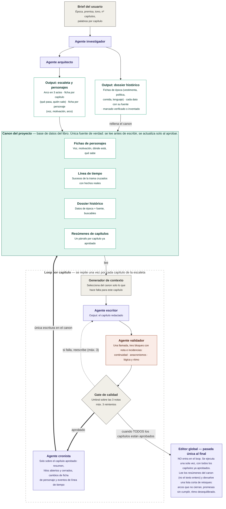

# Spec — Sistema multiagente de novelas históricas

## §1 Visión y alcance

Sistema que escribe una novela histórica capítulo a capítulo a partir de un brief corto. Un agente investiga la época, otro diseña la estructura, un escritor redacta cada capítulo, un validador lo puntúa en tres dimensiones y un cronista lo vuelca en el canon. Al terminar, un editor global propone retoques sobre el conjunto.

**Principio rector.** Lo determinista y lo generativo no se mezclan. Selección de contexto, cálculo del gate, control de reintentos, escritura en el canon y máquina de estados son del orquestador. Investigar, estructurar, redactar, revisar, resumir y editar son de los agentes. Ningún agente escribe en el canon; propone, y el orquestador decide con la propuesta ya comprobada delante.

**Quién orquesta.** Una sesión de Claude Code que lee la skill
`orquestar-novela` y lanza los seis roles como subagentes (§21). Lo determinista
no es código: son instrucciones que esa sesión obedece, con la fórmula del gate
escrita delante y la obligación de imprimir la operación entera.

**Qué sigue siendo Python.** Lo que rodea a esa conversación y no cabe dentro de
ella: el lector del canon en ficheros, la interfaz de §19, las trazas de §20 y el
informe de §22. Nada de eso escribe novelas.

**Qué sección habla de qué.**

| Secciones | Qué describen |
|---|---|
| §2–§13, §15 | **El diseño.** Glosario, canon, máquina de estados, agentes, paquete de contexto, gate, validadores, skills, editor global, configuración, operación y decisiones abiertas |
| §18, §21 | Cómo está montado: el repositorio y sus comandos, y la orquestación en sí |
| §19, §20, §22 | Lo que mira el sistema desde fuera: la interfaz, las trazas y su análisis |
| §23 | **Los objetivos medibles.** Qué número tiene que subir o bajar, desde dónde y hasta dónde |
| §16, §17 | Historial y log de commits del documento |

Hay otros dos documentos con su propia versión: [`TRAZAS.md`](TRAZAS.md), que anota lo que se aprende mirando cómo se escribió una novela, y [`AFINADO.md`](AFINADO.md), que describe cómo mejora solo el prompt de un agente. **Los dos observan este documento y ninguno lo contradice**: cuando un hallazgo suyo se convierte en un cambio de diseño, se muda aquí.

Los §14 y §24 están muertos. Los números de sección no se reutilizan.

**Qué produce.** Un canon consultable, un fichero por capítulo aprobado y una lista final de retoques. No maqueta el libro ni aplica esos retoques por sí mismo.

**Fuera de alcance en el alcance inicial.** Exportación a EPUB, ilustraciones, varios proyectos a la vez, traducción y reescritura automática a partir del editor global. La interfaz gráfica estaba también en esta lista y ha salido en parte: hay una página local (§19) desde la que se ve el canon, se sigue el proceso y se leen los capítulos. No lanza nada, porque en ese canon escribe el orquestador y nadie más.

**Criterio de éxito.** Una novela completa sin contradicciones de canon detectables ni anacronismos groseros, con intervención humana solo en los dos puntos fijos que marca §4. Eso dice qué se persigue y no se puede medir: **los objetivos que sí se cuentan, con su línea base y su meta, están en §23**.

## §2 Glosario

| Término | Significado en este sistema |
|---|---|
| Brief | Entrada del usuario: época, premisa, tono, nº de capítulos y palabras por capítulo. Lo único que se escribe a mano al arrancar. |
| Canon | Base de datos del libro. Única fuente de verdad. Se lee antes de escribir y se actualiza solo al aprobar. |
| Dossier | Conjunto de datos históricos del canon, cada uno con su fuente y su estado de verificación. |
| Dato histórico | Unidad mínima del dossier: una afirmación sobre la época, con categoría, fuente y estado. |
| Escaleta | Plan de la novela: arco en tres actos y una ficha por capítulo. |
| Ficha de capítulo | Qué pasa en un capítulo y quién sale. Es el encargo que recibe el escritor. |
| Capítulo redactado | Texto que produce el escritor en un intento concreto. Puede no llegar a aprobarse. |
| Resumen | Un párrafo por capítulo aprobado, con hilos abiertos y cerrados. Es lo que lee el editor global. |
| Generador de contexto | Código que selecciona del canon lo que hace falta para un capítulo y arma el paquete de contexto. |
| Paquete de contexto | Salida del generador: el subconjunto del canon que ve el escritor. |
| Validador | Agente que puntúa el capítulo. Son **tres**, uno por dimensión, lanzados a la vez y sin verse entre sí (§21). No confundir con `VD-xx`. |
| Dimensión | Cada uno de los tres ejes que se juzgan por separado: continuidad, anacronismos, y lógica y ritmo. |
| Nota | Puntuación de 1 a 5 de una dimensión. Siempre hay tres notas; nota global no existe. |
| Gate | Código que decide, con las tres notas y sus incidencias, si el capítulo se aprueba o se reescribe. |
| Cronista | Agente que convierte el capítulo aprobado en resumen y en cambios de ficha. Única vía de escritura en el canon. |
| Intento | Cada pasada del escritor sobre el mismo capítulo. El tope lo fija `gate.max_intentos`, tres por defecto (§12). |
| Editor global | Agente de pasada única al final, fuera del loop. Lee resúmenes, no texto. |
| Orquestador | Quien lleva el proceso y escribe el canon: una sesión de Claude Code con la skill de §21. No genera prosa. |
| `VD-xx` | **Validador determinista**: cada una de las once comprobaciones mecánicas de §9. Se cumplen o no, sin criterio literario ni llamada a ningún modelo. Las dos primeras letras vienen de «validador», pero **no son el agente validador**: ese juzga y estas cuentan. |
| `DA-xx` | **Decisión abierta**: cada una de las cosas sin decidir de §15. Nada de ahí impide escribir una novela; todo impide darla por buena sin mirarla. Los ids no se reutilizan: DA-01 y DA-11 quedaron muertos al decidirse. |

## §3 Modelo de datos del canon

**Decisión de almacenamiento.** El canon son ficheros JSON bajo `<novela>/canon/` —uno por entidad de la tabla de abajo— y, al lado, un Markdown por intento de capítulo en `<novela>/capitulos/`, donde `<novela>` es la carpeta de esa novela dentro de `biblioteca/` (§21). Ficheros porque quien escribe el canon es una sesión de Claude Code (§21) y lo que sabe hacer es leer y escribir ficheros: una base de datos exigiría un intermediario que volvería a ser código. El texto largo queda fuera del JSON, que es donde tampoco ganaba nada. §21 detalla el árbol.

Las «tablas» de aquí son entidades lógicas, no tablas de ningún motor: cada una es un fichero. Todas llevan `id` de texto salvo donde el número de capítulo ya es clave.

El brief no tiene entidad propia: se guarda en `estado.json` con sus cinco campos (época, premisa, tono, nº de capítulos y palabras por capítulo) más el estado de §4.

**Personaje**

| Campo | Tipo | Obl. | Notas |
|---|---|---|---|
| id | texto | sí | Slug estable, se usa en referencias cruzadas |
| nombre | texto | sí | |
| rol | enum | sí | `protagonista` \| `secundario` \| `figurante` |
| voz | texto | sí | Cómo habla: registro, muletillas, qué nunca diría |
| motivacion | texto | sí | Qué quiere y por qué |
| arco | texto | sí | De dónde parte y adónde llega |
| ubicacion | texto | sí | Dónde está ahora mismo en la trama |
| sabe | lista | no | Qué conoce y qué ignora. Clave para la dimensión de continuidad |
| actualizado_en | entero | sí | Nº del último capítulo aprobado que tocó la ficha |

**Evento de timeline**

| Campo | Tipo | Obl. | Notas |
|---|---|---|---|
| id | texto | sí | |
| tipo | enum | sí | `trama` \| `historico` |
| fecha | texto | sí | ISO parcial: `1587`, `1587-04`, `1587-04-12` |
| descripcion | texto | sí | Una frase |
| capitulo | entero | no | Solo en eventos de trama |
| personajes | lista | no | Ids de personaje implicados |
| dato_id | texto | no | Dato histórico que respalda un evento `historico` |

**Dato histórico**

| Campo | Tipo | Obl. | Notas |
|---|---|---|---|
| id | texto | sí | |
| categoria | enum | sí | `vestimenta` \| `politica` \| `comida` \| `lenguaje` \| `otro` |
| dato | texto | sí | Afirmación concreta y verificable |
| fuente | texto | sí | URL si viene de búsqueda; `modelo` si es conocimiento del agente |
| estado | enum | sí | `verificado` \| `sin_verificar` \| `inventado` |
| etiquetas | lista | sí | Términos de búsqueda para el generador de contexto |

**Ficha de capítulo**

| Campo | Tipo | Obl. | Notas |
|---|---|---|---|
| numero | entero | sí | Clave |
| titulo | texto | sí | |
| acto | entero | sí | 1, 2 o 3 |
| sinopsis | texto | sí | Qué pasa, en tres o cuatro frases |
| fecha | texto | sí | ISO parcial, cuándo transcurre. Con la del capítulo anterior fija la ventana de cronología de §7 |
| personajes | lista | sí | Ids de quien sale |
| etiquetas | lista | sí | Términos de época con los que el generador busca en el dossier (§7) |
| objetivo | texto | sí | Qué tiene que haber cambiado al acabar el capítulo |
| palabras_objetivo | entero | sí | Heredado del brief salvo que la escaleta lo ajuste |
| estado | enum | sí | `pendiente` \| `en_curso` \| `aprobado` \| `bloqueado` |

**Capítulo redactado**

| Campo | Tipo | Obl. | Notas |
|---|---|---|---|
| capitulo | entero | sí | Referencia a la ficha |
| intento | entero | sí | 1, 2 o 3 |
| ruta | texto | sí | Ruta al `.md`, p. ej. `capitulos/012-i2.md` |
| palabras | entero | sí | |
| revisiones | lista | no | Tres bloques, uno por dimensión, con su nota y sus incidencias. Mismo formato venga de una llamada o de tres |
| faltantes | lista | no | Datos de época que el escritor echó en falta al redactar (§5) |
| estado | enum | sí | `propuesto` \| `aprobado` \| `descartado` |
| creado | texto | sí | Marca de tiempo ISO 8601 |

**Resumen de capítulo**

| Campo | Tipo | Obl. | Notas |
|---|---|---|---|
| capitulo | entero | sí | Clave. Solo existe si el capítulo está aprobado |
| resumen | texto | sí | Un párrafo |
| hilos_abiertos | lista | sí | Promesas que el capítulo deja pendientes |
| hilos_cerrados | lista | sí | Promesas que salda |
| personajes_presentes | lista | sí | Ids |

**Ejemplo (personaje).** Único ejemplo del documento; fija el estilo para el resto.

```json
{
  "id": "ines-de-arteaga",
  "nombre": "Inés de Arteaga",
  "rol": "protagonista",
  "voz": "Frases cortas y secas. Usa términos de navegación con naturalidad. Nunca jura en voz alta.",
  "motivacion": "Recuperar el nombre de su padre, condenado por contrabando.",
  "arco": "De obedecer las reglas del gremio a romperlas a sabiendas.",
  "ubicacion": "Sevilla, barrio de Triana",
  "sabe": ["Que el contador falsificó el registro", "Ignora que su hermano lo sabía"],
  "actualizado_en": 7
}
```

## §4 Arquitectura y flujo

El sistema tiene tres tramos: preparación (una vez), loop de capítulo (una vez por capítulo) y cierre (una vez). El canon está en medio de todos y es el único punto de contacto entre ellos: los agentes nunca se pasan datos entre sí por fuera del canon o del paquete de contexto. Dentro del loop, la única escritura en el canon ocurre después del gate, cuando el cronista convierte el capítulo aprobado en resumen y en cambios de ficha.

El diagrama nació en [`sistema-novelas-historicas-v2.drawio`](../diagrama/sistema-novelas-historicas-v2.drawio) y su versión Mermaid vive en [`sistema-novelas-historicas-v2.mermaid`](../diagrama/sistema-novelas-historicas-v2.mermaid), idéntica al bloque de abajo. El `.drawio` es ahora el que va por detrás: le falta el cronista y hay que regenerarlo a mano. Los colores separan agentes, revisores, datos y las piezas deterministas que lleva el orquestador.



**Máquina de estados del proyecto.** Un solo campo en `proyecto`, avanza en un sentido salvo `bloqueado`.

- `borrador` — existe el brief, no hay nada más. Transición al arrancar el investigador.
- `investigado` — el dossier está en el canon. Habilita al arquitecto.
- `estructurado` — escaleta y fichas de personaje en el canon. Habilita el loop.
- `escribiendo` — el loop está en marcha: hay capítulos en curso o ya aprobados y quedan pendientes. Se entra al arrancar el primero, no al aprobarlo.
- `bloqueado` — un capítulo agotó sus intentos (`gate.max_intentos`). Requiere mano humana (§8).
- `escrito` — todas las fichas de capítulo en `aprobado`. Habilita el editor global.
- `editado` — existe la lista de retoques. Estado final del sistema.

**Qué corre en paralelo.** Nada, con la configuración por defecto: el validador único dejó el flujo entero en serie. Solo vuelve a haber paralelismo si se pone `validador.modo` en `separado` (§12), y entonces son tres llamadas simultáneas sobre el mismo capítulo. Lo demás es secuencial por dependencia real: el arquitecto necesita el dossier cerrado, y cada capítulo necesita el canon que dejó el anterior. No se escriben dos capítulos a la vez, aunque parezca tentador: el capítulo N+1 depende de lo que el N haya dejado en las fichas de personaje.

**Dónde entra el humano.** Dos puntos fijos:

1. **Capítulo bloqueado.** Al fallar el tercer intento el sistema para y espera. Tú editas el texto a mano, relajas el umbral o retocas la ficha de capítulo, y lo desbloqueas (§8).
2. **Retoques finales.** El editor global entrega una lista y tú decides qué aplicar. Aplicarlos es manual y queda fuera del sistema en el alcance inicial.

Queda por decidir un tercer punto: parar al acabar la preparación para que revises dossier y escaleta antes de arrancar el loop. Es la parada más barata del sistema y un fallo ahí contamina el libro entero, pero obliga a partir la ejecución en dos arranques. Sin cerrar, en §15 (DA-03). Mientras no se decida, la preparación no para y la escaleta se corrige editando el canon a mano.

## §5 Agentes

Seis agentes. Ninguno escribe en el canon: todos devuelven una propuesta estructurada que valida y persiste el orquestador. Actualizar el canon tras aprobar es trabajo de un agente propio, el cronista, y no del escritor, porque así corre una sola vez sobre el texto que se queda en lugar de tres veces sobre borradores que se descartan. El modelo sugerido es una primera apuesta de la familia Claude, revisable sin tocar el diseño (§15, DA-02).

| Agente | Entrada | Salida | Modelo sugerido |
|---|---|---|---|
| Investigador | Brief | Lista de datos históricos | Opus 5 + herramienta de búsqueda |
| Arquitecto | Brief + dossier | Escaleta con las fichas de capítulo de §3, `fecha` y `etiquetas` incluidas, y fichas de personaje | Opus 5 |
| Escritor | Paquete de contexto (§7) | Capítulo en Markdown + lista de faltantes | Opus 5 |
| Validador | Capítulo + canon relevante, dossier y encargo | Tres bloques, cada uno con nota 1-5 e incidencias | Sonnet 5 |
| Cronista | Capítulo aprobado + fichas de quien sale | Resumen, hilos, cambios de personaje y eventos | Sonnet 5 |
| Editor global | Resúmenes + escaleta + personajes | Lista de retoques | Opus 5 |

**Investigador.** Le pido fichas de época sobre vestimenta, política, comida y lenguaje para el lugar y las fechas del brief. Trabaja de memoria: su subagente tiene `tools: Read` y no busca nada. La búsqueda web sigue sin existir y §12 dice qué haría falta para que entre. Cada dato sale con su categoría y su estado: `verificado` si hay fuente que lo respalde, `sin_verificar` si solo lo recuerda, `inventado` si lo rellena él para tapar un hueco. Modos de fallo: inventar fuentes con aspecto creíble, marcar `verificado` lo que solo recuerda, y desbordarse en cantidad de datos genéricos que luego nadie usa.

**Arquitecto.** Le pido el arco en tres actos, una ficha por capítulo y una ficha por personaje, coherentes con el dossier ya cerrado. Reparte los hilos para que cada capítulo cierre algo y abra algo. Cada ficha de capítulo sale con su `fecha` y sus `etiquetas` (§3): son lo único contra lo que el generador de contexto puede cruzar cronología y dossier (§7), y como el generador es código y no interpreta prosa, si el arquitecto no las emite esos dos bloques del paquete se quedan vacíos. Modos de fallo: escaletas planas donde el acto central no tiene giro, personajes con motivación decorativa que no mueve la trama, capítulos que prometen más de lo que caben en las palabras objetivo, y etiquetas tan genéricas que el bloque de época se llena de datos que no vienen a cuento.

**Escritor.** Le paso el paquete de contexto y le pido el capítulo entero, en prosa, respetando la voz de cada personaje y sin introducir hechos que no estén en el canon. Si necesita un detalle de época que no le he dado, resuelve la escena sin él y lo anota en `faltantes`, lista que viaja con el capítulo y que el orquestador guarda: no hay canal de vuelta síncrono ni el escritor espera respuesta de nadie. Modos de fallo: resumir en lugar de dramatizar cuando se acerca al límite de palabras, homogeneizar las voces hacia un registro neutro, y colar objetos o ideas fuera de época por inercia narrativa.

**Validador.** Una sola llamada que juzga tres dimensiones: continuidad contra el canon, anacronismos contra el dossier, y lógica y ritmo contra el encargo del capítulo. Su salida son tres bloques independientes, cada uno con su nota de 1 a 5 y sus incidencias, cada uno evaluado con su propia rúbrica (§8). No devuelve nota global y el gate sigue recibiendo tres números. El prompt le obliga a resolver las dimensiones en orden y a no releer lo ya juzgado, para que no arrastre una impresión general.

*Riesgo conocido de fundirlas.* Al juzgar en una sola pasada, las notas tienden a correlacionarse: el capítulo que gusta se lleva tres cincos y el que chirría tres doses, cuando la gracia del diseño es que un texto brillante pueda caer por continuidad. El segundo efecto es que el anacronismo conceptual, el caro, se diluye cuando la misma pasada ya va buscando contradicciones de canon: el léxico raro salta, la idea fuera de época no. Ambos se vigilan comparando la dispersión de las tres notas a lo largo del libro; si se confirman, `validador.modo: "separado"` (§12) devuelve las tres llamadas sin tocar el modelo de datos ni el gate. Otros modos de fallo: falsos positivos de léxico moderno pero válido, y confundir una elipsis con un hueco de continuidad.

**Cronista.** Corre una sola vez por capítulo, después del gate y solo sobre el intento aprobado. Le paso el texto, la ficha de capítulo y las fichas de quien sale, y le pido cuatro cosas: el resumen de un párrafo, los hilos que abre y los que cierra, los cambios de `ubicacion` y `sabe` de cada personaje presente, y los eventos de trama nuevos para la línea de tiempo. Devuelve una propuesta que el orquestador valida antes de escribirla en el canon. Modos de fallo: resúmenes que cuentan lo que pasa pero no lo que cambia, dar por sabido a un personaje algo que ocurrió sin él delante, y callarse hilos abiertos, que es el fallo caro porque el editor global solo ve lo que el cronista escribió.

**Editor global.** Le paso los resúmenes de todos los capítulos, la escaleta y las fichas de personaje, nunca el texto completo. Le pido una lista corta y accionable: arcos que no cierran, promesas abiertas sin saldar, actos desequilibrados. Modos de fallo: generalidades no accionables del tipo «reforzar el tema», y proponer reescrituras masivas cuando el encargo es una lista de retoques.

## §6 Memoria: largo y corto plazo

El sistema tiene dos memorias y un estado de run. Los nombres de esta sección se usan igual en todo el documento.

**Memoria a largo plazo: el canon.** Sobrevive al proceso, persiste entre ejecuciones y solo se escribe al aprobar un capítulo, siempre por el cronista (§5). Dentro hay dos regímenes distintos y conviene no confundirlos:

- *Parte inmutable.* Dossier histórico, escaleta y brief. Se escriben una vez en la preparación y nadie los toca después; el loop solo los lee. Cambiarlos a mitad de libro invalida lo escrito, porque los capítulos anteriores se redactaron contra otra verdad. Si hay que tocarlos, es mano humana (DA-10 en §15).
- *Parte que evoluciona.* Fichas de personaje en sus campos `ubicacion`, `sabe` y `actualizado_en`, resúmenes de capítulo y eventos de trama de la línea de tiempo. Crece un escalón por capítulo aprobado, nunca a mitad. Los campos de identidad del personaje, voz, motivación y arco, pertenecen de hecho a la parte inmutable: si el arco cambia, es que la escaleta cambió.

**Memoria a corto plazo: el loop de un capítulo.** Vive en el proceso mientras se escribe un capítulo y no se persiste como verdad de nada: paquete de contexto (§7), texto del intento anterior, incidencias del validador, contador de intentos y avisos de las comprobaciones deterministas (§9). Al aprobar, casi todo se tira. Asciende a largo plazo solo lo que propone el cronista y sobrevive a la validación: el resumen con sus hilos, los cambios de ficha de personaje y los eventos de trama nuevos. El texto del capítulo aprobado no es memoria: es el producto, y vive en `capitulos/` con su fila en el canon apuntándolo.

Los intentos fallidos no se borran, pero tampoco son memoria. Quedan en disco como rastro para mirar cuando algo va mal, y el generador de contexto no los lee jamás. Un capítulo desaprobado no deja huella en lo que el escritor ve del siguiente.

**Estado del run.** Lo mínimo para poder reanudar (§13): el estado del proyecto, el estado de cada ficha de capítulo, las filas de capítulo redactado con sus revisiones y el número de intento en curso. Todo eso vive en el canon, no en variables. El paquete de contexto no se guarda: se reconstruye entero desde el canon, y por eso el generador tiene que ser determinista.

| Qué | Dónde vive | Cuándo se borra |
|---|---|---|
| Dossier, escaleta, brief | Canon, parte inmutable | Nunca dentro de un run |
| Fichas de personaje, resúmenes, timeline | Canon, parte que evoluciona | Nunca; se actualizan al aprobar |
| Texto del capítulo aprobado | `capitulos/`, referenciado desde el canon | Nunca |
| Paquete de contexto | Memoria del proceso | Al terminar el capítulo; se reconstruye |
| Texto e incidencias del intento anterior | Memoria del proceso | Al aprobar el capítulo o al agotar intentos |
| Contador de intentos | Canon, fila de capítulo redactado | Al aprobar, o al relanzar un capítulo bloqueado |
| Intentos descartados | `capitulos/` como rastro | A mano, cuando estorben |

## §7 Generador de contexto

Código, no agente: mismo capítulo y mismo canon dan siempre el mismo paquete. Recibe un número de capítulo y devuelve el paquete de contexto que verá el escritor, que nunca consulta el canon por su cuenta.

| Bloque | Qué entra | Criterio de selección |
|---|---|---|
| Encargo | Ficha del capítulo entera | Siempre |
| Personajes | Fichas completas de quien sale | `personajes` de la ficha |
| Reparto de fondo | Nombre y una línea de quien no sale pero se menciona | Aparece en la sinopsis |
| Memoria reciente | Resúmenes completos de los `contexto.ventana_resumenes` capítulos anteriores | Ventana fija, configurable (§12) |
| Memoria larga | Resúmenes del resto, recortados a una frase | Solo capítulos aprobados |
| Hilos vivos | Hilos abiertos y aún no cerrados | Diferencia entre abiertos y cerrados |
| Época | Datos históricos que casan con las `etiquetas` de la ficha de capítulo (§3) | Coincidencia de etiquetas, `verificado` primero |
| Cronología | Eventos de línea de tiempo en la ventana del capítulo | Entre la `fecha` de la ficha anterior y la de esta (§3) |
| Enganche | Últimas `contexto.palabras_enganche` palabras del capítulo anterior aprobado | Literal, para continuidad de tono |

Dos reglas que no se negocian. El texto completo de capítulos anteriores no entra nunca, salvo el enganche: para eso están los resúmenes. Y en el paquete viaja el estado de cada dato histórico, porque el escritor necesita saber qué es firme y qué es relleno.

El paquete tiene un tope de tokens configurable (§12). Si se pasa, se recorta en este orden: memoria larga, cronología, reparto de fondo, época. El encargo, los personajes y los hilos vivos no se recortan; si aun así no cabe, el capítulo se marca `bloqueado` en lugar de escribirse con el contexto mutilado.

## §8 Loop de capítulo y gate

Un capítulo se da por bueno cuando pasa el gate, no cuando el escritor termina. Todo lo de esta sección es código salvo las cuatro llamadas a agentes.

```
para cada capitulo de la escaleta con estado != aprobado:
    marcar capitulo en_curso
    paquete = generar_contexto(capitulo)                      # §7
    incidencias = []
    texto_previo = null

    para intento en 1..gate.max_intentos:
        texto = escritor(paquete, texto_previo, incidencias)
        guardar_intento(capitulo, intento, texto)             # estado propuesto
        det = comprobaciones(texto)                           # §9
        si det.bloqueantes:                                   # VD-08 en su escalon de bloqueo
            incidencias = det.todas
            texto_previo = null                               # el reintento va de cero
            siguiente intento                                 # sin llamar al validador

        rev = validar(texto, paquete)          # 1 llamada; 3 en paralelo si modo separado
        si no comprobaciones_ok(rev): reintentar la llamada     # §9, sin gastar gate
        guardar_revisiones(capitulo, intento, rev)              # siempre 3 bloques

        si gate(rev):
            marcar intento aprobado y descartar los demas
            cambios = cronista(texto, ficha, personajes)       # §5
            validar_y_escribir(cambios)                        # unica escritura en canon
            marcar capitulo aprobado
            salir del bucle de intentos

        incidencias = rev.incidencias + det.avisos            # §9, VD-08 en su escalon de aviso
        texto_previo = texto si intento + 1 < gate.max_intentos sino null   # el ultimo va de cero

    si capitulo != aprobado:
        marcar capitulo bloqueado y proyecto bloqueado
        parar y esperar mano humana                            # §13

si todos los capitulos aprobados:
    marcar proyecto escrito
    retoques = editor_global(resumenes, escaleta, personajes)  # §11
    guardar retoques.md y marcar proyecto editado             # §11
```

**Rúbrica.** Una por dimensión, escala 1 a 5 entera, con anclas para que la nota no derive entre capítulos. El validador aplica las tres por separado (§5) y el gate no sabe si vinieron de una llamada o de tres.

| Dimensión | Qué puntúa | Nota 1 | Nota 3 | Nota 5 |
|---|---|---|---|---|
| Continuidad | Coherencia con el canon: dónde está cada uno, qué sabe, cuándo pasa | Contradice un hecho del canon | Detalle menor sin respaldo | Todo cuadra y usa el canon con precisión |
| Anacronismos | Objetos, costumbres, instituciones y léxico frente al dossier | Rompe un dato `verificado` | Choca con un `sin_verificar` | Época sostenida sin adorno de folleto |
| Lógica y ritmo | Causa y efecto, cumplimiento del objetivo del capítulo, tensión | La escena no lleva a ninguna parte | Avanza pero se atasca o se salta un paso | Cada escena empuja la siguiente |

Cada incidencia lleva cita textual, severidad (`grave` o `aviso`) y una sugerencia de una línea. Grave es contradecir el canon o un dato `verificado`; el resto es aviso.

**Fórmula del gate.** `aprueba = min(notas) >= 3 y media(notas) >= 3,7 y ninguna incidencia grave`. La incidencia grave veta por sí sola: un capítulo puede sacar tres cuatros y caer por una contradicción de canon, porque eso no se arregla puntuando más alto. Los tres números son configurables (§12) y están sin calibrar hasta que haya capítulos reales (§11, DA-06).

**Qué recibe el escritor al reintentar.** El mismo paquete de contexto, las incidencias del intento anterior ordenadas por severidad y, en todos los intentos menos el último, su propio texto: ahí se le pide arreglo quirúrgico, tocar lo señalado y no reescribir lo que ya funciona. El último —el tercero con los valores por defecto— va desde cero con las incidencias acumuladas, porque si las pasadas quirúrgicas no han bastado el problema no está en las frases sino en el planteamiento de la escena. El intento que ni siquiera llega al validador porque VD-08 lo bloquea va también de cero: no hay arreglo quirúrgico que valga en un texto al que le falta medio capítulo.

**Al agotar los intentos.** El capítulo queda `bloqueado`, el proyecto también, y el sistema para en vez de seguir con el siguiente: escribir sobre un canon con un agujero solo propaga el problema. Se conserva el intento con mejor media, en estado `propuesto`, y sus revisiones. Tienes tres salidas, todas manuales: editar el texto a mano y aprobarlo, retocar la ficha de capítulo y relanzar con el contador a cero, o bajar el umbral solo para ese capítulo dejando constancia.

## §9 Inventario de validadores

Comprobaciones deterministas en código, con id `VD-xx`. No confundir con el agente validador de §5: aquí no hay criterio literario ni llamadas a modelos, solo reglas que se cumplen o no. Bloqueante significa que el artefacto no se usa; aviso significa que se registra y el proceso sigue.

| Id | Qué comprueba | Sobre qué | Cuándo | Sev. | Al fallar |
|---|---|---|---|---|---|
| VD-01 | La salida parsea y cumple el esquema esperado | Salida de cualquier agente | Al recibirla | Bloq. | Reintenta la llamada una vez; si repite, para |
| VD-02 | Campos obligatorios presentes y no vacíos | Salida de cualquier agente | Al recibirla | Bloq. | Rechaza la propuesta y reintenta la llamada |
| VD-03 | Los ids referenciados existen en el canon | Propuestas de arquitecto y cronista | Antes de escribir | Bloq. | Rechaza la propuesta entera, no la parte buena |
| VD-04 | Todo dato histórico lleva fuente y estado válido | Dossier del investigador | Antes de habilitar al arquitecto | Bloq. | Devuelve al investigador solo los datos malos |
| VD-05 | Evento de trama con capítulo; evento histórico sin él | Timeline de arquitecto y cronista | Antes de escribir | Bloq. | Rechaza la propuesta |
| VD-06 | Solo hay resumen si el capítulo está aprobado | Escritura del cronista | Antes de confirmar | Bloq. | Aborta la escritura completa |
| VD-07 | Nº de capítulos dentro de `margenes.capitulos_min` y `capitulos_max` | Escaleta del arquitecto | Fin de preparación | Bloq. | Reintenta al arquitecto con el margen explícito |
| VD-08 | Párrafos y palabras dentro de los márgenes de config (§12) | Capítulo redactado | Antes del validador | Aviso o bloq. | Dentro de `palabras_aviso`, lo adjunta como aviso al reintento; fuera de `palabras_bloqueo` o por debajo de `parrafos_min`, descarta el intento sin llamar al validador |
| VD-09 | Personajes presentes ⊆ personajes de la ficha | Propuesta del cronista | Antes de escribir | Bloq. | Rechaza y reintenta; suele ser personaje colado |
| VD-10 | Tres dimensiones, una vez cada una, nota entera 1-5 | Salida del validador | Antes del gate | Bloq. | Reintenta la llamada al validador, no al escritor |
| VD-11 | Ningún bloqueante pendiente al confirmar | Transacción del canon | En la escritura | Bloq. | Deshace la transacción; el canon no queda a medias |

**Orden.** Cada salida pasa sus comprobaciones antes de usarse, y las comprobaciones van siempre antes que el gate. La regla que ahorra dinero es VD-08 y su familia: si el capítulo redactado no cumple lo básico, se reintenta la generación sin gastar la llamada al agente validador. VD-08 es la única comprobación de dos escalones, y por eso lleva dos márgenes en §12: un texto algo corto se valida igual y arrastra el aviso, y uno que se sale del margen de bloqueo no llega al validador porque ninguna nota va a arreglar que falte medio capítulo. La que salva el canon es VD-11: la escritura del cronista es una transacción única, así que o entran resumen, cambios de ficha y eventos juntos, o no entra nada. El gate (§8) solo se calcula sobre revisiones que ya pasaron VD-10, de modo que nunca opera con notas inventadas o incompletas.

Un bloqueante que falla dos veces seguidas sobre el mismo artefacto para el proceso y deja el estado escrito, igual que un error de proveedor (§13). No hay reintento infinito: si un agente no sabe devolver lo que se le pide, insistir sale caro y no arregla nada.

## §10 Inventario de skills

Skills en el sentido de Claude Code: carpetas con instrucciones reutilizables que cada subagente carga al arrancar. Aquí va lo que es estable y se repite en todas las llamadas de un agente. Lo que cambia en cada capítulo viaja en el paquete de contexto (§7), no en la skill.

| Skill | Para qué sirve | Quién la usa | Entrada que espera | Qué devuelve |
|---|---|---|---|---|
| `formato-dossier` | Qué es un dato de época bien escrito y cómo marcar fuente y estado | Investigador | Época y lugar del brief | Datos con categoría, fuente, estado y etiquetas |
| `formato-fichas` | Estructura de la escaleta, la ficha de capítulo y la ficha de personaje | Arquitecto, y el cronista al proponer cambios | Brief y dossier ya cerrado | Escaleta y fichas conformes a §3 |
| `estilo-prosa` | Reglas de voz narrativa por tono, un fichero por tono del brief | Escritor | Tono y palabras objetivo | Instrucciones de estilo, sin contenido de trama |
| `formato-paquete-contexto` | Cómo se serializa y en qué orden se presenta el contexto | Generador de contexto y escritor | Bloques de §7 | El paquete en el formato que el escritor espera |
| `rubricas-validador` | Las tres rúbricas ancladas y el formato de los tres bloques | Validador | Capítulo, canon relevante y encargo | Tres bloques con nota e incidencias |

Las dos que no pueden faltar son `formato-dossier` y `formato-fichas`, porque son las que fijan la forma de lo que entra en el canon antes de que haya nada escrito. Sin ellas, cada pasada devuelve una estructura distinta y no hay canon que valga.

**Qué no debe ser una skill.** Cuatro cosas, y todas por el mismo motivo: una skill es texto que lee un modelo, no una fuente de verdad para el código.

- *Números y umbrales.* Viven en `config.json` (§12). Si el umbral del gate estuviera en una skill, el código y el prompt podrían discrepar y ganaría el que se editara último.
- *Lógica determinista.* Las comprobaciones de §9 y la selección de contexto de §7 son código. Escribirlas como instrucciones las vuelve opinables, que es justo lo contrario de lo que se busca.
- *Contenido del canon.* El dossier concreto o las fichas reales de esta novela son datos. Copiarlos a una skill crea una segunda verdad que nadie actualiza.
- *El encargo del capítulo.* Cambia en cada llamada, así que va en el paquete de contexto. La skill dice cómo escribir un capítulo; el paquete dice qué capítulo escribir.

## §11 Editor global

Corre una sola vez, cuando el proyecto entra en `escrito`, y fuera del loop. Lee los resúmenes de todos los capítulos, los hilos que siguen abiertos al final, la escaleta y las fichas de personaje. No lee el texto: si algo no se ve en los resúmenes, es que el cronista no lo registró, y ese es un fallo que se arregla en §5, no leyendo 200.000 palabras.

Devuelve una lista corta de retoques. Cada retoque tiene id, tipo (`arco`, `promesa`, `ritmo` o `personaje`), capítulos afectados, una descripción accionable de una o dos frases y una severidad. Se le pide brevedad y concreción: diez retoques que se puedan ejecutar valen más que cuarenta observaciones.

La lista se guarda como `retoques.md` junto al canon, no dentro. El canon es la verdad de la novela escrita y esto es una lista de tareas para mí; mezclarlas haría que el canon dejara de ser lo que dice §2.

El editor no aplica nada ni dispara reescrituras. En el alcance inicial el bucle se cierra a mano: yo decido qué retoques valen y los aplico editando capítulos. Automatizar esa vuelta es lo primero que queda fuera de alcance (§1) y está apuntado en §15 (DA-07).

## §12 Configuración

Un único `config.json` en la raíz del proyecto, junto al canon. Aquí vive todo lo que se toca sin tocar código, y no se duplica en ninguna skill (§10): si un número aparece escrito en el código sin pasar por este fichero, es un bug y no una decisión. Se carga al arrancar, se valida entero y se para si falta una clave o un valor cae fuera de rango, porque una errata en un umbral sale más barata descubierta al arrancar que tres capítulos después. **Lo lee también el orquestador**, que no es código: la skill de §21 imprime estos números y los obedece, así que un umbral escrito a mano en un prompt sigue siendo un bug.

**Dónde vive el modelo de cada rol.** No aquí. Las llamadas las hace Claude Code,
que lee el modelo del `model:` en el frontmatter de cada
`.claude/agents/novela-*.md`. Ponerlo también en este fichero sería tener un
número que no gobierna nada, que es justo el bug que esta sección existe para
evitar. DA-02 se decide en ese frontmatter.

| Clave | Por defecto | Para qué |
|---|---|---|
| `gate.nota_minima` | 3 | Suelo por dimensión en el gate (§8) |
| `gate.media_minima` | 3,7 | Media exigida a las tres notas |
| `gate.max_intentos` | 3 | Reintentos del escritor antes de bloquear |
| `contexto.tope_contexto` | 40000 | Tope de tokens del paquete de contexto (§7) |
| `contexto.ventana_resumenes` | 3 | Capítulos anteriores que van con resumen completo |
| `contexto.palabras_enganche` | 400 | Cola literal del capítulo anterior |
| `interfaz.puerto` | 8787 | Puerto local de la interfaz del brief (§19) |
| `lanzador.comando` | `claude` | El CLI de Claude Code que arranca el botón de §19 |
| `lanzador.permisos` | `acceptEdits` | Modo de permisos con el que arranca esa sesión |
| `trazas.activas` | `true` | Manda las trazas de §20 a Langfuse |
| `trazas.entorno` | `desarrollo` | Separa las pasadas de prueba de las que escriben libros de verdad |
| `trazas.texto` | `true` | Si el capítulo y su paquete de contexto viajan dentro de la traza (§20) |
| `margenes.capitulos_min` y `capitulos_max` | 0,8 y 1,2 | Desvío tolerado sobre el nº de capítulos del brief (VD-07) |
| `margenes.palabras_aviso` | 0,15 | Desvío sobre `palabras_objetivo` que genera aviso (VD-08) |
| `margenes.palabras_bloqueo` | 0,4 | Desvío que descarta el intento sin llamar al validador (VD-08) |
| `margenes.parrafos_min` | 3 | Mínimo de párrafos de un capítulo redactado (VD-08) |
| `afinado.pasadas` | 3 | Veces que se corre cada caso con el mismo prompt ([AFINADO.md](AFINADO.md) §7) |
| `afinado.factor_margen` | 1,0 | Cuánto tiene que superar al ruido una mejora para promover |
| `afinado.max_candidatos` | 3 | Candidatos que se prueban en una vuelta antes de parar |
| `afinado.fallos_seguidos` | 2 | Candidatos seguidos que no baten el ruido antes de parar |
| `afinado.tope_gasto` | 1,0 | Dólares que puede gastar una vuelta |
| `afinado.entorno` | `afinado` | Entorno de Langfuse de las llamadas de medición |

El puerto de la interfaz vive aquí y no en el código por la misma regla que el resto: es un número que se toca sin tocar código, y en una máquina con el 8787 ocupado hay que poder cambiarlo. `python -m novela ui --puerto N` lo pisa para un arranque suelto, igual que `--config`.

La interfaz de §19 llama **perfil** a cada `config*.json` de la raíz. No es
un concepto nuevo: es este mismo fichero, y lo que cambia de uno a otro son los
umbrales. El que no valide no sale en la lista, por la misma razón por la que se
para al arrancar.

**Por qué el modo de permisos es una clave y no una constante.** Una sesión
arrancada desde la página no tiene a nadie delante a quien preguntarle si puede
escribir un fichero, así que sin un modo que lo resuelva la novela se queda
parada en la primera escritura. `acceptEdits` es lo que trae el perfil del
repositorio y es lo mínimo que hace falta. `bypassPermissions` existe y no se
pone por defecto: eso es una decisión de quien opera la máquina, y tiene que
estar escrita en su fichero y no escondida en el código.

**Por qué el texto es una clave y no una constante.** Con `trazas.texto` puesta,
lo que sale de la máquina deja de ser un árbol de números y pasa a ser la novela
entera. Es la única forma de que exista evaluación de calidad —un evaluador de
Langfuse solo lee la entrada, la salida y los metadatos de la observación a la que
apunta, y no abre ficheros—, pero mandar el libro a un servicio de fuera es una
decisión de quien opera la máquina y no un detalle de implementación. Quien la
apaga pierde el juez y conserva las trazas, las notas y el gasto.

Con esto la tabla tiene **veintitrés** claves, y ninguna sobra: cada una la lee alguien.

**Por qué el afinado tiene entorno propio.** Si las llamadas con las que se mide un prompt cayeran en el entorno de las novelas, el gasto de una vuelta se sumaría al de un libro y nadie lo notaría. Por eso `afinado.entorno` se valida distinto de `trazas.entorno` al arrancar, y no como una recomendación.

**Por qué dos márgenes de palabras.** VD-08 tiene que distinguir el capítulo que se queda corto del que no sirve. Dentro de `palabras_aviso` el texto vale y la desviación viaja como aviso al reintento; pasado `palabras_bloqueo` no se gasta la llamada al validador y se reintenta la generación. Con un solo umbral había que elegir entre no filtrar nada o tirar capítulos aprovechables.

**La búsqueda web del investigador no existe.** Su subagente tiene `tools: Read` y trabaja de memoria. Aquí no hay ninguna clave que la encienda, y no la habrá: lo que hay que cambiar el día que entre son las herramientas del subagente. DA-04 sigue abierta.

**Las credenciales, todas fuera de aquí.** Ni la de la API, ni las de Langfuse, ni la del proveedor de los jueces (§20) caben en este fichero, porque se versiona. Van en un `.env` de la raíz, ignorado por git, que se lee al arrancar y vuelca en el entorno **sin pisar lo que ya haya**: quien exporta una variable a mano lo hace para esa ejecución y el fichero no tiene por qué contradecirle. El lector es propio y minúsculo a propósito, para no estrenar dependencia por veinte líneas. `trazas.entorno` sí vive aquí porque no es un secreto sino una etiqueta, y se valida al arrancar con las reglas de Langfuse: un entorno mal escrito no falla, que sería barato, sino que manda las trazas a otro sitio.

## §13 Operación: fallos y reanudación

**Qué pasa cuando algo falla a mitad.** El estado vive en el canon, nunca en memoria del proceso, así que un corte de red, un error del proveedor o un Ctrl+C no pierden más que el intento en curso. Como el canon solo se toca después del gate y en una única escritura validada del cronista, no existe el estado a medias: o el capítulo entró entero o no entró. Lo peor que deja una caída es un Markdown huérfano en `<novela>/capitulos/` sin su intento en `estado.json`, que al relanzar se descarta. Ante un error de un subagente se reintenta la llamada una vez; si vuelve a fallar, el proceso para y deja el estado escrito en lugar de insistir. No hay política de backoff ni de reintentos finos en el alcance inicial, y es deliberado: con un solo usuario, parar y mirar sale más barato que automatizar la recuperación.

**Reanudación.** Una sola instrucción, sin argumentos: lee el estado del proyecto, localiza el primer capítulo no aprobado y sigue desde ahí. Relanzar con el proyecto ya `escrito` no reescribe nada, solo vuelve a ofrecer el editor global. El par capítulo e intento identifica cada fichero, así que repetir un intento sobrescribe en lugar de duplicar. Reanudar no desbloquea: mientras el proyecto siga en `bloqueado`, el comando vuelve a parar en el mismo capítulo hasta que se tome una de las tres salidas manuales de §8.

## §14 *(número muerto)*

Los números de sección no se reutilizan.

## §15 Decisiones abiertas

Lo que no está decidido. Nada de aquí bloquea escribir una novela; todo
bloquea darla por buena sin mirarla. Los ids no se reutilizan: DA-01 salió al
decidirse el stack (§18) y DA-11 al decidirse que la interfaz no lanza nada (§19).
Los dos números quedan muertos.

DA-06 no se cierra con las trazas, pero deja de estar a ciegas: §20 manda las
tres notas y la media de cada intento como puntuaciones, y §22 las cruza con lo
que costó cada capítulo, así que calibrar los umbrales pasa a ser mirar una
distribución en lugar de discutirla.

| Id | Decisión pendiente | Por qué importa | Cuándo decidirla |
|---|---|---|---|
| DA-02 | Modelo definitivo de cada agente | Validador y escritor se llevan casi todas las llamadas; el reparto decide el coste del libro | Con varias novelas trazadas, mirando §22 |
| DA-03 | Parada humana al acabar la preparación | Es la revisión más barata y un fallo de escaleta contamina el libro entero | Antes de la próxima novela larga |
| DA-04 | Proveedor de búsqueda del investigador | Define qué significa exactamente `verificado` en el dossier | Cuando la búsqueda web entre de verdad |
| DA-05 | Qué hacer con los `faltantes` del escritor | Hoy se registran y nadie los mira; podrían disparar una consulta al investigador | Antes de la próxima novela larga |
| DA-06 | Calibración de `nota_minima` y `media_minima` | Puestos a ojo: altos bloquean todo, bajos no filtran nada | Con capítulos reales de varias pasadas |
| DA-07 | Vuelta del editor global | Si los retoques se aplican siempre a mano o disparan reescritura de capítulos | Cuando haya una novela cerrada que releer |
| DA-08 | Quién valida lo que propone el cronista | Los `VD-xx` validan forma, no fondo; un resumen que miente envenena el canon entero | Antes de la próxima novela larga |
| DA-09 | Unidad de escritura: capítulo entero o escena a escena | Si la prosa se degrada en capítulos largos, el loop cambia de grano | Si la prosa se degrada en capítulos largos |
| DA-10 | Qué hacer si la escaleta se queda corta o larga a mitad de libro | Replanificar toca el canon en caliente; forzarla estropea el final | La primera vez que pase |
| DA-12 | Qué hacer con el coste, ahora que se conoce | §22 agrega lo que cuesta cada capítulo y lo cruza con sus notas, pero nadie actúa sobre ello: no hay tope ni cuota en ningún sitio, y es el hueco que §19 pinta como «sin datos todavía» | Con el informe de §22 de varias novelas delante |
| DA-13 | Si un validador debe vigilar que el cronista respete los «Ignora» de una ficha | Ninguno de los once `VD-xx` lo mira, así que un conocimiento que el gate acaba de vetar puede entrar en el canon por la propuesta del cronista. VD-09 solo comprueba que los presentes sean subconjunto de la ficha, no lo que aprenden | Antes de calibrar DA-06 |
| DA-15 | Qué hacer cuando la auditoría del gate no cuadra | Hoy se avisa y nada más: §19 lo pinta y §20 lo manda como puntuación, pero el canon manda aunque la suma esté mal. Convertirlo en un `VD-xx` obligaría al orquestador a rehacer el capítulo, y todavía no hay ni un caso real que diga si pasa lo bastante como para que compense | Cuando haya varias pasadas que mirar |
| DA-14 | Cómo se retracta un «Ignora» de `sabe` | El campo solo acumula, así que cuando un personaje aprende lo que su ficha decía que ignoraba, la ficha acaba afirmando y negando lo mismo, y el paquete de §7 arrastra las dos líneas. Hace falta decidir si `sabe` se parte en dos campos, si los «Ignora» caducan o si el cronista puede retirar líneas | Antes de la próxima novela larga |

## §16 Historial de cambios

Formato Keep a Changelog. Una entrada por versión; cada línea dice la sección
tocada y el motivo del cambio.

**Este historial arranca en 1.0.0**, que es la versión en la que el documento
pasó de borrador a vigente y en la que describe un solo sistema. Las entradas de
las versiones anteriores describían un documento en construcción y ya no ayudan a
leer este; cada una de aquellas versiones tiene su tag `spec-vX.Y.Z` en el
repositorio, que es donde se mira si hace falta.

### [1.21.0] — 2026-09-18

**Añadido**
- §12. Seis claves nuevas, el bloque `afinado`, y la tabla pasa de diecisiete a
  veintitrés. `afinado.entorno` se valida distinto de `trazas.entorno`: si las
  llamadas de medición cayeran en el entorno de las novelas, el gasto de una
  vuelta se sumaría al de un libro sin que nadie lo notase.
- §18. El comando `afinar` y la skill `afinar-validador`. El comando prepara,
  cuenta y decide; las llamadas a los subagentes las hace la sesión, porque una
  mejora medida en otro arnés puede no aparecer donde el prompt corre.
- §1. Referencia al tercer spec, [`AFINADO.md`](AFINADO.md), que describe cómo
  mejora solo el prompt de un agente.

**Cambiado**
- §18. Treinta tests nuevos en un fichero propio, `tests/test_afinado.py`:
  cubren la forma de una respuesta del validador, las cuentas, el ruido y el
  veredicto del loop.
- §22. El hook manda las llamadas de una vuelta de afinado a su propio entorno
  y a su propia sesión, en lugar de colgarlas de la novela en curso.

### [1.20.0] — 2026-09-18

**Añadido**
- §20, §21, §18. **La exportación de trazas la lanza la skill al cerrar**: el
  último paso del Tramo 3, con el estado ya en `editado`, es
  `python -m novela trazar`. Motivo: sin ella Langfuse solo tiene el gasto que
  trae el hook de §22 y ninguna puntuación, y los evaluadores de calidad de §20
  no tienen a qué apuntar porque la observación del escritor —la única con el
  paquete de entrada y el capítulo de salida— nace en esa reconstrucción. OB-01 y
  OB-03 dependían de que alguien se acordase de escribir un comando.
- §20. Por qué va en esa transición y no en otro sitio: es el único momento en
  que la novela está entera y deja de cambiar, y es un paso que ocurre una sola
  vez. Va después de `editado` porque el estado manda y la observación no puede
  deshacer un cierre.

**Cambiado**
- §20. La reconstrucción ya no «se solapa en lugar de duplicarse»: solapan la
  sesión y las trazas, que llevan id sembrado, pero no sus observaciones hijas.
  Motivo: la frase daba por idempotente la exportación entera, y la única
  garantía real es dispararla una sola vez.

### [1.19.0] — 2026-09-18

**Eliminado**
- §24, §12, §18. **Fuera el banco de autoaprendizaje entero**: la sección, sus
  nueve claves de `config.json`, el perfil `config.banco.json`, sus cuatro
  comandos, la carpeta `autoaprendizaje/` y el spec `AUTOAPRENDIZAJE.md` que lo
  describía. Motivo: el enfoque con el que se mejoran los prompts se cambia de
  raíz y se empieza de cero, así que lo anterior no se deja escrito como
  historia. §24 queda como número muerto.

**Cambiado**
- §18. Los tests vuelven a ochenta y nueve: los que se van son los del banco.

### [1.16.0] — 2026-09-18

**Añadido**
- §23, §1. Los objetivos medibles: siete métricas con su línea base sacada de la
  pasada 1 y su meta. Motivo: el criterio de éxito de §1 dice qué se persigue
  pero no se puede medir ni comparar entre pasadas, así que no había forma de
  saber si un cambio mejoraba algo. Un objetivo sin línea base no entra.
- §23. Se declara además lo que **no** es objetivo y por qué, empezando por bajar
  el coste por sí solo: se cumple trivialmente con un modelo peor y arruinaría la
  única métrica que mide calidad de verdad.

### [1.15.0] — 2026-09-18

**Cambiado**
- §21, §3, §18, §19. **Desaparece la carpeta de trabajo.** Cada novela vive en
  `biblioteca/<fecha>-<época>/` desde que nace, y la página la crea y se la
  nombra a la sesión al arrancarla. Motivo: una ruta fija donde se escribe
  siempre obligaba a copiar y borrar a mano antes de cada libro para que el
  nuevo no pisara al anterior, y eso es trabajo manual que existía solo por una
  decisión de almacenamiento. Escribir el brief y olvidarse es el caso normal.
- §21. La novela en curso se deduce de la fecha de su `estado.json` en vez de
  apuntarse en un puntero. Un puntero es un segundo sitio donde vive el estado y
  se queda desfasado; la fecha no miente.

**Añadido**
- §18. `biblioteca` lista las novelas y marca la que está en curso, y `trazar`
  acepta `--novela` para trabajar sobre una que no sea esa.

### [1.13.0] — 2026-09-18

**Añadido**
- §20, §12. Los jueces corren en **otra familia de modelos** que el escritor, con
  la credencial de su proveedor en el `.env` (`OPENROUTER_API_KEY`). Motivo: un
  juez del mismo proveedor y la misma familia comparte los puntos ciegos de quien
  escribió, que es justo lo que esta pieza existe para detectar.

### [1.12.1] — 2026-09-17

**Añadido**
- §20. El rol de cada observación viaja también en sus metadatos. Motivo: la
  regla que dispara un juez no puede filtrar por el nombre de la observación
  —sus columnas son `metadata`, `type`, `environment` y pocas más—, así que sin
  una clave filtrable la regla puntuaría todo lo que entrase. Salió al crear las
  dos primeras reglas contra la API.

### [1.12.0] — 2026-09-17

**Añadido**
- §20. Los jueces externos: evaluadores de Langfuse que puntúan un capítulo sin
  participar en el resultado. Motivo: hasta ahora todas las puntuaciones las
  ponía el propio sistema, así que un sesgo compartido entre escritor y validador
  no dejaba rastro. Los dos primeros son `continuidad-externa`, con las mismas
  anclas de §10 para ser comparable, e `ignora-respetado`.
- §20. Su prompt vive **solo en Langfuse y no en este repositorio**. Motivo: el
  escritor tiene `Read` sobre el proyecto, así que una rúbrica guardada aquí
  quedaría al alcance del examinado. Es la única excepción a que los prompts del
  sistema se versionen, y se acepta porque lo que protege es la validez de la
  medida, no la trazabilidad del prompt.

### [1.11.0] — 2026-09-17

**Añadido**
- §20. La reconstrucción manda el paquete de contexto y el texto de cada intento
  dentro de la observación del escritor, el paquete de entrada y el capítulo de
  salida. Motivo: es el requisito de la evaluación de calidad. Un evaluador de
  Langfuse solo lee la entrada, la salida y los metadatos de la observación a la
  que apunta —no abre ficheros ni mira a sus hermanas—, así que hasta ahora
  habría juzgado la ruta de un fichero en vez de un capítulo.
- §12. `trazas.texto`. Es una clave y no una constante porque con ella puesta lo
  que sale de la máquina es el libro entero, y eso lo decide quien opera la
  máquina. Apagarla cuesta el juez y no cuesta las trazas.
- §19. El panel de trazas cuenta las palabras que saldrían antes de exportar, por
  la misma razón por la que ya enseñaba el recuento del árbol.

### [1.10.0] — 2026-09-17

**Añadido**
- §19. La sala del brief vuelve a tener los cinco campos de §3 y gana un botón
  que arranca. `POST /api/lanzar` levanta una sesión de Claude Code sobre el
  repositorio con el brief delante y se aparta.
- §12. `lanzador.comando` y `lanzador.permisos`. El modo de permisos es una
  clave y no una constante porque una sesión arrancada desde la página no tiene
  a nadie delante a quien preguntarle si puede escribir.

**Cambiado**
- §19. Se deroga el invariante de que ningún método distinto de `GET` hiciera
  nada, en una sola ruta y acotado a arrancar al orquestador. **La primera regla
  de §21 no se toca**: en el canon sigue escribiendo el orquestador y nadie más,
  y lo único que ha cambiado es quién le da al interruptor.

### [1.9.0] — 2026-09-17

**Añadido**
- §22. El informe cae al diario local del hook cuando Langfuse no contesta. Sale
  todo menos el coste, que es lo único que el diario no sabe, y se declara en vez
  de rellenarse con un cero. Motivo: Langfuse Cloud devolvió 504 en todas las
  lecturas y el análisis de una novela ya escrita se quedaba sin informe por un
  servicio de fuera.
- §22. Las líneas repetidas del diario se descartan por su firma. El diario solo
  añade, así que un evento entregado dos veces duplicaba todos los números; en la
  primera pasada eran 83 líneas para 41 llamadas.

### [1.8.0] — 2026-09-17

**Añadido**
- §19. Leyenda de los cinco estados junto a la de los tipos de nodo, con las
  muestras pintadas con el mismo color y el mismo filo que el nodo.
- §19. Foco de teclado visible como anillo por fuera de la silueta, y
  tabulación en orden topológico —que sale del propio orden de declaración de
  los nodos— con Enter para abrir la ficha.

**Cambiado**
- §19. Los mandos del grafo se apilan por debajo de 900px y la leyenda pasa a
  una columna: el desplegable de capítulos en fila era lo único de esa sala que
  podía generar scroll horizontal. Comprobado a 1440, 1280 y 390.

### [1.7.0] — 2026-09-17

**Añadido**
- §19. El grafo expone `setNodeState` y `setEdgeActive` y deja de saber de dónde
  sale el dato. Encima de esas dos funciones van los dos modos, que es lo que
  permite que la misma pantalla sirva para los dos.
- §19. Replay del último capítulo, con play, pausa, 1x/2x/4x y deslizador. Se
  rehace con lo que el canon guardó de ese capítulo, así que funciona sin que
  haya ninguna ejecución corriendo. Ningún paso se inventa: sin detalle de
  intentos no hay replay y se dice.
- §19. Modo en vivo deducido del canon mientras hay capítulo en curso, con el
  hueco declarado: no existe ningún evento que escuchar, y se nombra el que
  haría falta en vez de fingirlo.
- §19. El último resultado de cada nodo en su ficha, fila a fila y sin pintar
  las que no tienen dato.

### [1.6.0] — 2026-09-17

**Añadido**
- §19. La arista activa se anima con los guiones corriendo de origen a destino y
  un punto que los acompaña. Lo que añade el movimiento es la dirección, que es
  lo único que no se puede pintar quieto; el color y el grosor ya dicen cuál es.
- §19. Un solo `requestAnimationFrame` para el grafo, activo solo mientras hay
  algo que mover: sala cerrada, pestaña de fondo o ninguna arista activa y no se
  pide ni un fotograma.

### [1.5.0] — 2026-09-17

**Añadido**
- §19. Los cinco estados de nodo del grafo —`pendiente`, `activo`,
  `completado`, `reintento`, `bloqueado`— con la regla de que el color y el
  borde bastan para distinguirlos y la animación solo dice que algo está
  corriendo ahora. Con `prefers-reduced-motion` se apaga el pulso sin perder
  ningún dato.
- §19. Un ámbar propio para lo que no es texto. El de los avisos está bajado a
  4,5:1 para poder leerse, y a ese valor se ve marrón en un filo.

### [1.4.0] — 2026-09-17

**Cambiado**
- §19. El grafo de la sala de arquitectura pasa a **SVG inline** y a un layout
  por columnas de izquierda a derecha. No hay nada en un DAG de dieciocho nodos
  que justifique WebGL, y en SVG el dibujo hereda los mismos tokens de color que
  el resto de la página en vez de llevar una paleta suya.
- §19. La ficha del nodo entra como cajón por la derecha cuando se pide un nodo,
  en vez de vivir abierta. Diez columnas en fila dan un dibujo cuatro veces más
  ancho que alto, y el panel fijo le costaba al grafo un cuarto del ancho, que
  es tamaño de letra al encuadrar.
- §19. Las siluetas se nombran por lo que son: cápsula el agente LLM, caja el
  dato, hexágono el código del harness.

**Añadido**
- §19. Enlace por sala: `#arquitectura` abre el grafo directamente, igual que
  `#capitulo/3` abre ese capítulo.

### [1.3.0] — 2026-09-17

**Cambiado**
- §19. La página se compromete con un solo mundo visual **claro**: gris roto en
  el chrome y blanco en el papel. El mundo oscuro existía para compartir luz con
  una escena WebGL que ocupaba el fondo de las cuatro salas, y esa escena ha
  dejado de ocuparlo.
- §19. La escena del legajo es el fondo del **brief** y de ninguna otra sala. Lo
  que contesta —qué libro es— es la pregunta de esa sala; en el escritorio y en
  la arquitectura no contestaba nada y le restaba contraste a lo que sí. Se
  monta al entrar y su bucle se para entero al salir.
- §19. Cada color de marca se declara en dos variantes, relleno y tinta: el
  naranja del logotipo da 2,6:1 como texto sobre claro y no pasa AA. Los filos y
  los rellenos no cambian; lo que se lee usa la variante bajada de valor.
- §19. La vitela de lectura destaca ahora por cálida y no por clara, así que
  lleva filo marcado y sombra propia. Sigue siendo un objeto sobre la mesa y no
  un tema aparte.

### [1.2.0] — 2026-09-17

**Añadido**
- §19. Cuarta sala, «arquitectura»: el pipeline de §4, §7, §8 y §9 como DAG por
  capas navegable, con el recorrido de un capítulo concreto encima. El diseño
  solo se podía leer en este documento y en la skill, así que la pregunta «por
  dónde ha pasado esto» no tenía dónde mirarse.
- §19. La dispersión de las tres notas del validador, que §5 manda vigilar para
  saber si juzgarlas a la vez las estaba correlacionando, y que hasta ahora no
  se medía en ningún sitio.
- §19. Una escala de espaciado y otra de tipografía en `:root`, porque las
  medidas sueltas dejaban tarjetas de distinta altura en la misma fila.

**Cambiado**
- §19. Las ocho tarjetas de subagente dejan de repetir «ha dejado su rastro en
  el canon» y cuentan lo que cada uno produce y lo que lleva entregado. La frase
  era cierta y era la misma ocho veces, que es lo mismo que no decir nada.
- §19. Los campos que el canon no guarda se colapsan en una sola línea con su
  recuento. Se siguen declarando —la regla de no rellenar no cambia—, pero
  cuatro «sin datos todavía» seguidos escondían los que sí tenían valor.

### [1.1.1] — 2026-09-17

**Añadido**
- §2. Entradas de glosario para `VD-xx` y `DA-xx`. El documento las usaba en
  todas sus secciones sin definirlas en ninguna, y la primera lleva además a
  confusión con el agente validador de §5: comparten las letras y no son lo
  mismo, porque uno juzga y las otras cuentan.

**Corregido**
- §2. La entrada «Validador» decía que hay uno solo y que juzga las tres
  dimensiones en la misma llamada. Eso dejó de ser cierto cuando el validador se
  partió en tres subagentes lanzados a la vez (§21), y el glosario se quedó
  contradiciendo al resto del documento.

### [1.1.0] — 2026-09-17

Limpieza de lo que sobraba en `novela/`, y una corrección: la reconstrucción
desde el canon no era prescindible, era la mitad que falta.

**Eliminado**
- §18, §22. El comando `trazar --transcript` y su módulo. Sacaban de la
  transcripción de una sesión lo que el hook habría visto de estar puesto: un
  andamio para las novelas escritas antes del hook, que con el hook en su sitio
  no vuelve a hacer falta.
- `novela/util.py`. `numero_corto` no lo llamaba nadie desde 1.0.0 y `redondear`
  lo usaba un solo módulo, que ahora lo lleva dentro.

**Cambiado**
- §20. La reconstrucción desde el canon se presentaba como un apaño para lo ya
  escrito. Es al contrario: **el hook trae el gasto y ninguna puntuación, y la
  reconstrucción trae todas las puntuaciones y ningún gasto**. Las notas, la
  media, el veredicto del gate, el escalón de VD-08 y `gate-cuadra` salen solo de
  ahí, porque lo que el orquestador decide por su cuenta no es una llamada a
  nadie y el hook no lo ve. Sin esa pieza, DA-06 se queda sin datos.

### [1.0.0] — 2026-09-17

Primera versión que no es borrador. El documento describe **un solo sistema**: la
novela la escribe una sesión de Claude Code que lee la skill de §21, y el Python
de `novela/` solo mira lo que esa sesión deja escrito.

**Eliminado**
- §12. Cinco claves de las diecinueve que había. Las que quedan, catorce, las lee
  alguien; las que se fueron **no gobernaban nada**, que es exactamente el bug
  que esa sección existe para evitar. El modelo de cada rol se lee del frontmatter
  de su subagente y la búsqueda web del investigador no existe.
- §14. El roadmap por fases. El número queda muerto, como DA-01 y DA-11.
- §18. Once comandos. No queda ninguno que escriba en el canon ni que lo consulte:
  el canon son ficheros JSON que se leen a ojo, y para verlos con forma está §19.
- §19. El motor de flujo, el diario de eventos y las tres rutas que escribían. La
  interfaz pasa a **mirar y no tocar**, que es lo que la primera regla de §21
  pedía desde el principio: en ese canon escribe el orquestador y nadie más.

**Cambiado**
- §3. La decisión de almacenamiento decía que el canon era una base de datos y son
  ficheros JSON. Las «tablas» pasan a ser entidades lógicas, una por fichero, y el
  brief vive en `estado.json` en vez de en una fila.
- §2, §5. El glosario y los contratos de los seis roles decían quién valida y
  persiste con un nombre que ya no describe a nadie: ahora dicen **el
  orquestador**, que es quien lo hace.
- §10. La columna «¿F1?» de la tabla de skills, que apuntaba al roadmap muerto.
- §15. La columna de plazos hablaba de fases. Ahora dice qué hace falta tener
  delante para poder decidir, que es lo que quería decir. DA-02 se decide en el
  frontmatter de los subagentes y DA-12 con el informe de §22.
- §18. Reescrita entera. El stack queda en biblioteca estándar con `langfuse`
  opcional, las carpetas ponen `.claude/` delante —que es donde vive el sistema— y
  se dice por qué la orquestación no tiene tests: lo que hace es una conversación.
- §20. La instrumentación pasa a tener dos vías, el hook de §22 en vivo y la
  reconstrucción desde el canon después, y se explica por qué la segunda sigue
  haciendo falta con la primera puesta: el gate y VD-08 no son llamadas a nadie.
- §21. Deja de presentarse como una alternativa y pasa a ser el sistema. «El
  precio» se mantiene entero, porque sigue siendo el precio.

**Añadido**
- §22. El hook `PostToolUse` sobre el tool `Agent`, que es el punto único de
  instrumentación que §21 daba por perdido, y el comando `informe-trazas`, que lee
  las trazas de vuelta y agrega el gasto. Con ellos, un segundo documento,
  `TRAZAS.md`, donde se acumula lo que se aprende mirando una novela ya escrita.
  El código de las dos piezas estaba escrito y sin especificar, y ya las citaba
  como §22.

## §17 Log de commits del spec

Registro literal de los commits que han tocado `docs/spec/` desde 1.0.0. §16 dice
por qué cambió algo; esta tabla dice cuándo y en qué commit. Cada versión cerrada
lleva su tag `spec-vX.Y.Z` sobre el último commit de su ciclo, y los de antes de
1.0.0 se miran ahí.

| Commit | Fecha | Mensaje |
|---|---|---|
| `55b7b45` | 2026-09-17 | docs(spec): §17 tabla de commits regenerada para 1.0.0 |
| `4653d33` | 2026-09-17 | docs: la documentacion describe el sistema que hay, y nada mas |
| `41aeb91` | 2026-09-17 | refactor(novela): fuera el transcript y util.py |
| `6fae2ef` | 2026-09-17 | docs(spec): 1.1.0 y §17 regenerada |
| `2d2b59f` | 2026-09-17 | docs(trazas): §6 primera pasada de analisis, sesion novela-1abde479ff05 |
| `2515589` | 2026-09-17 | docs(spec): §2 glosario define VD-xx y DA-xx, y corrige la entrada del validador |
| `334a33c` | 2026-09-17 | docs(spec): §17 regenerada para 1.1.1 |
| `10752ca` | 2026-09-17 | docs(spec): 1.2.0, §19 la sala de arquitectura y la escala de diseno |
| `5654cfc` | 2026-09-17 | docs(spec): §17 regenerada para 1.2.0 |
| `66839c5` | 2026-09-17 | feat(web): §19 el cuarto tiene luz de dia y el legajo vive en el brief |
| `aa606ed` | 2026-09-17 | feat(web): §19 el grafo de arquitectura pasa a SVG por columnas |
| `8a97a27` | 2026-09-17 | feat(web): §19 los cinco estados de nodo del grafo |
| `f14457a` | 2026-09-17 | feat(web): §19 la arista activa corre y dice por donde va el flujo |
| `f2a4294` | 2026-09-17 | feat(web): §19 replay del ultimo capitulo y modo en vivo sobre el grafo |
| `8c2d8ce` | 2026-09-17 | feat(web): §19 leyenda de estados, foco de teclado y repaso a tres anchos |
| `c6df332` | 2026-09-17 | docs(spec): 1.9.0, §22 el diario local como origen del informe |
| `cc00489` | 2026-09-17 | docs(spec): §17 regenerada para 1.9.0 |
| `c758826` | 2026-09-17 | feat(web): §19 el brief vuelve a ser formulario y arranca al orquestador |
| `094fa22` | 2026-09-17 | docs(spec): 1.10.0 y §17 regenerada |
| `41fc644` | 2026-09-17 | docs(spec): 1.11.0, §20 lo que viaja y §12 trazas.texto |
| `686c31b` | 2026-09-17 | docs(spec): §17 regenerada para 1.11.0 |
| `78c55b5` | 2026-09-17 | docs(spec): 1.12.0, §20 los jueces externos viven fuera del repositorio |
| `bb4238e` | 2026-09-17 | docs(spec): §17 regenerada para 1.12.0 |
| `8510030` | 2026-09-17 | feat(trazas): §20 el rol de cada observacion viaja en sus metadatos |
| `009aeed` | 2026-09-17 | docs(spec): §17 regenerada para 1.12.1 |
| `067f7ad` | 2026-09-18 | docs(spec): 1.13.0, §20 el juez corre en otra familia de modelos |
| `b158aa0` | 2026-09-18 | docs(spec): §17 regenerada para 1.13.0 |
| `3a4aa53` | 2026-09-18 | docs(spec): 1.14.0, §21 el archivo de novelas y §18 sus dos comandos |
| `7b293e0` | 2026-09-18 | docs(spec): §17 regenerada para 1.14.0 |
| `d2be23b` | 2026-09-18 | feat(biblioteca): §21 cada novela nace en su carpeta y desaparece novela-cc |
| `278c121` | 2026-09-18 | docs(spec): §17 regenerada para 1.15.0 |
| `8f172fc` | 2026-09-18 | docs(autoaprendizaje): §1-§13 el banco monotraza que mejora prompts con metricas |
| `cb61e88` | 2026-09-18 | docs(spec): 1.16.0, §23 los objetivos medibles |
| `9888378` | 2026-09-18 | docs(spec): §17 regenerada para 1.16.0 |
| `e0e7ec2` | 2026-09-18 | docs(autoaprendizaje): 0.2.0, el documento describe el banco que hay |
| `8149cfe` | 2026-09-18 | docs(spec): 1.17.0, §24 el banco y §12 sus nueve claves |
| `dbc98c6` | 2026-09-18 | docs(spec): §17 regenerada para 1.17.0 |
| `8a56e6c` | 2026-09-18 | docs(autoaprendizaje): 0.3.0, §14 lo que han ensenado las primeras rondas |
| `7a07df7` | 2026-09-18 | docs(spec): 1.17.1, §18 los tests que cubren la promocion |
| `4070a63` | 2026-09-18 | docs(spec): §17 regenerada para 1.17.1 |
| `d0948fc` | 2026-09-18 | docs(autoaprendizaje): 0.4.0, §3 primero se mide y despues se escribe el objetivo |
| `c5106f2` | 2026-09-18 | docs(spec): 1.18.0, §24 el comando medir y la linea base obligatoria |
| `db7b10f` | 2026-09-18 | docs(spec): §17 regenerada para 1.18.0 |
| `2c148ad` | 2026-09-18 | docs(autoaprendizaje): 0.5.0, §3 antes de elegir la metrica, mirar donde esta el dinero |
| `ac013a5` | 2026-09-18 | docs(spec): 1.18.1, §24 elegir el objetivo es antes que medirlo |
| `fdf04e4` | 2026-09-18 | docs(spec): §17 regenerada para 1.18.1 |
| `9f6b7b4` | 2026-09-18 | feat(novela): §24 fuera el banco de autoaprendizaje entero |
| `894757f` | 2026-09-18 | docs(spec): §17 regenerada para 1.19.0 |
| `106d27b` | 2026-09-18 | docs(afinado): 0.1.0, el loop del validador de anacronismos y sus cinco campos |
| `a93d197` | 2026-09-18 | docs(spec): 1.20.0, §20 la skill exporta las trazas al cerrar |

```
git log --reverse --pretty='| `%h` | %ad | %s |' --date=short spec-v1.0.0~1..HEAD -- docs/spec/
```

## §18 Estructura del repo y comandos

**Qué es código y qué es texto.** El reparto de §1 se ve en las carpetas.
`.claude/` es el sistema: la skill que orquesta y los ocho subagentes, todo
Markdown y sin una línea de código. `agentes/` y `skills/` son los prompts que
esos subagentes cargan. `novela/` no escribe novelas: es lo que mira el canon
desde fuera.

| Carpeta | Qué hay |
|---|---|
| `.claude/skills/orquestar-novela/` | La máquina de estados de §4 escrita como instrucciones, con tres referencias: el canon en ficheros, el paquete de contexto y las comprobaciones con el gate |
| `.claude/agents/novela-*.md` | Los ocho subagentes de §21, con su rol, sus herramientas y su modelo |
| `.claude/skills/afinar-validador/` | El loop de [AFINADO.md](AFINADO.md) escrito como instrucciones: medir, proponer, decidir y cerrar |
| `agentes/` | Un fichero por rol de §5, con su encargo y sus modos de fallo. Cada subagente lo lee al arrancar |
| `skills/` | Las skills de §10, una carpeta por skill |
| `novela/` | Python: el lector del canon, la interfaz de §19, las trazas de §20 y el informe de §22 |
| `web/` | La página de §19: las tres salas, la escena three.js, la ambientación y el logotipo |
| `biblioteca/` | Las novelas, una carpeta cada una con su canon (§21). Es salida y no se versiona |
| `tests/` | Tests del Python de `novela/`, sin red |

**Los prompts tienen una sola fuente de verdad.** Un subagente de `.claude/agents/`
no repite el encargo de su rol: lo lee de `agentes/<rol>.md` al arrancar. Eso deja
el fichero de subagente reducido a lo que Claude Code necesita —nombre,
descripción, herramientas, modelo— y evita que el encargo diga dos cosas
distintas según dónde se lea.

**Stack.** Python 3.13 (mínimo 3.11) con `unittest` y `http.server`, los dos de la
biblioteca estándar. Cierra DA-01. Un repositorio recién clonado abre la interfaz
y lee el canon **sin `pip install`**. La única dependencia es opcional,
`langfuse`, y se importa de forma perezosa: sin el paquete la capa de §20 se queda
muda y todo lo demás corre igual. La única dependencia de red es del navegador,
no del código: three.js viaja por CDN y, si no llega, la página sigue entera.

**Por qué Python.** Porque quien mantiene el repositorio lo lee y lo modifica con
mucha más soltura que cualquier alternativa, y en un proyecto de un solo autor eso
pesa más que la elegancia del runtime.

**Cómo se escribe una novela.** No con un comando. Se abre Claude Code en el
repositorio y se lanza `/orquestar-novela`, o se pide preparar, escribir,
reanudar, desbloquear o cerrar una novela. La skill lleva la máquina de estados,
el loop de intentos y el bloqueo.

**Comandos.** Los que quedan no tocan el canon: lo miran. Se invocan con
`python -m novela <comando>`.

| Comando | Qué hace |
|---|---|
| `ui [--puerto N]` | Abre la interfaz en el navegador (§19). Mira y no escribe |
| `trazar [--novela N] [--modelo M]` | Manda a Langfuse el canon reconstruido (§20). **Lo lanza la skill al cerrar**; a mano solo para reexportar. Sin `--novela`, la que esté en curso |
| `biblioteca` | Lista las novelas, de la más reciente a la más antigua, y marca la que está en curso (§21) |
| `hook-traza` | Lee un `PostToolUse` por stdin y traza la llamada al subagente. Lo llama el hook, no una persona (§22) |
| `informe-trazas [--sesion S] [--salida F] [--json]` | Lee de vuelta las trazas de una novela y agrega el gasto (§22) |
| `afinar <paso> [--vuelta N]` | El loop que mide y mejora el prompt de un rol ([AFINADO.md](AFINADO.md)). Prepara, cuenta y decide; **las llamadas a los subagentes las hace la sesión** |
| `ui.bat` | Lo mismo que `ui` en Windows, buscando el intérprete por su cuenta |

**No hay comando que consulte el canon**, y no hace falta: son ficheros JSON en un formato que se lee a ojo, y para verlos con forma está la interfaz.

**Tests.** `python -m unittest discover -s tests -t .`: ciento diecinueve, en
cuatro ficheros y sin red. Cubren el lector del canon, la auditoría del gate, la API de
§19 —por la función que enruta, no por un socket—, la comprobación del brief que
hace el lanzador antes de arrancar nada, el árbol de trazas reconstruido y el
hook de §22. Los dos últimos corren contra una capa de mentira
que apunta en una lista: lo que se prueba es la forma del árbol —qué cuelga de
qué y qué puntuaciones salen—, que es justo lo que rompe un fallo de
reconstrucción. Cada test corre en su propio directorio temporal, y todos apagan
las trazas a mano en lugar de fiarse de que el entorno esté limpio: un test que
manda trazas al Langfuse de quien lo lanza ha dejado de ser un test sin red.

**La orquestación en sí no tiene tests**, y no es un olvido: lo que hace es una
conversación, y no hay capa simulada que ponerle delante. Es el precio de este
diseño y conviene tenerlo escrito, porque no se arregla con más tests sino
mirando §19 y §22 después de cada pasada.

**El lanzador de Windows.** `ui.bat` en la raíz hace lo mismo que
`python -m novela ui`, pero busca el intérprete en lugar de fiarse del `PATH`. No
es comodidad: en Windows una consola hereda el entorno de quien la abrió, así que
una ventana anterior a la instalación de Python no ve su carpeta por mucho que el
registro la tenga, y lo que sí encuentra es el stub de la Microsoft Store, que
está en el `PATH` y no ejecuta nada. El fichero comprueba que el intérprete
arranca antes de usarlo, y va en CRLF porque `cmd` no lee un `.bat` con finales
de línea de Unix.

## §19 Interfaz web

> **Mira y no toca.** El servidor es Python y vive en `novela/`, pero lo que
> sirve lo escribe otro: en el canon de §21 escribe la sesión de Claude Code que
> orquesta, y esta página no es el orquestador.


**Qué es.** Una página local, `python -m novela ui`, desde la que se sigue una novela entera: el brief de §3, el estado del canon, el proceso, la arquitectura que lo ejecuta y los capítulos aprobados. Escucha solo en `127.0.0.1` y no necesita nada instalado, porque el servidor es `http.server` de la biblioteca estándar.

Son cuatro salas y contestan cuatro preguntas distintas: **brief** qué libro es, **escritorio** por dónde va, **arquitectura** cómo está montado el sistema que lo escribe, y **lectura** el capítulo. Solo la tercera sigue diciendo algo con el canon vacío.

### Por qué no escribe, y qué sí hace el botón

**La interfaz no escribe en el canon.** No es una limitación técnica: la primera
regla de §21 dice que ahí escribe el orquestador y nadie más, y la página no es el
orquestador. Cualquier método que no sea `GET` contra la API responde 409 y
remite a `/orquestar-novela`. Dejar que la página tocara el canon rompería la
regla por la puerta de atrás, y el motivo por el que existe —que lo que entra
haya pasado por una comprobación— no cambia porque quien escriba sea una
interfaz.

**Lo que sí hace es arrancar al orquestador.** La sala del brief tiene los cinco
campos de §3 y un botón, y ese botón no escribe: `POST /api/lanzar` arranca una
sesión de Claude Code sobre este repositorio con el brief delante —`claude -p`
con `/orquestar-novela` y los cinco campos— y se aparta. **La primera regla de
§21 queda intacta**, y conviene ver por qué: en el canon sigue escribiendo el
orquestador y nadie más; lo único que ha cambiado es quién le da al interruptor.
Lo que sí se deroga es el invariante de que ningún método distinto de `GET`
hiciera nada, y se deroga en una sola ruta y acotado a esto.

De ahí salen las tres decisiones que lo rodean:

- **El proceso queda suelto.** Escribir una novela son muchos minutos y muchas
  llamadas, y la petición HTTP que lo arranca no se queda esperando. La página
  ve el avance como lo ve siempre: releyendo el canon.
- **Un lanzamiento a la vez.** Dos sesiones sobre el mismo canon se pisarían, y
  eso es la misma razón por la que se escribe un capítulo a la vez (§21).
- **El brief se comprueba dos veces, y la que manda es la segunda.** La página
  mira que estén los cinco campos y que los dos números sean números; la
  comprobación de verdad, la de los `VD-xx`, la hace el orquestador antes de
  escribir, que es donde significa algo. Lo de aquí solo evita gastar una sesión
  entera en un brief a medias.

Lo que el brief teclee viaja como **un solo argumento** de la línea de órdenes y
nunca por un shell, así que no puede convertirse en otra orden. Lo que la sesión
imprima va a `<novela>/lanzamiento.log`, que no es canon y que nada vuelve a
leer como dato: está para poder mirar por qué no arrancó algo que no arrancó.

Y la página sigue dando **el comando exacto** para hacerlo a mano en una sesión
propia, que es lo mismo que hace el botón con la sesión delante.

**Y no hay diario que servir.** El relato de una pasada está en la conversación
de Claude Code, que es donde se imprime la operación del gate. La página lo dice
en vez de fingir un stream que nadie escribe, y enseña lo que sí tiene: el canon
después de los hechos. Los subagentes se marcan por su **rastro** —el
investigador ha pasado si hay dossier, el cronista si hay resumen— y no por una
llamada que esta página no ha visto.

**Las dos rutas que no son `GET`** son `POST /api/trazas`, que reconstruye el
árbol de §20 con lo que el canon ya dice y lo manda a Langfuse, y
`POST /api/lanzar`. **Ninguna de las dos toca el canon**, que es lo que
`SOLO_MIRA` protege y lo que sigue contestando 409 a todo lo demás.

### Qué sirve

| Ruta | Qué hace |
|---|---|
| `GET /api/proyecto` | Estado, brief y escaleta con el estado, las notas y el resumen de cada capítulo |
| `GET /api/capitulo/N` | Texto del capítulo aprobado con sus notas, su resumen y sus hilos. 409 si no lo está |
| `GET /api/contexto/N` | El paquete de §7, tal cual quedó en disco |
| `GET /api/trazas` | Estado de la capa de §20 y qué se mandaría |
| `POST /api/trazas` | Reconstruye el canon y lo manda a Langfuse |
| `GET /api/lanzar` | Si hay una sesión arrancada desde aquí, y cuál |
| `POST /api/lanzar` | Arranca una sesión de Claude Code con el brief. No toca el canon |
| `GET /*` | Los ficheros de `web/`, y nada de fuera de esa carpeta |
| Cualquier otro método contra `/api/` | 409 con el porqué y el comando que sí escribe |

**Por qué el paquete de contexto tiene ruta propia.** Es lo único que explica después por qué el escritor escribió lo que escribió, y sin verlo la tabla de intentos es una lista de notas sin causa. Está en disco —`<novela>/contexto/cap-NN.md`, que el orquestador escribe justo para esto— y es literalmente el que se usó, no una reconstrucción con el canon de ahora. La respuesta lo dice, porque confundir las dos cosas convierte una auditoría en una suposición.

**Qué se ve, y de dónde sale.** Nada de la pantalla es un dato propio de la interfaz: todo se lee del canon o se recalcula con las reglas de este documento. El estado de cada capítulo aparece en tres sitios a la vez —tarjeta, escena y barra inferior— porque son tres preguntas distintas: en qué anda este, cómo va el libro y cuánto queda.

| Componente | De dónde sale |
|---|---|
| Pipeline | Los seis estados de §4, con `bloqueado` marcado sobre el paso donde se quedó |
| Tarjetas de subagentes | Los ocho de §21 —el validador partido en tres—, con lo que cada uno produce y lo que lleva entregado en este canon |
| Grafo de arquitectura | El pipeline de §4, §7, §8 y §9, con los nodos encendidos por el rastro de cada uno |
| Tarjetas de capítulo y lomos del índice | `estado` de la ficha, las notas del intento aprobado y el día de ficción |
| Intentos del capítulo | La tabla de intentos, con el escalón de VD-08 y la operación del gate recalculada |
| Auditoría del gate | La fórmula de §8 rehecha sobre el canon (ver abajo) |
| Umbrales | El bloque `gate` del perfil activo (§12) |
| Dossier de época | Los datos del investigador, con su estado de verificación (VD-04) |
| Cronología | Los eventos de §3 por día de ficción; los históricos, sin capítulo (VD-05) |
| Reparto | Las fichas de personaje, con la ubicación y el `sabe` que lleva el cronista |
| Deuda narrativa | Hilos abiertos que ningún capítulo cerró, los mismos de §7 |
| Paquete de contexto | `<novela>/contexto/cap-NN.md`, tal cual se usó |
| Trazas | El estado de la capa de §20 y el recuento de lo que se mandaría |
| Últimos archivos de trabajo | Los Markdown y JSON del canon activo, por fecha de modificación |

Cuando no hay capítulo en el loop, la tabla de intentos enseña el último capítulo trabajado y lo dice; el dato es real y es el que interesa mirar después de una pasada.

**La auditoría del gate.** §21 dice que el punto más débil del sistema es que la suma del gate la hace un modelo. La página coge las tres notas y el recuento de graves que el orquestador dejó escritos, aplica la fórmula de §8 con los umbrales del perfil y compara su veredicto con el guardado. **No corrige nada**: el canon es la verdad aunque se equivoque, y reescribirlo desde aquí sería justo lo que §21 prohíbe. Lo que hace es dejar la discrepancia a la vista, en la fila del intento y en un panel con el recuento. Es el único dato de esta pantalla que no habla de la novela sino del sistema, y existe porque una debilidad que nadie mide no se puede discutir.

**Lo que la interfaz no puede enseñar.** Cada cosa que falta se sigue diciendo, pero **una vez y en corto**: los campos vacíos de una ficha se colapsan en una línea que dice cuántos son y cuáles al pasar por encima. Cuatro «sin datos todavía» seguidos tapaban los dos campos que sí tenían valor, que es el fallo contrario al que la regla quería evitar. Además se declaran todas juntas en un panel al final de la columna, con el motivo de cada una: la **cuota diaria** —no hay contabilidad de llamadas ni límite configurado en ningún sitio—, las **escenas** —la unidad de escritura es el capítulo entero mientras DA-09 siga abierta—, y el **focalizador** y el **gancho final**, que la ficha de §3 no guarda. A eso se suman dos más: el **coste y los tokens** de cada llamada, que el canon en ficheros no guarda y las trazas reconstruidas no inventan —los tiene el hook de §22, pero en Langfuse y no aquí—, y las **citas de las incidencias**, porque `estado.json` guarda la nota y el aviso pero no el bloque entero de revisión. Es deliberado: un hueco visible dice dónde falta modelo de datos, y en una lista se ve además cuánto falta.

### La sala de arquitectura

El diseño vivía en este documento y en la skill, y la página solo enseñaba su
resultado: se veía que un capítulo había caído por continuidad, no **por dónde
había pasado para caer ahí**. La cuarta sala dibuja el pipeline entero como un
DAG por capas y le pone el canon encima.

- **SVG inline, sin ninguna librería de grafos.** Cajas, curvas y texto: no hay
  nada en un DAG de dieciocho nodos que justifique una dependencia, y el dibujo
  tiene que poder heredar los mismos tokens de color que el resto de la página.
- **Layout determinista por capas, de izquierda a derecha.** La columna la da el
  nivel del nodo y dentro de la columna los nodos se reparten simétricos con una
  separación mínima garantizada. No hay una sola coordenada a mano: mismo
  modelo, mismo dibujo, en cualquier pantalla.
- **Un artefacto comparte columna con el agente que lo produce.** Con una
  columna por nodo serían dieciocho y el dibujo no cabría a lo ancho de ninguna
  pantalla. La columna es la etapa del pipeline y el fichero que sale de ella es
  parte de la etapa, así que esa arista no viaja: baja de una caja a la de
  debajo. La que salta una fila se abomba por la izquierda, porque una recta
  atravesaría la caja de en medio y se leería como una cadena que no existe.
- **Tres siluetas y ninguna más**: cápsula el agente LLM, caja recta el dato,
  hexágono el código del harness —el gate y VD-08, que es lo que decide sin
  llamar a nadie—. Una cuarta obliga a ir a mirar la leyenda cada vez.
- **Diez columnas dan un dibujo casi cuatro veces más ancho que alto.** De ahí
  salen las dos decisiones de tamaño: la caja se aprieta todo lo que se puede y
  el nombre que no cabe en una línea se parte en dos, y el grafo se lleva la
  sala entera. Cada píxel de ancho que se le quitara se lo estaría quitando al
  tamaño de la letra al encuadrar.
- **Se navega con rueda y arrastre**, moviendo el `viewBox` y no las cajas: el
  zoom es sobre el puntero, porque lo que hay debajo del ratón tiene que
  quedarse debajo del ratón. Un arrastre no cuenta como clic.
- **Las vueltas atrás van aparte**, discontinuas y por un carril a la izquierda:
  los dos reintentos de §8 y el canon que alimenta el paquete del capítulo
  siguiente (§4) son la misma flecha, pero no el mismo viaje.
- **Cinco estados de nodo, y un nodo está en exactamente uno.** `pendiente`,
  `activo`, `completado`, `reintento` y `bloqueado`. La regla que los ordena es
  que **el color y el borde tienen que bastar**: la animación dice «esto está
  pasando ahora mismo», no distingue un estado de otro. De ahí sale gratis el
  comportamiento con `prefers-reduced-motion`, donde se apaga el pulso y no se
  pierde ni un dato. El `bloqueado` no se mueve aunque se pueda: es el único del
  que no se sale solo, y un pulso lo contaría como si algo siguiera corriendo.
- **Los pulsos son suaves y lentos**: escala y halo, nunca encendido y apagado.
  El activo late a 0,83 Hz y el reintento a 1,25 Hz, los dos muy por debajo del
  límite de 3 Hz que hace peligrosa una animación. La escala se aplica a la
  silueta y no al grupo, para que el nombre no se estire mientras late.
- **La arista por la que pasa el flujo se anima**, con los guiones corriendo de
  origen a destino y un punto que los acompaña. El color y el grosor ya dicen
  cuál es; lo que añade el movimiento es la **dirección**, que es lo único que
  no se puede pintar quieto. En el reparto a los tres validadores se animan las
  tres a la vez y los tres nodos se ponen activos a la vez, porque eso es lo que
  pasa: van en un mismo mensaje (§21).
- **Un solo `requestAnimationFrame` para el grafo entero**, y solo mientras hay
  algo que mover. Con la sala cerrada, con la pestaña del navegador de fondo o
  sin ninguna arista activa no se pide ni un fotograma.
- **El recorrido de un capítulo.** Se elige uno y el grafo apaga lo que no
  recorrió y cuenta las veces que pasó por cada nodo. Aquí vuelve a mandar la
  regla de la casa: `/api/proyecto` da el número de intentos de todos los
  capítulos pero el detalle solo del que está en curso, así que **cuál de las
  dos vueltas atrás se usó no se enciende salvo que el canon lo diga**, y la
  línea de estado explica por qué.
- **El panel es el mismo para los dieciocho nodos**: descripción, entradas,
  salidas y reglas, cada regla citada con su sección. Debajo, y solo si hay
  canon, lo que ese nodo lleva hecho. Comparar dos nodos es leer el mismo sitio
  dos veces. Entra como cajón por la derecha cuando se pide un nodo y se cierra
  con Esc: vivir abierto le costaba al grafo un cuarto del ancho.
- **Dos modos, y una sola forma de hablarle al grafo.** El grafo expone
  `setNodeState(id, estado)` y `setEdgeActive(id, activa)` y **no sabe de dónde
  sale el dato**. Encima de esas dos funciones van el replay y el modo en vivo,
  y por eso la misma pantalla sirve para los dos.
- **El replay del último capítulo** es el modo que funciona siempre, porque no
  necesita que haya nada corriendo: rehace el recorrido con lo que el canon
  guardó de ese capítulo —cuántos intentos, qué puntuó cada validador, qué
  decidió el gate y por qué— y lo reproduce con play, pausa, 1x/2x/4x y un
  deslizador. Cada paso es una foto entera del grafo y no un delta, que es lo
  que hace que mover el deslizador sea aplicar una foto y no rehacer la
  historia. **Ningún paso se inventa**: donde el canon no dice nada, no hay
  paso, y si no hay detalle de intentos no hay replay y se dice.
- **El modo en vivo se deduce del canon**, no de un diario. Cuando hay capítulo
  en curso la página deduce el estado de cada nodo del último intento escrito y
  lo refresca releyendo el canon. Para que fuera en vivo de verdad haría falta
  que la sesión que orquesta publicara los pasos según ocurren —un `GET
  /api/eventos` de cola, o un SSE `/api/flujo`, con un evento por llamada a
  subagente—; **ninguno de los dos existe**, y el hook de §22 manda su traza a
  Langfuse y no aquí. Mientras no existan, una llamada que aún no ha terminado
  no se enciende.
- **La ficha lleva el último resultado** de ese nodo cuando lo hay: las palabras
  del borrador, el escalón de VD-08, la nota de esa dimensión con sus
  incidencias, la operación del gate con sus motivos. Cada fila sin dato no se
  pinta.
- **Dos leyendas, porque son dos preguntas**: qué es cada caja y en qué punto
  está. Las muestras de estado llevan el mismo color y el mismo filo que el nodo;
  si la muestra no es el nodo, la leyenda está explicando otra cosa.
- **El foco del teclado es un anillo por fuera**, no un cambio de borde: cuatro
  de las cinco siluetas ya tienen el filo de color y en el nodo activo un borde
  distinto no se distinguiría de su propio estado. El orden de tabulación es el
  de declaración de los nodos, que va por niveles, así que **recorre el pipeline
  en orden topológico** sin tener que ordenarlo, y Enter abre la ficha.
- **La dispersión de las tres notas** sale en la ficha de cada validador. §5
  dice que es lo que hay que vigilar para saber si juzgar las tres dimensiones a
  la vez las estaba correlacionando, y hasta ahora no se medía en ningún sitio.

El grafo no se monta hasta que se abre la pestaña: son dieciocho nodos y
veintitrés aristas, y construirlos de entrada se los cobraría a quien no va a
verlos.

**Cada sala tiene su enlace.** `#arquitectura` abre el grafo directamente, igual
que `#capitulo/3` abre ese capítulo. Sirve para mandar a alguien a lo que se le
quiere enseñar sin tener que decirle dónde hacer clic.

**Qué valida.** Poco: el número de capítulo de las rutas que lo llevan, y del brief que entra por `/api/lanzar`, que estén los cinco campos y que los dos números sean números. El resto lo comprueba el orquestador antes de escribir, con los `VD-xx` de §9, que es donde esa comprobación significa algo.

**Por qué three.js.** La escena dibuja un cuadernillo por capítulo: cuántos son lo dice el brief, el grosor las palabras por capítulo, el color el estado del canon y la luz el tono. Es la parte que no se lee bien en una tabla —seis capítulos de 1.800 palabras es un número; seis cuadernillos sobre la mesa es una novela corta—, y según el orquestador va escribiendo se ve el capítulo en curso levantarse y los aprobados cambiar de color. El resto es HTML corriente.

**La escena es el fondo del brief y de ninguna otra sala.** Lo que contesta —qué libro es— es exactamente la pregunta de esa sala; en el escritorio y en la arquitectura no contestaba nada y le restaba contraste a lo que sí. Por eso se monta la primera vez que se entra en el brief y su bucle se para entero al salir, igual que hace el grafo de §19. Es lo único del repo que necesita red, porque three.js viaja por CDN; si no llega, la interfaz entera sigue funcionando y el brief se queda en su degradado.

El reparto de color de la escena se sigue del cuarto: el suelo tiene luz de día, así que el cuadernillo es la masa oscura sobre el claro. El que no se ha empezado va en azul pizarra, que es el único color de la marca que aguanta como masa contra ese suelo, y el naranja queda reservado al capítulo en curso.

**Identidad visual.** La paleta sale del logotipo de Qaracter —naranja `#FF7932` y azul pizarra `#233441`—, con los neutros sesgados hacia ese azul, y el logotipo va en la barra superior. La página se compromete con **un solo mundo visual claro**: gris roto en el chrome y blanco en el papel. Mantener dos temas obligaría a pasarle la paleta al render en cada cambio para ganar poco.

El naranja de marca da 2,6:1 como texto sobre esos claros, que no pasa AA. La hoja declara por eso **dos variantes de cada color de marca**: la de relleno, que es la del logotipo y no se toca, y la de tinta, que es la misma señal bajada de valor. Los rellenos y los filos siguen siendo `#FF7932`; lo que se lee, no. Los tres semánticos —aprobado, aviso, fallo— se usan indistintamente como relleno y como texto, así que mandan las 4,5:1 del texto.

**La escala.** Los espaciados salen de una escala de 4/8/12/16/24/32 y los tamaños de letra de cuatro pasos —título, sección, cuerpo y caption— declarados en `:root`. Lo que necesita otro tamaño lo deriva con `calc()` de uno de ellos, para que siga atado a la escala en vez de escaparse de ella. Los párrafos se cortan a unos 65 caracteres. No es decoración: con veinte medidas sueltas dos tarjetas de la misma fila acababan midiendo distinto, y eso se lee como si a una le faltara algo.

**Ambientación histórica.** Lo que aquí se escribe son novelas históricas y la página no lo decía por ningún sitio: era una consola de proceso con una tipografía bonita. La ambientación entra **por debajo de la identidad, no en su lugar**: mandan los dos colores de Qaracter y lo histórico ocupa los neutros, las texturas y los adornos. El naranja hace además de lacre sin cambiar de valor, que es la coincidencia que permite tener sellos sin inventar un color nuevo.

La idea que lo ordena todo es un cuarto con luz de día y papel encima de la mesa. El escritorio lleva grano de papel verjurado, filos entintados y un florón en cada título. Y **el capítulo se lee sobre vitela**, con tinta ferrogálica, capitular en lacre y florón de cambio de escena: contra el gris roto del cuarto la vitela no destaca por clara sino por **cálida**, así que lleva filo marcado y sombra propia para que se lea como un objeto puesto encima de la mesa y no como un hueco del fondo. No contradice el «un solo mundo visual»: es un objeto, no un tema. La capitular la decide el código y no el CSS, porque solo se dibuja bien si el párrafo empieza por letra: una raya de diálogo a cuatro líneas de alto queda peor que sin adorno.

En la escena, la luz rasante parpadea como un candil con dos senos que no casan, para que la llama no repita ciclo. Es lo primero que se apaga con `prefers-reduced-motion`, igual que las motas de polvo.

Nada de la ambientación añade datos. Lo que se ve sigue saliendo del canon.

## §20 Observabilidad

> **Dos vías hacia el mismo árbol.** El hook de §22 traza **en vivo**, llamada a
> llamada, y trae el gasto real. La reconstrucción desde el canon traza **después
> de los hechos** y no lo trae. Es el mismo árbol y la misma sesión; lo que cambia
> es cuándo se llena y qué se pierde por el camino.


**Qué es.** A [Langfuse](https://langfuse.com) va lo que hace cada subagente: qué se le pidió, qué contestó, con qué modelo, cuántos tokens gastó y cuánto costó. Es la respuesta a la única pregunta que el canon no contesta: **por qué el modelo contestó lo que contestó**. El canon guarda el resultado; las trazas guardan el contexto exacto que tenía el agente al decidir.

**Nada de esto es fuente de verdad.** El estado sigue viviendo en el canon (§13) y el gate sigue decidiendo con la fórmula de §8. Las trazas solo observan, así que **ningún fallo de observabilidad puede parar una novela**: si falta el SDK, falta la credencial o Langfuse no responde, la capa se apaga, lo dice una vez y el libro se escribe igual. Con el hook de §22 la regla pesa más todavía, porque un hook que revienta ensucia la sesión del orquestador: va todo envuelto y su salida es siempre 0. Es la regla de §13 al revés: allí se para porque el fallo afecta al libro; aquí no afecta, así que se sigue.

**Dónde se instrumenta.** En un solo sitio, `novela/trazas.py`, que es la única pieza del repositorio que sabe que Langfuse existe. Lo que cambia es quién le habla: el hook de §22 mientras la novela se escribe, o la reconstrucción desde el canon cuando ya está escrita. Las dos producen el mismo árbol.

**Qué es una traza.** Una unidad de trabajo cerrada, no el libro entero: la preparación, **cada capítulo** y el cierre. Lo que las junta en una novela es la sesión, que se deriva del brief —el canon es fila única y no guarda ningún id de proyecto, y derivarla evita tocar el esquema de §3—. Un capítulo por traza mantiene el árbol legible y hace que la escaleta se lea como una lista de trazas comparables.

| Observación | Tipo | Qué es |
|---|---|---|
| `preparar-novela`, `escribir-capitulo`, `cerrar-novela` | `span` | Las tres raíces. Una traza cada una |
| `reunir-contexto` | `retriever` | El paquete de §7: lee el canon y no cambia nada |
| `investigador`, `arquitecto`, `escritor`, `validador`, `cronista`, `editor_global` | `agent` | Un rol de §5 trabajando, con sus vueltas dentro |
| `redactar-capitulo`, `revisar-capitulo`, … | `generation` | Una invocación del modelo. Una por invocación, **nunca una que englobe el bucle** |
| `vd-08-extension`, `gate` | `evaluator` | Los dos puntos donde el orquestador decide sin preguntar a nadie |

Los nombres se tratan como una API y no llevan números dentro: el capítulo y el intento van en metadatos, porque un nombre distinto por ejecución no se puede agrupar ni filtrar. Las dos vueltas de §9 y los dos envíos de §13 son bucles distintos y viajan por separado, para que se vea si un rol acertó a la primera o lo salvó el reintento.

**Las notas del gate son puntuaciones.** Las tres dimensiones de §8, la media y el veredicto se mandan como *scores* sobre la observación del gate, y los intentos que costó el capítulo sobre su traza. Es lo que convierte la observabilidad en algo que sirve para decidir: DA-06 pedía calibrar `nota_minima` y `media_minima` con capítulos reales, y esto es de dónde salen esos datos.

**Credenciales y coste.** Las claves van en un `.env` de la raíz que no se versiona, por la misma razón que la credencial de la API de §12. Lo que parece una credencial se tapa antes de salir, porque las instrucciones de §10 y el brief son texto libre. Toda traza de este repositorio sale etiquetada `delegado`: en Langfuse conviven proyectos, y esa etiqueta es lo que separa las de aquí de las de cualquier otro.

### La reconstrucción desde el canon

§21 daba esto por perdido: «no hay dónde instrumentar sin inventarse un punto
único que aquí no existe». Resulta que hay dos. El primero es el hook de §22, que
no existía cuando se escribió esa frase. El segundo no es una llamada: **es el
canon**. El orquestador escribe en `estado.json` las tres notas, el mínimo, la
media, el recuento de graves y los motivos de *todos* los intentos, y en los
demás ficheros lo que produjo cada rol. Con eso se levanta el árbol entero
después de los hechos.

**No es una segunda versión del hook: es la otra mitad.** El hook trae el gasto
—tokens, latencia, coste— y ninguna puntuación. Esta trae **todas las
puntuaciones** —las tres notas, la media, el veredicto del gate, el escalón de
VD-08 y `gate-cuadra`— y ningún gasto. Y no puede ser de otro modo: lo que el
orquestador decide por su cuenta no es una llamada a nadie, así que el hook no lo
ve. Sin esta pieza, Langfuse diría lo que cuesta una novela y nada de lo que vale,
y DA-06 seguiría sin datos que mirar.

**La lanza la skill al cerrar, y ese es su sitio.** El último paso del Tramo 3 de
§21 —con los retoques ya volcados y el estado ya en `editado`— es
`python -m novela trazar`. Va ahí y no en otro momento porque es el único en que
la novela está entera y deja de cambiar: antes faltan capítulos, y después no
queda ninguna transición que aprovechar. Va **después** de `editado` porque el
estado es lo que manda y esto solo observa: si el comando falla, el cierre ya
ocurrió igual, se dice en una línea y se sigue. No se reintenta.

**Que sea una transición y no un estado es toda la idempotencia que hay.**
`trazar` exporta la novela entera, y de los ids solo viaja sembrado el de la
traza: sus observaciones hijas se crean nuevas cada vez. Dos exportaciones de la
misma novela caen por eso en la misma sesión y en las mismas tres trazas, pero
meten los mismos spans otra vez dentro. Por eso el disparo cuelga del paso
`escrito` → `editado`, que ocurre una sola vez, y reanudar una novela que ya está
en `editado` no lo repite.

Se sigue pudiendo lanzar a mano, con `python -m novela trazar` o con el botón del
panel de trazas de §19 que antes enseña el recuento de lo que saldría: para una
novela cerrada antes de que este paso existiera, o para volver a mandarla a
sabiendas de lo anterior. Por esas dos vías no ocurre solo —exportar deja marca
en un servicio de fuera—: se ve primero el tamaño y luego se pulsa.

**El árbol es el mismo de la tabla de arriba**, con una diferencia que sale de la
forma del sistema: los tres validadores van como tres observaciones `agent`
separadas, porque en §21 eso no es una opción de configuración sino cómo se lanzan.
La sesión se deriva del brief, así que dos exportaciones de la misma novela caen
en la misma sesión y en las mismas trazas; lo que cuelga de ellas no se solapa,
y de ahí la regla de arriba de exportar una sola vez.

**Qué se pierde, y se dice.** No hay latencia, ni tokens, ni coste: eso solo lo
tiene quien hizo la llamada, y esta reconstrucción no estaba allí. Las marcas de
tiempo son las del momento de exportar, no las de la escritura. Por eso cada traza
sale con `reconstruido: true` en los metadatos, y **§22 cuenta el gasto solo de lo
que viene del hook**: sumar lo reconstruido sería inventárselo.

**Qué sí viaja, desde que hay `trazas.texto`.** El paquete de contexto de cada
capítulo y el texto de **cada intento, aprobado o no**, dentro de la observación
del escritor: el paquete como entrada y el capítulo como salida. No es un extra
de comodidad, es el requisito de la evaluación de calidad: un evaluador de
Langfuse solo lee la entrada, la salida y los metadatos de la observación a la que
apunta —no abre ficheros, y no puede mirar ni a sus hermanas ni a sus hijas—, así
que las dos mitades de lo que hay que juzgar tienen que estar juntas o no hay nada
que juzgar. Los intentos descartados viajan por la misma razón por la que
`estado.json` los guarda: son la mitad de la comparación que interesa, porque sin
ellos no se ve si el validador se indulta a sí mismo.

Esto es lo más parecido al prompt exacto que esta reconstrucción puede dar, y no
es poco: el paquete es literalmente lo que el escritor tuvo delante, guardado en
`contexto/cap-NN.md` justo para esto. Pero sigue sin ser la llamada. Y como con
ello sale el libro entero a un servicio de fuera, se gobierna con una clave (§12)
y el panel de §19 cuenta las palabras antes de que nadie pulse nada.

**Qué se gana.** Lo que hace falta para cerrar DA-06: las tres notas y la media de
cada intento como puntuaciones, el veredicto del gate, los intentos que costó cada
capítulo y el escalón de VD-08. Y una puntuación más, `gate-cuadra`, que marca los
intentos donde la fórmula de §8 no da lo que el orquestador escribió: es la
auditoría de §19 llevada a donde se pueden filtrar y contar.

### La evaluación de calidad

**El problema.** Todas las puntuaciones que hay en Langfuse las pone el propio
sistema: las tres notas son de los validadores de §9, que son parte del pipeline
que escribe. Si el escritor y el validador comparten sesgo, el gate lo bendice y
no queda rastro. `gate-cuadra` vigila la aritmética, no el criterio.

**Qué es un juez.** Un evaluador de Langfuse que puntúa un capítulo **sin
participar en el resultado**: no entra en el gate, no dispara reintentos y no
puede bloquear nada. Solo deja su nota al lado de la del validador, para que la
diferencia se pueda mirar. Los dos primeros son `continuidad-externa`, que usa
**las mismas anclas** de §10 justamente para ser comparable, y `ignora-respetado`,
que comprueba si el capítulo respeta lo que una ficha dice que un personaje
ignora.

**Apuntan a la observación del escritor**, y no a la traza ni al gate. Es una
restricción de la herramienta y manda sobre el diseño: un evaluador lee la
entrada, la salida y los metadatos de **su** observación, y no puede mirar ni a
sus hermanas ni a sus hijas. La del escritor es la única que lleva las dos
mitades de lo que hay que juzgar, y por eso viajan juntas.

Por eso mismo **el rol viaja en los metadatos** aunque ya sea el nombre de la
observación: la regla que decide a quién se le suelta el juez filtra por
`metadata`, `type`, `environment` y poco más, y el nombre de la observación no
está entre sus columnas. Sin esa clave la regla puntuaría todo lo que entrase.

**El prompt del juez no está en este repositorio, y es deliberado.** Vive solo en
Langfuse. La novela la escribe una sesión de Claude Code cuyo escritor tiene
herramienta `Read` sobre el proyecto: una rúbrica guardada aquí sería la vara de
medir dentro del alcance del examinado, y un examinado que lee la vara escribe
para la vara. Es la única regla de este documento que **pide** que algo no esté
versionado, y va contra la costumbre de §21 de que los prompts tengan una sola
fuente de verdad; se acepta porque lo que está en juego no es la trazabilidad del
prompt sino la validez de la medida. El historial no se pierde: Langfuse versiona
los evaluadores por su cuenta.

Aquí se escribe **la decisión** —que existen, a qué apuntan, cómo nacen y por qué
están fuera— y nunca su texto.

**Nacen apagados, siempre.** Un juez encendido puntúa todo lo que entre desde ese
instante, y deshacerlo es borrar puntuaciones de una en una. Se enciende a mano
después de mirar lo que puntúa, que es también lo que pide el método: un juez sin
calibrar contra notas humanas no mide calidad, mide el parecido entre dos
modelos.

**El juez no corre en la misma familia de modelos que el escritor**, y no es
casualidad. Un juez del mismo proveedor y la misma familia comparte los puntos
ciegos de quien escribió, que es precisamente lo que esta pieza existe para
detectar. El proveedor es un servicio aparte, con su propia credencial en el
`.env` (`OPENROUTER_API_KEY`), y la conexión se registra una sola vez en el
proyecto de Langfuse. Cuál es el modelo exacto se elige allí, junto al resto de
la configuración del juez.

**Lo que esto cuesta y no se ve.** El juez lo corre Langfuse con su propia
conexión al proveedor, así que **su gasto no aparece en el informe de §22**, que
solo cuenta lo que trae el hook. Sumarlo sería inventárselo, igual que con lo
reconstruido.

**Lo que no cierra.** `ignora-respetado` mira el capítulo, y DA-13 pregunta por el
cronista: son las dos mitades del mismo agujero y esta es la de arriba. Le da
datos, no la cierra.

## §21 Orquestación delegada

**Así se escribe una novela en este repositorio.** No orquesta código: orquesta una sesión de Claude Code que lee la skill `orquestar-novela`, lanza los seis roles de §5 como subagentes y escribe el canon ella misma. La máquina de estados de §4, el generador de §7 y las comprobaciones de §9 no son Python: son instrucciones que esa sesión obedece.

**Por qué así.** §2 a §13 describen un sistema que no deja decidir nada al modelo, y llevarlo a código es posible pero cuesta miles de líneas que hay que mantener al día con el diseño. Escrito como instrucciones cabe en doce ficheros de Markdown y se cambia editando prosa, a cambio de que lo determinista pase de garantizado a instruido. Lo que eso cuesta está abajo, en «el precio», y conviene leerlo antes de fiarse.

**De dónde saca lo que sabe.** Los prompts de `agentes/`, las skills de §10 y los umbrales de §12. Cada subagente arranca leyendo su fichero de rol, así que **el encargo no se duplica**: el fichero de `.claude/agents/` solo lleva lo que Claude Code necesita para lanzarlo —nombre, descripción, herramientas y modelo—.

### Los ocho subagentes

| Subagente | Rol de §5 | Herramientas | Devuelve |
|---|---|---|---|
| `novela-investigador` | investigador | Read | `{ datos }` |
| `novela-arquitecto` | arquitecto | Read | `{ personajes, capitulos }` |
| `novela-escritor` | escritor | Read, Write | `{ ruta, faltantes }` |
| `novela-validador-continuidad` | validador | Read | un bloque de revisión |
| `novela-validador-anacronismos` | validador | Read | un bloque de revisión |
| `novela-validador-logica-ritmo` | validador | Read | un bloque de revisión |
| `novela-cronista` | cronista | Read | la propuesta de §6 |
| `novela-editor-global` | editor_global | Read | `{ retoques }` |

Seis roles y ocho subagentes porque **el validador va partido en tres**. No es una opción de configuración: es la forma del sistema y no se puede apagar. Tres cabezas que no se ven dan tres notas que no se contagian, que es lo que el gate necesita para que un texto brillante pueda caer por continuidad.

Los subagentes reciben **rutas, no contenido**. Es lo que mantiene el canon fuera de la ventana del orquestador: el escritor lee su paquete de un fichero y deja el capítulo en otro, y solo devuelve la ruta. Un capítulo de mil ochocientas palabras por tres intentos y por seis capítulos no cabe en una conversación.

### El canon en ficheros

Las siete entidades de §3 son ficheros JSON bajo `<novela>/canon/`: `estado.json`, `brief.json`, `dossier.json`, `personajes.json`, `escaleta.json`, `hilos.json`, `timeline.json` y un `resumenes/cap-NN.json` por capítulo. Al lado, `contexto/cap-NN.md` con el paquete con el que se escribió cada capítulo, y `capitulos/` con los borradores.

No se versiona: es salida, no fuente.

**No hay carpeta de trabajo.** Cada novela vive desde que nace en la suya,
`biblioteca/<fecha>-<época>/`, y ninguna se escribe nunca donde hay otra. La
alternativa —una ruta fija donde se escribe siempre— parecía más simple y era la
fuente de todo lo manual: empezar un libro pisaba el anterior, así que había que
acordarse de copiarlo y de borrarlo antes de arrancar. Una novela que nace en su
sitio definitivo no necesita que nadie la ponga a salvo después.

El nombre sale del brief y no de un contador porque un `novela-3/` no dice nada
seis meses después; si ya existe, se numera en vez de escribir dentro.

**Cuál es la novela en curso** se deduce, no se apunta: es aquella cuyo
`estado.json` se escribió más recientemente. Un puntero guardado en un fichero
sería un segundo sitio donde vive el estado, y se quedaría desfasado el día que
alguien mueva una carpeta. La fecha del estado no miente. Quien quiera otra la
nombra: `--novela`.

**Quien crea la carpeta no escribe canon.** La página de §19 aparta el directorio
y arranca la sesión diciéndole cuál es; dentro escribe el orquestador y nadie
más. Un directorio vacío no es canon, así que la primera regla de este documento
sigue entera.

**`estado.json` es lo que hace esto reanudable**, y por eso se escribe en cuanto algo cambia y no al final de la pasada. Guarda las notas y los motivos de **todos** los intentos, también los que fracasaron: sin ellos no hay con qué calibrar DA-06.

### Lo que se conserva

Ningún subagente escribe en el canon —escribe el orquestador, con la propuesta ya comprobada delante, y de una vez—, un capítulo cada vez, VD-08 antes del validador, el reintento del último desde cero, la política de §13 de parar tras dos fallos seguidos, el bloqueo como salida con mano humana, el estado en disco y los retoques aplicados a mano. El cierre acaba mandando las
trazas a Langfuse (§20), que es observación y no canon: ocurre después de
`editado` y ningún fallo suyo deshace el cierre.

La excepción a la primera regla es el borrador del escritor, que no es canon: es un fichero suelto que solo entra a través del cronista y solo si el gate lo aprobó.

### Lo que se paga

- **El gate de §8 no es código.** La fórmula está escrita y el orquestador tiene que imprimir la operación entera —los tres números, el mínimo, la media a dos decimales y el recuento de graves—, pero la suma la hace un modelo. Es el punto más débil del sistema, y por eso §19 la rehace y §20 marca los intentos donde no cuadra.
- **El paquete de §7 deja de ser determinista.** Los filtros son mecánicos y el conteo va por `wc`, pero el ensamblado lo hace un modelo: que mismo capítulo y mismo canon den el mismo paquete pasa de garantizado a instruido.
- **No hay tests de la orquestación.** Lo que hace es una conversación, y no hay capa simulada que ponerle delante. §18 cuenta lo que sí queda probado, que es el Python que mira.
- **Lo que el orquestador decide solo no tiene coste medible.** El gate y VD-08 no son llamadas a nadie, así que el hook de §22 no los ve y solo aparecen en la reconstrucción desde el canon, sin tokens ni latencia.

Se acepta a sabiendas. La contrapartida es que el sistema cabe en doce ficheros de Markdown y se cambia editando prosa.

### El mirador

Una conversación no deja panel, así que lo pone la interfaz de §19: lee la novela en curso y desde ahí **solo mira**. La primera regla de arriba dice que en este canon escribe el orquestador y nadie más, y una interfaz que escribiera lo rompería por la puerta de atrás.

Tres cosas que solo tienen sentido aquí:

- **La auditoría del gate.** La fórmula de §8 rehecha sobre las notas guardadas y comparada con el veredicto que escribió el orquestador. Es la respuesta a «el punto más débil del sistema»: seguirá siendo débil, pero deja de ser invisible.
- **El paquete de contexto, a un clic.** Está en `contexto/cap-NN.md` porque el orquestador lo escribe justo para esto, y es lo único que explica después por qué el escritor escribió lo que escribió. Es el que se usó, no una reconstrucción.
- **El rastro en vez del diario.** No hay stream que servir, así que cada subagente se marca por lo que dejó escrito: el investigador ha pasado si hay dossier, el cronista si hay resumen.

### Evidencia de la primera pasada

Seis capítulos, 11.341 palabras, los ocho subagentes en Haiku 4.5. Cuatro capítulos aprobados al primer intento y dos al segundo; los dos rechazos fueron por continuidad y los dos por contradecir un «Ignora» de una ficha. El capítulo 6 cayó con media 3,67 contra un mínimo de 3,70: habría caído por tres centésimas aunque no hubiera habido incidencia grave, que es exactamente el comportamiento que §8 describe.

Se ejercitaron los dos escalones de VD-08, los tres cierres de hilo por coincidencia literal y el reintento quirúrgico frente al reintento desde cero. Once de catorce hilos cerrados; los tres vivos lo están porque el encargo del último capítulo los quería vivos.

**La pasada sacó a la luz dos huecos del modelo de datos de §3.** El primero: ningún `VD-xx` comprueba que el cronista respete un «Ignora» de una ficha, así que un conocimiento que el gate acaba de vetar puede entrar en el canon por la puerta de al lado. El segundo: `sabe` solo acumula y no hay forma de retractar un «Ignora», de modo que una ficha termina afirmando y negando lo mismo. Los dos van a §15.

### Dónde vive

`.claude/agents/novela-*.md`, ocho ficheros, y `.claude/skills/orquestar-novela/` con el `SKILL.md` que es la máquina de estados y tres referencias: el canon en ficheros, el paquete de contexto y las comprobaciones con el gate. Todo Markdown, sin una línea de código.

El Python de `novela/` no participa en escribir la novela: mira el canon cuando ya
está escrito (§18). La skill lo llama una sola vez, y no para escribir nada: el
`trazar` con el que cierra el Tramo 3 (§20).

## §22 Trazas en vivo y análisis del gasto

**Qué es.** Dos piezas que cierran §20 por los dos extremos: un **hook** que traza
cada llamada a un subagente en el momento en que ocurre, con su gasto real, y un
**informe** que lee esas trazas de vuelta y las agrega para poder mirarlas juntas.

### El hook

§21 daba por perdido el punto único de instrumentación. Existe, y es el hook
`PostToolUse` de Claude Code sobre el tool `Agent`: por ahí pasan **las ocho
llamadas a subagentes y ninguna otra cosa**. El resultado del tool trae el prompt
entero, la respuesta, el modelo que resolvió, la duración y el reparto de tokens
con su caché: todo lo que hace falta para saber lo que costó una llamada, sin
tener que ser quien la hizo.

Se configura en `.claude/settings.json` y llama a `python -m novela hook-traza`,
que lee el evento por stdin. **Nada de esto puede parar una novela**, y aquí pesa
más que en ningún otro sitio: un hook que revienta ensucia la sesión del
orquestador. Por eso todo va envuelto, la salida es siempre 0 y cada llamada deja
además su línea en un diario local, que sobrevive aunque Langfuse no conteste.

El hook traduce los ocho subagentes a los seis roles de §5 —los tres validadores
comparten nombre de observación y se distinguen por su dimensión— y saca el
capítulo y el intento del prompt. Así una nota de continuidad se compara con las
de cualquier otra pasada sin traducir nada.

### El informe

Las trazas contestan por qué el modelo contestó lo que contestó, pero una a una.
La pregunta de la que sale esta pieza es otra: **en qué se va el gasto de una
novela entera**, qué roles cuestan, qué capítulos se atascan y si lo caro es
además lo bueno. Eso no se ve mirando trazas de una en una.

```bash
python -m novela informe-trazas --salida informe.md
```

Lee de vuelta la sesión desde Langfuse y agrega: gasto por rol, por capítulo y por
modelo, reparto de caché, llamadas más caras y más lentas, y el cruce del coste de
cada capítulo con sus notas y sus intentos.

**El código cuenta y el modelo juzga**, que es la misma división que hace el gate
de §8: la fórmula en código, la lectura fuera. Al analista no se le pasa la traza
cruda —son decenas de megas y casi todo es ruido—, se le pasa el agregado y las
muestras que el propio agregado señala. Si el informe interpretara algo, el
análisis heredaría el error sin poder verlo.

**Solo lo directo cuenta gasto.** Las trazas del hook llevan tokens y coste; las
reconstruidas de §20 no, y sumarlas sería inventárselos. El informe las separa por
esa marca y lo dice.

**Si Langfuse no contesta, queda el diario.** El hook escribe cada llamada además
en un diario local, y el informe cae a él cuando el servicio no responde o no
tiene nada de esa sesión. Sale lo mismo —llamadas, roles, capítulos, intentos,
tokens, caché y duración— **menos el dinero**, porque el coste no lo mide nadie
aquí: lo calcula Langfuse cruzando modelo y tokens con su lista de precios. Donde
iría dinero va una raya y el informe se marca con su procedencia, en vez de un
cero que se lee como gratis. Es la misma regla que §19 aplica a la pantalla: lo
que no se sabe se declara, no se rellena.

Dos cosas que el diario obliga a hacer y Langfuse no. **Las líneas repetidas se
descartan**: el diario solo añade, así que un evento entregado dos veces deja la
misma llamada dos veces, y en Langfuse eso no se nota porque la observación lleva
id y se solapa. La firma que las distingue es rol, dimensión, capítulo, intento,
milisegundos y tokens: dos llamadas distintas no comparten las seis. Y **el
informe no cambia de forma** según de dónde venga, porque el diario se traduce a
la misma pieza que devuelve Langfuse y se agrega por el mismo sitio: dos maneras
de contar lo mismo acabarían dando dos números distintos.

### Dónde se acumula lo que se aprende

En un segundo documento, [`TRAZAS.md`](TRAZAS.md), con su propia versión. `SPEC.md`
describe **cómo se escribe una novela**; aquel describe **qué se ha aprendido
mirando cómo se escribió**. Son dos porque se leen para cosas distintas: uno para
construir y el otro para decidir qué construir después.

La regla que los mantiene separados: **aquel documento observa y no decide**.
Cuando un hallazgo se convierte en un cambio de diseño —bajar un umbral, partir
el paquete de contexto, cambiar el modelo de un rol— se muda aquí como `DA-xx` o
como cambio de sección, y allí queda la referencia cruzada. Sin esa regla, en tres
pasadas hay dos documentos que se contradicen y ninguno es la fuente de verdad.

Una pasada de análisis se hace con la skill `analizar-trazas`, que lleva el
cuestionario fijo. No hay subagente para esto a propósito: el análisis es una
conversación con repreguntas, y un subagente que devuelve su informe y se muere
obliga a empezar de cero en cada una.

## §23 Objetivos medibles

**Por qué esta sección.** El criterio de éxito de §1 —«una novela completa sin
contradicciones de canon detectables ni anacronismos groseros»— dice qué se
persigue pero no se puede medir ni comparar entre pasadas: no hay número que
suba o baje, así que no hay forma de saber si un cambio mejoró algo o solo lo
movió. Aquí viven los objetivos que sí se pueden contar.

**Qué es un objetivo aquí.** Cuatro cosas o no es un objetivo, es un deseo: una
**métrica**, **cómo se mide** —de dónde sale el número, sin intervención de
nadie—, una **línea base** y una **meta**. Un objetivo sin línea base no entra
en esta tabla; se queda en «pendiente de medir», que es un estado honesto y
frecuente.

**El límite de lo que hay medido.** La única novela completa es la pasada 1 de
[`TRAZAS.md`](TRAZAS.md), y su línea base está **contaminada**: corrió con tres
modelos distintos porque el modelo de los roles cambió a mitad, y uno de ellos no
tiene precio en Langfuse, así que el coste está subestimado en una cantidad
desconocida. Las líneas base de abajo se marcan según eso. **Ninguna meta de
coste se da por incumplida contra una base sucia.**

### Los objetivos

| Id | Métrica | Cómo se mide | Línea base | Meta |
|---|---|---|---|---|
| **OB-01** | Acuerdo entre el validador y el juez externo en continuidad | Diferencia media entre la nota de `continuidad` y la de `continuidad-externa` sobre el mismo intento (§20) | **sin medir** | ≤ 0,5 de media, y **cero** intentos donde el juez ponga ≤2 y el validador ≥4 |
| **OB-02** | Intentos por capítulo | `estado.json`: intentos totales ÷ capítulos | 1,33 (8 en 6) | ≤ 1,15 |
| **OB-03** | Intentos que incumplen un «Ignora» de una ficha | Puntuación `ignora-respetado` (§20) | 25% (2 de 8), y **el 100% de los rechazos del gate** | ≤ 5% de los intentos |
| **OB-04** | El gate cuadra | `gate-cuadra`: la fórmula de §8 rehecha contra lo que escribió el orquestador | 100% (8 de 8) | 100%, sin excepción |
| **OB-05** | Aprovechamiento de caché | Tokens leídos de caché ÷ tokens de entrada, del informe de §22 | 100,0% | ≥ 99% |
| **OB-06** | Coste por mil palabras aprobadas | Coste de la sesión ÷ palabras de los intentos aprobados | 0,0758 $ — **base sucia**, subestimada | Primero una base limpia; luego no subir de ella |
| **OB-07** | Margen del capítulo más justo | `media` del intento aprobado menos `media_minima` | 0,30 sobre 5 | Ninguno por debajo de 0,10 |

### Por qué estos y en este orden

**OB-01 va primero porque de él depende que los demás signifiquen algo.** Todas
las notas de este sistema se las pone el propio sistema: el validador es parte
del pipeline que escribe. Mientras no haya un juez de fuera con el que
compararlas, «media 4,27» no dice que la novela sea buena, dice que el sistema
cree que lo es. Es también el único objetivo sin línea base, y eso es exactamente
lo que lo hace urgente.

**OB-02 y OB-03 son el mismo problema por los dos extremos.** Un rechazo del gate
cuesta aproximadamente un capítulo entero en tokens, porque el reintento del
último intento va de cero (§8). Y los dos rechazos de la pasada 1 fueron los dos
por contradecir un «Ignora» de una ficha, que es el hueco de DA-13. Bajar OB-03
baja OB-02, y bajar OB-02 baja el coste **sin tocar ningún umbral**: es la única
palanca que mejora calidad y precio a la vez.

**OB-04 y OB-05 son de guardia, no de mejora.** Están al 100% y lo que se pide es
que no bajen. El gate lo suma un modelo (§21), así que su aritmética es el punto
más débil del sistema y no admite un 99%. La caché se lleva el 100,0% de los
tokens de entrada; si cae, el coste se multiplica sin que nada más haya cambiado
y sin que nada lo anuncie.

### Lo que deliberadamente no es un objetivo

- **Bajar el coste por sí solo.** Hay una forma trivial de cumplir OB-06 —un
  modelo peor— y arruinaría OB-01 sin que OB-06 se enterase. El coste solo se
  persigue a calidad constante, y por eso OB-01 va antes en la lista.
- **Subir las notas del validador.** Es la métrica más fácil de mover y la que
  menos significa: el mismo sistema que escribe se la pone. Mientras OB-01 no
  tenga base, una subida de notas no es evidencia de nada.
- **Bajar `media_minima` para que quepan más capítulos.** La pasada 1 no da
  ninguna razón: el margen más estrecho fue 0,30 y los dos rechazos tenían nota
  mínima 1 con incidencia grave. No había ningún capítulo aprobable cayendo por
  un decimal.
- **El tope de contexto.** Al ritmo medido —unos 800 tokens por capítulo— el
  orden de recorte de §7 no se ejercitaría hasta el capítulo 43. Optimizar algo
  que no se ha ejecutado nunca es adivinar.

### Quién mide y cuándo

Una vez por novela terminada, en la pasada de análisis de §22, y el resultado se
apunta en `TRAZAS.md` junto al resto de la pasada. **Aquel documento mide, este
decide**: cuando una meta se alcanza de forma estable o se demuestra equivocada,
se cambia aquí y allí queda la referencia cruzada.

## §24 *(número muerto)*

Los números de sección no se reutilizan.
