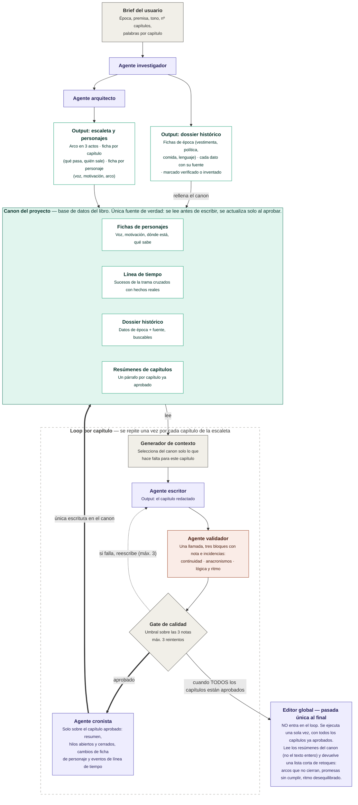

# Spec — Sistema multiagente de novelas históricas

## §1 Visión y alcance

Sistema que escribe una novela histórica capítulo a capítulo a partir de un brief corto. Un agente investiga la época, otro diseña la estructura, un escritor redacta cada capítulo, un validador lo puntúa en tres dimensiones y un cronista lo vuelca en el canon. Al terminar, un editor global propone retoques sobre el conjunto.

**Principio rector.** Lo determinista y lo generativo no se mezclan. Selección de contexto, cálculo del gate, control de reintentos, escritura en el canon y máquina de estados son del orquestador. Investigar, estructurar, redactar, revisar, resumir y editar son de los agentes. Ningún agente escribe en el canon; propone, y el orquestador decide con la propuesta ya comprobada delante.

**Quién orquesta.** Una sesión de Claude Code que lee la skill
`orquestar-novela` y lanza los seis roles como subagentes (§21). Lo determinista
no es código: son instrucciones que esa sesión obedece, con la fórmula del gate
escrita delante y la obligación de imprimir la operación entera.

**Hubo un segundo camino y ya no lo hay.** Durante nueve versiones el
repositorio mantuvo además un harness de Python que hacía lo mismo en
`novela/flujo.py`, a propósito, para poder comparar las dos maneras de resolver
el problema. La comparación se hizo; mantener las dos cuesta implementar cada
cambio dos veces, y eso no compensa. En 1.0.0 el harness sale del repositorio y
queda el tag `harness-python-final` (§16). Lo que sigue describe **un solo
sistema**, y donde este documento dice «el orquestador» habla de esa sesión de
Claude Code.

**Qué sigue siendo Python.** Lo que rodea a esa conversación y no cabe dentro de
ella: el lector del canon en ficheros, la interfaz de §19, las trazas de §20 y el
informe de §22. Nada de eso escribe novelas.

**Qué sección habla de qué.**

| Secciones | Qué describen |
|---|---|
| §2–§13, §15 | **El diseño.** Glosario, canon, máquina de estados, agentes, paquete de contexto, gate, validadores, skills, editor global, configuración, operación y decisiones abiertas |
| §18, §21 | Cómo está montado: el repositorio y sus comandos, y la orquestación en sí |
| §19, §20, §22 | Lo que mira el sistema desde fuera: la interfaz, las trazas y su análisis |
| §16, §17 | Historial y log de commits del documento |

El §14 quedó muerto en 1.0.0: era el roadmap por fases del harness. Los números
de sección no se reutilizan.

**Qué produce.** Un canon consultable, un fichero por capítulo aprobado y una lista final de retoques. No maqueta el libro ni aplica esos retoques por sí mismo.

**Fuera de alcance en el alcance inicial.** Exportación a EPUB, ilustraciones, varios proyectos a la vez, traducción y reescritura automática a partir del editor global. La interfaz gráfica estaba también en esta lista y ha salido en parte: hay una página local (§19) desde la que se ve el canon, se sigue el proceso y se leen los capítulos. No lanza nada, porque en ese canon escribe el orquestador y nadie más.

**Criterio de éxito.** Una novela completa sin contradicciones de canon detectables ni anacronismos groseros, con intervención humana solo en los dos puntos fijos que marca §4.

## §2 Glosario

| Término | Significado en este sistema |
|---|---|
| Brief | Entrada del usuario: época, premisa, tono, nº de capítulos y palabras por capítulo. Lo único que se escribe a mano al arrancar. |
| Canon | Base de datos del libro. Única fuente de verdad. Se lee antes de escribir y se actualiza solo al aprobar. |
| Dossier | Conjunto de datos históricos del canon, cada uno con su fuente y su estado de verificación. |
| Dato histórico | Unidad mínima del dossier: una afirmación sobre la época, con categoría, fuente y estado. |
| Escaleta | Plan de la novela: arco en tres actos y una ficha por capítulo. |
| Ficha de capítulo | Qué pasa en un capítulo y quién sale. Es el encargo que recibe el escritor. |
| Capítulo redactado | Texto que produce el escritor en un intento concreto. Puede no llegar a aprobarse. |
| Resumen | Un párrafo por capítulo aprobado, con hilos abiertos y cerrados. Es lo que lee el editor global. |
| Generador de contexto | Código que selecciona del canon lo que hace falta para un capítulo y arma el paquete de contexto. |
| Paquete de contexto | Salida del generador: el subconjunto del canon que ve el escritor. |
| Validador | Agente que puntúa el capítulo. Hay uno solo y juzga las tres dimensiones en la misma llamada. |
| Dimensión | Cada uno de los tres ejes que se juzgan por separado: continuidad, anacronismos, y lógica y ritmo. |
| Nota | Puntuación de 1 a 5 de una dimensión. Siempre hay tres notas; nota global no existe. |
| Gate | Código que decide, con las tres notas y sus incidencias, si el capítulo se aprueba o se reescribe. |
| Cronista | Agente que convierte el capítulo aprobado en resumen y en cambios de ficha. Única vía de escritura en el canon. |
| Intento | Cada pasada del escritor sobre el mismo capítulo. El tope lo fija `gate.max_intentos`, tres por defecto (§12). |
| Editor global | Agente de pasada única al final, fuera del loop. Lee resúmenes, no texto. |
| Orquestador | Quien lleva el proceso y escribe el canon: una sesión de Claude Code con la skill de §21. No genera prosa. |

## §3 Modelo de datos del canon

**Decisión de almacenamiento.** El canon es una base SQLite (`canon.db`) y, al lado, un fichero Markdown por intento de capítulo en `capitulos/`; SQLite porque el dossier y la línea de tiempo se consultan con filtros y búsqueda de texto, y el texto largo no gana nada viviendo dentro de la base.

Los tipos son lógicos, no de un motor concreto (§18 fija el stack). `lista` se serializa como JSON en una columna de texto. Todas las entidades llevan `id` de texto salvo donde el número de capítulo ya es clave.

El brief no tiene tabla propia: se guarda como fila única en `proyecto` con sus cinco campos (época, premisa, tono, nº de capítulos y palabras por capítulo) más el estado de §4.

**Personaje**

| Campo | Tipo | Obl. | Notas |
|---|---|---|---|
| id | texto | sí | Slug estable, se usa en referencias cruzadas |
| nombre | texto | sí | |
| rol | enum | sí | `protagonista` \| `secundario` \| `figurante` |
| voz | texto | sí | Cómo habla: registro, muletillas, qué nunca diría |
| motivacion | texto | sí | Qué quiere y por qué |
| arco | texto | sí | De dónde parte y adónde llega |
| ubicacion | texto | sí | Dónde está ahora mismo en la trama |
| sabe | lista | no | Qué conoce y qué ignora. Clave para la dimensión de continuidad |
| actualizado_en | entero | sí | Nº del último capítulo aprobado que tocó la ficha |

**Evento de timeline**

| Campo | Tipo | Obl. | Notas |
|---|---|---|---|
| id | texto | sí | |
| tipo | enum | sí | `trama` \| `historico` |
| fecha | texto | sí | ISO parcial: `1587`, `1587-04`, `1587-04-12` |
| descripcion | texto | sí | Una frase |
| capitulo | entero | no | Solo en eventos de trama |
| personajes | lista | no | Ids de personaje implicados |
| dato_id | texto | no | Dato histórico que respalda un evento `historico` |

**Dato histórico**

| Campo | Tipo | Obl. | Notas |
|---|---|---|---|
| id | texto | sí | |
| categoria | enum | sí | `vestimenta` \| `politica` \| `comida` \| `lenguaje` \| `otro` |
| dato | texto | sí | Afirmación concreta y verificable |
| fuente | texto | sí | URL si viene de búsqueda; `modelo` si es conocimiento del agente |
| estado | enum | sí | `verificado` \| `sin_verificar` \| `inventado` |
| etiquetas | lista | sí | Términos de búsqueda para el generador de contexto |

**Ficha de capítulo**

| Campo | Tipo | Obl. | Notas |
|---|---|---|---|
| numero | entero | sí | Clave |
| titulo | texto | sí | |
| acto | entero | sí | 1, 2 o 3 |
| sinopsis | texto | sí | Qué pasa, en tres o cuatro frases |
| fecha | texto | sí | ISO parcial, cuándo transcurre. Con la del capítulo anterior fija la ventana de cronología de §7 |
| personajes | lista | sí | Ids de quien sale |
| etiquetas | lista | sí | Términos de época con los que el generador busca en el dossier (§7) |
| objetivo | texto | sí | Qué tiene que haber cambiado al acabar el capítulo |
| palabras_objetivo | entero | sí | Heredado del brief salvo que la escaleta lo ajuste |
| estado | enum | sí | `pendiente` \| `en_curso` \| `aprobado` \| `bloqueado` |

**Capítulo redactado**

| Campo | Tipo | Obl. | Notas |
|---|---|---|---|
| capitulo | entero | sí | Referencia a la ficha |
| intento | entero | sí | 1, 2 o 3 |
| ruta | texto | sí | Ruta al `.md`, p. ej. `capitulos/012-i2.md` |
| palabras | entero | sí | |
| revisiones | lista | no | Tres bloques, uno por dimensión, con su nota y sus incidencias. Mismo formato venga de una llamada o de tres |
| faltantes | lista | no | Datos de época que el escritor echó en falta al redactar (§5) |
| estado | enum | sí | `propuesto` \| `aprobado` \| `descartado` |
| creado | texto | sí | Marca de tiempo ISO 8601 |

**Resumen de capítulo**

| Campo | Tipo | Obl. | Notas |
|---|---|---|---|
| capitulo | entero | sí | Clave. Solo existe si el capítulo está aprobado |
| resumen | texto | sí | Un párrafo |
| hilos_abiertos | lista | sí | Promesas que el capítulo deja pendientes |
| hilos_cerrados | lista | sí | Promesas que salda |
| personajes_presentes | lista | sí | Ids |

**Ejemplo (personaje).** Único ejemplo del documento; fija el estilo para el resto.

```json
{
  "id": "ines-de-arteaga",
  "nombre": "Inés de Arteaga",
  "rol": "protagonista",
  "voz": "Frases cortas y secas. Usa términos de navegación con naturalidad. Nunca jura en voz alta.",
  "motivacion": "Recuperar el nombre de su padre, condenado por contrabando.",
  "arco": "De obedecer las reglas del gremio a romperlas a sabiendas.",
  "ubicacion": "Sevilla, barrio de Triana",
  "sabe": ["Que el contador falsificó el registro", "Ignora que su hermano lo sabía"],
  "actualizado_en": 7
}
```

## §4 Arquitectura y flujo

El sistema tiene tres tramos: preparación (una vez), loop de capítulo (una vez por capítulo) y cierre (una vez). El canon está en medio de todos y es el único punto de contacto entre ellos: los agentes nunca se pasan datos entre sí por fuera del canon o del paquete de contexto. Dentro del loop, la única escritura en el canon ocurre después del gate, cuando el cronista convierte el capítulo aprobado en resumen y en cambios de ficha.

El diagrama nació en [`sistema-novelas-historicas-v2.drawio`](../diagrama/sistema-novelas-historicas-v2.drawio) y su versión Mermaid vive en [`sistema-novelas-historicas-v2.mermaid`](../diagrama/sistema-novelas-historicas-v2.mermaid), idéntica al bloque de abajo. El `.drawio` es ahora el que va por detrás: le falta el cronista y hay que regenerarlo a mano. Los colores separan agentes, revisores, datos y las piezas deterministas que lleva el orquestador.



**Máquina de estados del proyecto.** Un solo campo en `proyecto`, avanza en un sentido salvo `bloqueado`.

- `borrador` — existe el brief, no hay nada más. Transición al arrancar el investigador.
- `investigado` — el dossier está en el canon. Habilita al arquitecto.
- `estructurado` — escaleta y fichas de personaje en el canon. Habilita el loop.
- `escribiendo` — el loop está en marcha: hay capítulos en curso o ya aprobados y quedan pendientes. Se entra al arrancar el primero, no al aprobarlo.
- `bloqueado` — un capítulo agotó sus intentos (`gate.max_intentos`). Requiere mano humana (§8).
- `escrito` — todas las fichas de capítulo en `aprobado`. Habilita el editor global.
- `editado` — existe la lista de retoques. Estado final del sistema.

**Qué corre en paralelo.** Nada, con la configuración por defecto: el validador único dejó el flujo entero en serie. Solo vuelve a haber paralelismo si se pone `validador.modo` en `separado` (§12), y entonces son tres llamadas simultáneas sobre el mismo capítulo. Lo demás es secuencial por dependencia real: el arquitecto necesita el dossier cerrado, y cada capítulo necesita el canon que dejó el anterior. No se escriben dos capítulos a la vez, aunque parezca tentador: el capítulo N+1 depende de lo que el N haya dejado en las fichas de personaje.

**Dónde entra el humano.** Dos puntos fijos:

1. **Capítulo bloqueado.** Al fallar el tercer intento el sistema para y espera. Tú editas el texto a mano, relajas el umbral o retocas la ficha de capítulo, y lo desbloqueas (§8).
2. **Retoques finales.** El editor global entrega una lista y tú decides qué aplicar. Aplicarlos es manual y queda fuera del sistema en el alcance inicial.

Queda por decidir un tercer punto: parar al acabar la preparación para que revises dossier y escaleta antes de arrancar el loop. Es la parada más barata del sistema y un fallo ahí contamina el libro entero, pero obliga a partir la ejecución en dos arranques. Sin cerrar, en §15 (DA-03). Mientras no se decida, la preparación no para y la escaleta se corrige editando el canon a mano.

## §5 Agentes

Seis agentes. Ninguno escribe en el canon: todos devuelven una propuesta estructurada que valida y persiste el orquestador. Actualizar el canon tras aprobar es trabajo de un agente propio, el cronista, y no del escritor, porque así corre una sola vez sobre el texto que se queda en lugar de tres veces sobre borradores que se descartan. El modelo sugerido es una primera apuesta de la familia Claude, revisable sin tocar el diseño (§15, DA-02).

| Agente | Entrada | Salida | Modelo sugerido |
|---|---|---|---|
| Investigador | Brief | Lista de datos históricos | Opus 5 + herramienta de búsqueda |
| Arquitecto | Brief + dossier | Escaleta con las fichas de capítulo de §3, `fecha` y `etiquetas` incluidas, y fichas de personaje | Opus 5 |
| Escritor | Paquete de contexto (§7) | Capítulo en Markdown + lista de faltantes | Opus 5 |
| Validador | Capítulo + canon relevante, dossier y encargo | Tres bloques, cada uno con nota 1-5 e incidencias | Sonnet 5 |
| Cronista | Capítulo aprobado + fichas de quien sale | Resumen, hilos, cambios de personaje y eventos | Sonnet 5 |
| Editor global | Resúmenes + escaleta + personajes | Lista de retoques | Opus 5 |

**Investigador.** Le pido fichas de época sobre vestimenta, política, comida y lenguaje para el lugar y las fechas del brief. Trabaja de memoria: su subagente tiene `tools: Read` y no busca nada. La búsqueda web sigue sin existir y §12 dice qué haría falta para que entre. Cada dato sale con su categoría y su estado: `verificado` si hay fuente que lo respalde, `sin_verificar` si solo lo recuerda, `inventado` si lo rellena él para tapar un hueco. Modos de fallo: inventar fuentes con aspecto creíble, marcar `verificado` lo que solo recuerda, y desbordarse en cantidad de datos genéricos que luego nadie usa.

**Arquitecto.** Le pido el arco en tres actos, una ficha por capítulo y una ficha por personaje, coherentes con el dossier ya cerrado. Reparte los hilos para que cada capítulo cierre algo y abra algo. Cada ficha de capítulo sale con su `fecha` y sus `etiquetas` (§3): son lo único contra lo que el generador de contexto puede cruzar cronología y dossier (§7), y como el generador es código y no interpreta prosa, si el arquitecto no las emite esos dos bloques del paquete se quedan vacíos. Modos de fallo: escaletas planas donde el acto central no tiene giro, personajes con motivación decorativa que no mueve la trama, capítulos que prometen más de lo que caben en las palabras objetivo, y etiquetas tan genéricas que el bloque de época se llena de datos que no vienen a cuento.

**Escritor.** Le paso el paquete de contexto y le pido el capítulo entero, en prosa, respetando la voz de cada personaje y sin introducir hechos que no estén en el canon. Si necesita un detalle de época que no le he dado, resuelve la escena sin él y lo anota en `faltantes`, lista que viaja con el capítulo y que el orquestador guarda: no hay canal de vuelta síncrono ni el escritor espera respuesta de nadie. Modos de fallo: resumir en lugar de dramatizar cuando se acerca al límite de palabras, homogeneizar las voces hacia un registro neutro, y colar objetos o ideas fuera de época por inercia narrativa.

**Validador.** Una sola llamada que juzga tres dimensiones: continuidad contra el canon, anacronismos contra el dossier, y lógica y ritmo contra el encargo del capítulo. Su salida son tres bloques independientes, cada uno con su nota de 1 a 5 y sus incidencias, cada uno evaluado con su propia rúbrica (§8). No devuelve nota global y el gate sigue recibiendo tres números. El prompt le obliga a resolver las dimensiones en orden y a no releer lo ya juzgado, para que no arrastre una impresión general.

*Riesgo conocido de fundirlas.* Al juzgar en una sola pasada, las notas tienden a correlacionarse: el capítulo que gusta se lleva tres cincos y el que chirría tres doses, cuando la gracia del diseño es que un texto brillante pueda caer por continuidad. El segundo efecto es que el anacronismo conceptual, el caro, se diluye cuando la misma pasada ya va buscando contradicciones de canon: el léxico raro salta, la idea fuera de época no. Ambos se vigilan comparando la dispersión de las tres notas a lo largo del libro; si se confirman, `validador.modo: "separado"` (§12) devuelve las tres llamadas sin tocar el modelo de datos ni el gate. Otros modos de fallo: falsos positivos de léxico moderno pero válido, y confundir una elipsis con un hueco de continuidad.

**Cronista.** Corre una sola vez por capítulo, después del gate y solo sobre el intento aprobado. Le paso el texto, la ficha de capítulo y las fichas de quien sale, y le pido cuatro cosas: el resumen de un párrafo, los hilos que abre y los que cierra, los cambios de `ubicacion` y `sabe` de cada personaje presente, y los eventos de trama nuevos para la línea de tiempo. Devuelve una propuesta que el orquestador valida antes de escribirla en el canon. Modos de fallo: resúmenes que cuentan lo que pasa pero no lo que cambia, dar por sabido a un personaje algo que ocurrió sin él delante, y callarse hilos abiertos, que es el fallo caro porque el editor global solo ve lo que el cronista escribió.

**Editor global.** Le paso los resúmenes de todos los capítulos, la escaleta y las fichas de personaje, nunca el texto completo. Le pido una lista corta y accionable: arcos que no cierran, promesas abiertas sin saldar, actos desequilibrados. Modos de fallo: generalidades no accionables del tipo «reforzar el tema», y proponer reescrituras masivas cuando el encargo es una lista de retoques.

## §6 Memoria: largo y corto plazo

El sistema tiene dos memorias y un estado de run. Los nombres de esta sección se usan igual en todo el documento.

**Memoria a largo plazo: el canon.** Sobrevive al proceso, persiste entre ejecuciones y solo se escribe al aprobar un capítulo, siempre por el cronista (§5). Dentro hay dos regímenes distintos y conviene no confundirlos:

- *Parte inmutable.* Dossier histórico, escaleta y brief. Se escriben una vez en la preparación y nadie los toca después; el loop solo los lee. Cambiarlos a mitad de libro invalida lo escrito, porque los capítulos anteriores se redactaron contra otra verdad. Si hay que tocarlos, es mano humana (DA-10 en §15).
- *Parte que evoluciona.* Fichas de personaje en sus campos `ubicacion`, `sabe` y `actualizado_en`, resúmenes de capítulo y eventos de trama de la línea de tiempo. Crece un escalón por capítulo aprobado, nunca a mitad. Los campos de identidad del personaje, voz, motivación y arco, pertenecen de hecho a la parte inmutable: si el arco cambia, es que la escaleta cambió.

**Memoria a corto plazo: el loop de un capítulo.** Vive en el proceso mientras se escribe un capítulo y no se persiste como verdad de nada: paquete de contexto (§7), texto del intento anterior, incidencias del validador, contador de intentos y avisos de las comprobaciones deterministas (§9). Al aprobar, casi todo se tira. Asciende a largo plazo solo lo que propone el cronista y sobrevive a la validación: el resumen con sus hilos, los cambios de ficha de personaje y los eventos de trama nuevos. El texto del capítulo aprobado no es memoria: es el producto, y vive en `capitulos/` con su fila en el canon apuntándolo.

Los intentos fallidos no se borran, pero tampoco son memoria. Quedan en disco como rastro para mirar cuando algo va mal, y el generador de contexto no los lee jamás. Un capítulo desaprobado no deja huella en lo que el escritor ve del siguiente.

**Estado del run.** Lo mínimo para poder reanudar (§13): el estado del proyecto, el estado de cada ficha de capítulo, las filas de capítulo redactado con sus revisiones y el número de intento en curso. Todo eso vive en el canon, no en variables. El paquete de contexto no se guarda: se reconstruye entero desde el canon, y por eso el generador tiene que ser determinista.

| Qué | Dónde vive | Cuándo se borra |
|---|---|---|
| Dossier, escaleta, brief | Canon, parte inmutable | Nunca dentro de un run |
| Fichas de personaje, resúmenes, timeline | Canon, parte que evoluciona | Nunca; se actualizan al aprobar |
| Texto del capítulo aprobado | `capitulos/`, referenciado desde el canon | Nunca |
| Paquete de contexto | Memoria del proceso | Al terminar el capítulo; se reconstruye |
| Texto e incidencias del intento anterior | Memoria del proceso | Al aprobar el capítulo o al agotar intentos |
| Contador de intentos | Canon, fila de capítulo redactado | Al aprobar, o al relanzar un capítulo bloqueado |
| Intentos descartados | `capitulos/` como rastro | A mano, cuando estorben |

## §7 Generador de contexto

Código, no agente: mismo capítulo y mismo canon dan siempre el mismo paquete. Recibe un número de capítulo y devuelve el paquete de contexto que verá el escritor, que nunca consulta el canon por su cuenta.

| Bloque | Qué entra | Criterio de selección |
|---|---|---|
| Encargo | Ficha del capítulo entera | Siempre |
| Personajes | Fichas completas de quien sale | `personajes` de la ficha |
| Reparto de fondo | Nombre y una línea de quien no sale pero se menciona | Aparece en la sinopsis |
| Memoria reciente | Resúmenes completos de los `contexto.ventana_resumenes` capítulos anteriores | Ventana fija, configurable (§12) |
| Memoria larga | Resúmenes del resto, recortados a una frase | Solo capítulos aprobados |
| Hilos vivos | Hilos abiertos y aún no cerrados | Diferencia entre abiertos y cerrados |
| Época | Datos históricos que casan con las `etiquetas` de la ficha de capítulo (§3) | Coincidencia de etiquetas, `verificado` primero |
| Cronología | Eventos de línea de tiempo en la ventana del capítulo | Entre la `fecha` de la ficha anterior y la de esta (§3) |
| Enganche | Últimas `contexto.palabras_enganche` palabras del capítulo anterior aprobado | Literal, para continuidad de tono |

Dos reglas que no se negocian. El texto completo de capítulos anteriores no entra nunca, salvo el enganche: para eso están los resúmenes. Y en el paquete viaja el estado de cada dato histórico, porque el escritor necesita saber qué es firme y qué es relleno.

El paquete tiene un tope de tokens configurable (§12). Si se pasa, se recorta en este orden: memoria larga, cronología, reparto de fondo, época. El encargo, los personajes y los hilos vivos no se recortan; si aun así no cabe, el capítulo se marca `bloqueado` en lugar de escribirse con el contexto mutilado.

## §8 Loop de capítulo y gate

Un capítulo se da por bueno cuando pasa el gate, no cuando el escritor termina. Todo lo de esta sección es código salvo las cuatro llamadas a agentes.

```
para cada capitulo de la escaleta con estado != aprobado:
    marcar capitulo en_curso
    paquete = generar_contexto(capitulo)                      # §7
    incidencias = []
    texto_previo = null

    para intento en 1..gate.max_intentos:
        texto = escritor(paquete, texto_previo, incidencias)
        guardar_intento(capitulo, intento, texto)             # estado propuesto
        det = comprobaciones(texto)                           # §9
        si det.bloqueantes:                                   # VD-08 en su escalon de bloqueo
            incidencias = det.todas
            texto_previo = null                               # el reintento va de cero
            siguiente intento                                 # sin llamar al validador

        rev = validar(texto, paquete)          # 1 llamada; 3 en paralelo si modo separado
        si no comprobaciones_ok(rev): reintentar la llamada     # §9, sin gastar gate
        guardar_revisiones(capitulo, intento, rev)              # siempre 3 bloques

        si gate(rev):
            marcar intento aprobado y descartar los demas
            cambios = cronista(texto, ficha, personajes)       # §5
            validar_y_escribir(cambios)                        # unica escritura en canon
            marcar capitulo aprobado
            salir del bucle de intentos

        incidencias = rev.incidencias + det.avisos            # §9, VD-08 en su escalon de aviso
        texto_previo = texto si intento + 1 < gate.max_intentos sino null   # el ultimo va de cero

    si capitulo != aprobado:
        marcar capitulo bloqueado y proyecto bloqueado
        parar y esperar mano humana                            # §13

si todos los capitulos aprobados:
    marcar proyecto escrito
    retoques = editor_global(resumenes, escaleta, personajes)  # §11
    guardar retoques.md y marcar proyecto editado             # §11
```

**Rúbrica.** Una por dimensión, escala 1 a 5 entera, con anclas para que la nota no derive entre capítulos. El validador aplica las tres por separado (§5) y el gate no sabe si vinieron de una llamada o de tres.

| Dimensión | Qué puntúa | Nota 1 | Nota 3 | Nota 5 |
|---|---|---|---|---|
| Continuidad | Coherencia con el canon: dónde está cada uno, qué sabe, cuándo pasa | Contradice un hecho del canon | Detalle menor sin respaldo | Todo cuadra y usa el canon con precisión |
| Anacronismos | Objetos, costumbres, instituciones y léxico frente al dossier | Rompe un dato `verificado` | Choca con un `sin_verificar` | Época sostenida sin adorno de folleto |
| Lógica y ritmo | Causa y efecto, cumplimiento del objetivo del capítulo, tensión | La escena no lleva a ninguna parte | Avanza pero se atasca o se salta un paso | Cada escena empuja la siguiente |

Cada incidencia lleva cita textual, severidad (`grave` o `aviso`) y una sugerencia de una línea. Grave es contradecir el canon o un dato `verificado`; el resto es aviso.

**Fórmula del gate.** `aprueba = min(notas) >= 3 y media(notas) >= 3,7 y ninguna incidencia grave`. La incidencia grave veta por sí sola: un capítulo puede sacar tres cuatros y caer por una contradicción de canon, porque eso no se arregla puntuando más alto. Los tres números son configurables (§12) y están sin calibrar hasta que haya capítulos reales (§11, DA-06).

**Qué recibe el escritor al reintentar.** El mismo paquete de contexto, las incidencias del intento anterior ordenadas por severidad y, en todos los intentos menos el último, su propio texto: ahí se le pide arreglo quirúrgico, tocar lo señalado y no reescribir lo que ya funciona. El último —el tercero con los valores por defecto— va desde cero con las incidencias acumuladas, porque si las pasadas quirúrgicas no han bastado el problema no está en las frases sino en el planteamiento de la escena. El intento que ni siquiera llega al validador porque VD-08 lo bloquea va también de cero: no hay arreglo quirúrgico que valga en un texto al que le falta medio capítulo.

**Al agotar los intentos.** El capítulo queda `bloqueado`, el proyecto también, y el sistema para en vez de seguir con el siguiente: escribir sobre un canon con un agujero solo propaga el problema. Se conserva el intento con mejor media, en estado `propuesto`, y sus revisiones. Tienes tres salidas, todas manuales: editar el texto a mano y aprobarlo, retocar la ficha de capítulo y relanzar con el contador a cero, o bajar el umbral solo para ese capítulo dejando constancia.

## §9 Inventario de validadores

Comprobaciones deterministas en código, con id `VD-xx`. No confundir con el agente validador de §5: aquí no hay criterio literario ni llamadas a modelos, solo reglas que se cumplen o no. Bloqueante significa que el artefacto no se usa; aviso significa que se registra y el proceso sigue.

| Id | Qué comprueba | Sobre qué | Cuándo | Sev. | Al fallar |
|---|---|---|---|---|---|
| VD-01 | La salida parsea y cumple el esquema esperado | Salida de cualquier agente | Al recibirla | Bloq. | Reintenta la llamada una vez; si repite, para |
| VD-02 | Campos obligatorios presentes y no vacíos | Salida de cualquier agente | Al recibirla | Bloq. | Rechaza la propuesta y reintenta la llamada |
| VD-03 | Los ids referenciados existen en el canon | Propuestas de arquitecto y cronista | Antes de escribir | Bloq. | Rechaza la propuesta entera, no la parte buena |
| VD-04 | Todo dato histórico lleva fuente y estado válido | Dossier del investigador | Antes de habilitar al arquitecto | Bloq. | Devuelve al investigador solo los datos malos |
| VD-05 | Evento de trama con capítulo; evento histórico sin él | Timeline de arquitecto y cronista | Antes de escribir | Bloq. | Rechaza la propuesta |
| VD-06 | Solo hay resumen si el capítulo está aprobado | Escritura del cronista | Antes de confirmar | Bloq. | Aborta la escritura completa |
| VD-07 | Nº de capítulos dentro de `margenes.capitulos_min` y `capitulos_max` | Escaleta del arquitecto | Fin de preparación | Bloq. | Reintenta al arquitecto con el margen explícito |
| VD-08 | Párrafos y palabras dentro de los márgenes de config (§12) | Capítulo redactado | Antes del validador | Aviso o bloq. | Dentro de `palabras_aviso`, lo adjunta como aviso al reintento; fuera de `palabras_bloqueo` o por debajo de `parrafos_min`, descarta el intento sin llamar al validador |
| VD-09 | Personajes presentes ⊆ personajes de la ficha | Propuesta del cronista | Antes de escribir | Bloq. | Rechaza y reintenta; suele ser personaje colado |
| VD-10 | Tres dimensiones, una vez cada una, nota entera 1-5 | Salida del validador | Antes del gate | Bloq. | Reintenta la llamada al validador, no al escritor |
| VD-11 | Ningún bloqueante pendiente al confirmar | Transacción del canon | En la escritura | Bloq. | Deshace la transacción; el canon no queda a medias |

**Orden.** Cada salida pasa sus comprobaciones antes de usarse, y las comprobaciones van siempre antes que el gate. La regla que ahorra dinero es VD-08 y su familia: si el capítulo redactado no cumple lo básico, se reintenta la generación sin gastar la llamada al agente validador. VD-08 es la única comprobación de dos escalones, y por eso lleva dos márgenes en §12: un texto algo corto se valida igual y arrastra el aviso, y uno que se sale del margen de bloqueo no llega al validador porque ninguna nota va a arreglar que falte medio capítulo. La que salva el canon es VD-11: la escritura del cronista es una transacción única, así que o entran resumen, cambios de ficha y eventos juntos, o no entra nada. El gate (§8) solo se calcula sobre revisiones que ya pasaron VD-10, de modo que nunca opera con notas inventadas o incompletas.

Un bloqueante que falla dos veces seguidas sobre el mismo artefacto para el proceso y deja el estado escrito, igual que un error de proveedor (§13). No hay reintento infinito: si un agente no sabe devolver lo que se le pide, insistir sale caro y no arregla nada.

## §10 Inventario de skills

Skills en el sentido de Claude Code: carpetas con instrucciones reutilizables que cada subagente carga al arrancar. Aquí va lo que es estable y se repite en todas las llamadas de un agente. Lo que cambia en cada capítulo viaja en el paquete de contexto (§7), no en la skill.

| Skill | Para qué sirve | Quién la usa | Entrada que espera | Qué devuelve |
|---|---|---|---|---|
| `formato-dossier` | Qué es un dato de época bien escrito y cómo marcar fuente y estado | Investigador | Época y lugar del brief | Datos con categoría, fuente, estado y etiquetas |
| `formato-fichas` | Estructura de la escaleta, la ficha de capítulo y la ficha de personaje | Arquitecto, y el cronista al proponer cambios | Brief y dossier ya cerrado | Escaleta y fichas conformes a §3 |
| `estilo-prosa` | Reglas de voz narrativa por tono, un fichero por tono del brief | Escritor | Tono y palabras objetivo | Instrucciones de estilo, sin contenido de trama |
| `formato-paquete-contexto` | Cómo se serializa y en qué orden se presenta el contexto | Generador de contexto y escritor | Bloques de §7 | El paquete en el formato que el escritor espera |
| `rubricas-validador` | Las tres rúbricas ancladas y el formato de los tres bloques | Validador | Capítulo, canon relevante y encargo | Tres bloques con nota e incidencias |

Las dos que no pueden faltar son `formato-dossier` y `formato-fichas`, porque son las que fijan la forma de lo que entra en el canon antes de que haya nada escrito. Sin ellas, cada pasada devuelve una estructura distinta y no hay canon que valga.

**Qué no debe ser una skill.** Cuatro cosas, y todas por el mismo motivo: una skill es texto que lee un modelo, no una fuente de verdad para el código.

- *Números y umbrales.* Viven en `config.json` (§12). Si el umbral del gate estuviera en una skill, el código y el prompt podrían discrepar y ganaría el que se editara último.
- *Lógica determinista.* Las comprobaciones de §9 y la selección de contexto de §7 son código. Escribirlas como instrucciones las vuelve opinables, que es justo lo contrario de lo que se busca.
- *Contenido del canon.* El dossier concreto o las fichas reales de esta novela son datos. Copiarlos a una skill crea una segunda verdad que nadie actualiza.
- *El encargo del capítulo.* Cambia en cada llamada, así que va en el paquete de contexto. La skill dice cómo escribir un capítulo; el paquete dice qué capítulo escribir.

## §11 Editor global

Corre una sola vez, cuando el proyecto entra en `escrito`, y fuera del loop. Lee los resúmenes de todos los capítulos, los hilos que siguen abiertos al final, la escaleta y las fichas de personaje. No lee el texto: si algo no se ve en los resúmenes, es que el cronista no lo registró, y ese es un fallo que se arregla en §5, no leyendo 200.000 palabras.

Devuelve una lista corta de retoques. Cada retoque tiene id, tipo (`arco`, `promesa`, `ritmo` o `personaje`), capítulos afectados, una descripción accionable de una o dos frases y una severidad. Se le pide brevedad y concreción: diez retoques que se puedan ejecutar valen más que cuarenta observaciones.

La lista se guarda como `retoques.md` junto al canon, no dentro. El canon es la verdad de la novela escrita y esto es una lista de tareas para mí; mezclarlas haría que el canon dejara de ser lo que dice §2.

El editor no aplica nada ni dispara reescrituras. En el alcance inicial el bucle se cierra a mano: yo decido qué retoques valen y los aplico editando capítulos. Automatizar esa vuelta es lo primero que queda fuera de alcance (§1) y está apuntado en §15 (DA-07).

## §12 Configuración

Un único `config.json` en la raíz del proyecto, junto al canon. Aquí vive todo lo que se toca sin tocar código, y no se duplica en ninguna skill (§10): si un número aparece escrito en el código sin pasar por este fichero, es un bug y no una decisión. Se carga al arrancar, se valida entero y se para si falta una clave o un valor cae fuera de rango, porque una errata en un umbral sale más barata descubierta al arrancar que tres capítulos después. **Lo lee también el orquestador**, que no es código: la skill de §21 imprime estos números y los obedece, así que un umbral escrito a mano en un prompt sigue siendo un bug.

**Dónde vive el modelo de cada rol.** No aquí. Hubo una clave
`modelo_por_rol` mientras el harness hacía las llamadas; ahora las hace Claude
Code, que lee el modelo del `model:` en el frontmatter de cada
`.claude/agents/novela-*.md` y no mira este fichero. Tener las dos cosas era
tener un número que no gobernaba nada, que es el bug que esta sección existe para
evitar, así que la clave se fue en 1.0.0 y manda el frontmatter. DA-02 sigue
abierta y ahora se decide ahí.

| Clave | Por defecto | Para qué |
|---|---|---|
| `gate.nota_minima` | 3 | Suelo por dimensión en el gate (§8) |
| `gate.media_minima` | 3,7 | Media exigida a las tres notas |
| `gate.max_intentos` | 3 | Reintentos del escritor antes de bloquear |
| `contexto.tope_contexto` | 40000 | Tope de tokens del paquete de contexto (§7) |
| `contexto.ventana_resumenes` | 3 | Capítulos anteriores que van con resumen completo |
| `contexto.palabras_enganche` | 400 | Cola literal del capítulo anterior |
| `interfaz.puerto` | 8787 | Puerto local de la interfaz del brief (§19) |
| `trazas.activas` | `true` | Manda las trazas de §20 a Langfuse |
| `trazas.entorno` | `desarrollo` | Separa las pasadas de prueba de las que escriben libros de verdad |
| `margenes.capitulos_min` y `capitulos_max` | 0,8 y 1,2 | Desvío tolerado sobre el nº de capítulos del brief (VD-07) |
| `margenes.palabras_aviso` | 0,15 | Desvío sobre `palabras_objetivo` que genera aviso (VD-08) |
| `margenes.palabras_bloqueo` | 0,4 | Desvío que descarta el intento sin llamar al validador (VD-08) |
| `margenes.parrafos_min` | 3 | Mínimo de párrafos de un capítulo redactado (VD-08) |

El puerto de la interfaz vive aquí y no en el código por la misma regla que el resto: es un número que se toca sin tocar código, y en una máquina con el 8787 ocupado hay que poder cambiarlo. `python -m novela ui --puerto N` lo pisa para un arranque suelto, igual que `--config`.

La interfaz de §19 llama **perfil** a cada `config*.json` de la raíz. No es
un concepto nuevo: es este mismo fichero, y lo que cambia de uno a otro son los
umbrales. El que no valide no sale en la lista, por la misma razón por la que se
para al arrancar.

Con esto la tabla tiene **catorce** claves. En 0.14.0 eran diecinueve: se fueron
`ejecucion.modo` y `validador.modo` con el harness que los leía, `interfaz.camino`
porque ya no hay dos canones entre los que elegir, y `modelo_por_rol` y
`busqueda_web` porque no gobernaban nada.

**Por qué dos márgenes de palabras.** VD-08 tiene que distinguir el capítulo que se queda corto del que no sirve. Dentro de `palabras_aviso` el texto vale y la desviación viaja como aviso al reintento; pasado `palabras_bloqueo` no se gasta la llamada al validador y se reintenta la generación. Con un solo umbral había que elegir entre no filtrar nada o tirar capítulos aprovechables.

**La búsqueda web del investigador sigue sin existir.** Hubo una clave `busqueda_web` puesta a `true` para no tocar el esquema más tarde, y el investigador nunca la miró: su subagente tiene `tools: Read` y no busca nada. Se fue en 1.0.0 con las demás claves que no gobernaban nada. Cuando la búsqueda entre de verdad, lo que hay que cambiar son las herramientas del subagente, no una clave de este fichero. DA-04 sigue abierta.

**Las credenciales, todas fuera de aquí.** Ni la de la API ni las de Langfuse (§20) caben en este fichero, porque se versiona. Van en un `.env` de la raíz, ignorado por git, que se lee al arrancar y vuelca en el entorno **sin pisar lo que ya haya**: quien exporta una variable a mano lo hace para esa ejecución y el fichero no tiene por qué contradecirle. El lector es propio y minúsculo a propósito, para no estrenar dependencia por veinte líneas. `trazas.entorno` sí vive aquí porque no es un secreto sino una etiqueta, y se valida al arrancar con las reglas de Langfuse: un entorno mal escrito no falla, que sería barato, sino que manda las trazas a otro sitio.

## §13 Operación: fallos y reanudación

**Qué pasa cuando algo falla a mitad.** El estado vive en el canon, nunca en memoria del proceso, así que un corte de red, un error del proveedor o un Ctrl+C no pierden más que el intento en curso. Como el canon solo se toca después del gate y en una única escritura validada del cronista, no existe el estado a medias: o el capítulo entró entero o no entró. Lo peor que deja una caída es un Markdown huérfano en `novela-cc/capitulos/` sin su intento en `estado.json`, que al relanzar se descarta. Ante un error de un subagente se reintenta la llamada una vez; si vuelve a fallar, el proceso para y deja el estado escrito en lugar de insistir. No hay política de backoff ni de reintentos finos en el alcance inicial, y es deliberado: con un solo usuario, parar y mirar sale más barato que automatizar la recuperación.

**Reanudación.** Una sola instrucción, sin argumentos: lee el estado del proyecto, localiza el primer capítulo no aprobado y sigue desde ahí. Relanzar con el proyecto ya `escrito` no reescribe nada, solo vuelve a ofrecer el editor global. El par capítulo e intento identifica cada fichero, así que repetir un intento sobrescribe en lugar de duplicar. Reanudar no desbloquea: mientras el proyecto siga en `bloqueado`, el comando vuelve a parar en el mismo capítulo hasta que se tome una de las tres salidas manuales de §8.

## §14 *(número muerto)*

Fue el roadmap por fases del harness, F0 a F8. Se retiró en 1.0.0 con el harness
que describía. De sus nueve fases, las ocho primeras están hechas y F6 —búsqueda
web real del investigador— no; §12 dice qué haría falta ahora para que entre. Los
números de sección no se reutilizan.

## §15 Decisiones abiertas

Lo que no está decidido. Nada de aquí bloquea escribir una novela; todo
bloquea darla por buena sin mirarla. Los ids no se reutilizan: DA-01 salió al
decidirse el stack (§18) y DA-11 al decidirse que la interfaz sí lanza el flujo,
decisión que 1.0.0 revirtió por otro motivo —ya no hay flujo que lanzar—. Los dos
números quedan muertos.

La columna de plazos hablaba de las fases F0 a F8 del roadmap, que era del
harness y murió con él (§14). Ahora dice qué hace falta tener delante para poder
decidir, que es lo que la columna quería decir desde el principio.

DA-06 no se cierra con las trazas, pero deja de estar a ciegas: §20 manda las
tres notas y la media de cada intento como puntuaciones, y §22 las cruza con lo
que costó cada capítulo, así que calibrar los umbrales pasa a ser mirar una
distribución en lugar de discutirla.

| Id | Decisión pendiente | Por qué importa | Cuándo decidirla |
|---|---|---|---|
| DA-02 | Modelo definitivo de cada agente | Validador y escritor se llevan casi todas las llamadas; el reparto decide el coste del libro | Con varias novelas trazadas, mirando §22 |
| DA-03 | Parada humana al acabar la preparación | Es la revisión más barata y un fallo de escaleta contamina el libro entero | Antes de la próxima novela larga |
| DA-04 | Proveedor de búsqueda del investigador | Define qué significa exactamente `verificado` en el dossier | Cuando la búsqueda web entre de verdad |
| DA-05 | Qué hacer con los `faltantes` del escritor | Hoy se registran y nadie los mira; podrían disparar una consulta al investigador | Antes de la próxima novela larga |
| DA-06 | Calibración de `nota_minima` y `media_minima` | Puestos a ojo: altos bloquean todo, bajos no filtran nada | Con capítulos reales de varias pasadas |
| DA-07 | Vuelta del editor global | Si los retoques se aplican siempre a mano o disparan reescritura de capítulos | Cuando haya una novela cerrada que releer |
| DA-08 | Quién valida lo que propone el cronista | Los `VD-xx` validan forma, no fondo; un resumen que miente envenena el canon entero | Antes de la próxima novela larga |
| DA-09 | Unidad de escritura: capítulo entero o escena a escena | Si la prosa se degrada en capítulos largos, el loop cambia de grano | Si la prosa se degrada en capítulos largos |
| DA-10 | Qué hacer si la escaleta se queda corta o larga a mitad de libro | Replanificar toca el canon en caliente; forzarla estropea el final | La primera vez que pase |
| DA-12 | Qué hacer con el coste, ahora que se conoce | §22 agrega lo que cuesta cada capítulo y lo cruza con sus notas, pero nadie actúa sobre ello: no hay tope ni cuota en ningún sitio, y es el hueco que §19 pinta como «sin datos todavía» | Con el informe de §22 de varias novelas delante |
| DA-13 | Si un validador debe vigilar que el cronista respete los «Ignora» de una ficha | Ninguno de los once `VD-xx` lo mira, así que un conocimiento que el gate acaba de vetar puede entrar en el canon por la propuesta del cronista. VD-09 solo comprueba que los presentes sean subconjunto de la ficha, no lo que aprenden | Antes de calibrar DA-06 |
| DA-15 | Qué hacer cuando la auditoría del gate no cuadra | Hoy se avisa y nada más: §19 lo pinta y §20 lo manda como puntuación, pero el canon manda aunque la suma esté mal. Convertirlo en un `VD-xx` obligaría al orquestador a rehacer el capítulo, y todavía no hay ni un caso real que diga si pasa lo bastante como para que compense | Cuando haya varias pasadas que mirar |
| DA-14 | Cómo se retracta un «Ignora» de `sabe` | El campo solo acumula, así que cuando un personaje aprende lo que su ficha decía que ignoraba, la ficha acaba afirmando y negando lo mismo, y el paquete de §7 arrastra las dos líneas. Hace falta decidir si `sabe` se parte en dos campos, si los «Ignora» caducan o si el cronista puede retirar líneas | Antes de la próxima novela larga |

## §16 Historial de cambios

Formato Keep a Changelog. Una entrada por versión; cada línea dice la sección tocada y el motivo del cambio.

### [1.0.0] — 2026-09-17

El repositorio se queda con **una sola implementación**. Hasta aquí convivían dos
a propósito —la orquestación delegada de §21 y un harness de Python en `novela/`—
para poder compararlas. La comparación está hecha; mantener las dos obliga a
implementar cada cambio dos veces, y eso no compensa. El harness sale del
repositorio y queda congelado en el tag `harness-python-final`.

Primera versión que no es borrador. No promete que no vaya a haber cambios
incompatibles: promete que ya no hay dos respuestas a la misma pregunta.

**Eliminado**
- §1. Las «dos orquestaciones» y la tabla de qué sección valía para cuál. Sobra
  cuando solo hay una, y su tabla se sustituye por otra que dice para qué se lee
  cada sección.
- §12. Cinco de las diecinueve claves. `ejecucion.modo` y `validador.modo` se van
  con el harness que las leía. `interfaz.camino` se va porque ya no hay dos
  canones entre los que elegir. `modelo_por_rol` y `busqueda_web` se van porque
  **no gobernaban nada**: el modelo de cada rol lo lee Claude Code del
  frontmatter de su subagente, y el investigador nunca miró `busqueda_web`. Un
  número que no manda es exactamente el bug que esa sección existe para evitar.
- §14. El roadmap por fases, que era del harness. El número queda muerto, como
  DA-01 y DA-11. De sus nueve fases solo F6 —búsqueda web— sigue sin hacerse.
- §19. El motor, el hilo único de flujo, el diario de eventos, el conmutador de
  canon y las tres rutas que escribían. La interfaz pasa a **mirar y no tocar**,
  que es lo que la primera regla de §21 pedía desde el principio.
- §18. Once comandos: los cinco que escribían la novela y los seis que leían o
  escribían el canon SQLite. Quedan cinco, y ninguno toca el canon.

**Cambiado**
- §1, §2, §5. Donde el documento decía «el harness» ahora dice «el orquestador»,
  que es quién valida y persiste desde que no hay código que lo haga. El glosario
  cambia la entrada entera.
- §10. La columna «¿F1?» de la tabla de skills, que apuntaba al roadmap muerto.
- §15. La columna de plazos decía «antes de F3» y similares. Ahora dice qué hace
  falta tener delante para decidir, que es lo que quería decir. DA-02 se decide
  ahora en el frontmatter de los subagentes y DA-12 con el informe de §22.
- §18. Reescrita entera: el stack pierde `sqlite3` y el SDK de Anthropic y queda
  en biblioteca estándar con `langfuse` opcional; las carpetas ponen `.claude/`
  delante, que es donde vive el sistema; los tests bajan de 112 a 59 y se dice
  por qué.
- §20. La instrumentación deja de nacer en la capa de agentes —que ya no existe—
  y pasa a tener dos vías: el hook de §22 en vivo y la reconstrucción desde el
  canon después. Se explica por qué la segunda sigue haciendo falta con la
  primera puesta.
- §21. Deja de ser «el camino principal» para ser el sistema. «El precio» se
  mantiene entero, porque sigue siendo el precio y ahora se paga sin alternativa.

**Añadido**
- §22. El hook `PostToolUse` sobre el tool `Agent`, que es el punto único de
  instrumentación que §21 daba por perdido, y el comando `informe-trazas` que lee
  las trazas de vuelta y agrega el gasto. Con ellos, un segundo documento,
  `TRAZAS.md`, donde se acumula lo que se aprende mirando una novela ya escrita.
  El código de las dos piezas estaba sin especificar y las citaba como §22.

### [0.14.0] — 2026-09-17

**Añadido**
- §19. La interfaz sirve **los dos caminos**: lee `novela-cc/` igual que `canon.db` y se cambia de uno a otro con un conmutador, sin reiniciar. El motivo es que §21 puso su canon aparte «para poder compararlos después» y hasta ahora compararlos era abrir dos ficheros a mano.
- §19. La auditoría del gate: la fórmula de §8 rehecha sobre lo que el orquestador escribió, con la discrepancia a la vista. §21 llama a esa suma el punto más débil del camino delegado, y una debilidad que nadie mide no se puede discutir.
- §19. Cronología, reparto y el paquete de contexto a un clic. Los tres salían ya del canon y no se enseñaban; el paquete es además lo único que explica después por qué el escritor escribió lo que escribió.
- §19. Ambientación histórica: grano de papel y viñeta de candil en el escritorio, y el capítulo leído sobre vitela con tinta y capitular en lacre. La página escribe novelas históricas y no lo decía por ningún sitio. Va por debajo de la identidad de Qaracter, no en su lugar, y no añade ni un dato.
- §20. Las trazas del camino delegado, reconstruidas del canon y marcadas como tales. La sesión se deriva del brief con la misma cuenta que el harness, así que las dos orquestaciones del mismo brief caen en la misma sesión de Langfuse.
- §12. `interfaz.camino`, la clave diecinueve: por cuál de los dos canones abre la página.
- §18. `novela/canon_cc.py` y `novela/trazas_cc.py`, el comando `trazar` y `ui --camino`. Los tests pasan de setenta y cuatro a ciento doce.
- §15. DA-15: qué hacer cuando la auditoría del gate no cuadra. Hoy solo avisa.

**Cambiado**
- §19 y §20 dejan de llevar la marca de «solo el harness»: la maquinaria sigue siendo Python, pero lo que sirven ya es de los dos caminos. §1 lo recoge en su tabla.
- §19. Por el camino delegado la interfaz **no escribe**: brief, arranque y desbloqueo devuelven 409. La primera regla de §21 dice que en ese canon escribe el orquestador y nadie más, y una interfaz que escribiera la rompería por la puerta de atrás.
- §19. Los huecos del modelo de datos se declaran además juntos, en un panel con el motivo de cada uno, en vez de solo como un «sin datos todavía» suelto en su sitio.
- §21. «No hay tests sin red ni trazas» se parte en dos: sin tests sigue, sin trazas ya no. Lo que queda es que llegan tarde, y lo que se pierde por llegar tarde está escrito.

**Contexto**
- La reconstrucción no inventa lo que el canon no guarda: no hay latencia, tokens, coste ni el prompt exacto, y las marcas de tiempo son las de exportar. Por eso cada traza sale etiquetada `reconstruido`: mezclada con las del harness sin distintivo convertiría una comparación en un error.

### [0.13.0] — 2026-09-17

**Cambiado**
- §1. Deja de presentar el harness como *el* sistema y pasa a ser el router del documento: una tabla dice qué secciones describen el diseño —que vale para los dos caminos— y cuáles son de uno concreto. El motivo es que doce de las veintiuna secciones ya especificaban los dos caminos sin decirlo: la skill de §21 no inventa un gate, obedece el de §8.
- §21. Pasa de resumen a sección principal: los ocho subagentes con sus contratos, el canon en ficheros, lo que se conserva, lo que se paga y la evidencia de la primera pasada completa. Es la sección del camino por defecto y ahora tiene el tamaño que le toca.
- §14, §18, §19 y §20 llevan una marca al principio que dice que son solo del harness. Sin ella, quien entra por §18 se lleva la impresión de que los comandos de `python -m novela` son la forma de usar el sistema.

**Añadido**
- §15. DA-13 y DA-14, los dos huecos del modelo de datos que la primera pasada del camino delegado sacó a la luz y que **tiene también el harness**: ningún `VD-xx` vigila que el cronista respete un «Ignora» de una ficha, y `sabe` solo acumula sin forma de retractar uno.

**Eliminado**
- §18. `canon.viejo.db`, `capitulos.viejo/` y `retoques.viejo.md` salen del control de versiones. Son la salida de un test de humo de 494 palabras, y §18 ya decía que la salida no se versiona; las variantes `.viejo` se habían colado por el lado. El `.gitignore` las cubre ahora por patrón.

**Contexto**
- Los configs no se han movido a una carpeta aunque estorben en la raíz: §12 y §19 definen un perfil como un `config*.json` **de la raíz**, y `novela/servidor.py` los busca ahí con un glob. Moverlos sería cambiar el comportamiento del selector de la interfaz, no ordenar ficheros.

### [0.12.0] — 2026-09-17

**Añadido**
- §21. Orquestación delegada: un segundo camino en el que orquesta Claude Code y no `novela/`. El motivo es que §1 a §20 describen un sistema que no deja decidir nada al modelo, y la pregunta que nadie había contestado es cuánta de esa rigidez hace falta. Este camino deja que el modelo decida casi todo y pone la diferencia por escrito.
- §21. El canon en ficheros JSON bajo `novela-cc/`. SQLite es una biblioteca de Python y aquí no hay Python; vive aparte de `canon.db` para que los dos caminos corran sobre el mismo repositorio sin pisarse.

**Cambiado**
- §1. El principio rector pasa a describir solo el harness. La orquestación delegada es el camino principal del repositorio por decisión del autor, y el harness pasa a la rama `harness-python`.
- §5. El validador va siempre separado en el camino de §21: tres subagentes lanzados a la vez. Deja de ser una opción de `validador.modo` y pasa a ser la forma del camino.

**Contexto**
- La primera pasada completa —seis capítulos, 11.341 palabras, Haiku 4.5 en los ocho subagentes— aprobó cuatro capítulos al primer intento y dos al segundo. Los dos rechazos fueron por continuidad, los dos por contradecir un «Ignora» de una ficha, y los dos se arreglaron con reintento quirúrgico. El capítulo 6 cayó con media 3,67 contra un mínimo de 3,70: habría caído por tres centésimas aunque no hubiera habido incidencia grave.
- Esa pasada dejó a la vista dos huecos que **también tiene el harness**, porque no son de la orquestación sino del modelo de datos. El primero: ningún `VD-xx` comprueba que el cronista respete un «Ignora» de la ficha, así que un conocimiento que el gate acaba de vetar puede entrar en el canon por la puerta de al lado. El segundo: `sabe` solo acumula y no hay forma de retractar un «Ignora», de modo que una ficha termina afirmando y negando lo mismo.
- Lo que §21 pierde no es una pega menor y está escrito allí: el gate deja de ser aritmética garantizada, el paquete deja de ser determinista, y no hay ni tests sin red ni trazas. Se acepta a sabiendas.

### [0.11.0] — 2026-09-16

**Añadido**
- §20. Observabilidad: el harness manda a Langfuse qué se le pidió a cada agente, qué contestó, con qué modelo y cuánto costó. El motivo es la única pregunta que ni el canon ni el diario contestan —por qué el modelo contestó lo que contestó—, y la instrumentación cabe en un solo sitio porque toda llamada ya pasaba por la capa de §5.
- §14. F8, la fase que cubre lo anterior. Su criterio de salida es que un capítulo rechazado se explique mirando su traza, sin volver a ejecutarlo.
- §12. `trazas.activas` y `trazas.entorno`, las claves diecisiete y dieciocho. El entorno se valida al arrancar con las reglas de Langfuse porque escribirlo mal no falla: manda las trazas a otro sitio.
- §12. El `.env` de la raíz, ignorado por git, del que salen las credenciales de Langfuse y la de la API. No pisa lo que ya haya en el entorno: quien exporta una variable a mano lo hace para esa ejecución.
- §15. DA-12, qué hacer con el coste ahora que se conoce. El harness no tiene tope ni cuota, y es justo el hueco que §19 pinta como «sin datos todavía».

**Cambiado**
- §15. DA-06 sigue abierta pero deja de estar a ciegas: las tres notas y la media de cada intento viajan como puntuaciones, así que calibrar los umbrales pasa a ser mirar una distribución.
- §18. Segunda dependencia opcional, `langfuse`, importada tan perezosamente como el SDK de Anthropic. Y setenta y cuatro tests: los de §20 apagan las trazas a mano en vez de fiarse de que el entorno esté limpio.

**Contexto**
- Las trazas no son fuente de verdad de nada. El estado sigue en el canon y el gate sigue decidiendo en código; por eso ningún fallo de observabilidad puede parar una novela, que es la regla de §13 al revés.
- La primera pasada instrumentada contra la CLI de Claude Code sacó a la luz algo que llevaba tiempo pasando en silencio: una llamada al investigador devolvió JSON truncado y el reintento de §13 la salvó sin que nada se imprimiera. El fallo no es nuevo; lo nuevo es verlo.

### [0.10.1] — 2026-09-16

**Añadido**
- §18. `ui.bat`, un lanzador de Windows que busca el intérprete de Python en vez de fiarse del `PATH`. El motivo es concreto: en Windows una consola hereda el entorno de quien la abrió, y una ventana abierta antes de instalar Python no ve su carpeta aunque el registro la tenga; lo que sí encuentra es el stub de la Microsoft Store, que está en el `PATH`, existe y no ejecuta nada. El fichero prueba que el intérprete arranca antes de usarlo.

**Contexto**
- Va en CRLF, con su regla en `.gitattributes`. Un `.bat` con finales de línea de Unix se parsea mal en `cmd`: se come el primer carácter de la línea siguiente, y el síntoma —un `'em' is not recognized`— no señala a la causa.

### [0.10.0] — 2026-09-16

La interfaz se llena de instrumentos. La novedad no es que haga más cosas —lanzar el flujo ya lo hacía— sino que ahora se ve por dónde va: qué estado, qué agente, qué intento, con qué regla y con qué ficheros.

**Añadido**
- §19. Pipeline con los seis estados de §4, tarjetas por agente con su tarea, línea de estado, tabla de intentos del capítulo en curso con los umbrales del gate encima, ledger de pistas del dossier, últimos archivos de trabajo y panel de deuda narrativa. La tabla recalcula la regla que decidió cada intento con el gate de §8 en lugar de guardarla: el dato derivado no se duplica en el canon.
- §19. Sala de lectura con índice lateral —lomo coloreado por estado, igual que los cuadernillos de la mesa—, metadatos del capítulo, ficha, leyenda de controles y marca de fin.
- §12 y §19. La interfaz llama **perfil** a cada `config*.json` de la raíz y deja elegir con cuál se lanza una pasada. No es un concepto nuevo, es el fichero de §12.

**Contexto**
- Cuatro de los componentes pedidos no tienen dato en este canon: la cuota diaria, las escenas, el focalizador y el gancho final. Se pintan con «sin datos todavía». La alternativa era inventarlos, y un número inventado esconde justo lo que un hueco visible enseña: dónde falta modelo de datos. Las escenas dependen de DA-09, que sigue abierta.
- El identificador de ejecución y las carpetas por run se dejaron fuera a propósito. §1 ya dice que varios proyectos a la vez está fuera de alcance, y el panel de ejecuciones enseña el canon que hay.
- La escena no se tocó. Los lomos ya iban coloreados por estado y el clic en un cuadernillo ya saltaba al capítulo; lo único que cambió es un `opacity` por CSS en el taller, que ahora lleva mucho panel delante.

### [0.9.0] — 2026-09-16

La interfaz deja de ser una ventanilla para el brief y pasa a ser el otro camino completo: desde el navegador se escribe el brief, se lanza a los agentes, se ve el proceso mientras corre y se leen los capítulos aprobados.

**Añadido**
- §19. La interfaz lanza el flujo. El hilo de trabajo es uno y solo uno, y arrancar un segundo mientras hay uno vivo devuelve 409, así que el invariante de §8 se conserva tal cual: lo que corre en paralelo es HTTP, no dos novelas.
- §19. Seguimiento en vivo por el `diario` que las funciones de §4 ya llenaban para la CLI, servido por trozos. Se le añade un único evento, `agente`, que dice quién trabaja antes de que termine; sale de un gancho opcional en la capa de llamada de §5 y, sin nadie escuchando, no cambia nada. Lo que se lee en pantalla y lo que imprime `escribir` son la misma cosa.
- §19. Sala de lectura de los capítulos aprobados, con las tres notas, el resumen del cronista y los hilos que abrió o cerró. Solo aprobados: un intento descartado sigue en `capitulos/` como rastro (§6), pero no es la novela.
- §19. Las tres salidas manuales del bloqueo de §8, que antes solo estaban en la CLI.
- §19. Identidad visual de Qaracter: la paleta sale de su logotipo —naranja `#FF7932` y azul pizarra `#233441`— y el logotipo va en la barra superior.

**Cambiado**
- §1. La interfaz gráfica sale entera de «fuera de alcance». La CLI no queda por debajo: son dos caminos completos sobre el mismo canon.
- §14. El criterio de salida de F7 pasa a ser una novela entera escrita y leída desde el navegador.
- §15. DA-11 queda decidida y sale de la tabla; su número queda muerto, como el de DA-01.

**Contexto**
- La decisión que cierra DA-11 es la contraria a la que este documento defendía en 0.8.0. Lo que la hace segura no es cambiar de opinión sobre el invariante sino dónde se sostiene: el bloqueo de un flujo a la vez está en el servidor, no en la disciplina de quien usa la página.
- El brief sigue sin poder pisarse con el libro en marcha. Eso no ha cambiado y no depende de DA-11: rehacerlo dejaría el canon hablando de otra novela.
- El motor se probó escribiendo una novela entera de seis capítulos por la API, con un rechazo del gate inyectado en el capítulo 2 para ver el reintento. El test que lo hace corre en modo `simulado`, sin red.

### [0.8.0] — 2026-09-16

El sistema estrena interfaz. Hasta ahora, empezar una novela era escribir un JSON de cinco campos a mano y comprobarlo con un comando; ahora hay una página local donde escribirlo, con la escaleta del canon a la vista.

**Añadido**
- §19. Interfaz web del brief: `python -m novela ui` levanta un servidor local que sirve una página con los cinco campos de §3 y una escena three.js que dibuja un cuadernillo por capítulo. La sección existe sobre todo para fijar lo que la interfaz *no* hace: no lanza agentes, no arranca el flujo y no desbloquea. Eso no es una limitación temporal sino la consecuencia directa de §8 —nada corre en paralelo— y de §13 —el estado vive en el canon—; quién puede lanzar el flujo queda abierto en DA-11.
- §12. `interfaz.puerto`, con 8787 por defecto. Es la clave dieciséis y entra por la misma regla que las quince anteriores: un número que se toca sin tocar código no vive en el código.
- §14. F7 Interfaz en el roadmap, con su criterio de salida.
- §18. `web/` y `novela/servidor.py` en la estructura, el comando `ui` en la tabla de comandos y los doce tests nuevos de la interfaz, que entran por la función que enruta y no por un socket.

**Cambiado**
- §1. La interfaz gráfica sale de «fuera de alcance», pero solo a medias, y la sección lo dice con esas palabras: hay página para escribir el brief y mirar el canon, y no la hay para gobernar el proceso.

**Contexto**
- La escena es la única pieza del repo que necesita red, y la necesita el navegador, no el harness: three.js viaja por CDN. Si no llega, el formulario funciona entero y la mesa se queda en su degradado, así que la promesa de §18 —un repo recién clonado escribe una novela sin red— sigue en pie, porque esa novela se escribe desde la CLI.
- El brief se valida dos veces, en el navegador y en el servidor, y la que manda es la del servidor. No es duplicación por descuido: el harness no da nada por bueno porque venga de su propia página.
- La página se compromete con un solo mundo visual oscuro, sin tema claro, porque comparte paleta y luz con la escena.

### [0.7.0] — 2026-09-16

El harness estrena un tercer modo de ejecución y con él escribe su primera novela con modelos de verdad, de punta a punta y sin clave de API.

**Añadido**
- §12. `ejecucion.modo` acepta `claude_code`: las llamadas a agentes las resuelve la CLI de Claude Code instalada en la máquina, en modo headless, que pone los modelos y la credencial de su propia sesión. El motivo es quitar el peaje de entrada: hasta ahora, ver el sistema escribir de verdad exigía dar de alta una clave y pagar por token aparte. El contrato es el del modo `real` y no cambia nada aguas arriba, así que el tercer modo no añade una segunda forma de hablar con un agente, solo un transporte más debajo de la misma.
- §18. El modo nuevo no añade dependencia de Python: habla con la CLI por `subprocess`. Lo que pide no se instala con `pip`, es tener la CLI en el `PATH`.

**Arreglado**
- §18. El resumen del gate en la CLI imprimía `→`, que no existe en cp1252: en una consola de Windows el comando `escribir` moría al volcar el diario, con los tres capítulos ya aprobados y escritos en el canon. El fallo era solo de salida y el canon quedó entero, que es justo lo que promete §13, pero la traza se perdía. Pasa a `->`.

**Contexto**
- El modo se estrenó con la novela de demostración: tres capítulos de 150 palabras sobre el Toledo de 1492. Los tres pasaron el gate al primer intento —5/5/5, 5/5/5 y 5/5/4— y el editor global devolvió diez retoques. No cierra DA-06: tres capítulos cortos no calibran nada, y que nadie suspenda a la primera es un dato que tira más bien a que el listón está bajo.
- El modo `real` sigue sin ejercitarse contra la API. Ahora hay un camino con modelos que sí se ejercita, pero es otro: comparten instrucciones y contrato, no transporte.

### [0.6.0] — 2026-09-16

El sistema cambia de lenguaje. Nada del diseño se mueve: los seis agentes, los once validadores, el gate, el canon y la máquina de estados son los mismos, y la salida del harness es idéntica byte a byte a la de la versión anterior en los dos caminos que importan, el feliz y el de rechazo, bloqueo y desbloqueo.

**Cambiado**
- §18. El stack pasa de Node 24 a Python 3.13, con `sqlite3` y `unittest` en lugar de `node:sqlite` y `node:test`. El requisito que cerró DA-01 se cumple igual: el modo `simulado` sigue sin necesitar nada instalado. El motivo del cambio no es técnico sino de mantenimiento, y la sección lo dice así de claro.
- §18. La estructura de carpetas: `src/` y `bin/` se funden en `novela/`, con la CLI en `novela/__main__.py`, y `test/` pasa a `tests/`. La CLI se invoca con `python -m novela`.

**Contexto**
- La traducción fue directa porque cada pieza de Node que usaba el harness tiene equivalente en la biblioteca estándar de Python. El código quedó además más corto de lo que era: los `await` del original venían del SDK asíncrono, y el invariante de §8 —nada corre en paralelo salvo el modo `separado` del validador— los hacía innecesarios. Ese único paralelismo se resuelve ahora con tres hilos sobre las tres dimensiones.
- Los 36 tests son los mismos 36, traducidos uno a uno. No se añadió ni se relajó ninguno: un test nuevo habría escondido si la traducción perdía algo por el camino.
- DA-01 ya estaba cerrada y sigue cerrada; su número continúa muerto. Este cambio no la reabre, porque lo que decidió DA-01 fue *no meter dependencias para el canon*, y eso se mantiene.

### [0.5.1] — 2026-09-16

**Cambiado**
- §12. `margenes.parrafos_min` baja de 5 a 3. Cinco párrafos era un mínimo pensado para capítulos largos, y VD-08 descartaba por él capítulos cortos legítimos antes de llegar al validador, que es justo el gasto que el escalón de bloqueo pretende evitar. El umbral de palabras sigue haciendo el trabajo de detectar al capítulo al que le falta medio texto.

**Contexto**
- El número solo vivía en `config.json`, en la tabla de §12 y en la copia del test; `src/` lo lee de configuración y no lo tiene escrito en ningún sitio, que es lo que §12 exige. Los cuatro casos del test de VD-08 siguen valiendo sin tocarlos: el que bloquea por párrafos usa dos.

### [0.5.0] — 2026-09-15

Primera implementación del sistema. El documento deja de describir solo un diseño y pasa a describir algo que corre: F0 a F5 del roadmap funcionan de punta a punta en modo `simulado`, con los seis agentes, las cinco skills, los once validadores y el canon.

**Añadido**
- §18. Estructura del repo y comandos. El documento no tenía dónde decir en qué carpeta vive cada cosa ni con qué se arranca, y eso ya no es una decisión pendiente sino un hecho del repo.
- §12. La credencial del modo `real` va en el entorno y no en `config.json`, que se versiona.

**Cambiado**
- §15. DA-01 se decide y sale de la tabla: Node 24 con `node:sqlite` y `node:test`, sin dependencias en modo `simulado`. Pesó que el canon de §3 pide SQLite y el runtime ya lo trae, así que los tests y las demostraciones corren sin instalar nada. El id queda muerto.
- §3. La nota sobre tipos lógicos apuntaba a DA-01 para decir que el stack seguía sin decidir; ahora apunta a §18.

**Contexto**
- Nada del diseño ha cambiado al implementarlo, que era la prueba que le quedaba por pasar al documento. Las decisiones abiertas que tocaban al código se resolvieron como el spec ya mandaba: la preparación no para (DA-03), los `faltantes` se registran y nadie los mira (DA-05) y la unidad de escritura es el capítulo entero (DA-09).

### [0.4.1] — 2026-09-15

**Cambiado**
- §5. El contrato de salida del arquitecto nombra `fecha` y `etiquetas`. 0.4.0 los añadió a la ficha de capítulo en §3 sin tocar al agente que la produce, así que sobre el papel el campo existía y nadie lo rellenaba.

**Contexto**
- Auditoría de §12 contra `config.json`: las quince claves del fichero están en la tabla y todas las que cita el texto existen con su valor por defecto. Sin cambios.

### [0.4.0] — 2026-09-15

Pasada de precisión sobre el documento entero: nada nuevo de diseño salvo los dos campos de §3, que hacían falta para que §7 pudiera implementarse.

**Añadido**
- §3. `fecha` y `etiquetas` en la ficha de capítulo. §7 selecciona época por coincidencia de etiquetas y cronología por ventana de fechas, y la ficha no tenía ninguno de los dos campos: el generador no podía ser determinista porque no había contra qué cruzar.

**Cambiado**
- §2, §4, §8. El tope de intentos deja de estar escrito como tres y pasa a ser `gate.max_intentos` en todas partes, que es lo que §12 exige de cualquier número.
- §8. El pseudocódigo calculaba `texto_previo` contra un 2 literal; ahora el escritor recibe su propio texto en todos los intentos menos el último, sea cual sea el tope.
- §8. El pseudocódigo separa los dos escalones que 0.3.0 le dio a VD-08 sin tocar el loop: los bloqueantes saltan la llamada al validador, los avisos se acumulan en las incidencias del reintento.
- §8. El cierre del loop marca `escrito` y `editado`, los dos estados de §4 a los que el pseudocódigo no llegaba nunca.
- §4. `escribiendo` se definía por el primer capítulo aprobado, así que el proyecto se quedaba sin estado mientras se escribía el capítulo 1.
- §5. El investigador buscaba en la web en presente, cuando §12 ignora `busqueda_web` hasta F6 y §14 lo mete en F1 sin búsqueda.
- §6. Referencia muerta a §13 para el registro de los cambios a mano sobre la parte inmutable del canon; §13 solo habla de caídas y reanudación.
- §7. Memoria reciente y enganche nombran sus claves de §12 en lugar de repetir el tres y el 400.
- §9. VD-04 pasa de «fin de preparación» a antes de habilitar al arquitecto: validaba el dossier cuando el arquitecto ya había trabajado sobre él.
- §13. Reanudar no desbloquea: sobre un proyecto en `bloqueado` el comando vuelve a parar en el mismo capítulo.
- §3. `creado` deja de declarar un tipo `fecha` que ninguna otra tabla usa.

### [0.3.0] — 2026-09-15

**Añadido**
- §12. La sección de configuración, que no existía: el documento saltaba de §11 a §13 mientras §4, §5, §7, §8, §9 y §10 citaban un §12 inexistente. Recoge la tabla que vivía al final de §13 y documenta el `config.json` del proyecto.
- §12. `ejecucion.modo`, para que todas las llamadas a agentes pasen por una capa única que en modo `simulado` devuelve respuestas fijas del formato correcto sin tocar la API, y que los tests y las demostraciones no dependan de la red.
- §12. `validador.modo`, los `margenes` de VD-07 y VD-08 y un valor para `tope_contexto`. §4, §5 y §9 los daban por configurables sin que existieran en ninguna tabla, y `tope_contexto` seguía «por definir con el stack».

**Cambiado**
- §9. VD-08 pasa de aviso a dos escalones, uno de aviso y otro de bloqueo. La tabla lo marcaba solo como aviso mientras el párrafo de orden de §9 y el pseudocódigo de §8 contaban con él para saltarse la llamada al validador; con un único umbral las dos cosas no podían ser ciertas a la vez.
- §13. Pierde la tabla de configuración, que estaba ahí por el hueco de §12.

### [0.2.0] — 2026-09-15

**Cambiado**
- Renumeración de §6 en adelante para dar sitio a memoria, validadores, skills y configuración. El orden relativo de lo ya escrito se mantiene: generador de contexto pasa de §6 a §7, loop y gate de §7 a §8, editor global de §8 a §11, operación de §9 a §13, roadmap de §10 a §14, decisiones abiertas de §11 a §15, historial de §12 a §16 y log de commits de §13 a §17. Los números viejos quedan muertos y no se reutilizan.
- §1, §2, §3, §4, §5, §8. Los tres revisores se funden en un único agente validador que juzga las tres dimensiones en una llamada, con `validador.modo` para volver a tres. El gate sigue operando sobre tres notas y el modelo de datos no cambia.
- §4. El diagrama pasa de tres nodos de revisión a uno, y con ello desaparece el único paralelismo del flujo.

**Añadido**
- §6. Memoria a largo y corto plazo, para fijar qué persiste, qué asciende al aprobar y qué se reconstruye.
- §9. Inventario de comprobaciones deterministas `VD-xx`, separadas del agente validador y previas al gate.
- §10. Inventario de skills, con el conjunto mínimo y qué no debe serlo.

### [0.1.0] — 2026-09-15

**Añadido**
- §1 a §17. Primera redacción del documento, escrita por secciones y en dos fases.
- §5. Agente cronista, tras detectar que ningún agente producía los resúmenes ni los cambios de ficha que el canon necesita al aprobar un capítulo.
- §5. Campo `faltantes` en la salida del escritor, porque se le pedía preguntar por datos de época sin que existiera canal de vuelta en el flujo.

**Cambiado**
- §4. La parada humana tras la preparación pasa de descartada a decisión abierta (DA-03): es la revisión más barata del sistema.
- §2, §3. El brief queda fijado en cinco campos, incluidas las palabras por capítulo, que antes solo aparecían en §3.
- §3, §5. Los tres estados del dato histórico se usan igual en todo el documento; antes §5 solo contemplaba dos.
- §3. El campo `notas` de capítulo redactado pasa a `revisiones`, porque guardaba notas e incidencias y chocaba con la definición de Nota de §2.
- §4. El diagrama incorpora al cronista y el brief completo. La versión `.drawio` queda pendiente de regenerar a mano.

**Contexto**
- Sustituye a un borrador anterior de 4.212 líneas, descartado por inabarcable y conservado en el tag `spec-v0-detallado`.

**Regla permanente.** Todo cambio futuro sube la versión de la cabecera y añade aquí su entrada, indicando sección tocada y motivo. Los números de sección son estables y no se reutilizan: si una sección desaparece, su número queda muerto.

## §17 Log de commits del spec

Registro literal de todos los commits que han tocado `docs/spec/`. §16 dice por qué cambió algo; esta tabla dice cuándo y en qué commit. Los veintidós primeros son del borrador descartado, que vive en el tag `spec-v0-detallado`; `af2b993` es el reset que abrió esta versión del documento. Cada versión cerrada lleva su tag `spec-vX.Y.Z` sobre el último commit de su ciclo.

| Commit | Fecha | Mensaje |
|---|---|---|
| `fa0c206` | 2026-09-15 | docs(spec): esqueleto de SPEC.md con cabecera, índice y secciones §1-§20 |
| `9bface4` | 2026-09-15 | docs(spec): §1 visión y alcance |
| `889ff78` | 2026-09-15 | docs(spec): §2 glosario |
| `0252d9a` | 2026-09-15 | docs(spec): §3 modelo de datos del canon |
| `4c1e660` | 2026-09-15 | docs(spec): §4 arquitectura del harness |
| `d8c02ec` | 2026-09-15 | docs(spec): §5 catálogo de agentes |
| `18f8930` | 2026-09-15 | docs(spec): §6 generador de contexto |
| `fcc8b2f` | 2026-09-15 | docs(spec): §7 loop de capítulo y gate de calidad |
| `8dc9f91` | 2026-09-15 | docs(spec): §8 editor global |
| `e1dc66f` | 2026-09-15 | docs(spec): §9 contratos de I/O y validación |
| `a04c1bf` | 2026-09-15 | docs(spec): §10 persistencia y versionado del canon |
| `2f6dff7` | 2026-09-15 | docs(spec): §11 errores, reintentos y reanudación |
| `d11e862` | 2026-09-15 | docs(spec): §12 observabilidad y costes |
| `dadf60d` | 2026-09-15 | docs(spec): §13 configuración |
| `3b81884` | 2026-09-15 | docs(spec): §14 estructura del repo |
| `2984e80` | 2026-09-15 | docs(spec): §15 plan de evaluación y tests |
| `2c125b0` | 2026-09-15 | docs(spec): §16 roadmap por fases |
| `168d081` | 2026-09-15 | docs(spec): §17 riesgos y decisiones abiertas |
| `9f9ba15` | 2026-09-15 | docs(spec): §18 decisiones de arquitectura ADR-0001 a ADR-0010 |
| `83daefa` | 2026-09-15 | docs(spec): §19 trazabilidad diagrama → spec |
| `f650fb9` | 2026-09-15 | docs(spec): §20 historial de cambios y regla permanente |
| `39b8ded` | 2026-09-15 | docs(spec): pasada de coherencia v0.1.0 (refs §1.4, enums §3.10, ESC-6, TOC, marcas de estado, ids DA-xx) |
| `af2b993` | 2026-09-15 | docs(spec): reset para version intermedia |
| `9c8500a` | 2026-09-15 | docs(spec): §1 visión y alcance |
| `7ab736d` | 2026-09-15 | docs(spec): §2 glosario |
| `8d8b1a3` | 2026-09-15 | docs(spec): §3 modelo de datos del canon |
| `9e1a339` | 2026-09-15 | docs(spec): §4 arquitectura y flujo |
| `858c9cf` | 2026-09-15 | docs(spec): §5 agentes |
| `3c26465` | 2026-09-15 | docs(spec): correcciones §1-§5 (agente cronista, faltantes del escritor, DA-03, unificación brief/estados/notas) |
| `921d596` | 2026-09-15 | docs(spec): §6 generador de contexto |
| `e4e80f0` | 2026-09-15 | docs(spec): §7 loop de capítulo y gate |
| `f855fad` | 2026-09-15 | docs(spec): §8-§10 editor global, operación y roadmap |
| `5f9fb47` | 2026-09-15 | docs(spec): §11 decisiones abiertas |
| `2793bf7` | 2026-09-15 | docs(spec): §12 historial de cambios |
| `1aac96a` | 2026-09-15 | docs(spec): §13 log de commits del spec |
| `abc023c` | 2026-09-15 | docs(spec): pasada de coherencia 0.1.0 (§1 cronista en el flujo, §2 término cronista y gate, §13 tabla regenerada) |
| `2e574c4` | 2026-09-15 | docs(spec): validador único y renumeración §6-§17 |
| `dec5d5c` | 2026-09-15 | docs(spec): §6 memoria de largo y corto plazo |
| `aab40e6` | 2026-09-15 | docs(spec): §9 inventario de validadores |
| `f52b08d` | 2026-09-15 | docs(spec): §10 inventario de skills |
| `441c7cb` | 2026-09-15 | docs(spec): §16 entrada 0.2.0 con la renumeración y el validador único |
| `28c784e` | 2026-09-15 | docs(spec): rastros del modelo de tres revisores en §13, §14 y §15 |
| `dc37ca1` | 2026-09-15 | docs(spec): separa el alcance inicial del sistema de la versión del documento |
| `719f359` | 2026-09-15 | docs(spec): última referencia de alcance en §4 |
| `06e5b0d` | 2026-09-15 | docs(spec): §12 configuracion |
| `de869c8` | 2026-09-15 | docs(spec): §13 la tabla de configuracion se va a §12 |
| `553fa6c` | 2026-09-15 | docs(spec): §9 VD-07 y VD-08 contra los margenes de §12 |
| `a3aaa95` | 2026-09-15 | docs(spec): §16 entrada 0.3.0 con §12 y el arreglo de VD-08 |
| `f7b8795` | 2026-09-15 | docs(spec): §17 tabla de commits regenerada para 0.3.0 |
| `c8fae79` | 2026-09-15 | docs(spec): §2 el tope de intentos es configuracion |
| `ec81d14` | 2026-09-15 | docs(spec): §3 fecha y etiquetas en la ficha de capitulo |
| `abf2dcc` | 2026-09-15 | docs(spec): §4 estados escribiendo y bloqueado |
| `316f0b6` | 2026-09-15 | docs(spec): §5 la busqueda web depende de config y de F6 |
| `1fb7a02` | 2026-09-15 | docs(spec): §6 referencia muerta a §13 |
| `4d2d801` | 2026-09-15 | docs(spec): §7 la seleccion de contexto contra §3 y §12 |
| `83d2c1f` | 2026-09-15 | docs(spec): §8 el loop deja de dar por hecho tres intentos |
| `5b8349b` | 2026-09-15 | docs(spec): §9 VD-04 corre antes del arquitecto |
| `f7e421d` | 2026-09-15 | docs(spec): §13 reanudar no desbloquea |
| `bf7ea1d` | 2026-09-15 | docs(spec): §16 entrada 0.4.0 y version en cabecera |
| `126f1ce` | 2026-09-15 | docs(spec): §8 el reintento por VD-08 parte de cero de verdad |
| `22e736e` | 2026-09-15 | docs(spec): §17 tabla de commits regenerada para 0.4.0 |
| `2c023e8` | 2026-09-15 | docs(spec): §5 el arquitecto emite fecha y etiquetas |
| `61fd413` | 2026-09-15 | docs(spec): §16 entrada 0.4.1 y version en cabecera |
| `586d92f` | 2026-09-15 | docs(spec): §17 tabla regenerada para 0.4.1 y nota de tags |
| `566052d` | 2026-09-15 | docs(spec): §3 los tipos logicos apuntan al stack ya decidido |
| `7aad5eb` | 2026-09-15 | docs(spec): §12 la credencial del modo real va en el entorno |
| `d303db9` | 2026-09-15 | docs(spec): §15 DA-01 se decide y sale de la tabla |
| `b0a370a` | 2026-09-15 | docs(spec): §18 estructura del repo y comandos |
| `e4844ec` | 2026-09-15 | docs(spec): §16 entrada 0.5.0 y version en cabecera |
| `7c91034` | 2026-09-15 | docs(spec): §17 tabla de commits regenerada para 0.5.0 |
| `bf18f88` | 2026-09-16 | docs(spec): §12 parrafos_min baja de 5 a 3 |
| `23cc700` | 2026-09-16 | docs(spec): §16 entrada 0.5.1 y version en cabecera |
| `bb9253c` | 2026-09-16 | docs(spec): §17 tabla de commits regenerada para 0.5.1 |
| `bb183ed` | 2026-09-16 | docs(spec): §18 el stack pasa a python y cambia la estructura del repo |
| `0b11071` | 2026-09-16 | docs(spec): §16 entrada 0.6.0 y version en cabecera |
| `72cba61` | 2026-09-16 | docs(spec): §17 tabla de commits regenerada para 0.6.0 |
| `b5ff9c1` | 2026-09-16 | docs(spec): §12 tercer modo de ejecucion contra la CLI de Claude Code |
| `82658f6` | 2026-09-16 | docs(spec): §18 el modo claude_code no anade dependencia de python |
| `7a32058` | 2026-09-16 | docs(spec): §16 entrada 0.7.0 y version en cabecera |
| `d8e40cb` | 2026-09-16 | docs(spec): §17 tabla de commits regenerada para 0.7.0 |
| `59f977c` | 2026-09-16 | docs(spec): §19 interfaz web del brief |
| `1c99e3c` | 2026-09-16 | docs(spec): §1 la interfaz grafica sale a medias de fuera de alcance |
| `d581fd3` | 2026-09-16 | docs(spec): §12 el puerto de la interfaz es configuracion |
| `c5036e9` | 2026-09-16 | docs(spec): §14 F7 interfaz en el roadmap |
| `54e4718` | 2026-09-16 | docs(spec): §15 DA-11 quien puede lanzar el flujo |
| `278afb7` | 2026-09-16 | docs(spec): §18 web/, servidor.py y el comando ui |
| `bc437c3` | 2026-09-16 | docs(spec): §16 entrada 0.8.0 y version en cabecera |
| `9d69220` | 2026-09-16 | docs(spec): §17 tabla de commits regenerada para 0.8.0 |
| `b6a5ff8` | 2026-09-16 | docs(spec): §19 la interfaz lanza el flujo y lee los capitulos |
| `2ce452d` | 2026-09-16 | docs(spec): §1 la interfaz grafica sale entera de fuera de alcance |
| `e836865` | 2026-09-16 | docs(spec): §14 F7 cubre el ciclo entero desde el navegador |
| `30dcf57` | 2026-09-16 | docs(spec): §15 DA-11 decidida, la interfaz lanza el flujo |
| `a790117` | 2026-09-16 | docs(spec): §18 el servidor lleva el hilo del flujo y hay 57 tests |
| `6eb18cf` | 2026-09-16 | docs(spec): §16 entrada 0.9.0 y version en cabecera |
| `09b75d2` | 2026-09-16 | docs(spec): §17 tabla de commits regenerada para 0.9.0 |
| `d878f5d` | 2026-09-16 | docs(spec): §12 la interfaz llama perfil a cada config de la raiz |
| `99b5e37` | 2026-09-16 | docs(spec): §19 que ensena cada componente y que no puede ensenar |
| `709c36c` | 2026-09-16 | docs(spec): §16 entrada 0.10.0 y version en cabecera |
| `383f637` | 2026-09-16 | docs(spec): §17 tabla de commits regenerada para 0.10.0 |
| `c90768a` | 2026-09-16 | docs(spec): §18 ui.bat, el lanzador que no depende del PATH |
| `7d8a299` | 2026-09-16 | docs(spec): §16 entrada 0.10.1 y version en cabecera |
| `9f6d148` | 2026-09-16 | docs(spec): §17 tabla de commits regenerada para 0.10.1 |
| `a30de3d` | 2026-09-16 | docs(spec): §20 observabilidad, las trazas de Langfuse |
| `49e3900` | 2026-09-16 | docs(spec): §12 las dos claves de trazas y el .env de las credenciales |
| `730f623` | 2026-09-16 | docs(spec): §14 F8 observabilidad |
| `ecf463f` | 2026-09-16 | docs(spec): §15 DA-12 que hacer con el coste, y DA-06 deja de estar a ciegas |
| `9cd3ace` | 2026-09-16 | docs(spec): §18 la capa de trazas, el lector de .env y 74 tests |
| `a0b3bec` | 2026-09-16 | docs(spec): §16 entrada 0.11.0 y version en cabecera |
| `4e24036` | 2026-09-16 | docs(spec): §17 tabla de commits regenerada para 0.11.0 |
| `c7aeb67` | 2026-09-17 | docs(spec): §21 orquestacion delegada, §1 los dos caminos y §16 entrada 0.12.0 |
| `1ff439a` | 2026-09-17 | docs(spec): §17 tabla de commits regenerada para 0.12.0 |
| `3db83cc` | 2026-09-17 | docs(spec): §1 router de los dos caminos, §21 como seccion principal y §15 DA-13 y DA-14 |
| `5adcf8e` | 2026-09-17 | docs(spec): §17 tabla de commits regenerada para 0.13.0 |
| `f7f518e` | 2026-09-17 | docs(spec): §19 y §20 dejan de ser solo del harness, §12 interfaz.camino y §16 entrada 0.14.0 |
| `e9bcd4b` | 2026-09-17 | docs(spec): §17 tabla de commits regenerada para 0.14.0 |
| `b3ff46e` | 2026-09-17 | refactor: el harness de Python sale del repositorio, queda la orquestacion delegada |
| `0ee326e` | 2026-09-17 | docs(spec): 1.0.0, el spec describe un solo sistema |

```
git log --reverse --pretty='| `%h` | %ad | %s |' --date=short -- docs/spec/
```

## §18 Estructura del repo y comandos

**Qué es código y qué es texto.** El reparto de §1 se ve en las carpetas.
`.claude/` es el sistema: la skill que orquesta y los ocho subagentes, todo
Markdown y sin una línea de código. `agentes/` y `skills/` son los prompts que
esos subagentes cargan. `novela/` no escribe novelas: es lo que mira el canon
desde fuera.

| Carpeta | Qué hay |
|---|---|
| `.claude/skills/orquestar-novela/` | La máquina de estados de §4 escrita como instrucciones, con tres referencias: el canon en ficheros, el paquete de contexto y las comprobaciones con el gate |
| `.claude/agents/novela-*.md` | Los ocho subagentes de §21, con su rol, sus herramientas y su modelo |
| `agentes/` | Un fichero por rol de §5, con su encargo y sus modos de fallo. Cada subagente lo lee al arrancar |
| `skills/` | Las skills de §10, una carpeta por skill |
| `novela/` | Python: el lector del canon, la interfaz de §19, las trazas de §20 y el informe de §22 |
| `web/` | La página de §19: las tres salas, la escena three.js, la ambientación y el logotipo |
| `novela-cc/` | El canon en ficheros (§21). Es salida y no se versiona |
| `tests/` | Tests del Python de `novela/`, sin red |

**Los prompts tienen una sola fuente de verdad.** Un subagente de `.claude/agents/`
no repite el encargo de su rol: lo lee de `agentes/<rol>.md` al arrancar. Eso deja
el fichero de subagente reducido a lo que Claude Code necesita —nombre,
descripción, herramientas, modelo— y evita que el encargo diga dos cosas
distintas según dónde se lea.

**Stack.** Python 3.13 (mínimo 3.11) con `unittest` y `http.server`, los dos de la
biblioteca estándar. Cierra DA-01. Un repositorio recién clonado abre la interfaz
y lee el canon **sin `pip install`**. La única dependencia es opcional,
`langfuse`, y se importa de forma perezosa: sin el paquete la capa de §20 se queda
muda y todo lo demás corre igual. La única dependencia de red es del navegador,
no del código: three.js viaja por CDN y, si no llega, la página sigue entera.

Hasta 0.14.0 el stack incluía `sqlite3` —el canon del harness era una base de
datos— y el SDK de Anthropic. Los dos se fueron con él: el canon vive en ficheros
JSON y las llamadas a los modelos las hace Claude Code.

**Por qué Python y no Node.** El stack anterior era Node 24 con `node:sqlite` y
`node:test`, y cumplía igual de bien. Se cambió porque quien mantiene el
repositorio lee y modifica Python con mucha más soltura, y en un proyecto de un
solo autor eso pesa más que la elegancia del runtime.

**Cómo se escribe una novela.** No con un comando. Se abre Claude Code en el
repositorio y se lanza `/orquestar-novela`, o se pide preparar, escribir,
reanudar, desbloquear o cerrar una novela. La skill lleva la máquina de estados,
el loop de intentos y el bloqueo.

**Comandos.** Los que quedan no tocan el canon: lo miran. Se invocan con
`python -m novela <comando>`.

| Comando | Qué hace |
|---|---|
| `ui [--puerto N]` | Abre la interfaz en el navegador (§19). Mira y no escribe |
| `trazar [--modelo M]` | Manda a Langfuse el canon reconstruido (§20) |
| `trazar --transcript` | Lo mismo desde el transcript de la sesión, con prompt, tokens, modelo y latencia reales (§22) |
| `hook-traza` | Lee un `PostToolUse` por stdin y traza la llamada al subagente. Lo llama el hook, no una persona (§22) |
| `informe-trazas [--sesion S] [--salida F] [--json]` | Lee de vuelta las trazas de una novela y agrega el gasto (§22) |
| `ui.bat` | Lo mismo que `ui` en Windows, buscando el intérprete por su cuenta |

Se fueron en 1.0.0 `init`, `brief`, `preparar`, `escribir`, `cerrar`, `reanudar`,
`estado`, `ver`, `poner`, `desbloquear` y `skills`. Los cinco primeros escribían
la novela y ahora la escribe el orquestador; los otros leían o escribían el canon
SQLite, que ya no existe. Lo que hacían `estado` y `ver` se hace abriendo la
interfaz o leyendo los JSON de `novela-cc/canon/`, que para eso están en un
formato que se lee a ojo.

**Tests.** `python -m unittest discover -s tests -t .`: cincuenta y nueve, en dos
ficheros y sin red. Cubren el lector del canon, la auditoría del gate, la API de
§19 —por la función que enruta, no por un socket—, el árbol de trazas
reconstruido y el hook de §22. Los dos últimos corren contra una capa de mentira
que apunta en una lista: lo que se prueba es la forma del árbol —qué cuelga de
qué y qué puntuaciones salen—, que es justo lo que rompe un fallo de
reconstrucción. Cada test corre en su propio directorio temporal, y todos apagan
las trazas a mano en lugar de fiarse de que el entorno esté limpio: un test que
manda trazas al Langfuse de quien lo lanza ha dejado de ser un test sin red.

**La orquestación en sí no tiene tests**, y no es un olvido: lo que hace es una
conversación. En 0.14.0 había ciento doce tests porque el harness era código y se
podía probar entero; los cincuenta y tres que faltan se fueron con él. Es el
precio de este camino y conviene tenerlo escrito.

**El lanzador de Windows.** `ui.bat` en la raíz hace lo mismo que
`python -m novela ui`, pero busca el intérprete en lugar de fiarse del `PATH`. No
es comodidad: en Windows una consola hereda el entorno de quien la abrió, así que
una ventana anterior a la instalación de Python no ve su carpeta por mucho que el
registro la tenga, y lo que sí encuentra es el stub de la Microsoft Store, que
está en el `PATH` y no ejecuta nada. El fichero comprueba que el intérprete
arranca antes de usarlo, y va en CRLF porque `cmd` no lee un `.bat` con finales
de línea de Unix.

## §19 Interfaz web

> **Mira y no toca.** El servidor es Python y vive en `novela/`, pero lo que
> sirve lo escribe otro: en el canon de §21 escribe la sesión de Claude Code que
> orquesta, y esta página no es el orquestador.


**Qué es.** Una página local, `python -m novela ui`, desde la que se sigue una novela entera: el brief de §3, el estado del canon, el proceso y los capítulos aprobados. Escucha solo en `127.0.0.1` y no necesita nada instalado, porque el servidor es `http.server` de la biblioteca estándar.

### Por qué no escribe

**La interfaz no escribe en el canon.** No es una limitación técnica: la primera
regla de §21 dice que ahí escribe el orquestador y nadie más, y la página no es el
orquestador. Cualquier método que no sea `GET` contra la API responde 409 y
remite a `/orquestar-novela`. Dejar que la página tocara el canon rompería la
regla por la puerta de atrás, y el motivo por el que existe —que lo que entra
haya pasado por una comprobación— no cambia porque quien escriba sea una
interfaz.

Hasta 0.14.0 sí escribía, pero en el otro canon: el brief y las tres salidas del
bloqueo, sobre el SQLite del harness. Con el harness se fueron el motor, el hilo
único de flujo y esas tres rutas. Lo que la página ofrece en su lugar es **el
comando exacto** que toca pegar en Claude Code, que es lo que de verdad hace
avanzar el libro.

**Y no hay diario que servir.** El relato de una pasada está en la conversación
de Claude Code, que es donde se imprime la operación del gate. La página lo dice
en vez de fingir un stream que nadie escribe, y enseña lo que sí tiene: el canon
después de los hechos. Los subagentes se marcan por su **rastro** —el
investigador ha pasado si hay dossier, el cronista si hay resumen— y no por una
llamada que esta página no ha visto.

**Lo único que manda algo fuera** es `POST /api/trazas`, y no toca el canon:
reconstruye el árbol de §20 con lo que el canon ya dice y lo manda a Langfuse.

### Qué sirve

| Ruta | Qué hace |
|---|---|
| `GET /api/proyecto` | Estado, brief y escaleta con el estado, las notas y el resumen de cada capítulo |
| `GET /api/capitulo/N` | Texto del capítulo aprobado con sus notas, su resumen y sus hilos. 409 si no lo está |
| `GET /api/contexto/N` | El paquete de §7, tal cual quedó en disco |
| `GET /api/trazas` | Estado de la capa de §20 y qué se mandaría |
| `POST /api/trazas` | Reconstruye el canon y lo manda a Langfuse |
| `GET /*` | Los ficheros de `web/`, y nada de fuera de esa carpeta |
| Cualquier otro método contra `/api/` | 409 con el porqué y el comando que sí escribe |

**Por qué el paquete de contexto tiene ruta propia.** Es lo único que explica después por qué el escritor escribió lo que escribió, y sin verlo la tabla de intentos es una lista de notas sin causa. Está en disco —`novela-cc/contexto/cap-NN.md`, que el orquestador escribe justo para esto— y es literalmente el que se usó, no una reconstrucción con el canon de ahora. La respuesta lo dice, porque confundir las dos cosas convierte una auditoría en una suposición.

**Qué se ve, y de dónde sale.** Nada de la pantalla es un dato propio de la interfaz: todo se lee del canon o se recalcula con las reglas de este documento. El estado de cada capítulo aparece en tres sitios a la vez —tarjeta, escena y barra inferior— porque son tres preguntas distintas: en qué anda este, cómo va el libro y cuánto queda.

| Componente | De dónde sale |
|---|---|
| Pipeline | Los seis estados de §4, con `bloqueado` marcado sobre el paso donde se quedó |
| Tarjetas de subagentes | Los ocho de §21 —el validador partido en tres—, encendidos por el rastro que cada uno dejó en el canon |
| Tarjetas de capítulo y lomos del índice | `estado` de la ficha, las notas del intento aprobado y el día de ficción |
| Intentos del capítulo | La tabla de intentos, con el escalón de VD-08 y la operación del gate recalculada |
| Auditoría del gate | La fórmula de §8 rehecha sobre el canon (ver abajo) |
| Umbrales | El bloque `gate` del perfil activo (§12) |
| Dossier de época | Los datos del investigador, con su estado de verificación (VD-04) |
| Cronología | Los eventos de §3 por día de ficción; los históricos, sin capítulo (VD-05) |
| Reparto | Las fichas de personaje, con la ubicación y el `sabe` que lleva el cronista |
| Deuda narrativa | Hilos abiertos que ningún capítulo cerró, los mismos de §7 |
| Paquete de contexto | `novela-cc/contexto/cap-NN.md`, tal cual se usó |
| Trazas | El estado de la capa de §20 y el recuento de lo que se mandaría |
| Últimos archivos de trabajo | Los Markdown y JSON del canon activo, por fecha de modificación |

Cuando no hay capítulo en el loop, la tabla de intentos enseña el último capítulo trabajado y lo dice; el dato es real y es el que interesa mirar después de una pasada.

**La auditoría del gate.** §21 dice que el punto más débil del sistema es que la suma del gate la hace un modelo. La página coge las tres notas y el recuento de graves que el orquestador dejó escritos, aplica la fórmula de §8 con los umbrales del perfil y compara su veredicto con el guardado. **No corrige nada**: el canon es la verdad aunque se equivoque, y reescribirlo desde aquí sería justo lo que §21 prohíbe. Lo que hace es dejar la discrepancia a la vista, en la fila del intento y en un panel con el recuento. Es el único dato de esta pantalla que no habla de la novela sino del sistema, y existe porque una debilidad que nadie mide no se puede discutir.

**Lo que la interfaz no puede enseñar.** Antes se pintaba «sin datos todavía» en el sitio de cada cosa que falta. Ahora esos huecos se declaran además juntos, en un panel al final de la columna, con el motivo de cada uno: la **cuota diaria** —no hay contabilidad de llamadas ni límite configurado en ningún sitio—, las **escenas** —la unidad de escritura es el capítulo entero mientras DA-09 siga abierta—, y el **focalizador** y el **gancho final**, que la ficha de §3 no guarda. A eso se suman dos más: el **coste y los tokens** de cada llamada, que el canon en ficheros no guarda y las trazas reconstruidas no inventan —los tiene el hook de §22, pero en Langfuse y no aquí—, y las **citas de las incidencias**, porque `estado.json` guarda la nota y el aviso pero no el bloque entero de revisión. Sigue siendo deliberado, y el panel lo hace más claro: un hueco visible dice dónde falta modelo de datos, y en una lista se ve además cuánto falta.

**Qué valida.** Poco, porque no entra nada: solo el número de capítulo de las rutas que lo llevan. El brief lo comprueba el orquestador antes de escribirlo, con los `VD-xx` de §9, que es donde esa comprobación significa algo.

**Por qué three.js.** La escena dibuja un cuadernillo por capítulo: cuántos son lo dice el brief, el grosor las palabras por capítulo, el color el estado del canon y la luz el tono. Es la parte que no se lee bien en una tabla —seis capítulos de 1.800 palabras es un número; seis cuadernillos sobre la mesa es una novela corta—, y según el orquestador va escribiendo se ve el capítulo en curso levantarse y los aprobados cambiar de color. El resto es HTML corriente. La escena es lo único del repo que necesita red, porque three.js viaja por CDN; si no llega, la interfaz entera sigue funcionando y la mesa se queda en su degradado.

**Identidad visual.** La paleta sale del logotipo de Qaracter —naranja `#FF7932` y azul pizarra `#233441`—, con los neutros sesgados hacia ese azul, y el logotipo va en la barra superior. La página se compromete con un solo mundo visual oscuro, sin tema claro: comparte paleta y luz con la escena, y mantener dos temas obligaría a pasarle la paleta al render en cada cambio para ganar poco.

**Ambientación histórica.** Lo que aquí se escribe son novelas históricas y la página no lo decía por ningún sitio: era una consola de proceso con una tipografía bonita. La ambientación entra **por debajo de la identidad, no en su lugar**: mandan los dos colores de Qaracter y lo histórico ocupa los neutros, las texturas y los adornos. El naranja hace además de lacre sin cambiar de valor, que es la coincidencia que permite tener sellos sin inventar un color nuevo.

La idea que lo ordena todo es una mesa a oscuras con papel iluminado encima. El escritorio sigue oscuro —comparte luz con la escena— y lleva grano de papel verjurado, viñeta de candil, filos entintados y un florón en cada título. Lo que se ilumina es lo que en esa mesa sería papel: **el capítulo se lee sobre vitela**, con tinta ferrogálica en vez de texto claro, capitular en lacre y florón de cambio de escena. No contradice el «un solo mundo visual»: no es un tema claro, es un objeto claro dentro del mundo oscuro, y el render no se entera. La capitular la decide el código y no el CSS, porque solo se dibuja bien si el párrafo empieza por letra: una raya de diálogo a cuatro líneas de alto queda peor que sin adorno.

En la escena, la luz rasante parpadea como un candil con dos senos que no casan, para que la llama no repita ciclo. Es lo primero que se apaga con `prefers-reduced-motion`, igual que las motas de polvo.

Nada de la ambientación añade datos. Lo que se ve sigue saliendo del canon.

## §20 Observabilidad

> **Dos vías hacia el mismo árbol.** El hook de §22 traza **en vivo**, llamada a
> llamada, y trae el gasto real. La reconstrucción desde el canon traza **después
> de los hechos** y no lo trae. Es el mismo árbol y la misma sesión; lo que cambia
> es cuándo se llena y qué se pierde por el camino.


**Qué es.** A [Langfuse](https://langfuse.com) va lo que hace cada subagente: qué se le pidió, qué contestó, con qué modelo, cuántos tokens gastó y cuánto costó. Es la respuesta a la única pregunta que el canon no contesta: **por qué el modelo contestó lo que contestó**. El canon guarda el resultado; las trazas guardan el contexto exacto que tenía el agente al decidir.

**Nada de esto es fuente de verdad.** El estado sigue viviendo en el canon (§13) y el gate sigue decidiendo con la fórmula de §8. Las trazas solo observan, así que **ningún fallo de observabilidad puede parar una novela**: si falta el SDK, falta la credencial o Langfuse no responde, la capa se apaga, lo dice una vez y el libro se escribe igual. Con el hook de §22 la regla pesa más todavía, porque un hook que revienta ensucia la sesión del orquestador: va todo envuelto y su salida es siempre 0. Es la regla de §13 al revés: allí se para porque el fallo afecta al libro; aquí no afecta, así que se sigue.

**Dónde se instrumenta.** En un solo sitio, `novela/trazas.py`, que es la única pieza del repositorio que sabe que Langfuse existe. Lo que cambia es quién le habla: el hook de §22 mientras la novela se escribe, o la reconstrucción desde el canon cuando ya está escrita. Las dos producen el mismo árbol.

**Qué es una traza.** Una unidad de trabajo cerrada, no el libro entero: la preparación, **cada capítulo** y el cierre. Lo que las junta en una novela es la sesión, que se deriva del brief —el canon es fila única y no guarda ningún id de proyecto, y derivarla evita tocar el esquema de §3—. Un capítulo por traza mantiene el árbol legible y hace que la escaleta se lea como una lista de trazas comparables.

| Observación | Tipo | Qué es |
|---|---|---|
| `preparar-novela`, `escribir-capitulo`, `cerrar-novela` | `span` | Las tres raíces. Una traza cada una |
| `reunir-contexto` | `retriever` | El paquete de §7: lee el canon y no cambia nada |
| `investigador`, `arquitecto`, `escritor`, `validador`, `cronista`, `editor_global` | `agent` | Un rol de §5 trabajando, con sus vueltas dentro |
| `redactar-capitulo`, `revisar-capitulo`, … | `generation` | Una invocación del modelo. Una por invocación, **nunca una que englobe el bucle** |
| `vd-08-extension`, `gate` | `evaluator` | Los dos puntos donde el orquestador decide sin preguntar a nadie |

Los nombres se tratan como una API y no llevan números dentro: el capítulo y el intento van en metadatos, porque un nombre distinto por ejecución no se puede agrupar ni filtrar. Las dos vueltas de §9 y los dos envíos de §13 son bucles distintos y viajan por separado, para que se vea si un rol acertó a la primera o lo salvó el reintento.

**Las notas del gate son puntuaciones.** Las tres dimensiones de §8, la media y el veredicto se mandan como *scores* sobre la observación del gate, y los intentos que costó el capítulo sobre su traza. Es lo que convierte la observabilidad en algo que sirve para decidir: DA-06 pedía calibrar `nota_minima` y `media_minima` con capítulos reales, y esto es de dónde salen esos datos.

**Credenciales y coste.** Las claves van en un `.env` de la raíz que no se versiona, por la misma razón que la credencial de la API de §12. Lo que parece una credencial se tapa antes de salir, porque las instrucciones de §10 y el brief son texto libre. Toda traza de este repositorio sale etiquetada `delegado`: en Langfuse conviven proyectos, y esa etiqueta es lo que separa las de aquí de las de cualquier otro.

### La reconstrucción desde el canon

§21 daba esto por perdido: «no hay dónde instrumentar sin inventarse un punto
único que aquí no existe». Resulta que hay dos. El primero es el hook de §22, que
no existía cuando se escribió esa frase. El segundo no es una llamada: **es el
canon**. El orquestador escribe en `estado.json` las tres notas, el mínimo, la
media, el recuento de graves y los motivos de *todos* los intentos, y en los
demás ficheros lo que produjo cada rol. Con eso se levanta el árbol entero
después de los hechos.

Sigue haciendo falta aunque exista el hook, por dos razones: sirve para una
novela escrita **antes** de que el hook estuviera puesto, y es lo único que puede
trazar lo que el orquestador decidió por su cuenta —el gate, VD-08—, que no es una
llamada a ningún subagente y por tanto no pasa por el hook.

Se lanza con `python -m novela trazar`, o con un botón en el panel de trazas de
§19 que antes enseña el recuento de lo que saldría. Exportar deja marca en un
servicio de fuera, así que no ocurre solo: se ve primero el tamaño y luego se
pulsa.

**El árbol es el mismo de la tabla de arriba**, con una diferencia que sale de la
forma del sistema: los tres validadores van como tres observaciones `agent`
separadas, porque en §21 eso no es una opción de configuración sino cómo se lanzan.
La sesión se deriva del brief, así que dos exportaciones de la misma novela caen
en la misma sesión y se solapan en lugar de duplicarse.

**Qué se pierde, y se dice.** No hay latencia, ni tokens, ni coste, ni el prompt
exacto: eso solo lo tiene quien hizo la llamada, y esta reconstrucción no estaba
allí. Las marcas de tiempo son las del momento de exportar, no las de la
escritura. Por eso cada traza sale con `reconstruido: true` en los metadatos, y
**§22 cuenta el gasto solo de lo que viene del hook**: sumar lo reconstruido sería
inventárselo.

**Qué se gana.** Lo que hace falta para cerrar DA-06: las tres notas y la media de
cada intento como puntuaciones, el veredicto del gate, los intentos que costó cada
capítulo y el escalón de VD-08. Y una puntuación más, `gate-cuadra`, que marca los
intentos donde la fórmula de §8 no da lo que el orquestador escribió: es la
auditoría de §19 llevada a donde se pueden filtrar y contar.

## §21 Orquestación delegada

**Así se escribe una novela en este repositorio.** No orquesta código: orquesta una sesión de Claude Code que lee la skill `orquestar-novela`, lanza los seis roles de §5 como subagentes y escribe el canon ella misma. La máquina de estados de §4, el generador de §7 y las comprobaciones de §9 no son Python: son instrucciones que esa sesión obedece.

**Por qué así.** §2 a §13 describen un sistema que no deja decidir nada al modelo. La pregunta era cuánta de esa rigidez hace falta de verdad, y durante nueve versiones el repositorio mantuvo las dos respuestas a la vez para poder compararlas: esta y un harness de Python. La comparación se hizo y la decisión de 1.0.0 es quedarse con esta, no por el resultado sino por el coste de las dos —cada cambio había que implementarlo dos veces—. Lo que se pierde está escrito abajo, en «el precio», y conviene releerlo antes de fiarse.

**De dónde saca lo que sabe.** Los prompts de `agentes/`, las skills de §10 y los umbrales de §12. Cada subagente arranca leyendo su fichero de rol, así que **el encargo no se duplica**: el fichero de `.claude/agents/` solo lleva lo que Claude Code necesita para lanzarlo —nombre, descripción, herramientas y modelo—.

### Los ocho subagentes

| Subagente | Rol de §5 | Herramientas | Devuelve |
|---|---|---|---|
| `novela-investigador` | investigador | Read | `{ datos }` |
| `novela-arquitecto` | arquitecto | Read | `{ personajes, capitulos }` |
| `novela-escritor` | escritor | Read, Write | `{ ruta, faltantes }` |
| `novela-validador-continuidad` | validador | Read | un bloque de revisión |
| `novela-validador-anacronismos` | validador | Read | un bloque de revisión |
| `novela-validador-logica-ritmo` | validador | Read | un bloque de revisión |
| `novela-cronista` | cronista | Read | la propuesta de §6 |
| `novela-editor-global` | editor_global | Read | `{ retoques }` |

Seis roles y ocho subagentes porque **el validador va partido en tres**. No es una opción de configuración: es la forma del sistema y no se puede apagar. Tres cabezas que no se ven dan tres notas que no se contagian, que es lo que el gate necesita para que un texto brillante pueda caer por continuidad.

Los subagentes reciben **rutas, no contenido**. Es lo que mantiene el canon fuera de la ventana del orquestador: el escritor lee su paquete de un fichero y deja el capítulo en otro, y solo devuelve la ruta. Un capítulo de mil ochocientas palabras por tres intentos y por seis capítulos no cabe en una conversación.

### El canon en ficheros

SQLite es una biblioteca de Python y aquí no hay Python, así que las siete tablas de §3 se vuelven JSON bajo `novela-cc/canon/`: `estado.json`, `brief.json`, `dossier.json`, `personajes.json`, `escaleta.json`, `hilos.json`, `timeline.json` y un `resumenes/cap-NN.json` por capítulo. Al lado, `contexto/cap-NN.md` con el paquete con el que se escribió cada capítulo, y `capitulos/` con los borradores.

No se versiona: es salida, no fuente. Nació aparte del `canon.db` del harness para que los dos pudieran correr sobre el mismo repositorio sin pisarse; ahora es el único canon que hay.

**`estado.json` es lo que hace esto reanudable**, y por eso se escribe en cuanto algo cambia y no al final de la pasada. Guarda las notas y los motivos de **todos** los intentos, también los que fracasaron: sin ellos no hay con qué calibrar DA-06.

### Lo que se conserva

Ningún subagente escribe en el canon —escribe el orquestador, con la propuesta ya comprobada delante, y de una vez—, un capítulo cada vez, VD-08 antes del validador, el reintento del último desde cero, la política de §13 de parar tras dos fallos seguidos, el bloqueo como salida con mano humana, el estado en disco y los retoques aplicados a mano.

La excepción a la primera regla es el borrador del escritor, que no es canon: es un fichero suelto que solo entra a través del cronista y solo si el gate lo aprobó.

### Lo que se paga

- **El gate de §8 no es código.** La fórmula está escrita y el orquestador tiene que imprimir la operación entera —los tres números, el mínimo, la media a dos decimales y el recuento de graves—, pero la suma la hace un modelo. Es el punto más débil del sistema, y por eso §19 la rehace y §20 marca los intentos donde no cuadra.
- **El paquete de §7 deja de ser determinista.** Los filtros son mecánicos y el conteo va por `wc`, pero el ensamblado lo hace un modelo: que mismo capítulo y mismo canon den el mismo paquete pasa de garantizado a instruido.
- **No hay tests de la orquestación.** Lo que hace es una conversación, y no hay capa simulada que ponerle delante. §18 cuenta lo que sí queda probado y lo que se perdió al retirar el harness: de ciento doce tests a cincuenta y nueve.
- **Las trazas llegaban tarde**, y ya no del todo. Se resolvió primero reconstruyéndolas del canon —observabilidad *a posteriori*, sin latencia, tokens ni coste— y después con el hook de §22, que sí los trae. Lo que sigue sin tener gasto es lo que el orquestador decide por su cuenta, el gate y VD-08, porque no es una llamada a nadie.

Se acepta a sabiendas. La contrapartida es que el sistema cabe en doce ficheros de Markdown y se cambia editando prosa, que es lo que en 1.0.0 lo dejó solo: el harness costaba 3.802 líneas de Python que había que cambiar en paralelo.

### El mirador

Una conversación no deja panel, así que lo pone la interfaz de §19: lee `novela-cc/` y desde ahí **solo mira**. La primera regla de arriba dice que en este canon escribe el orquestador y nadie más, y una interfaz que escribiera lo rompería por la puerta de atrás.

Tres cosas que solo tienen sentido aquí:

- **La auditoría del gate.** La fórmula de §8 rehecha sobre las notas guardadas y comparada con el veredicto que escribió el orquestador. Es la respuesta a «el punto más débil del sistema»: seguirá siendo débil, pero deja de ser invisible.
- **El paquete de contexto, a un clic.** Está en `contexto/cap-NN.md` porque el orquestador lo escribe justo para esto, y es lo único que explica después por qué el escritor escribió lo que escribió. Es el que se usó, no una reconstrucción.
- **El rastro en vez del diario.** No hay stream que servir, así que cada subagente se marca por lo que dejó escrito: el investigador ha pasado si hay dossier, el cronista si hay resumen.

### Evidencia de la primera pasada

Seis capítulos, 11.341 palabras, los ocho subagentes en Haiku 4.5. Cuatro capítulos aprobados al primer intento y dos al segundo; los dos rechazos fueron por continuidad y los dos por contradecir un «Ignora» de una ficha. El capítulo 6 cayó con media 3,67 contra un mínimo de 3,70: habría caído por tres centésimas aunque no hubiera habido incidencia grave, que es exactamente el comportamiento que §8 describe.

Se ejercitaron los dos escalones de VD-08, los tres cierres de hilo por coincidencia literal y el reintento quirúrgico frente al reintento desde cero. Once de catorce hilos cerrados; los tres vivos lo están porque el encargo del último capítulo los quería vivos.

**La pasada sacó a la luz dos huecos del modelo de datos, que no son de la orquestación sino del diseño de §3.** El primero: ningún `VD-xx` comprueba que el cronista respete un «Ignora» de una ficha, así que un conocimiento que el gate acaba de vetar puede entrar en el canon por la puerta de al lado. El segundo: `sabe` solo acumula y no hay forma de retractar un «Ignora», de modo que una ficha termina afirmando y negando lo mismo. Los dos van a §15.

### Dónde vive

`.claude/agents/novela-*.md`, ocho ficheros, y `.claude/skills/orquestar-novela/` con el `SKILL.md` que es la máquina de estados y tres referencias: el canon en ficheros, el paquete de contexto y las comprobaciones con el gate. Todo Markdown, sin una línea de código.

El harness de Python que hacía esto mismo en código salió del repositorio en 1.0.0. Queda en el tag `harness-python-final`, congelado, por si alguna vez hay que volver a mirarlo.

## §22 Trazas en vivo y análisis del gasto

**Qué es.** Dos piezas que cierran §20 por los dos extremos: un **hook** que traza
cada llamada a un subagente en el momento en que ocurre, con su gasto real, y un
**informe** que lee esas trazas de vuelta y las agrega para poder mirarlas juntas.

### El hook

§21 daba por perdido el punto único de instrumentación. Existe, y es el hook
`PostToolUse` de Claude Code sobre el tool `Agent`: por ahí pasan **las ocho
llamadas a subagentes y ninguna otra cosa**. El resultado del tool trae el prompt
entero, la respuesta, el modelo que resolvió, la duración y el reparto de tokens
con su caché. Es la misma información que el harness sacaba de la respuesta del
proveedor, obtenida sin harness.

Se configura en `.claude/settings.json` y llama a `python -m novela hook-traza`,
que lee el evento por stdin. **Nada de esto puede parar una novela**, y aquí pesa
más que en ningún otro sitio: un hook que revienta ensucia la sesión del
orquestador. Por eso todo va envuelto, la salida es siempre 0 y cada llamada deja
además su línea en un diario local, que sobrevive aunque Langfuse no conteste.

El hook traduce los ocho subagentes a los seis roles de §5 —los tres validadores
comparten nombre de observación y se distinguen por su dimensión— y saca el
capítulo y el intento del prompt. Así una nota de continuidad se compara con las
de cualquier otra pasada sin traducir nada.

**Para lo ya escrito, el transcript.** `python -m novela trazar --transcript` saca
de la transcripción de la sesión exactamente lo que el hook habría visto si
hubiera estado puesto, con su gasto y su hora real. Es el mismo código de proceso:
un solo camino para lo de ahora y para lo de antes.

### El informe

Las trazas contestan por qué el modelo contestó lo que contestó, pero una a una.
La pregunta de la que sale esta pieza es otra: **en qué se va el gasto de una
novela entera**, qué roles cuestan, qué capítulos se atascan y si lo caro es
además lo bueno. Eso no se ve mirando trazas de una en una.

```bash
python -m novela informe-trazas --salida informe.md
```

Lee de vuelta la sesión desde Langfuse y agrega: gasto por rol, por capítulo y por
modelo, reparto de caché, llamadas más caras y más lentas, y el cruce del coste de
cada capítulo con sus notas y sus intentos.

**El código cuenta y el modelo juzga**, que es la misma división que hace el gate
de §8: la fórmula en código, la lectura fuera. Al analista no se le pasa la traza
cruda —son decenas de megas y casi todo es ruido—, se le pasa el agregado y las
muestras que el propio agregado señala. Si el informe interpretara algo, el
análisis heredaría el error sin poder verlo.

**Solo lo directo cuenta gasto.** Las trazas del hook llevan tokens y coste; las
reconstruidas de §20 no, y sumarlas sería inventárselos. El informe las separa por
esa marca y lo dice.

### Dónde se acumula lo que se aprende

En un segundo documento, [`TRAZAS.md`](TRAZAS.md), con su propia versión. `SPEC.md`
describe **cómo se escribe una novela**; aquel describe **qué se ha aprendido
mirando cómo se escribió**. Son dos porque se leen para cosas distintas: uno para
construir y el otro para decidir qué construir después.

La regla que los mantiene separados: **aquel documento observa y no decide**.
Cuando un hallazgo se convierte en un cambio de diseño —bajar un umbral, partir
el paquete de contexto, cambiar el modelo de un rol— se muda aquí como `DA-xx` o
como cambio de sección, y allí queda la referencia cruzada. Sin esa regla, en tres
pasadas hay dos documentos que se contradicen y ninguno es la fuente de verdad.

Una pasada de análisis se hace con la skill `analizar-trazas`, que lleva el
cuestionario fijo. No hay subagente para esto a propósito: el análisis es una
conversación con repreguntas, y un subagente que devuelve su informe y se muere
obliga a empezar de cero en cada una.
