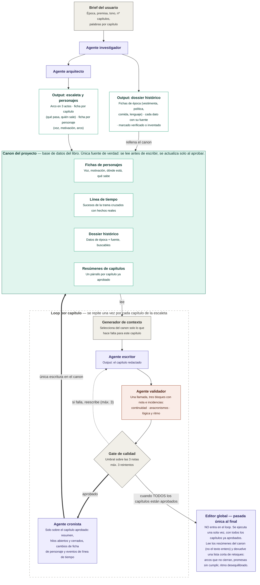

# Spec — Sistema multiagente de novelas históricas

## §1 Visión y alcance

Sistema que escribe una novela histórica capítulo a capítulo a partir de un brief corto. Un agente investiga la época, otro diseña la estructura, un escritor redacta cada capítulo, un validador lo puntúa en tres dimensiones y un cronista lo vuelca en el canon. Al terminar, un editor global propone retoques sobre el conjunto.

**Principio rector.** Lo determinista vive en código del harness: selección de contexto, cálculo del gate, control de reintentos, escritura en el canon y máquina de estados. Lo generativo vive en agentes: investigar, estructurar, redactar, revisar, resumir y editar. Ningún agente escribe en el canon; propone, y el harness decide.

**Qué produce.** Un canon consultable, un fichero por capítulo aprobado y una lista final de retoques. No maqueta el libro ni aplica esos retoques por sí mismo.

**Fuera de alcance en 0.1.0.** Interfaz gráfica, exportación a EPUB, ilustraciones, varios proyectos a la vez, traducción y reescritura automática a partir del editor global.

**Criterio de éxito.** Una novela completa sin contradicciones de canon detectables ni anacronismos groseros, con intervención humana solo en los dos puntos fijos que marca §4.

## §2 Glosario

| Término | Significado en este sistema |
|---|---|
| Brief | Entrada del usuario: época, premisa, tono, nº de capítulos y palabras por capítulo. Lo único que se escribe a mano al arrancar. |
| Canon | Base de datos del libro. Única fuente de verdad. Se lee antes de escribir y se actualiza solo al aprobar. |
| Dossier | Conjunto de datos históricos del canon, cada uno con su fuente y su estado de verificación. |
| Dato histórico | Unidad mínima del dossier: una afirmación sobre la época, con categoría, fuente y estado. |
| Escaleta | Plan de la novela: arco en tres actos y una ficha por capítulo. |
| Ficha de capítulo | Qué pasa en un capítulo y quién sale. Es el encargo que recibe el escritor. |
| Capítulo redactado | Texto que produce el escritor en un intento concreto. Puede no llegar a aprobarse. |
| Resumen | Un párrafo por capítulo aprobado, con hilos abiertos y cerrados. Es lo que lee el editor global. |
| Generador de contexto | Código que selecciona del canon lo que hace falta para un capítulo y arma el paquete de contexto. |
| Paquete de contexto | Salida del generador: el subconjunto del canon que ve el escritor. |
| Validador | Agente que puntúa el capítulo. Hay uno solo y juzga las tres dimensiones en la misma llamada. |
| Dimensión | Cada uno de los tres ejes que se juzgan por separado: continuidad, anacronismos, y lógica y ritmo. |
| Nota | Puntuación de 1 a 5 de una dimensión. Siempre hay tres notas; nota global no existe. |
| Gate | Código que decide, con las tres notas y sus incidencias, si el capítulo se aprueba o se reescribe. |
| Cronista | Agente que convierte el capítulo aprobado en resumen y en cambios de ficha. Única vía de escritura en el canon. |
| Intento | Cada pasada del escritor sobre el mismo capítulo. Máximo tres. |
| Editor global | Agente de pasada única al final, fuera del loop. Lee resúmenes, no texto. |
| Harness | Todo el código determinista que orquesta el proceso. No genera prosa. |

## §3 Modelo de datos del canon

**Decisión de almacenamiento.** El canon es una base SQLite (`canon.db`) y, al lado, un fichero Markdown por intento de capítulo en `capitulos/`; SQLite porque el dossier y la línea de tiempo se consultan con filtros y búsqueda de texto, y el texto largo no gana nada viviendo dentro de la base.

Los tipos son lógicos, no de un motor concreto, porque el stack sigue sin decidir (§15, DA-01). `lista` se serializa como JSON en una columna de texto. Todas las entidades llevan `id` de texto salvo donde el número de capítulo ya es clave.

El brief no tiene tabla propia: se guarda como fila única en `proyecto` con sus cinco campos (época, premisa, tono, nº de capítulos y palabras por capítulo) más el estado de §4.

**Personaje**

| Campo | Tipo | Obl. | Notas |
|---|---|---|---|
| id | texto | sí | Slug estable, se usa en referencias cruzadas |
| nombre | texto | sí | |
| rol | enum | sí | `protagonista` \| `secundario` \| `figurante` |
| voz | texto | sí | Cómo habla: registro, muletillas, qué nunca diría |
| motivacion | texto | sí | Qué quiere y por qué |
| arco | texto | sí | De dónde parte y adónde llega |
| ubicacion | texto | sí | Dónde está ahora mismo en la trama |
| sabe | lista | no | Qué conoce y qué ignora. Clave para la revisión de continuidad |
| actualizado_en | entero | sí | Nº del último capítulo aprobado que tocó la ficha |

**Evento de timeline**

| Campo | Tipo | Obl. | Notas |
|---|---|---|---|
| id | texto | sí | |
| tipo | enum | sí | `trama` \| `historico` |
| fecha | texto | sí | ISO parcial: `1587`, `1587-04`, `1587-04-12` |
| descripcion | texto | sí | Una frase |
| capitulo | entero | no | Solo en eventos de trama |
| personajes | lista | no | Ids de personaje implicados |
| dato_id | texto | no | Dato histórico que respalda un evento `historico` |

**Dato histórico**

| Campo | Tipo | Obl. | Notas |
|---|---|---|---|
| id | texto | sí | |
| categoria | enum | sí | `vestimenta` \| `politica` \| `comida` \| `lenguaje` \| `otro` |
| dato | texto | sí | Afirmación concreta y verificable |
| fuente | texto | sí | URL si viene de búsqueda; `modelo` si es conocimiento del agente |
| estado | enum | sí | `verificado` \| `sin_verificar` \| `inventado` |
| etiquetas | lista | sí | Términos de búsqueda para el generador de contexto |

**Ficha de capítulo**

| Campo | Tipo | Obl. | Notas |
|---|---|---|---|
| numero | entero | sí | Clave |
| titulo | texto | sí | |
| acto | entero | sí | 1, 2 o 3 |
| sinopsis | texto | sí | Qué pasa, en tres o cuatro frases |
| personajes | lista | sí | Ids de quien sale |
| objetivo | texto | sí | Qué tiene que haber cambiado al acabar el capítulo |
| palabras_objetivo | entero | sí | Heredado del brief salvo que la escaleta lo ajuste |
| estado | enum | sí | `pendiente` \| `en_curso` \| `aprobado` \| `bloqueado` |

**Capítulo redactado**

| Campo | Tipo | Obl. | Notas |
|---|---|---|---|
| capitulo | entero | sí | Referencia a la ficha |
| intento | entero | sí | 1, 2 o 3 |
| ruta | texto | sí | Ruta al `.md`, p. ej. `capitulos/012-i2.md` |
| palabras | entero | sí | |
| revisiones | lista | no | Tres bloques, uno por dimensión, con su nota y sus incidencias. Mismo formato venga de una llamada o de tres |
| faltantes | lista | no | Datos de época que el escritor echó en falta al redactar (§5) |
| estado | enum | sí | `propuesto` \| `aprobado` \| `descartado` |
| creado | fecha | sí | |

**Resumen de capítulo**

| Campo | Tipo | Obl. | Notas |
|---|---|---|---|
| capitulo | entero | sí | Clave. Solo existe si el capítulo está aprobado |
| resumen | texto | sí | Un párrafo |
| hilos_abiertos | lista | sí | Promesas que el capítulo deja pendientes |
| hilos_cerrados | lista | sí | Promesas que salda |
| personajes_presentes | lista | sí | Ids |

**Ejemplo (personaje).** Único ejemplo del documento; fija el estilo para el resto.

```json
{
  "id": "ines-de-arteaga",
  "nombre": "Inés de Arteaga",
  "rol": "protagonista",
  "voz": "Frases cortas y secas. Usa términos de navegación con naturalidad. Nunca jura en voz alta.",
  "motivacion": "Recuperar el nombre de su padre, condenado por contrabando.",
  "arco": "De obedecer las reglas del gremio a romperlas a sabiendas.",
  "ubicacion": "Sevilla, barrio de Triana",
  "sabe": ["Que el contador falsificó el registro", "Ignora que su hermano lo sabía"],
  "actualizado_en": 7
}
```

## §4 Arquitectura y flujo

El sistema tiene tres tramos: preparación (una vez), loop de capítulo (una vez por capítulo) y cierre (una vez). El canon está en medio de todos y es el único punto de contacto entre ellos: los agentes nunca se pasan datos entre sí por fuera del canon o del paquete de contexto. Dentro del loop, la única escritura en el canon ocurre después del gate, cuando el cronista convierte el capítulo aprobado en resumen y en cambios de ficha.

El diagrama nació en [`sistema-novelas-historicas-v2.drawio`](../diagrama/sistema-novelas-historicas-v2.drawio) y su versión Mermaid vive en [`sistema-novelas-historicas-v2.mermaid`](../diagrama/sistema-novelas-historicas-v2.mermaid), idéntica al bloque de abajo. El `.drawio` es ahora el que va por detrás: le falta el cronista y hay que regenerarlo a mano. Los colores separan agentes, revisores, datos y harness.



**Máquina de estados del proyecto.** Un solo campo en `proyecto`, avanza en un sentido salvo `bloqueado`.

- `borrador` — existe el brief, no hay nada más. Transición al arrancar el investigador.
- `investigado` — el dossier está en el canon. Habilita al arquitecto.
- `estructurado` — escaleta y fichas de personaje en el canon. Habilita el loop.
- `escribiendo` — hay al menos un capítulo aprobado y quedan pendientes.
- `bloqueado` — un capítulo agotó los tres intentos. Requiere mano humana (§8).
- `escrito` — todas las fichas de capítulo en `aprobado`. Habilita el editor global.
- `editado` — existe la lista de retoques. Estado final del sistema.

**Qué corre en paralelo.** Nada, con la configuración por defecto: el validador único dejó el flujo entero en serie. Solo vuelve a haber paralelismo si se pone `validador.modo` en `separado` (§12), y entonces son tres llamadas simultáneas sobre el mismo capítulo. Lo demás es secuencial por dependencia real: el arquitecto necesita el dossier cerrado, y cada capítulo necesita el canon que dejó el anterior. No se escriben dos capítulos a la vez, aunque parezca tentador: el capítulo N+1 depende de lo que el N haya dejado en las fichas de personaje.

**Dónde entra el humano.** Dos puntos fijos:

1. **Capítulo bloqueado.** Al fallar el tercer intento el sistema para y espera. Tú editas el texto a mano, relajas el umbral o retocas la ficha de capítulo, y lo desbloqueas (§8).
2. **Retoques finales.** El editor global entrega una lista y tú decides qué aplicar. Aplicarlos es manual y fuera del sistema en 0.1.0.

Queda por decidir un tercer punto: parar al acabar la preparación para que revises dossier y escaleta antes de arrancar el loop. Es la parada más barata del sistema y un fallo ahí contamina el libro entero, pero obliga a partir la ejecución en dos arranques. Sin cerrar, en §15 (DA-03). Mientras no se decida, la preparación no para y la escaleta se corrige editando el canon a mano.

## §5 Agentes

Seis agentes. Ninguno escribe en el canon: todos devuelven una propuesta estructurada que valida y persiste el harness. Actualizar el canon tras aprobar es trabajo de un agente propio, el cronista, y no del escritor, porque así corre una sola vez sobre el texto que se queda en lugar de tres veces sobre borradores que se descartan. El modelo sugerido es una primera apuesta de la familia Claude, revisable sin tocar el diseño (§15, DA-02).

| Agente | Entrada | Salida | Modelo sugerido |
|---|---|---|---|
| Investigador | Brief | Lista de datos históricos | Opus 5 + herramienta de búsqueda |
| Arquitecto | Brief + dossier | Escaleta y fichas de personaje | Opus 5 |
| Escritor | Paquete de contexto (§7) | Capítulo en Markdown + lista de faltantes | Opus 5 |
| Validador | Capítulo + canon relevante, dossier y encargo | Tres bloques, cada uno con nota 1-5 e incidencias | Sonnet 5 |
| Cronista | Capítulo aprobado + fichas de quien sale | Resumen, hilos, cambios de personaje y eventos | Sonnet 5 |
| Editor global | Resúmenes + escaleta + personajes | Lista de retoques | Opus 5 |

**Investigador.** Le pido fichas de época sobre vestimenta, política, comida y lenguaje para el lugar y las fechas del brief. Trabaja de memoria por defecto y busca en la web solo los datos que él mismo marca como dudosos. Cada dato sale con su categoría y su estado: `verificado` si hay fuente que lo respalde, `sin_verificar` si solo lo recuerda, `inventado` si lo rellena él para tapar un hueco. Modos de fallo: inventar fuentes con aspecto creíble, marcar `verificado` lo que solo recuerda, y desbordarse en cantidad de datos genéricos que luego nadie usa.

**Arquitecto.** Le pido el arco en tres actos, una ficha por capítulo y una ficha por personaje, coherentes con el dossier ya cerrado. Reparte los hilos para que cada capítulo cierre algo y abra algo. Modos de fallo: escaletas planas donde el acto central no tiene giro, personajes con motivación decorativa que no mueve la trama, y capítulos que prometen más de lo que caben en las palabras objetivo.

**Escritor.** Le paso el paquete de contexto y le pido el capítulo entero, en prosa, respetando la voz de cada personaje y sin introducir hechos que no estén en el canon. Si necesita un detalle de época que no le he dado, resuelve la escena sin él y lo anota en `faltantes`, lista que viaja con el capítulo y que el harness guarda: no hay canal de vuelta síncrono ni el escritor espera respuesta de nadie. Modos de fallo: resumir en lugar de dramatizar cuando se acerca al límite de palabras, homogeneizar las voces hacia un registro neutro, y colar objetos o ideas fuera de época por inercia narrativa.

**Validador.** Una sola llamada que juzga tres dimensiones: continuidad contra el canon, anacronismos contra el dossier, y lógica y ritmo contra el encargo del capítulo. Su salida son tres bloques independientes, cada uno con su nota de 1 a 5 y sus incidencias, cada uno evaluado con su propia rúbrica (§8). No devuelve nota global y el gate sigue recibiendo tres números. El prompt le obliga a resolver las dimensiones en orden y a no releer lo ya juzgado, para que no arrastre una impresión general.

*Riesgo conocido de fundirlas.* Al juzgar en una sola pasada, las notas tienden a correlacionarse: el capítulo que gusta se lleva tres cincos y el que chirría tres doses, cuando la gracia del diseño es que un texto brillante pueda caer por continuidad. El segundo efecto es que el anacronismo conceptual, el caro, se diluye cuando la misma pasada ya va buscando contradicciones de canon: el léxico raro salta, la idea fuera de época no. Ambos se vigilan comparando la dispersión de las tres notas a lo largo del libro; si se confirman, `validador.modo: "separado"` (§12) devuelve las tres llamadas sin tocar el modelo de datos ni el gate. Otros modos de fallo: falsos positivos de léxico moderno pero válido, y confundir una elipsis con un hueco de continuidad.

**Cronista.** Corre una sola vez por capítulo, después del gate y solo sobre el intento aprobado. Le paso el texto, la ficha de capítulo y las fichas de quien sale, y le pido cuatro cosas: el resumen de un párrafo, los hilos que abre y los que cierra, los cambios de `ubicacion` y `sabe` de cada personaje presente, y los eventos de trama nuevos para la línea de tiempo. Devuelve una propuesta que el harness valida antes de escribirla en el canon. Modos de fallo: resúmenes que cuentan lo que pasa pero no lo que cambia, dar por sabido a un personaje algo que ocurrió sin él delante, y callarse hilos abiertos, que es el fallo caro porque el editor global solo ve lo que el cronista escribió.

**Editor global.** Le paso los resúmenes de todos los capítulos, la escaleta y las fichas de personaje, nunca el texto completo. Le pido una lista corta y accionable: arcos que no cierran, promesas abiertas sin saldar, actos desequilibrados. Modos de fallo: generalidades no accionables del tipo «reforzar el tema», y proponer reescrituras masivas cuando el encargo es una lista de retoques.

## §7 Generador de contexto

Código, no agente: mismo capítulo y mismo canon dan siempre el mismo paquete. Recibe un número de capítulo y devuelve el paquete de contexto que verá el escritor, que nunca consulta el canon por su cuenta.

| Bloque | Qué entra | Criterio de selección |
|---|---|---|
| Encargo | Ficha del capítulo entera | Siempre |
| Personajes | Fichas completas de quien sale | `personajes` de la ficha |
| Reparto de fondo | Nombre y una línea de quien no sale pero se menciona | Aparece en la sinopsis |
| Memoria reciente | Resúmenes de los tres capítulos anteriores | Ventana fija |
| Memoria larga | Resúmenes del resto, recortados a una frase | Solo capítulos aprobados |
| Hilos vivos | Hilos abiertos y aún no cerrados | Diferencia entre abiertos y cerrados |
| Época | Datos históricos que casan con las etiquetas de la ficha | Coincidencia de etiquetas, `verificado` primero |
| Cronología | Eventos de línea de tiempo en la ventana de fechas del capítulo | Rango de fechas |
| Enganche | Últimas 400 palabras del capítulo anterior aprobado | Literal, para continuidad de tono |

Dos reglas que no se negocian. El texto completo de capítulos anteriores no entra nunca, salvo el enganche: para eso están los resúmenes. Y en el paquete viaja el estado de cada dato histórico, porque el escritor necesita saber qué es firme y qué es relleno.

El paquete tiene un tope de tokens configurable (§12). Si se pasa, se recorta en este orden: memoria larga, cronología, reparto de fondo, época. El encargo, los personajes y los hilos vivos no se recortan; si aun así no cabe, el capítulo se marca `bloqueado` en lugar de escribirse con el contexto mutilado.

## §8 Loop de capítulo y gate

Un capítulo se da por bueno cuando pasa el gate, no cuando el escritor termina. Todo lo de esta sección es código salvo las cuatro llamadas a agentes.

```
para cada capitulo de la escaleta con estado != aprobado:
    marcar capitulo en_curso
    paquete = generar_contexto(capitulo)                      # §7
    incidencias = []
    texto_previo = null

    para intento en 1..3:
        texto = escritor(paquete, texto_previo, incidencias)
        guardar_intento(capitulo, intento, texto)             # estado propuesto

        rev = validar(texto, paquete)          # 1 llamada; 3 en paralelo si modo separado
        si no comprobaciones_ok(rev): reintentar la llamada     # §9, sin gastar gate
        guardar_revisiones(capitulo, intento, rev)              # siempre 3 bloques

        si gate(rev):
            marcar intento aprobado y descartar los demas
            cambios = cronista(texto, ficha, personajes)       # §5
            validar_y_escribir(cambios)                        # unica escritura en canon
            marcar capitulo aprobado
            salir del bucle de intentos

        incidencias = rev.incidencias
        texto_previo = texto si intento < 2 sino null          # el 3.º va de cero

    si capitulo != aprobado:
        marcar capitulo bloqueado y proyecto bloqueado
        parar y esperar mano humana                            # §13

si todos los capitulos aprobados:
    retoques = editor_global(resumenes, escaleta, personajes)  # §11
```

**Rúbrica.** Una por dimensión, escala 1 a 5 entera, con anclas para que la nota no derive entre capítulos. El validador aplica las tres por separado (§5) y el gate no sabe si vinieron de una llamada o de tres.

| Dimensión | Qué puntúa | Nota 1 | Nota 3 | Nota 5 |
|---|---|---|---|---|
| Continuidad | Coherencia con el canon: dónde está cada uno, qué sabe, cuándo pasa | Contradice un hecho del canon | Detalle menor sin respaldo | Todo cuadra y usa el canon con precisión |
| Anacronismos | Objetos, costumbres, instituciones y léxico frente al dossier | Rompe un dato `verificado` | Choca con un `sin_verificar` | Época sostenida sin adorno de folleto |
| Lógica y ritmo | Causa y efecto, cumplimiento del objetivo del capítulo, tensión | La escena no lleva a ninguna parte | Avanza pero se atasca o se salta un paso | Cada escena empuja la siguiente |

Cada incidencia lleva cita textual, severidad (`grave` o `aviso`) y una sugerencia de una línea. Grave es contradecir el canon o un dato `verificado`; el resto es aviso.

**Fórmula del gate.** `aprueba = min(notas) >= 3 y media(notas) >= 3,7 y ninguna incidencia grave`. La incidencia grave veta por sí sola: un capítulo puede sacar tres cuatros y caer por una contradicción de canon, porque eso no se arregla puntuando más alto. Los tres números son configurables (§12) y están sin calibrar hasta que haya capítulos reales (§11, DA-06).

**Qué recibe el escritor al reintentar.** El mismo paquete de contexto, las incidencias del intento anterior ordenadas por severidad y, solo en el intento 2, su propio texto: ahí se le pide arreglo quirúrgico, tocar lo señalado y no reescribir lo que ya funciona. El intento 3 va desde cero con las incidencias acumuladas de los dos anteriores, porque si dos pasadas quirúrgicas no han bastado el problema no está en las frases sino en el planteamiento de la escena.

**Al agotar los tres intentos.** El capítulo queda `bloqueado`, el proyecto también, y el sistema para en vez de seguir con el siguiente: escribir sobre un canon con un agujero solo propaga el problema. Se conserva el intento con mejor media, en estado `propuesto`, y sus revisiones. Tienes tres salidas, todas manuales: editar el texto a mano y aprobarlo, retocar la ficha de capítulo y relanzar con el contador a cero, o bajar el umbral solo para ese capítulo dejando constancia.

## §11 Editor global

Corre una sola vez, cuando el proyecto entra en `escrito`, y fuera del loop. Lee los resúmenes de todos los capítulos, los hilos que siguen abiertos al final, la escaleta y las fichas de personaje. No lee el texto: si algo no se ve en los resúmenes, es que el cronista no lo registró, y ese es un fallo que se arregla en §5, no leyendo 200.000 palabras.

Devuelve una lista corta de retoques. Cada retoque tiene id, tipo (`arco`, `promesa`, `ritmo` o `personaje`), capítulos afectados, una descripción accionable de una o dos frases y una severidad. Se le pide brevedad y concreción: diez retoques que se puedan ejecutar valen más que cuarenta observaciones.

La lista se guarda como `retoques.md` junto al canon, no dentro. El canon es la verdad de la novela escrita y esto es una lista de tareas para mí; mezclarlas haría que el canon dejara de ser lo que dice §2.

El editor no aplica nada ni dispara reescrituras. En 0.1.0 el bucle se cierra a mano: yo decido qué retoques valen y los aplico editando capítulos. Automatizar esa vuelta es lo primero que queda fuera de alcance (§1) y está apuntado en §15 (DA-07).

## §13 Operación: fallos y reanudación

**Qué pasa cuando algo falla a mitad.** El estado vive en el canon, nunca en memoria del proceso, así que un corte de red, un error del proveedor o un Ctrl+C no pierden más que el intento en curso. Como el canon solo se toca después del gate y en una única escritura validada del cronista, no existe el estado a medias: o el capítulo entró entero o no entró. Lo peor que deja una caída es un Markdown huérfano en `capitulos/` con su fila en estado `propuesto`, que al relanzar se descarta. Ante un error del proveedor se reintenta la llamada una vez; si vuelve a fallar, el proceso para y deja el estado escrito en lugar de insistir. No hay política de backoff ni de reintentos finos en 0.1.0, y es deliberado: con un solo usuario, parar y mirar sale más barato que automatizar la recuperación.

**Reanudación.** Un único comando reanudar, sin argumentos: lee el estado del proyecto, localiza el primer capítulo no aprobado y sigue desde ahí. Relanzar con el proyecto ya `escrito` no reescribe nada, solo vuelve a ofrecer el editor global. El par capítulo e intento identifica cada fichero, así que repetir un intento sobrescribe en lugar de duplicar.

**Configuración.** Un solo fichero junto al canon, con todo lo que se toca sin tocar código.

| Parámetro | Por defecto | Para qué |
|---|---|---|
| `nota_minima` | 3 | Suelo por revisor en el gate |
| `media_minima` | 3,7 | Media exigida a las tres notas |
| `max_intentos` | 3 | Reintentos del escritor antes de bloquear |
| `tope_contexto` | por definir con el stack | Tope de tokens del paquete de contexto |
| `ventana_resumenes` | 3 | Capítulos anteriores que van con resumen completo |
| `palabras_enganche` | 400 | Cola literal del capítulo anterior |
| `modelo_por_rol` | ver §5 | Modelo de cada agente |
| `busqueda_web` | activada | Permite al investigador verificar datos dudosos |

## §14 Roadmap por fases

Cada fase deja algo que funciona de punta a punta. El criterio de salida es lo que tiene que pasar para empezar la siguiente, no una fecha.

| Fase | Qué entra | Criterio de salida |
|---|---|---|
| F0 Esqueleto | Canon vacío, brief y comandos de lectura y escritura | Meto un personaje y un capítulo a mano y los leo desde el canon |
| F1 Preparación | Investigador sin búsqueda y arquitecto | Un brief produce dossier y escaleta completos y coherentes entre sí |
| F2 Un capítulo | Generador de contexto, escritor y cronista, sin revisión | El capítulo 1 se escribe y actualiza el canon sin que yo toque nada |
| F3 Calidad | Los tres revisores en paralelo y el gate con reintentos | Un capítulo malo a propósito se rechaza y el reintento lo arregla |
| F4 Novela entera | Loop sobre toda la escaleta, bloqueo y reanudación | Una novela corta completa, con al menos un bloqueo resuelto a mano |
| F5 Cierre | Editor global y `retoques.md` | La lista de retoques es accionable sin releer los capítulos |
| F6 Rigor | Búsqueda web del investigador y estados de verificación reales | La mayoría de datos del dossier llevan fuente comprobable |

## §15 Decisiones abiertas

Lo que no está decidido. Nada de aquí bloquea empezar; todo bloquea terminar la fase que se indica.

| Id | Decisión pendiente | Por qué importa | Cuándo decidirla |
|---|---|---|---|
| DA-01 | Lenguaje y stack del harness | Fija cómo se consulta el canon y cómo se lanzan los tres revisores en paralelo | Antes de F0 |
| DA-02 | Modelo definitivo de cada agente | Los revisores son la mayoría de llamadas; el reparto decide el coste del libro | Antes de F3 |
| DA-03 | Parada humana al acabar la preparación | Es la revisión más barata y un fallo de escaleta contamina el libro entero | Antes de F4 |
| DA-04 | Proveedor de búsqueda del investigador | Define qué significa exactamente `verificado` en el dossier | Antes de F6 |
| DA-05 | Qué hacer con los `faltantes` del escritor | Hoy se registran y nadie los mira; podrían disparar una consulta al investigador | Antes de F4 |
| DA-06 | Calibración de `nota_minima` y `media_minima` | Puestos a ojo: altos bloquean todo, bajos no filtran nada | Durante F3, con capítulos reales |
| DA-07 | Vuelta del editor global | Si los retoques se aplican siempre a mano o disparan reescritura de capítulos | Después de F5 |
| DA-08 | Quién valida lo que propone el cronista | El harness valida forma, no fondo; un resumen que miente envenena el canon entero | Antes de F4 |
| DA-09 | Unidad de escritura: capítulo entero o escena a escena | Si la prosa se degrada en capítulos largos, el loop cambia de grano | Durante F2 |
| DA-10 | Qué hacer si la escaleta se queda corta o larga a mitad de libro | Replanificar toca el canon en caliente; forzarla estropea el final | Durante F4 |

## §16 Historial de cambios

Formato Keep a Changelog. Una entrada por versión; cada línea dice la sección tocada y el motivo del cambio.

### [0.1.0] — 2026-09-15

**Añadido**
- §1 a §17. Primera redacción del documento, escrita por secciones y en dos fases.
- §5. Agente cronista, tras detectar que ningún agente producía los resúmenes ni los cambios de ficha que el canon necesita al aprobar un capítulo.
- §5. Campo `faltantes` en la salida del escritor, porque se le pedía preguntar por datos de época sin que existiera canal de vuelta en el flujo.

**Cambiado**
- §4. La parada humana tras la preparación pasa de descartada a decisión abierta (DA-03): es la revisión más barata del sistema.
- §2, §3. El brief queda fijado en cinco campos, incluidas las palabras por capítulo, que antes solo aparecían en §3.
- §3, §5. Los tres estados del dato histórico se usan igual en todo el documento; antes §5 solo contemplaba dos.
- §3. El campo `notas` de capítulo redactado pasa a `revisiones`, porque guardaba notas e incidencias y chocaba con la definición de Nota de §2.
- §4. El diagrama incorpora al cronista y el brief completo. La versión `.drawio` queda pendiente de regenerar a mano.

**Contexto**
- Sustituye a un borrador anterior de 4.212 líneas, descartado por inabarcable y conservado en el tag `spec-v0-detallado`.

**Regla permanente.** Todo cambio futuro sube la versión de la cabecera y añade aquí su entrada, indicando sección tocada y motivo. Los números de sección son estables y no se reutilizan: si una sección desaparece, su número queda muerto.

## §17 Log de commits del spec

Registro literal de los commits que han tocado `docs/spec/`, desde el reset que abrió esta versión del documento. §16 dice por qué cambió algo; esta tabla dice cuándo y en qué commit. Los 23 commits anteriores pertenecen al borrador descartado y viven en el tag `spec-v0-detallado`.

| Commit | Fecha | Mensaje |
|---|---|---|
| `9c8500a` | 2026-09-15 | docs(spec): §1 visión y alcance |
| `7ab736d` | 2026-09-15 | docs(spec): §2 glosario |
| `8d8b1a3` | 2026-09-15 | docs(spec): §3 modelo de datos del canon |
| `9e1a339` | 2026-09-15 | docs(spec): §4 arquitectura y flujo |
| `858c9cf` | 2026-09-15 | docs(spec): §5 agentes |
| `3c26465` | 2026-09-15 | docs(spec): correcciones §1-§5 (agente cronista, faltantes del escritor, DA-03, unificación brief/estados/notas) |
| `921d596` | 2026-09-15 | docs(spec): §6 generador de contexto |
| `e4e80f0` | 2026-09-15 | docs(spec): §7 loop de capítulo y gate |
| `f855fad` | 2026-09-15 | docs(spec): §8-§10 editor global, operación y roadmap |
| `5f9fb47` | 2026-09-15 | docs(spec): §11 decisiones abiertas |
| `2793bf7` | 2026-09-15 | docs(spec): §12 historial de cambios |
| `1aac96a` | 2026-09-15 | docs(spec): §13 log de commits del spec |

La tabla es una foto del momento de cerrar la versión y no incluye el commit que la añade. Se regenera con:

```
git log --reverse --pretty='| `%h` | %ad | %s |' --date=short -- docs/spec/
```
