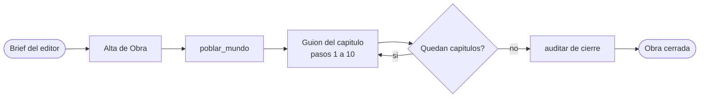

# SPEC1 · Backend v1 — Especificación de requisitos de software

## §1 Introducción

### 1.1 Propósito

Fijar qué tiene que hacer la primera versión del `backend/` para que una obra
completa se produzca de principio a fin. Es un documento de requisitos, no de
implementación: recoge lo que, si se decide mal, obliga a rehacer trabajo. Todo
lo que se puede resolver razonablemente al programar no está aquí.

### 1.2 Alcance del sistema especificado

Dentro: el almacén de artefactos con sus índices de recuperación por parecido,
la pieza que camina el guion del capítulo, las doce carpetas de tarea con su
contrato y su prompt, el presupuesto de contexto, la recogida de fuentes fuera
del sistema, el destinatario real al que la obra va dedicada con los hechos que
vienen de su vida, la entrevista que completa el brief antes del alta, y la API
HTTP que el editor usa para lanzar e inspeccionar una obra.

Fuera: la interfaz web, la calibración de los topes contra trazas reales y todo
lo enumerado en §11.

La medida de «terminado» de v1 es una sola: **una obra corre de la primera orden
al último capítulo cerrado sin que nadie toque nada por dentro**.

### 1.3 Documentos base y jerarquía

| Documento | Qué aporta a este SRS | Manda sobre |
| --- | --- | --- |
| `AGENTS.md` | Reparto del repositorio, pila fijada, invariantes | Frontera y pila |
| `docs/definitions.md` | Entidades del dominio y vocabularios de forma y mundo | Nombres y valores cerrados |
| `docs/architecture.md` | Capas, censo de doce agentes, entidades de producción, memorias, guion, bucle de calidad, organización del código | Comportamiento del sistema |
| `docs/validators.md` | Método, agente, proyección y severidad de cada dimensión | Verificación |

Si este documento contradice a alguno de los cuatro, gana el documento base y
esto es un error de este SRS. La única excepción declarada es D-02 (§8): el
almacén es SQLite y nada más, decisión ya tomada que cierra una de las abiertas
de `architecture.md` §8. Mientras este ciclo siga abierto, el árbol de carpetas
de `architecture.md` §7 y esa decisión de §8 van por detrás de aquí, y ponerlos
al día es trabajo de la fase 3.

### 1.4 Convenciones

- Entidades en `PascalCase` singular; relaciones en `snake_case`.
- Identificadores de requisito estables y no reutilizables: `RF-` funcional,
  `RD-` de datos, `RI-` de interfaz, `RNF-` no funcional, `D-` decisión de esta
  versión, `OBJ-` objetivo.
- La columna «Verificación» usa el vocabulario `metodo_de_verificacion` de
  `validators.md` §2: `prueba`, `analisis`, `inspeccion`, `demostracion`,
  `inverificable`.

## §2 Descripción general

### 2.1 Qué hace el backend y qué no

El backend es el único que abre el almacén y el único que ejecuta tareas. **Hace
tres cosas**: guarda y sirve artefactos, camina el guion encargando tareas a los
agentes dentro de su presupuesto, y expone por HTTP lo que el editor necesita
ver.

**No hace una cuarta**: no decide nada del dominio. No pliega el log, no resume,
no juzga texto y no reescribe prosa. Eso lo hacen los doce roles del censo. Si
el código del servidor empieza a interpretar el contenido de un artefacto, está
reapareciendo el harness a medida que el proyecto prohíbe.

### 2.2 Actores

| Actor | Qué aporta | Qué recibe |
| --- | --- | --- |
| Editor (persona) | Un brief —escrito de una vez o completado en la entrevista (§4.8)— y, como mucho, una orden de detener o reanudar | Manuscrito, críticas, trazas y progreso |
| Destinatario (persona real) | Nada directamente: su vida entra por el brief que escribe el editor, o por lo que pega en la entrevista | La obra, dedicada a él |
| Agente (uno de los doce roles) | El artefacto que escribe, o la propuesta de brief en el caso del Entrevistador | Su proyección mínima y su contrato |
| `frontend/` | Órdenes del editor | Solo respuestas de la API; nunca ficheros |

### 2.3 Restricciones heredadas

Invariantes de `AGENTS.md`, no negociables en esta versión: tres capas
disjuntas; un rol, una tarea; ningún agente valida su propia salida; el mundo
solo cambia por `EventoEstado` emitidos por el Contable al cerrar capítulo; el
estado se deriva plegando el log; solo el Documentalista escribe `Fuente`; toda
`Crítica` lleva evidencia citable; sin harness a medida; y el techo de 100 000
tokens de contexto de entrada concurrente.

Pila fijada: Python con FastAPI, y SQLite con extensión vectorial compatible
detrás de la frontera.

### 2.4 Supuestos y dependencias

- Las doce tareas las ejecutan subagentes de Claude Code con modelo Haiku
  (D-08). El backend no habla con ninguna API de modelo: delega.
- El contexto de entrada se estima antes de enviar y se mide exacto después,
  con lo que el subagente informa al terminar (D-10). La cuenta exacta queda en
  la `Traza` y es la que gobierna OBJ-01.
- **Un subagente de Claude Code no arranca vacío.** Antes de que entre nada del
  sistema, arrastra su propio contexto —su instrucción base y las definiciones
  de las herramientas que tenga concedidas—, y eso son tokens de entrada como
  cualquier otro: cuentan contra el techo. Medido en la máquina de desarrollo,
  con todas las herramientas retiradas y con la instrucción del rol en lugar de
  la de serie, son unos 10 000 tokens por tarea abierta. De ahí el término que
  RF-13 añade a la anchura de tanda: sin él el techo se respeta sobre el papel
  y se rompe en la máquina.
- El brief lo escribe una persona y puede venir incompleto: eso es un caso
  normal, no un error del sistema. `POST /obras` lo rechaza nombrando el campo
  (RF-01), y la entrevista lo completa (§4.8).

## §3 Objetivos medibles

Ningún objetivo tiene línea base: no hay código, así que la base se declara
**pendiente de medir** en lugar de inventarla. La primera pasada completa de una
obra de prueba es la que la fija, y hasta entonces las metas son de diseño.

Van en este orden porque el primero es el que hace que los demás signifiquen
algo: un sistema que no cabe en el techo no llega a producir número alguno.

| ID | Objetivo | Métrica | Cómo se mide | Línea base | Meta |
| --- | --- | --- | --- | --- | --- |
| OBJ-01 | Caber en el techo | Pico de tokens de entrada concurrentes en una obra | Máximo de la suma de las ventanas abiertas a la vez, de la `Traza`. Lo que devuelven los agentes no entra en la cuenta | Pendiente | ≤ 100 000, con pico habitual ≤ 80 000 |
| OBJ-02 | Coste plano por capítulo | Tokens totales del capítulo N | Suma de contexto y salida por capítulo, de la `Traza` | Pendiente | Capítulo 40 ≤ 1,2 × capítulo 4 |
| OBJ-03 | Que el bucle converja | Vueltas hasta `Aceptado` por escena | Recuento de intentos en la `Traza` | Pendiente | ≥ 90 % de escenas en ≤ 2 vueltas; < 10 % de capítulos cerrados marcados |
| OBJ-04 | Críticas utilizables | Proporción descartada por falta de `evidencia` | Recuento de rechazos sobre críticas emitidas | Pendiente | < 10 % |
| OBJ-05 | Artefactos bien formados | Rechazos por campo ausente o valor fuera de vocabulario, por capítulo | Recuento de `Crítica` bloqueante con objeto artefacto | Pendiente | ≤ 1 por capítulo |
| OBJ-06 | Cobertura documental | Afirmaciones históricas con `Fuente` asociada | Cociente sobre las afirmaciones del capítulo | Pendiente | ≥ 90 % |
| OBJ-07 | Cero intervención | Órdenes humanas necesarias entre el brief y la obra cerrada | Recuento de llamadas de escritura a la API por obra | Pendiente | Exactamente 1 |
| OBJ-08 | Recuperación útil | Proporción de fragmentos recuperados que el agente acaba citando o usando | Cociente sobre lo devuelto en cada consulta, de la `Traza` | Pendiente | ≥ 40 % |

**Qué no es objetivo, y por qué.** Bajar el coste por sí solo: se cumple
trivialmente con un modelo peor y arruina OBJ-03 y OBJ-06 sin que la cifra de
coste se entere. Bajar el número de críticas: se cumple con verificadores
ciegos, que es el fallo que `validators.md` §6 llama «el agente que no encuentra
nada nunca». Subir el número de fragmentos que devuelve
una consulta: mejora la sensación de cobertura, se come el tope de ventana del
rol que consulta y empeora OBJ-01 sin que OBJ-06 se mueva. Y la nota de un juez
de rúbrica, que es ruido declarado y no mejora medible.

## §4 Requisitos funcionales

### 4.1 Alta y arranque de una obra



| ID | Requisito | Verificación |
| --- | --- | --- |
| RF-01 | Acepta un brief y da de alta una `Obra` con título, época, ámbito, premisa, tesis temática, elenco declarado, políticas globales y, si lo trae, el destinatario (RF-06). Si falta un campo obligatorio, lo rechaza nombrando el campo con su ruta completa, sin crear nada | `prueba` |
| RF-02 | El alta arranca la producción completa: `poblar_mundo` y después el guion de cada capítulo hasta cerrar la obra. **No hay ninguna otra orden que el editor deba dar** | `demostracion` |
| RF-03 | Cada obra nace en su propio espacio de artefactos, identificado por `id_obra`. No existe un espacio de trabajo compartido que haya que archivar ni vaciar entre obras | `analisis` |
| RF-04 | La producción se puede detener y reanudar por orden explícita. Reanudar retoma el paso siguiente al último cerrado y no repite trabajo ya aceptado | `prueba` |
| RF-05 | Una tarea fallida se reintenta hasta el tope declarado. Agotado, la obra queda detenida con la tarea, el intento y el motivo registrados, y ningún artefacto a medio escribir | `prueba` |
| RF-06 | El brief puede llevar un **destinatario**: nombre, edad, rasgos, recuerdos, tono pedido, dedicatoria y las palabras o temas vetados. Es opcional —una obra histórica sin destinatario sigue siendo válida—. Si viene, el nombre, la edad, el tono y la dedicatoria son obligatorios y el rechazo nombra el campo que falta con su ruta, `destinatario.nombre`; las tres listas pueden venir vacías, porque vacío es una respuesta | `prueba` |
| RF-07 | Cada recuerdo aportado se guarda como `Recuerdo`, entidad de la capa Mundo, inmutable y sin `Fuente`. **Ningún rol del censo lo escribe**: nace con el alta de la obra, igual que la propia `Obra` (D-13) | `prueba` |
| RF-08 | Todo elemento del mundo que salga de la vida del destinatario se marca `licencia = "personal"` y apunta al `Recuerdo` del que sale. Un elemento `personal` **queda exento de las cuatro dimensiones de anacronismo**: se escribe tal cual, con su nombre de hoy, y no genera `Crítica` (D-12) | `prueba` |
| RF-09 | El Planificador decide qué papel tiene el destinatario en la obra —`protagonista`, `secundario`, `testigo` o `narrador`— y lo deja escrito en el `Plan`. Ni el editor lo elige ni el validador lo supone: lo lee de ahí (D-14) | `prueba` |

### 4.2 Ejecución del guion

| ID | Requisito | Verificación |
| --- | --- | --- |
| RF-10 | El guion del capítulo —paso, rol, proyección, tope de ventana y concurrencia— es un artefacto declarativo, no código. La pieza que lo camina lee cuál es el paso siguiente y lo ejecuta | `inspeccion` |
| RF-11 | Cada paso encarga una tarea a un rol con la proyección mínima de ese rol (`architecture.md` §3) y nada más. Lo que sobra en la proyección produce falsos positivos y es un defecto | `inspeccion` |
| RF-12 | Ningún rol invoca a otro ni recibe objetos en memoria: el testigo se pasa siempre por artefacto escrito en el almacén | `analisis` |
| RF-13 | La anchura de una tanda se calcula: `80 000 ÷ (tope del rol más caro de la tanda + coste fijo del subagente)`, redondeado a la baja. Si hay más tareas, se hacen tandas sucesivas y se espera a que cierre una antes de abrir la siguiente | `analisis` |
| RF-14 | Antes de enviar, cuenta los tokens de la ventana. Si no cabe en el tope del rol, **parte la unidad** (capítulo → escena → párrafo) y nunca recorta la proyección | `prueba` |
| RF-15 | Las únicas bifurcaciones son el enrutado por severidad y el tope de vueltas. Ningún agente enruta ni manda sobre otro | `inspeccion` |
| RF-16 | El destinatario y sus recuerdos entran en la ventana del Constructor de mundo y del Planificador, y en ninguna otra ventana de la obra, declarados como material propio y no colados dentro del cuerpo de la `Obra`. Lo que los demás roles necesitan de él ya está en las fichas del mundo que el Constructor escribió | `inspeccion` |

### 4.3 Almacén y forma de los artefactos

| ID | Requisito | Verificación |
| --- | --- | --- |
| RF-20 | `almacen/` es la única puerta de lectura y escritura. Ni `tareas/` ni `api/` hablan con la base de datos | `inspeccion` |
| RF-21 | Todo artefacto se guarda con `id` opaco, `tipo`, `procedencia` (rol, tarea e intento que lo produjeron) y sello temporal | `analisis` |
| RF-22 | El cuerpo del artefacto se guarda íntegro tal como lo escribió el agente. El backend no lo reinterpreta: solo extrae las columnas por las que hace falta consultar | `inspeccion` |
| RF-23 | Un artefacto con un campo obligatorio ausente o con un valor fuera de vocabulario controlado se rechaza, y el rechazo es una `Crítica` de severidad `bloqueante` cuyo objeto es el artefacto, no el texto | `prueba` |
| RF-24 | `EventoEstado`, `Fuente`, `Resumen de capítulo`, `Decisión` y todo borrador ya aceptado son inmutables. Cambiar algo es escribir una versión nueva | `prueba` |
| RF-25 | El estado en N se deriva plegando: el Contable recibe el estado en N-1 materializado y los eventos de N. El log no se lee nunca entero. Regenerar el capítulo 12 descarta los estados materializados de 12 en adelante y repliega hacia delante | `analisis` |
| RF-26 | Retirar la memoria de capítulo la ejecuta el Archivero como paso del guion: el almacén marca esos artefactos como caducados y deja de servirlos a cualquier proyección | `prueba` |

### 4.4 Control de calidad

| ID | Requisito | Verificación |
| --- | --- | --- |
| RF-30 | Tres cribas por borrador —bloqueantes, mayores y pulido—, no una. Cada dimensión entra en la vuelta que le fija su severidad de partida | `inspeccion` |
| RF-31 | Una `Crítica` sin `evidencia` citable se descarta antes de llegar al Revisor, y el descarte se cuenta (OBJ-04) | `prueba` |
| RF-32 | Enrutado por severidad: `bloqueante` regenera la escena, `mayor` entra en revisión dirigida, `menor` y `sugerencia` esperan a la criba de pulido | `prueba` |
| RF-33 | Tope de vueltas: dos revisiones dirigidas por borrador y dos regeneraciones por escena. Agotado, la escena se acepta con sus críticas abiertas anotadas y el capítulo se cierra marcado | `prueba` |
| RF-34 | Si dos agentes discrepan sobre el mismo predicado, se repite con la proyección reducida al mínimo; si persiste, la crítica baja a `sugerencia` y se registra como caso ambiguo | `prueba` |
| RF-35 | Los permisos de lectura y escritura por rol los impone el backend, no el prompt: ningún rol puede escribir una entidad que la tabla de gobierno (`architecture.md` §6) no le asigna | `prueba` |

### 4.5 Cierre de capítulo y de obra

| ID | Requisito | Verificación |
| --- | --- | --- |
| RF-40 | El paso de `Aceptado` a `Cerrado` emite los `EventoEstado` del capítulo, solo por el Contable, con fecha y lugar resultantes ya calculados y escritos. Hasta que el capítulo no cierra, sus eventos no existen para nadie | `analisis` |
| RF-41 | Cerrado el capítulo, el Archivero escribe el `Resumen de capítulo` y actualiza la cola de compromisos y el registro acumulado de estilo | `analisis` |
| RF-42 | `auditar` entra cada N capítulos y al cierre de la obra, siempre en solitario. N es configuración | `analisis` |
| RF-43 | Al cierre, ningún compromiso queda `abierto`: es `bloqueante`. Los retoques finales los aplica el Revisor o el Editor de estilo como paso del guion. **El editor humano no ejecuta pasos: lee el resultado** | `demostracion` |

### 4.6 Consulta por el editor

| ID | Requisito | Verificación |
| --- | --- | --- |
| RF-50 | Sirve el manuscrito con solo el texto aceptado, en orden, y marca los capítulos cerrados con críticas abiertas | `inspeccion` |
| RF-51 | Sirve las críticas filtrables por estado, dimensión, severidad y capítulo, con su evidencia y quién las detectó | `analisis` |
| RF-52 | Sirve una `Traza` por tarea con contexto enviado, salida, coste, latencia e intento. Se registra en toda tarea, la ejecute quien la ejecute | `analisis` |
| RF-53 | Sirve el progreso de una ejecución en curso: capítulo, paso, rol, tareas abiertas y tokens de entrada concurrentes | `demostracion` |
| RF-54 | Sirve el estado plegado hasta el capítulo N y el log de eventos, para poder auditar por qué una escena se rechazó | `analisis` |
| RF-55 | Sirve una búsqueda por parecido sobre el manuscrito ya aceptado de una obra, para localizar un pasaje sin recordar sus palabras exactas | `demostracion` |

### 4.7 Recuperación por parecido y fuentes de fuera

| ID | Requisito | Verificación |
| --- | --- | --- |
| RF-60 | El Documentalista busca fuentes fuera del sistema con el marco de la escena —fecha, lugar y ámbito—. Es el único rol con acceso al exterior: ningún otro busca ni lee nada que no esté ya en el almacén | `inspeccion` |
| RF-69 | Cuando para un marco de escena no encuentra nada utilizable, el Documentalista deja constancia de la búsqueda infructuosa y la producción continúa. **Una escena sin respaldo no bloquea nunca**: baja OBJ-06 y el Arquitecto de arcos la saca en la auditoría de cierre (D-09) | `prueba` |
| RF-61 | De cada resultado aceptado se guarda el texto íntegro tal como se leyó, con su procedencia y la fecha de recogida, antes de trocearlo. Una `Fuente` de la que solo se conserva el enlace no vale como respaldo | `prueba` |
| RF-62 | El cuerpo entero de una fuente no entra nunca en la ventana de ningún agente: el Documentalista decide sobre resultados cortos y el volumen se queda en el almacén | `analisis` |
| RF-63 | Toda consulta por parecido lleva `k` y tope de tokens declarados para el rol que la hace, y lo recuperado se descuenta de su tope de ventana en lugar de sumarse aparte. Si no cabe, baja `k` | `prueba` |
| RF-64 | Se indexa solo el texto aceptado. Un borrador candidato o descartado no puede recuperarse nunca como eco | `prueba` |
| RF-65 | El Editor de estilo comprueba la fatiga léxica contra los ecos recuperados del registro acumulado, no contra el registro entero | `analisis` |
| RF-66 | El Planificador recibe contratos de escena y `Resumen de capítulo` parecidos a lo que va a planificar, nunca prosa | `inspeccion` |
| RF-67 | Ni el Verificador de continuidad, ni el Contable de estado, ni el Arquitecto de arcos, ni el Redactor consultan por parecido. Una búsqueda por semejanza no encuentra lo que falta y su fallo es silencioso | `inspeccion` |
| RF-68 | Cada recuperación queda en la `Traza`: consulta, colección, `k`, fragmentos devueltos y cuáles acabó usando el agente. Sin eso OBJ-08 no se puede medir | `analisis` |

### 4.8 La entrevista que completa el brief

**El problema.** El brief lo escribe una persona y viene incompleto como caso
normal (§2.4), pero hasta aquí la única respuesta del sistema a un brief
incompleto era rechazarlo nombrando el campo. Quien encarga una novela para
alguien no sabe de antemano qué se le va a pedir, tiene a menudo lo que hace
falta escrito en otra forma —una carta, una anécdota— y puede pedir cosas que
no casan entre sí, como un tono que no corresponde a la edad del destinatario.
Nadie en el sistema lo detectaba antes de gastar una obra entera.

**La decisión.** Un rol nuevo, el **Entrevistador**, con la tarea
`entrevistar`, completa el brief en pasadas sin estado. Cada pasada recibe lo
que la persona lleva escrito y lo que ha pegado, y devuelve el brief completado
hasta donde se puede, lo que sigue faltando y lo que se contradice. En cuanto el
brief está completo y no queda ninguna contradicción sin asumir, la misma pasada
da de alta la obra y la producción arranca.


| ID | Requisito | Verificación |
| --- | --- | --- |
| RF-70 | El Entrevistador es el rol doce del censo y `entrevistar` es su única tarea, con carpeta propia en `tareas/`. No tiene ninguna herramienta, **no escribe ninguna entidad del almacén** —devuelve una propuesta, no artefactos— y actúa fuera del guion, antes de que la obra exista. Su tope de ventana es de 8 000 tokens, se ejecuta como mucho una pasada a la vez en la instalación y lo que ocupa abierta, el tope más el coste fijo del subagente, cabe en el 20 % de margen del techo sin quitarle nada a la tanda de una obra en curso | `prueba` |
| RF-71 | `POST /entrevistas` abre una entrevista y hace su primera pasada, y `POST /entrevistas/{id}/pasadas` hace la siguiente. Cada pasada recibe un borrador de brief con todos los campos opcionales, los textos pegados y las contradicciones que la persona da por asumidas, y **nada de las pasadas anteriores**: lo que quiera conservar lo vuelve a mandar. Si la ventana no cabe en el tope del rol, la pasada se rechaza diciendo cuánto sobra, y no se recorta ningún texto | `prueba` |
| RF-72 | Los campos que faltan los detecta el borde, no el agente. Después de cada pasada, el brief resultante se valida contra el mismo modelo que `POST /obras`, y lo que falta se devuelve con su ruta completa —`destinatario.edad`—, igual que en RF-01 | `prueba` |
| RF-73 | Lo que la persona escribió manda. Un campo escalar presente en el borrador no lo cambia ninguna pasada. En las listas, lo que la persona puso se conserva íntegro y en su orden, y la pasada solo puede añadir detrás. Un valor que aporta el agente y que no valida contra el modelo se descarta, y el campo sigue contando como que falta | `prueba` |
| RF-74 | El texto pegado entra en la ventana **como dato delimitado, nunca como instrucción**: cada texto va dentro de su propia marca, dentro de los datos del encargo, igual que el cuerpo de una `Fuente`. De él el Entrevistador extrae hechos, y cada hecho declara a qué campo del brief va y una **cita literal** del texto. Un hecho cuya cita no aparece tal cual en ninguno de los textos pegados, o cuyo campo no es uno de los del brief, se descarta y el descarte se cuenta | `prueba` |
| RF-75 | Un hecho que va a `destinatario.recuerdos` entra en el brief con su cita literal como valor, no con una paráfrasis. Así el `Recuerdo` que nace con el alta guarda un texto que la persona entregó (RD-16), y ningún rol del censo lo escribe (RF-07) | `prueba` |
| RF-76 | El Entrevistador detecta contradicciones de un vocabulario cerrado, `tipo_de_contradiccion`: `edad_contra_tono`, cuando el tono pedido no corresponde a la edad del destinatario, y `texto_contra_campo`, cuando un texto pegado dice otra cosa que un campo que la persona escribió. Cada contradicción nombra los campos en conflicto y trae evidencia citable. Se descarta la que no trae evidencia, la que nombra un campo que no existe, la de `edad_contra_tono` cuyo brief no tiene edad y tono, y la de `texto_contra_campo` cuya evidencia no aparece literal en ningún texto pegado. **No resuelve ninguna**: la devuelve como pregunta | Detección: `inspeccion`. Filtro y descarte: `prueba` |
| RF-77 | La persona puede dar por asumida una contradicción declarando su tipo en la pasada siguiente. Una contradicción asumida se sigue devolviendo, marcada como asumida, pero no bloquea el alta | `prueba` |
| RF-78 | Si al terminar la pasada el brief valida y no queda ninguna contradicción sin asumir, **la propia pasada da de alta la obra** exactamente como `POST /obras`: los recuerdos pasan a `Recuerdo` y la producción arranca. La pasada devuelve el `id_obra`, y la entrevista queda cerrada: pedirle otra pasada es un error que nombra la obra ya lanzada. Si el brief no está completo, no se crea nada. La pasada que lanza es la única orden de OBJ-07: las anteriores ocurren antes de que la obra exista | `prueba` |
| RF-79 | Cada entrevista es su propio espacio, identificado por `id_entrevista`, igual que una obra lo es por `id_obra` (RF-03). Cada pasada deja escrito lo que recibió, lo que devolvió, cuántos hechos y cuántas contradicciones se descartaron, y su `Traza`: tokens estimados y medidos, salida, coste y latencia. Nada de eso se borra ni se modifica. La obra que se lanza desde una entrevista anota en su cuerpo el `id_entrevista` del que sale | `prueba` |

**Decisiones del bloque.**

| ID | Decisión | Por qué |
| --- | --- | --- |
| D-20 | **Pasadas en frío, no una conversación con estado.** Desde fuera parece una conversación, pero dentro no hay historial: cada pasada recibe lo que la persona manda en ese momento | Toda tarea arranca en frío (`architecture.md` §3), y esa es la regla que hace el techo verificable antes de gastar. Una conversación guardada entraría entera en cada turno y crecería sin tope, que es lo que prohíbe la regla del tamaño. La pasada única y sin segunda vuelta se descarta porque deja sin cerrar precisamente lo que la entrevista tenía que resolver |
| D-21 | **El Entrevistador es un rol nuevo, no una tarea del Planificador** | Es lo que dice «un rol, una tarea»: el trabajo de completar un brief no lo cubre ningún tipo de tarea, así que se declara un rol en lugar de ensanchar uno. El Planificador actúa por capítulo, sobre una obra que ya existe, y darle esta tarea metería texto pegado en crudo en la ventana que planifica la trama |
| D-22 | **La obra se lanza sola en cuanto el brief está completo**, sin que la persona lo confirme | Es un paso menos entre el encargo y la obra, en la línea de OBJ-07. El precio es que lo que el agente extrae del texto pegado se convierte en `Recuerdo` sin que nadie lo revise. Se contiene con dos reglas mecánicas en lugar de con una confirmación: lo que la persona escribió manda (RF-73) y un recuerdo es siempre una cita literal de lo que ella entregó (RF-74, RF-75). El agente elige qué fragmento guardar, pero no puede redactar el recuerdo ni inventarlo |
| D-23 | **Los campos que faltan los detecta el borde, y las contradicciones el agente** | Que falte un campo es una cuestión de forma: el borde ya la resuelve con el modelo del brief, y pedírsela a un agente convertiría una respuesta segura en una probable. Que un tono no case con una edad es un juicio de dominio, y el backend no juzga nada del dominio (§2.1). No rompe «ningún agente valida su propia salida»: el Entrevistador juzga lo que escribió la persona, no lo que escribe él |
| D-24 | **La entrevista tiene un espacio propio, anterior a la obra**, y RD-02 lo admite | Cuando se entrevista todavía no hay `id_obra`, y toda tarea deja `Traza` (RNF-03). Se descarta reservar el `id_obra` en la primera pasada, porque cambiaría RI-01 y lo que cuenta OBJ-07. También se descarta no guardar nada, porque la entrevista quedaría sin medir |

**Criterio de aceptación.** Con un ejecutor fingido, un borrador al que le
faltan la edad y el tono, más una carta pegada que los contiene, se completa en
una pasada y lanza la obra, y sus recuerdos son citas literales de la carta. Un
borrador con edad 8 y un tono que no corresponde queda sin lanzar hasta que la
contradicción se asume. Y un texto pegado con una orden dentro no cambia ningún
campo que la persona escribió ni escribe nada en el almacén.

**De dónde sale.** `architecture.md` §2 (censo y «un rol, una tarea») y §3
(toda tarea arranca en frío); RF-01, RF-07 y RD-16; D-13 y D-14, que no se
tocan.

**Fuera de este bloque.** Más tipos de contradicción que los dos del
vocabulario; que una pasada recuerde las anteriores; que la persona confirme el
brief antes del alta (D-22); y cualquier comprobación de que lo que el
Entrevistador extrajo acabe apareciendo en la obra.

**Docs que se ponen al día en la fase 3.** `architecture.md`: el censo con el
rol doce, su entrada y su salida, su proyección, su tope, la tabla de gobierno,
el vocabulario de proceso `tipo_de_contradiccion` y la entrevista como espacio
anterior a la obra. `validators.md`: el método de cada requisito de este bloque
y la amenaza de la orden inyectada en el texto pegado. `AGENTS.md`: la
descripción de `architecture.md` pasa a decir doce agentes. `definitions.md` y
`domain-knowledge.md` no cambian: el `Recuerdo` sigue siendo lo que era.

## §5 Requisitos de datos

| ID | Requisito | Verificación |
| --- | --- | --- |
| RD-01 | SQLite con `WAL`, `foreign_keys` activas y tablas `STRICT`. Un solo proceso escritor; las lecturas de la API no bloquean la producción | `prueba` |
| RD-02 | El esquema espeja las tres capas —obra, mundo, producción— más la `Traza`, y toda fila cuelga de un `id_obra`, salvo las de la entrevista, que es anterior a la obra y cuelga de su `id_entrevista` (RF-79, D-24) | `inspeccion` |
| RD-03 | Los artefactos viven en una tabla por tipo con el cuerpo declarativo en una columna y, al lado, solo las columnas por las que se consulta: obra, capítulo, escena, estado, severidad, dimensión, rol | `inspeccion` |
| RD-04 | Todo campo de vocabulario controlado se declara como valor cerrado en el esquema. Un campo de esos en texto libre es un defecto: es lo que hace incomputable el predicado que lo vigila | `analisis` |
| RD-05 | Los fragmentos de `Fuente` se indexan con la extensión vectorial, particionados por `id_obra`, para que el Documentalista recupere por parecido y luego filtre por fecha y lugar. El texto íntegro de la fuente se guarda antes de trocearlo (RF-61) | `prueba` |
| RD-10 | Tres colecciones indexadas y ninguna más: documental, obra·prosa y obra·estructura. Cada fragmento guarda de qué artefacto sale y las columnas por las que se filtra después: obra, capítulo, fecha, lugar y ámbito | `inspeccion` |
| RD-11 | El fragmento no es una entidad del dominio, es un trozo de un artefacto que ya existe. Indexar no duplica el cuerpo del artefacto | `inspeccion` |
| RD-12 | Toda consulta por parecido va particionada por `id_obra`. Ninguna obra recupera fragmentos de otra | `prueba` |
| RD-13 | El modelo de embeddings queda registrado junto a cada fragmento. Cambiar de modelo obliga a reindexar la obra entera; dos modelos conviviendo en el índice de una obra son un defecto | `prueba` |
| RD-14 | Toda consulta al índice es **híbrida**: se busca por palabra exacta y por parecido de sentido sobre la misma colección, y los dos órdenes se funden en uno solo antes de recortar a `k`. Ninguna de las dos vías se consulta a solas | `prueba` |
| RD-15 | Las huellas se calculan en la propia máquina con el modelo declarado en D-10. Ni indexar ni consultar sale al exterior: el único rol que sale es el Documentalista, y sale a buscar fuentes, no a calcular huellas | `inspeccion` |
| RD-06 | Toda consulta que sirve una proyección está acotada por `id_obra` y por capítulo. Ninguna recorre la prosa acumulada: nada cuyo tamaño crezca con la obra entra en una ventana | `analisis` |
| RD-07 | No se borra nada. Caducar es marcar; descartar es marcar. El almacén es el registro de por qué la obra es como es | `prueba` |
| RD-08 | **Nada de lo que el sistema produce toca el sistema de ficheros.** Artefactos, borradores, críticas, log de eventos, estado materializado, resúmenes, decisiones y trazas viven en la base de datos, incluidos los cuerpos de texto y los embeddings. No hay carpeta de trabajo, ni volcados a disco para inspeccionar: lo que hay que ver se sirve por la API (§6) | `inspeccion` |
| RD-09 | Los prompts de los doce roles y el guion declarativo son entrada versionada con el repositorio, no almacenamiento: son lo único que el sistema lee de fuera de la base de datos, y nunca los escribe | `inspeccion` |
| RD-16 | `Recuerdo` tiene tabla propia en la capa Mundo, con el texto íntegro tal como lo entregó el editor. Entra en la ventana de un agente como dato delimitado, nunca como instrucción, igual que el cuerpo de una `Fuente` | `inspeccion` |
| RD-17 | `licencia` admite un cuarto valor, `personal`, para lo que viene de la vida del destinatario. Es inmutable como `canon`, pero su respaldo no es una `Fuente` sino un `Recuerdo`, y por eso no cuenta en la cobertura documental (OBJ-06) ni en la fidelidad histórica | `analisis` |

Un único ejemplo, que fija el estilo del cuerpo de todo artefacto. Los demás no
se enumeran aquí: su esquema vive junto al contrato de la tarea que los escribe.

```json
{
  "id": "cri_0a91",
  "tipo": "Critica",
  "objeto": "esc_0007",
  "dimension": "integridad_de_pov",
  "severidad": "bloqueante",
  "evidencia": "«...supo que el conde ya había firmado», con el conde ausente de la escena",
  "accion_sugerida": "Narrar solo lo accesible al foco o declarar el conde presente en el contrato",
  "detectada_por": {
    "rol": "verificador_de_continuidad",
    "tarea": "tar_1182",
    "contrato": "integridad_de_pov"
  }
}
```

## §6 Requisitos de interfaz

| ID | Operación | Para qué | Requisito |
| --- | --- | --- | --- |
| RI-01 | `POST /obras` | Lanzar una obra desde el brief | Única llamada de escritura necesaria por obra (RF-02, OBJ-07). Devuelve `id_obra` y no espera a que la obra termine |
| RI-02 | `GET /obras/{id}` | Ficha y avance | Estado de la obra, capítulo en curso y recuento de capítulos cerrados y marcados |
| RI-03 | `GET /obras/{id}/manuscrito` | Leer | Solo texto aceptado (RF-50) |
| RI-04 | `GET /obras/{id}/capitulos/{n}` | Inspeccionar un capítulo | Plan, escenas con su contrato, borrador vigente y críticas |
| RI-05 | `GET /obras/{id}/criticas` | Ver defectos | Filtros de RF-51 |
| RI-06 | `GET /obras/{id}/trazas` | Medir el sistema | Filtrable por capítulo, rol y tarea (RF-52) |
| RI-07 | `GET /obras/{id}/estado` | Auditar continuidad | Estado plegado hasta el capítulo indicado, y log de eventos (RF-54) |
| RI-08 | `GET /obras/{id}/progreso` | Ver la ejecución en vivo | Flujo de eventos de progreso mientras la obra corre (RF-53). Un contrato OpenAPI no describe lo que viaja dentro de un flujo abierto: la forma de cada evento es la que sirve la consulta puntual del mismo recurso, y ahí sí queda descrita |
| RI-09 | `POST /obras/{id}/detener` · `/reanudar` | Control, no mantenimiento | RF-04. No hay ninguna operación de limpieza ni de archivado que el editor deba ejecutar |
| RI-10 | `GET /openapi.json` | Acordar la frontera | Documento OpenAPI 3.1 del borde entero, generado desde los modelos declarados. Se vuelca además a `backend/openapi.yaml`, que es el contrato versionado del que `frontend/` deriva su cliente (D-11, RNF-09) |

Tres reglas de frontera. La interfaz web nunca lee ficheros ni la base de datos.
El contrato HTTP se valida en el borde con modelos declarados —es el único sitio
donde el backend impone tipos, porque ahí habla con algo que no es un agente—. Y
ese contrato se publica en OpenAPI: es el único acuerdo entre `backend/` y
`frontend/`, y no se redacta, se genera (D-11).

## §7 Requisitos no funcionales

| ID | Requisito | Verificación |
| --- | --- | --- |
| RNF-01 | El pico de contexto de entrada concurrente no pasa de 100 000 tokens en ningún instante, con el 20 % reservado como margen (OBJ-01). La salida de las tareas abiertas no cuenta contra el techo | `analisis` |
| RNF-02 | El coste de un capítulo no crece con la longitud de la obra (OBJ-02) | `analisis` |
| RNF-03 | Toda tarea deja `Traza`. Sin ella no se puede afirmar que el bucle converge, solo suponerlo | `analisis` |
| RNF-04 | El guion es reproducible: misma obra y mismos artefactos dan la misma secuencia de pasos, tandas y proyecciones. Lo que varía es la salida del modelo, no el recorrido | `prueba` |
| RNF-05 | Un solo lector y un solo escritor del almacén (RF-20) | `inspeccion` |
| RNF-06 | Un fallo del proveedor o un corte no deja artefactos a medias ni estados materializados inconsistentes: se escribe la unidad completa o nada | `prueba` |
| RNF-07 | Español en documentación, commits, nombres de entidad y mensajes de error de la API | `inspeccion` |
| RNF-08 | Ninguna operación de mantenimiento recurrente recae en el editor. Un paso manual periódico es un defecto de diseño, no una instrucción de uso | `inspeccion` |
| RNF-09 | El contrato volcado en `backend/openapi.yaml` es el que genera el código. Si el borde cambia y el contrato no se regenera, la comprobación lo vuelve a volcar y falla una vez, para que el movimiento de la frontera pase por el diff. No hay orden de mantenimiento que recordar (RNF-08) | `prueba` |

## §8 Decisiones de diseño de esta versión

| ID | Decisión | Por qué |
| --- | --- | --- |
| D-01 | El artefacto es un documento declarativo y el backend no lo tipa por dentro; los tipos se declaran solo en el borde HTTP | Es el invariante «sin harness a medida». Quien impone la forma del artefacto es el esquema en el contexto del agente que lo escribe y el rechazo del siguiente (RF-23) |
| D-02 | **Decisión tomada. Todo se guarda en SQLite y en ningún otro sitio.** No hay almacén de ficheros: los nombres `mundo/`, `obra/`, `log/`, `estado/` y `criticas/` de `architecture.md` §7 son grupos lógicos de artefactos, no carpetas en disco | `AGENTS.md` ya fijaba SQLite como persistencia y `architecture.md` §7 lo describía como ficheros. Queda una sola lectura: lo declarativo es el cuerpo del artefacto y SQLite es el único lugar donde se escribe. Un segundo sitio donde persistir sería un segundo escritor y rompería la frontera única. Cierra una decisión de `architecture.md` §8, y poner al día §7 y §8 es trabajo de la fase 3 |
| D-03 | **Propuesta de cierre.** El prompt y el contrato de cada rol viven junto a su tarea, en `tareas/<tipo>/` | Mantiene visible en el árbol la regla «un rol, una tarea»: declarar un rol es añadir una carpeta con todo lo suyo dentro. Cierra otra decisión abierta, con la misma condición |
| D-04 | Una sola orden por obra, y cada obra nace en su propio espacio | Evita de raíz el trabajo manual entre obras: no hay nada que archivar ni vaciar porque nunca se comparte espacio |
| D-06 | El Documentalista busca en internet, y v1 no trae corpus curado de época | Sin acceso al exterior no hay `Fuente` que recoger y OBJ-06 es inalcanzable. Un buscador no es una herramienta de cálculo: no sustituye ningún juicio del agente, le da material sobre el que juzgar, así que no reabre D-05. El corpus curado daría mejor léxico de época, pero exige trabajo humano de preparación y eso choca con OBJ-07 |
| D-07 | Recuperar por parecido lo hace `almacen/`, no un rol nuevo | Recuperar elige qué mirar, no decide qué es cierto: no hay trabajo de dominio que el censo no cubra, así que declarar un rol «recuperador» ensancharía el censo sin motivo. Colocar lo recuperado en la ventana es ensamblar una proyección, que ya es trabajo de `nucleo/` |
| D-08 | **Las tareas las ejecutan subagentes de Claude Code con modelo Haiku.** El backend lanza el subagente, le entrega la proyección ya ensamblada y recoge el artefacto que devuelve; no llama a ninguna API de modelo ni gestiona claves | Es la lectura estricta de «sin harness a medida»: el agente ya existe como agente, con su propio andamiaje, y el backend solo reparte turnos. Fija además los permisos de verdad (RF-35): cada rol arranca sin ninguna herramienta salvo las que su contrato le concede, de modo que el aislamiento no depende de que el prompt se lo pida. Haiku por coste: son cientos de tareas por obra y ninguna razona sobre la obra entera |
| D-09 | **El Documentalista agota la búsqueda externa, pero no bloquear es la regla.** Sin fuente utilizable escribe la constancia del intento y la producción sigue | Bloquear una escena por falta de fuente deja la obra parada esperando a una persona, que es justo lo que OBJ-07 y RNF-08 prohíben. El coste se paga donde se puede medir —OBJ-06 baja y la auditoría de cierre lo saca—, no en una intervención manual |
| D-10 | **Las huellas para buscar por parecido se calculan en la propia máquina, con `fastembed` y el modelo multilingüe `sentence-transformers/paraphrase-multilingual-MiniLM-L12-v2`** (384 dimensiones), y la búsqueda es híbrida: palabra exacta y parecido de sentido, fundidos en un solo orden | Sin cuenta, sin clave y sin coste por capítulo, que es lo que permite reindexar la obra entera sin pensárselo (RD-13). Multilingüe porque la obra es en español y el modelo que `fastembed` trae por defecto está entrenado en inglés. Es el único multilingüe de 384 dimensiones del catálogo de `fastembed`; el resto o no es multilingüe, o tiene la huella más larga y pesa diez veces más. Híbrida porque el nombre propio y la fecha exacta son justo lo que peor encuentra el parecido de sentido, y son la mitad de lo que el Documentalista busca |
| D-11 | **El contrato de la frontera es un documento OpenAPI generado desde el código, nunca redactado a mano.** v1 lo genera, lo publica y lo versiona; derivar de él el cliente de la interfaz es trabajo de `frontend/`, que está fuera del alcance de v1 | OpenAPI es el estándar con el que se acuerdan los contratos de API, y tenerlo escrito y versionado es lo que permite ver en un diff cuándo se mueve la frontera, en lugar de descubrirlo cuando el cliente rompe. Generarlo desde los modelos del borde evita la única forma real de perder calidad con esto: mantener dos descripciones del mismo sistema hasta que divergen. La dirección contraria —redactar el documento primero y obligar al código a cumplirlo— duplicaría lo que D-01 concentra a propósito en un solo sitio |
| D-12 | **El destinatario y los suyos aparecen en la obra con sus nombres reales, sin traducir a la época.** La transposición la absorbe el grado de licencia: lo que viene de su vida se marca `personal` y el detector de anacronismos lo deja en paz | Es lo único que garantiza que se reconozca sin que nadie le explique la clave, que es para lo que se encarga la obra. Traducir cada dato a un equivalente del siglo daba una novela más limpia de época y un regalo que hay que descifrar. La alternativa del marco contemporáneo dejaba lo personal en los bordes —dedicatoria y prólogo— sin entrar en la historia. El coste es una excepción declarada en cuatro dimensiones, que es preferible a una lista de palabras a mano dentro del validador |
| D-13 | **Un recuerdo del destinatario es un `Recuerdo`, no una `Fuente` de tipo nuevo.** Nace con el alta de la obra y ningún rol del censo lo escribe | El invariante «solo el Documentalista escribe `Fuente`» es lo que hace que un dato histórico sin respaldo sea detectable como alucinación. Meter ahí las anécdotas del comprador obligaría a abrir esa puerta a un segundo escritor y el invariante dejaría de significar nada. Son además cosas distintas: una `Fuente` es evidencia de una época y un `Recuerdo` es evidencia de una persona, sin fiabilidad ni tipo documental que declarar. El precio es un segundo sitio donde mirar de dónde sale un dato |
| D-14 | **El papel del destinatario en la obra lo decide el Planificador y lo deja escrito en el `Plan`.** No es un campo del brief | Preguntárselo al editor es una pregunta más antes de tener una novela, y puede pedir un papel que no case con la premisa. Dejarlo implícito haría inverificable la personalización, porque el validador no sabría dónde mirar: escribirlo en el `Plan` da las dos cosas, libertad narrativa y un sitio fijo donde comprobarlo |
| D-05 | v1 no usa herramientas externas de cálculo | La decisión sigue abierta. Mientras lo esté, coherencia temporal, fatiga léxica y léxico vetado van como `analisis` contra el dato ya escrito, y lo que las vigila es la reincidencia por dimensión |

Las decisiones D-20 a D-24, las de la entrevista, están en §4.8, junto a los
requisitos que justifican.

## §9 Trazabilidad

| Bloque de requisitos | De dónde sale |
| --- | --- |
| §4.1 Alta y arranque | `architecture.md` §4; invariante de cero pasos manuales |
| §4.2 Guion | `architecture.md` §3 y §4 |
| §4.3 Almacén | `architecture.md` §2, §3 y §7; `AGENTS.md` (frontera y pila) |
| §4.4 Calidad | `architecture.md` §5; `validators.md` §3 y §4 |
| §4.5 Cierre | `architecture.md` §4 y §6; `validators.md` §4 (alcance global) |
| §4.6 y §6 Consulta e interfaz | `AGENTS.md` (frontera única); `architecture.md` §7 |
| §4.7 Recuperación y fuentes | `architecture.md` §3 (recuperación por parecido y de dónde sale la documentación) |
| §5 Datos | `definitions.md` (vocabularios); `AGENTS.md` (SQLite y extensión vectorial) |
| RF-06 a RF-09, RD-16, RD-17 | `definitions.md` (capa Mundo y grado de licencia); D-12, D-13 y D-14 |
| §7 No funcionales | `architecture.md` §3 (presupuesto); `validators.md` §6 |

## §10 Verificación y criterios de aceptación

La verificación del propio sistema es la de `validators.md` §6 y no se duplica
aquí. Lo que sí fija este SRS es cuándo v1 está terminada:

0. **Recorrido en seco.** Con un ejecutor fingido que devuelve artefactos
   preparados en vez de llamar a Claude, el guion recorre los diez pasos de un
   capítulo de principio a fin: cada paso encarga su tarea al rol que le toca,
   ningún rol escribe una entidad que no le corresponde, las tandas respetan la
   anchura calculada y todo lo producido queda guardado y se puede volver a
   servir. Es el criterio que se comprueba sin producir novela ni gastar.
1. Una obra de tres capítulos de tres escenas corre de `POST /obras` a obra
   cerrada con **una sola** llamada de escritura (OBJ-07).
2. La `Traza` permite calcular OBJ-01 a OBJ-06 y fijar con ella las líneas base
   que hoy están pendientes.
3. Casos sembrados: un texto con un defecto conocido de una sola dimensión por
   caso. Se registra la tasa de detección y los falsos positivos por dimensión,
   sin exigir todavía una cifra: la primera medida es la línea base.
4. Un artefacto malformado a propósito produce `Crítica` bloqueante con objeto
   el artefacto y no llega al Revisor.
5. Detener y reanudar a mitad de capítulo no duplica ni pierde trabajo
   aceptado.
6. Regenerar un capítulo intermedio deja los siguientes replegados y
   consistentes.
7. Una obra con destinatario llega a cerrada: su nombre real aparece escrito en
   el manuscrito, el `Plan` declara qué papel se le dio, y ninguna de las cuatro
   dimensiones de anacronismo lo saca como defecto.

## §11 Fuera del alcance de v1

La interfaz web. Autenticación y varios usuarios. Varias obras produciéndose a
la vez —el techo de contexto es de la instalación, no de la obra—. La
calibración de los topes de ventana contra trazas reales, que necesita trazas
que todavía no existen. La compactación del único material que sigue entrando
entero, los `Resumen de capítulo`: v1 declara su tope y avisa al alcanzarlo,
pero no compacta; el registro acumulado de estilo ya no lo necesita porque se
consulta por parecido. El corpus curado de fuentes de época, por D-06. Y
cualquier herramienta externa de cálculo, por D-05.

También queda fuera todo lo que rodea al destinatario sin ser él: la
comprobación de que cada elemento personalizado acaba apareciendo en algún
capítulo, y el filtro de las palabras vetadas, que esta versión guarda pero
todavía no aplica. De la entrevista queda fuera lo que enumera §4.8.

## §12 Decisiones abiertas

De las once de `architecture.md` §8, cuatro tocaban al backend y las cuatro
quedan cerradas aquí:

- **Dónde vive el almacén y quién lo escribe** → SQLite y solo SQLite (D-02, RD-08).
- **Si los prompts son parte del `backend/`** → sí, junto a la tarea de su rol (D-03).
- **Qué severidad dispara regeneración completa** → `bloqueante`, y solo ella (RF-32).
- **Si se acepta herramienta externa de cálculo** → no en v1 (D-05), y sigue abierta para las siguientes.

Las otras siete de §8 son de dominio y no bloquean esta versión. De las cinco
que este SRS abrió, cuatro quedan cerradas:

- **Cómo se ejecuta una tarea y con qué modelo** → subagente de Claude Code con Haiku (D-08).
- **Qué buscador usa el Documentalista y qué hace sin resultados** → el del propio subagente, y no bloquea nunca (D-09, RF-69).
- **Qué modelo calcula las huellas** → `paraphrase-multilingual-MiniLM-L12-v2` en local, con búsqueda híbrida (D-10, RD-14).
- **Cada cuántos capítulos entra `auditar`** → configuración con valor de partida «solo al cierre de la obra», porque una obra de tres capítulos no da para más y auditar antes de tener resúmenes que comparar no mide nada.

Quedan dos abiertas, y ninguna bloquea:

- [ ] Con qué se cuentan los tokens **antes** de enviar. Hoy la cuenta previa es
      una estimación calibrada contra las medidas exactas que el subagente
      devuelve al terminar (D-10 de §2.4). Basta para repartir tandas con el
      20 % de margen, pero no es la cuenta del proveedor.
- [ ] Cuánto mide un fragmento y cuánto se solapa con el siguiente. Troceado
      corto recupera preciso y pierde contexto; largo al revés. Valor de partida
      declarado en el código, pendiente de calibrar contra trazas.
