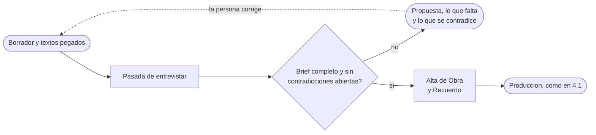
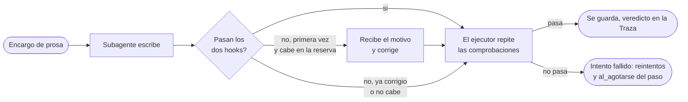
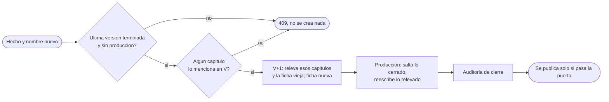

# SPEC1 · Backend v1 — Especificación de requisitos de software

## §1 Introducción

### 1.1 Propósito

Fijar qué tiene que hacer la primera versión del `backend/` para que una obra
completa se produzca de principio a fin. Es un documento de requisitos, no de
implementación: recoge lo que, si se decide mal, obliga a rehacer trabajo. Todo
lo que se puede resolver razonablemente al programar no está aquí.

### 1.2 Alcance del sistema especificado

Dentro: el almacén de artefactos con sus índices de recuperación por parecido,
la pieza que camina el guion del capítulo, las doce carpetas de tarea con su
contrato y su prompt, el presupuesto de contexto, la recogida de fuentes fuera
del sistema, el destinatario real al que la obra va dedicada con los hechos que
vienen de su vida, la entrevista que completa el brief antes del alta, el
punto de guardado por capítulo con la política de reintentos de cada paso, los
dos hooks que revisan lo que entregan los subagentes de prosa, las listas de
lo vetado con su registro de auditoría, los validadores programáticos con la
puerta que decide si una versión se publica, con la cronología demostrada en
Lean, y la API HTTP que el editor usa
para lanzar e inspeccionar una obra.

Fuera: la interfaz web, la calibración de los topes contra trazas reales y todo
lo enumerado en §11.

La medida de «terminado» de v1 es una sola: **una obra corre de la primera orden
al último capítulo cerrado sin que nadie toque nada por dentro**.

### 1.3 Documentos base y jerarquía

| Documento | Qué aporta a este SRS | Manda sobre |
| --- | --- | --- |
| `AGENTS.md` | Reparto del repositorio, pila fijada, invariantes | Frontera y pila |
| `docs/definitions.md` | Entidades del dominio y vocabularios de forma y mundo | Nombres y valores cerrados |
| `docs/architecture.md` | Capas, censo de doce agentes, entidades de producción, memorias, guion, bucle de calidad, organización del código | Comportamiento del sistema |
| `docs/validators.md` | Método, agente, proyección y severidad de cada dimensión | Verificación |

Si este documento contradice a alguno de los cuatro, gana el documento base y
esto es un error de este SRS. La única excepción declarada es D-02 (§8): el
almacén es SQLite y nada más, decisión ya tomada que cierra una de las abiertas
de `architecture.md` §8. Mientras este ciclo siga abierto, el árbol de carpetas
de `architecture.md` §7 y esa decisión de §8 van por detrás de aquí, y ponerlos
al día es trabajo de la fase 3.

### 1.4 Convenciones

- Entidades en `PascalCase` singular; relaciones en `snake_case`.
- Identificadores de requisito estables y no reutilizables: `RF-` funcional,
  `RD-` de datos, `RI-` de interfaz, `RNF-` no funcional, `D-` decisión de esta
  versión, `OBJ-` objetivo.
- La columna «Verificación» usa el vocabulario `metodo_de_verificacion` de
  `validators.md` §2: `prueba`, `analisis`, `inspeccion`, `demostracion`,
  `inverificable`.

## §2 Descripción general

### 2.1 Qué hace el backend y qué no

El backend es el único que abre el almacén y el único que ejecuta tareas. **Hace
tres cosas**: guarda y sirve artefactos, camina el guion encargando tareas a los
agentes dentro de su presupuesto, y expone por HTTP lo que el editor necesita
ver.

**No hace una cuarta**: no decide nada del dominio. No pliega el log, no resume,
no juzga texto y no reescribe prosa. Eso lo hacen los doce roles del censo. Si
el código del servidor empieza a interpretar el contenido de un artefacto, está
reapareciendo el harness a medida que el proyecto prohíbe.

### 2.2 Actores

| Actor | Qué aporta | Qué recibe |
| --- | --- | --- |
| Editor (persona) | Un brief —escrito de una vez o completado en la entrevista (§4.8)— y, como mucho, una orden de detener o reanudar | Manuscrito, críticas, trazas y progreso |
| Destinatario (persona real) | Nada directamente: su vida entra por el brief que escribe el editor, o por lo que pega en la entrevista | La obra, dedicada a él |
| Agente (uno de los doce roles) | El artefacto que escribe, o la propuesta de brief en el caso del Entrevistador | Su proyección mínima y su contrato |
| `frontend/` | Órdenes del editor | Solo respuestas de la API; nunca ficheros |

### 2.3 Restricciones heredadas

Invariantes de `AGENTS.md`, no negociables en esta versión: tres capas
disjuntas; un rol, una tarea; ningún agente valida su propia salida; el mundo
solo cambia por `EventoEstado` emitidos por el Contable al cerrar capítulo; el
estado se deriva plegando el log; solo el Documentalista escribe `Fuente`; toda
`Crítica` lleva evidencia citable; sin harness a medida; y el techo de 100 000
tokens de contexto de entrada concurrente.

Pila fijada: Python con FastAPI, y SQLite con extensión vectorial compatible
detrás de la frontera.

### 2.4 Supuestos y dependencias

- Las doce tareas las ejecutan subagentes de Claude Code con modelo Haiku
  (D-08). El backend no habla con ninguna API de modelo: delega.
- El contexto de entrada se estima antes de enviar y se mide exacto después,
  con lo que el subagente informa al terminar (D-10). La cuenta exacta queda en
  la `Traza` y es la que gobierna OBJ-01.
- **Un subagente de Claude Code no arranca vacío.** Antes de que entre nada del
  sistema, arrastra su propio contexto —su instrucción base y las definiciones
  de las herramientas que tenga concedidas—, y eso son tokens de entrada como
  cualquier otro: cuentan contra el techo. Medido en la máquina de desarrollo
  con el subagente aislado del repositorio (RF-100), con la instrucción del rol
  en lugar de la de serie y con las herramientas del rol más equipado, son
  3 191 tokens por tarea abierta, que se declaran redondeados a 3 500
  (RF-101). De ahí el término que RF-13 añade a la anchura de tanda: sin él el
  techo se respeta sobre el papel y se rompe en la máquina.
- El brief lo escribe una persona y puede venir incompleto: eso es un caso
  normal, no un error del sistema. `POST /obras` lo rechaza nombrando el campo
  (RF-01), y la entrevista lo completa (§4.8).

## §3 Objetivos medibles

Ningún objetivo tiene línea base: no hay código, así que la base se declara
**pendiente de medir** en lugar de inventarla. La primera pasada completa de una
obra de prueba es la que la fija, y hasta entonces las metas son de diseño.

Van en este orden porque el primero es el que hace que los demás signifiquen
algo: un sistema que no cabe en el techo no llega a producir número alguno.

| ID | Objetivo | Métrica | Cómo se mide | Línea base | Meta |
| --- | --- | --- | --- | --- | --- |
| OBJ-01 | Caber en el techo | Pico de tokens de entrada concurrentes en una obra | Máximo de la suma de las ventanas abiertas a la vez, de la `Traza`. Lo que devuelven los agentes no entra en la cuenta | Pendiente | ≤ 100 000, con pico habitual ≤ 80 000 |
| OBJ-02 | Coste plano por capítulo | Tokens totales del capítulo N | Suma de contexto y salida por capítulo, de la `Traza` | Pendiente | Capítulo 40 ≤ 1,2 × capítulo 4 |
| OBJ-03 | Que el bucle converja | Vueltas hasta `Aceptado` por escena | Recuento de intentos en la `Traza` | Pendiente | ≥ 90 % de escenas en ≤ 2 vueltas; < 10 % de capítulos cerrados marcados |
| OBJ-04 | Críticas utilizables | Proporción descartada por falta de `evidencia` | Recuento de rechazos sobre críticas emitidas | Pendiente | < 10 % |
| OBJ-05 | Artefactos bien formados | Rechazos por campo ausente o valor fuera de vocabulario, por capítulo | Recuento de `Crítica` bloqueante con objeto artefacto | Pendiente | ≤ 1 por capítulo |
| OBJ-06 | Cobertura documental | Afirmaciones históricas con `Fuente` asociada | Cociente sobre las afirmaciones del capítulo | Pendiente | ≥ 90 % |
| OBJ-07 | Cero intervención | Órdenes humanas necesarias entre el brief y la obra cerrada | Recuento de llamadas de escritura a la API por obra | Pendiente | Exactamente 1 |
| OBJ-08 | Recuperación útil | Proporción de fragmentos recuperados que el agente acaba citando o usando | Cociente sobre lo devuelto en cada consulta, de la `Traza` | Pendiente | ≥ 40 % |

**Qué no es objetivo, y por qué.** Bajar el coste por sí solo: se cumple
trivialmente con un modelo peor y arruina OBJ-03 y OBJ-06 sin que la cifra de
coste se entere. Bajar el número de críticas: se cumple con verificadores
ciegos, que es el fallo que `validators.md` §6 llama «el agente que no encuentra
nada nunca». Subir el número de fragmentos que devuelve
una consulta: mejora la sensación de cobertura, se come el tope de ventana del
rol que consulta y empeora OBJ-01 sin que OBJ-06 se mueva. Y la nota de un juez
de rúbrica, que es ruido declarado y no mejora medible.

## §4 Requisitos funcionales

### 4.1 Alta y arranque de una obra


| ID | Requisito | Verificación |
| --- | --- | --- |
| RF-01 | Acepta un brief y da de alta una `Obra` con título, época, ámbito, premisa, número de capítulos, políticas globales y, si los trae, la tesis temática, el elenco declarado, los arcos y el destinatario (RF-06). Obligatorios son el título, la época, la premisa y el número de capítulos; si falta uno, lo rechaza nombrando el campo con su ruta completa, sin crear nada. Sin tesis temática la obra no lleva ninguna declarada y sin elenco declarado los personajes los decide el Constructor de mundo (D-60) | `prueba` |
| RF-02 | El alta arranca la producción completa: `poblar_mundo` y después el guion de cada capítulo hasta cerrar la obra. **No hay ninguna otra orden que el editor deba dar** | `demostracion` |
| RF-03 | Cada obra nace en su propio espacio de artefactos, identificado por `id_obra`. No existe un espacio de trabajo compartido que haya que archivar ni vaciar entre obras | `analisis` |
| RF-04 | La producción se puede detener y reanudar por orden explícita. Reanudar vuelve al último capítulo cerrado y no repite trabajo ya cerrado (§4.10, RF-91) | `prueba` |
| RF-05 | Una tarea fallida se reintenta hasta el tope que declara su paso del guion, y lo que pasa al agotarse también lo declara el paso (§4.10, RF-95 a RF-99) | `prueba` |
| RF-06 | El brief puede llevar un **destinatario**: nombre, edad, rasgos, recuerdos, tono pedido, dedicatoria y las palabras o temas vetados. Es opcional —una obra histórica sin destinatario sigue siendo válida—. Si viene, el nombre, la edad, el tono y la dedicatoria son obligatorios y el rechazo nombra el campo que falta con su ruta, `destinatario.nombre`; las tres listas pueden venir vacías, porque vacío es una respuesta | `prueba` |
| RF-07 | Cada recuerdo aportado se guarda como `Recuerdo`, entidad de la capa Mundo, inmutable y sin `Fuente`. **Ningún rol del censo lo escribe**: nace con el alta de la obra, igual que la propia `Obra` (D-13) | `prueba` |
| RF-08 | Todo elemento del mundo que salga de la vida del destinatario se marca `licencia = "personal"` y apunta al `Recuerdo` del que sale. Un elemento `personal` **queda exento de las cuatro dimensiones de anacronismo**: se escribe tal cual, con su nombre de hoy, y no genera `Crítica` (D-12) | `prueba` |
| RF-09 | El Planificador decide qué papel tiene el destinatario en la obra —`protagonista`, `secundario`, `testigo` o `narrador`— y lo deja escrito en el `Plan`. Ni el editor lo elige ni el validador lo supone: lo lee de ahí (D-14) | `prueba` |

### 4.2 Ejecución del guion

| ID | Requisito | Verificación |
| --- | --- | --- |
| RF-10 | El guion del capítulo —paso, rol, proyección, tope de ventana y concurrencia— es un artefacto declarativo, no código. La pieza que lo camina lee cuál es el paso siguiente y lo ejecuta | `inspeccion` |
| RF-11 | Cada paso encarga una tarea a un rol con la proyección mínima de ese rol (`architecture.md` §3) y nada más. Lo que sobra en la proyección produce falsos positivos y es un defecto | `inspeccion` |
| RF-12 | Ningún rol invoca a otro ni recibe objetos en memoria: el testigo se pasa siempre por artefacto escrito en el almacén | `analisis` |
| RF-13 | La anchura de una tanda se calcula: `80 000 ÷ (tope del rol más caro de la tanda + coste fijo del subagente)`, redondeado a la baja; en un paso con hooks, el tope lleva sumada la reserva de la vuelta (RF-128). Si hay más tareas, se hacen tandas sucesivas y se espera a que cierre una antes de abrir la siguiente | `analisis` |
| RF-14 | Antes de enviar, cuenta los tokens de la ventana. Si no cabe en el tope del rol, **parte la unidad** (capítulo → escena → párrafo) y nunca recorta la proyección | `prueba` |
| RF-15 | Las únicas bifurcaciones son el enrutado por severidad y el tope de vueltas. Ningún agente enruta ni manda sobre otro | `inspeccion` |
| RF-16 | El destinatario y sus recuerdos entran en la ventana del Constructor de mundo y del Planificador, y en ninguna otra ventana de la obra, declarados como material propio y no colados dentro del cuerpo de la `Obra`. Lo que los demás roles necesitan de él ya está en las fichas del mundo que el Constructor escribió | `inspeccion` |

### 4.3 Almacén y forma de los artefactos

| ID | Requisito | Verificación |
| --- | --- | --- |
| RF-20 | `almacen/` es la única puerta de lectura y escritura. Ni `tareas/` ni `api/` hablan con la base de datos | `inspeccion` |
| RF-21 | Todo artefacto se guarda con `id` opaco, `tipo`, `procedencia` (rol, tarea e intento que lo produjeron) y sello temporal | `analisis` |
| RF-22 | El cuerpo del artefacto se guarda íntegro tal como lo escribió el agente. El backend no lo reinterpreta: solo extrae las columnas por las que hace falta consultar | `inspeccion` |
| RF-23 | Un artefacto con un campo obligatorio ausente o con un valor fuera de vocabulario controlado se rechaza, y el rechazo es una `Crítica` de severidad `bloqueante` cuyo objeto es el artefacto, no el texto | `prueba` |
| RF-24 | `EventoEstado`, `Fuente`, `Resumen de capítulo`, `Decisión` y todo borrador ya aceptado son inmutables. Cambiar algo es escribir una versión nueva | `prueba` |
| RF-25 | El estado en N se deriva plegando: el Contable recibe el estado en N-1 materializado y los eventos de N. El log no se lee nunca entero. Rehacer desde el capítulo 12 (§4.12) deja los estados materializados de 12 en adelante a la versión anterior y repliega hacia delante en la nueva | `analisis` |
| RF-26 | Retirar la memoria de capítulo la ejecuta el Archivero como paso del guion: el almacén marca esos artefactos como caducados y deja de servirlos a cualquier proyección | `prueba` |

### 4.4 Control de calidad

| ID | Requisito | Verificación |
| --- | --- | --- |
| RF-30 | Tres cribas por borrador —bloqueantes, mayores y pulido—, no una. Cada dimensión entra en la vuelta que le fija su severidad de partida | `inspeccion` |
| RF-31 | Una `Crítica` sin `evidencia` citable se descarta antes de llegar al Revisor, y el descarte se cuenta (OBJ-04) | `prueba` |
| RF-32 | Enrutado por severidad: `bloqueante` regenera la escena, `mayor` entra en revisión dirigida, `menor` y `sugerencia` esperan a la criba de pulido | `prueba` |
| RF-33 | Tope de vueltas: dos revisiones dirigidas por borrador y dos regeneraciones por escena. Agotado, la escena se acepta con sus críticas abiertas anotadas y el capítulo se cierra marcado | `prueba` |
| RF-34 | Si dos agentes discrepan sobre el mismo predicado, se repite con la proyección reducida al mínimo; si persiste, la crítica baja a `sugerencia` y se registra como caso ambiguo | `prueba` |
| RF-35 | Los permisos de lectura y escritura por rol los impone el backend, no el prompt: ningún rol puede escribir una entidad que la tabla de gobierno (`architecture.md` §6) no le asigna | `prueba` |

### 4.5 Cierre de capítulo y de obra

| ID | Requisito | Verificación |
| --- | --- | --- |
| RF-40 | El paso de `Aceptado` a `Cerrado` emite los `EventoEstado` del capítulo, solo por el Contable, con fecha y lugar resultantes ya calculados y escritos. Hasta que el capítulo no cierra, sus eventos no existen para nadie | `analisis` |
| RF-41 | Cerrado el capítulo, el Archivero escribe el `Resumen de capítulo` y actualiza la cola de compromisos y el registro acumulado de estilo | `analisis` |
| RF-42 | `auditar` entra cada N capítulos y al cierre de la obra, siempre en solitario. N es configuración | `analisis` |
| RF-43 | Al cierre, ningún compromiso queda `abierto`: es `bloqueante`. Los retoques finales los aplica el Revisor o el Editor de estilo como paso del guion. **El editor humano no ejecuta pasos: lee el resultado** | `demostracion` |

### 4.6 Consulta por el editor

| ID | Requisito | Verificación |
| --- | --- | --- |
| RF-50 | Sirve el manuscrito con solo el texto aceptado, en orden, y marca los capítulos cerrados con críticas abiertas | `inspeccion` |
| RF-51 | Sirve las críticas filtrables por estado, dimensión, severidad y capítulo, con su evidencia y quién las detectó | `analisis` |
| RF-52 | Sirve una `Traza` por tarea con contexto enviado, salida, coste, latencia e intento. Se registra en toda tarea, la ejecute quien la ejecute | `analisis` |
| RF-53 | Sirve el progreso de una ejecución en curso: capítulo, paso, rol, tareas abiertas y tokens de entrada concurrentes | `demostracion` |
| RF-54 | Sirve el estado plegado hasta el capítulo N y el log de eventos, para poder auditar por qué una escena se rechazó | `analisis` |
| RF-55 | Sirve una búsqueda por parecido sobre el manuscrito ya aceptado de una obra, para localizar un pasaje sin recordar sus palabras exactas | `demostracion` |

### 4.7 Recuperación por parecido y fuentes de fuera

| ID | Requisito | Verificación |
| --- | --- | --- |
| RF-60 | El Documentalista busca fuentes fuera del sistema con el marco de la escena —fecha, lugar y ámbito—. Es el único rol con acceso al exterior: ningún otro busca ni lee nada que no esté ya en el almacén | `inspeccion` |
| RF-69 | Cuando para un marco de escena no encuentra nada utilizable, el Documentalista deja constancia de la búsqueda infructuosa y la producción continúa. **Una escena sin respaldo no bloquea nunca**: baja OBJ-06 y el Arquitecto de arcos la saca en la auditoría de cierre (D-09) | `prueba` |
| RF-61 | De cada resultado aceptado se guarda el texto íntegro tal como se leyó, con su procedencia y la fecha de recogida, antes de trocearlo. Una `Fuente` de la que solo se conserva el enlace no vale como respaldo | `prueba` |
| RF-62 | El cuerpo entero de una fuente no entra nunca en la ventana de ningún agente: el Documentalista decide sobre resultados cortos y el volumen se queda en el almacén | `analisis` |
| RF-63 | Toda consulta por parecido lleva `k` y tope de tokens declarados para el rol que la hace, y lo recuperado se descuenta de su tope de ventana en lugar de sumarse aparte. Si no cabe, baja `k` | `prueba` |
| RF-64 | Se indexa solo el texto aceptado. Un borrador candidato o descartado no puede recuperarse nunca como eco | `prueba` |
| RF-65 | El Editor de estilo comprueba la fatiga léxica contra los ecos recuperados del registro acumulado, no contra el registro entero | `analisis` |
| RF-66 | El Planificador recibe contratos de escena y `Resumen de capítulo` parecidos a lo que va a planificar, nunca prosa | `inspeccion` |
| RF-67 | Ni el Verificador de continuidad, ni el Contable de estado, ni el Arquitecto de arcos, ni el Redactor consultan por parecido. Una búsqueda por semejanza no encuentra lo que falta y su fallo es silencioso | `inspeccion` |
| RF-68 | Cada recuperación queda en la `Traza`: consulta, colección, `k`, fragmentos devueltos y cuáles acabó usando el agente. Sin eso OBJ-08 no se puede medir | `analisis` |

### 4.8 La entrevista que completa el brief

**El problema.** El brief lo escribe una persona y viene incompleto como caso
normal (§2.4), pero hasta aquí la única respuesta del sistema a un brief
incompleto era rechazarlo nombrando el campo. Quien encarga una novela para
alguien no sabe de antemano qué se le va a pedir, tiene a menudo lo que hace
falta escrito en otra forma —una carta, una anécdota— y puede pedir cosas que
no casan entre sí, como un tono que no corresponde a la edad del destinatario.
Nadie en el sistema lo detectaba antes de gastar una obra entera.

**La decisión.** Un rol nuevo, el **Entrevistador**, con la tarea
`entrevistar`, completa el brief en pasadas sin estado. Cada pasada recibe lo
que la persona lleva escrito y lo que ha pegado, y devuelve el brief completado
hasta donde se puede, lo que sigue faltando y lo que se contradice. En cuanto el
brief está completo y no queda ninguna contradicción sin asumir, la misma pasada
da de alta la obra y la producción arranca.



| ID | Requisito | Verificación |
| --- | --- | --- |
| RF-70 | El Entrevistador es el rol doce del censo y `entrevistar` es su única tarea, con carpeta propia en `tareas/`. No tiene ninguna herramienta, **no escribe ninguna entidad del almacén** —devuelve una propuesta, no artefactos— y actúa fuera del guion, antes de que la obra exista. Su tope de ventana es de 8 000 tokens, se ejecuta como mucho una pasada a la vez en la instalación y lo que ocupa abierta, el tope más el coste fijo del subagente, cabe en el 20 % de margen del techo sin quitarle nada a la tanda de una obra en curso | `prueba` |
| RF-71 | `POST /entrevistas` abre una entrevista y hace su primera pasada, y `POST /entrevistas/{id}/pasadas` hace la siguiente. Cada pasada recibe un borrador de brief con todos los campos opcionales, los textos pegados y las contradicciones que la persona da por asumidas, y **nada de las pasadas anteriores**: lo que quiera conservar lo vuelve a mandar. Si la ventana no cabe en el tope del rol, la pasada se rechaza diciendo cuánto sobra, y no se recorta ningún texto | `prueba` |
| RF-72 | Los campos que faltan los detecta el borde, no el agente. Después de cada pasada, el brief resultante se valida contra el mismo modelo que `POST /obras`, y lo que falta se devuelve con su ruta completa —`destinatario.edad`—, igual que en RF-01 | `prueba` |
| RF-73 | Lo que la persona escribió manda. Un campo escalar presente en el borrador no lo cambia ninguna pasada. En las listas, lo que la persona puso se conserva íntegro y en su orden, y la pasada solo puede añadir detrás. Un valor que aporta el agente y que no valida contra el modelo se descarta, y el campo sigue contando como que falta | `prueba` |
| RF-74 | El texto pegado entra en la ventana **como dato delimitado, nunca como instrucción**: cada texto va dentro de su propia marca, dentro de los datos del encargo, igual que el cuerpo de una `Fuente`. De él el Entrevistador extrae hechos, y cada hecho declara a qué campo del brief va y una **cita literal** del texto. Un hecho cuya cita no aparece tal cual en ninguno de los textos pegados, o cuyo campo no es uno de los del brief, se descarta y el descarte se cuenta | `prueba` |
| RF-75 | Un hecho que va a `destinatario.recuerdos` entra en el brief con su cita literal como valor, no con una paráfrasis. Así el `Recuerdo` que nace con el alta guarda un texto que la persona entregó (RD-16), y ningún rol del censo lo escribe (RF-07) | `prueba` |
| RF-76 | El Entrevistador detecta contradicciones de un vocabulario cerrado, `tipo_de_contradiccion`: `edad_contra_tono`, cuando el tono pedido no corresponde a la edad del destinatario, y `texto_contra_campo`, cuando un texto pegado dice otra cosa que un campo que la persona escribió. Cada contradicción nombra los campos en conflicto y trae evidencia citable. Se descarta la que no trae evidencia, la que nombra un campo que no existe, la de `edad_contra_tono` cuyo brief no tiene edad y tono, y la de `texto_contra_campo` cuya evidencia no aparece literal en ningún texto pegado. **No resuelve ninguna**: la devuelve como pregunta | Detección: `inspeccion`. Filtro y descarte: `prueba` |
| RF-77 | La persona puede dar por asumida una contradicción declarando su tipo en la pasada siguiente. Una contradicción asumida se sigue devolviendo, marcada como asumida, pero no bloquea el alta | `prueba` |
| RF-78 | Si al terminar la pasada el brief valida y no queda ninguna contradicción sin asumir, **la propia pasada da de alta la obra** exactamente como `POST /obras`: los recuerdos pasan a `Recuerdo` y la producción arranca. La pasada devuelve el `id_obra`, y la entrevista queda cerrada: pedirle otra pasada es un error que nombra la obra ya lanzada. Si el brief no está completo, no se crea nada. La pasada que lanza es la única orden de OBJ-07: las anteriores ocurren antes de que la obra exista | `prueba` |
| RF-79 | Cada entrevista es su propio espacio, identificado por `id_entrevista`, igual que una obra lo es por `id_obra` (RF-03). Cada pasada deja escrito lo que recibió, lo que devolvió, cuántos hechos y cuántas contradicciones se descartaron, y su `Traza`: tokens estimados y medidos, salida, coste y latencia. Nada de eso se borra ni se modifica. La obra que se lanza desde una entrevista anota en su cuerpo el `id_entrevista` del que sale | `prueba` |

**Decisiones del bloque.**

| ID | Decisión | Por qué |
| --- | --- | --- |
| D-20 | **Pasadas en frío, no una conversación con estado.** Desde fuera parece una conversación, pero dentro no hay historial: cada pasada recibe lo que la persona manda en ese momento | Toda tarea arranca en frío (`architecture.md` §3), y esa es la regla que hace el techo verificable antes de gastar. Una conversación guardada entraría entera en cada turno y crecería sin tope, que es lo que prohíbe la regla del tamaño. La pasada única y sin segunda vuelta se descarta porque deja sin cerrar precisamente lo que la entrevista tenía que resolver |
| D-21 | **El Entrevistador es un rol nuevo, no una tarea del Planificador** | Es lo que dice «un rol, una tarea»: el trabajo de completar un brief no lo cubre ningún tipo de tarea, así que se declara un rol en lugar de ensanchar uno. El Planificador actúa por capítulo, sobre una obra que ya existe, y darle esta tarea metería texto pegado en crudo en la ventana que planifica la trama |
| D-22 | **La obra se lanza sola en cuanto el brief está completo**, sin que la persona lo confirme | Es un paso menos entre el encargo y la obra, en la línea de OBJ-07. El precio es que lo que el agente extrae del texto pegado se convierte en `Recuerdo` sin que nadie lo revise. Se contiene con dos reglas mecánicas en lugar de con una confirmación: lo que la persona escribió manda (RF-73) y un recuerdo es siempre una cita literal de lo que ella entregó (RF-74, RF-75). El agente elige qué fragmento guardar, pero no puede redactar el recuerdo ni inventarlo |
| D-23 | **Los campos que faltan los detecta el borde, y las contradicciones el agente** | Que falte un campo es una cuestión de forma: el borde ya la resuelve con el modelo del brief, y pedírsela a un agente convertiría una respuesta segura en una probable. Que un tono no case con una edad es un juicio de dominio, y el backend no juzga nada del dominio (§2.1). No rompe «ningún agente valida su propia salida»: el Entrevistador juzga lo que escribió la persona, no lo que escribe él |
| D-24 | **La entrevista tiene un espacio propio, anterior a la obra**, y RD-02 lo admite | Cuando se entrevista todavía no hay `id_obra`, y toda tarea deja `Traza` (RNF-03). Se descarta reservar el `id_obra` en la primera pasada, porque cambiaría RI-01 y lo que cuenta OBJ-07. También se descarta no guardar nada, porque la entrevista quedaría sin medir |

**Criterio de aceptación.** Con un ejecutor fingido, un borrador al que le
faltan la edad y el tono, más una carta pegada que los contiene, se completa en
una pasada y lanza la obra, y sus recuerdos son citas literales de la carta. Un
borrador con edad 8 y un tono que no corresponde queda sin lanzar hasta que la
contradicción se asume. Y un texto pegado con una orden dentro no cambia ningún
campo que la persona escribió ni escribe nada en el almacén.

**De dónde sale.** `architecture.md` §2 (censo y «un rol, una tarea») y §3
(toda tarea arranca en frío); RF-01, RF-07 y RD-16; D-13 y D-14, que no se
tocan.

**Fuera de este bloque.** Más tipos de contradicción que los dos del
vocabulario; que una pasada recuerde las anteriores; que la persona confirme el
brief antes del alta (D-22); y cualquier comprobación de que lo que el
Entrevistador extrajo acabe apareciendo en la obra.

**Docs que se ponen al día en la fase 3.** `architecture.md`: el censo con el
rol doce, su entrada y su salida, su proyección, su tope, la tabla de gobierno,
el vocabulario de proceso `tipo_de_contradiccion` y la entrevista como espacio
anterior a la obra. `validators.md`: el método de cada requisito de este bloque
y la amenaza de la orden inyectada en el texto pegado. `AGENTS.md`: la
descripción de `architecture.md` pasa a decir doce agentes. `definitions.md` y
`domain-knowledge.md` no cambian: el `Recuerdo` sigue siendo lo que era.

### 4.9 Uso de los hechos por capítulo y cronología

**El problema.** Tres trabajos posteriores necesitan saber dónde vive cada
hecho de la biblia en el texto y cuándo ocurre cada cosa: el validador que
comprueba que cada elemento personalizado aparece en algún capítulo, el
fichero que se le pasa al demostrador formal y la propagación de un cambio del
lector a los capítulos afectados. Hoy ninguno de los dos datos existe: una
ficha no sabe en qué capítulos se ha usado y no hay forma de listar los sucesos
de la obra en orden con quién estaba presente. Sin esto, los tres se quedan sin
suelo o tienen que releer la prosa cerrada, que es justo lo que la regla del
tamaño prohíbe.

**Qué es un hecho de la biblia.** Las fichas de la capa Mundo que el texto
nombra: `Personaje`, `Lugar`, `Objeto`, `Faccion` y `Evento`. Quedan fuera
`Fuente`, `Concepto`, `Practica` y `RegistroLinguistico`, que respaldan o
filtran el texto sin ser algo de lo que el texto hable, y `Recuerdo`, que es la
materia prima de la que sale la ficha `personal` y no la ficha misma.

| ID | Requisito | Verificación |
| --- | --- | --- |
| RF-80 | Cada uso de un hecho de la biblia en un capítulo cerrado queda registrado como una `Mencion`: artefacto de la capa Obra, inmutable y de memoria de obra, con el `id` del hecho y el número del capítulo. Materializa la relación referencial `menciona`. **La ficha del hecho no se toca** (D-26) | `prueba` |
| RF-81 | Las `Mencion` las escribe el Archivero en el paso 10, `destilar`, en la misma unidad que el `Resumen de capítulo`: o se guardan las dos cosas o ninguna. Ningún otro rol las escribe (D-25) | `prueba` |
| RF-82 | Para anotarlas, la ventana del Archivero lleva un material nuevo, `indice_de_la_biblia`: una línea por hecho con su `id`, su tipo, su nombre y su licencia, y nada más de la ficha. No es el canon: el Archivero sigue sin ver atributos del mundo | `prueba` |
| RF-83 | El almacén rechaza una `Mencion` que no traiga el `id` del hecho o cuyo `id` no sea un hecho de la biblia de esa misma obra. El rechazo es el de RF-23: `Crítica` bloqueante con objeto el artefacto | `prueba` |
| RF-84 | En qué capítulos se usa un hecho **se deriva, no se guarda**: son los capítulos distintos de sus `Mencion`, en orden. Una mención repetida no duplica el capítulo | `prueba` |
| RF-85 | Todo `EventoEstado` lleva, además de la fecha y el lugar resultantes, `presentes`: los `id` de los `Personaje` que estaban cuando ocurrió, escritos por el Contable. La fecha resultante del evento, el momento de un `Evento` del mundo y el nacimiento de un `Personaje` —`fechas.nacimiento`— se escriben en fecha ISO parcial: `AAAA`, `AAAA-MM` o `AAAA-MM-DD` (D-28) | `inspeccion` |
| RF-86 | La cronología es **una vista derivada, no una tabla guardada**: una fila por `EventoEstado` y por `Evento` del mundo, con el suceso, el momento, el lugar, el capítulo —vacío si el `Evento` no pertenece a ninguno— y los presentes, cada uno con su `id`, su nombre y su fecha de nacimiento. Se ordena por momento y, a igualdad, por capítulo; lo que no trae momento va al final. Copia lo escrito: no calcula fechas ni edades (D-27) | `prueba` |
| RF-87 | La API sirve las dos cosas en dos rutas de lectura: `GET /obras/{id}/hechos`, cada hecho con su tipo, su nombre, su licencia y los capítulos en que se usa, filtrable por tipo y por licencia; y `GET /obras/{id}/cronologia`, la vista de RF-86. No añaden ninguna operación de escritura y entran en `backend/openapi.yaml` (RI-10) | `prueba` |
| RF-88 | En el recorrido en seco, cerrar un capítulo deja escritas sus menciones y la cronología trae el suceso del capítulo con sus presentes y su fecha de nacimiento | `demostracion` |

| ID | Decisión | Por qué |
| --- | --- | --- |
| D-25 | **Las menciones las anota el Archivero al destilar.** No el Redactor, ni el Contable, ni un rol nuevo | «Quien escribe lo anota al cerrar» no puede ser el Redactor: actúa por escena en el paso 3 y lo que declarase quedaría desfasado en cuanto el Revisor o el Editor de estilo tocan el texto. El Contable es el único punto por el que el mundo cambia, y un uso no es un cambio del mundo: meterlo ahí mezcla dos cosas en el rol que más cuesta vigilar. Un rol doce ensancharía el censo sin trabajo de dominio nuevo, porque destilar ya es escribir lo que queda de un capítulo cuando su prosa deja de leerse, y qué hechos nombra es exactamente eso. La regla del Archivero se mantiene: no escribe hechos del mundo ni prosa |
| D-26 | **El uso es un artefacto aparte, no un campo de la ficha.** Tampoco un campo del `Resumen de capítulo` | Un campo en la ficha que crece capítulo a capítulo choca con la inmutabilidad de `canon` y `personal` y con «el mundo solo cambia por `EventoEstado`». Dentro del resumen, saber dónde se usa un hecho obliga a recorrer todos los resúmenes, y eso crece con la obra. Con un artefacto de solo añadir la pregunta es una consulta por `id`, y «en qué capítulos» se deriva igual que el estado. El índice de la biblia que recibe el Archivero lee cuatro campos por ficha sin interpretarlos: es proyección, no decisión. Crece con la biblia, no con la prosa, y es mucho más corto que el canon que ya reciben el Planificador y el Verificador |
| D-27 | **La cronología se deriva al consultar.** No es un artefacto del Contable ni una caché | Todo lo que lleva ya está escrito: la fecha, el lugar y los presentes en el `EventoEstado`, el suceso histórico en el `Evento` y el nacimiento en la ficha. Guardarlo otra vez sería un segundo sitio que mantener al día, y «el estado no se almacena, se deriva». Ordenar por la fecha escrita no es aritmética de calendario: no reabre D-05 |
| D-28 | **`presentes` en el `EventoEstado` y fechas ISO parciales.** El formato lo piden el prompt y el esquema del rol que escribe; el almacén no lo comprueba en esta versión | Sin presencia por suceso no se puede afirmar que un personaje no está en dos sitios a la vez, y sin un formato de fecha fijo el volcado formal tendría que interpretar texto libre. La parcial admite lo que de verdad se sabe de una época —a veces solo el año— sin inventar el día. Comprobar el formato al escribir es trabajo del volcado formal, que es quien lo consume |
| D-29 | **Alcance: registrar, derivar y servir.** La propagación de cambios del lector es de §4.18, el validador de elementos personalizados de §4.15 y el volcado al demostrador formal de §4.16 | Son los consumidores de esto y cada uno tiene su propia pasada del ciclo. Servirlo por la API ya ahora es lo que permite a la interfaz enlazar cada ficha con sus capítulos sin volver a mover la frontera |

**Lo que queda fuera.** La comprobación de que el Archivero no se ha dejado
ningún hecho sin anotar, y la validación del formato de fecha al escribir
(D-28).

**Documentos que pone al día la fase 3.** `definitions.md` (la `Mencion` en la
capa Obra, la cronología como vista y el formato de fecha) y el árbol de la
obra y las relaciones de `domain-knowledge.md`; `architecture.md` (entrada y
salida del Archivero y del Contable, proyecciones, memorias y tabla de
gobierno); y `validators.md` (lo nuevo en la matriz de cobertura, y el hueco de
completitud de las menciones). Trazabilidad: sale de `definitions.md`
(relaciones referenciales) y de `architecture.md` §2, §3 y §6.

### 4.10 Punto de guardado por capítulo y límite de reintentos

**El problema.** RF-04 y RF-05 prometían reanudar sin repetir y reintentar hasta
un tope, pero no decían qué es «lo último cerrado» cuando la producción se corta
a destiempo ni qué pasa al agotar el tope salvo detener. En el código eso deja
tres fallos. Si el proceso muere, el hilo de producción muere con él y nadie lo
relanza. Un capítulo a medias se vuelve a planificar encima de lo que ya había y
duplica escenas y borradores. Y un corte entre `plegar` y la marca `cerrado`
deja `EventoEstado` de un capítulo que no ha cerrado, que es justo lo que RF-40
prohíbe. A eso se suma que el tope es un único número global y que agotarlo
detiene siempre la obra, también cuando lo que falló fue una comprobación que no
produce testigo para nadie.

Va antes que cualquier otro cambio por dos razones. Todas las tareas que vengan
después añaden pasos al bucle, y cada paso nuevo necesita saber cuántas veces se
reintenta y qué hace al agotarse. Además, esto es la mitad de lo que habrá que
especificar en el verificador formal del sistema.

**La decisión, en una frase.** El capítulo cerrado es el único punto de guardado.
Cerrar un capítulo es una sola transacción. Reanudar, por la causa que sea,
vuelve a ese punto: descarta lo que quedó a medias y rehace el capítulo
siguiente desde el paso 1. Y cada paso del guion declara cuántas veces se
reintenta y qué pasa cuando se agota.

| ID | Requisito | Verificación |
| --- | --- | --- |
| RF-90 | **Punto de guardado.** Cerrar el capítulo N es una sola transacción: los `EventoEstado` y el estado en N del Contable, lo que escribe el Archivero, la marca `cerrado` del capítulo y la retirada de su memoria de capítulo. Lo que `plegar` y `destilar` devuelven no se escribe hasta que las dos tareas han terminado. Si un artefacto sale malformado, se rechaza dentro de esa misma transacción, igual que en RF-23. Antes del commit no existe nada del cierre; después existe entero | `prueba` |
| RF-91 | **Reanudar es volver al último punto de guardado.** Cada vez que se camina una obra, sea el arranque, un `reanudar` o un relanzamiento tras una caída, primero se hace lo mismo: las `Traza` que quedaron abiertas se cierran como interrumpidas; todo lo que cuelga de capítulos sin cierre vivo —los posteriores al último cerrado y, en una versión que reescribe capítulos sueltos, los que reescribe (RF-176)— se caduca, sin borrar (RD-07); sus fragmentos salen del índice y su estado materializado se descarta; y el índice del último capítulo cerrado se completa si le falta algo. Después, el capítulo siguiente empieza en el paso 1 | `prueba` |
| RF-92 | **Ni duplica ni pierde.** Tras un corte en cualquier punto, cada capítulo cerrado tiene exactamente un `Capitulo` vivo, un juego de `EventoEstado`, un estado en N y un `Resumen de capítulo`. El manuscrito servido es el mismo que antes del corte más lo que se cierre después. Lo que se pierde es solo el trabajo del capítulo que estaba abierto | `prueba` |
| RF-93 | **Relanzar tras una caída no pide ninguna orden.** Al arrancar, el backend relanza toda obra que no esté detenida y que no haya terminado. «Terminada» quiere decir que consta la auditoría de cierre (RF-94). Así OBJ-07 sigue valiendo aunque la máquina se reinicie | `prueba` |
| RF-94 | **La auditoría tiene también su punto de guardado.** Las críticas de `auditar` se escriben en una sola transacción junto con la constancia de hasta qué capítulo se ha auditado. Al reanudar, si el último capítulo cerrado tenía auditoría pendiente y no consta, se audita antes de abrir el siguiente. Cuando la auditoría de cadencia cae en el último capítulo, coincide con la de cierre y corre una sola vez | `prueba` |
| RF-95 | **El tope y la política están escritos en el guion.** Cada paso de `guion.toml` y cada tarea fuera del guion declaran `reintentos` (el número de intentos, uno o más) y `al_agotarse`. Si falta alguno de los dos, el guion no carga | `prueba` |
| RF-96 | **`al_agotarse` es un vocabulario cerrado con tres valores.** `detener_obra`: la obra queda detenida con la tarea, el intento y el motivo, y sin ningún artefacto a medio escribir. `critica_abierta`: el backend escribe la `Crítica` de RF-99 y la producción sigue. `seguir`: la producción sigue y la constancia del intento queda en la `Traza`, igual que la búsqueda infructuosa de RF-69 | `prueba` |
| RF-97 | **Qué política toca a cada paso.** `detener_obra` para lo que produce el testigo del paso siguiente: `planificar`, `redactar`, `revisar`, la costura del paso 7, `plegar`, `destilar` y `poblar_mundo`. `critica_abierta` para las comprobaciones: las cribas de los pasos 4, 6 y 8, y `auditar`. `seguir` para `documentar`, por D-09. El tope de partida es dos intentos en todos los pasos | `inspeccion` |
| RF-98 | **Qué es un intento fallido y cómo se cuenta.** Un intento falla cuando el ejecutor devuelve un error o no contesta a tiempo, o cuando lo que el subagente entregó al final no pasa un hook de su paso (RF-126). Un artefacto malformado no es un intento fallido: sigue siendo la `Crítica` bloqueante de RF-23. Una tarea cortada por una caída tampoco cuenta, porque su `Traza` se cierra como interrumpida. Cada encargo empieza a contar desde 1 y, como el capítulo a medias se rehace, el contador vuelve a empezar con él. Toda `Traza` fallida registra su intento y su motivo | `prueba` |
| RF-99 | **La crítica «no comprobado».** La escribe el backend, no un rol, igual que la de un artefacto malformado. Su objeto es la unidad del encargo y su dimensión la del encargo. Sale con severidad `bloqueante`, estado `abierta` y, como evidencia, la `Traza` del último intento y su motivo. No se enruta: no regenera ni manda a revisión. Se queda abierta y el capítulo se cierra marcado, que es como el Arquitecto de arcos la ve (RF-33) | `prueba` |

**Decisiones de este cambio.**

| ID | Decisión | Por qué |
| --- | --- | --- |
| D-30 | **El único punto de guardado es el capítulo cerrado, y lo marca la transacción de cierre.** No se guarda el avance paso a paso dentro del capítulo | Guardar por paso perdería menos trabajo, pero obligaría a reconstruir en qué vuelta del bucle estaba cada escena, y el recorrido dejaría de ser reproducible (RNF-04). El capítulo ya es la frontera en la que el mundo cambia (RF-40): hacer que también sea la frontera de la durabilidad no añade ninguna noción nueva |
| D-31 | **Lo que quedó a medias se descarta entero y se rehace**, incluidas las `Fuente` ya recogidas en ese capítulo | Salvar las fuentes ahorraría la búsqueda externa, pero cuelgan de escenas que el nuevo plan no tendrá, y dejaría una segunda forma de que algo del capítulo anterior al corte entre en el siguiente. Rehacer desde el paso 1 deja un solo camino, que es el mismo de un capítulo recién abierto |
| D-32 | **Marcar no es modificar.** A un artefacto inmutable (`EventoEstado`, `Fuente`, `Resumen de capítulo`, `Decisión`, `Recuerdo`) y a un `Borrador` aceptado se les puede poner la marca de caducado. Solo esa marca, solo una vez, y nunca se quita | Sin esto no hay forma de descartar un capítulo a medias sin borrar, y borrar lo prohíbe RD-07. RF-24 no se toca: el contenido de un inmutable sigue sin cambiar. Lo único que se añade es la marca que el propio RD-07 ya llama «caducar» |
| D-33 | **Tras una caída, la obra se relanza sola al arrancar el backend.** `POST /reanudar` sigue sirviendo para lo que el editor detuvo o para una obra detenida por `detener_obra` | Exigir `reanudar` tras cada caída suma una intervención humana por corte y rompe OBJ-07 y RNF-08. Relanzar al arrancar pasa por el mismo camino que `reanudar` (RF-91), así que no hay dos formas de reanudar que puedan divergir |
| D-34 | **Qué se hace al agotar los intentos se declara por paso en el guion, con vocabulario cerrado, y el contador vuelve a empezar con el capítulo** | Detener siempre dejaría parada una obra que podría terminar, porque la comprobación que falla no produce testigo para nadie. Rehacer el capítulo entero al agotar una tarea sale caro, y lo normal es que el fallo sea del proveedor y no del capítulo. Acumular intentos a lo largo de las caídas exigiría decidir cuándo dos encargos son «el mismo» después de replanificar. Ponerlo en el guion, y no en `ajustes.py`, deja cada tope junto al paso que gobierna, como pide RF-10 |

**Qué retira.** El tope global de reintentos de `ajustes.py` desaparece, porque
el tope pasa al guion. RF-04 y RF-05 remiten ahora a esta subsección. El
criterio 5 de §10 habla de trabajo cerrado y no de trabajo aceptado, porque lo
aceptado de un capítulo que no llegó a cerrar se descarta a propósito (D-31).

**Qué queda fuera.** No hay puntos de guardado dentro del capítulo. No se
distingue una tarea que falla siempre de una que falla por casualidad: si el
mismo capítulo detiene la obra una y otra vez, se ve en la `Traza`, pero nada lo
corta automáticamente. No hay varias obras produciéndose a la vez (§11). Y la
interfaz HTTP no cambia: la ficha de obra ya dice si está detenida, y el motivo
queda en el control de ejecución.

**De dónde sale.** `architecture.md` §4, el ciclo de vida del capítulo, y §5, el
tope de vueltas; RF-04, RF-05, RF-24, RF-33, RF-40 y RF-69; RD-07; OBJ-07 y
RNF-08.

**Documentos que hay que poner al día en la fase 3.** En `architecture.md`: §2,
el vocabulario de proceso `al_agotarse`; §4, el punto de guardado, la
reanudación y la política por paso; y §7, el árbol de `ajustes.py`. En
`validators.md`: §6, la tabla de pruebas, y §8, la matriz de cobertura, con los
métodos de RF-90 a RF-99. `definitions.md` y `domain-knowledge.md` no cambian,
porque esta enmienda no toca la ontología.
### 4.11 El subagente de tarea no ve el andamiaje de desarrollo

**Contexto.** El repositorio lleva su andamiaje de desarrollo con Claude Code:
un `CLAUDE.md` de verdad en la raíz, la skill `grill-me` commiteada en
`.claude/skills/`, los comandos y subagentes propios de `.claude/commands/` y
`.claude/agents/`, y en `.claude/mcp.json` un servidor MCP de navegador para
mirar la futura lectura web. Nada de eso es backend: lo gobierna `AGENTS.md`.
Lo que sí toca al backend es quién lo acaba leyendo.

**Problema.** El ejecutor lanza cada subagente de tarea con el repositorio como
directorio de trabajo, y Claude Code descubre por su cuenta el `CLAUDE.md` de
ese directorio, con `AGENTS.md` dentro. Medido en la máquina de desarrollo con
la misma orden del ejecutor —sin herramientas y con una instrucción de sistema
de una línea—: **10 751 tokens de entrada lanzado desde el repositorio, 1 548
lanzado desde un directorio vacío**. Los 10 256 que hasta ahora se tenían por
«coste fijo del subagente» eran, casi enteros, el ciclo de edición de este
repositorio colándose en la ventana del Redactor, del Contable y de los otros
nueve. Rompía dos cosas a la vez: RF-11, porque es material que ninguna
proyección declara, y el techo, porque cada `CLAUDE.md` más largo ensanchaba en
silencio el coste de abrir cualquier tarea. Escribir el `CLAUDE.md` como pieza
completa lo habría empeorado.

**Alternativas descartadas.** Recortar el `CLAUDE.md` para que pese poco: no
arregla nada, solo abarata la fuga, y deja instrucciones de desarrollo en la
ventana de un rol de la novela. El modo `--bare` del CLI: deja de descubrir
`CLAUDE.md`, pero solo admite autenticación por clave de API, y el backend no
gestiona claves (D-08). El modo `--safe-mode`: su propia ayuda lo describe como
modo de diagnóstico para una configuración rota, y apaga toda personalización
sin distinguir, incluida la que una tarea posterior quiera pasar a propósito por
la orden.

| ID | Requisito | Verificación |
| --- | --- | --- |
| RF-100 | Cada subagente de tarea arranca en un directorio de trabajo vacío, propio de esa tarea y fuera del repositorio, que se descarta al terminar. No descubre ni carga el `CLAUDE.md`, el `AGENTS.md` ni nada de `.claude/` del repositorio. El ejecutor no admite que se le indique otro directorio | `prueba` |
| RF-101 | El coste fijo del subagente es la entrada medida de un subagente aislado según RF-100, con la instrucción de sistema del rol y las herramientas del rol más equipado —el Documentalista—, redondeada al alza al medio millar: **3 500 tokens**, un solo valor para todos los roles. Cambiar de versión del CLI obliga a volver a medirlo | `analisis` |
| RF-102 | Ningún subagente de tarea recibe servidores MCP: la orden lleva `--strict-mcp-config` y nunca `--mcp-config`. El servidor de navegador de `.claude/mcp.json` es del desarrollo y solo lo carga quien lo pide por su nombre | `prueba` |

| ID | Decisión | Por qué |
| --- | --- | --- |
| D-35 | **El aislamiento del subagente de tarea es por directorio de trabajo, no por opción del CLI.** Un directorio temporal vacío por tarea, creado y borrado por el ejecutor | Es lo único que no depende de cómo cada versión del CLI llame a sus modos, no toca la autenticación (D-08) y no apaga nada que la orden pase a propósito. Es además la lectura literal de «toda tarea arranca en frío» (`architecture.md` §3): tampoco arranca con el contexto del sitio desde el que se la lanza. El directorio no guarda nada de lo que el sistema produce: nace vacío y muere vacío, así que no contradice RD-08 |
| D-36 | **El coste fijo se vuelve a medir con el aislamiento puesto y baja de 10 500 a 3 500.** Un solo valor, el del rol más equipado | Mantener 10 500 sería mantener una medida de algo que ya no ocurre. Un valor por rol afinaría la anchura del Documentalista frente a los demás, pero la diferencia —1 548 sin herramientas frente a 3 191 con las dos de búsqueda— cae dentro del margen del 20 % y un solo número se comprueba de un vistazo. Con él las tandas se ensanchan: el Verificador pasa de cuatro a seis a la vez |
| D-37 | **El servidor MCP de navegador es Playwright, versión fijada, y vive en `.claude/mcp.json`**, que Claude Code no carga solo: se pasa con `--mcp-config` en la sesión que tiene que mirar la lectura web | Cargarlo en todas las sesiones gastaría las definiciones de sus herramientas en cada conversación que no mira nada. Playwright corre sin cabeza y sin perfil persistente, que es lo que hace repetible una comprobación visual; Chrome DevTools exige un Chrome instalado y es más difícil de lanzar sin nadie delante. Una copia en `.mcp.json` para que se cargase sola serían dos ficheros diciendo lo mismo hasta que dejasen de hacerlo |

Traza de este bloque: `architecture.md` §3 (toda tarea arranca en frío y
presupuesto), RF-11, RF-13 y D-08.

### 4.12 Versiones de la obra

**El problema.** Una obra tiene hasta aquí un solo manuscrito, y lo que se
escribe es a la vez lo que se lee: no hay forma de rehacer una parte sin perder
la que había, ni de decir cuál de dos textos es el que se entrega. Rehacer un
capítulo cerrado deja además un mundo que ya no cuadra con lo que viene
después: los `EventoEstado`, las `Mencion` y el estado en N del capítulo
rehecho cambian, y los capítulos siguientes se escribieron sobre el mundo
viejo. La rúbrica pide como invariante que la versión anterior se conserve
siempre, y una tarea posterior tiene que poder demostrarlo sobre el modelo del
sistema, así que no basta con guardarla: tiene que poder servirse tal como era.

**La decisión, en una frase.** Una obra tiene versiones numeradas. El editor
ordena «rehaz desde el capítulo N»: nace la versión siguiente, que comparte con
la anterior los capítulos 1 a N-1 y reescribe de N al final. Cada versión tiene
su propio mundo, y la anterior conserva el suyo tal como quedó. Publicar una
versión terminada es una orden aparte, que se da o no se da.

| ID | Requisito | Verificación |
| --- | --- | --- |
| RF-110 | **Una obra tiene versiones numeradas desde 1.** El alta crea la 1 en la misma transacción que la `Obra`. Cada versión guarda su número, la versión de la que sale, **qué capítulos cambiaron respecto de ella** y cuándo nació y cuándo terminó. Una versión termina cuando consta su auditoría de cierre (RF-94). Nada de eso se borra ni se modifica, salvo la marca de terminada, que se pone una vez | `prueba` |
| RF-111 | **Rehacer desde el capítulo N es una orden del editor**, `POST /obras/{id}/versiones` con `desde_capitulo`. Solo se admite si la última versión ha terminado y no hay producción en marcha para la obra, y N va de 1 al último capítulo. Crea la versión siguiente, que anota como cambiados los capítulos de N al último, retira de su mundo lo que colgaba de esos capítulos (RF-112), saca sus fragmentos del índice y arranca la producción, que empieza en el capítulo N por el camino de siempre (RF-91). No es mantenimiento: es una decisión editorial, y nada obliga a darla (RNF-08) | `prueba` |
| RF-112 | **El mundo de una versión.** Todo artefacto lleva la versión en la que se escribió. Al rehacer desde N, lo que cuelga de un capítulo N o posterior —lo que lleva ese capítulo y lo que no lleva capítulo pero lo escribió una tarea de ese capítulo, según su `Traza`— recibe **la marca de relevado** con el número de la versión nueva, junto con la de caducado: solo una vez y sin poder quitarla, como en D-32. La `Traza` no se releva: es el registro. Lo escrito antes del capítulo 1, la biblia de partida del Constructor de mundo, el `Recuerdo` y la `Obra`, es común a todas las versiones, salvo el hecho al que un lector cambia el nombre (§4.18, RF-173) | `prueba` |
| RF-113 | **Qué ve cada versión.** La versión V ve lo escrito en V o antes que no haya relevado V o una anterior, y que no esté caducado por otro motivo. La última versión ve exactamente lo que no está caducado, así que la producción no cambia: sigue leyendo solo lo vivo | `prueba` |
| RF-114 | **La versión anterior se conserva siempre.** Rehacer y producir la versión nueva no cambia nada de lo que se sirve de una versión anterior: su manuscrito, sus capítulos, sus críticas, su estado plegado, sus hechos con su uso y su cronología son los mismos antes y después | `prueba` |
| RF-115 | **El estado en N es de su versión.** La caché del estado materializado lleva la versión que lo plegó. Rehacer desde N no la borra: la releva, igual que a los artefactos. Descartar un capítulo a medias (RF-91) sí borra, y solo lo de la versión en curso | `prueba` |
| RF-116 | **Publicar es un acto explícito**, `POST /obras/{id}/versiones/{n}/publicar`. Solo se publica una versión terminada; terminar no publica. Cada publicación se añade a un registro de solo añadir, y la versión publicada es la de la última publicación, así que volver a publicar una anterior también queda escrito. Publicar pasa por **un solo sitio del código**, que es donde entra la puerta de publicación (RF-146) | `prueba` |
| RF-117 | **Lecturas por versión.** Manuscrito, capítulo, críticas, estado, hechos y cronología admiten `version`. Sin ella sirven **la versión de referencia**: la publicada si hay alguna y, si no, la última. Una versión que no existe es un 404. El manuscrito dice qué versión sirve y si está publicada. `GET /obras/{id}/versiones` lista las versiones con su base, sus capítulos cambiados, si ha terminado y cuál es la publicada, y la ficha de la obra dice cuál está en curso y cuál publicada. Trazas, progreso y búsqueda de pasajes siguen siendo de la producción en curso | `prueba` |
| RF-118 | **Descartar un capítulo a medias sigue la misma regla de qué cuelga de un capítulo.** Lo que RF-91 caduca incluye también lo que no lleva capítulo pero escribió una tarea de un capítulo descartado, como un `Evento` que el Planificador añadió al mundo | `prueba` |

**Decisiones de este cambio.**

| ID | Decisión | Por qué |
| --- | --- | --- |
| D-40 | **Las versiones van en fila: la nueva sale siempre de la última, y solo cuando la última ha terminado.** No hay ramas ni dos versiones produciéndose a la vez | Es la forma más pequeña que cumple lo pedido. Ramas obligarían a elegir de cuál sale cada rehacer y a producir dos a la vez, que es justo «varias obras a la vez» (§11) con otro nombre. Exigir la última terminada deja además toda versión anterior terminada, y por tanto publicable, que es un invariante sencillo de demostrar |
| D-41 | **Cada versión tiene su propio mundo, y la biblia se versiona junto a la novela.** Los capítulos compartidos no se copian: cada fila lleva la versión en que nació y, si la hay, la que la relevó, y lo que ve una versión se deduce de esas dos marcas | Copiar los capítulos 1 a N-1 duplicaría el almacén en cada rehacer y dejaría dos filas diciendo lo mismo. Un mundo único que evoluciona sin volver atrás haría incoherente la versión vieja en cuanto la nueva emite sus eventos, que es lo que Álvaro descartó. Con dos marcas la producción no cambia —sigue leyendo lo vivo— y la regla de visibilidad es una comparación de números. Cierra la decisión abierta de `architecture.md` §8 sobre la biblia. La biblia de partida es común porque ninguna versión la reescribe |
| D-42 | **Rehacer es desde un capítulo N hasta el final**, no una lista de capítulos sueltos | Lo que viene después de un capítulo rehecho se escribió sobre su mundo: dejarlo tal cual lo dejaría contradiciendo al capítulo nuevo. Aun así, qué cambió se registra como lista y no como un número, para que quien lo lea no dependa de la regla con que se calculó |
| D-43 | **Publicar es un registro de solo añadir y pasa por un solo sitio.** Sin ella, las lecturas sirven la publicada si la hay y si no la última | Una marca en la versión se perdería al publicar otra; el registro guarda también las vueltas atrás. Un solo punto de paso es donde se engancha la puerta de publicación (RF-146), sin repartirla por la API. Servir la última mientras no haya publicada mantiene lo que el editor ve hoy durante la producción, y la respuesta dice cuál sirve para que no se confunda con la publicada |
| D-44 | **El estado materializado se releva con su versión en vez de borrarse** | Es caché, pero no se recalcula sola: quien pliega es el Contable, y volver a plegar una versión vieja costaría tareas sin producir nada. Borrarla dejaría la versión anterior sin estado que servir, que es incumplir RF-114 por la puerta de atrás |

**Qué retira.** La salvedad de §4.9 sobre las menciones de un capítulo que se
regenera: ahora se relevan con su capítulo. Y RF-25 deja de borrar el estado de
los capítulos que se rehacen: lo releva (RF-115).

**Qué queda fuera.** Qué cambia en la entrada de los capítulos que se
reescriben: rehacer vuelve a producir sobre el mismo brief y la misma biblia de
partida; cambiar el nombre de un hecho es el otro tipo de versión, de §4.18.
Rehacer la biblia de partida entera. Buscar pasajes en una
versión que no es la en curso. Borrar o archivar versiones, que no se hace
nunca (RD-07). OBJ-07 no cambia: cuenta las órdenes hasta la obra cerrada, y
rehacer y publicar llegan después.

**De dónde sale.** `architecture.md` §3 (estado como pliegue, «diferencia
legible entre versiones») y §4 (el capítulo cerrado como punto de guardado);
RF-24, RF-25, RF-91 y RF-94; RD-07 y RD-08; D-32; RNF-08.

**Documentos que hay que poner al día en la fase 3.** `architecture.md`: §2, la
versión como entidad de producción; §3, el estado por versión; §4, rehacer y
publicar; §6, la tabla de gobierno; y §8, retirando la decisión de la biblia.
`validators.md`: §6, la tabla de pruebas, y §8, la matriz de cobertura, con los
métodos de RF-110 a RF-118. `definitions.md` y `domain-knowledge.md` no cambian:
la versión es de la capa de producción y no toca la ontología de la obra ni la
del mundo.

### 4.13 Los dos hooks

**El problema.** Lo que un subagente de prosa entrega solo se miraba después
de darlo por bueno: una salida sin el `Borrador` que el paso espera, o con un
tipo que su rol no escribe, se descubría al guardar, y entonces ya no había
nadie que la corrigiese. Y las palabras o temas que el comprador vetó en el
brief (`destinatario.vetos`) se guardaban y nadie las miraba: un Redactor podía
escribir justo lo que se le había pedido que no escribiera y la escena llegaba
al manuscrito.

**La decisión, en una frase.** Los subagentes que escriben la prosa llevan dos
hooks `Stop` de Claude Code, pasados en la propia orden del ejecutor: uno
comprueba que lo entregado está bien formado y otro que no contiene nada
vetado. Si alguno no pasa, el subagente no puede terminar: recibe el motivo y
tiene que corregir y volver a entregar. El veredicto queda en la `Traza`.



| ID | Requisito | Verificación |
| --- | --- | --- |
| RF-120 | Cada paso del guion declara en `guion.toml` qué hooks lleva su subagente, con un vocabulario cerrado de dos valores: `validar_capitulo` y `policy`. Los llevan los tres pasos que escriben prosa —3 `redactar`, 5 `revisar` y 7, la costura— y ningún otro; las cribas del paso 8, aunque las haga el mismo rol que cose, no. Un hook que no esté en el vocabulario no carga el guion | `prueba` |
| RF-121 | Los hooks son hooks `Stop` de Claude Code de verdad y viajan en la orden del ejecutor, en `--settings` con JSON en línea. El aislamiento de §4.11 no se toca: el subagente sigue arrancando en su directorio vacío, sin `CLAUDE.md`, sin `.claude/` y sin MCP. Un encargo sin hooks lleva la misma orden que antes, sin `--settings` | `prueba` |
| RF-122 | Cada hook es un programa del paquete, `python -m novela.ganchos <hook> <tarea>`. Lee la entrada que le da Claude Code —de ella, solo el último mensaje del agente y si ya ha bloqueado en ese turno—, no abre la base de datos, no escribe nada en disco y no llama a ningún modelo. El esquema y el contrato los lee de `tareas/<tarea>/`, que es entrada versionada (RD-09); la lista de vetos y la reserva de la vuelta le llegan en variables de entorno del proceso. Si bloquea, sale con código 2 y el motivo por su salida de error; si no, sale con 0 | `prueba` |
| RF-123 | **`validar_capitulo` comprueba la forma, y nada del contenido.** La salida es un objeto JSON con la lista `artefactos`; cada artefacto trae `tipo` y `cuerpo`; cada tipo es uno de los que el contrato de la tarea deja escribir; el tipo principal del `esquema.json` de la tarea aparece al menos una vez y con todos los campos que su esquema declara; y todo `Borrador` trae `texto` no vacío. Las comprobaciones son una lista a la que se añaden otras sin tocar el enganche; la de nombres de la biblia es la única que mira el texto (RF-145) | `prueba` |
| RF-124 | **`policy` aplica lo vetado.** Busca las tres listas de §4.14, con su comparación normalizada, en el `texto` de cada `Borrador` y cada `Parrafo` de la salida. Si algo aparece, bloquea nombrando lo que encontró. Sin nada que coincida, no bloquea nunca | `prueba` |
| RF-125 | **Una vuelta de corrección por intento.** Un hook bloquea solo la primera vez en el turno: si ya bloqueó uno, el siguiente `Stop` termina. Tampoco bloquea si la vuelta no cabe en la reserva del paso (RF-128). El motivo que devuelve no pasa de 1 000 caracteres | `prueba` |
| RF-126 | **El veredicto que cuenta es el del ejecutor.** Al terminar el subagente, el ejecutor aplica las mismas comprobaciones, con las mismas funciones, a lo que entregó al final. Si alguna no pasa, el intento ha fallado y se aplican el `reintentos` y el `al_agotarse` de su paso (§4.10): los tres pasos con hooks declaran `detener_obra` | `prueba` |
| RF-127 | La `Traza` de cada intento con hooks guarda en su cuerpo, en `ganchos`, lo que cada hook dijo durante la sesión —de qué hook, si bloqueó y con qué motivo, leído de los eventos que el CLI emite con `--include-hook-events`— y el veredicto final del ejecutor por hook. Se guarda también cuando el intento falla | `prueba` |
| RF-128 | **Lo que la vuelta cuesta de entrada se reserva.** Corregir no arranca en frío: la segunda llamada al modelo vuelve a leer el encargo más la respuesta anterior y el motivo, y eso es entrada. Cada paso con hooks declara `reserva_de_la_vuelta` en tokens, y la anchura de tanda de RF-13 la suma al tope del rol. El hook solo bloquea si la respuesta anterior más el motivo caben en esa reserva; si no, el intento termina y falla, y el siguiente arranca en frío. La entrada medida de un intento es la de su última llamada al modelo, que es la mayor | `prueba` |
| RF-129 | Solo el encargo con hooks lleva, en su instrucción de sistema, que un mensaje del revisor automático que llega tras su respuesta no es dato del encargo sino una orden del sistema: corrige lo que dice y vuelve a entregar el objeto JSON entero | `inspeccion` |

| ID | Decisión | Por qué |
| --- | --- | --- |
| D-45 | **Hooks de Claude Code en el subagente, no comprobaciones del servidor ni hooks del desarrollo.** El evento es `Stop`, que es el que dispara el agente principal en `--print`; `SubagentStop` es de los subagentes que un agente lanza por su cuenta | Comprobar solo en el servidor llega tarde: el agente ya ha terminado y no puede corregir. Un hook de `.claude/` no llega nunca, porque el subagente arranca fuera del repositorio (RF-100). Pasarlo en la orden es lo único que lo engancha a la tarea que escribe la novela sin romper el aislamiento |
| D-46 | **Lo que el hook necesita le llega por la orden y el entorno, no por ficheros.** El nombre del hook y de la tarea van en su línea de orden; los vetos y la reserva, en variables de entorno del subagente; el esquema, del catálogo versionado | Escribir la lista de vetos en el directorio de la tarea contradiría D-35 —nace vacío y muere vacío— y RD-08. El hook no escribe en la base: informa por su salida y quien registra es el ejecutor, así que el almacén sigue con un solo escritor (RNF-05) |
| D-47 | **Una vuelta en la sesión y, si no basta, un intento fallido.** No se inventa otra política: lo que pasa después lo deciden `reintentos` y `al_agotarse` | Un hook no guarda estado entre llamadas y la única memoria que Claude Code le da es si ya bloqueó en ese turno, así que «una vuelta» es lo único que puede contar sin escribir nada. Más vueltas harían crecer la entrada sin tope, y el propio CLI corta un hook a los diez bloqueos seguidos. El intento siguiente arranca en frío, así que el total queda acotado por los reintentos del paso |
| D-48 | **`validar_capitulo` va en los tres pasos de prosa y mira la forma, más los nombres de la biblia** (RF-145, D-55) | Es lo que se puede decidir sin gastar y sin interpretar el texto (§2.1). Engancharlo solo a la costura dejaría pasar una escena malformada hasta el final del capítulo; los tres pasos que escriben `Borrador` son los tres sitios donde se puede corregir en el acto |
| D-49 | **`policy` es un solo enganche para toda lista de lo vetado.** Qué listas mira y cómo compara lo fija §4.14; ampliarlas cambia de dónde sale la lista y la comparación, no el enganche | No es la dimensión de léxico vetado de la época, que sigue en el Editor de estilo: es una política del comprador y de la instalación, comprobada como se comprueba la forma de un artefacto (RF-23). Si una comparación de cadenas, también normalizada, cuenta como herramienta de cálculo en el sentido de D-05 lo decide esa decisión abierta, que no se cierra aquí |

**Cuánto contexto añade.** Nada si el agente entrega bien a la primera: la
lista de vetos no entra en ninguna ventana (RF-16 sigue en pie) y la
instrucción de RF-129 son unas pocas líneas. Si bloquea, la segunda llamada lee
además la respuesta anterior, el motivo y la línea de orden del hook con que el
CLI lo encabeza, y eso cabe por construcción en la reserva del paso: 4 000
tokens en `redactar` y `revisar`, que van en tanda por escena, y 8 000 en la
costura, que va sola. Con la reserva, caben cuatro Redactores por tanda y dos
Revisores. De lo vetado, al agente solo le llega lo que encontró en su propio
texto.

**Qué retira.** La frase de §11 según la cual los vetos se guardan y no se
aplican. RF-98 suma un caso de intento fallido: la salida final que no pasa un
hook. Y RF-13 suma la reserva de la vuelta a la anchura de los pasos con hooks.

**Qué queda fuera.** Detectar un tema vetado por su sentido y no por sus
palabras, y hooks en los roles que no escriben prosa. Qué listas mira
`policy` y cómo compara es de §4.14; los nombres, la longitud y la puerta de
publicación, de §4.15.

**De dónde sale.** `architecture.md` §3 (toda tarea arranca en frío,
presupuesto) y §4 (reintentos por paso); RF-06, RF-13, RF-16, RF-23, RF-95 a
RF-102; D-35 y RD-08.

**Documentos que hay que poner al día en la fase 3.** `architecture.md`: §3, la
reserva de la vuelta en el presupuesto; §4, los hooks en el guion y lo que pasa
cuando no se pasan; §7, `ganchos.py` en el árbol. `validators.md`: §6, las
pruebas; §7, los hooks entre los guardarraíles y lo vetado entre las amenazas,
con lo que la comparación no ve; y §8, los métodos de RF-120 a RF-129. `definitions.md` y
`domain-knowledge.md` no cambian: los vetos ya eran parte del destinatario.

### 4.14 Lo vetado: tres listas, comparación normalizada y registro de auditoría

**El problema.** El hook `policy` de §4.13 solo miraba lo que el comprador vetó
en el brief, y lo comparaba tal cual: «Búho», «búhos» o «alguaciles» pasaban
junto a un veto «búho» o «alguacil», y un insulto que nadie hubiese vetado
llegaba al manuscrito de una obra que se regala. Tampoco quedaba escrito, en
ningún sitio que se pudiera consultar, qué encontró la política, a quién se lo
devolvió y qué pasó después.

**La decisión, en una frase.** `policy` busca en la prosa tres listas —una
global de insultos y términos ofensivos que el sistema trae de serie, y las
palabras y los temas que vetó el comprador—, compara palabra a palabra después
de normalizar las dos partes, y cada coincidencia queda en un registro de
auditoría de solo añadir que se sirve por la API. El enganche, la vuelta de
corrección y lo que pasa al agotar los intentos no cambian (§4.10, §4.13).

| ID | Requisito | Verificación |
| --- | --- | --- |
| RF-130 | **Tres listas, dos niveles.** El nivel global es una lista de la instalación, igual para toda obra, que aplica también a una obra sin destinatario. El nivel de la obra son los `destinatario.vetos` del brief, que se reparten por su forma: un veto de una sola palabra es una **palabra vetada** y uno de varias es un **tema vetado**. Cada veto lleva su nivel, del vocabulario cerrado `nivel_de_veto`: `global`, `palabra_del_comprador`, `tema_del_comprador` | `prueba` |
| RF-131 | **La lista global viene de serie.** Vive en SQLite, en tabla propia, y la siembra la migración 8 con una lista corta de insultos y términos ofensivos en español, escogida para no chocar con vocabulario de época. No se borra ni se modifica; ampliarla es añadir una migración. Ninguna ruta de la API la edita ni la sirve | `prueba` |
| RF-132 | **Se compara normalizado y por palabras enteras.** El texto y cada veto se parten en palabras y cada palabra se reduce igual en los dos lados: minúsculas; sin acentos ni diéresis, salvo la `ñ`; una letra repetida tres veces o más cuenta como una; sin la marca de plural (`-s`, `-es`, `-ces` → `-z`); y sin la vocal de género `-o`/`-a`. Un veto casa cuando la secuencia de sus palabras reducidas aparece seguida en el texto. Una palabra no casa dentro de otra | `prueba` |
| RF-133 | **Un tema vetado se busca como frase**, con la misma normalización. Si la prosa alude al tema con otras palabras, no casa: es un límite declarado, no un defecto (D-52) | `prueba` |
| RF-134 | **Al agente le llega lo que escribió, no la lista.** El motivo del hook nombra cada coincidencia con las palabras tal como aparecen en su texto. La lista global, como la del comprador, no entra en ninguna ventana y viaja al hook en su variable de entorno, cada veto con su nivel (D-46) | `prueba` |
| RF-135 | **Registro de auditoría.** Cada coincidencia de `policy` queda como una fila con la obra, la `Traza` del intento, la decisión, el nivel, el veto tal como está en su lista y lo encontrado tal como está escrito. La decisión es del vocabulario cerrado `decision_de_policy`: `devuelto_al_agente`, cuando el hook bloqueó en la sesión y el agente tuvo que corregir, e `intento_fallido`, cuando el veredicto final del ejecutor no pasa (RF-126). La coincidencia de la sesión se reconstruye aplicando la misma función al mensaje del agente que el hook bloqueó, leído del flujo del CLI. Una fila por veto y forma escrita distinta en cada veredicto | `prueba` |
| RF-136 | **Lo escribe el almacén al cerrar la `Traza`**, en la misma transacción, con lo que el ejecutor dejó en `ganchos`. El hook sigue sin abrir la base (RF-122). El registro no se borra ni se modifica, y no se caduca ni se releva: como la `Traza`, es la constancia de lo que pasó | `prueba` |
| RF-137 | **Agotados los intentos, la obra se detiene y lo dice.** Los tres pasos de prosa ya declaran `detener_obra` (RF-97). La ficha de la obra trae el motivo de la detención, que nombra la tarea, lo encontrado y la `Traza` del último intento, y queda vacío cuando la obra no está detenida | `prueba` |
| RF-138 | `GET /obras/{id}/policy` sirve el registro de la obra en orden, cada fila con su capítulo, escena, tarea e intento sacados de su `Traza`, filtrable por capítulo, nivel y decisión. Es de solo lectura y entra en `backend/openapi.yaml` (RI-10) | `prueba` |

| ID | Decisión | Por qué |
| --- | --- | --- |
| D-50 | **Las dos listas del comprador salen del mismo campo del brief y no se copian a una tabla.** Palabra o tema lo decide cuántas palabras tiene el veto | El brief ya guarda los vetos dentro de la `Obra`, en SQLite, desde el alta (RF-06): copiarlos sería un segundo sitio que mantener al día. Partir el campo en dos movería el brief, la entrevista y la API por una diferencia que la comparación no necesita, porque las dos se buscan igual; solo cambia la etiqueta con que la coincidencia queda en el registro |
| D-51 | **La lista global se siembra en la migración y no tiene ruta de edición.** Es corta y deja fuera palabras con un sentido histórico o inocente que la normalización confundiría —«bastardo», «moro», «zorra», «capullo», «polla»— | Así funciona sin que nadie haga nada (RNF-08), y cambiarla pasa por el ciclo, como cualquier otra entrada del sistema. Una lista larga en una novela de época bloquearía prosa legítima: cada falso positivo es una vuelta de corrección y, si el agente insiste, una obra detenida |
| D-52 | **Normalizar con reglas fijas de palabra, no con un lematizador ni con un modelo.** Los temas, como frases | Es determinista, no añade dependencias y cabe en el hook, que no llama a ningún modelo (RF-122). Comparar palabras enteras evita el falso positivo de toda lista de subcadenas: un veto escondido dentro de una palabra inocente. El precio se declara: dos palabras que solo difieren en género o número se confunden —«caso» y «casa»—, y no se ven ni lo escrito con separadores, cifras o símbolos por medio ni el tema dicho con otras palabras. Juzgar un tema por su sentido es trabajo del juicio semántico, no de esta lista |
| D-53 | **El registro tiene tabla propia, fuera de las de artefactos, y recoge los dos momentos** | Al contrario que el veredicto de RD-25, este sí se consulta: por obra, por nivel y por decisión. No es un artefacto porque no lo escribe ningún rol, y no se versiona porque, como la `Traza`, cuenta lo que pasó en cualquier versión. Recoger solo el veredicto final dejaría fuera justo lo que la política consiguió: el texto que el agente corrigió a tiempo |
| D-54 | **Se ve por la API: una ruta de lectura para el registro y el motivo en la ficha.** Ninguna de escritura | Lo que hay que ver se sirve por la API y no hay volcados (RD-08). Sin el motivo en la ficha, una obra detenida por lo vetado no diría por qué a quien la encargó |

**Cuánto contexto añade.** Nada a ninguna ventana: las listas viajan por el
entorno del hook. Lo que el hook devuelve sigue acotado a 1 000 caracteres
(RF-125) y cabe en la reserva de la vuelta.

**Qué retira.** La comparación literal de RF-124 y D-49, que pasan a remitir a
esta subsección, y de lo que §4.13 dejaba fuera, la lista global, la
normalización y el registro de auditoría.

**Qué queda fuera.** Detectar un tema por su sentido; lo escrito con
separadores, cifras o símbolos para esquivar la lista; un lematizador; una ruta
para editar o leer la lista global; y cualquier política sobre lo que no es la
prosa de un `Borrador` o un `Párrafo`. Esta subsección no cierra la decisión
abierta del léxico vetado de la época (`architecture.md` §8), que es otra lista
y otra dimensión, ni D-05.

**De dónde sale.** §4.10 (reintentos y `al_agotarse`) y §4.13 (el enganche);
RF-06, RF-16, RF-122, RF-126 y RD-25; RD-02 y RD-08.

**Documentos que hay que poner al día en la fase 3.** `architecture.md`: §2,
los vocabularios `nivel_de_veto` y `decision_de_policy`; §4, lo que mira el
hook `policy` y el registro; §6, el registro en la tabla de gobierno.
`validators.md`: §6, las pruebas; §7, el guardarraíl y la amenaza de lo vetado
con lo que la normalización no ve; y §8, los métodos de RF-130 a RF-138.
`definitions.md` y `domain-knowledge.md` no cambian: lo vetado ya era parte del
destinatario y el registro es de producción.

### 4.15 Validadores programáticos y puerta de publicación

**El problema.** Publicar una versión era una orden sin condiciones: bastaba con
que hubiera terminado. Nadie comprobaba lo que se puede comprobar sin juzgar el
texto: que la salida de cada rol trae los campos de su esquema, que los nombres
de la biblia —el del destinatario el primero— se escriben tal cual, que cada
capítulo tiene una longitud de capítulo y que lo que sale de la vida del
destinatario acaba en la novela. Un «Inés» donde la biblia dice «Ines», un
capítulo de doscientas palabras o el perro del destinatario sin aparecer
llegaban a la versión publicada sin que nada lo dijera.

**La decisión, en una frase.** Cuatro validadores deterministas, funciones puras
que no abren la base ni llaman a ningún modelo, y una puerta en el único sitio
por el que se publica: si alguno falla, la versión no se publica y la respuesta
dice qué falló y en qué capítulo. El de nombres va además en el hook
`validar_capitulo`, para que quien escribe lo corrija en el acto.

| ID | Requisito | Verificación |
| --- | --- | --- |
| RF-140 | Los cuatro validadores viven en `novela/validadores.py`: funciones puras que reciben lo ya leído y devuelven lo que falla. No abren la base de datos, no escriben en disco y no llaman a ningún modelo. Cada fallo de la puerta dice qué validador lo da —vocabulario cerrado `validador_de_la_puerta`: `esquema`, `nombres`, `longitud`, `elementos_personalizados`—, en qué capítulo está, vacío si no es de ninguno, y un detalle legible | `prueba` |
| RF-141 | **Esquema.** Todo artefacto que ve la versión (RF-113), escrito por un rol y cuyo tipo declara el `esquema.json` de la tarea de ese rol, trae en su cuerpo todos los campos que ese esquema declara para su tipo. El fallo nombra el artefacto, su tipo y los campos que le faltan. Lo que escribe el backend —la `Traza`, las críticas de RF-23 y RF-99— no es salida de un rol y no se mira | `prueba` |
| RF-142 | **Nombres.** Los nombres de la biblia son el del destinatario y el `nombre` y los `tratamientos` de cada `Personaje`, `Lugar`, `Objeto` y `Faccion`. En el texto de cada `Borrador` y cada `Parrafo`, una palabra que empieza por mayúscula, no es ninguna palabra de esos nombres y se parece a una —solo cambian acentos o mayúsculas; o, en un nombre de cinco letras o más, cambia una sola letra; o, en uno de siete o más, sobra o falta una— es un nombre mal escrito, salvo que la misma palabra aparezca también en minúscula en ese texto, que es lo que delata una palabra corriente. El fallo dice lo escrito y el nombre de la biblia. En la puerta, además, el nombre del destinatario aparece tal cual en algún capítulo | `prueba` |
| RF-143 | **Longitud.** `guion.toml` declara en `[capitulo]` `palabras_minimas` y `palabras_maximas`, iguales para todas las obras: 1 000 y 4 000. Si faltan, no son enteros positivos o el mínimo pasa del máximo, el guion no carga. Cada capítulo de la versión, contado sobre su texto aceptado, cae dentro del rango; un capítulo sin texto tiene cero palabras | `prueba` |
| RF-144 | **Elementos personalizados.** Todo hecho de la biblia de la versión con licencia `personal` tiene al menos una `Mencion` en un capítulo de la versión: los capítulos en que se usa (RF-84) no están vacíos. El fallo nombra el hecho | `prueba` |
| RF-145 | **En la escritura, solo nombres.** `validar_capitulo` suma a su lista la comprobación de nombres de RF-142, sin la de presencia del destinatario. La lista de nombres le llega por la variable de entorno `NOVELA_GANCHO_NOMBRES`, como los vetos (D-46), y no entra en la ventana. Como toda comprobación de ese hook, la repite el ejecutor sobre lo entregado al final (RF-126). El esquema de lo guardado, la longitud y los elementos personalizados van solo en la puerta | `prueba` |
| RF-146 | **La puerta.** `nucleo.versiones.publicar` —el único sitio por el que se publica (RF-116)— comprueba que la versión existe y ha terminado y después pasa los cuatro validadores sobre lo que ve esa versión. Si alguno falla, no publica: no añade nada al registro de publicaciones y la orden responde con la lista de fallos. Rehacer sigue siendo una orden del editor (RF-111): la puerta no regenera nada | `prueba` |
| RF-147 | `GET /obras/{id}/versiones/{n}/puerta` sirve el resultado de pasar la puerta sobre esa versión en ese momento, sin publicar nada, haya terminado o no; la respuesta dice si ha terminado. Una versión que no existe es un 404 | `prueba` |

| ID | Decisión | Por qué |
| --- | --- | --- |
| D-55 | **En el hook, solo los nombres; lo demás, solo en la puerta** | Un nombre mal escrito está en el texto que el agente acaba de escribir, y una vuelta basta para arreglarlo: es lo que el hook hace bien. La longitud es del capítulo entero, y la única tarea que lo ve junto es la costura, cuyo rol no escribe contenido: estirar o recortar un capítulo es trabajo del Redactor, y pedírselo al Editor de estilo ensancharía su rol. Las `Mencion` nacen al cerrar el capítulo, después de los tres pasos de prosa. Y el esquema de los roles sin hooks no se comprueba al escribir porque no tienen vuelta de corrección: un fallo sería un intento fallido que acaba deteniendo la obra, justo lo que OBJ-07 evita. La forma del artefacto principal de los tres de prosa ya la mira el hook (RF-123) |
| D-56 | **Un nombre mal escrito se detecta por distancia de letras, con reglas que prefieren no ver una variante antes que detener la obra por una palabra corriente** | En el hook, un fallo que el agente no corrige es un intento fallido y, agotados los reintentos, detiene la obra. «Pero» está a una letra de «Pedro» y «Marido» de «Mario»: por eso sobrar o faltar una letra solo cuenta en nombres de siete o más, y una palabra que también sale en minúscula no se toma por nombre. El precio declarado es que «Martha» por «Marta» pasa. Es comparar cadenas contra lo escrito en la biblia, como `policy` (D-49): no juzga el texto (§2.1) ni cierra D-05 |
| D-57 | **Un elemento personalizado obligatorio es todo hecho de la biblia con licencia `personal`** | Es lo que RF-08 ya marca como salido de la vida del destinatario, y la tabla de hechos sabe en qué capítulos se usa cada uno. Contar por `Recuerdo` obligaría a fijar con qué campo apunta una ficha a su recuerdo, que el esquema del Constructor no declara |
| D-58 | **El rango de longitud está en el guion, fijo, de 1 000 a 4 000 palabras por capítulo** | Fijo e igual para todas las obras, y no derivado de la extensión del brief, lo decidió el dueño. El máximo sale de la ventana de la costura: 4 000 palabras son unos 24 000 caracteres, unos 6 700 tokens a 3,6 por token, y eso cabe en los 8 000 del Editor de estilo sin partir el capítulo (RF-14). Por debajo de 1 000 palabras hay una escena, no un capítulo. Va en el guion, junto a lo demás que gobierna el capítulo, y no en `ajustes.py` |
| D-59 | **La puerta explica y no guarda.** Responde 409 con los fallos, y su resultado se deriva cada vez que se pide | 409 porque la petición está bien formada y lo que choca es el estado de la versión, igual que publicar una sin terminar. Guardar el resultado sería un segundo sitio que mantener al día, y una versión terminada no cambia (RF-114): pasar la puerta dos veces da lo mismo. Regenerar solo al fallar lo descartó el dueño: rehacer es una decisión editorial |

**Qué retira.** De §4.12, la puerta como pendiente; de §4.13, los validadores de
nombres y de longitud como pendientes y la frase de D-48 que los aplazaba; de
D-29 y de §11, el validador de elementos personalizados como fuera de alcance.
RF-123 suma la comprobación de nombres a la lista de `validar_capitulo`.

**Qué queda fuera.** El validador visual con navegador y enseñar en la web por
qué no pasó una versión, que son de la lectura interactiva. Pedir la longitud a
quien escribe: ni el Planificador ni el Redactor reciben el rango, y hasta que
lo reciban la puerta es el primer sitio donde se ve un capítulo corto. Comprobar
que cada `Recuerdo` tiene ficha. Detectar un nombre mal escrito por su parecido
de sentido y no de letras. Y regenerar lo que falla sin que el editor lo pida.

**De dónde sale.** RF-08, RF-23, RF-84, RF-111, RF-113, RF-116 y RF-123; D-43,
D-46, D-48 y D-49; `validators.md` §3 (el contrato de verificación) y §7 (los
guardarraíles).

**Documentos que hay que poner al día en la fase 3.** `architecture.md`: §2, el
vocabulario de proceso `validador_de_la_puerta`; §4, la puerta al publicar y el
hook de nombres; §7, `validadores.py` en el árbol. `validators.md`: §6, las
pruebas y el contrato de importación nuevo; §7, los hooks y lo que la
comparación de nombres no ve; y §8, los métodos de RF-140 a RF-147, RD-30, RI-18
y RI-19. `definitions.md` y `domain-knowledge.md` no cambian: el elemento
personalizado es un hecho `personal`, que ya existía.

### 4.16 La cronología, demostrada en Lean antes de publicar

**El problema.** La cronología (§4.9) registra cuándo ocurre cada suceso, dónde
y quién estaba, pero nadie comprobaba que no se contradiga. Los cuatro
validadores de la puerta (§4.15) miran esquema, nombres, longitud y elementos
personalizados, y el Verificador de continuidad juzga cada escena antes de que
el capítulo cierre, cuando los `EventoEstado` de ese capítulo todavía no
existen. Un personaje presente en un suceso anterior a su nacimiento, que
muere en el capítulo 3 y vuelve a estar presente en el 5, o que el mismo día
está en dos lugares, llegaba a la versión publicada sin que nada lo dijera. Es
aritmética de fechas y cotejo exhaustivo, lo que peor hace un modelo y lo que
`architecture.md` §7 da por perdido sin cálculo determinista.

**La decisión, en una frase.** Antes de publicar, la cronología de la versión
se vuelca a un módulo de Lean 4 y `lake build` tiene que demostrar cuatro
invariantes suceso a suceso; si Lean está en la máquina y no los demuestra, la
versión no se publica y cada fallo vuelve al editor como `Crítica`; si Lean no
está, la versión se publica igual y la respuesta dice que salió sin
comprobación formal.

La regla del último punto es literal del dueño en el interrogatorio: «si me
aseguras que va a estar instalado pues hacemos esa comprobación; si no, no
tires una versión por esa tontería». La máquina de desarrollo lleva Lean
instalado para que lo segundo sea la excepción.

| ID | Requisito | Verificación |
| --- | --- | --- |
| RF-150 | **El volcado.** `novela/demostrador.py` traduce la cronología que ve la versión —la vista de RF-86, más el sujeto de cada `EventoEstado` `muere`, leído de su cuerpo— a un módulo de Lean, sin abrir la base ni llamar a ningún modelo. Copia lo escrito y no calcula nada: una fecha ISO parcial pasa a un intervalo de días `AAAAMMDD` —`1587` es del 1 de enero al 31 de diciembre—, cada personaje y cada lugar a su posición en una tabla, y lo que no consta a un valor que no choca con nada. Escribe un teorema por invariante y por suceso, y uno final que reúne los cuatro sobre la cronología entera. Un presente, un lugar o quien muere que apunta a una ficha relevada por un cambio del lector se vuelca como la ficha que la sustituye (RF-177), para que la misma persona o el mismo lugar no cuenten como dos | `prueba` |
| RF-151 | **Los cuatro invariantes**, definidos una vez en el proyecto de Lean versionado en `novela/lean/`, con su `lean-toolchain` fijada y sin Mathlib: **orden temporal** —un suceso de un capítulo anterior no ocurre después de uno de un capítulo posterior—; **edad coherente** —todo presente había nacido y no pasa de 120 años—; **un solo lugar** —dos sucesos del mismo día exacto en lugares distintos no comparten presentes—; y **no reaparece** —quien muere en un suceso no está presente en ninguno posterior, por capítulo o por fecha—. Se demuestran con `decide` sobre los datos del volcado | `prueba` |
| RF-152 | **En la puerta.** `validador_de_la_puerta` gana el valor `cronologia`. La puerta (RF-146, RF-147) pasa el volcado por Lean, y cada teorema que Lean no demuestra es un fallo `cronologia` con el capítulo del suceso y un detalle que dice qué invariante, qué suceso, sus datos y el mensaje de Lean. Un error que no cae en ningún teorema, o Lean que no termina en 300 segundos, es un fallo sin capítulo. El resultado de la puerta dice además `comprobacion_formal`, de un vocabulario cerrado: `demostrada`, `fallida` o `sin_comprobacion` | `prueba` |
| RF-153 | **La ejecución.** Cada comprobación copia el proyecto de `novela/lean/` a un directorio temporal, escribe allí el módulo generado, ejecuta `lake build` y lee su salida. El directorio se borra al terminar, falle o no: el módulo no se guarda ni en el repositorio ni en una carpeta de trabajo (D-62) | `prueba` |
| RF-154 | **El fallo vuelve como crítica.** Cuando `publicar` rechaza una versión, cada fallo `cronologia` que señala un suceso se guarda como `Crítica` `bloqueante`, abierta, de esa versión y del capítulo del suceso, con objeto el `id` del suceso, dimensión `coherencia_temporal` —orden, edad y formato— o `continuidad_de_estado` —lugar y reaparición—, y como evidencia el detalle con el teorema y el mensaje de Lean. La escribe el backend, como las de RF-23 y RF-99. Mientras siga abierta, volver a pedir la publicación no la repite. Ver la puerta con RF-147 no escribe nada | `prueba` |
| RF-155 | **Sin Lean, se publica y se dice.** Si `lake` no está en la máquina, la cronología no se comprueba, eso no es un fallo, y la puerta responde `comprobacion_formal: sin_comprobacion`. La respuesta de publicar (RI-12) dice también `comprobacion_formal`, para que una versión publicada sin comprobar se vea al publicarla | `prueba` |
| RF-156 | **El caso que solo Lean ve.** Una obra entera con el ejecutor fingido, limpia para los cuatro validadores de §4.15, cuyo Contable deja a los mismos presentes en dos lugares el mismo día del capítulo 2: con Lean, la versión no se publica, todos los fallos son `cronologia` del capítulo 2 y quedan como críticas; sin Lean, la misma versión se publica marcada `sin_comprobacion` | `prueba` |
| RF-157 | **El formato de fecha lo comprueba el volcado.** Un momento o un nacimiento escrito que no es ISO parcial (RF-85) no se puede volcar, y es un fallo `cronologia` que nombra el suceso, el campo y lo escrito, haya Lean o no. Cierra lo que D-28 dejó al volcado | `prueba` |

| ID | Decisión | Por qué |
| --- | --- | --- |
| D-61 | **Con Lean instalado, lo que no se demuestra no se publica; sin Lean, se publica y se marca** | Es la regla del dueño. Que falte una herramienta en la máquina no dice nada de la novela, y tumbar la versión por eso sería un paso manual disfrazado: instalar algo para poder publicar. Con Lean presente, en cambio, «no demostrado» se trata como fallo aunque la causa sea que el módulo no compila o que Lean no termina: dejarlo pasar convertiría un error del volcado en una versión sin comprobar que nadie ve. Lo que se cuenta como ausencia es solo que `lake` no se encuentre |
| D-62 | **El módulo generado vive en un directorio temporal que se borra al terminar; los invariantes, en el repositorio** | RD-08 prohíbe guardar en disco lo que el sistema produce, y el módulo lo es. Pero Lean solo lee ficheros, así que existir en disco mientras dura la comprobación es el formato de entrada de la herramienta, no un almacén: nadie lo vuelve a leer, como el directorio vacío donde el ejecutor lanza cada subagente. Los invariantes no los produce el sistema: son entrada versionada que se lee y no se escribe, como el guion y los prompts de RD-09. Se copia el proyecto en vez de construir dentro de `novela/lean/` para que el servidor no escriba en el repositorio ni se pisen dos comprobaciones a la vez |
| D-63 | **La puerta sigue sin guardar su resultado; lo que se guarda es la crítica que deja una publicación rechazada por la cronología** | D-59 no se rompe: ver la puerta deriva siempre y no escribe, y el resultado de la puerta no tiene tabla (RD-30). La crítica no es una copia de ese resultado sino el registro de un hecho —se pidió publicar y Lean lo impidió—, igual que RF-99 registra una comprobación agotada. Es lo que pide la tarea, «el fallo vuelve al editor como crítica», y es lo que coloca el fallo en su capítulo junto a las demás críticas, que es donde el editor mira. Solo la cronología deja crítica, porque es lo que pide la tarea: extenderlo a los cuatro de §4.15 cambiaría lo que D-59 ya decidió para ellos, y queda fuera |
| D-64 | **Lean es una herramienta externa en la puerta, no en la producción; D-05 sigue rigiendo la producción** | Ningún agente recibe nada que Lean calcule, y la coherencia temporal sigue comprobándose durante la producción como `analisis` contra el dato escrito, que es lo que dice D-05. Lean solo decide si una versión terminada se publica. Aun así es exactamente una herramienta externa de cálculo en el camino de publicar, así que **toca la decisión abierta de `architecture.md` §8** sobre herramientas externas. Este cambio no la cierra: la usa en la puerta, lo deja escrito en §12 y espera la decisión del dueño |
| D-65 | **Se demuestra «no hay contradicción segura», suceso a suceso, con `decide` y sin Mathlib** | Con fechas parciales solo falla lo que falla para cualquier día del intervalo: lo contrario llenaría de críticas cada suceso fechado solo por el año. Un teorema por suceso e invariante es lo que permite decir en qué suceso y capítulo está el fallo sin volver a comprobar nada en Python; el teorema final prueba que los cuatro valen para la cronología entera. `decide` sobre naturales lo comprueba el núcleo de Lean sin tácticas de fe, y sin Mathlib `lake build` no descarga nada y tarda segundos. El precio es que el coste crece con el cuadrado de los sucesos: unos 45 segundos para 200 en la máquina de desarrollo, dentro de la espera de 300 |

**Lo que Lean no demuestra aquí.** Solo mira lo que la cronología registra:
un suceso que la prosa narra y el Contable no emitió, un presente que no se
anotó o un nacimiento que falta no se pueden contradecir, y pasan. «El mismo
día» exige día exacto en los dos sucesos; dentro de un mismo capítulo no hay
orden entre sucesos, así que el orden temporal solo compara capítulos
distintos. Y que la fecha escrita sea la verdadera de la época lo sigue
respaldando la `Fuente`, no Lean.

**Qué retira.** De D-29, el fichero del demostrador formal como fuera de
alcance. De §11, el demostrador de la puerta deja de contar entre las
herramientas externas de cálculo excluidas, con la salvedad de D-64.

**Qué queda fuera.** Que el Planificador o el Contable reciban el resultado de
Lean durante la producción; demostrar la cronología de un capítulo al
cerrarlo; guardar en el registro de publicaciones que una versión salió sin
comprobación formal, que hoy solo dice la respuesta de publicar; dejar crítica
por los fallos de los otros cuatro validadores; más invariantes que los cuatro;
y regenerar lo que Lean rechaza sin que el editor lo pida (D-59).

**De dónde sale.** RF-85, RF-86, RF-116, RF-146 y RF-147; D-28, D-29, D-43 y
D-59; RD-08 y RD-09; `architecture.md` §7 («Qué se pierde sin cálculo
determinista») y §8; `validators.md` §3 y §4.

**Documentos que hay que poner al día en la fase 3.** `architecture.md`: §2,
los vocabularios de proceso `validador_de_la_puerta` con `cronologia`,
`invariante_de_la_cronologia` y `comprobacion_formal`; §4, la cronología en
Lean dentro de la puerta y su crítica; §7, `demostrador.py` y `lean/` en el
árbol, y la coherencia temporal en «Qué se pierde sin cálculo determinista».
`validators.md`: el método de RF-150 a RF-157, las pruebas y el contrato de
importación nuevo, lo que Lean no ve y el caso que solo Lean pilla.
`definitions.md` y `domain-knowledge.md` no cambian: la cronología ya era una
vista y el formato de fecha ya estaba fijado.
### 4.18 El cambio del lector y el PDF

**El problema.** Quien lee la novela encuentra un dato que quiere distinto —«el
perro se llama Nala»— y hasta aquí la única forma de conseguirlo era rehacer
desde un capítulo hasta el final (RF-111) sobre la misma biblia de partida: ni
el dato cambiaba, porque la biblia de partida era común a todas las versiones,
ni se reescribía solo lo que lo usa. Y el manuscrito solo se podía leer en la
web: no había forma de llevárselo.

**La decisión, en una frase.** El lector elige un hecho de la biblia y le da un
nombre nuevo; nace la versión siguiente, en la que el hecho lleva ese nombre y
se reescriben **solo los capítulos que lo mencionan**, por el camino normal de
producción; la anterior se conserva intacta y sirve para marcar qué cambió. Y el
servidor fabrica al vuelo el PDF de cualquier versión, sin guardarlo.



| ID | Requisito | Verificación |
| --- | --- | --- |
| RF-170 | **El cambio es una orden**, `POST /obras/{id}/cambios` con `hecho` —el `id` de un hecho de la biblia (RF-87) que ve la última versión— y `valor`, su nombre nuevo, no vacío y distinto del que tiene. Se admite con las mismas condiciones que rehacer (D-40): la última versión ha terminado y no hay producción en marcha. Un hecho que no ve la última versión es un 404; un valor vacío o igual al actual, un 422; una versión sin terminar o una obra produciendo, un 409. Devuelve la versión nueva y no espera a que termine | `prueba` |
| RF-171 | **Qué se reescribe.** Los capítulos en que se usa el hecho en la última versión V según sus `Mencion` (RF-84), que pueden no ser contiguos, y ninguno más. Si ningún capítulo lo usa, no se abre ninguna versión: 409 diciéndolo (D-73) | `prueba` |
| RF-172 | **Nace V+1 en una sola transacción**, con base V y esos capítulos como `capitulos cambiados` (RF-110). Lo que cuelga de cada uno —con la misma regla de RF-112, capítulo a capítulo en lugar de «de N al final»— y su estado materializado reciben la marca de relevo con V+1; sus fragmentos salen del índice; y la constancia de auditoría baja al capítulo anterior al primero que se reescribe. Lo demás se comparte sin copiar | `prueba` |
| RF-173 | **El hecho cambiado se versiona.** En la misma transacción, la ficha vieja recibe la marca de relevo con V+1 y nace la ficha nueva, escrita por el backend y no por un rol: el mismo cuerpo con el nombre —la descripción en un `Evento`— cambiado, cada tratamiento igual al nombre viejo cambiado también, y `sustituye` con el `id` de la vieja. V sigue viendo la vieja y V+1 la nueva (RF-113). El cambio queda en un registro propio de solo añadir, fuera de las tablas de artefactos —obra, versión, hecho, ficha nueva, nombre anterior, nombre nuevo y cuándo—, que crea la migración 11 (D-72) | `prueba` |
| RF-174 | **Lo que reciben los que reescriben** sale del almacén, por los materiales que ya declaran sus pasos: el Planificador ve la ficha nueva en el canon, el Redactor en las voces del elenco y el Archivero en el índice de la biblia. No hay material nuevo ni instrucción añadida en ninguna ventana | `prueba` |
| RF-175 | **La versión regenerada se produce por el camino de siempre.** Caminar la obra salta los capítulos que siguen cerrados y reescribe los relevados en orden, cada uno desde el paso 1 con los reintentos y la política de su paso (§4.10); termina con su auditoría de cierre (RF-94, RF-110) y solo se publica por la puerta (RF-146). Mientras no se publique, la publicada anterior sigue siéndolo (D-43) | `prueba` |
| RF-176 | **Volver al punto de guardado mira todos los capítulos sin cerrar.** Lo que RF-91 caduca es lo que cuelga de todo capítulo sin cierre vivo, no solo de los posteriores al último cerrado, y el índice que se completa es el de todos los cerrados. En una obra sin cambio del lector es lo mismo de antes; en una versión que reescribe capítulos sueltos, un corte a medias de uno de ellos no deja nada suyo vivo ni toca los cerrados de detrás | `prueba` |
| RF-177 | **Lecturas.** `GET /obras/{id}/versiones` trae de cada versión su `cambio` —hecho, nombre anterior y nombre nuevo— o vacío si nació del alta o de rehacer. La cronología de una versión resuelve un presente que apunta a una ficha relevada por un cambio del lector a la ficha que la sustituye, por `sustituye`, sin interpretar nada más. La ficha de la obra trae el nombre del destinatario y la dedicatoria, vacíos si no hay destinatario, para la portada | `prueba` |
| RF-178 | **El PDF.** `GET /obras/{id}/pdf`, con `version` como las demás lecturas (RF-117), devuelve `application/pdf` como descarga: portada con el título, el destinatario y la dedicatoria si los hay, índice de capítulos con su página y el texto aceptado de la versión por capítulo y escena. Se fabrica en memoria al pedirlo y **no se escribe en disco ni se guarda** (RD-08). Acentos, `ñ`, `¿`, `¡` y comillas angulares salen tal cual; lo que las fuentes de serie no tienen —la raya, las comillas curvas, los puntos suspensivos de un carácter— se sustituye por su equivalente más cercano (D-75). Una versión que no existe es un 404 | `prueba` |
| RF-179 | **La versión anterior se conserva también aquí** (RF-114): después del cambio y de producir V+1, todo lo que se sirve de V —manuscrito, capítulos, críticas, estado, hechos con la ficha vieja y su nombre, y cronología— es idéntico a antes, y los capítulos que V+1 no reescribe son las mismas filas en las dos | `prueba` |

| ID | Decisión | Por qué |
| --- | --- | --- |
| D-71 | **Un segundo tipo de versión nueva, junto a rehacer desde N, no en su lugar.** Rehacer sigue yendo de N al final (D-42); el cambio del lector reescribe solo los capítulos que mencionan el hecho | D-42 protege que lo posterior a un capítulo rehecho se escribió sobre su mundo. Cambiar el nombre de un hecho no cambia el mundo: los `EventoEstado`, sus presentes, el estado en N y las menciones se refieren al hecho por su `id`, nunca por su nombre, así que un capítulo que no lo menciona sigue siendo cierto con el nombre nuevo. Rehacer del primer uso al final reescribiría capítulos que el lector no pidió tocar y gastaría en ellos. El precio se declara: el capítulo reescrito se vuelve a planificar y podría contar algo distinto de lo que los compartidos dan por hecho —lo ve la auditoría de cierre, y rehacer desde N sigue a mano del editor—, y la lista de capítulos es tan completa como lo sean las menciones (`validators.md` §10) |
| D-72 | **El hecho se versiona con una ficha nueva que escribe el backend**, no con un `EventoEstado` ni con una tarea de un rol. RF-112 deja de ser absoluto: la biblia de partida es común a las versiones salvo el hecho que un lector cambió | Un `EventoEstado` cuenta cómo cambia el mundo a lo largo de la historia; el cambio del lector corrige lo que el mundo era desde el principio, y solo en la versión nueva. Es entrada de una persona, como el brief, y nace como la `Obra` y el `Recuerdo` (D-13): escrita por el backend en la transacción de la orden. Encargárselo al Constructor de mundo costaría una tarea y le dejaría reescribir más de lo pedido. Relevar la vieja y escribir la nueva deja a cada versión con su valor por la misma regla de visibilidad (RF-113). La nueva lleva otro `id` porque el `id` es la clave de la fila; `sustituye` es la referencia que permite resolver los presentes de los capítulos compartidos, que se escribieron con el viejo |
| D-73 | **Si ningún capítulo usa el hecho, no nace versión** | Una versión sin capítulos reescritos tendría el nombre nuevo en la biblia y en ningún texto: un número más sin cambio visible, y terminarla sin producir nada exigiría un camino de terminación aparte. Un hecho `personal` sin mención ya lo señala la puerta (RF-144), y cambiarle el nombre no lo arregla |
| D-74 | **El lector cambia un solo dato: el nombre de un hecho de la lista de hechos.** Ni fragmentos de texto libre ni otros atributos de la ficha | Lo decidió el dueño. Es el valor que la lista de hechos sirve y el que la puerta de nombres sabe comprobar en el texto (RF-142). Subrayar texto libre obligaría a interpretar qué hecho toca el fragmento, que es juzgar el texto (§2.1) |
| D-75 | **El PDF lo fabrica el servidor al vuelo con `fpdf2` y sus fuentes de serie** | Lo decidió el dueño, y RD-08 prohíbe guardarlo: se genera en memoria en cada petición, como la puerta (D-59). `fpdf2` es Python puro, estable y sin dependencias nativas. Sus fuentes de serie cubren Latin-1, que es todo el castellano escrito salvo la tipografía fina; embeber una fuente propia obligaría a llevar un fichero de fuente en el repositorio. El precio es que la raya de diálogo sale como guion |

**Qué retira.** De §4.12, que meter un cambio del lector y rehacer la biblia de
partida quedaran fuera: el nombre de un hecho ya se cambia por versión, y RF-112
remite aquí. De RF-91, que solo se caducara lo posterior al último cerrado. Y de
SPEC2 §12, la decisión abierta sobre la descarga del manuscrito.

**Qué queda fuera.** Cambiar cualquier otro atributo de una ficha, varios hechos
en una sola orden o un fragmento de texto libre (D-74). Comprobar que el nombre
viejo ya no aparece en la versión nueva, que depende de las menciones (D-71).
Dar al Planificador del capítulo reescrito su plan anterior como guía. Guardar o
cachear el PDF, u otros formatos de descarga. La pantalla, que es de SPEC2 §4.5
en adelante.

**De dónde sale.** RF-84, RF-87, RF-91, RF-110 a RF-117 y RF-146; D-13, D-40,
D-42, D-43 y D-59; RD-07 y RD-08; `validators.md` §10 (el hueco de las
menciones).

**Documentos que hay que poner al día en la fase 3.** `architecture.md`: §4, el
cambio del lector como segundo tipo de versión y el punto de guardado con
capítulos sueltos; §6, la ficha nueva en la tabla de gobierno; §7, el PDF en
`api/`. `validators.md`: §6, las pruebas; §8, los métodos de RF-170 a RF-179.
`definitions.md` y `domain-knowledge.md` no cambian: la ficha sigue siendo la
misma entidad y la versión es de producción.

## §5 Requisitos de datos

| ID | Requisito | Verificación |
| --- | --- | --- |
| RD-01 | SQLite con `WAL`, `foreign_keys` activas y tablas `STRICT`. Un solo proceso escritor; las lecturas de la API no bloquean la producción | `prueba` |
| RD-02 | El esquema espeja las tres capas —obra, mundo, producción— más la `Traza`, y toda fila cuelga de un `id_obra`, salvo las de la entrevista, que es anterior a la obra y cuelga de su `id_entrevista` (RF-79, D-24), y la lista global de lo vetado, que es de la instalación (RD-26) | `inspeccion` |
| RD-03 | Los artefactos viven en una tabla por tipo con el cuerpo declarativo en una columna y, al lado, solo las columnas por las que se consulta: obra, capítulo, escena, estado, severidad, dimensión, rol | `inspeccion` |
| RD-04 | Todo campo de vocabulario controlado se declara como valor cerrado en el esquema. Un campo de esos en texto libre es un defecto: es lo que hace incomputable el predicado que lo vigila | `analisis` |
| RD-05 | Los fragmentos de `Fuente` se indexan con la extensión vectorial, particionados por `id_obra`, para que el Documentalista recupere por parecido y luego filtre por fecha y lugar. El texto íntegro de la fuente se guarda antes de trocearlo (RF-61) | `prueba` |
| RD-10 | Tres colecciones indexadas y ninguna más: documental, obra·prosa y obra·estructura. Cada fragmento guarda de qué artefacto sale y las columnas por las que se filtra después: obra, capítulo, fecha, lugar y ámbito | `inspeccion` |
| RD-11 | El fragmento no es una entidad del dominio, es un trozo de un artefacto que ya existe. Indexar no duplica el cuerpo del artefacto | `inspeccion` |
| RD-12 | Toda consulta por parecido va particionada por `id_obra`. Ninguna obra recupera fragmentos de otra | `prueba` |
| RD-13 | El modelo de embeddings queda registrado junto a cada fragmento. Cambiar de modelo obliga a reindexar la obra entera; dos modelos conviviendo en el índice de una obra son un defecto | `prueba` |
| RD-14 | Toda consulta al índice es **híbrida**: se busca por palabra exacta y por parecido de sentido sobre la misma colección, y los dos órdenes se funden en uno solo antes de recortar a `k`. Ninguna de las dos vías se consulta a solas | `prueba` |
| RD-15 | Las huellas se calculan en la propia máquina con el modelo declarado en D-10. Ni indexar ni consultar sale al exterior: el único rol que sale es el Documentalista, y sale a buscar fuentes, no a calcular huellas | `inspeccion` |
| RD-06 | Toda consulta que sirve una proyección está acotada por `id_obra` y por capítulo. Ninguna recorre la prosa acumulada: nada cuyo tamaño crezca con la obra entra en una ventana | `analisis` |
| RD-07 | No se borra nada. Caducar es marcar; descartar es marcar. El almacén es el registro de por qué la obra es como es | `prueba` |
| RD-08 | **Nada de lo que el sistema produce toca el sistema de ficheros.** Artefactos, borradores, críticas, log de eventos, estado materializado, resúmenes, decisiones y trazas viven en la base de datos, incluidos los cuerpos de texto y los embeddings. No hay carpeta de trabajo, ni volcados a disco para inspeccionar: lo que hay que ver se sirve por la API (§6) | `inspeccion` |
| RD-09 | Los prompts de los doce roles y el guion declarativo son entrada versionada con el repositorio, no almacenamiento: son lo único que el sistema lee de fuera de la base de datos, y nunca los escribe | `inspeccion` |
| RD-16 | `Recuerdo` tiene tabla propia en la capa Mundo, con el texto íntegro tal como lo entregó el editor. Entra en la ventana de un agente como dato delimitado, nunca como instrucción, igual que el cuerpo de una `Fuente` | `inspeccion` |
| RD-20 | Las versiones tienen tabla propia fuera de las de artefactos, como el control de ejecución: la escribe el backend y no un rol. Una fila por versión y obra; no se borra, y solo la marca de terminada cambia, una vez (RF-110) | `prueba` |
| RD-21 | Toda tabla de artefactos lleva la versión en que se escribió cada fila, que no cambia nunca, y la versión que la relevó, que se pone una sola vez y solo junto con la marca de caducado (RF-112) | `prueba` |
| RD-22 | Las publicaciones son un registro de solo añadir: ni se borran ni se modifican (RF-116) | `prueba` |
| RD-23 | La caché del estado materializado se indexa por obra, versión y capítulo, y lleva también la versión que la relevó (RF-115, D-44) | `prueba` |
| RD-17 | `licencia` admite un cuarto valor, `personal`, para lo que viene de la vida del destinatario. Es inmutable como `canon`, pero su respaldo no es una `Fuente` sino un `Recuerdo`, y por eso no cuenta en la cobertura documental (OBJ-06) ni en la fidelidad histórica | `analisis` |
| RD-25 | El veredicto de los hooks vive en el cuerpo de la `Traza`, en `ganchos`, y no en una tabla ni en una columna nueva: no hace falta migración. Nadie consulta por él todavía; quien lo necesite para filtrar lo sacará a columna entonces | `prueba` |
| RD-26 | La lista global de lo vetado tiene tabla propia, fuera de las de artefactos: es de la instalación, así que no cuelga de ningún `id_obra` (RD-02), y no se versiona. La siembra la migración 8; no se borra ni se modifica (RF-131) | `prueba` |
| RD-27 | El registro de auditoría de `policy` tiene tabla propia, de solo añadir, fuera de las de artefactos: cuelga de la obra y de la `Traza` del intento, lleva `nivel_de_veto` y `decision_de_policy` como valores cerrados, y no se borra, no se modifica, no se caduca ni se releva. Capítulo, escena, tarea e intento no se copian: se leen de su `Traza` (RF-135, RF-136, D-53) | `prueba` |
| RD-30 | El resultado de la puerta de publicación no tiene tabla ni se guarda: se deriva al pedirlo de lo que ve la versión (RF-146, RF-147, D-59). No hace falta migración | `prueba` |

La cronología en Lean (§4.16) no añade tabla ni migración: el módulo de cada
comprobación vive en un directorio temporal que se borra (RF-153, D-62), y sus
críticas van a la tabla de `Critica` que ya existe (RF-154).
Los datos de §4.18 no llevan identificador propio en esta tabla: el registro
del cambio del lector tiene tabla propia, de solo añadir, fuera de las de
artefactos, que crea la migración 11 y no se borra, ni se modifica, ni se
releva; la ficha nueva es una fila más de la tabla de su tipo, con sus columnas
de versión (RF-173); y el PDF no tiene tabla ni fichero (RF-178).

Un único ejemplo, que fija el estilo del cuerpo de todo artefacto. Los demás no
se enumeran aquí: su esquema vive junto al contrato de la tarea que los escribe.

```json
{
  "id": "cri_0a91",
  "tipo": "Critica",
  "objeto": "esc_0007",
  "dimension": "integridad_de_pov",
  "severidad": "bloqueante",
  "evidencia": "«...supo que el conde ya había firmado», con el conde ausente de la escena",
  "accion_sugerida": "Narrar solo lo accesible al foco o declarar el conde presente en el contrato",
  "detectada_por": {
    "rol": "verificador_de_continuidad",
    "tarea": "tar_1182",
    "contrato": "integridad_de_pov"
  }
}
```

## §6 Requisitos de interfaz

| ID | Operación | Para qué | Requisito |
| --- | --- | --- | --- |
| RI-01 | `POST /obras` | Lanzar una obra desde el brief | Única llamada de escritura necesaria por obra (RF-02, OBJ-07). Devuelve `id_obra` y no espera a que la obra termine |
| RI-02 | `GET /obras/{id}` | Ficha y avance | Estado de la obra, capítulo en curso y recuento de capítulos cerrados y marcados |
| RI-03 | `GET /obras/{id}/manuscrito` | Leer | Solo texto aceptado (RF-50) |
| RI-04 | `GET /obras/{id}/capitulos/{n}` | Inspeccionar un capítulo | Plan, escenas con su contrato, borrador vigente y críticas |
| RI-05 | `GET /obras/{id}/criticas` | Ver defectos | Filtros de RF-51 |
| RI-06 | `GET /obras/{id}/trazas` | Medir el sistema | Filtrable por capítulo, rol y tarea (RF-52) |
| RI-07 | `GET /obras/{id}/estado` | Auditar continuidad | Estado plegado hasta el capítulo indicado, y log de eventos (RF-54) |
| RI-08 | `GET /obras/{id}/progreso` | Ver la ejecución en vivo | Flujo de eventos de progreso mientras la obra corre (RF-53). Un contrato OpenAPI no describe lo que viaja dentro de un flujo abierto: la forma de cada evento es la que sirve la consulta puntual del mismo recurso, y ahí sí queda descrita |
| RI-09 | `POST /obras/{id}/detener` · `/reanudar` | Control, no mantenimiento | RF-04. No hay ninguna operación de limpieza ni de archivado que el editor deba ejecutar: rehacer y publicar (RI-11, RI-12) son decisiones editoriales, no mantenimiento |
| RI-10 | `GET /openapi.json` | Acordar la frontera | Documento OpenAPI 3.1 del borde entero, generado desde los modelos declarados. Se vuelca además a `backend/openapi.yaml`, que es el contrato versionado del que `frontend/` deriva su cliente (D-11, RNF-09) |
| RI-11 | `POST /obras/{id}/versiones` | Rehacer desde un capítulo | RF-111. Devuelve la versión nueva y no espera a que termine |
| RI-12 | `POST /obras/{id}/versiones/{n}/publicar` | Publicar una versión terminada | RF-116. Es el único camino por el que una versión queda publicada |
| RI-13 | `GET /obras/{id}/versiones` | Ver las versiones | RF-117 |
| RI-14 | `?version=` en manuscrito, capítulo, críticas, estado, hechos y cronología | Leer una versión concreta | RF-117. Sin el parámetro, la versión de referencia |
| RI-15 | `GET /obras/{id}/trazas` | Ver por qué un intento falló | Cada `Traza` servida trae además `ganchos`, lo que RF-127 guardó: vacío si su paso no lleva hooks |
| RI-16 | `GET /obras/{id}/policy` | Ver qué encontró la política de lo vetado | RF-138. Filtrable por capítulo, nivel y decisión. Sin operación de escritura |
| RI-17 | `GET /obras/{id}` | Saber por qué se detuvo una obra | La ficha trae además el motivo de la detención, vacío si no está detenida (RF-137) |
| RI-18 | `POST /obras/{id}/versiones/{n}/publicar` | Saber por qué no se publicó | RF-146. Si la puerta falla, 409 con `detail` y `puerta`: el mismo resultado que RI-19. Una versión sin terminar sigue siendo 409 solo con `detail` |
| RI-19 | `GET /obras/{id}/versiones/{n}/puerta` | Ver la puerta antes de publicar | RF-147. Si pasa, si la versión ha terminado y la lista de fallos, cada uno con su validador, su capítulo y su detalle |

La cronología en Lean (§4.16) no añade rutas: el resultado de la puerta
(RI-18, RI-19) trae `comprobacion_formal` y el validador `cronologia`
(RF-152), y la respuesta de publicar (RI-12) trae también
`comprobacion_formal` (RF-155).
El borde de §4.18 tampoco lleva identificador propio aquí:
`POST /obras/{id}/cambios` cambia el nombre de un hecho y devuelve la versión
nueva sin esperar a que termine (RF-170, RF-171); `GET /obras/{id}/versiones`
trae el `cambio` de cada versión y `GET /obras/{id}` el destinatario y la
dedicatoria (RF-177); y `GET /obras/{id}/pdf`, con `?version=` como RI-14,
descarga el PDF (RF-178).

Tres reglas de frontera. La interfaz web nunca lee ficheros ni la base de datos.
El contrato HTTP se valida en el borde con modelos declarados —es el único sitio
donde el backend impone tipos, porque ahí habla con algo que no es un agente—. Y
ese contrato se publica en OpenAPI: es el único acuerdo entre `backend/` y
`frontend/`, y no se redacta, se genera (D-11).

## §7 Requisitos no funcionales

| ID | Requisito | Verificación |
| --- | --- | --- |
| RNF-01 | El pico de contexto de entrada concurrente no pasa de 100 000 tokens en ningún instante, con el 20 % reservado como margen (OBJ-01). La salida de las tareas abiertas no cuenta contra el techo | `analisis` |
| RNF-02 | El coste de un capítulo no crece con la longitud de la obra (OBJ-02) | `analisis` |
| RNF-03 | Toda tarea deja `Traza`. Sin ella no se puede afirmar que el bucle converge, solo suponerlo | `analisis` |
| RNF-04 | El guion es reproducible: misma obra y mismos artefactos dan la misma secuencia de pasos, tandas y proyecciones. Lo que varía es la salida del modelo, no el recorrido | `prueba` |
| RNF-05 | Un solo lector y un solo escritor del almacén (RF-20) | `inspeccion` |
| RNF-06 | Un fallo del proveedor o un corte no deja artefactos a medias ni estados materializados inconsistentes: se escribe la unidad completa o nada | `prueba` |
| RNF-07 | Español en documentación, commits, nombres de entidad y mensajes de error de la API | `inspeccion` |
| RNF-08 | Ninguna operación de mantenimiento recurrente recae en el editor. Un paso manual periódico es un defecto de diseño, no una instrucción de uso | `inspeccion` |
| RNF-09 | El contrato volcado en `backend/openapi.yaml` es el que genera el código. Si el borde cambia y el contrato no se regenera, la comprobación lo vuelve a volcar y falla una vez, para que el movimiento de la frontera pase por el diff. No hay orden de mantenimiento que recordar (RNF-08) | `prueba` |

## §8 Decisiones de diseño de esta versión

| ID | Decisión | Por qué |
| --- | --- | --- |
| D-01 | El artefacto es un documento declarativo y el backend no lo tipa por dentro; los tipos se declaran solo en el borde HTTP | Es el invariante «sin harness a medida». Quien impone la forma del artefacto es el esquema en el contexto del agente que lo escribe y el rechazo del siguiente (RF-23) |
| D-02 | **Decisión tomada. Todo se guarda en SQLite y en ningún otro sitio.** No hay almacén de ficheros: los nombres `mundo/`, `obra/`, `log/`, `estado/` y `criticas/` de `architecture.md` §7 son grupos lógicos de artefactos, no carpetas en disco | `AGENTS.md` ya fijaba SQLite como persistencia y `architecture.md` §7 lo describía como ficheros. Queda una sola lectura: lo declarativo es el cuerpo del artefacto y SQLite es el único lugar donde se escribe. Un segundo sitio donde persistir sería un segundo escritor y rompería la frontera única. Cierra una decisión de `architecture.md` §8, y poner al día §7 y §8 es trabajo de la fase 3 |
| D-03 | **Propuesta de cierre.** El prompt y el contrato de cada rol viven junto a su tarea, en `tareas/<tipo>/` | Mantiene visible en el árbol la regla «un rol, una tarea»: declarar un rol es añadir una carpeta con todo lo suyo dentro. Cierra otra decisión abierta, con la misma condición |
| D-04 | Una sola orden por obra, y cada obra nace en su propio espacio | Evita de raíz el trabajo manual entre obras: no hay nada que archivar ni vaciar porque nunca se comparte espacio |
| D-06 | El Documentalista busca en internet, y v1 no trae corpus curado de época | Sin acceso al exterior no hay `Fuente` que recoger y OBJ-06 es inalcanzable. Un buscador no es una herramienta de cálculo: no sustituye ningún juicio del agente, le da material sobre el que juzgar, así que no reabre D-05. El corpus curado daría mejor léxico de época, pero exige trabajo humano de preparación y eso choca con OBJ-07 |
| D-07 | Recuperar por parecido lo hace `almacen/`, no un rol nuevo | Recuperar elige qué mirar, no decide qué es cierto: no hay trabajo de dominio que el censo no cubra, así que declarar un rol «recuperador» ensancharía el censo sin motivo. Colocar lo recuperado en la ventana es ensamblar una proyección, que ya es trabajo de `nucleo/` |
| D-08 | **Las tareas las ejecutan subagentes de Claude Code con modelo Haiku.** El backend lanza el subagente, le entrega la proyección ya ensamblada y recoge el artefacto que devuelve; no llama a ninguna API de modelo ni gestiona claves | Es la lectura estricta de «sin harness a medida»: el agente ya existe como agente, con su propio andamiaje, y el backend solo reparte turnos. Fija además los permisos de verdad (RF-35): cada rol arranca sin ninguna herramienta salvo las que su contrato le concede, de modo que el aislamiento no depende de que el prompt se lo pida. Haiku por coste: son cientos de tareas por obra y ninguna razona sobre la obra entera |
| D-09 | **El Documentalista agota la búsqueda externa, pero no bloquear es la regla.** Sin fuente utilizable escribe la constancia del intento y la producción sigue | Bloquear una escena por falta de fuente deja la obra parada esperando a una persona, que es justo lo que OBJ-07 y RNF-08 prohíben. El coste se paga donde se puede medir —OBJ-06 baja y la auditoría de cierre lo saca—, no en una intervención manual |
| D-10 | **Las huellas para buscar por parecido se calculan en la propia máquina, con `fastembed` y el modelo multilingüe `sentence-transformers/paraphrase-multilingual-MiniLM-L12-v2`** (384 dimensiones), y la búsqueda es híbrida: palabra exacta y parecido de sentido, fundidos en un solo orden | Sin cuenta, sin clave y sin coste por capítulo, que es lo que permite reindexar la obra entera sin pensárselo (RD-13). Multilingüe porque la obra es en español y el modelo que `fastembed` trae por defecto está entrenado en inglés. Es el único multilingüe de 384 dimensiones del catálogo de `fastembed`; el resto o no es multilingüe, o tiene la huella más larga y pesa diez veces más. Híbrida porque el nombre propio y la fecha exacta son justo lo que peor encuentra el parecido de sentido, y son la mitad de lo que el Documentalista busca |
| D-11 | **El contrato de la frontera es un documento OpenAPI generado desde el código, nunca redactado a mano.** v1 lo genera, lo publica y lo versiona; derivar de él el cliente de la interfaz es trabajo de `frontend/`, que está fuera del alcance de v1 | OpenAPI es el estándar con el que se acuerdan los contratos de API, y tenerlo escrito y versionado es lo que permite ver en un diff cuándo se mueve la frontera, en lugar de descubrirlo cuando el cliente rompe. Generarlo desde los modelos del borde evita la única forma real de perder calidad con esto: mantener dos descripciones del mismo sistema hasta que divergen. La dirección contraria —redactar el documento primero y obligar al código a cumplirlo— duplicaría lo que D-01 concentra a propósito en un solo sitio |
| D-12 | **El destinatario y los suyos aparecen en la obra con sus nombres reales, sin traducir a la época.** La transposición la absorbe el grado de licencia: lo que viene de su vida se marca `personal` y el detector de anacronismos lo deja en paz | Es lo único que garantiza que se reconozca sin que nadie le explique la clave, que es para lo que se encarga la obra. Traducir cada dato a un equivalente del siglo daba una novela más limpia de época y un regalo que hay que descifrar. La alternativa del marco contemporáneo dejaba lo personal en los bordes —dedicatoria y prólogo— sin entrar en la historia. El coste es una excepción declarada en cuatro dimensiones, que es preferible a una lista de palabras a mano dentro del validador |
| D-13 | **Un recuerdo del destinatario es un `Recuerdo`, no una `Fuente` de tipo nuevo.** Nace con el alta de la obra y ningún rol del censo lo escribe | El invariante «solo el Documentalista escribe `Fuente`» es lo que hace que un dato histórico sin respaldo sea detectable como alucinación. Meter ahí las anécdotas del comprador obligaría a abrir esa puerta a un segundo escritor y el invariante dejaría de significar nada. Son además cosas distintas: una `Fuente` es evidencia de una época y un `Recuerdo` es evidencia de una persona, sin fiabilidad ni tipo documental que declarar. El precio es un segundo sitio donde mirar de dónde sale un dato |
| D-14 | **El papel del destinatario en la obra lo decide el Planificador y lo deja escrito en el `Plan`.** No es un campo del brief | Preguntárselo al editor es una pregunta más antes de tener una novela, y puede pedir un papel que no case con la premisa. Dejarlo implícito haría inverificable la personalización, porque el validador no sabría dónde mirar: escribirlo en el `Plan` da las dos cosas, libertad narrativa y un sitio fijo donde comprobarlo |
| D-60 | **La tesis temática y el elenco declarado son opcionales en el brief, igual que los arcos.** Si no vienen, nadie los rellena por el editor: el Planificador trabaja sin tesis declarada y el Constructor de mundo decide quién existe. La entrevista no los pide ni los recuerda: no salen en `faltan` | Obligarlos convierte en trámite una pregunta que el editor puede no saber contestar al encargar, y cada pasada de más cuesta. Ningún validador los comprueba —la regla de corte de `AGENTS.md` ya los dejaba en el límite— y los dos roles que los leen saben trabajar sin ellos. Se descarta que el Entrevistador los invente: solo puede proponer lo que cite literal de un texto pegado (RF-74) |
| D-05 | v1 no usa herramientas externas de cálculo | La decisión sigue abierta. Mientras lo esté, coherencia temporal, fatiga léxica y léxico vetado van como `analisis` contra el dato ya escrito, y lo que las vigila es la reincidencia por dimensión |

Las decisiones D-20 a D-24, las de la entrevista, están en §4.8, junto a los
requisitos que justifican.

D-60 pone al día en la fase 3 el atributo `Obra` de `definitions.md`, que marca
la tesis y el elenco como opcionales, y la fila del Constructor de mundo en
`architecture.md` §2.

## §9 Trazabilidad

| Bloque de requisitos | De dónde sale |
| --- | --- |
| §4.1 Alta y arranque | `architecture.md` §4; invariante de cero pasos manuales |
| §4.2 Guion | `architecture.md` §3 y §4 |
| §4.3 Almacén | `architecture.md` §2, §3 y §7; `AGENTS.md` (frontera y pila) |
| §4.4 Calidad | `architecture.md` §5; `validators.md` §3 y §4 |
| §4.5 Cierre | `architecture.md` §4 y §6; `validators.md` §4 (alcance global) |
| §4.6 y §6 Consulta e interfaz | `AGENTS.md` (frontera única); `architecture.md` §7 |
| §4.7 Recuperación y fuentes | `architecture.md` §3 (recuperación por parecido y de dónde sale la documentación) |
| §5 Datos | `definitions.md` (vocabularios); `AGENTS.md` (SQLite y extensión vectorial) |
| RF-06 a RF-09, RD-16, RD-17 | `definitions.md` (capa Mundo y grado de licencia); D-12, D-13 y D-14 |
| §4.12 Versiones | `architecture.md` §3 (estado como pliegue) y §4 (punto de guardado); RD-07; D-32 |
| §4.13 Los dos hooks, RD-25, RI-15 | `architecture.md` §3 (en frío y presupuesto) y §4 (reintentos por paso); `validators.md` §7 (guardarraíles); RF-06, RF-95 a RF-102 |
| §4.14 Lo vetado, RD-26, RD-27, RI-16, RI-17 | §4.10 y §4.13; `validators.md` §7 (guardarraíles y adversario); RF-06, RD-02 y RD-08 |
| §4.15 Validadores y puerta, RD-30, RI-18, RI-19 | `validators.md` §3 (contrato de verificación) y §7 (guardarraíles); RF-08, RF-23, RF-84, RF-116, RF-123; D-43, D-46 |
| §4.16 La cronología en Lean | `architecture.md` §7 (qué se pierde sin cálculo determinista) y §8; `validators.md` §3 y §4; RF-85, RF-86, RF-146, RF-147; D-28, D-59 |
| §7 No funcionales | `architecture.md` §3 (presupuesto); `validators.md` §6 |
| §4.18 Cambio del lector y PDF | §4.9 (menciones), §4.10 (punto de guardado) y §4.12 (versiones); D-13, D-40, D-42; RD-08; `validators.md` §10 |

## §10 Verificación y criterios de aceptación

La verificación del propio sistema es la de `validators.md` §6 y no se duplica
aquí. Lo que sí fija este SRS es cuándo v1 está terminada:

0. **Recorrido en seco.** Con un ejecutor fingido que devuelve artefactos
   preparados en vez de llamar a Claude, el guion recorre los diez pasos de un
   capítulo de principio a fin: cada paso encarga su tarea al rol que le toca,
   ningún rol escribe una entidad que no le corresponde, las tandas respetan la
   anchura calculada y todo lo producido queda guardado y se puede volver a
   servir. Es el criterio que se comprueba sin producir novela ni gastar.
1. Una obra de tres capítulos de tres escenas corre de `POST /obras` a obra
   cerrada con **una sola** llamada de escritura (OBJ-07).
2. La `Traza` permite calcular OBJ-01 a OBJ-06 y fijar con ella las líneas base
   que hoy están pendientes.
3. Casos sembrados: un texto con un defecto conocido de una sola dimensión por
   caso. Se registra la tasa de detección y los falsos positivos por dimensión,
   sin exigir todavía una cifra: la primera medida es la línea base.
4. Un artefacto malformado a propósito produce `Crítica` bloqueante con objeto
   el artefacto y no llega al Revisor.
5. Detener, o cortar la producción en cualquier punto, y reanudar no duplica
   ni pierde trabajo cerrado (RF-92).
6. Regenerar un capítulo intermedio deja los siguientes replegados y
   consistentes.
7. Una obra con destinatario llega a cerrada: su nombre real aparece escrito en
   el manuscrito, el `Plan` declara qué papel se le dio, y ninguna de las cuatro
   dimensiones de anacronismo lo saca como defecto.
8. Una obra terminada de tres capítulos se rehace desde el 2: la versión 1
   sirve el mismo manuscrito, estado y cronología que antes; la 2 comparte el
   capítulo 1, reescribe el 2 y el 3 y los anota como cambiados. Ninguna está
   publicada hasta que se publica, publicar una versión sin terminar se rechaza
   y, publicada la 2, es la que se lee sin pedir versión.
9. **Los dos hooks.** Sin gastar: el programa del hook, alimentado con la
   entrada que le daría Claude Code, bloquea con código 2 una escena que trae
   una palabra vetada del brief o que no trae su `Borrador`, y deja terminar la
   buena; la orden del ejecutor lleva los dos hooks en los pasos 3, 5 y 7 y
   ninguno en los demás; y una salida final con una palabra vetada es un
   intento fallido que, agotados los reintentos, detiene la obra con el
   veredicto en la `Traza`. Con el CLI de verdad, un sondeo mínimo confirma que
   en `--print` el hook se dispara, bloquea y el agente vuelve a entregar.
10. **Lo vetado.** Sin gastar: el hook bloquea un término de la lista global
   en una obra sin destinatario, una palabra y un tema que vetó el comprador,
   y las variantes con otra mayúscula, sin acento y en plural; no bloquea un
   veto escondido dentro de otra palabra ni un tema dicho con otras palabras.
   Un Redactor fingido que insiste agota sus intentos y la ficha dice por qué
   se detuvo la obra; cada coincidencia, la de la sesión y la del veredicto
   final, está en el registro que sirve `GET /obras/{id}/policy`.
11. **La puerta de publicación.** Sin gastar: cada validador tiene un caso que
   pasa y otro que falla; el hook de forma bloquea un «Inés» donde la biblia dice
   «Ines» y deja pasar una palabra corriente parecida; una versión terminada con
   un capítulo corto, un nombre mal escrito, un hecho `personal` sin mención o un
   artefacto sin un campo de su esquema no se publica, y la respuesta dice cuál
   falló y en qué capítulo; y la misma obra sin el defecto se publica.
12. **La cronología en Lean.** Con Lean instalado, `lake build` demuestra los
   cuatro invariantes de una cronología coherente y no demuestra cada uno en
   una cronología rota a propósito solo en él; una obra limpia para los cuatro
   validadores de §4.15 con un personaje en dos lugares el mismo día no se
   publica, y el fallo queda como crítica de su capítulo. Sin Lean, la misma
   obra se publica y la respuesta dice `sin_comprobacion`.
13. **El cambio del lector.** Sin gastar: en una obra terminada de tres
   capítulos en la que un hecho solo se menciona en el 1 y el 3, cambiarle el
   nombre abre la versión 2 con los capítulos 1 y 3 como cambiados; la 2 comparte
   el capítulo 2 —las mismas filas— y reescribe los otros dos con la ficha nueva
   en su canon; la 1 sirve lo mismo que antes, ficha vieja incluida. Un hecho sin
   menciones, una versión sin terminar y un nombre igual se rechazan sin crear
   nada. Un corte a medias del capítulo 3 de la 2 no deja nada suyo vivo al
   reanudar. El PDF de cada versión sale con acentos y `ñ` y sin tocar el disco.

## §11 Fuera del alcance de v1

La interfaz web. Autenticación y varios usuarios. Varias obras produciéndose a
la vez —el techo de contexto es de la instalación, no de la obra—. La
calibración de los topes de ventana contra trazas reales, que necesita trazas
que todavía no existen. La compactación del único material que sigue entrando
entero, los `Resumen de capítulo`: v1 declara su tope y avisa al alcanzarlo,
pero no compacta; el registro acumulado de estilo ya no lo necesita porque se
consulta por parecido. El corpus curado de fuentes de época, por D-06. Y
cualquier herramienta externa de cálculo, por D-05, salvo el demostrador de la
puerta de publicación (§4.16, D-64).

También queda fuera, del filtro de lo vetado, lo que enumera §4.14: el tema
dicho con otras palabras y lo escrito para esquivar la lista. De la entrevista
queda fuera lo que enumera §4.8; de las versiones, lo que enumera §4.12; de
la puerta de publicación, lo que enumera §4.15; de la cronología en Lean, lo
que enumera §4.16; y del cambio del lector y el PDF, lo que enumera §4.18.

## §12 Decisiones abiertas

De las once de `architecture.md` §8, cuatro tocaban al backend y las cuatro
quedan cerradas aquí:

- **Dónde vive el almacén y quién lo escribe** → SQLite y solo SQLite (D-02, RD-08).
- **Si los prompts son parte del `backend/`** → sí, junto a la tarea de su rol (D-03).
- **Qué severidad dispara regeneración completa** → `bloqueante`, y solo ella (RF-32).
- **Si se acepta herramienta externa de cálculo** → no en v1 (D-05), y sigue abierta para las siguientes.

De las siete de dominio, una queda cerrada por decisión del dueño del
proyecto:

- **Si la biblia se versiona junto a la novela** → sí: cada versión tiene su propio mundo (D-41).

Las otras seis de §8 no bloquean esta versión. De las cinco
que este SRS abrió, cuatro quedan cerradas:

- **Cómo se ejecuta una tarea y con qué modelo** → subagente de Claude Code con Haiku (D-08).
- **Qué buscador usa el Documentalista y qué hace sin resultados** → el del propio subagente, y no bloquea nunca (D-09, RF-69).
- **Qué modelo calcula las huellas** → `paraphrase-multilingual-MiniLM-L12-v2` en local, con búsqueda híbrida (D-10, RD-14).
- **Cada cuántos capítulos entra `auditar`** → configuración con valor de partida «solo al cierre de la obra», porque una obra de tres capítulos no da para más y auditar antes de tener resúmenes que comparar no mide nada.

Quedan dos abiertas, y ninguna bloquea:

- [ ] Con qué se cuentan los tokens **antes** de enviar. Hoy la cuenta previa es
      una estimación calibrada contra las medidas exactas que el subagente
      devuelve al terminar (D-10 de §2.4). Basta para repartir tandas con el
      20 % de margen, pero no es la cuenta del proveedor.
- [ ] Cuánto mide un fragmento y cuánto se solapa con el siguiente. Troceado
      corto recupera preciso y pierde contexto; largo al revés. Valor de partida
      declarado en el código, pendiente de calibrar contra trazas.

Y una que este documento no cierra porque es del dueño:

- [ ] Si el demostrador de la puerta (§4.16) cuenta como la herramienta externa
      de cálculo que D-05 deja fuera de v1. Hoy se usa solo para decidir si una
      versión terminada se publica, sin darle nada a ningún agente (D-64), y la
      decisión de `architecture.md` §8 sigue abierta.
