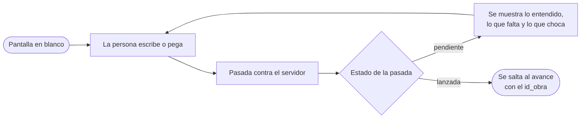

# SPEC2 · Frontend v1 — Especificación de requisitos de software

## §1 Introducción

### 1.1 Propósito

Fijar qué tiene que hacer la primera versión del `frontend/` para que una
persona encargue una novela y la lea sin tocar nunca el servidor por su cuenta.
Es un documento de requisitos, no de implementación: recoge lo que, si se decide
mal, obliga a rehacer trabajo.

SPEC1 dejó la interfaz web explícitamente fuera del alcance de v1 del backend
(SPEC1 §11). Este documento la mete dentro del suyo. No enmienda SPEC1: el
backend queda como está y la interfaz se construye contra el contrato que ya
publica.

### 1.2 Alcance del sistema especificado

Dentro: la conversación que completa el encargo hasta lanzar la obra, la
pantalla que enseña el avance mientras la obra se produce, la lista de las
tareas ya hechas, la lectura del manuscrito aceptado con su portada, su biblia,
sus críticas por capítulo y su PDF, las versiones con su puerta, el cambio del
lector, un menú que salta entre las pantallas de una obra, el cliente HTTP
generado desde el contrato y el validador visual.

Fuera: las pantallas de estado del mundo, cronología y búsqueda de pasajes; todo
lo enumerado en §11.

La medida de «terminado» de v1 es una sola: **una persona que no ha visto nunca
el sistema llega de la pantalla en blanco a la novela leída sin que nadie le
enseñe una orden de consola**.

### 1.3 Documentos base y jerarquía

| Documento | Qué aporta a este SRS | Manda sobre |
| --- | --- | --- |
| `AGENTS.md` | Frontera única, pila fijada, ciclo de edición | Frontera y pila |
| `specs/SPEC1.md` | Qué hace el backend, qué sirve y con qué forma | Comportamiento del servidor |
| `backend/openapi.yaml` | El contrato exacto del borde | Nombres de campo y formas |
| `docs/definitions.md` | Vocabularios cerrados del dominio | Palabras que aparecen en pantalla |

Si este documento contradice a alguno de los cuatro, gana el documento base y
esto es un error de este SRS. Donde SPEC1 y `openapi.yaml` discrepen, manda el
contrato: es el que se genera desde el código.

### 1.4 Convenciones

- Mismas familias de identificador que SPEC1: `RF-` funcional, `RD-` de datos,
  `RI-` de interfaz, `RNF-` no funcional, `D-` decisión, `OBJ-` objetivo. Son
  **locales a este documento** y se citan siempre con él delante: `SPEC2 RF-01`.
- La columna «Verificación» usa el vocabulario `metodo_de_verificacion` de
  `validators.md` §2.

## §2 Descripción general

### 2.1 Qué hace la interfaz y qué no

**Hace dos cosas**: recoge el encargo y enseña lo que el sistema ha producido.

**No hace una tercera**: no decide nada del dominio. No pliega el log, no juzga
si una crítica es bloqueante, no cuenta tokens, no completa el brief por su
cuenta ni detecta qué campo falta. Todo eso ya viene resuelto en la respuesta.
Una regla de dominio reimplementada aquí es una segunda verdad que divergirá de
la del backend.

### 2.2 Actores

| Actor | Qué aporta | Qué recibe |
| --- | --- | --- |
| Editor (persona) | Lo que sabe del encargo y los textos que tenga escritos | La propuesta de brief, el avance y la novela |
| `backend/` | Respuestas HTTP y el flujo de progreso | Las llamadas de la interfaz, y nada más |

### 2.3 Restricciones heredadas

De `AGENTS.md`, no negociables: la interfaz **nunca lee ficheros ni abre la base
de datos**; todo lo pide por HTTP. El contrato de la frontera es OpenAPI y se
genera, no se redacta. Pila fijada: Vite + React, aplicación de una sola página.
Español en la interfaz, y los nombres del dominio tal cual.

De SPEC1, dos que gobiernan el diseño de la pantalla del encargo: la entrevista
es **sin estado** —cada pasada recibe todo lo que la persona quiera conservar y
nada de las anteriores (SPEC1 D-20)— y la obra **se lanza sola** en cuanto el
brief está completo, sin confirmación (SPEC1 D-22).

### 2.4 Supuestos y dependencias

- El backend corre en la misma máquina y no hay autenticación: v1 del servidor
  no la tiene y esta no la inventa.
- Una obra tarda horas y cientos de tareas. Todo lo que espera lo dice en
  pantalla; nada se queda en blanco.
- El servidor no guarda el borrador del encargo entre pasadas. Si el navegador
  pierde lo escrito, la persona pierde su trabajo: de ahí RF-06 y D-03.

## §3 Objetivos medibles

Ningún objetivo tiene línea base: no hay interfaz, así que la base se declara
**pendiente de medir** en lugar de inventarla. La primera sesión completa con
una persona real es la que la fija.

Van en este orden porque el primero es el que hace que los demás signifiquen
algo: una interfaz de la que hay que salirse para encargar no es la interfaz.

| ID | Objetivo | Métrica | Cómo se mide | Línea base | Meta |
| --- | --- | --- | --- | --- | --- |
| OBJ-01 | Cero salidas de la web | Acciones que la persona tiene que hacer fuera de la interfaz para llegar de la idea a la obra leída | Recuento en un recorrido observado de principio a fin | Pendiente | Exactamente 0 |
| OBJ-02 | El encargo converge | Pasadas de entrevista hasta `estado = "lanzada"` | Campo `numero` de la pasada que lanza | Pendiente | Mediana ≤ 3; ninguna sesión por encima de 6 |
| OBJ-03 | Nada se pierde al recargar | Proporción de recargas de la pantalla del encargo que conservan lo escrito y lo pegado | Prueba automática: escribir, recargar, comparar | Pendiente | 100 % |
| OBJ-04 | Nada en blanco sin explicación | Estados de espera o de fallo que la pantalla muestra sin decir qué pasa | Recorrido por cada pantalla con el servidor lento y con el servidor caído | Pendiente | Exactamente 0 |
| OBJ-05 | El contrato no se desfasa en silencio | Cambios del borde HTTP que llegan a la rama principal sin que el cliente se regenere | La comprobación de RI-02 sobre el histórico | Pendiente | Exactamente 0 |
| OBJ-06 | El avance se nota | Segundos entre que el servidor emite un suceso y la pantalla lo muestra | Sello del evento contra el repintado, en el recorrido de aceptación | Pendiente | ≤ 2 s |

**Qué no es objetivo, y por qué.** El peso de lo que se descarga: es una
aplicación local de una sola persona, optimizarlo no mejora nada de lo que
importa y empuja a partir el código sin motivo. El número de clics para lanzar:
se cumple trivialmente quitando lo que evita que el encargo salga mal, y arruina
OBJ-02 sin que la cifra de clics se entere. Y la nota de una prueba de
usabilidad puntuada a ojo, que es ruido y no medida.

## §4 Requisitos funcionales

### 4.1 El encargo

| ID | Requisito | Verificación |
| --- | --- | --- |
| RF-01 | El encargo se presenta como una conversación: la persona escribe en lenguaje corriente o pega un texto entero, y cada envío es una pasada contra el servidor. La primera abre la entrevista; las siguientes cuelgan de su `id_entrevista` | `demostracion` |
| RF-02 | Cada pasada manda **todo** lo acumulado en el navegador —el borrador entero, todos los textos pegados y las contradicciones asumidas—, porque el servidor no recuerda nada de las anteriores | `prueba` |
| RF-03 | Tras cada pasada se muestran, sin interpretarlos, los tres resultados que devuelve: lo que ha entendido del encargo, los campos que siguen faltando con su ruta, y las contradicciones con su evidencia. La interfaz **no decide** cuáles faltan ni cuáles chocan: los pinta | `inspeccion` |
| RF-04 | Una contradicción se puede dar por asumida con un gesto. Asumirla añade su tipo a las pasadas siguientes; la contradicción se sigue mostrando, marcada | `prueba` |
| RF-05 | Cuando una pasada vuelve con `estado = "lanzada"`, la interfaz pasa sola al avance con el `id_obra` que trae, sin pedir confirmación. La entrevista queda cerrada y no se puede seguir escribiendo en ella | `prueba` |
| RF-06 | Lo que la persona lleva escrito y pegado **sobrevive a recargar la página y a cerrar el navegador**, hasta que la obra se lanza. Al lanzarse se descarta | `prueba` |
| RF-07 | Un texto pegado se muestra siempre como lo que es —material de la persona—, identificable y separado de lo que dice el sistema. Nunca se mezcla con la conversación como si lo hubiera dicho alguien | `inspeccion` |
| RF-08 | Si el servidor rechaza la pasada por tamaño, la interfaz dice cuánto sobra y no recorta nada por su cuenta | `prueba` |
| RF-09 | La ficha distingue lo obligatorio de lo opcional según lo que el servidor exige (SPEC1 RF-01, D-60): la tesis, los personajes y los arcos se pueden dejar sin tocar, y dejarlos así no los manda. La interfaz no los pide ni los marca como pendientes | `prueba` |

### 4.2 El avance

| ID | Requisito | Verificación |
| --- | --- | --- |
| RF-20 | Mientras la obra corre, la pantalla muestra lo que el servidor va empujando por el flujo abierto: capítulo en curso, tareas abiertas y tokens de entrada concurrentes frente al techo | `demostracion` |
| RF-21 | Al entrar, la pantalla se pinta con la foto de una sola consulta y solo después se engancha al flujo. Nunca se ve vacía esperando al primer suceso | `prueba` |
| RF-22 | Si el flujo se corta, la interfaz se reengancha sola y lo dice mientras tanto. Una obra que sigue corriendo no puede parecer parada porque se haya caído la conexión | `prueba` |
| RF-23 | La obra se puede detener y reanudar desde aquí. Son las dos únicas órdenes de la interfaz además de lanzar, y son control, no mantenimiento | `prueba` |
| RF-24 | Al cerrarse la obra, la pantalla lo dice y ofrece la lectura. No hace falta estar mirando para enterarse: al volver a entrar, el estado es el mismo | `demostracion` |
| RF-25 | La interfaz no calcula nada del avance: los tokens, el techo y el capítulo en curso se muestran tal como vienen | `inspeccion` |
| RF-26 | Las tareas ya hechas de la obra se ven en una pantalla propia, agrupadas por capítulo y en el orden en que las sirve el servidor: qué rol, qué tarea, capítulo y escena, cuánto tardó y si pasó los hooks de su paso. Solo lo esencial: tokens, coste e intentos no se enseñan (D-09). Se puede volver a pedir la lista sin salir de la pantalla | `prueba` |
| RF-27 | «Pasó los hooks» se lee del veredicto `final` que la `Traza` ya trae (SPEC1 RI-15): pasa si todos los hooks dicen que pasa, no pasa si alguno no, y una tarea sin hooks no dice nada. La interfaz no revisa el texto por su cuenta | `inspeccion` |

### 4.2 bis Moverse por una obra

| ID | Requisito | Verificación |
| --- | --- | --- |
| RF-30 | Las pantallas de una obra —Avance, Tareas, Lectura y Versiones— llevan arriba el mismo menú, que salta de una a otra con un clic y marca en cuál se está. Cada pantalla conserva su propia dirección, así que también se pueden abrir en pestañas del navegador | `prueba` |

### 4.3 La lectura

| ID | Requisito | Verificación |
| --- | --- | --- |
| RF-40 | El manuscrito se lee en orden, agrupado por capítulo y escena, con solo el texto aceptado. Se puede leer una obra a medio producir: lo que hay es lo que se ve | `demostracion` |
| RF-41 | Un capítulo que el servidor marca se muestra marcado, con el aviso de que tiene defectos sin resolver. cuáles son se ve con «Ver críticas» (RF-75) | `inspeccion` |
| RF-42 | La ficha de la obra —título, capítulos cerrados, capítulos marcados y críticas abiertas— acompaña a la lectura como recuento, sin detalle | `prueba` |
| RF-43 | La lectura es cómoda para leer seguido: texto a ancho de lectura y navegación por capítulos. Es el entregable de todo el sistema, no un volcado de depuración | `inspeccion` |

### 4.4 Esperas y fallos

| ID | Requisito | Verificación |
| --- | --- | --- |
| RF-60 | Toda petición en curso tiene estado visible, y todo fallo dice qué ha pasado y qué se puede hacer. Ninguna pantalla se queda en blanco ni girando sin fin | `inspeccion` |
| RF-61 | Un rechazo del servidor se muestra con el mensaje que manda el servidor, en español, sin traducirlo ni adornarlo. Los campos que faltan se señalan por su ruta, como los nombra él | `prueba` |
| RF-62 | Un fallo de red se distingue de un rechazo del servidor, y el primero se puede reintentar sin volver a escribir nada | `prueba` |

### 4.5 La portada, el índice y la biblia

**El problema.** La lectura enseñaba el texto y un índice, pero no a quién va
dedicada la obra ni quién y dónde está cada cosa: el servidor ya sirve los
hechos de la biblia con los capítulos en que se usan (SPEC1 RF-87) y la
interfaz no los pintaba. Tampoco se podía decidir nada sobre una versión, ni
ver por qué un capítulo está marcado, ni llevarse el libro.

| ID | Requisito | Verificación |
| --- | --- | --- |
| RF-70 | La lectura abre con una **portada**: el título, «Para» y el nombre del destinatario, y la dedicatoria, tal como vienen en la ficha de la obra (SPEC1 RF-177). Sin destinatario, solo el título. El índice de capítulos navega a cada uno y marca los que la versión leída cambió respecto de su base, tal como vienen en su lista de capítulos cambiados | `prueba` |
| RF-71 | La **ficha de personajes y lugares** pinta los hechos de la biblia de la versión leída, agrupados por su tipo, con su nombre, su licencia y un enlace a cada capítulo en que se usa, que lleva a ese capítulo de la lectura. Un hecho sin capítulos lo dice. Qué capítulos son lo dice el servidor: la interfaz no lo deduce del texto | `prueba` |

### 4.6 Las versiones: leer una, publicarla y saber por qué no pasa

| ID | Requisito | Verificación |
| --- | --- | --- |
| RF-72 | La lectura lee por defecto la versión de referencia y se puede elegir otra de las que sirve el servidor; la elegida queda en la dirección, así que se puede compartir. La pantalla dice qué versión se lee y si es la publicada | `prueba` |
| RF-73 | Una pantalla de **Versiones**, cuarta del menú de la obra, lista cada versión con su número, su base, sus capítulos cambiados, si ha terminado, si es la publicada y de dónde sale: del alta, de rehacer o de un cambio del lector, con el hecho y sus dos nombres | `prueba` |
| RF-74 | **Publicar** es un botón de cada versión terminada, y la **puerta** se puede comprobar antes. Si la versión no pasa —al comprobarla o al publicarla—, la pantalla pinta cada fallo con su validador tal como lo nombra el servidor, su capítulo o «de la obra», y su detalle. La interfaz no enumera los validadores: uno nuevo en el servidor aparece sin tocarla (D-22). Si la puerta o la publicación dicen `comprobacion_formal: sin_comprobacion` (SPEC1 RF-155), la pantalla dice que la versión pasa o sale sin comprobación formal | `prueba` |

### 4.7 Las críticas de un capítulo

| ID | Requisito | Verificación |
| --- | --- | --- |
| RF-75 | Cada capítulo de la lectura tiene «Ver críticas», que pide las de ese capítulo en la versión leída y las pinta con su dimensión, su severidad, su estado, quién la detectó, su evidencia y su acción sugerida, tal como vienen. Es por donde se ve el fallo que devuelve cualquier validador como `Crítica` (D-21) | `prueba` |

### 4.8 El cambio del lector

| ID | Requisito | Verificación |
| --- | --- | --- |
| RF-76 | Cada hecho de la ficha tiene «Cambiar el nombre»: un campo para el nombre nuevo y una orden que lo manda (SPEC1 RF-170). Si el servidor lo admite, la pantalla dice qué versión nace y qué capítulos se van a reescribir, y ofrece ir al avance. Si lo rechaza —sin menciones, versión sin terminar, obra produciendo, nombre igual—, pinta el mensaje del servidor. La interfaz no decide si el cambio cabe: lo decide el servidor (D-23) | `prueba` |

### 4.9 El PDF

| ID | Requisito | Verificación |
| --- | --- | --- |
| RF-77 | La lectura tiene «Descargar PDF», que descarga el PDF que fabrica el servidor de la versión que se está leyendo (SPEC1 RF-178). La interfaz no compone el PDF | `prueba` |

### 4.10 El validador visual

| ID | Requisito | Verificación |
| --- | --- | --- |
| RF-78 | Una comprobación ejecutable, `npm run validar-visual`, levanta un backend de prueba sembrado con un ejecutor fingido —que no gasta— y la interfaz, abre la lectura en Chromium sin cabeza a dos anchos, escritorio y móvil, y mira que la **portada** enseña el título y la dedicatoria, que el **índice** trae un enlace por capítulo servido y que pulsarlo deja ese capítulo a la vista, y que la **ficha** enseña cada personaje y cada lugar servidos con un enlace por capítulo que lleva a él. Cada comprobación coteja lo que la página enseña con lo que la API sirve | `demostracion` |
| RF-79 | Lo que falla sale como **fallo registrable**: una línea JSON por fallo con la comprobación, el ancho, el detalle y a quién vuelve —`frontend` si la API lo servía y la página no lo enseña, `backend` si la API no lo servía—, y la orden termina con código distinto de cero. No escribe nada en disco. Sin fallos lo dice y termina con cero (D-24) | `prueba` |

**Decisiones del bloque.**

| ID | Decisión | Por qué |
| --- | --- | --- |
| D-20 | **Portada, biblia, versión leída, críticas y PDF van dentro de la lectura**; publicar va en una pantalla propia | Son cosas que se miran leyendo: el enlace de un personaje lleva a su capítulo y el capítulo a sus críticas, y separarlas obligaría a saltar de pantalla para cada consulta. Publicar y la puerta son decisiones sobre versiones enteras, no sobre lo que se está leyendo, y mezclarlas con el texto las haría fáciles de pulsar sin querer |
| D-21 | **Las críticas se piden por capítulo y a demanda**, no en una pantalla aparte. Se retira el aviso sin detalle de v1 | Un capítulo marcado con un aviso que no se podía abrir era el callejón que v1 aceptó a sabiendas. Pedirlas al pulsar mantiene la lectura ligera: una obra larga tiene cientos de críticas y casi nadie quiere verlas todas. Es también por donde volverá el fallo del demostrador formal, que sale como `Crítica` |
| D-22 | **La puerta se pinta como lista genérica**: validador, capítulo y detalle tal como vienen | Lo decidió el dueño: el validador formal llega por otra tarea y tiene que aparecer al fusionar sin tocar la interfaz. Traducir cada validador a una etiqueta obligaría a enumerarlos en el cliente; el nombre que da el servidor ya es legible |
| D-23 | **El lector cambia un nombre desde la ficha de la biblia**, un hecho cada vez, y el servidor decide si se admite | Lo decidió el dueño (SPEC1 D-74): se elige un hecho de la lista y se le da su valor nuevo, sin subrayar texto libre. Repetir en la pantalla las condiciones del servidor —última versión terminada, menciones— sería una segunda verdad; el rechazo del servidor ya dice por qué |
| D-24 | **El validador visual es un programa con Playwright, no un paseo con el navegador MCP**, y su fallo vuelve a quien corresponde por su salida, no como `Crítica` | Un paseo de un agente no es repetible ni deja un fallo que se pueda registrar; el programa sí, y corre sin gastar contra datos sembrados. El servidor MCP de `.claude/mcp.json` sigue para mirar a ojo, y el programa usa **la misma versión de Playwright que ese servidor**, así que el navegador que instala la orden de `CLAUDE.md` sirve a los dos. No es una `Crítica` porque una `Crítica` es de la novela, con dimensión y evidencia del texto; una página mal pintada es un defecto del código, y vuelve a quien edita `frontend/` —o `backend/` si el dato no se servía— igual que una prueba que no pasa |

## §5 Requisitos de datos

| ID | Requisito | Verificación |
| --- | --- | --- |
| RD-01 | **La interfaz no tiene almacén de dominio.** Lo que muestra son respuestas del servidor, consultadas y cacheadas contra él. No hay copia local de capítulos, críticas ni estado | `inspeccion` |
| RD-02 | Lo único que la interfaz guarda por su cuenta es el borrador del encargo en curso —campos, textos pegados, contradicciones asumidas e `id_entrevista`—, en el navegador y hasta que la obra se lanza (RF-06) | `inspeccion` |
| RD-03 | Todo valor de vocabulario cerrado —severidad, estado, tipo de contradicción— se muestra tal cual o traducido a una etiqueta legible, nunca ampliado ni agrupado con otro «porque se ve mejor» | `analisis` |
| RD-04 | Las palabras del dominio que aparecen en pantalla están definidas: las de la obra y el mundo en `definitions.md`, y las del proceso —`Entrevista`, `Crítica`, `Traza`— en `architecture.md`, que es donde `definitions.md` las remite. Una palabra en pantalla que no está en ninguno de los dos, o sobra o falta una definición | `analisis` |

## §6 Requisitos de interfaz

| ID | Operación | Requisito | Verificación |
| --- | --- | --- | --- |
| RI-01 | Todas | Toda llamada pasa por un único cliente en `compartido/`. Ninguna pantalla habla con el servidor por su cuenta: es lo que hace que la frontera se revise leyendo una carpeta | `analisis` |
| RI-02 | Todas | Las funciones y los tipos de ese cliente se **generan desde `backend/openapi.yaml`** y no se editan a mano. Una comprobación regenera y falla si lo generado no coincide con lo commiteado, igual que RNF-09 hace en el backend. No hay orden de mantenimiento que recordar | `prueba` |
| RI-03 | `POST /entrevistas` · `/entrevistas/{id_entrevista}/pasadas` | §4.1 | `demostracion` |
| RI-04 | `GET /obras/{id_obra}/progreso` | Flujo de sucesos, con reenganche (RF-22) | `prueba` |
| RI-05 | `GET /obras/{id_obra}/progreso/ahora` | La foto con la que se pinta antes de engancharse (RF-21) | `prueba` |
| RI-06 | `GET /obras/{id_obra}` · `/obras/{id_obra}/manuscrito` | §4.3 | `demostracion` |
| RI-07 | `POST /obras/{id_obra}/detener` · `/obras/{id_obra}/reanudar` | RF-23 | `prueba` |
| RI-08 | `GET /obras/{id_obra}/trazas` | RF-26 y RF-27, sin filtros | `prueba` |

Además, las lecturas y órdenes de §4.5 a §4.9 pasan por el mismo cliente:
`GET /obras/{id_obra}/hechos`, `/versiones`, `/criticas` y `/manuscrito` con
`?version=`; `GET /obras/{id_obra}/versiones/{numero}/puerta`;
`POST /obras/{id_obra}/versiones/{numero}/publicar`; `POST /obras/{id_obra}/cambios`;
y el enlace de `GET /obras/{id_obra}/pdf`, que el cliente compone y la pantalla
solo pinta (RF-70 a RF-77).

Los demás endpoints del contrato existen y la interfaz no los llama. Que estén
servidos no obliga a pintarlos.

## §7 Requisitos no funcionales

| ID | Requisito | Verificación |
| --- | --- | --- |
| RNF-01 | La interfaz no lee ficheros ni abre la base de datos. Si falta un dato se añade un endpoint; no existe el atajo | `analisis` |
| RNF-02 | Una carpeta por funcionalidad, sin importaciones entre ellas. Lo común sube a `compartido/`; entre dos pantallas se duplica antes que acoplarse | `analisis` |
| RNF-03 | No hay capa de dominio en el cliente: ni `services/`, ni `models/`, ni `domain/` | `inspeccion` |
| RNF-04 | Cómo llega el avance está encapsulado en el cliente de API. Cambiar de flujo empujado a sondeo no toca ninguna pantalla | `inspeccion` |
| RNF-05 | Español en toda la interfaz y en los mensajes de error | `inspeccion` |
| RNF-06 | La interfaz arranca en desarrollo y se construye para usarla, cada cosa con una sola orden. Ponerla en pie no es un procedimiento | `demostracion` |

## §8 Decisiones de diseño de esta versión

| ID | Decisión | Por qué |
| --- | --- | --- |
| D-01 | **v1 es encargar, ver avanzar, ver lo hecho y leer**, y la lectura trae lo que se mira leyendo (D-20). Estado del mundo, cronología y búsqueda de pasajes quedan fuera | Encargar, ver avanzar y leer son las tres cosas sin las cuales la web no sirve para nada. Lo hecho entra porque quien mira una obra de horas quiere saber qué ha pasado además de qué pasa ahora; las otras tres son instrumentos de depuración que hoy se miran mejor por el contrato |
| D-02 | **El encargo se presenta como una conversación**, aunque por dentro sean pasadas sin estado | Quien encarga una novela no sabe de antemano qué se le va a pedir, que es justo el problema que SPEC1 §4.8 identificó. Un formulario obliga a saberlo antes de empezar. El precio es que la web carga con la memoria que el servidor no tiene, y se paga en D-03 |
| D-03 | **El borrador del encargo vive en el navegador**, y se manda entero en cada pasada | Es la consecuencia directa de que la entrevista sea sin estado (SPEC1 D-20). Guardarlo en el servidor sería pedirle que recuerde, que es lo que hace el techo de contexto verificable antes de gastar. Guardarlo solo en memoria convierte una recarga accidental en la pérdida de la carta que la persona pegó |
| D-04 | **El avance llega por el flujo que el servidor empuja**, con una foto inicial y reenganche automático | El servidor ya lo sirve y es lo que hace que una obra de horas no parezca colgada. El sondeo es más simple pero repite trabajo y se nota lento. La foto inicial y el reenganche son el precio, y son dos requisitos, no una arquitectura |
| D-05 | **El cliente se genera desde el contrato y hay una comprobación que falla si se desfasa** | Es el mismo trato que el backend ya se da a sí mismo (SPEC1 RNF-09 y D-11). Sin la comprobación, regenerar es un paso manual que se olvida, y un paso manual periódico es un defecto de diseño. Con ella, mover la frontera pasa por el diff en los dos lados |
| D-06 | **TypeScript**, no JavaScript | No es una preferencia de estilo: es lo que hace que D-05 sirva de algo. Con tipos generados, un campo que el servidor renombra rompe al construir; sin ellos, rompe en la pantalla de alguien |
| D-08 | **Un menú dentro de la obra, no pantallas a la vez** | Saltar con un clic basta para seguir una obra, y cada pantalla sigue teniendo su dirección para quien quiera varias pestañas. Poner dos pantallas juntas en la misma vista obliga a rehacerlas para que quepan. El menú no llega al encargo ni a otras obras: no hay listado de obras (§12) |
| D-09 | **La lista de tareas enseña lo esencial** | Se lee de un vistazo quién hizo qué y si salió bien. Los tokens y el coste siguen en el contrato para quien mida el gasto, y añadirlos más adelante no cambia nada de lo de arriba |

## §9 Trazabilidad

| Bloque | De dónde sale |
| --- | --- |
| §4.1 El encargo | SPEC1 §4.8 (RF-70 a RF-79; D-20 a D-24) |
| §4.2 El avance | SPEC1 RF-53, RF-04, RI-08, RI-09; las tareas hechas, SPEC1 RI-06 y RI-15 |
| §4.2 bis Moverse por una obra | D-08 |
| §4.3 La lectura | SPEC1 RF-50, RI-02, RI-03 |
| §5 Datos | `AGENTS.md` (frontera única); SPEC1 RD-08 |
| §6 Interfaz | SPEC1 D-11, RNF-09, RI-10 |
| §7 No funcionales | `AGENTS.md` (frontera y pila); skill `frontend-react` §2 y §3 |
| §4.5 a §4.9 Portada, biblia, versiones, críticas, cambio del lector y PDF | SPEC1 RF-51, RF-87, RF-111 a RF-117, RF-146, RF-147 y §4.18; decisiones del dueño en el interrogatorio de la fase E |
| §4.10 El validador visual | SPEC1 D-37 (el servidor de navegador); `validators.md` §6 |

## §10 Verificación y criterios de aceptación

La verificación del código es la de `validators.md` §6 y no se duplica aquí. Lo
que fija este SRS es cuándo v1 está terminada:

1. Un borrador al que le faltan la edad y el tono, más una carta pegada que los
   contiene, se completa y lanza la obra **sin salir de la web** (OBJ-01), y la
   pantalla salta sola al avance.
2. Recargar la página a media conversación conserva todo lo escrito y lo pegado
   (OBJ-03).
3. Un brief con una contradicción queda sin lanzar hasta que se asume desde la
   pantalla, y entonces lanza.
4. Con el flujo cortado a mitad, la pantalla del avance lo dice, se reengancha
   sola y no pierde el estado (RF-22).
5. Con el servidor caído del todo, ninguna de las cuatro pantallas queda en
   blanco ni girando: las cuatro dicen qué pasa (OBJ-04).
6. El manuscrito de una obra a medio producir se lee, y un capítulo marcado sale
   marcado.
7. Se cambia un campo del borde HTTP en el backend, se regenera el contrato y la
   comprobación del cliente falla (OBJ-05).
8. Un encargo con título, época, premisa y número de capítulos, sin tesis, sin
   personajes y sin arcos, se lanza sin que nadie los pida.
9. Desde cualquiera de las pantallas de una obra se llega a las demás con un
   clic, y la de tareas enseña cada tarea hecha con su veredicto.
10. La lectura de una obra con destinatario abre con su dedicatoria, y la ficha
   lleva de cada personaje al capítulo en que aparece.
11. Una versión que no pasa la puerta dice, al comprobarla y al publicarla, cada
   fallo con su validador y su capítulo, también el de un validador que la
   interfaz no conoce; la que pasa se publica y sale como publicada.
12. Pedir un cambio de nombre desde la ficha dice qué versión nace y qué
   capítulos se reescriben, y un rechazo del servidor se lee tal cual.
13. `npm run validar-visual` pasa contra el backend sembrado, y con la portada
   rota a propósito sale con un fallo que dice que vuelve a `frontend`.

## §11 Fuera del alcance de v1

Las pantallas de estado plegado y cronología, y la búsqueda de pasajes por
parecido: el servidor las sirve y la interfaz no las pinta. Autenticación y
varios usuarios, porque el backend tampoco los tiene. Ver varias obras a la vez
o un listado de obras producidas: v1 trabaja sobre la obra que se acaba de
lanzar o sobre un `id_obra` que se conoce. Edición directa de nada: la
interfaz no modifica ningún artefacto; da órdenes —lanzar, detener, reanudar,
publicar y cambiar un nombre— y el servidor decide. Rehacer desde un capítulo
desde la pantalla. Cambiar otra cosa que el nombre de un hecho, o subrayar texto
libre (D-23). Instalación fuera de la máquina de desarrollo.

## §12 Decisiones abiertas

Ninguna bloquea la fase 2.

- [ ] Con qué biblioteca se consulta y se cachea el estado del servidor.
      TanStack Query es el candidato obvio, pero la primera pantalla no lo
      necesita para escribirse y decidirlo antes de tener tres pantallas es
      decidirlo a ciegas.
- [ ] Cómo se vuelve a una obra pasada sin recordar su `id_obra`. Hoy no hay
      listado de obras en el contrato; añadirlo es tocar el backend, así que
      queda para cuando haya más de una obra que mirar.

## §13 Docs que se ponen al día en la fase 3

`architecture.md` §7: el árbol de `features/` gana `tareas` y el párrafo del
frontend dice que las pantallas de una obra comparten menú. La skill
`.claude/skills/frontend-react/`: su §2 nombra la carpeta `tareas`.
`validators.md`: el método de RF-09, RF-26, RF-27, RF-30 y RI-08 en la matriz de
§8. `AGENTS.md`: la fila de `frontend/` nombra la pantalla de tareas.

De §4.5 a §4.10: `architecture.md` §7, el árbol de `features/` gana
`versiones`, la lectura trae portada, biblia, críticas y PDF, y `scripts/` el
validador visual. La skill `frontend-react`: su §2 nombra `versiones`.
`validators.md`: el método de RF-70 a RF-79 en §8 y el validador visual en §6.
`AGENTS.md`: la fila de `frontend/`.
